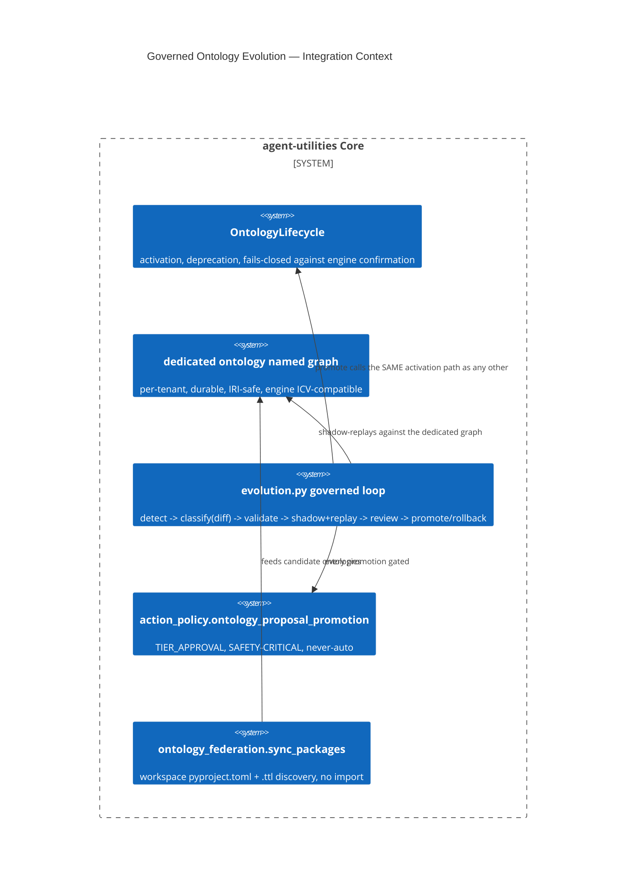

# Design Document: Governed Ontology Activation + Evolution (TBox, ICV, Shadow-Replay)

> One cohesive architectural decision authored together (commits `00089171`/
> `82c09243` "unblock ontology activation + govern ontology change as a
> proposal", plus two stacked follow-ups `93c56b59` D-75-5 deprecation and
> `c6da6d69` D-75-7 shadow-graph GC). Full program tracking lives at
> `reports/deferred/lane-7.5-1.8.md` (D-75-1..10) — this doc summarizes the
> architecture; that file is the honest record of what remains open.

CONCEPT:AU-KG.ontology.activation-fails-closed ·
CONCEPT:AU-KG.ontology.activation-icv-fallback ·
CONCEPT:AU-KG.ontology.competency-query-regression ·
CONCEPT:AU-KG.ontology.dedicated-tbox-graph ·
CONCEPT:AU-KG.ontology.deprecation-workflow ·
CONCEPT:AU-KG.ontology.evolution-governed-loop ·
CONCEPT:AU-KG.ontology.negative-results-queryable ·
CONCEPT:AU-KG.ontology.rdf-materialization-iri-safe ·
CONCEPT:AU-KG.ontology.workspace-provider-discovery ·
CONCEPT:AU-KG.ontology.shadow-graph-gc

## KG Analysis (Required)

### Nearest Existing Concepts

| Concept ID | Name | Similarity | Pillar |
|---|---|---|---|
| `AU-KG.ontology.derived-compatibility-band` (etc., "drift-proof release" cluster) | adjacent ontology-durability concern, different failure mode (version drift, not activation/evolution) | 0.30 | KG |
| `AU-OS.governance.truthful-state-invariant` | sibling truthfulness-bug fix, same general class ("reports true when it isn't") as `activation-fails-closed` | 0.35 | OS |

### Extension Analysis

- **Primary Extension Point**: `knowledge_graph/ontology/lifecycle.py`
  (`OntologyLifecycle`) and `knowledge_graph/ontology/evolution.py` (new
  governed-evolution module).
- **Extension Strategy**: augment (lifecycle activation correctness) + new
  (the detect→classify→validate→shadow→review→promote governance loop).
- **New Concept Required?**: Yes — ten concepts, one cohesive design,
  because each names an independently falsifiable piece of the same
  ontology-evolution architecture.

### New Concept Proposal

**The linchpin — `AU-KG.ontology.dedicated-tbox-graph`**: TBox axioms were
headed into the same mixed property graph an agent's ABox instances live in.
That graph's opaque, non-IRI node ids trip the engine's SHACL/ICV write guard
(`EPISTEMIC_GRAPH_ICV_NATIVE_WRITES`) when it projects to RDF. Fix: a
dedicated, durable, per-tenant `ontology` named graph
(`tenant_graph_name`), with `:HostedOntology` typed nodes keyed
`(tenant, graph, iri, version)`. The Rust engine's own LPG→RDF projection
code is explicitly **out of scope** (flagged D-75-9, ACCEPTED-RISK for
`agent-packages/epistemic-graph`) — this fix does not touch it.

**Activation correctness:**
- `AU-KG.ontology.activation-fails-closed` — `load()`/`set_active()` used to
  report `"active": true` even when a live engine's `add_triples` **rejected**
  the axioms (e.g. an SHACL/ICV guard fired). Fix: with an engine attached,
  `activated = activate AND engine_report['loaded_to_engine']`; offline,
  `active` stays the requested-intent flag (nothing to fail against). Does
  not retry or auto-repair a rejected write.
- `AU-KG.ontology.activation-icv-fallback` — the OWL-RL/SHACL guardrail code
  existed, but `owlrl`/`pyshacl` were absent from the serving dependency
  closure, so the gate silently degraded to an `ImportError` "soft warning,"
  letting a bad candidate be marked active anyway. Fix: a new
  `ontology-guardrails` extra (owlrl + pyshacl, deliberately **not**
  `owlready2`/full OWL-DL) is now wired into the default `serving` extras
  bundle.
- `AU-KG.ontology.rdf-materialization-iri-safe` — the rdflib SPARQL-fallback
  path (used when there is no engine / degraded mode) promoted opaque
  property-graph ids straight into `URIRef`s without guaranteeing IRI
  legality. Fix: percent-encode (matching the existing `_shacl_iri`
  convention in `envelope_ingest.py`). Only covers the rdflib fallback path —
  the native engine's own projection is the same D-75-9 out-of-scope item.

**Governed change:**
- `AU-KG.ontology.evolution-governed-loop` — the clearest single decision of
  the cluster: ontology change now runs detect → classify (a **deterministic
  diff, never an LLM**) → validate (OWL-RL/SHACL) → shadow + replay → review
  → promote/rollback, gated by the *same* `action_policy` decision point
  (`ontology_proposal_promotion`, TIER_APPROVAL, SAFETY-CRITICAL, never-auto)
  every other evolution proposal already uses. Deliberately reuses
  `OntologyLifecycle.update`'s existing bi-temporal versioning rather than
  inventing a separate migration store.
- `AU-KG.ontology.competency-query-regression` — the regression signal used
  to replay a candidate against its shadow graph is deliberately **generic
  and structural** (4 SPARQL count queries: class / object-property /
  datatype-property / triple count), *not* domain-specific competency
  questions; a `queries=` param lets a caller supply their own. Confirmed
  **still open** in `lane-7.5-1.8.md` (D-75-3) — a real per-domain
  competency-question corpus is explicitly out of scope for this lane.
- `AU-KG.ontology.negative-results-queryable` — a rejected or denied
  proposal is never deleted; it stays a durable, queryable record
  (`status: rejected`) so "why was X not promoted" is answerable later.
  Deliberately does not purge or age out rejected records.
- `AU-KG.ontology.shadow-graph-gc` (D-75-7) — a rejected proposal's throwaway
  shadow graph used to leak (only *promotion* called `discard_shadow()`).
  Fix: `review_ontology_proposal()` now calls `discard_shadow()` on
  rejection too. Deliberately does **not** add a periodic age-based sweep for
  the never-reviewed/abandoned case — the deferred item frames the two as
  alternatives ("and/or") and only the rejection half is closed; the sweep
  half remains an open residual.
- `AU-KG.ontology.deprecation-workflow` (D-75-5) — a superseded-but-inactive
  hosted-ontology version was indistinguishable from a deliberately-sunset
  one. Fix: a purely advisory `deprecated` flag, an axis independent of
  `active` (a version can be deprecated **and** still active mid-migration),
  with `set_deprecated()`/`deprecated_only` mirroring the existing
  `active_only` filter.

**Discovery:**
- `AU-KG.ontology.workspace-provider-discovery` — `sync_packages` only
  discovered ontology providers via installed-package entry points
  (`importlib.metadata`), so a sibling `agent-packages/*` repo checked out in
  the workspace but not `pip install -e`'d was invisible — **65 additional
  providers / 146 `.ttl` files** previously missed. Fix: statically parses
  each workspace repo's `pyproject.toml` for the same entry-point group (no
  import — auditable-manifest discipline) and globs `.ttl` files off disk.
  Deliberately best-effort/silent-skip for non-provider repos.

- **Augments Pillar**: KG (domain `ontology`).
- **15-Phase Pipeline Integration**: enrichment/evolution phase — the
  governed loop is the sole path for any ontology change to reach `active`.
- **Justification**: no existing concept covered a *governed*, replay-tested,
  reversible ontology-change lifecycle with a dedicated durable substrate;
  each of the ten names an independently falsifiable guarantee within that
  one architecture.

## C4 Context Diagram

## Data Flow

1. **ORCH**: `action_policy` gates every promotion identically to any other
   evolution proposal — no separate approval path invented.
2. **KG**: this IS the KG-pillar ontology-durability architecture — the
   dedicated TBox graph, activation confirmation, and rejected-proposal
   retention are all direct graph-state concerns.
3. **AHE**: the governed loop is itself an evolution-flywheel instance
   (detect/classify/validate/review/promote mirrors the general evolution
   shape used elsewhere in the codebase).
4. **ECO**: exposed via `mcp/tools/ontology_tools.py`.
5. **OS**: fail-closed activation (never report success the engine didn't
   confirm) is the OS-pillar truthfulness invariant applied to ontology
   state specifically.

## Risk Assessment

- **Blast Radius**: every hosted ontology version; every workspace-discovered
  ontology provider.
- **Backward Compatible**: Yes — additive governance around an existing
  activation path.
- **Breaking Changes**: None.
- **What would make this wrong later** (recorded honestly, per
  `reports/deferred/lane-7.5-1.8.md`):
  - **D-75-3** (competency-query-regression) remains an intentionally weak,
    generic structural proxy — a real per-domain competency-question corpus
    does not exist yet.
  - **D-75-7**'s residual — no periodic sweep exists for a shadow graph from
    a proposal that is never reviewed at all (only the rejection path is
    closed).
  - **D-75-9** — the native engine's own LPG→RDF projection is
    ACCEPTED-RISK, unaddressed by this design; a caller that writes ABox
    data directly into the ontology graph, bypassing this module, would
    reintroduce the exact mixing problem `dedicated-tbox-graph` exists to
    prevent.
  - **D-75-10** and other open items in the same tracking file remain
    genuinely open — this doc does not claim the program is fully closed.
