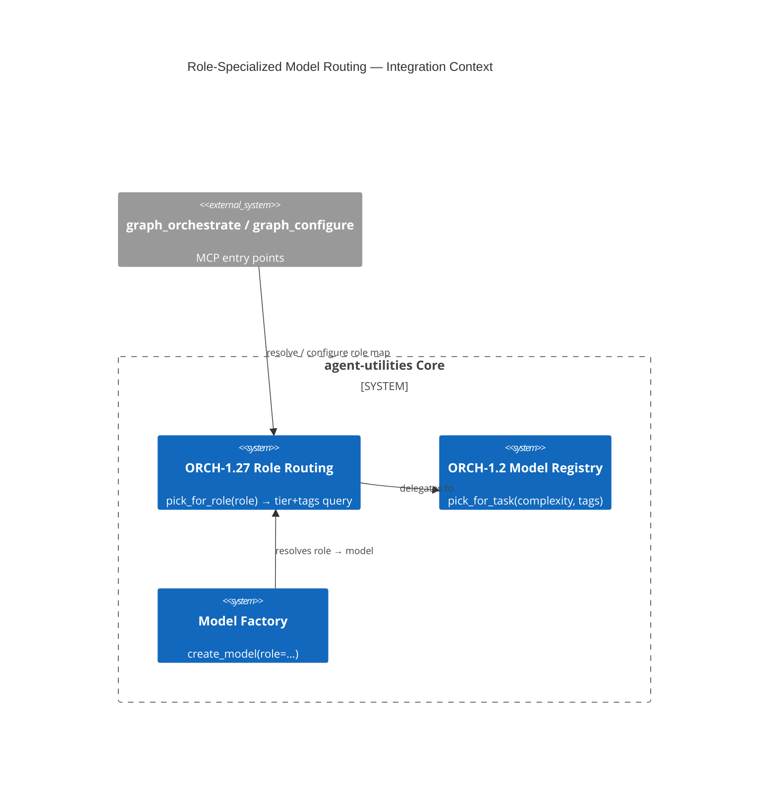

# Design Document: Role-Specialized Model Routing (ORCH-1.27)

> Assimilates Quarq Agent's "three specialized models" pattern (planner / generator /
> learner) into agent-utilities — but as **role→tier bindings over the existing model
> registry** rather than hardcoded model IDs, so any provider pool works and degrades
> gracefully. First feature on the memory-first synergy critical path; unblocks the HyDE
> planner (KG-2.12), the background learner (KG-2.13), and the benchmark judge (AHE harness).

## Research Provenance

| Source | Location | Behavior assimilated |
|---|---|---|
| Quarq `agent-oss/agent.py` | `:58-92` | Three distinct `ChatOpenAI` clients: `retrieval_llm`=gpt-4o-mini (planner), `gen_llm`=gpt-4.1 (generator), `learn_llm`=gpt-4.1 (learner) |
| Quarq dispatch | `:1939` (planner), `:2586` (generator), `:3303/:3646` (learner) | Each role invoked at its own pipeline stage |

**Superiority delta:** Quarq pins literal model IDs. We bind *roles → (tier, tags) registry
queries* resolved at runtime via the existing `pick_for_task`, so the same configuration runs
on any pool (local LM Studio, cloud frontier, mixed) and falls back by tier when a preferred
model is absent — impossible with Quarq's hardcoded clients.

## KG Analysis (Required)

### Nearest Existing Concepts

<!-- kg_search("specialized model routing by role planner generator learner", top_k=5) -->

| Concept ID | Name | Similarity | Pillar |
|---|---|---|---|
| ORCH-1.2 | Specialist Routing & Discovery | 0.83 | ORCH-1 |
| AU-ORCH.optimization.optimize-skill-prompt-gepa | RLM Specialist Selection | 0.71 | ORCH-1 |
| OS-5.2 | Cognitive Scheduler / Budget Routing | 0.68 | OS-5 |
| KG-2.3 | Unified Retrieval | 0.41 | EG-KG.compute.backend |
| AHE-3.2 | Agentic Evolution | 0.38 | AHE-3 |

### Extension Analysis

- **Primary Extension Point**: `ORCH-1.2` (Specialist Routing & Discovery) — similarity 0.83 ≥ 0.70, so we MUST extend.
- **Extension Strategy**: `augment` — add a role-binding layer atop `ModelRegistry.pick_for_task`.
- **New Concept Required?**: Yes — `ORCH-1.27` as an explicit sub-concept of ORCH-1.2 for traceability (per user decision to mint sub-concept IDs). It augments, does not replace, ORCH-1.2.

### New Concept Proposal

- **Proposed ID**: `CONCEPT:AU-ORCH.routing.conductor-per-step-model`
- **Augments Pillar**: ORCH
- **15-Phase Pipeline Integration**: Phase 2 (Structure/routing) — role resolution at agent-spawn time.
- **Justification**: ORCH-1.2 covers *which specialist agent* handles a task; ORCH-1.27 adds the orthogonal axis of *which model tier a functional role* (planner/generator/learner/judge) binds to. Distinct enough to tag, small enough to be a pure augmentation of `pick_for_task`.

## C4 Context Diagram

## Data Flow

1. **ORCH**: The orchestrator/agent-spawn path calls `registry.pick_for_role("planner")` instead of guessing a tier; `model_factory.create_model(role=...)` resolves to a concrete model.
2. **KG**: No new nodes. Role map is config (`AgentConfig.role_routing` / registry `role_routing` field), optionally persisted via `graph_configure`.
3. **AHE**: The benchmark judge (AHE harness) requests the `judge` role; self-improvement can later tune the role→tier map.
4. **ECO**: Exposed through existing `graph_orchestrate` (resolve) and `graph_configure` (set map) MCP tools — no new tool.
5. **OS**: Honors the existing budget-pressure tier-downgrade knob (`enable_model_tier_downgrade`, OS-5.2): role resolution passes through `pick_for_task` which already respects tier fallback.

## Risk Assessment

- **Blast Radius**: `models/model_registry.py` (additive method + optional field), `core/model_factory.py` (new optional `role` kwarg), `core/config.py` (default role map). All additive.
- **Backward Compatible**: Yes — `role_routing` defaults to empty (falls back to a built-in default map); `pick_for_task` untouched; `create_model(role=None)` preserves current behavior.
- **Breaking Changes**: None.

## Wiring (Wire-First, ≤3 hops)

- `graph_orchestrate_endpoint` (MCP) → engine spawn → `registry.pick_for_role` = **2 hops**.
- `graph_configure_endpoint` (MCP) → set `role_routing` = **2 hops**.
