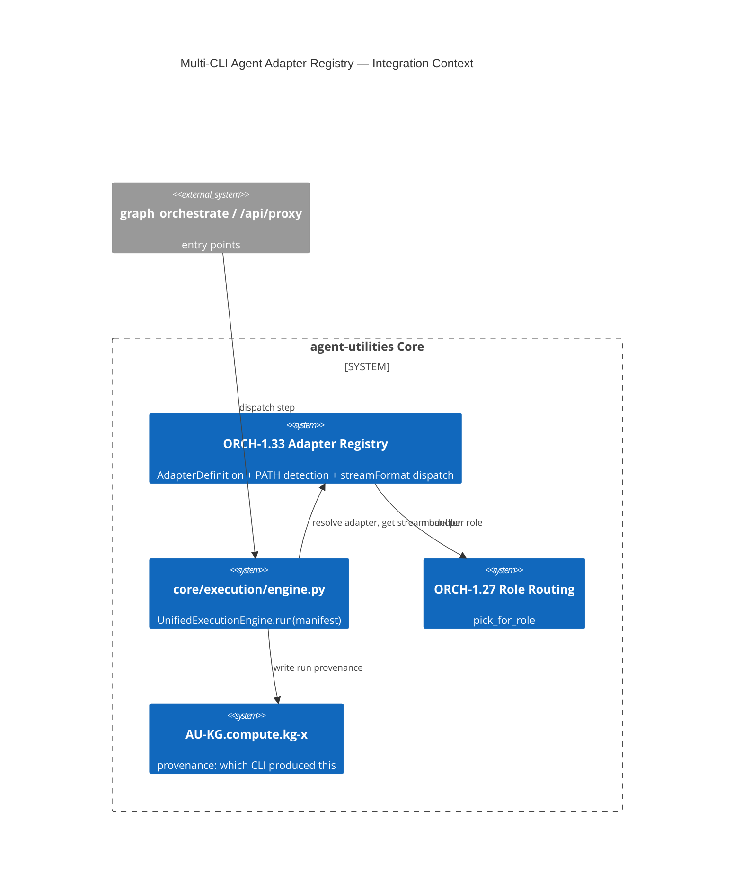

# Design Document: Multi-CLI Agent Adapter Registry (ORCH-1.33)

> Assimilates open-design's declarative runtime-adapter pattern: agent CLIs become **data**
> (`RuntimeAgentDef`) auto-detected on `PATH`, not bespoke per-CLI code. Gives agent-utilities a
> backend-agnostic execution substrate so the KG-driven planner can dispatch a step to *any* installed
> coding-agent CLI (claude/codex/gemini/opencode/ollama-backed/etc.), where today it can only build a
> pydantic-ai model. Part of EPIC 1 (Unified Execution Substrate); pairs with ORCH-1.34.

## Research Provenance

| Source | Location | Behavior assimilated |
|---|---|---|
| open-design adapter registry | `apps/daemon/src/runtimes/registry.ts`, `runtimes/types.ts:76-165`, `runtimes/defs/*.ts` | Declarative `RuntimeAgentDef` (bin, versionArgs, buildArgs(), streamFormat, promptViaStdin, listModels, fallbackModels) loaded at boot |
| open-design detection | `runtimes/detection.ts:22-128` | PATH probe → `--version` → list models → grep `--help` for capability flags → auth probe; non-blocking, cached |
| open-design stream dispatch | `apps/daemon/src/server.ts:12032-12500`, `claude-stream.ts`, `json-event-stream.ts`, `acp.ts` | `streamFormat` string → handler factory → canonical events |

**Superiority delta:** open-design's daemon dispatches into a *single CLI per project*. agent-utilities
binds adapters into the **multi-agent parallel engine** (ORCH-1.8) and the **capability index** (KG-2.3),
so a single plan can fan out across *heterogeneous* CLI backends chosen by role (ORCH-1.27) and recorded
as provenance in the KG — impossible in a one-CLI-per-project daemon.

## KG Analysis (Required)

### Nearest Existing Concepts
<!-- kg_search("multi-CLI agent adapter registry subprocess execution backend stream format", top_k=5) -->

| Concept ID | Name | Similarity | Pillar |
|---|---|---|---|
| ORCH-1.2 | Specialist Routing & Discovery | 0.58 | ORCH-1 |
| ORCH-1.27 | Role-Specialized Model Routing | 0.55 | ORCH-1 |
| ORCH-1.0 | Core Orchestration Engine | 0.49 | ORCH-1 |
| AU-ECO.mcp.toolkit-live-discovery | Dynamic Capability Ingestion & Discovery | 0.44 | AU-ECO.connector.plane-provisioning-auth |
| OS-5.5 | Massive Scale Architecture & Sandbox | 0.31 | OS-5 |

> Confirm with a live `kg_search` before committing the marker; estimates above are from the curated
> concept_map. Highest similarity is 0.58 < 0.70 → **new concept justified** (no existing concept dispatches
> to external CLI subprocesses; ORCH-1.2 selects *which specialist agent*, not *which runtime backend*).

### Extension Analysis
- **Primary Extension Point**: `ORCH-1.0`/`core/execution/engine.py` — the adapter registry is consumed by the (currently stub) `UnifiedExecutionEngine.run(manifest)`.
- **Extension Strategy**: `new` (orthogonal axis: runtime backend selection) composed onto ORCH-1.0/ORCH-1.27.
- **New Concept Required?**: Yes.

### New Concept Proposal
- **Proposed ID**: `CONCEPT:AU-ORCH.adapter.multi-cli-adapter-dispatch`
- **Augments Pillar**: ORCH
- **15-Phase Pipeline Integration**: Phase 3 (Execute) — adapter resolution + dispatch at step execution time.
- **Justification**: Adds the *runtime backend* axis (which CLI/process runs a step) distinct from *which specialist* (ORCH-1.2) and *which model tier* (ORCH-1.27). The declarative `AdapterDefinition` + PATH detection has no existing home.

## C4 Context Diagram

## Data Flow
1. **ORCH**: `engine.run(manifest)` → `registry.resolve(step.runtime)` → `AdapterDefinition.build_args()` → spawn subprocess → `stream_handler(format).normalize()` → canonical events.
2. **KG**: writes a `RunProvenance` node (adapter id, version, model, args hash) via `graph_write`.
3. **AHE**: per-adapter success/latency feeds the eval engine (skill/adapter fitness later).
4. **ECO**: detection results discoverable via existing capability discovery (AU-ECO.mcp.toolkit-live-discovery); adapters are config, not code changes.
5. **OS**: spawn governed by tool_guard + (E2) sidecar isolation; credentials via the 3-tier resolver (ORCH-1.34).

## Risk Assessment
- **Blast Radius**: `core/execution/engine.py` (fills the stub), new `core/execution/adapters/` package, `core/config.py` (adapter defaults). Additive.
- **Backward Compatible**: Yes — default runtime remains the in-process pydantic-ai path; adapters opt-in via `step.runtime`.
- **Breaking Changes**: None.

## Wiring (Wire-First, ≤3 hops)
- `/api/proxy/<provider>/stream` (E1 router) → `engine.run` → `registry.resolve` = **2 hops**.
- `graph_orchestrate` (MCP) → engine dispatch → adapter = **2 hops**.
