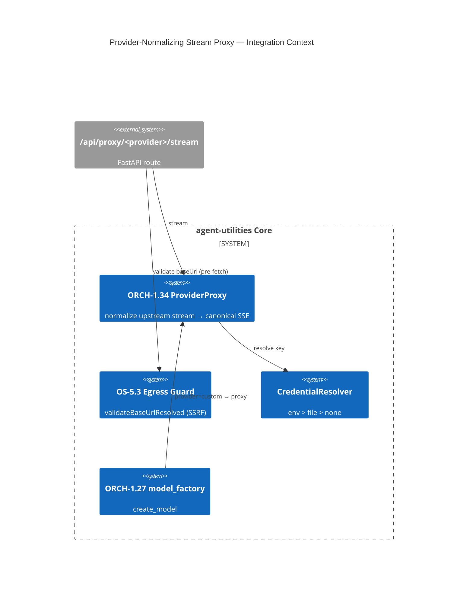

# Design Document: Provider-Normalizing Stream Proxy (ORCH-1.34)

> Assimilates open-design's BYOK proxy: one SSRF-safe streaming endpoint that normalizes any LLM
> provider's stream into a canonical event shape, with **DNS-resolved** internal-IP blocking at the edge.
> Lets agent-utilities accept bring-your-own-key endpoints (incl. on-prem/local) without bundling a
> provider SDK per vendor. Part of EPIC 1; consumed by ORCH-1.33.

## Research Provenance

| Source | Location | Behavior assimilated |
|---|---|---|
| open-design proxy routes | `apps/daemon/src/chat-routes.ts:668-1385`, `packages/contracts/src/api/proxy.ts` | `/api/proxy/<provider>/stream` normalizes anthropic/openai/azure/google/ollama → `ProxySseEvent{type:start\|delta\|error\|end}` |
| open-design SSRF guard | `connectionTest.ts:73-171` (`validateBaseUrl`, `validateBaseUrlResolved`) | DNS-resolve host, reject RFC1918/loopback/link-local/metadata IPs; loopback carve-out for local LLMs |
| open-design credentials | `media-config.ts:1-200`, `runtimes/types.ts:156-164` | env > file > none resolution; `defaultModelEnvVar` |

**Superiority delta:** open-design proxies for a UI chat surface. agent-utilities makes the proxy a
**first-class provider in `model_factory`**, so the same SSRF-safe normalizer serves the planner, the
parallel engine, the benchmark judge, and the evolution loop — and every call is **token-budgeted
(OS-5.4) and provenance-logged (KG)**, which a standalone chat proxy is not.

## KG Analysis (Required)

### Nearest Existing Concepts
<!-- kg_search("BYOK provider proxy normalize SSE streaming SSRF block model backend", top_k=5) -->

| Concept ID | Name | Similarity | Pillar |
|---|---|---|---|
| ORCH-1.27 | Role-Specialized Model Routing | 0.61 | ORCH-1 |
| ORCH-1.2 | Specialist Routing & Discovery | 0.47 | ORCH-1 |
| OS-5.3 | Guardrails & Safety Boundaries | 0.46 | OS-5 |
| OS-5.4 | Telemetry & Observability | 0.34 | OS-5 |
| ECO-4.0 | Tool Interface & MCP Factory | 0.30 | ECO-4 |

> Highest 0.61 < 0.70 → **new concept justified**. ORCH-1.27 selects a model from a registry; it does not
> proxy/normalize an arbitrary BYOK endpoint nor enforce SSRF egress policy.

### Extension Analysis
- **Primary Extension Point**: `core/model_factory.py` (ORCH-1.27) for the provider object; `security/guardrails.py` (OS-5.3) for the SSRF gate.
- **Extension Strategy**: `compose` — add a `ProviderProxy` provider + an `egress_guard` that the proxy router calls.
- **New Concept Required?**: Yes (the normalization + egress-policy edge is distinct).

### New Concept Proposal
- **Proposed ID**: `CONCEPT:ORCH-1.34`
- **Augments Pillar**: ORCH (with an OS-5.3 guardrail hook)
- **15-Phase Pipeline Integration**: Phase 3 (Execute) — model invocation layer.
- **Justification**: A canonical-SSE normalizer + DNS-resolved egress firewall over arbitrary BYOK endpoints is not expressible as model-registry selection.

## C4 Context Diagram

## Data Flow
1. **ORCH**: route receives `{provider, baseUrl, apiKey?, model, messages}` → egress guard → upstream fetch → normalize → canonical SSE.
2. **KG**: optional provenance node (provider, model, token usage) for Live Artifacts (KG-2.24).
3. **AHE**: provider latency/error rates feed observability + later routing optimization.
4. **ECO**: exposed as a FastAPI route (and usable by MCP tools that need raw LLM access).
5. **OS**: egress guard (OS-5.3) blocks internal IPs before fetch; token tracker (OS-5.4) meters usage; credential resolver keeps keys out of logs/args.

## Risk Assessment
- **Blast Radius**: new `server/routers/proxy.py` (mounted in `server/app.py`), `core/model_factory.py` (new `custom`/proxy provider), `security/guardrails.py` (egress validator), `core/config.py` (resolver). Additive.
- **Backward Compatible**: Yes — existing providers untouched; proxy is opt-in.
- **Breaking Changes**: None.

## Wiring (Wire-First, ≤3 hops)
- `/api/proxy/<provider>/stream` route → `egress_guard` + `ProviderProxy.stream` = **1–2 hops**.
- `model_factory.create_model(provider="custom")` → `ProviderProxy` = **1 hop**.
