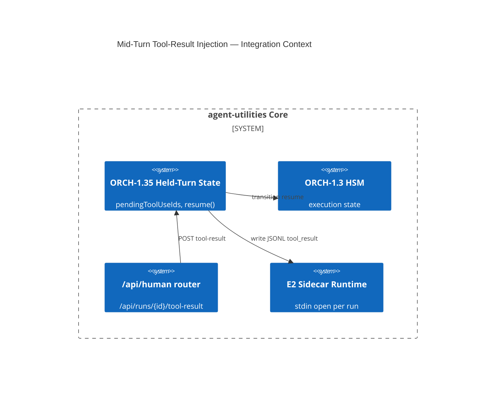

# Design Document: Mid-Turn Tool-Result Injection (ORCH-1.35)

> Assimilates open-design's keep-stdin-open interactive loop: a run can pause on a `tool_use`, surface a
> structured ask to a human/tool, and **resume the same turn** when the result arrives — instead of
> erroring out in headless mode or re-spawning. Turns agent-utilities' approve-only HITL surface into a
> true two-way interactive loop. Part of EPIC 2 (Interactive Execution Loop).

## Research Provenance

| Source | Location | Behavior assimilated |
|---|---|---|
| open-design stream-json prompt | `apps/daemon/src/server.ts:11900-12050` | `promptInputFormat:'stream-json'` writes JSONL, leaves stdin open |
| open-design tool-result route | `apps/daemon/src/chat-routes.ts:118-150` `/api/runs/:id/tool-result` | On `tool_use` pause, record `pendingHostAnswers`; POST writes a `user/tool_result` JSONL line; wait for `turn_end` to close stdin |
| open-design dual delivery | `runtimes/types.ts:94-102` | `promptViaStdin` + format (`text`/`stream-json`) per adapter |

**Superiority delta:** open-design routes the answer back to a single CLI for a chat UI. agent-utilities
routes it through the **orchestration graph** — a paused step can be answered by a human (`/api/human`),
by another agent (A2A), or by a tool, and the pause/resume is a **first-class graph state** (HSM,
ORCH-1.3) recorded in the KG, enabling resumable long-horizon runs that a stateless chat loop cannot.

## KG Analysis (Required)

### Nearest Existing Concepts
<!-- kg_search("mid-turn human in the loop tool result injection resume run stdin", top_k=5) -->

| Concept ID | Name | Similarity | Pillar |
|---|---|---|---|
| ORCH-1.3 | Execution Safety & State (HSM) | 0.64 | ORCH-1 |
| OS-5.x | Human-in-the-loop approval (`/api/approve`) | 0.60 | OS-5 |
| ORCH-1.10 | Reactive Event Sourcing | 0.52 | ORCH-1 |
| ORCH-1.0 | Core Orchestration Engine | 0.45 | ORCH-1 |
| AHE-3.0 | Agentic Harness Core | 0.30 | AHE-3 |

> Highest 0.64 < 0.70 → **new concept justified**, though it sits very close to ORCH-1.3 — it is the
> *mid-turn, stdin-open, tool-result-shaped* specialization of execution state. Confirm with live search;
> if a live `kg_search` returns ≥0.70 against ORCH-1.3, downgrade to an augmentation of ORCH-1.3.

### Extension Analysis
- **Primary Extension Point**: `ORCH-1.3` (HSM/execution state) + `server/routers/human.py` (`/api/approve`).
- **Extension Strategy**: `specialize` — a held-turn state + a tool-result-shaped resume route.
- **New Concept Required?**: Yes (provisional; collapses into ORCH-1.3 if live similarity ≥0.70).

### New Concept Proposal
- **Proposed ID**: `CONCEPT:ORCH-1.35`
- **Augments Pillar**: ORCH
- **15-Phase Pipeline Integration**: Phase 3 (Execute) — pause/resume within a step.
- **Justification**: Existing HITL is approve/reject (boolean gate); this holds a turn open and injects a structured `tool_result` payload mid-execution.

## C4 Context Diagram

## Data Flow
1. **ORCH**: step hits `tool_use` → engine records `pendingToolUseIds`, transitions to `WAITING_HOST`; on POST, writes the result and resumes.
2. **KG**: pause/resume events persisted (resumable runs); answer provenance recorded.
3. **AHE**: time-to-answer + outcome feed eval (e.g., which tools stall).
4. **ECO**: `/api/runs/{id}/tool-result` route; A2A agents can answer programmatically.
5. **OS**: run-scoped token (OS-5.11) authorizes the resume; tool_guard validates the payload schema.

## Risk Assessment
- **Blast Radius**: `server/routers/human.py` (new route), `core/execution/engine.py` (held-turn state machine), `graph/hsm.py` (new `WAITING_HOST` state). Additive but touches the execution state machine.
- **Backward Compatible**: Yes — non-interactive runs never enter `WAITING_HOST`.
- **Breaking Changes**: None; a timeout policy auto-fails a stuck held turn (config).

## Wiring (Wire-First, ≤3 hops)
- `/api/runs/{id}/tool-result` → engine `resume(run_id, result)` = **1 hop**.
- A2A skill → same resume entry = **2 hops**.
