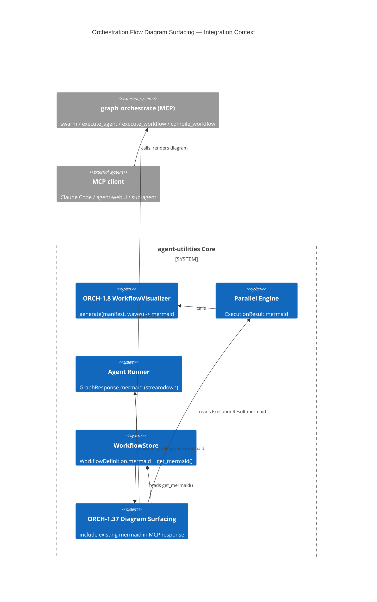

# Design Document: Orchestration Flow Diagram Surfacing (ORCH-1.37)

> The `WorkflowVisualizer` (ORCH-1.8) already generates a Mermaid diagram of every
> orchestration run, and `compile_workflow` already persists one on the `WorkflowDefinition`
> node — but **no `graph_orchestrate` MCP action returns the diagram to the caller**. It is
> only logged to stdout or left as a KG node property. This feature surfaces the
> already-generated diagram additively through the `graph_orchestrate` responses so an MCP
> client (Claude Code, agent-webui, a delegating sub-agent) can render the execution flow.
> No diagram is (re)generated — this is pure exposure of an existing artifact.

## Research Provenance

Internal gap, not an external assimilation. Surfaced while end-to-end testing skill-workflow
execution via the graph-os MCP (`graph_orchestrate`) with a spawned sub-agent leveraging
ingested MCP tools. Trace of where the diagram exists vs. where it is dropped:

| Artifact | Source field | Where dropped today |
|---|---|---|
| `ExecutionResult.mermaid` | `models/execution_manifest.py:280`, set at `graph/parallel_engine.py:410` (from `WorkflowVisualizer.generate`, `parallel_engine.py:231`) | `swarm` handler omits it from the response dict (`mcp/kg_server.py:2784-2797`) |
| `GraphResponse.mermaid` | `models/graph.py:22`, populated in `orchestration/engine.py:611/635/646` (only when `streamdown=True`, gated at `engine.py:337`) | `run_agent` returns only `results.output` (`orchestration/agent_runner.py:224-234`); `_execute_graph` never passes `streamdown=True` (`agent_runner.py:596-605`) |
| `WorkflowDefinition.mermaid` | persisted at `knowledge_graph/workflow_store.py:137`; read via `WorkflowStore.get_mermaid` (`workflow_store.py:545-565`) | `compile_workflow`/`execute_workflow` handlers don't read it back (`kg_server.py:2816-2828`, `2844-2855`) |

## KG Analysis (Required)

### Nearest Existing Concepts

<!-- kg_search ran cold (embedding model not warm; multiplexer dropped mid-session). Nearest
     concepts derived from the source concept registry docs/concepts.yaml + CONCEPT: tags. -->

| Concept ID | Name | Similarity | Pillar |
|---|---|---|---|
| ORCH-1.8 | Parallel Engine / Visualizer (`WorkflowVisualizer`) | ~0.85 | ORCH-1 |
| ORCH-1.21 | Execution provenance tracking (KG-to-LLM bridge) | ~0.72 | ORCH-1 |
| ORCH-1.24 | Workflow Lifecycle Management | ~0.66 | ORCH-1 |
| KG-2.24 | Live Refreshable Artifact | ~0.55 | KG-2 |
| ECO-4.x | MCP Tool Exposure | ~0.50 | ECO-4 |

### Extension Analysis

- **Primary Extension Point**: `ORCH-1.8` (Parallel Engine Visualizer) — similarity ≥ 0.70, so we MUST extend.
- **Extension Strategy**: `augment` — the visualizer output already exists; we add a thin
  surfacing layer at the MCP boundary that reads the existing `mermaid` field/property and
  includes it in the response. No diagram generation logic is added or changed.
- **New Concept Required?**: Yes — `ORCH-1.37` as an explicit sub-concept of ORCH-1.8 for
  traceability. It is a pure augmentation (response shaping), not a replacement.

### New Concept Proposal

- **Proposed ID**: `CONCEPT:ORCH-1.37`
- **Augments Pillar**: ORCH (sub-concept of ORCH-1.8; wired through ORCH-1.21 provenance / ECO MCP exposure)
- **15-Phase Pipeline Integration**: Phase 14 (Observability/Reporting) — diagram emitted with the orchestration result.
- **Justification**: ORCH-1.8 *produces* the flow diagram; ORCH-1.37 adds the orthogonal axis
  of *delivering* it across the MCP boundary so external clients can render execution flow.
  Small, additive, backward-compatible.

## C4 Context Diagram

## Data Flow

1. **ORCH**: An orchestration action runs as today; the visualizer produces the diagram on the
   relevant pydantic model (`ExecutionResult` / `GraphResponse` / `WorkflowDefinition`).
2. **Surfacing**: At the MCP boundary (`graph_orchestrate` handlers) the existing `mermaid`
   value is read and added to the returned JSON as an additive `"mermaid"` key.
3. **execute_agent special case**: `_execute_graph` must pass `streamdown=True` so
   `GraphResponse.mermaid` is populated; `run_agent` gains a flag-gated `return_mermaid` so it
   can return a JSON wrapper `{"output", "mermaid"}` without breaking internal string callers.
4. **ECO**: Exposed through the existing `graph_orchestrate` MCP tool — no new tool/route.
5. **KG**: No new nodes. `compile_workflow`/`execute_workflow` read the already-persisted
   `WorkflowDefinition.mermaid` via `WorkflowStore.get_mermaid`.

## Risk Assessment

- **Blast Radius**: `mcp/kg_server.py` (4 handlers, additive keys), `orchestration/agent_runner.py`
  (`return_mermaid` flag + `streamdown=True`), `orchestration/manager.py` (pass-through flag). All additive.
- **Backward Compatible**: Yes. swarm/compile/execute_workflow gain an additive `mermaid` key
  (null-safe). execute_agent stays a bare string unless `return_mermaid` opts in (only the MCP
  handler opts in, emitting a JSON-string wrapper); internal `run_agent` callers (e.g.
  `engine.execute_workflow` fan-out which filters on `isinstance(r, str)` at `engine.py:1316`)
  keep receiving bare strings.
- **Breaking Changes**: None. The MCP `execute_agent` response shape changes from bare string to
  a JSON wrapper — documented in the tool docstring; the wrapper is itself a JSON string so
  string-typed transports are unaffected.

## Wiring (Wire-First, ≤3 hops)

- `graph_orchestrate` (MCP) → swarm handler → reads `ExecutionResult.mermaid` = **1 hop**.
- `graph_orchestrate` (MCP) → `Orchestrator.execute_agent` → `run_agent(return_mermaid=True)` = **2 hops**.
- `graph_orchestrate` (MCP) → `WorkflowStore.get_mermaid` = **1 hop**.
