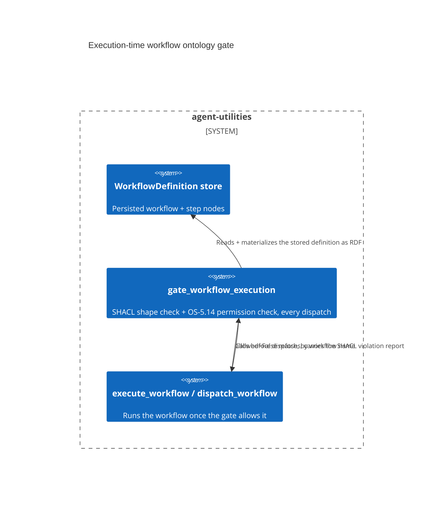

# Design Document: A stored workflow is SHACL-validated again at dispatch time, not trusted from ingestion

CONCEPT:AU-ORCH.execution.ontology-validation-execution-path

> `agent_utilities/knowledge_graph/core/workflow_gate.py` (the gate itself)
> and `agent_utilities/core/config.py` (`kg_workflow_shape_gate` — the
> `KG_WORKFLOW_SHAPE_GATE` toggle). Documented in
> `docs/architecture/configuration.md` and demonstrated end-to-end in
> `docs/examples/ontology-to-workflow.md`. Tested in
> `tests/unit/knowledge_graph/test_workflow_gate.py`.

## KG Analysis (Required)

### Nearest Existing Concepts

| Concept ID | Name | Similarity | Pillar |
|---|---|---|---|
| `AU-ORCH.planning.business-process-to-executable` | compiles a `WorkflowDefinition` from a BPMN process — the producer whose output this gate validates before it ever runs | 0.40 | ORCH |
| `AU-ORCH.execution.best-effort-provenance` | the run-level provenance recorded once execution has passed this gate | 0.25 | ORCH |

### Extension Analysis

- **Primary Extension Point**: `gate_workflow_execution` (`workflow_gate.py:240`),
  called from `execute_workflow` and its background twin `dispatch_workflow`.
- **Extension Strategy**: augment — new SHACL shapes extend coverage without
  touching the gate's call sites.
- **New Concept Required?**: No.

## Decision — validate the STORED definition again immediately before dispatch, not only at write time

`agent_utilities/knowledge_graph/core/workflow_gate.py:1-27`

The module's own docstring states the prior gap directly: "Until now the
ontology (SHACL shapes, permission ACLs) governed *ingestion* (pipeline
`shacl_gate`) and *reads* (OS-5.14 secured reads), but workflow *execution*
dispatched whatever was stored." `gate_workflow_execution` closes that gap
with two checks run **before dispatch**, every time a workflow is executed by
name, not once at write time:

1. **Shape gate** (`KG_WORKFLOW_SHAPE_GATE`, default `True`,
   `config.py:3714-3717`): the stored `WorkflowDefinition` and its
   `WorkflowStep` nodes are materialized into a focused RDF graph and
   validated against the bundled `WorkflowDefinitionShape` /
   `WorkflowStepShape`. A violation refuses execution with a structured
   report instead of dispatching.
2. **Permission gate** (mandatory, not flag-gated): the existing OS-5.14
   ontology permissioning row gate is applied to the workflow node for the
   current `ActorContext`, fail-closed — a denied actor gets `PermissionError`.

A workflow name with no stored definition is refused outright: "Execution
authority comes from the persisted definition; an unstored name cannot bypass
ontology and permission validation" (`workflow_gate.py:25-26`).

**The rejected alternative is the pre-existing behavior the docstring names**:
trust validation performed once at ingestion (or trust nothing at all) and
dispatch whatever is currently stored for that name at execution time. That
loses on two counts the code makes explicit:

1. **Storage-time validity does not imply dispatch-time validity.** A
   definition can be mutated, partially written, or corrupted between when it
   passed ingestion validation and when it is later executed by name; a
   dispatch-time re-check catches that drift where an ingestion-only check
   cannot.
2. **A malformed definition should fail before it burns an agent run, not
   during one.** The shape gate is deliberately "cheap, LLM-free"
   (`config.py:3714`, `docs/architecture/configuration.md:326`) — a SHACL
   validation pass is far cheaper than discovering the same malformation
   partway through a live agent execution.

The gate is opt-out (`KG_WORKFLOW_SHAPE_GATE=False` disables the shape half),
but default-ON precisely because the cost of running it is negligible next to
the cost of a burned run; the permission half is not made optional at all —
it reuses the existing mandatory OS-5.14 fail-closed semantics rather than
introducing a second, independent authorization toggle
(`docs/architecture/configuration.md:326-331`).

## C4 Context Diagram

## Data Flow

1. **ORCH**: `execute_workflow` / `dispatch_workflow` (REST twin
   `/api/graph/orchestrate/dispatch-workflow`) call the gate before every
   dispatch by name.
2. **KG**: the stored `WorkflowDefinition` + `WorkflowStep` nodes are
   materialized into the `http://knuckles.team/kg#` RDF namespace and
   validated against the bundled governance shapes.
3. **AHE**: none directly.
4. **ECO**: none directly.
5. **OS**: the permission half reuses OS-5.14 ontology permissioning
   (mandatory markings + discretionary ACLs, fail-closed), governed by the
   existing `KG_BRAIN_ENFORCE` flag rather than a gate-specific one.

## Risk Assessment

- **Blast Radius**: `agent_utilities/knowledge_graph/core/workflow_gate.py`,
  `agent_utilities/core/config.py`, `execute_workflow`/`dispatch_workflow`
  call sites.
- **Backward Compatible**: Yes — an operator can disable the shape half via
  `KG_WORKFLOW_SHAPE_GATE=False` to revert to trust-on-dispatch for the
  shape check specifically; the permission check cannot be disabled the same
  way.
- **Breaking Changes**: A previously-storable-but-malformed
  `WorkflowDefinition` that used to dispatch now refuses at execution time
  with a structured violation report, by design.
- **Known weak point**: none called out in the read sites beyond the
  accepted cost of re-validating on every dispatch (cheap, but not free) for
  workflows executed at high frequency.
