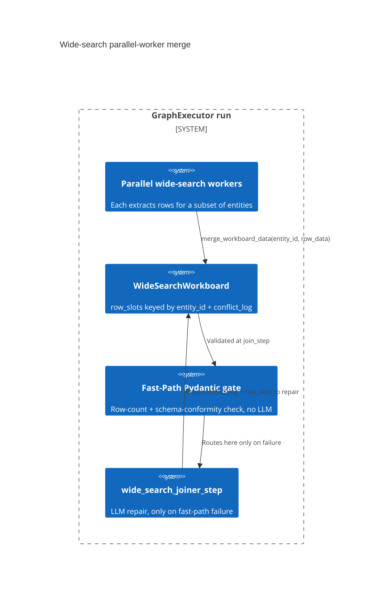

# Design Document: Parallel wide-search workers merge into one Pydantic-typed workboard with a conflict log, gated by a cheap fast-path check before an expensive LLM repair path

CONCEPT:AU-ORCH.execution.shared-workboard

> `agent_utilities/models/graph.py` (`WideSearchWorkboard`, the shape) wired
> through `agent_utilities/graph/state.py` (`GraphState.workboard`,
> `merge_workboard_data`, the merge policy) and
> `agent_utilities/graph/verification.py` (the fast/slow validation gate
> that consumes it). Tested in `tests/unit/graph/test_wide_search_graph.py`.

## KG Analysis (Required)

### Nearest Existing Concepts

| Concept ID | Name | Similarity | Pillar |
|---|---|---|---|
| `AU-ORCH.planning.recursion-nesting-depth` | the field-level docstring marker actually attached to `GraphState.workboard` and to the fast/slow join-step in `verification.py` — the wiring, not the shape decision this document covers | 0.40 | ORCH |

### Extension Analysis

- **Primary Extension Point**: `WideSearchWorkboard` (`models/graph.py:6-16`)
  and `GraphState.merge_workboard_data` (`graph/state.py:481-497`).
- **Extension Strategy**: augment — a new wide-search field is a new key in
  `row_slots`' row dicts or a new top-level attribute on the model; the merge
  and validation logic is schema-agnostic.
- **New Concept Required?**: No.

## Decision — a typed Pydantic scratchpad keyed by entity id, with an explicit conflict log, validated fast-path-first before falling back to an LLM repair step

`agent_utilities/models/graph.py:6-16`

`WideSearchWorkboard`'s docstring names the shape directly: "Pydantic-Native
Shared Workboard. A thread-safe/merge-safe shared memory scratchpad for
parallel workers during wide-search extraction tasks." It holds a declared
`schema_definition`, an `expected_row_count`, `row_slots` (a dict of extracted
rows keyed by entity id — one slot per entity, written by whichever parallel
worker resolves that entity), and a `conflict_log` recording every collision.

`GraphState.merge_workboard_data` (`graph/state.py:481-497`) is the single
write path every parallel worker calls: when an `entity_id` is not yet
present, the row is written directly; when it **is** already present, the
existing and incoming rows are both appended to `conflict_log` *and* merged
via dict `.update()` (incoming wins per-key) rather than either silently
dropping the new write or throwing on the collision.

Once workers converge, `verification.py`'s join step runs a two-tier check
(`verification.py:97-125`), itself concept-tagged as a "Hybrid Pydantic
Validation Gate": a **fast path** — cheap, deterministic Pydantic-level
assertions (row count matches `expected_row_count`; every row has every
column `schema_definition` declares) — that on success logs "Fast-Path
Pydantic validation PASSED" and proceeds directly to `dispatcher`. On
failure, it routes to a **slow path**, `wide_search_joiner_step`
(`verification.py:135-175`), which spins up an LLM "WideSearch Repair
Specialist" that is handed the `conflict_log` and the malformed `row_slots`
to repair schema mismatches, standardize formats, or flag that a re-plan
(more research) is required.

**The rejected alternative, evident from the shape of what was built rather
than stated outright:** either (a) unstructured shared mutable state (a bare
dict or list workers append to under a lock) with no merge policy, or (b)
always routing joins through the LLM repair step regardless of whether the
fast structural check would have passed. Both lose on the same axis the code
optimizes for:

1. **Silent overwrite would hide extraction conflicts.** Two workers
   resolving the same entity differently is exactly the kind of
   wide-search failure mode worth surfacing; `conflict_log` makes every
   collision inspectable (and is precisely what the LLM repair step is
   handed to reason over) instead of the second write silently clobbering
   the first with no record.
2. **Always-LLM-repair would pay an LLM call on every join, even when the
   merged data is already structurally valid.** The fast Pydantic path is
   the cheap common case; the LLM repair path exists only for the schema
   drift/missing-row failure mode the fast path is built to catch, keeping
   the LLM call on the exception path rather than the hot path.

## C4 Context Diagram

## Data Flow

1. **ORCH**: parallel wide-search worker steps call
   `GraphState.merge_workboard_data` as each entity resolves; the join step
   gates on the workboard before advancing to `dispatcher`.
2. **KG**: none directly — this is in-run scratch state, not a KG write.
3. **AHE**: none directly.
4. **ECO**: none directly.
5. **OS**: none directly.

## Risk Assessment

- **Blast Radius**: `agent_utilities/models/graph.py`,
  `agent_utilities/graph/state.py`, `agent_utilities/graph/verification.py`.
- **Backward Compatible**: Yes — `workboard` defaults to `None` on
  `GraphState`; non-wide-search graph runs are unaffected.
- **Breaking Changes**: None.
- **Known weak point**: `merge_workboard_data`'s own comment concedes the
  conflict-resolution policy is a placeholder — `"Simple conflict log for
  now"` (`graph/state.py:488`) — collisions are recorded and last-write-wins
  by field via dict `.update()`, not adjudicated; a worker's earlier partial
  write to a field can be silently overwritten by a later worker's write to
  the same field on the same entity, with only the log (not a resolution
  rule) to fall back on.
