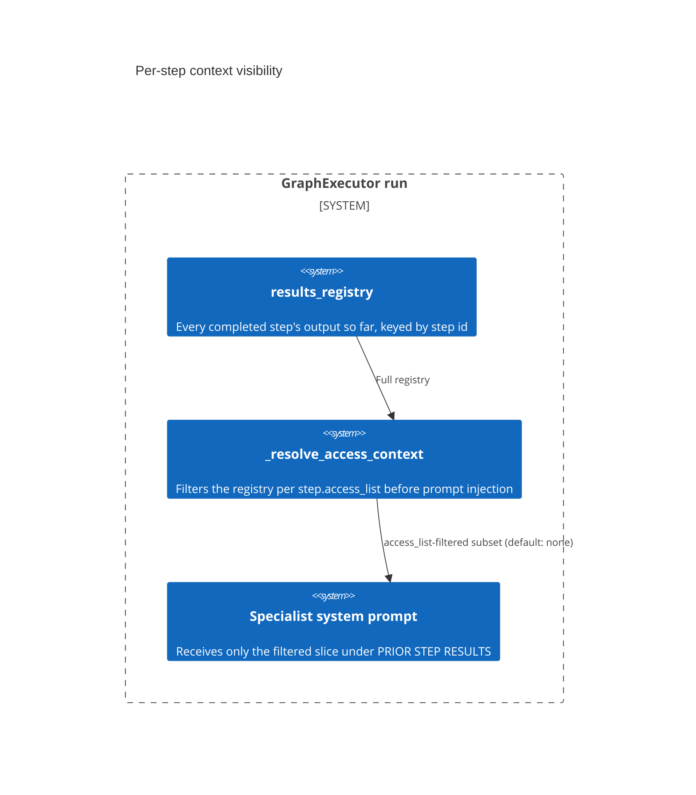

# Design Document: Cross-step context is opt-IN (allow-list), not opt-OUT

CONCEPT:AU-ORCH.execution.visibility-allow-list

> `agent_utilities/graph/executor.py` (`_resolve_access_context`, the gate that
> reads it) and `agent_utilities/models/sdd.py` (`ExecutionStep.access_list`,
> the field it gates). Tested in
> `tests/unit/graph/test_visibility_graph.py`.

## KG Analysis (Required)

### Nearest Existing Concepts

| Concept ID | Name | Similarity | Pillar |
|---|---|---|---|
| `AU-ORCH.planning.recursion-nesting-depth` | the Conductor-paper HTN/recursive-graph work this field ships alongside (`docs/guides/conductor-orchestration.md`); a sibling field on the same commit, not this decision | 0.45 | ORCH |
| `AU-ORCH.execution.inject-signal-board-observations` | another context-injection channel into the same specialist system prompt, unconditional rather than allow-listed | 0.30 | ORCH |

### Extension Analysis

- **Primary Extension Point**: `ExecutionStep.access_list` (`sdd.py:98-104`) and
  `_resolve_access_context` / its call site in `executor.py:914-935`.
- **Extension Strategy**: augment — a planner adds `access_list` entries per
  step; no new mechanism required to extend coverage.
- **New Concept Required?**: No. `AU-ORCH.planning.recursion-nesting-depth`
  already names the broader Conductor-inspired refinement this field was
  introduced with (`docs/guides/conductor-orchestration.md`); this document
  covers the one field-level decision (`access_list`'s semantics) that carries
  its own distinct `AU-ORCH.execution.visibility-allow-list` marker at its
  four real sites, separately from that broader marker.

## Decision — default is DENY, not full-context; "all" must be requested explicitly

`agent_utilities/graph/executor.py:97-135`, `agent_utilities/models/sdd.py:98-104`

`_resolve_access_context` filters `GraphState.results_registry` — the
per-step outputs accumulated so far in a run — down to only the entries a
step's `access_list` names, before that filtered slice is injected into the
specialist's system prompt as `### PRIOR STEP RESULTS`. Three modes, in order
of precedence checked in the code: `access_list == []` → nothing is shared
(`if not step.access_list: return ""`); `"all" in access_list` → the full
registry is shared; otherwise only the named step ids are shared
(`for key in step.access_list`).

**The rejected alternative is what the docstring names as the prior state of
the pipeline**: "each specialist receives the raw user query verbatim" and,
by extension, the accumulating full history of prior step outputs
(`docs/guides/conductor-orchestration.md` — Conductor paper motivation,
quoted verbatim: "This prevents context pollution where a specialist
receives irrelevant information from unrelated prior steps"). Two shapes of
that alternative were both available and both rejected:

1. **Full-context-by-default, with an opt-out (deny-list).** This is the
   easier migration (nothing breaks for existing plans) but it means the
   *default* behavior for every new plan continues to be full prompt bloat —
   the planner has to remember to trim context down, and forgetting to is
   invisible until the prompt is already too large. The failure mode is
   silent and additive.
2. **No filtering mechanism at all.** `access_list` simply defaulting to
   `default_factory=list` (empty) and being deny-by-default means a step that
   never sets `access_list` gets *zero* prior-step context, not everything —
   the safe failure mode is under-sharing (a step misses context it needed,
   which surfaces immediately as a wrong/incomplete answer) rather than
   over-sharing (context pollution, which degrades quality silently and
   scales with plan size).

The allow-list shape was chosen specifically because its default failure mode
is loud (missing context) rather than quiet (bloated, degraded context) —
`_resolve_access_context`'s docstring states the goal directly: "prevents
context pollution and reduces prompt bloat."

### Field-level detail

`ExecutionStep.access_list` (`sdd.py:98-104`) is a `list[str]` defaulting to
empty; its own field description repeats the allow-list contract verbatim
("'all' grants full visibility; empty denies cross-step access") so the
schema is self-documenting to any planner LLM that reads
`ExecutionStep.model_json_schema()` — asserted directly by
`test_access_list_json_schema` (`tests/unit/graph/test_visibility_graph.py:51`).

## C4 Context Diagram

## Data Flow

1. **ORCH**: the planner sets `access_list` per `ExecutionStep` when it
   builds the plan; the executor enforces it at prompt-construction time,
   not at plan-validation time — an empty list is a valid, deliberate choice
   for an isolated step.
2. **KG**: none directly — this governs prompt content, not graph writes.
3. **AHE**: none directly.
4. **ECO**: none directly.
5. **OS**: none directly.

## Risk Assessment

- **Blast Radius**: `agent_utilities/graph/executor.py`,
  `agent_utilities/models/sdd.py`.
- **Backward Compatible**: Yes — `access_list` defaults to empty, so an
  existing plan that never sets it behaves identically to before the field
  existed (no context shared), not identically to "everything shared."
- **Breaking Changes**: None.
- **Known weak point**: the fail-safe direction is under-sharing. A planner
  that forgets to grant a step visibility into a dependency it actually needs
  gets a silent quality regression (a step answering from less context than
  it should) rather than a hard error — nothing validates that a step's
  `depends_on` graph and its `access_list` are consistent.
