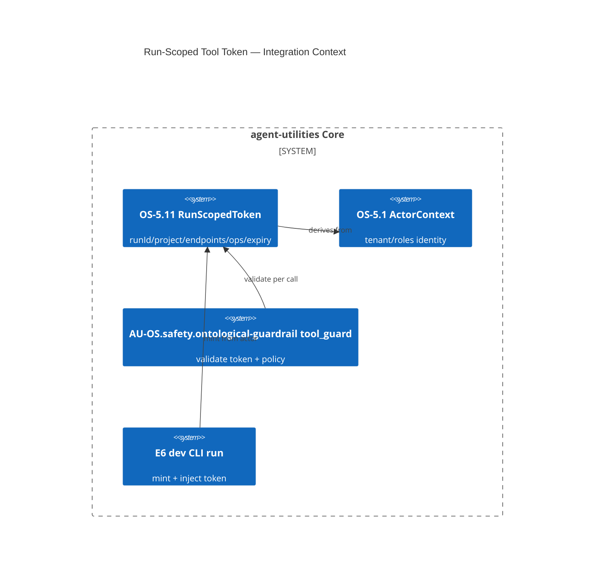

# Design Document: Run-Scoped Tool Token (OS-5.11)

> Assimilates open-design's `OD_TOOL_TOKEN`: each run gets a short-lived bearer token bound to
> runId/project/allowed-endpoints/operations/expiry, injected into the agent environment; tool endpoints
> derive scope from the token and reject request-supplied overrides; the daemon is the sole policy
> authority. Gives agent-utilities per-run, least-privilege capability scoping. Part of EPIC 6.

## Research Provenance

| Source | Location | Behavior assimilated |
|---|---|---|
| open-design tool token | `specs/2026-04-29-live-artifacts/spec.md:5.3,6,13.1` | `OD_TOOL_TOKEN` bound to runId/projectId/endpoints/operations/expiry; injected as env; endpoints derive scope; revoked at run end/TTL |

**Superiority delta:** open-design scopes tokens to a single daemon's project. agent-utilities binds the
token to the **multi-tenant `ActorContext` (OS-5.1)** and the **ontological tool_guard (AU-OS.safety.ontological-guardrail)**, so a
token both scopes *endpoints* and inherits the actor's *tenant/role* policy — least-privilege across a
multi-agent, multi-tenant graph, not just a single-user app.

## KG Analysis (Required)

### Nearest Existing Concepts
<!-- kg_search("run scoped capability token bearer endpoint allowlist expiry per run", top_k=5) -->

| Concept ID | Name | Similarity | Pillar |
|---|---|---|---|
| OS-5.1 | Security & Auth / ActorContext | 0.64 | OS-5 |
| AU-OS.safety.ontological-guardrail | Ontological Guardrail (tool_guard) | 0.61 | OS-5 |
| AU-OS.governance.reactive-multi-axis-budget | Guardrails & Safety Boundaries | 0.55 | OS-5 |
| ORCH-1.3 | Execution Safety & State | 0.41 | ORCH-1 |
| ECO-4.0 | Tool Interface & MCP Factory | 0.33 | AU-ECO.connector.plane-provisioning-auth |

> Highest 0.64 < 0.70 → **new concept justified** (provisional). `ActorContext` is durable *identity*;
> OS-5.11 is an *ephemeral, run-scoped, endpoint-allowlisted capability* derived from that identity. If a
> live `kg_search` returns ≥0.70 against OS-5.1, downgrade to an augmentation of OS-5.1.

### Extension Analysis
- **Primary Extension Point**: `security/brain_context.py` (`ActorContext`, OS-5.1) + `security/tool_guard.py` (AU-OS.safety.ontological-guardrail).
- **Extension Strategy**: `augment` — mint a `RunScopedToken` from an `ActorContext`; tool_guard validates it.
- **New Concept Required?**: Yes (provisional).

### New Concept Proposal
- **Proposed ID**: `CONCEPT:AU-OS.observability.run-wide-correlation-id`
- **Augments Pillar**: OS
- **15-Phase Pipeline Integration**: Phase 3 (Execute) — token minted at dispatch, validated per tool call.
- **Justification**: Ephemeral run-scoped capability tokens with endpoint/operation allowlists and TTL are distinct from durable actor identity.

## C4 Context Diagram

## Data Flow
1. **ORCH**: engine dispatch mints a `RunScopedToken` for the run and injects it into the agent/tool env.
2. **KG**: token grant/revoke recorded for audit (AU-OS.governance.wasm-micro-agent-sandbox).
3. **AHE**: not directly; denied calls surface as eval signals.
4. **ECO**: tool endpoints (MCP/REST) require the token; derive project scope from it; reject request-supplied project overrides.
5. **OS**: `tool_guard` (AU-OS.safety.ontological-guardrail) validates signature/expiry/endpoint allowlist against the `ActorContext` (OS-5.1); revoked at run end/TTL.

## Risk Assessment
- **Blast Radius**: `security/brain_context.py` (token mint), `security/tool_guard.py` (validate), `core/execution/engine.py` (inject), E6 CLI `run`. Additive but security-sensitive → require tests for expiry, scope-escape, and revocation.
- **Backward Compatible**: Yes — when no token is present, fall back to current `ActorContext` checks (config gate to enforce).
- **Breaking Changes**: None until enforcement is switched on.

## Wiring (Wire-First, ≤3 hops)
- E6 CLI `run` → `mint_token(actor, run)` = **1 hop**.
- MCP/REST tool call → `tool_guard.validate(token)` = **1 hop**.
