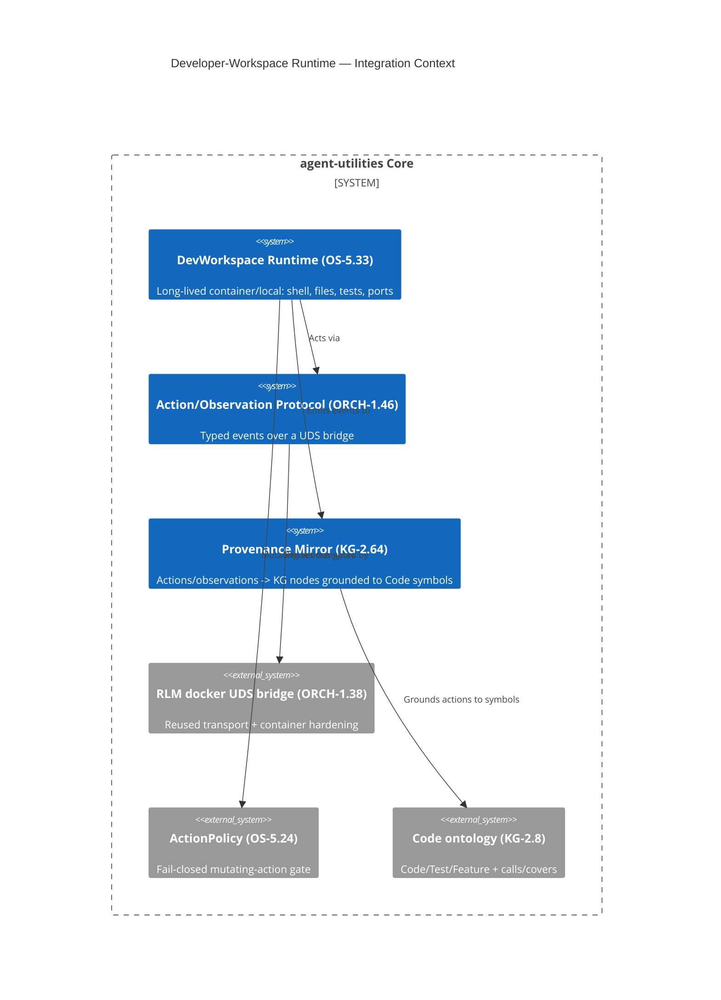

# Design Document: Developer-Workspace Runtime

> Phase 1 of the OpenHands-parity SWE platform. Bundles three tightly-coupled concepts:
> **OS-5.33** (the runtime), **ORCH-1.46** (the action/observation protocol), and
> **KG-2.64** (provenance mirroring). See
> [`../../reports/openhands-comparative-analysis-2026-06-13.md`](../../reports/openhands-comparative-analysis-2026-06-13.md).

## KG Analysis (Required)

### Nearest Existing Concepts

| Concept ID | Name | Similarity | Pillar |
|---|---|---|---|
| ORCH-1.38 | RLM Sandbox Tiering (local/monty/wasm/docker) | 0.55 | ORCH |
| ORCH-1.35 | Mid-turn tool-result injection (`WAITING_HOST`) | 0.50 | ORCH |
| OS-5.11 | Run-scoped tool token | 0.45 | OS |
| KG-2.26 | Link semantics | 0.40 | KG |
| OS-5.24 | Fail-closed ActionPolicy | 0.40 | OS |

### Extension Analysis

- **Primary Extension Point**: ORCH-1.38 (sandbox transport/hardening) — reuse, do not extend its contract.
- **Extension Strategy**: compose (new sibling runtime reusing the docker UDS-bridge transport)
- **New Concept Required?**: Yes — the RLM `Sandbox.execute()` contract (`code → {updated_vars, stdout}`)
  is a stateless function call; a persistent workspace (stateful cwd/env/filetree, typed
  action/observation verbs) cannot be expressed as an extension without corrupting the snippet
  router's capability model.

### New Concept Proposal

- **Proposed IDs**: `CONCEPT:OS-5.33` (runtime), `CONCEPT:ORCH-1.46` (protocol), `CONCEPT:KG-2.64` (provenance)
- **Augments Pillars**: OS (process/infra lifecycle), ORCH (loop protocol), KG (provenance graph)
- **15-Phase Pipeline Integration**: wires a new CODEBASE-adjacent runtime under the execution
  plane; provenance writes land in the KG ingestion/enrichment graph.
- **Justification**: long-lived container lifecycle + bidirectional typed event protocol + symbol-grounded
  provenance are three distinct responsibilities, none expressible as an ORCH-1.38 extension.

## C4 Context Diagram

## Data Flow

1. **ORCH**: `AgentOrchestrationEngine` (`swe` mode, Phase 2) drives `DevWorkspace.act(action)`;
   the bridge (ORCH-1.46) carries the action into the workspace and returns an observation.
2. **KG**: each Action → `(:WorkspaceAction)`, each Observation → `(:WorkspaceObservation)`,
   with `[:PRODUCED]`, `[:NEXT]` (replay order), `(:RunTrace)-[:HAS_ACTION]->`, and
   `(:WorkspaceAction)-[:MUTATED]->(:Code)` for edited symbols (KG-2.64).
3. **AHE**: the provenance trace is the raw material the golden loop (Phase 3, AHE-3.23) reads to
   attribute failures to edit-kinds on symbol classes.
4. **ECO**: exposed via `/api/runtime/*` (start/act/stream) for gateway + future MCP.
5. **OS**: every `workspace.cmd|write|edit` action is gated by the fail-closed `ActionPolicy`
   (OS-5.24) and stamped with the run-scoped actor identity (OS-5.11/14).

## Risk Assessment

- **Blast Radius**: additive — new `agent_utilities/runtime/` package + one field on
  `SandboxCapabilities` (default `False`) + new ontology classes + new policy action kinds + new
  API routes. No existing call path changes behavior.
- **Backward Compatible**: Yes.
- **Breaking Changes**: None. Existing RLM backends advertise `workspace=False`; the snippet
  router is unaffected.
- **Key risks**: container lifecycle leaks (mitigate: reaper keyed on `run_id` + idle timeout);
  egress-vs-isolation (default internal-only bridge net, policy-gated egress); bridge backpressure
  on large outputs (mitigate: chunked framing extending the existing `struct`/`_recvn` shim).
