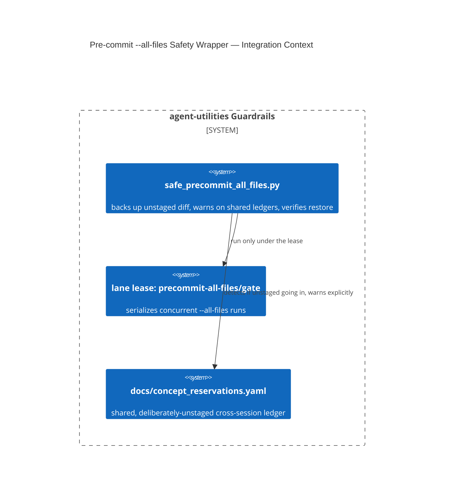

# Design Document: `pre-commit run --all-files` Unstaged-Work Safety Wrapper (D-OB-12)

> The full rationale already exists in this repo's own `AGENTS.md` (imported
> by `CLAUDE.md`), section *"Quality Bar — Leave the Codebase Clean"*, and in
> `scripts/safe_precommit_all_files.py`'s own docstring — both written
> alongside the fix in `dad9018e`. This file is a **pointer**, not a
> rewrite; AGENTS.md is authoritative and already carries a worked example
> of correctly declining to merge because of this exact hazard (see
> `AGENTS.md` → *"Concurrent development"* → "Worked example — deferring is
> the correct outcome").

CONCEPT:AU-OS.governance.precommit-all-files-safety

## KG Analysis (Required)

### Nearest Existing Concepts

| Concept ID | Name | Similarity | Pillar |
|---|---|---|---|
| `AU-OS.governance.append-only-fragment-fold` | sibling concurrency-safety mechanism protecting the same shared ledger (`docs/concept_reservations.yaml`) from a different hazard | 0.40 | OS |
| `AU-AHE.evaluation.swallow-baseline-stable-key` | a different gate-hardening effort (baseline identity, not stash-drop) | 0.20 | AHE |

### Extension Analysis

- **Primary Extension Point**: `scripts/safe_precommit_all_files.py` (new
  wrapper script).
- **Extension Strategy**: new — a mandatory wrapper around bare
  `pre-commit run --all-files`, not a change to pre-commit itself.
- **New Concept Required?**: Yes.

### New Concept Proposal

- **Proposed ID**: `CONCEPT:AU-OS.governance.precommit-all-files-safety`
- **Augments Pillar**: OS (domain `governance`)
- **15-Phase Pipeline Integration**: pre-commit/CI guardrail phase, before
  any commit lands.
- **Justification**: `pre-commit run --all-files` internally `git stash`es
  every **unstaged** change before running hooks and restores it after. When
  a file-rewriting hook (`ruff-format`, `turtle-format`,
  `guardrail-docs-contract --write`, …) touches a path that also had
  unstaged edits, the restore can **silently drop those edits instead of
  merging them** — this repo actually lost a full round of regenerated docs
  to exactly this during the fastmcp-4 migration. It is acutely dangerous
  here because `docs/concept_reservations.yaml` is a shared, cross-session
  coordination ledger **deliberately** left unstaged (concurrent sessions
  append to it without staging/committing) — one careless `--all-files` run
  can destroy another session's in-flight concept reservations. The
  alternative already tried and proven insufficient was a documentation-only
  warning — a prior paragraph telling agents to be careful did not prevent
  the incident. Fix: `safe_precommit_all_files.py` backs up the full
  unstaged diff before running, prints an explicit warning if a known
  shared-ledger file is unstaged going in, and verifies afterward that the
  unstaged changes still apply — pointing at the backup and the exact `git
  apply --3way` recovery command if a hook silently altered or dropped
  them. A **lease** (`precommit-all-files`, `gate` operation) additionally
  serializes concurrent lanes so two sessions never race the same
  stash/restore window.

## C4 Context Diagram

## Data Flow

1. **ORCH**: none directly.
2. **KG**: none.
3. **AHE**: none.
4. **ECO**: none.
5. **OS**: this IS the OS-pillar concurrent-development safety mechanism —
   it protects every lane's unstaged work from a shared tooling hazard.

## Risk Assessment

- **Blast Radius**: every lane running `pre-commit run --all-files`; a
  silent-drop incident affects whichever unstaged file collided with a
  file-rewriting hook, potentially including another session's in-flight
  ledger entries.
- **Backward Compatible**: Yes — the wrapper is a strict superset of bare
  `pre-commit run --all-files` (same hooks run), plus a backup/verify step.
- **Breaking Changes**: bare `pre-commit run --all-files` is now
  discouraged repo-wide in favor of the wrapper; a **targeted** run against
  specific files/hooks (which does not carry this risk) remains fine
  unwrapped.
- **What would make this wrong later**: the wrapper's known-shared-ledger
  list is a maintained set (currently `docs/concept_reservations.yaml` and
  similar generated-fold files) — if a new shared, deliberately-unstaged
  ledger is introduced elsewhere and nobody adds it to that list, the
  wrapper would warn about the wrong (or no) file while the same hazard
  reproduces against the new ledger.
