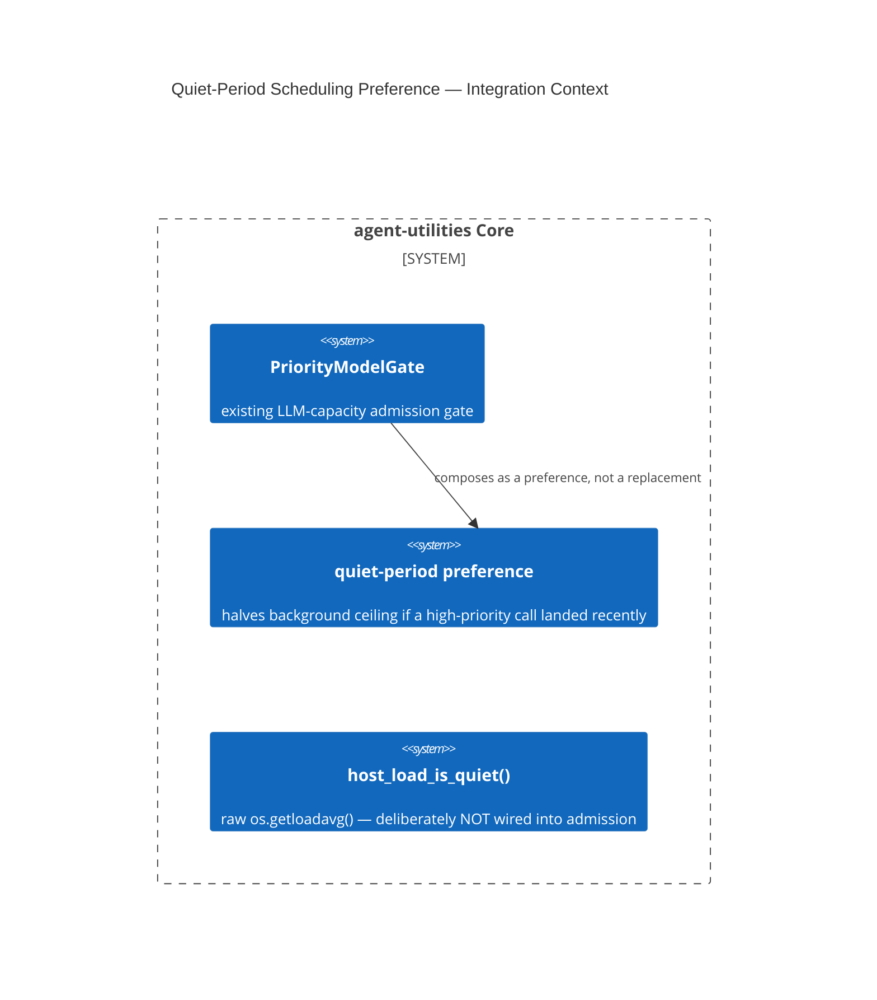

# Design Document: Quiet-Period Preference on the LLM Priority Admission Gate

CONCEPT:AU-ORCH.scheduling.quiet-period-preference

## KG Analysis (Required)

### Nearest Existing Concepts

| Concept ID | Name | Similarity | Pillar |
|---|---|---|---|
| `AU-KG.retrieval.batched-neighborhood-prefetch` | sibling capacity-management decision, different subsystem (engine reads, not LLM admission) | 0.20 | KG |

### Extension Analysis

- **Primary Extension Point**: `agent_utilities/core/resource_priority.py`
  (`PriorityModelGate`, existing).
- **Extension Strategy**: augment — compose a new preference onto the
  existing admission gate rather than build a second scheduler.
- **New Concept Required?**: Yes.

### New Concept Proposal

- **Proposed ID**: `CONCEPT:AU-ORCH.scheduling.quiet-period-preference`
- **Augments Pillar**: ORCH (domain `scheduling`, alongside the
  resource-priority edict already there)
- **15-Phase Pipeline Integration**: admission phase — evaluated whenever
  background evolution work requests LLM capacity.
- **Justification**: the program repeatedly described evolution work
  running "during downcycles," but a repo-wide grep for `downcycle` (D-OB-10)
  returned **zero hits** — no clock- or load-based predicate actually existed
  to back that claim; the wording described a mechanism that had never been
  built (a documentation/reality mismatch, corrected as part of this fix).
  The alternative rejected was inventing a **second**, independent
  load-based scheduler; instead this composes a *preference* onto the
  existing `PriorityModelGate`: background's spare-capacity ceiling **halves
  (floor 1, never 0)** when a high-priority call landed within
  `_QUIET_IDLE_SECONDS`. Deliberately a preference, not a hard stop. The
  separate `host_load_is_quiet()` (raw `os.getloadavg()`) is deliberately
  **kept out** of the gate's own admission arithmetic — the docstring
  explicitly warns against folding it in, because raw host load is
  non-deterministic under this environment's ~20 concurrent sandbox
  sessions and would make core admission decisions flaky.

## C4 Context Diagram

## Data Flow

1. **ORCH**: this IS the ORCH-pillar scheduling mechanism — governs when
   background evolution work may consume LLM capacity relative to
   interactive/high-priority work.
2. **KG**: none.
3. **AHE**: background evolution cycles are the consumer this preference
   throttles.
4. **ECO**: none.
5. **OS**: composes onto, rather than duplicates, the existing
   resource-priority edict (ORCH-1.98/1.99) that interactive work must never
   be starved by background ingestion/evolution.

## Risk Assessment

- **Blast Radius**: any background evolution work requesting LLM capacity
  while interactive work is active.
- **Backward Compatible**: Yes — 21 tests confirm fully backward-compatible
  behavior when no high-priority call has landed recently (the floor is
  never 0, so background is throttled, never starved outright).
- **Breaking Changes**: None.
- **What would make this wrong later**: the docstring explicitly warns
  against ever wiring `host_load_is_quiet()` directly into the gate's own
  admission decision — doing so would reintroduce the non-determinism this
  design deliberately avoided. It would also go wrong if a genuine
  clock/load-based "downcycle" scheduler is built elsewhere later, making
  this composition redundant with or conflicting against a second, separate
  scheduler — the two would need explicit reconciliation, not silent
  coexistence.
