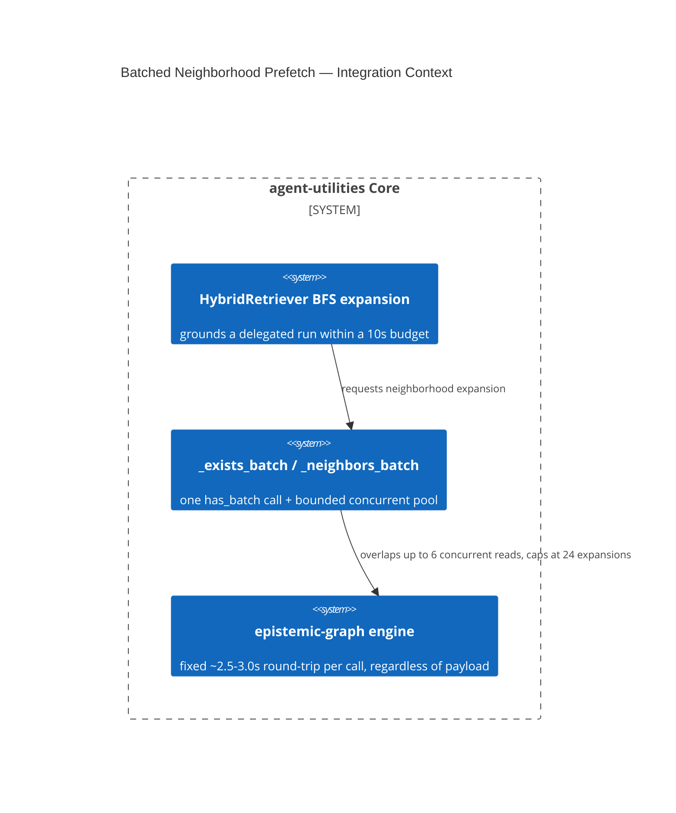

# Design Document: Batched, Bounded Neighborhood Prefetch in the Hybrid Retriever

CONCEPT:AU-KG.retrieval.batched-neighborhood-prefetch

## KG Analysis (Required)

### Nearest Existing Concepts

| Concept ID | Name | Similarity | Pillar |
|---|---|---|---|
| `AU-ORCH.scheduling.quiet-period-preference` | sibling capacity-management decision, different subsystem (LLM admission, not engine reads) | 0.20 | ORCH |

### Extension Analysis

- **Primary Extension Point**: `knowledge_graph/retrieval/
  hybrid_retriever.py` (`_exists_batch`, `_neighbors_batch`).
- **Extension Strategy**: augment — collapse per-node serial engine calls
  into a bounded, concurrent batch.
- **New Concept Required?**: Yes.

### New Concept Proposal

- **Proposed ID**: `CONCEPT:AU-KG.retrieval.batched-neighborhood-prefetch`
- **Augments Pillar**: KG (domain `retrieval`)
- **15-Phase Pipeline Integration**: Phase 1 (Retrieve/Ground) — grounding
  evidence for a delegated run before the mandatory grounding budget expires.
- **Justification**: measured engine point-reads cost a fixed ~2.5-3.0s
  round-trip **regardless of payload size**; the BFS neighborhood expansion
  was issuing 4 serial calls per node (`has_node`, `get_successors`,
  `get_predecessors`, `properties_batch`), blowing the 10s mandatory-
  grounding budget and failing every delegated run **closed**. The obvious
  alternative — simply raising the timeout constant — was explicitly
  rejected elsewhere (tracked separately, D-DG-2) as "opinionated tuning
  that would paper over" real, measured engine contention rather than fix
  the call pattern. This fix instead (a) collapses existence checks into one
  `has_batch` call, (b) overlaps independent neighbor reads through a small,
  **deliberately bounded** concurrency pool (`_NEIGHBOR_FETCH_CONCURRENCY=6`,
  sized to not stampede the shared engine past the resource-priority edict),
  and (c) hard-caps frontier width at `_MAX_NEIGHBOR_EXPANSIONS=24` with
  deterministic, logged truncation — never silently returning zero evidence
  or an unbounded cost. A failed neighbor read is reported as failed, never
  silently coerced into "no neighbours" (which would be indistinguishable
  from a genuinely isolated node).

## C4 Context Diagram

## Data Flow

1. **ORCH**: a delegated run's grounding step calls the retriever under a
   hard 10s budget; this fix is what keeps that budget achievable.
2. **KG**: this IS the KG-pillar retrieval hot path — engine point-reads for
   graph neighborhood expansion.
3. **AHE**: none directly.
4. **ECO**: none.
5. **OS**: concurrency is deliberately small, respecting the
   resource-priority edict (interactive/orchestration work must not be
   starved by a retrieval fan-out stampeding the shared engine).

## Risk Assessment

- **Blast Radius**: every retrieval path through `HybridRetriever`'s BFS
  expansion — i.e. every delegated run's grounding step.
- **Backward Compatible**: Yes — same external contract, faster/bounded
  internals.
- **Breaking Changes**: None.
- **What would make this wrong later**: this does **not** remove the
  per-frontier round-trip cost, only collapses call count and overlaps
  independent reads — if the engine ever gains a genuine batched
  multi-node neighbor operation (today none exists, which is why N calls
  are still needed), the pool-and-cap machinery becomes unnecessary
  complexity that should be stranglered out. `_NEIGHBOR_FETCH_CONCURRENCY`
  and `_MAX_NEIGHBOR_EXPANSIONS` were empirically derived from a measured
  80-read/8s-each blowup on the live graph — tuning either without
  re-validating against the engine's actual contention profile would
  silently reintroduce the same budget-exceeded failure this fix closed.
