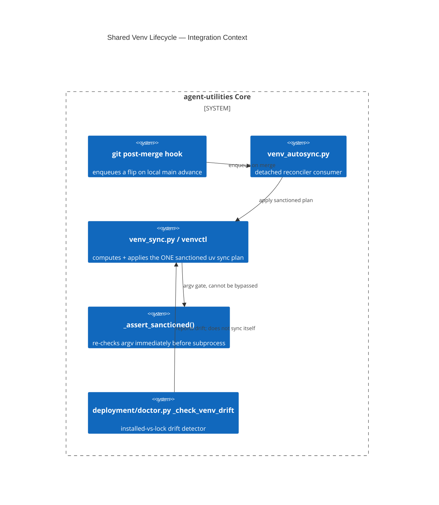

# Design Document: Shared Workspace `.venv` — Sync, Flip-on-Merge, Drift, Refusal

> The full design already exists as
> [`docs/architecture/shared-venv-lifecycle.md`](../../../docs/architecture/shared-venv-lifecycle.md)
> (283 lines, written and merge-committed alongside the code in `84726f5a`).
> This file exists only because the concept-governance gate greps
> `.specify/design/**/*.md` specifically, and the architecture doc lives under
> `docs/architecture/` instead — a location mismatch, not a missing design.
> This is a **pointer + condensed summary**, not a rewrite; the architecture
> doc is the source of truth for detail.

CONCEPT:AU-OS.deployment.workspace-venv-reconciler ·
CONCEPT:AU-OS.safety.destructive-sync-refusal ·
CONCEPT:AU-OS.deployment.merge-triggered-venv-flip ·
CONCEPT:AU-OS.host.venv-drift-detector

## KG Analysis (Required)

### Nearest Existing Concepts

| Concept ID | Name | Similarity | Pillar |
|---|---|---|---|
| `AU-OS.governance.lane-partitioned-resources` | per-worktree resource isolation (cargo target, pytest basetemp) | 0.35 | OS |
| `AU-OS.deployment.cold-boot-import-reentrancy` | a *different* deployment-time correctness bug (import ordering, not venv state) | 0.15 | OS |

No existing concept covers "one shared venv across ~75 editable members and
~26 worktrees, kept correct without letting any of them run a destructive
sync" — this is a genuinely new operational surface, not an extension.

### Extension Analysis

- **Primary Extension Point**: none — new subsystem (`agent_utilities/
  deployment/venv_sync.py`, `venv_autosync.py`, `scripts/venvctl`).
- **Extension Strategy**: new.
- **New Concept Required?**: Yes (four, one per distinct guarantee below).

### New Concept Proposal

Four concepts, one shared subsystem, because each names an independently
falsifiable guarantee an operator/agent needs to reason about separately:

- **`AU-OS.safety.destructive-sync-refusal`** — the one rule: never a bare
  `uv sync` (measured: **557 uninstalls** including all 75 editable members on
  2026-07-31). `SyncInvocation` cannot construct an argv missing
  `--all-packages --inexact --locked`; `_assert_sanctioned()` re-checks the
  literal argv immediately before `subprocess` sees it, so no code path —
  present or future — can smuggle a destructive form through. A `--dry-run`
  plan always precedes execution.
- **`AU-OS.deployment.workspace-venv-reconciler`** — `venv_sync.py` /
  `agent-utilities-venv` / `scripts/venvctl` are the one place that computes
  and applies the sanctioned sync plan; distinguishes source-file changes
  (no relock needed) from dependency-metadata changes (relock required) so it
  never over- or under-reacts.
- **`AU-OS.deployment.merge-triggered-venv-flip`** — a git hook (not polling,
  not `make`, not CI) enqueues a flip the moment `main` advances locally; the
  hook only enqueues, a detached reconciler process applies it, so the
  merging shell is never blocked on a multi-minute sync.
- **`AU-OS.host.venv-drift-detector`** — `deployment/doctor.py`'s
  `_check_venv_drift` compares the installed set against the lock and flags
  silent drift (the motivating incident: fastmcp 3.4.4/mcp 1.28.1 ran against
  a lock wanting 4.0.0b1/2.0.0 for **ten days, unnoticed**).

- **Augments Pillar**: OS (domain `deployment` for the reconciler/flip, `safety`
  for the refusal, `host` for drift detection).
- **15-Phase Pipeline Integration**: deployment/bootstrap phase — runs on
  worktree session start (`hook_installer.py`'s `session_start_hint`, D-VS-6)
  and on every local merge to `main`.
- **Justification**: no existing subsystem reconciles a *shared, multi-worktree*
  venv against a lock file while refusing the one command shape that has
  historically destroyed it.

## C4 Context Diagram

## Data Flow

1. **ORCH**: none directly — this is a host/deployment-plane concern, not a
   dispatch path.
2. **KG**: none — no graph nodes; this is filesystem/process state.
3. **AHE**: none — not an evolution/self-improvement surface.
4. **ECO**: `agent-utilities-venv` CLI + `agent-utilities-doctor`'s
   `venv_drift` check are the operator-facing surfaces.
5. **OS**: this IS the OS-pillar guardrail — every sync path funnels through
   `_assert_sanctioned()`; drift is detected, never silently tolerated.

## Risk Assessment

- **Blast Radius**: every worktree sharing the workspace root venv (~26 at
  time of writing); a wrong sync here breaks every sibling session
  simultaneously.
- **Backward Compatible**: Yes — the reconciler is additive; a raw shell
  `uv sync` outside this tooling is **still possible** and still destructive
  (residual gap, see below).
- **Breaking Changes**: None.
- **What would make this wrong later** (the endgame, tracked as D-VS-1 in
  `reports/deferred/lane-venv-autosync.md`): the workspace root project
  currently declares zero dependencies, so a bare `uv sync` still has an
  empty target set outside this tooling — the guard works only for callers
  who go through it. The agreed fix is to give the root project real
  dependencies on every workspace member (the `[tool.uv.sources]` entries
  already exist, unused) so the destructive form becomes *correct* rather
  than merely *guarded* — deliberately sequenced behind the current merge
  campaign because it requires a relock. Until then, a raw shell `uv sync`
  run outside `venv_sync.py`/`venvctl` is not intercepted.
