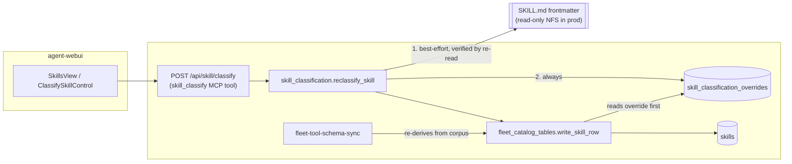

# Design Document: Skill classification write-back

Realises `CONCEPT:AU-KG.ingest.skill-classification-writeback`.

## KG Analysis (Required)

### Nearest Existing Concepts

| Concept ID | Name | Similarity | Pillar |
|---|---|---|---|
| AU-KG.ingest.fleet-catalog-relational-tables | Relational read model for the MCP/skill fleet catalog | high | AU-KG |
| AU-KG.ingest.skill-workflow-ingest | Ingest installed skills/workflows from the corpus into the KG + catalog | high | AU-KG |
| AU-OS.state.unified-durable-state-externalization | Durable state externalized out of process memory | medium | AU-OS |

### Extension Analysis

- **Primary Extension Point**: `CONCEPT:AU-KG.ingest.fleet-catalog-relational-tables`
- **Extension Strategy**: specialize
- **New Concept Required?**: Yes — see below.

### New Concept Proposal

- **Proposed ID**: `CONCEPT:AU-KG.ingest.skill-classification-writeback`
- **Augments Pillar**: KG
- **Justification**: both nearest concepts describe a **one-way derive**: the
  corpus (a `SKILL.md`'s frontmatter) is the source of truth, ingestion mirrors
  it into the KG and the relational catalog, and the next
  `fleet-tool-schema-sync` re-derives from the corpus again. Neither says
  anything about a value that originates with an **operator** rather than the
  corpus, nor about that value having to **survive** the next re-derive. That
  is a distinct decision with its own correctness obligation (an operator
  choice must never be silently reverted, and must never be reported as saved
  when it was not), so it specializes the parent rather than folding into it.

## Problem

`classify_skill_type` derives a skill's `skill_type` from its declared value.
A skill whose declared value is outside the recognized set is stored as
unclassified, and there is no way to fix it from the running system: the only
lever is the `SKILL.md` frontmatter, and **every deployed profile mounts the
`universal-skills` source tree read-only** (an NFS export; empirically
unwritable even for a mount whose k8s manifest carries no `readOnly` flag).
Worse, even where the file *can* be written, the value would be re-derived
from the corpus on the next sync, so a write into the catalog alone is
silently reverted within the hour.

## Decision

Two-tier persistence behind one capability, `reclassify_skill`
(`knowledge_graph/ingestion/skill_classification.py`):

1. **Source-of-truth attempt** — rewrite only the `skill_type` frontmatter line
   of the skill's own `SKILL.md`, via a same-directory temp file plus atomic
   `os.replace`, then **re-read the file and confirm the new value is on disk**.
   The write attempt *is* the write-access probe: neither a mount flag nor an
   `os.access()` permission bit is consulted, because both can lie about an NFS
   export's real read-only state.
2. **Durable override** — unconditionally record the choice in a new
   `skill_classification_overrides` table (id = the skill's *unbound* base id,
   plus tenant_id / skill_type / set_by / revision / idempotency_key). This
   lands in the engine's own SQL catalog store, which this process can always
   write. `write_skill_row` consults the override **before** normalizing
   whatever the caller declared, so every future re-ingest of that skill
   resolves to the operator's choice.

The override table is deliberately **not** one of the six NE-007/NE-052
ledger-migrated tables: it is new, has no legacy shape to migrate *from*, and
adding it to `_claim_and_migrate` would mean extending
`_CURRENT_SCHEMA_COLUMNS` / `_detect_diverged_schema` for a table that was
never at risk of the pre-NE-007 shape those exist to detect. It is created by
its own `CREATE TABLE IF NOT EXISTS`.

Exposed on both surfaces per this repo's parity contract: the `skill_classify`
MCP tool, auto-mounted at `POST /api/skill/classify` through the existing
`ACTION_TOOL_ROUTES` / `_make_tool_endpoint` machinery.

## Fail-closed obligation

- `reclassify_skill` returns `persisted: True` **only** when at least one of
  the two writes provably succeeded. There is no "queued, will apply later"
  state: the result is "wrote the file", "wrote a durable override the catalog
  will honour from now on", or "failed, and here is why".
- The result reports the source-file write and the durable-override write as
  two separate booleans, so a caller can never misrepresent *which* kind of
  persistence happened.
- `catalog_refreshed` is derived by **re-reading the row**, not from
  `write_skill_row`'s boolean, because that boolean conflates "CAS-rejected /
  failed" with "no-op replay because the row was already correct".
- `read_skill_classification_override` never raises: an unavailable or
  unreadable table degrades to "no override", i.e. the ingester's own declared
  value — never to an unverified grant of the operator's value.
- An unknown `skill_type` raises `SkillClassificationError` **before any write
  is attempted**.
- `mcp_skill` is not an assignable type: those skills live on a child MCP
  server and have no `SKILL.md` to attribute the choice to.

## C4 Context Diagram

## Data Flow

1. Operator picks a type on an unclassified skill's card; the UI calls
   `POST /api/skill/classify` with `{skill_id, skill_type}`.
2. `reclassify_skill` resolves the catalog row, locates the `SKILL.md` by
   re-deriving the same `skill_reference(name)` every ingester computes (no
   filesystem path is ever stored on a graph node), and attempts the
   frontmatter write.
3. The durable override is written regardless of step 2's outcome.
4. The `skills` row is rewritten and then re-read to confirm the catalog now
   reflects the target classification.
5. The UI refetches; the badge reflects the backend's confirmed state, never an
   optimistic patch. `persisted: false` renders as a failure.

## Risk Assessment

| Risk | Mitigation |
|---|---|
| Reporting success on a refused write | `persisted` is computed from two provable outcomes; the UI toast is driven by it, and a refused write leaves the flag exactly where it was. |
| Half-written `SKILL.md` | Temp file + atomic `os.replace`; the temp file is removed on failure and the underlying write error is what reaches the caller. |
| An override outliving its usefulness | The override is keyed on the *unbound* base id and is replaced by the next classify of the same skill; it is tenant-scoped, so one tenant's choice never leaks into another's catalog. |
| Extra read on the ingest hot path | One batched `SELECT` per `write_skill_row`, inside `ingest_runnable_skill`, which already issues several per-skill engine RPCs — no new per-element loop on the agent-facing surface (the B-11/GOC-68 ratchet passes). |
| `POST /api/skill/classify` absent from the OpenAPI spec | Accepted as one more entry in the frozen raw-Starlette-mount backlog (`scripts/openapi_coverage_baseline.json`), the same class as the other 234; the systemic fix is the `add_api_route` re-mount lane that `agent_utilities/gateway/schemas/*` was written for. |

## Verification

- Override round-trips, is tenant-scoped, and returns `None` when absent.
- `write_skill_row` honours an existing override over a simulated sync
  re-derive that passes the stale corpus value.
- A read-only source tree reports the source-file write as refused, the
  durable override as written, and the overall result as persisted.
- Neither write landing yields `persisted: False` with a non-null `reason`.
- An unknown `skill_type` raises before any write.
- The webui returns unclassified skills inside `skills` with
  `kg_classified: False` and no `skill_unclassified` key at all.
