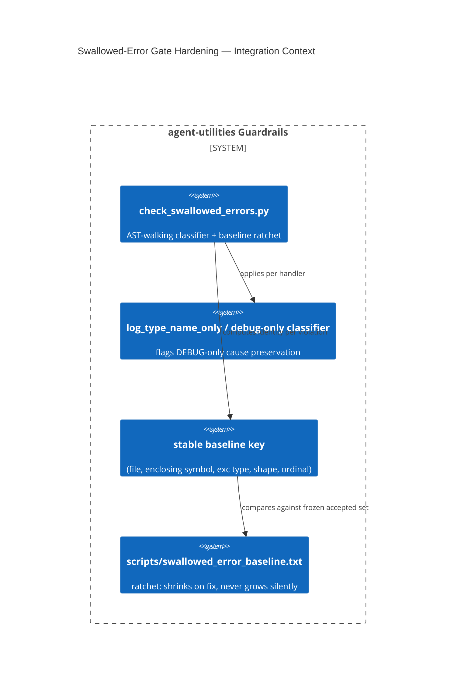

# Design Document: Swallowed-Error Gate Hardening — Stable Keys + DEBUG-Swallow Justification

> Introduced together in `1ba16dc8` (D-SWG-1, D-SWG-2). The gate's own
> docstring (`scripts/check_swallowed_errors.py`) already carries most of this
> rationale in detail — this doc formalizes it under `.specify/design/` and
> adds the KG-analysis/risk framing the gate script itself doesn't carry.

CONCEPT:AU-AHE.evaluation.debug-swallow-justification ·
CONCEPT:AU-AHE.evaluation.swallow-baseline-stable-key

## KG Analysis (Required)

### Nearest Existing Concepts

| Concept ID | Name | Similarity | Pillar |
|---|---|---|---|
| `AU-OS.governance.truthful-state-invariant` | a sibling truthfulness bug class (status re-derivation vs. cause-dropping) | 0.30 | OS |
| `AU-OS.governance.precommit-all-files-safety` | a different gate-hardening effort against a different hazard (stash-drop vs. baseline rot) | 0.20 | OS |

Both concepts here fix the *same gate* (`check_swallowed_errors.py`) against
two independent ways it had rotted; no existing concept named either.

### Extension Analysis

- **Primary Extension Point**: `scripts/check_swallowed_errors.py`.
- **Extension Strategy**: augment — the gate's classifier and baseline-key
  algorithm, not a new gate.
- **New Concept Required?**: Yes (two — a classification-policy fix and a
  baseline-mechanics fix, independently falsifiable).

### New Concept Proposal

1. **`AU-AHE.evaluation.debug-swallow-justification`** — the gate used to
   treat `logger.debug(exc)` inside an `except` block as fully
   cause-preserving, identical to `logger.error`/`.exception`. Motivated by a
   real production incident (D-DG-7): a load-bearing `RunTrace` write failure
   was silently invisible because it only logged at DEBUG, a level nobody
   watches in prod. Fix: draws a line between "the cause survives *to the
   log call*" and "survives to a level anyone actually watches" — DEBUG-only
   cause preservation is now flagged unless explicitly justified. Alternative
   rejected: banning `logger.debug` inside `except` blocks outright — too
   blunt, breaks legitimate best-effort swallows that are genuinely
   debug-only in severity.
2. **`AU-AHE.evaluation.swallow-baseline-stable-key`** — the baseline was
   keyed by `(file, line number)`. With ~20 concurrent lanes editing shared
   files, **any** unrelated edit earlier in a baselined file shifts every
   line below it and manufactures a phantom "new" violation — this happened
   repeatedly in practice (two prior manual re-key commits in git history:
   "re-key swallowed baseline for kg_server.py line shift", "...for
   loop_controller line shift") and eventually rotted the gate permanently
   red, which enforces nothing. Fix: the key is now
   `(file, enclosing symbol, exception-type text, violation shape, ordinal)`
   — computed by walking the AST — so it only changes when the handler
   itself is actually edited. Alternative rejected: hashing the handler body
   text (heavier, breaks on harmless reformatting).

- **Augments Pillar**: AHE (domain `evaluation`) — both are gate-quality
  concerns, the domain used for `check_swallowed_errors.py`'s existing
  concepts.
- **15-Phase Pipeline Integration**: pre-commit / CI guardrail phase.
- **Justification**: neither is a variant of an existing concept — one is a
  severity-classification policy, the other an identity-stability algorithm,
  for the same gate.

## C4 Context Diagram

## Data Flow

1. **ORCH**: none — static analysis gate, not a runtime path.
2. **KG**: none.
3. **AHE**: this IS an AHE-pillar evaluation-quality mechanism — a gate that
   measures whether exception causes survive to an observable log.
4. **ECO**: none.
5. **OS**: runs as a pre-commit/CI guardrail alongside the other gates in
   `guardrails.yml`.

## Risk Assessment

- **Blast Radius**: every `except` handler in `agent_utilities/**` the gate
  scans; a false positive/negative here either blocks unrelated commits or
  hides a real swallow.
- **Backward Compatible**: Yes — the baseline ratchet means existing
  handlers already accepted stay accepted; only newly-introduced or
  newly-edited handlers are re-evaluated.
- **Breaking Changes**: None.
- **What would make this wrong later**: the DEBUG-vs-other-levels
  distinction is downstream of `core/log_privacy.py`'s `exc_info`-nulling
  behavior (D-RG2-4: `exc_info=` is a no-op repo-wide for
  `agent_utilities.*` loggers — the interpolated message is the *only*
  channel that carries a cause). If that privacy shim's behavior changes
  (e.g. `exc_info` starts actually preserving a traceback again), the whole
  "survives to output" analysis this gate performs would need re-deriving.
  The stable-key algorithm would go wrong if AST-scope walking breaks on a
  new Python syntax construct, or if two identical-shaped violations swap
  ordinals across a refactor that moves/renames the enclosing function
  (accepted as out-of-scope/interchangeable today).
