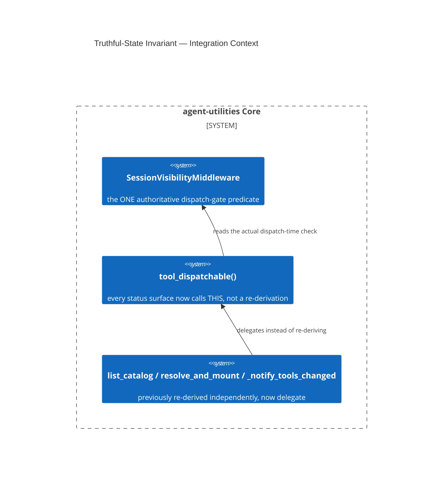

# Design Document: The Truthful-State Invariant (Favorable-Restatement Anti-Pattern)

> The full RCA already exists as
> [`docs/architecture/rca-mcp-tool-state-desync.md`](../../../docs/architecture/rca-mcp-tool-state-desync.md)
> (written in `07dcbac2`, D-OB-3) — a complete root-cause analysis with four
> independently-verified bugs, the fix, a named generalized invariant, and an
> honest survey of where the same bug class still hides. This file is a
> **pointer**, not a rewrite — the RCA already cites the concept id (line 3)
> and is the authoritative source.

CONCEPT:AU-OS.governance.truthful-state-invariant

## KG Analysis (Required)

### Nearest Existing Concepts

| Concept ID | Name | Similarity | Pillar |
|---|---|---|---|
| `AU-ECO.multiplexer.running-vs-dispatchable-metrics` | a direct application of this invariant in the metrics layer | 0.45 | ECO |
| `AU-AHE.evaluation.debug-swallow-justification` | a sibling truthfulness bug class (cause-dropping vs. status-restating) | 0.30 | AHE |

### Extension Analysis

- **Primary Extension Point**: `mcp/multiplexer.py` (`tool_dispatchable`,
  `SessionVisibilityMiddleware`, `resolve_and_mount`,
  `_notify_tools_changed`).
- **Extension Strategy**: augment — collapse duplicated re-derivations of
  "is this usable" onto one authoritative predicate.
- **New Concept Required?**: Yes — this names a general anti-pattern, not a
  single bug fix.

### New Concept Proposal

- **Proposed ID**: `CONCEPT:AU-OS.governance.truthful-state-invariant`
- **Augments Pillar**: OS (domain `governance`)
- **15-Phase Pipeline Integration**: cross-cutting — any status-reporting
  surface, at any phase.
- **Justification** (condensed from the RCA): `list_catalog`,
  `resolve_and_mount`, and `_notify_tools_changed` each re-derived "is this
  tool usable" against a **different** piece of bookkeeping than the one
  `SessionVisibilityMiddleware` actually enforces at the dispatch gate —
  three independently-verified, structurally distinct ways the same symptom
  ("reported usable, actually rejected") could occur. The fix names the
  general shape — **the favorable-restatement anti-pattern**: *"reported
  state must be derived from the authoritative source at the moment of
  reporting — never restated, cached, or inferred by a second layer that
  only witnessed the operation's outcome secondhand."* `tool_dispatchable()`
  is now the single source of truth every status surface calls into. The RCA
  documents this as (at minimum) the **fifth** occurrence of this bug shape
  in the codebase, with a grep-based checklist for finding more.

## C4 Context Diagram

## Data Flow

1. **ORCH**: none directly.
2. **KG**: none.
3. **AHE**: the RCA specifically flags provenance/reward-feeding status
   fields as high-stakes: a favorable restatement there doesn't just mislead
   a display, it can poison a *learned* signal (cited: `_execution_succeeded`
   corrupting capability-router reward — fixed separately, `51182953`).
4. **ECO**: `list_catalog`/`multiplexer_status`/`find_tools` are the direct
   ECO-pillar surfaces this invariant governs.
5. **OS**: this IS the OS-pillar governance invariant, generalized across
   the whole codebase, not scoped to one subsystem.

## Risk Assessment

- **Blast Radius**: every status-reporting surface in the fleet gateway;
  by the RCA's own admission, likely more instances exist than are yet
  found.
- **Backward Compatible**: Yes — the fixed bugs change what a status field
  reports (more honestly), which is a behavior change but not an API
  break.
- **Breaking Changes**: field renames in `list_catalog` (`"mounted"` split
  into `process_running`/`dispatchable`) — a caller pattern-matching the old
  ambiguous field name must be updated.
- **What would make this wrong later**: the RCA records three **still-open**
  instances of this exact anti-pattern, honestly, rather than implying full
  closure:
  - **D-OBC-1** — `_server_level_fallback()` still reports process-level
    `"mounted"` for `find_tools`' fallback path, outside this fix's branch.
  - **D-OBC-2** — `OntologyLifecycle.set_active()`/`load()` still wrote
    `active` from the requested flag rather than the engine's confirmed
    result on `main` at RCA-writing time, despite D-OB-14 recording it
    fixed elsewhere (subsequently addressed by
    `AU-KG.ontology.activation-fails-closed`, see the
    `ontology-governed-evolution` design doc — a direct, confirmed
    resolution of this exact open gap).
  - **D-OBC-3** — the fleet catalog's per-server "budget exceeded"
    attribution does not distinguish "this probe actually timed out" from
    "this probe was never dequeued from the semaphore in time," a plausible-
    sounding-but-unverified cause substituted for the true one.
