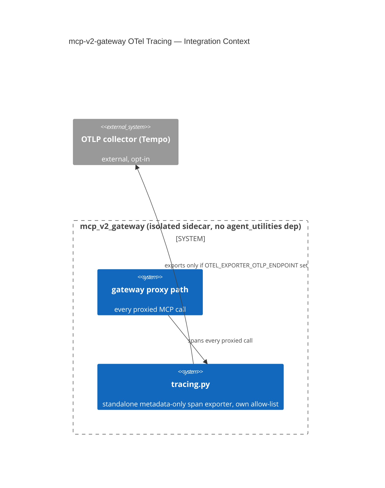

# Design Document: mcp-v2-gateway Standalone OTel Tracing

CONCEPT:AU-ECO.mcp.v2-gateway-otel-tracing

## KG Analysis (Required)

### Nearest Existing Concepts

| Concept ID | Name | Similarity | Pillar |
|---|---|---|---|
| `AU-OS.observability.otlp-trace-fanout` | agent-utilities core's own OTLP trace exporter — same signal, deliberately NOT reused here | 0.45 | OS |

### Extension Analysis

- **Primary Extension Point**: `mcp_v2_gateway/tracing.py` (new, standalone
  package).
- **Extension Strategy**: new — a parallel, deliberately non-shared
  implementation, not an extension of `agent_utilities.observability`.
- **New Concept Required?**: Yes.

### New Concept Proposal

- **Proposed ID**: `CONCEPT:AU-ECO.mcp.v2-gateway-otel-tracing`
- **Augments Pillar**: ECO (domain `mcp`)
- **15-Phase Pipeline Integration**: gateway request path — every proxied
  MCP call through `mcp_v2_gateway` is spanned.
- **Justification**: `mcp_v2_gateway` has **no dependency on
  `agent_utilities`/FastMCP at all** — it is an isolated sidecar by design.
  Reusing `agent_utilities.observability.custom_observability`'s
  metadata-only-exporter directly was the obvious alternative and was
  rejected specifically to preserve that isolation; instead this module
  **reimplements the same shape standalone** (its own allow-listed
  span-attribute/name exporter). Export is fail-open/opt-in
  (`OTEL_EXPORTER_OTLP_ENDPOINT` gates network export) because this is a
  traffic-bearing sidecar that must never block a proxied call on an
  unreachable collector.

## C4 Context Diagram

## Data Flow

1. **ORCH**: none — this is the isolated v2 gateway, not the core
   orchestrator.
2. **KG**: none.
3. **AHE**: none.
4. **ECO**: this IS the ECO-pillar gateway observability surface for the v2
   sidecar specifically, kept isolated from core's own OTel pipeline.
5. **OS**: an explicit span-attribute/name allow-list prevents secrets,
   tokens, downstream endpoints, or tool arguments from ever being logged.

## Risk Assessment

- **Blast Radius**: every request proxied through `mcp_v2_gateway`.
- **Backward Compatible**: Yes — tracing is additive and fail-open.
- **Breaking Changes**: None.
- **What would make this wrong later**: the allow-list is a manually
  maintained set of span attribute/name entries. If a new span attribute is
  added elsewhere in the gateway without updating the allow-list check, it
  silently reintroduces exactly the leak path (secrets/tool-args in traces)
  this module was built to prevent — there is no automated drift check
  between "new attribute added" and "allow-list updated."
