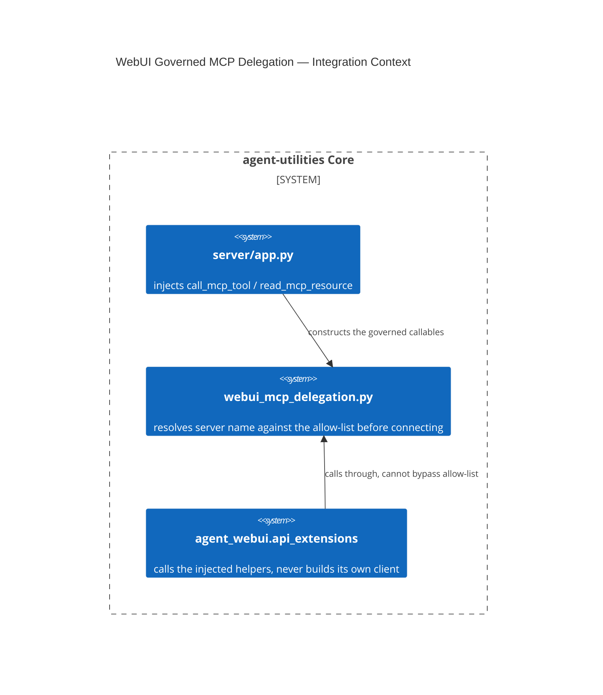

# Design Document: WebUI Backend Uses Host-Injected, Governed MCP Delegation

CONCEPT:AU-ECO.mcp.webui-governed-mcp-delegation

## KG Analysis (Required)

### Nearest Existing Concepts

| Concept ID | Name | Similarity | Pillar |
|---|---|---|---|
| `AU-ECO.ui.mcp-apps-host` | sibling trust-boundary decision (host authorizes, embedded surface never builds its own client) | 0.45 | ECO |

### Extension Analysis

- **Primary Extension Point**: `agent_utilities/server/app.py` (dependency
  injection), `agent_utilities/server/webui_mcp_delegation.py` (new).
- **Extension Strategy**: augment — inject two previously-missing callables
  into the existing `agent_webui.api_extensions` host-callback contract.
- **New Concept Required?**: Yes.

### New Concept Proposal

- **Proposed ID**: `CONCEPT:AU-ECO.mcp.webui-governed-mcp-delegation`
- **Augments Pillar**: ECO (domain `mcp`)
- **15-Phase Pipeline Integration**: gateway request path — every
  `agent-webui` ecosystem route that calls out to an MCP tool/resource.
- **Justification**: of 17 host-injected helpers `agent_webui.
  api_extensions` expects, **`call_mcp_tool` and `read_mcp_resource` were
  simply missing** — breaking every ecosystem route that needed them. The
  obvious alternative — letting the WebUI backend construct its own MCP
  client — was rejected: it would duplicate transport/auth resolution
  already owned by the host and bypass the `mcp_config` server allow-list
  boundary entirely. The fix injects the host's own resolved client so
  allow-list, credentials, and transport stay exactly where they already
  live.

## C4 Context Diagram

## Data Flow

1. **ORCH**: none directly.
2. **KG**: none.
3. **AHE**: none.
4. **ECO**: this IS the ECO-pillar host/entrypoint boundary — the WebUI is a
   thin entrypoint (per *Universal capability*) that renders output; it must
   never re-implement transport/auth.
5. **OS**: an unknown/unregistered server name raises `McpToolSourceError`
   **before** any connection opens; WebUI ecosystem routes additionally
   require `kg:admin`.

## Risk Assessment

- **Blast Radius**: every `agent-webui` ecosystem route that calls an MCP
  tool/resource (all of them were broken before this fix).
- **Backward Compatible**: Yes — pure addition of previously-missing
  injected callables.
- **Breaking Changes**: None.
- **What would make this wrong later**: this depends on every future WebUI
  route continuing to call through `call_mcp_tool`/`read_mcp_resource`
  rather than building its own client. A route that bypasses these two
  helpers would silently reintroduce the exact gap this commit closed —
  there is no structural barrier preventing a new route from doing so, only
  convention.
