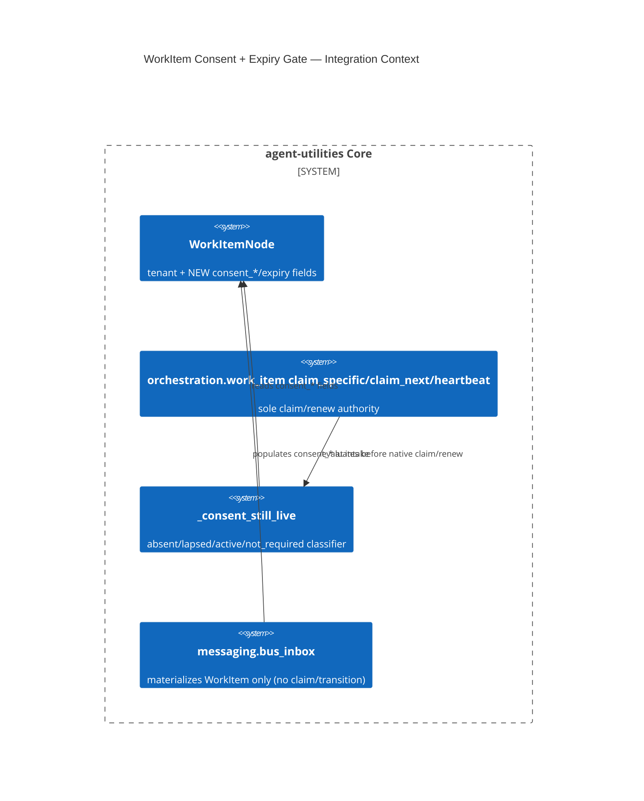

# Design Document: WorkItem Consent + Expiry Gate (D-25-3)

> `WorkItemNode` (AU-P1-1) is bound only to a tenant today — no representation of
> what a subject consented to, or when that consent lapses. This adds an opt-in
> consent/expiry state to `WorkItemNode` and enforces it on the live
> claim/renew path (`orchestration.work_item`), not just as a declared field.

## Research Provenance

Internally driven (deferred-registry gap `D-25-3`), not an external-assimilation
concept — no `open-source-libraries/` provenance row applies.

## KG Analysis (Required)

### Nearest Existing Concepts

| Concept ID | Name | Similarity | Pillar |
|---|---|---|---|
| Gap-6 `AgentCapabilityGrantNode` | per-agent capability grant with `issuer`/`granted_at`/`expires_at`/`revoked` + `is_active()` | 0.58 | ORCH |
| `AU-OS.identity.per-agent-on-behalf-delegation` | delegated-credential bounded-time revocation gate (`_delegation_still_live`, `work_item.py`) | 0.55 | OS |
| `ontology_medical.ttl` `:ConsentRecord` | patient consent with `consentScope`/`consentValidUntil`, HL7 FHIR-aligned | 0.40 | KG (medical domain) |

Highest similarity (~0.58) is below the 0.70 extend-threshold, and none of the three
is a domain match: `AgentCapabilityGrantNode` grants a capability to an *agent*, not
a work item's binding to a *subject*; the delegation gate revokes a *spawn's
credential*, not a work item's consent; `:ConsentRecord` is a separate medical-domain
node type, not a field set on `:WorkItem` itself. **New concept justified** — but
implemented as a **field extension on the existing `:WorkItem` class** (augment),
re-using the delegation gate's exact boolean-gate *shape* (`_delegation_still_live`)
rather than inventing a new enforcement idiom.

### Extension Analysis

- **Primary Extension Point**: `agent_utilities.models.knowledge_graph.WorkItemNode`
  (fields) + `agent_utilities.orchestration.work_item` (`claim_specific`/
  `claim_next`/`heartbeat`, the sole claim/renew choke points per the module's own
  "two claiming entry points" contract).
- **Extension Strategy**: augment — six new fields on `WorkItemNode`
  (`consent_required`, `consent_scope`, `consent_subject`, `consent_basis`,
  `consent_granted_at`, `consent_expires_at`), a single classification function
  (`classify_work_item_consent`), and a `_consent_still_live` gate mirroring
  `_delegation_still_live`'s call sites.
- **New Concept Required?**: Yes.

### New Concept Proposal

- **Proposed ID**: `CONCEPT:AU-ORCH.dispatch.workitem-consent-gate`
- **Augments Pillar**: ORCH (domain `dispatch`, alongside
  `AU-ORCH.dispatch.queue-agent-dispatch`, `AU-ORCH.scheduling.claim-pacing-backpressure`)
- **15-Phase Pipeline Integration**: Phase 3 (Execute) — evaluated at every claim
  (`claim_specific`/`claim_next`) and every lease renewal (`heartbeat`).
- **Justification**: no existing node/field represents "what a subject consented
  to, by whom, when, under which basis" bound to a unit of *dispatchable work*,
  nor a state machine that keeps "never consented" (absent) distinct from
  "consented, now lapsed" — both existing analogs (`AgentCapabilityGrantNode`,
  delegation) collapse to a single boolean and neither is `:WorkItem`-scoped.

## C4 Context Diagram

## Data Flow

1. **ORCH**: `submit_work_item`/`bus_inbox.commit_message_to_work_item` populate the
   consent fields at intake (opt-in, default `consent_required=False`);
   `claim_specific`/`claim_next`/`heartbeat` evaluate `_consent_still_live` before
   the native engine call.
2. **KG**: `WorkItem` OWL class gains six datatype properties
   (`ontology_orchestration.ttl`) plus a `governance.shapes.ttl` SHACL shape
   enforcing "expiry must not precede grant, and never exists without a grant".
3. **AHE**: a denied claim/renewal logs a structured `[consent]` warning
   (state + scope + subject) that is itself an evaluable signal.
4. **ECO**: no new MCP surface; existing `submit_work_item`/claim tool wrappers
   gain the optional kwargs transparently.
5. **OS**: fail-closed by construction — a malformed `consent_granted_at`/
   `consent_expires_at` classifies as `absent`/`lapsed` (never `active`).

## Risk Assessment

- **Blast Radius**: `agent_utilities/models/knowledge_graph.py` (fields),
  `agent_utilities/orchestration/work_item.py` (gate + 3 call sites),
  `agent_utilities/messaging/bus_inbox.py` (intake population only — the
  native-work-item-boundary gate forbids it from claiming/transitioning),
  `ontology_orchestration.ttl`, `governance.shapes.ttl`.
- **Backward Compatible**: Yes — `consent_required` defaults `False`; every
  pre-existing `WorkItemNode` deserializes as `not_required` (gate never
  engages) rather than silently `active` or silently `absent`-denied. See
  `WorkItemNode`'s docstring for the full migration trade-off (blanket-consented
  is a silent privacy regression for unknown legacy subject-bound items;
  blanket-unconsented halts the entire live backlog; "not applicable" changes
  nothing for existing traffic and is the deliberate choice here). Retroactively
  classifying which legacy items ARE subject-bound is an operator/data-audit
  decision this change does not make.
- **Breaking Changes**: None — opt-in only.

## Wiring (Wire-First, ≤3 hops)

- `claim_specific` → `_consent_still_live(item)` → deny (return `None`) before
  the native engine is touched = **1 hop**.
- `claim_next` → native claim (blind) → `_consent_still_live` → `defer_work_item`
  (release) → `None` = **2 hops** (the engine cannot evaluate consent itself, so
  denial is necessarily post-claim here, unlike `claim_specific`).
- `heartbeat` → `_consent_still_live(item)` → deny (return `False`) = **1 hop**
  (mirrors `_delegation_still_live`'s existing call site exactly).

## Enforcement Proof

`tests/unit/orchestration/test_work_item.py`: `test_claim_specific_denies_when_consent_is_absent`,
`test_claim_specific_denies_when_consent_has_lapsed`,
`test_claim_specific_allows_active_consent`,
`test_claim_specific_denies_on_malformed_consent_record` (fail-closed),
`test_claim_next_releases_a_consent_denied_item_instead_of_returning_it`,
`test_heartbeat_denies_once_a_running_item_s_consent_lapses`,
`test_ordinary_work_item_is_unaffected_by_the_consent_gate` (migration no-op proof).
`tests/unit/knowledge_graph/test_agent_os_objects.py`:
`test_work_item_consent_defaults_are_not_required_absent_fields`,
round-trip coverage in `test_work_item_round_trip_carries_fencing_and_dependencies`.
