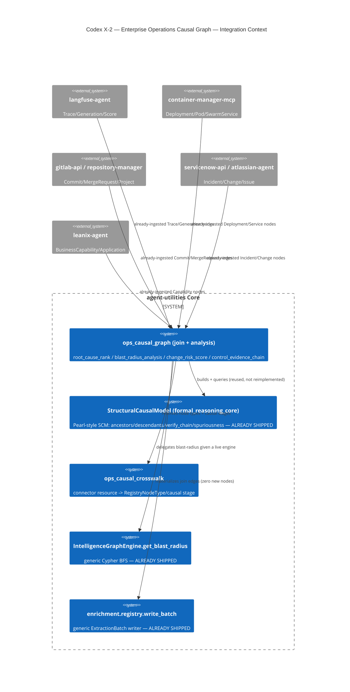

# Codex X-2 — Enterprise Operations Causal Graph

> Join the entities ALREADY ingested by the connector fleet (langfuse-agent,
> container-manager-mcp, gitlab-api/repository-manager, servicenow-api/
> atlassian-agent, leanix-agent) into ONE operations causal chain: Langfuse
> failure → agent/tool/model → service/application → container/deployment →
> Git commit/MR → Jira/ServiceNow incident/change → LeanIX capability/owner →
> policy/control/evidence. Enables root-cause ranking, blast-radius analysis,
> change-risk prediction, and control-evidence generation over that chain — a
> differentiator over a generic vector DB.

## KG Analysis (Extend-Before-Invent)

### Nearest existing concepts
- **KG-2.9 (Enterprise OS on the Epistemic Graph)** — already lays out the
  cross-connector enterprise graph vision (`.specify/design/kg-2.9-enterprise-os/strategy.md`)
  including `get_blast_radius` as the impact-analysis primitive and the exact
  connector set (ServiceNow, LeanIX, GitLab, container-manager). X-2 is the
  concrete causal-analysis slice of that vision, scoped to ops incident
  response rather than the full enterprise-OS ontology.
- **KG-2.134 (`graph_analyze`/`graph_code` `blast_radius`)** — `engine.get_blast_radius`
  is the existing generic, label-agnostic Cypher BFS impact-traversal
  primitive; X-2's `blast_radius_analysis` delegates to it directly when a
  live engine is available.
- **Structural Causal Reasoning Engine** (`agent_utilities/knowledge_graph/core/formal_reasoning_core.py`,
  `StructuralCausalModel`/`CausalVerifier`/`SpuriousnessDetector`/`CounterfactualGenerator`) —
  the Pearl-style SCM already shipped (do-calculus, d-separation, ancestor/
  descendant traversal, causal-chain verification). X-2's root-cause,
  blast-radius, and control-evidence analyses are thin compositions over this
  engine's existing methods (`get_causal_ancestors`/`get_causal_descendants`/
  `shortest_path`/`verify_chain`/`detect_spurious_edges`) — no new traversal
  algorithm.
- **Connector Ontology Manifests** (`agent_utilities/knowledge_graph/ontology/connector_manifests/*/connector_manifest.yml`,
  `connector_manifest.HUB_NAME_HEURISTIC_CROSSWALK`) — the existing per-
  connector resource→OWL-class crosswalk discipline (name-heuristic table,
  "unresolved stays unresolved — never guessed", `review_todos` for anything
  DRAFT). X-2's `ops_causal_crosswalk.py` reuses this same discipline but
  targets the broader, already-populated `RegistryNodeType`/`RegistryEdgeType`
  LPG vocabulary every traversal primitive actually operates over, since
  several resources this chain needs (`Commit`, `MergeRequest`, `Deployment`,
  `Change`, `ConfigurationItem`, `BusinessCapability`) are unresolved or too
  generic (`FactSheet`) in the shipped OWL manifests today.
- **Enrichment extractor registry** (`agent_utilities/knowledge_graph/enrichment/registry.py`,
  `extractors/archer.py` as the concrete cross-domain edge-adding precedent) —
  the self-registering extractor + generic `write_batch` writer pattern X-2's
  `materialize_ops_causal_links` reuses verbatim (an `ExtractionBatch` with
  zero new nodes, only join edges).

### Extension analysis
- **Primary extension points**: the `formal_reasoning_core` StructuralCausalModel
  family (KG-2.134-adjacent compute pillar), the connector-manifest crosswalk
  pattern, the enrichment extractor/writer pattern, `engine.get_blast_radius`.
- **Extension strategy**: **compose** — X-2 is a join + analysis layer over
  already-ingested entities and already-shipped causal-reasoning primitives.
  No new ingestion path, no new traversal engine.
- **New concept required?**: Yes, for the join layer itself — two small,
  scoped modules:
  - `CONCEPT:AU-KG.ontology.ops-causal-crosswalk` — the connector-resource →
    hub-`RegistryNodeType`/causal-stage crosswalk, plus the causally-directed
    edge spine (`OPS_CAUSAL_EDGE_CHAIN`). Adds exactly one hub node type
    (`RegistryNodeType.CHANGE_REQUEST` — ServiceNow's planned "Change" ticket,
    distinct from `INCIDENT`) and one edge type (`RegistryEdgeType.USED_MODEL`
    — a Generation actually invoked this Model, distinct from the routing-
    eligibility edge `COMPATIBLE_WITH_MODEL`); every other stage reuses
    existing hub vocabulary.
  - `CONCEPT:AU-KG.enrichment.ops-causal-graph` — the join (`materialize_ops_causal_links`,
    reusing the shared enrichment writer) and the four analyses
    (`root_cause_rank`, `blast_radius_analysis`, `change_risk_score`,
    `control_evidence_chain`), each a thin composition over the SCM engine
    above. Exposed as the `graph_ops_causal` MCP tool
    (`agent_utilities/mcp/tools/ops_causal_tools.py`) mirroring the existing
    `graph_mine`/`graph_code` action-router shape, and the `kg-ops-causal`
    skill.

## C4 Context Diagram

## Data Flow
1. **ORCH**: An investigating agent (or the Loop engine on an anomaly signal)
   calls `graph_ops_causal(action="root_cause", node_id=<failing trace>)`.
2. **KG**: Reads already-ingested nodes/edges across the six connectors;
   writes ONLY join edges (via `materialize_ops_causal_links`) linking
   existing ids — never new entities.
3. **AHE**: `change_risk_score` composes structural exposure with historical
   incident severity, giving the harness a risk signal it can fold into
   pre-merge gates over time.
4. **ECO**: Exposed as the `graph_ops_causal` MCP tool + REST twin
   (`POST /ops/causal`), discoverable via the `kg-ops-causal` skill.

## Phased plan
- **X-2.0 (this change)**: crosswalk + join + the four analyses + MCP/skill
  surface + synthetic-graph tests.
- **Follow-up**: richer per-connector crosswalks for the currently-DRAFT/
  unresolved manifest fields (`Deployment`, `ConfigurationItem`,
  `BusinessCapability` owner/responsible relations — LeanIX's manifest
  declares no owner relation today) and a production `load_ops_causal_neighborhood`
  hardening pass once a live multi-connector KG is available to validate
  the join-key heuristics against real data.
