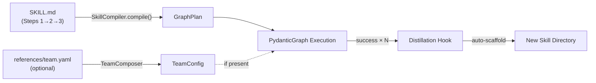

# Workflow → Skill Refactor: Every Skill IS a Workflow

## Core Insight

**SKILL.md IS the workflow definition.** The prose steps in SKILL.md are the canonical workflow — we need a `SkillCompiler` that natively parses any SKILL.md into a `GraphPlan`. No separate `workflow.yaml` needed. The KG stores a reference edge (`DEFINED_BY_SKILL`) pointing to the skill directory, not a copy.



### Decision Summary

| Decision | Answer |
|----------|--------|
| Bundle code fate | **Option B** — Remove `bundle.py`, `presets/` entirely |
| workflow.yaml | **Not needed** — SkillCompiler parses SKILL.md natively |
| team.yaml absent | General pydantic graph, no specialized team |
| Category placement | `universal_skills/workflows/<domain>/<skill-name>/` |
| Atomic vs grouped | **Atomic** — one skill per workflow chain |
| Distillation output | **Auto-scaffold** new skill directory in `universal_skills/workflows/` |

---

## Proposed Changes

### Component 1: SkillCompiler — SKILL.md → GraphPlan

#### [NEW] `agent_utilities/workflows/skill_compiler.py`

The translation layer that makes any skill executable as a workflow:

```python
class SkillCompiler:
    """Compile a SKILL.md into a GraphPlan.

    CONCEPT:ORCH-1.25 — Skill-to-Workflow Compilation

    Parses procedural steps from SKILL.md markdown body into
    ExecutionStep sequences. Handles:
    - "### Step N:" header patterns
    - Numbered list patterns (1. 2. 3.)
    - Agent references in step text (delegates, uses, triggers)
    - MCP tool references (mcp_*_*)
    """

    @staticmethod
    def compile(skill_dir: Path) -> GraphPlan:
        """Parse SKILL.md and return a GraphPlan."""

    @staticmethod
    def compile_from_text(name: str, markdown: str) -> GraphPlan:
        """Parse raw markdown into a GraphPlan (for KG-stored skills)."""

    @staticmethod
    def load_team_config(skill_dir: Path) -> TeamConfigBlueprint | None:
        """Load references/team.yaml if it exists, else None."""
```

**Parsing Strategy:**
1. Parse YAML frontmatter → extract `name`, `description`, `tags`
2. Scan markdown body for step patterns:
   - `### Step N:` headers (primary — like `agent-utilities-evolution` uses)
   - `1. **Step Name**:` numbered bold patterns
   - Sequential `###` subsections under a `## Workflow` or `## Execution Steps` section
3. Within each step, extract:
   - Agent references: text matching known MCP server names or agent patterns
   - Tool references: `mcp_*_*` patterns
   - Dependency chain: sequential by default, explicit `depends_on` if annotated
4. Build `GraphPlan` with `ExecutionStep` nodes

---

### Component 2: Remove Bundle Infrastructure

#### [DELETE] `agent_utilities/workflows/bundle.py`
#### [DELETE] `agent_utilities/workflows/presets/__init__.py`
#### [DELETE] `agent_utilities/workflows/presets/finance.yaml`
#### [DELETE] `agent_utilities/workflows/presets/infrastructure.yaml`
#### [DELETE] `agent_utilities/workflows/presets/research.yaml`
#### [DELETE] `agent_utilities/workflows/presets/social.yaml` (if exists)
#### [DELETE] `agent_utilities/workflows/presets/super_grok.yaml` (if exists)

#### [MODIFY] `agent_utilities/workflows/__init__.py`
Remove `BundleExporter`, `BundleImporter`, `TeamConfigBlueprint`, `WorkflowBundle` exports. Add `SkillCompiler` export.

#### [MODIFY] `agent_utilities/workflows/distillation_hook.py`
Remove `WorkflowStore.save_from_execution()` call. Replace with skill directory scaffolding.

---

### Component 3: Migrate Presets to Workflow Skills

Each current preset workflow becomes an atomic skill in `universal-skills`:

#### Finance Domain
```
universal_skills/workflows/finance/portfolio-analysis/
├── SKILL.md
└── references/
    └── team.yaml

universal_skills/workflows/finance/market-sentiment/
├── SKILL.md
└── references/
    └── team.yaml
```

#### Infrastructure Domain
```
universal_skills/workflows/infrastructure/health-sweep/
├── SKILL.md
└── references/
    └── team.yaml

universal_skills/workflows/infrastructure/topology-discovery/
├── SKILL.md
└── references/
    └── team.yaml
```

#### Research Domain
```
universal_skills/workflows/research/paper-scan/
├── SKILL.md
└── references/
    └── team.yaml

universal_skills/workflows/research/concept-evolution/
├── SKILL.md
└── references/
    └── team.yaml
```

Each `SKILL.md` follows the established pattern from `agent-utilities-evolution`:
- Frontmatter with name, description, tags
- `## Overview` section
- `## Workflow Execution Steps` with `### Step N:` headers
- Each step describes what the agent should do, which MCP tools to use
- `## References` linking to related skills

Each `references/team.yaml` follows the format:
```yaml
name: portfolio_analysis_team
task_pattern: portfolio analysis with risk assessment
specialist_ids:
  - market-data-connector
  - quantitative-analyst
  - risk-assessor
  - report-synthesizer
tool_assignments:
  market-data-connector: [fetch_prices, fetch_holdings]
  quantitative-analyst: [calculate_metrics, backtest]
execution_mode: mixed
success_rate: 0.85
origin: upstream
```

---

### Component 4: Distillation Hook → Skill Scaffolding

#### [MODIFY] `agent_utilities/workflows/distillation_hook.py`

When a workflow pattern exceeds the promotion threshold, the hook scaffolds a new skill directory:

```python
async def _scaffold_skill(self, pattern_key: str, plan: GraphPlan,
                           team_config_id: str | None) -> Path:
    """Scaffold a new skill directory from a proven execution pattern.

    Creates:
      universal_skills/workflows/distilled/<skill-name>/
      ├── SKILL.md          (generated from plan steps)
      └── references/
          └── team.yaml     (generated from TeamConfig if available)
    """
```

The scaffolded SKILL.md will be a skeleton — good enough to execute, but marked for human review:

```markdown
---
name: distilled-<pattern-hash>
description: >-
  Auto-generated workflow skill from successful execution pattern.
  Promoted after N successful runs. Review and refine before distribution.
tags: [distilled, auto-generated, workflow]
metadata:
  author: distillation-hook
  version: '0.1.0'
  promoted_at: <timestamp>
  success_count: <N>
---
# Distilled Workflow: <pattern_name>

> [!NOTE]
> This skill was auto-generated by the distillation pipeline (ORCH-1.25).
> Review and refine the steps below before distributing.

## Workflow Execution Steps
### Step 1: <agent-a>
<refined_subtask from plan>

### Step 2: <agent-b>
<refined_subtask from plan>
```

---

### Component 5: KG Integration — Skill Reference Edges

#### [MODIFY] `agent_utilities/workflows/skill_compiler.py`

Add KG registration that creates `DEFINED_BY_SKILL` edges:

```python
@staticmethod
def register_in_kg(engine, skill_dir: Path) -> dict[str, Any]:
    """Register a workflow skill in the KG.

    Creates:
    - WorkflowDefinition node (from compiled GraphPlan)
    - TeamConfigNode (from team.yaml if present)
    - DEFINED_BY_SKILL edge → SkillNode
    """
```

---

### Component 6: Documentation Updates

#### [MODIFY] `docs/pillars/1_graph_orchestration/ORCH-1.25-Workflow_Distillation.md`
Rewrite to reflect skill-based model. Remove bundle format docs.

#### [MODIFY] `docs/pillars/architecture_c4.md`
Update distillation flow diagram: replace "Bundle Exporter" → "Skill Scaffolder".

#### [MODIFY] `docs/concept_map.md`
Update ORCH-1.25 description.

---

### Component 7: Tests

#### [REWRITE] `tests/test_workflow_bundle.py` → `tests/test_skill_compiler.py`

| Test | What It Validates |
|------|------------------|
| `test_compile_from_evolution_skill` | Parse `agent-utilities-evolution` SKILL.md → GraphPlan |
| `test_compile_step_patterns` | Various markdown step formats → ExecutionStep[] |
| `test_load_team_yaml` | Parse references/team.yaml → TeamConfigBlueprint |
| `test_no_team_yaml_returns_none` | Skill without team.yaml → None (general execution) |
| `test_register_in_kg` | KG node + edge creation |
| `test_distillation_scaffolds_skill` | Hook creates valid skill directory |
| `test_scaffolded_skill_compiles` | Auto-generated SKILL.md round-trips through compiler |
| `test_workflow_skills_exist` | All 6 migrated workflow skills have valid SKILL.md + team.yaml |

---

## Verification Plan

### Automated Tests
```bash
uv run pytest tests/test_skill_compiler.py -v
uv run pytest tests/test_conductor_workflow.py tests/test_team_config.py -v  # regression
```

### Integration Test
- Compile the existing `agent-utilities-evolution` SKILL.md through `SkillCompiler.compile()` and verify it produces a valid GraphPlan with the correct step chain.

### Manual Verification
- Verify each migrated workflow skill has proper SKILL.md frontmatter + references/team.yaml
- Verify the distillation hook creates a valid, compilable skill directory
