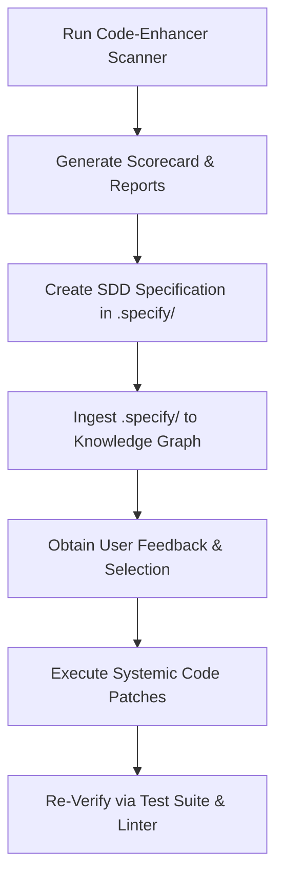

# Implementation Plan - ScholarX Code Enhancement & SDD

This plan details our approach to running the multi-domain `code-enhancer` tool against the `scholarx` repository, analyzing the resulting scorecard, generating an SDD-compatible specification, and systematically executing the proposed improvements.

## User Review Required

> [!IMPORTANT]
> - **Read-Only Discovery First**: We will run the code-enhancer scanner first to gather baseline grades, security alerts, code smells, and XDG compliance issues without modifying any source files.
> - **SDD Integration**: Once the report is generated, we will map findings into `.specify/` specifications (TDD checklist) for the `sdd-implementer` pipeline.
> - **XDG Compliance Check**: Any custom caching/local storage will be verified against the XDG recommended standard (`~/.cache`, `~/.local/share`).

## Open Questions

> [!IMPORTANT]
> 1. **Focus Areas**: Are there specific domains you want us to prioritize during the remediation (e.g., Security, Complexity Refactoring, XDG Compliance, or Dependency updates)?
> 2. **Pre-Commit Isolation**: Since the global pre-commit has environment package isolation issues (e.g., with `anthropic` beta types), we will run individual tools (`ruff`, `mypy`, `bandit`, and `pytest`) directly via the project `.venv` during validation. Does that work for you?

---

## Proposed Workflow



### Phase 1: Scan and Discover
We will execute the `code-enhancer` suite:
```bash
uv run python /home/genius/.gemini/antigravity/skills/code-enhancer/scripts/run_multi_project.py /home/apps/workspace/agent-packages/agents/scholarx -o /home/apps/workspace/reports/scholarx_code_enhancer
```
This generates a multi-domain JSON report under `/home/apps/workspace/reports/scholarx_code_enhancer/scholarx/results.json`.

### Phase 2: SDD Parity Integration
- We will convert the actionable findings into a structured SDD plan in `.specify/`.
- Ingest the newly defined specifications using the `kg_ingest` tool to sync with the unified Knowledge Graph.

### Phase 3: Systematic Handoff & Remediation
- Create a clear checklist in `task.md`.
- Implement fixes in small, contiguous steps using strict TDD guidelines:
  1. Add/modify test assertions.
  2. Implement code refinements.
  3. Validate using local linters, typecheckers, and tests.

## Proposed Changes

We will execute target enhancements across the following components:

### 1. Concept Traceability & Pytest Quality

#### [NEW] [conftest.py](file:///home/apps/workspace/agent-packages/agents/scholarx/tests/conftest.py)
*   Create a central `conftest.py` to store shared fixtures (such as mock temporary storage paths, Respx router templates, and clients).
*   Add `@pytest.mark.concept` decorators to tests in:
    *   `tests/test_cli_extended.py`
    *   `tests/test_mcp_server.py`
    *   `tests/test_kg_integration.py`
    *   `tests/test_paper_storage.py`
    *   `tests/test_providers.py`
    *   `tests/test_queue.py`

#### [MODIFY] [test files](file:///home/apps/workspace/agent-packages/agents/scholarx/tests/)
*   Improve test assertions to replace weak checks (e.g. `assert result is not None`) with strong schema, length, and content-equality assertions.
*   Annotate significant functions in `scholarx/` source files with `CONCEPT:` markers in their docstrings to ensure 100% bidirectional traceability.

### 2. Environment Variables & Configuration

#### [MODIFY] [.env.example](file:///home/apps/workspace/agent-packages/agents/scholarx/.env.example)
*   Add `DEFAULT_AGENT_NAME` and other critical runtime parameters to `.env.example`.

### 3. Documentation Governance

#### [MODIFY] [README.md](file:///home/apps/workspace/agent-packages/agents/scholarx/README.md)
*   Add comprehensive "Usage" and "Quick Start" sections with realistic code block examples.
*   Document all environment variables (`AUTH_TYPE`, `DEFAULT_AGENT_NAME`, `DISCOVERYTOOL`, etc.) with their default values and descriptions.
*   Fix broken relative/internal Markdown links.

### 4. Version Alignment

#### [MODIFY] [CHANGELOG.md](file:///home/apps/workspace/agent-packages/agents/scholarx/CHANGELOG.md)
*   Ensure that the current release version matches the configuration in `pyproject.toml` (v0.11.0) to eliminate version drift warnings.

---

## Verification Plan

### Automated Verification
- **Test Suite**: Run the test suite:
  ```bash
  .venv/bin/pytest tests/
  ```
- **Type Checking**:
  ```bash
  .venv/bin/mypy scholarx/
  ```
- **Formatting & Linting**:
  ```bash
  .venv/bin/ruff check scholarx/
  ```
- **Re-run Code Enhancer**:
  Execute the scratch runner again to ensure all target GPA and grade improvements are successfully captured.
