# Unified Parallel Engine — First Principles Architecture

## Goal

Collapse **all** existing multi-agent execution patterns into a single **Unified Parallel Engine (UPE)** that dynamically scales from 1 agent to 300+ agents with zero code-path divergence. Unify RLM-native output synthesis, KG-stored workflow/TeamConfig templates, and hierarchical department structures under one abstraction.

## Background — The Fragmentation Problem

Today we have **6 separate systems** that each implement parallel agent execution differently:

| Current System | Location | What It Does | Parallelism Mechanism |
|---|---|---|---|
| `DynamicSubgraphOrchestrator` | `graph/dynamic_graph_orchestrator.py` | KG-driven team synthesis + chromatic scheduling | Custom DAG batching |
| `HeavyThinkingOrchestrator` | `graph/heavy_thinking.py` | K-parallel thinkers → deliberation | `asyncio.gather` |
| `RLMEnvironment` | `rlm/repl.py` | `run_parallel_sub_calls()` | `asyncio.gather` |
| `SubagentPatternRouter` | `graph/subagent_patterns.py` | 4-tier pattern selection | Delegates to above |
| `CoordinationLayer` | `graph/coordination.py` | Protocol selection + application | Protocol setup only |
| `WorkflowRunner` | `workflows/runner.py` | Wave-based batch execution | Sequential waves |

**All six converge on the same primitives**: `asyncio.gather`, `asyncio.Semaphore`, Pydantic result models, KG persistence, and LLM synthesis. The user's insight is correct — **these should be one engine**.

---

## First Principles

> [!IMPORTANT]
> **Principle 1 — One Engine, Dynamic Scale**: A single `UnifiedParallelEngine` handles every execution from a trivial 1-agent LLM call to a 300-agent enterprise swarm. The _same code path_ runs for all scales.

> [!IMPORTANT]
> **Principle 2 — RLM-Native Synthesis**: All output aggregation uses the RLM pattern: store outputs in Pydantic objects (not context windows), use metadata-only pointers, and let the synthesizer agent access results programmatically. SwarmExecution _is_ RLM execution.

> [!IMPORTANT]
> **Principle 3 — Topology from Workflow**: The engine generates an `ExecutionManifest` from any source: a user query, a Skill workflow, a KG TeamConfig, a stored SwarmTemplate, or an OWL-materialized company department. The manifest is the only input.

> [!IMPORTANT]
> **Principle 4 — XDG-Native Config**: All scaling parameters live in `~/.config/agent-utilities/config.json` via `AgentConfig`, not in scattered per-module configs.

---

## Proposed Changes

### Component 1: Execution Manifest & Config Models

#### [MODIFY] [config.py](file:///home/apps/workspace/agent-packages/agent-utilities/agent_utilities/core/config.py)

Add unified parallel execution config to `AgentConfig`:

```python
# --- Unified Parallel Engine (CONCEPT:ORCH-1.25) ---

max_parallel_agents: int = Field(default=50, alias="MAX_PARALLEL_AGENTS")
"""Maximum concurrent agent executions across the entire engine (CONCEPT:ORCH-1.25).
Acts as a global semaphore. Set higher for cloud deployments with high API limits."""

parallel_batch_size: int = Field(default=25, alias="PARALLEL_BATCH_SIZE")
"""Number of agents per execution wave when batching is needed (CONCEPT:ORCH-1.25)."""

synthesis_strategy: str = Field(default="auto", alias="SYNTHESIS_STRATEGY")
"""Default output synthesis strategy: 'auto', 'flat', 'hierarchical', 'progressive', 'rlm'.
'auto' selects based on agent count and output size (CONCEPT:ORCH-1.26)."""

synthesis_ratio: int = Field(default=10, alias="SYNTHESIS_RATIO")
"""In hierarchical synthesis, how many outputs per synthesis sub-node (CONCEPT:ORCH-1.26)."""

agent_execution_timeout: float = Field(default=120.0, alias="AGENT_EXECUTION_TIMEOUT")
"""Per-agent execution timeout in seconds (CONCEPT:ORCH-1.25)."""

circuit_breaker_threshold: int = Field(default=3, alias="CIRCUIT_BREAKER_THRESHOLD")
"""Number of consecutive failures before disabling an agent type (CONCEPT:ORCH-1.25)."""

enable_progressive_synthesis: bool = Field(default=True, alias="ENABLE_PROGRESSIVE_SYNTHESIS")
"""Enable streaming synthesis as agents complete (CONCEPT:ORCH-1.26)."""
```

---

#### [NEW] [execution_manifest.py](file:///home/apps/workspace/agent-packages/agent-utilities/agent_utilities/models/execution_manifest.py)

**The universal input to the Unified Parallel Engine.** Every execution — from a single LLM call to a 300-agent swarm — is expressed as an `ExecutionManifest`.

```python
class AgentSpec(BaseModel):
    """Specification for a single agent in the execution manifest."""
    agent_id: str                        # Which agent prompt/type
    role: str                            # Functional role (researcher, auditor, etc.)
    department: str = "general"          # Hierarchical department
    tools: list[str] = []               # MCP server tools this agent uses
    model_id: str = ""                   # Override model selection
    system_prompt: str = ""              # Override system prompt
    task_template: str = ""              # Task with {{partition}} placeholder
    partitions: list[str] = []           # What this agent works on (if fan-out)
    depends_on: list[str] = []           # Agent IDs this depends on (DAG edges)
    timeout: float | None = None         # Override per-agent timeout
    memory_channels: list[str] = ["episodic"]

class SynthesisSpec(BaseModel):
    """How to merge outputs from parallel agents."""
    strategy: Literal["auto", "flat", "hierarchical", "progressive", "rlm"] = "auto"
    ratio: int = 10                      # For hierarchical: outputs per synth node
    model_id: str = ""                   # Model for synthesis LLM calls
    output_schema: str | None = None     # Optional Pydantic model for typed output

class ExecutionManifest(BaseModel):
    """Universal execution specification for the Unified Parallel Engine.

    CONCEPT:ORCH-1.25 — Unified Parallel Engine

    This is the ONLY input to the engine. Everything — from a single
    agent query to a 300-agent enterprise swarm — is expressed as a manifest.
    """
    manifest_id: str = Field(default_factory=lambda: f"manifest:{uuid4().hex[:8]}")
    name: str = ""
    agents: list[AgentSpec]               # The agents to execute
    synthesis: SynthesisSpec = SynthesisSpec()
    coordination_protocol: str = "auto"   # Protocol from CoordinationLayer
    execution_mode: str = "auto"          # auto | sequential | parallel | mixed | wave
    max_concurrency: int | None = None    # Override global config
    batch_size: int | None = None         # Override global config
    query: str = ""                       # Original user query
    context: str = ""                     # Shared context for all agents
    metadata: dict[str, Any] = {}         # Workflow/TeamConfig provenance

    # Derived fields (set by the engine, not the caller)
    source: str = ""                      # "planner" | "workflow" | "teamconfig" | "skill" | "preset"
    kg_template_id: str | None = None     # If materialized from a KG SwarmTemplate

    @property
    def agent_count(self) -> int:
        """Total agent invocations including fan-out partitions."""
        return sum(max(1, len(a.partitions)) for a in self.agents)

    @property
    def is_trivial(self) -> bool:
        """Single agent, no fan-out — fast-path to inline execution."""
        return len(self.agents) == 1 and not self.agents[0].partitions
```

---

### Component 2: Unified Parallel Engine

#### [NEW] [unified_parallel_engine.py](file:///home/apps/workspace/agent-packages/agent-utilities/agent_utilities/graph/unified_parallel_engine.py)

**The single engine that replaces all 6 fragmented systems.** This is the crown jewel.

```python
class UnifiedParallelEngine:
    """CONCEPT:ORCH-1.25 — Unified Parallel Engine.

    Replaces DynamicSubgraphOrchestrator, HeavyThinkingOrchestrator,
    SubagentPatternRouter, RLMEnvironment.run_parallel_sub_calls,
    CoordinationLayer, and WorkflowRunner wave execution with a single
    abstraction.

    Execution flow:
        1. Receive ExecutionManifest (from planner, workflow, skill, or preset)
        2. Resolve "auto" fields (execution_mode, synthesis, coordination)
        3. Build dependency DAG from agent specs
        4. Chromatic-schedule parallel groups
        5. Execute waves with semaphore-governed concurrency
        6. Synthesize outputs using RLM-native strategy
        7. Persist results to KG
        8. Return ExecutionResult

    Key design: The SAME code path handles:
        - 1 agent (trivial query → inline execution)
        - 3-5 agents (team of specialists → standard parallel)
        - 10-50 agents (department-scale → wave batching)
        - 50-300+ agents (enterprise swarm → hierarchical synthesis)
    """

    def __init__(self, engine: IntelligenceGraphEngine | None = None):
        self.engine = engine
        self.coordination = CoordinationLayer(engine=engine)
        self.config = config  # XDG AgentConfig singleton

    async def execute(
        self,
        manifest: ExecutionManifest,
        graph_deps: GraphDeps | None = None,
    ) -> ExecutionResult:
        """Execute a manifest. This is the ONLY entry point."""

        # 1. Resolve auto-configuration
        resolved = self._resolve_manifest(manifest)

        # 2. Build DAG and schedule
        dag = self._build_dag(resolved)
        waves = self._schedule_waves(dag, resolved)

        # 3. Select coordination protocol
        protocol = self.coordination.select_protocol(
            agent_count=resolved.agent_count,
            execution_mode=resolved.execution_mode,
        )

        # 4. Execute waves with backpressure
        semaphore = asyncio.Semaphore(
            resolved.max_concurrency or self.config.max_parallel_agents
        )
        wave_results = []
        for wave_idx, wave in enumerate(waves):
            emit_graph_event(..., "wave_started", wave=wave_idx, agents=len(wave))
            results = await self._execute_wave(wave, semaphore, graph_deps)
            wave_results.append(results)
            emit_graph_event(..., "wave_completed", wave=wave_idx)

        # 5. Synthesize outputs (RLM-native)
        all_outputs = [r for wave in wave_results for r in wave]
        synthesis = await self._synthesize(
            all_outputs, resolved.synthesis, resolved.query, graph_deps
        )

        # 6. Persist to KG
        execution_id = self._persist_execution(resolved, wave_results, synthesis)

        return ExecutionResult(
            manifest_id=resolved.manifest_id,
            execution_id=execution_id,
            synthesis_output=synthesis,
            wave_results=wave_results,
            agent_count=resolved.agent_count,
            protocol=protocol,
        )

    def _resolve_manifest(self, m: ExecutionManifest) -> ExecutionManifest:
        """Resolve 'auto' fields based on agent count and complexity."""
        if m.execution_mode == "auto":
            if m.is_trivial:
                m.execution_mode = "sequential"
            elif m.agent_count <= 5:
                m.execution_mode = "parallel"
            elif m.agent_count <= 50:
                m.execution_mode = "wave"
            else:
                m.execution_mode = "wave"  # Always wave for large counts

        if m.synthesis.strategy == "auto":
            if m.agent_count == 1:
                m.synthesis.strategy = "flat"
            elif m.agent_count <= 10:
                m.synthesis.strategy = "flat"
            elif m.agent_count <= 50:
                m.synthesis.strategy = "hierarchical"
            else:
                m.synthesis.strategy = "rlm"  # Full RLM for massive scale

        return m

    async def _synthesize(self, outputs, spec, query, deps) -> str:
        """RLM-native synthesis — outputs are NEVER loaded into context.

        CONCEPT:ORCH-1.26 — RLM-Native Hierarchical Synthesis

        Uses RLMEnvironment to programmatically process outputs
        stored as Pydantic objects, not dumped into the context window.
        """
        if spec.strategy == "flat":
            return "\n---\n".join(o.output for o in outputs if o.success)

        elif spec.strategy == "hierarchical":
            # Group outputs → sub-summaries → final summary
            return await self._hierarchical_synthesis(outputs, spec, query, deps)

        elif spec.strategy == "rlm":
            # Full RLM: spawn RLMEnvironment with outputs as context variable
            env = RLMEnvironment(
                context=json.dumps([o.model_dump() for o in outputs]),
                config=RLMConfig(
                    metadata_only_root=True,
                    async_enabled=True,
                ),
                graph_deps=deps,
            )
            return await env.run_full_rlm(
                f"Synthesize {len(outputs)} agent outputs for: {query}"
            )

        elif spec.strategy == "progressive":
            return await self._progressive_synthesis(outputs, spec, query, deps)
```

---

### Component 3: Manifest Generators (Replace Fragmented Entry Points)

#### [NEW] [manifest_generators.py](file:///home/apps/workspace/agent-packages/agent-utilities/agent_utilities/graph/manifest_generators.py)

Functions that generate `ExecutionManifest` objects from various sources, replacing the separate orchestrators:

```python
def manifest_from_planner(
    plan: GraphPlan,
    query: str,
    engine: IntelligenceGraphEngine | None = None,
) -> ExecutionManifest:
    """Generate manifest from the HTN planner output (replaces dispatcher_step logic)."""

def manifest_from_teamconfig(
    team: TeamComposition,
    query: str,
) -> ExecutionManifest:
    """Generate manifest from a KG TeamConfig (replaces DynamicSubgraphOrchestrator)."""

def manifest_from_workflow(
    workflow: GraphPlan,
    query: str,
) -> ExecutionManifest:
    """Generate manifest from a Skill workflow (replaces WorkflowRunner wave logic)."""

def manifest_from_heavy_thinking(
    query: str,
    k: int = 4,
    context: str = "",
) -> ExecutionManifest:
    """Generate manifest for heavy thinking (replaces HeavyThinkingOrchestrator).

    Creates K parallel thinker agents + 1 deliberator agent with
    depends_on=[all thinkers].
    """

def manifest_from_preset(
    preset_name: str,
    partitions: list[str],
    query: str,
) -> ExecutionManifest:
    """Generate manifest from a KG-stored SwarmTemplate preset."""

def manifest_from_department(
    department: str,
    task: str,
    engine: IntelligenceGraphEngine,
) -> ExecutionManifest:
    """Generate manifest from an OWL-materialized company department.

    CONCEPT:ORCH-1.27 — Autonomous Department Orchestration

    Queries the KG for all agents in a department, their tools,
    their reporting hierarchy, and generates a manifest with
    proper depends_on edges matching the org chart.
    """

def manifest_for_enterprise(
    task: str,
    engine: IntelligenceGraphEngine,
) -> ExecutionManifest:
    """Generate a full enterprise manifest — ALL agents across ALL departments.

    This is the 300-agent case: every agent, every MCP server,
    organized hierarchically by department with inter-department
    dependencies.
    """
```

---

### Component 4: Router Integration

#### [MODIFY] [routing.py](file:///home/apps/workspace/agent-packages/agent-utilities/agent_utilities/graph/routing.py)

The `router_step()` becomes the single decision point that generates an `ExecutionManifest` and hands it to the `UnifiedParallelEngine`:

```python
# In router_step():
# After planning, instead of branching to different orchestrators:

manifest = manifest_from_planner(plan, query, engine=deps.knowledge_engine)

# Check if heavy thinking is warranted
if complexity >= config.heavy_thinking_threshold:
    manifest = manifest_from_heavy_thinking(query, k=4, context=context)

# Check for department-scale or enterprise-scale
if plan.metadata.get("department"):
    manifest = manifest_from_department(plan.metadata["department"], query, engine)

# Single execution path for everything:
upe = UnifiedParallelEngine(engine=deps.knowledge_engine)
result = await upe.execute(manifest, graph_deps=deps)
```

#### [MODIFY] [subagent_patterns.py](file:///home/apps/workspace/agent-packages/agent-utilities/agent_utilities/graph/subagent_patterns.py)

Simplify: `SubagentPatternRouter.select_pattern()` now returns an `ExecutionManifest` directly instead of a pattern enum. The INLINE_TOOL / FAN_OUT / AGENT_POOL / TEAMS taxonomy becomes metadata on the manifest, not separate code paths.

#### [MODIFY] [dynamic_graph_orchestrator.py](file:///home/apps/workspace/agent-packages/agent-utilities/agent_utilities/graph/dynamic_graph_orchestrator.py)

`DynamicSubgraphOrchestrator.synthesize_team()` remains for KG topology synthesis but its `execute_subgraph()` method delegates to `UnifiedParallelEngine.execute()` via `manifest_from_teamconfig()`.

#### [MODIFY] [workflows/runner.py](file:///home/apps/workspace/agent-packages/agent-utilities/agent_utilities/workflows/runner.py)

`WorkflowRunner._execute_wave()` delegates to `UnifiedParallelEngine.execute()` via `manifest_from_workflow()`.

---

### Component 5: OWL Ontology & Company Topology

#### [MODIFY] [ontology_company.ttl](file:///home/apps/workspace/agent-packages/agent-utilities/agent_utilities/knowledge_graph/ontology_company.ttl)

Extend the company ontology with classes that the UPE can materialize:

```turtle
:Department a owl:Class ;
    rdfs:subClassOf :OrganizationalUnit ;
    rdfs:comment "An organizational department that maps to a set of agents" .

:AgentRole a owl:Class ;
    rdfs:subClassOf :Role ;
    rdfs:comment "A role within a department fulfilled by an agent" .

:ExecutionManifestTemplate a owl:Class ;
    rdfs:subClassOf :WorkflowTemplate ;
    rdfs:comment "A reusable execution manifest stored in the KG" .

:hasDepartment a owl:ObjectProperty ;
    rdfs:domain :Company ;
    rdfs:range :Department .

:hasAgentRole a owl:ObjectProperty ;
    rdfs:domain :Department ;
    rdfs:range :AgentRole .

:usesTool a owl:ObjectProperty ;
    rdfs:domain :AgentRole ;
    rdfs:range :MCPServer .

:reportsTo a owl:ObjectProperty ;
    rdfs:domain :AgentRole ;
    rdfs:range :AgentRole ;
    rdfs:comment "Hierarchy for depends_on edges in execution manifest" .
```

---

## Company-Scale Example Topology

> [!NOTE]
> This maps our **existing 37 agent packages** and **66 predefined agent prompts** into a company structure. Every MCP server we have today becomes a tool for a specific department.

```mermaid
graph TD
    subgraph CEO["🏢 CEO / Planner"]
        PLANNER["planner.json<br/>coordinator.json"]
    end

    subgraph INFRA["🖥️ Infrastructure Dept"]
        SYS_ADMIN["systems_manager.json<br/>🔧 systems-manager-mcp"]
        CONTAINER_OPS["devops_engineer.json<br/>🐳 container-manager-mcp<br/>📦 portainer-mcp"]
        NET_OPS["cloud_architect.json<br/>🌐 tunnel-manager-mcp<br/>🔒 adguard-home-mcp"]
        MONITOR["uptime_kuma_specialist.json<br/>📊 uptime-kuma-mcp"]
    end

    subgraph IT["💻 IT / DevOps Dept"]
        REPO_MGR["repository_manager.json<br/>📂 repository-manager-mcp"]
        GIT_DEV["agent_engineer.json<br/>🐱 github-mcp<br/>🦊 gitlab-mcp"]
        CI_CD["devops_engineer.json<br/>🏗️ ansible-tower-mcp"]
        QA["qa_expert.json<br/>🧪 qa + testing tools"]
    end

    subgraph FINANCE["💰 Finance / Trading Dept"]
        CTO["chief_trading_officer.json"]
        QUANT["quant_research_analyst.json<br/>📈 data-science-mcp"]
        RISK["risk_compliance_officer.json"]
        TRADING["emerald-exchange tools"]
    end

    subgraph RESEARCH["🔬 Research Dept"]
        RESEARCHER["researcher.json<br/>📚 scholarx-mcp"]
        DATA_SCI["data_scientist.json<br/>🧮 data-science-mcp"]
        EVOLUTION["evolution_specialist.json"]
    end

    subgraph ADMIN["📋 Admin / HR / Legal Dept"]
        HR["hr_operations_coordinator.json"]
        LEGAL["legal_compliance_coordinator.json"]
        FIN_OPS["finance_operations_coordinator.json<br/>💳 servicenow-mcp"]
    end

    subgraph MEDIA["📱 Media / Social Dept"]
        SOCIAL["social_media_influencer.json<br/>📣 postiz-mcp<br/>🎙️ owncast-mcp"]
        CONTENT["content_generation.json"]
        MEDIA_DL["media-downloader-mcp<br/>🎬 jellyfin-mcp"]
    end

    subgraph COMMS["💬 Communications Dept"]
        COMMS_HUB["ECO-4.5 Messaging Backend<br/>💬 17 messaging platforms"]
        ITSM["servicenow_specialist.json<br/>🎫 servicenow-mcp"]
        COLLAB["atlassian_specialist.json<br/>📋 atlassian-mcp"]
    end

    subgraph WELLNESS["🏋️ Wellness Dept"]
        DIET["dietician_chef.json<br/>🍽️ mealie-mcp"]
        FITNESS["fitness_trainer.json<br/>💪 wger-mcp"]
    end

    PLANNER --> INFRA & IT & FINANCE & RESEARCH & ADMIN & MEDIA & COMMS & WELLNESS
    SYS_ADMIN --> CONTAINER_OPS --> NET_OPS --> MONITOR
    REPO_MGR --> GIT_DEV --> CI_CD --> QA
    CTO --> QUANT --> RISK --> TRADING
```



**Total**: ~37 agents, ~37 MCP servers, 8 departments, hierarchical `reportsTo` edges.

This topology is **stored in the KG** as an `ExecutionManifestTemplate` and can be materialized by calling `manifest_for_enterprise(task, engine)`.

---

## How This Unifies RLM

> [!IMPORTANT]
> **Key Insight**: SwarmExecution _is_ RLM execution. Both use the same pattern:
> 1. Spawn N parallel sub-agents
> 2. Store outputs in Pydantic objects (not context window)
> 3. Feed metadata-only pointers to a synthesizer
> 4. Synthesizer accesses outputs programmatically
>
> The difference is only **who decides the N agents**: RLM decides via `rlm_query()` code generation, while the UPE decides via the `ExecutionManifest`. By making the UPE's synthesis use `RLMEnvironment` as its backend, they become one system.

The RLM `run_parallel_sub_calls()` method will be updated to generate an `ExecutionManifest` internally and delegate to the UPE, closing the loop.

---

## Concept Registration

| Concept ID | Name | Pillar | Replaces |
|---|---|---|---|
| `ORCH-1.25` | Unified Parallel Engine | ORCH | 6 fragmented orchestrators |
| `ORCH-1.26` | RLM-Native Hierarchical Synthesis | ORCH | Flat concatenation / custom synthesis |
| `ORCH-1.27` | Autonomous Department Orchestration | ORCH | (already in concept_map.md) |

> [!NOTE]
> `ORCH-1.25` and `ORCH-1.27` are already registered in `concept_map.md` with different names. We'll update their definitions to match the new architecture.

---

## Open Questions

> [!IMPORTANT]
> **Concurrency default**: I'm proposing `MAX_PARALLEL_AGENTS=50` as the XDG config default. This is conservative for a homelab. Should we auto-detect from LLM provider rate limits, or keep it manual?

> [!IMPORTANT]
> **Backwards compatibility**: The `DynamicSubgraphOrchestrator` and `HeavyThinkingOrchestrator` classes will still exist but will internally delegate to the UPE. This means all existing imports and test references continue to work. Is full deprecation preferred instead?

> [!WARNING]
> **The `prompts/*.json` mapping**: The company topology example maps each department to specific prompt JSONs. Should we formalize this mapping in a `company_topology.json` config file, or keep it purely KG-materialized?

---

## Verification Plan

### Automated Tests

```bash
# Unit: ExecutionManifest generation and resolution
pytest agent_utilities/tests/test_execution_manifest.py -v

# Unit: UnifiedParallelEngine wave scheduling and synthesis
pytest agent_utilities/tests/test_unified_parallel_engine.py -v

# Integration: 1-agent trivial → same path as 50-agent swarm
pytest agent_utilities/tests/test_upe_scaling.py -v -k "test_trivial_and_swarm_same_path"

# Integration: RLM synthesis backend
pytest agent_utilities/tests/test_upe_rlm_synthesis.py -v

# Regression: All existing tests still pass
pytest agent_utilities/tests/ -v --timeout=120

# Verify concept traceability
grep -r "CONCEPT:ORCH-1.25" agent_utilities/ --include="*.py" | wc -l  # Should be >= 3
```

### Manual Verification
1. Execute a `manifest_from_heavy_thinking()` with K=4 and verify it produces the same quality output as `HeavyThinkingOrchestrator.execute()` directly
2. Execute `manifest_for_enterprise()` and verify all 8 departments are wired with correct `reportsTo` edges
3. Verify XDG `config.json` changes are picked up at runtime via `config.reload()`
4. Inspect KG after enterprise execution — verify `ExecutionManifest`, `AgentExecution`, and `SynthesisResult` nodes exist with correct provenance edges
