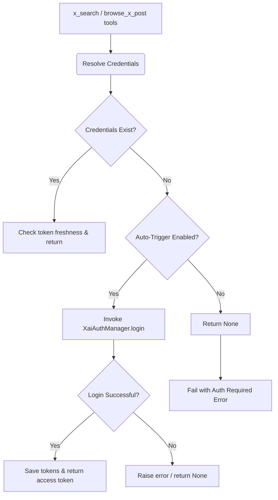

# Implementation Plan - Auto-Triggering xAI OAuth Login Flow

This implementation plan details the enhancement of xAI credentials resolution to support auto-triggering the interactive OAuth PKCE login flow. When `XAI_API_KEY` is not present and no cached tokens are configured, the tools will automatically run the interactive authentication flow instead of failing with a static error message.

---

## User Review Required

> [!IMPORTANT]
> - **Auto-Triggering Behavior**: When `x_search` or `browse_x_post` is invoked and credentials are not resolved, the system will invoke `XaiAuthManager().login()` inline. This will open a browser for the user to authenticate and spin up the callback HTTP server at `http://127.0.0.1:56121/callback`.
> - **Headless / Non-Interactive Environments**: In non-interactive environments, a browser window might not be launchable, or `sys.stdin` might not allow `input()`. The manager gracefully handles loopback server setup failures and CLI prompt timeouts, returning a structured error if the user cannot authenticate.
> - **Secrets Synchronization**: Authenticated OAuth credentials are automatically saved in the shared, persistent SQLite backend at `~/.agent-utilities/secrets.db`. Any agent or MCP server running on the same host can immediately reuse the tokens.

---

## Proposed Changes

We will modify the credential resolution function and X tool executions to support an optional, proactive authentication trigger.



### 1. Authentication Layer

#### [MODIFY] [xai_auth.py](file:///home/apps/workspace/agent-packages/agent-utilities/agent_utilities/security/xai_auth.py)
We will extend `resolve_credentials` to accept an `auto_login: bool = False` argument:
- If `auto_login` is `True` and no cached credentials exist, we will call `self.login()` to trigger the PKCE flow dynamically.
- Cache and return the newly acquired token on success.

### 2. Social Tools Layer

#### [MODIFY] [x_search_tool.py](file:///home/apps/workspace/agent-packages/agent-utilities/agent_utilities/tools/x_search_tool.py)
Update both `x_search` and `browse_x_post` to set `auto_login=True` during credential resolution:
- Replace `auth_manager.resolve_credentials()` with `auth_manager.resolve_credentials(auto_login=True)`.
- Wrap the login process in elegant try/except blocks to provide clear error reporting to the calling agent if authorization is cancelled or fails.

### 3. Verification & Testing

#### [MODIFY] [test_xai_auth.py](file:///home/apps/workspace/agent-packages/agent-utilities/tests/unit/core/test_xai_auth.py)
- Add a new unit test `test_resolve_credentials_auto_login` to verify that when `resolve_credentials` is called with `auto_login=True` and no tokens are cached, it correctly triggers `self.login()`.
- Mock `self.login()` to return dummy tokens and assert the returned token matches the mocked new token.

#### [MODIFY] [test_x_search_tool.py](file:///home/apps/workspace/agent-packages/agent-utilities/tests/unit/core/test_x_search_tool.py)
- Update `test_x_search_missing_credentials` to verify that `resolve_credentials(auto_login=True)` is called.
- Add `test_x_search_auto_login_success` to verify that when credentials are missing, the tool attempts auto-login and succeeds.

---

## Verification Plan

### Automated Tests
Run the entire unit test suite for xAI security and search tools:
```bash
uv run pytest tests/unit/core/test_xai_auth.py tests/unit/core/test_x_search_tool.py
```

### Manual Verification
1. Verify the `resolve_credentials(auto_login=True)` flow by executing a test script or calling the tools through python, ensuring the loopback server starts and prompts successfully.
