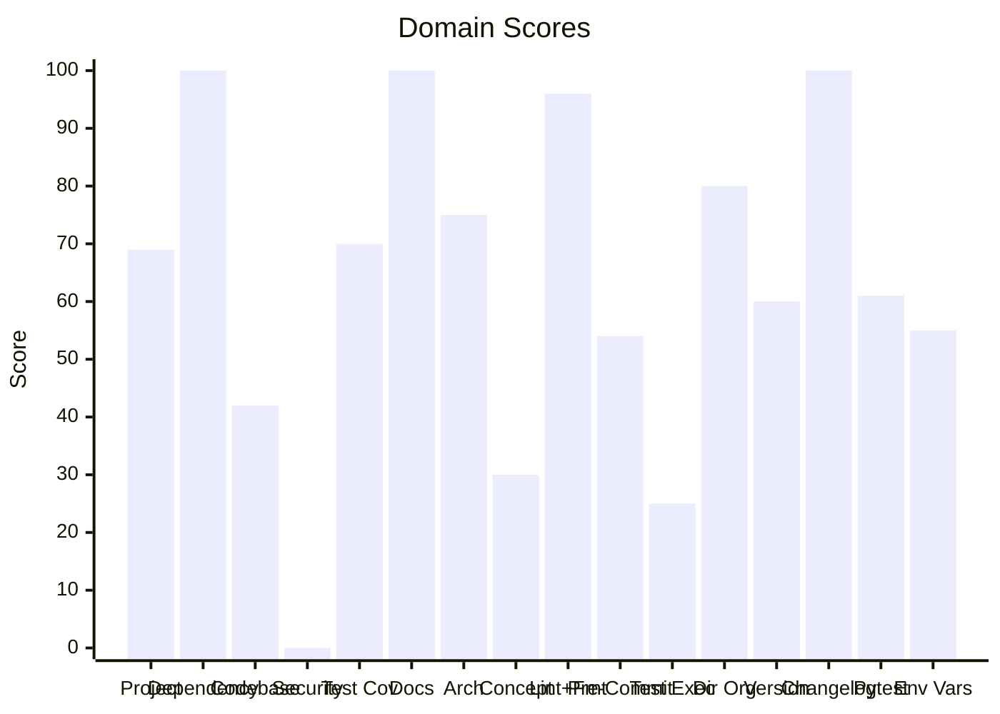

# 🔬 Code Enhancement Report

> **Generated**: 2026-05-01 00:58:13 UTC | **Target**: agent-utilities | **Overall GPA**: 1.62/4.0

---

## 📊 Executive Summary

| Domain | Grade | Score | Status |
|--------|-------|-------|--------|
| Security Analysis | 🔴 F | 0/100 | `░░░░░░░░░░░░░░░░░░░░` 0/100 |
| Test Execution | 🔴 F | 25/100 | `█████░░░░░░░░░░░░░░░` 25/100 |
| Concept Traceability | 🔴 F | 30/100 | `██████░░░░░░░░░░░░░░` 30/100 |
| Codebase Optimization | 🔴 F | 42/100 | `████████░░░░░░░░░░░░` 42/100 |
| Pre-Commit Compliance | 🔴 F | 54/100 | `██████████░░░░░░░░░░` 54/100 |
| Environment Variables | 🔴 F | 55/100 | `███████████░░░░░░░░░` 55/100 |
| Version Sync Analysis | 🟠 D | 60/100 | `████████████░░░░░░░░` 60/100 |
| Pytest Quality | 🟠 D | 61/100 | `████████████░░░░░░░░` 61/100 |
| Project Analysis | 🟠 D | 69/100 | `█████████████░░░░░░░` 69/100 |
| Test Coverage | 🟡 C | 70/100 | `██████████████░░░░░░` 70/100 |
| Architecture & Design Patterns | 🟡 C | 75/100 | `███████████████░░░░░` 75/100 |
| Directory Organization | 🔵 B | 80/100 | `████████████████░░░░` 80/100 |
| Linting & Formatting | 🟢 A | 96/100 | `███████████████████░` 96/100 |
| Dependency Audit | 🟢 A | 100/100 | `████████████████████` 100/100 |
| Documentation & Governance | 🟢 A | 100/100 | `████████████████████` 100/100 |
| Changelog Audit | 🟢 A | 100/100 | `████████████████████` 100/100 |

---

## 📋 Domain Scorecards

### Project Analysis — 🟠 Grade: D (69/100)

`█████████████░░░░░░░` 69/100

> [!WARNING]
> Externalized prompts directory found with 51 files

| Criterion | Points | Evidence | Reasoning |
|-----------|--------|----------|-----------|
| has_pyproject | 10 | `pyproject.toml and requirements.txt` | Both pyproject.toml and requirements.txt exist, fulfilling mandatory Python proj |
| project_type_detected | 0 | `dependency list` | No recognized ecosystem markers found in dependencies |
| externalized_prompts | 10 | `/home/apps/workspace/agent-packages/agent-utilities/agent_ut` | Prompts directory contains 51 externalized prompt files |
| observability | 0 | `dependency list` | No observability tools (logfire, sentry, opentelemetry) found |
| testing_suite | 5 | `tests dir: True, pytest dep: False` | Tests directory exists, pytest not in dependencies |
| agents_md | 10 | `/home/apps/workspace/agent-packages/agent-utilities/AGENTS.m` | AGENTS.md exists with comprehensive content |
| pre_commit_hooks | 10 | `/home/apps/workspace/agent-packages/agent-utilities/.pre-com` | Pre-commit configuration found for automated code quality checks |
| gitignore | 10 | `/home/apps/workspace/agent-packages/agent-utilities/.gitigno` | .gitignore exists to prevent committing build artifacts and secrets |
| env_template | 10 | `/home/apps/workspace/agent-packages/agent-utilities/.env.exa` | Environment template exists for onboarding and secret management |
| protocol_support | 4 | `MCP` | 1 communication protocol(s) detected |

**Findings:**
- Protocol support: MCP

---

### Dependency Audit — 🟢 Grade: A (100/100)

`████████████████████` 100/100

| Criterion | Points | Evidence | Reasoning |
|-----------|--------|----------|-----------|
| dependency_freshness | 100 | `source=/home/apps/workspace/agent-packages/agent-utilities/p` | Audited 0 deps (0 installed, 0 constraint-only). 0 major, 0 minor, 0 patch update |

---

### Codebase Optimization — 🔴 Grade: F (42/100)

`████████░░░░░░░░░░░░` 42/100

> [!CAUTION]
> 16 functions exceed 200 lines (actionable refactoring targets): build_agent_app (510L), _execute_dynamic_mcp_agent (457L), app_factory (440L), create_graph_agent (432L), create_agent (359L)

| Criterion | Points | Evidence | Reasoning |
|-----------|--------|----------|-----------|
| code_quality | 42 | `{"file_count": 320, "total_lines": 69661, "function_count": ` | Analyzed 320 files, 2746 functions. Avg CC=3.5, max length=510, duplication=0.8% |

**Findings:**
- Monolithic: steps.py (2423L) — 5 functions with high complexity (worst: router_step at 316L, CC=35); Low cohesion: 61 distinct concepts in one file
- Monolithic: base_utilities.py (1045L) — 3 functions with high complexity (worst: retrieve_package_name at 95L, CC=22); Low cohesion: 36 distinct concepts in one file
- Monolithic: engine.py (1881L) — 2 functions with high complexity (worst: IntelligenceGraphEngine._query_nx_fallback at 64L, CC=19); God class: IntelligenceGraphEngine (65 methods) — consider mixins/composition
- Needs attention: mcp_utilities.py (899L) — 2 functions with high complexity (worst: create_mcp_server at 305L, CC=57)

---

### Security Analysis — 🔴 Grade: F (0/100)

`░░░░░░░░░░░░░░░░░░░░` 0/100

> [!CAUTION]
> 10 HIGH severity vulnerabilities found

| Criterion | Points | Evidence | Reasoning |
|-----------|--------|----------|-----------|
| security_posture | 0 | `high=10 med=734 low=35 attack_surface={"subprocess_calls": 1` | Scanned 1620 files. Found 779 security findings. High: -150pts, Med: -5872pts, L |

**Findings:**
- 734 MEDIUM severity vulnerabilities found
- eval/exec usage detected: 20 instances

---

### Test Coverage — 🟡 Grade: C (70/100)

`██████████████░░░░░░` 70/100

> [!NOTE]
> 6 tests without assertions

| Criterion | Points | Evidence | Reasoning |
|-----------|--------|----------|-----------|
| test_coverage_quality | 70 | `{"test_file_count": 110, "test_count": 1395, "source_file_co` | 1395 tests across 110 files. Ratio: 0.86. Intent: {'unit': 1384, 'integration':  |

**Findings:**
- 8 potential doc-test drift items

---

### Documentation & Governance — 🟢 Grade: A (100/100)

`████████████████████` 100/100

| Criterion | Points | Evidence | Reasoning |
|-----------|--------|----------|-----------|
| documentation_quality | 100 | `{"README.md": {"exists": true, "missing": []}, "AGENTS.md": ` | Audited 6 standard docs + docs/ directory. 0 broken references, 5 docs present.  |

---

### Architecture & Design Patterns — 🟡 Grade: C (75/100)

`███████████████░░░░░` 75/100

> [!NOTE]
> SRP: 164 modules exceed 500 lines (god modules)

| Criterion | Points | Evidence | Reasoning |
|-----------|--------|----------|-----------|
| architecture_quality | 75 | `{"layers": 2, "di_ratio": 0.08, "solid_violations": 2}` | Analyzed 1620 files. 2/5 architecture layers present, DI ratio: 8%, 2 SOLID viol |

**Findings:**
- SRP: 30 classes have >15 methods
- Low dependency injection ratio: 8%

---

### Concept Traceability — 🔴 Grade: F (30/100)

`██████░░░░░░░░░░░░░░` 30/100

> [!CAUTION]
> 11 orphaned concepts (only in one source)

| Criterion | Points | Evidence | Reasoning |
|-----------|--------|----------|-----------|
| concept_traceability | 30 | `{"total_concepts": 33, "well_traced": 10, "orphans": 11, "dr` | 33 unique concepts found. 10 fully traced (code+docs+tests), 11 orphans, 12 drif |

**Findings:**
- 12 concepts with drift (missing from one source)
- 1306 test functions missing concept markers
- 623 significant functions (>10 lines) missing concept markers in docstrings

---

### Linting & Formatting — 🟢 Grade: A (96/100)

`███████████████████░` 96/100

> [!TIP]
> Total lint findings: 2 (high/error: 0, medium/warning: 2, low: 0)

| Criterion | Points | Evidence | Reasoning |
|-----------|--------|----------|-----------|
| lint_compliance | 96 | `ruff=0, bandit=0, mypy=2` | 2 total findings across 3 tools. High/error: -0pts, Med/warning: -4pts, Low: -0p |

---

### Pre-Commit Compliance — 🔴 Grade: F (54/100)

`██████████░░░░░░░░░░` 54/100

> [!CAUTION]
> 8/20 pre-commit hooks failed: check toml, don't commit to branch, ruff (legacy alias), ruff format, vulture, codespell, nbqa-ruff, uv-lock

| Criterion | Points | Evidence | Reasoning |
|-----------|--------|----------|-----------|
| precommit_compliance | 54 | `{"total_hooks": 20, "passed": 11, "failed": 8, "skipped": 1,` | Ran pre-commit with 20 hooks: 11 passed, 8 failed, 1 skipped. 2 potentially outd |

**Findings:**
- 2 hook(s) may be outdated: ruff-pre-commit, uv-pre-commit
- Pytest hooks skipped (handled by CE-016 Test Execution): local-pytest, pytest

---

### Test Execution — 🔴 Grade: F (25/100)

`█████░░░░░░░░░░░░░░░` 25/100

> [!CAUTION]
> No tests were executed (test framework detected but no tests found)

| Criterion | Points | Evidence | Reasoning |
|-----------|--------|----------|-----------|
| test_execution | 25 | `{"frameworks_detected": 1, "total_passed": 0, "total_failed"` | Executed 1 framework(s). 0 passed, 0 failed, 0 errors. Pass rate: 0%. |

---

### Directory Organization — 🔵 Grade: B (80/100)

`████████████████░░░░` 80/100

> [!NOTE]
> 1 directories with >40 files: agent_utilities/prompts

| Criterion | Points | Evidence | Reasoning |
|-----------|--------|----------|-----------|
| directory_organization | 80 | `{"total_source_files": 416, "total_directories": 56, "max_de` | 416 files across 56 directories. Max depth: 4, avg files/dir: 7.4. 2 crowded, 1  |

**Findings:**
- 2 directories with >20 files: tests/unit/core, agent_utilities/tools

---

### Version Sync Analysis — 🟠 Grade: D (60/100)

`████████████░░░░░░░░` 60/100

> [!WARNING]
> Found 2 file(s) with version '0.3.0' that are NOT tracked in .bumpversion.cfg:

| Criterion | Points | Evidence | Reasoning |
|-----------|--------|----------|-----------|
| bumpversion_exists | 20 | `/home/apps/workspace/agent-packages/agent-utilities/.bumpver` | .bumpversion.cfg found |
| current_version_defined | 20 | `0.3.0` | Current version tracked is 0.3.0 |
| files_tracked | 20 | `7 files tracked` | Found 7 files tracked in .bumpversion.cfg |
| version_drift_check | 0 | `2 untracked files` | Version definitions found in codebase that are missing from .bumpversion.cfg |

**Findings:**
-   - .specify/reports/results.json
-   - .specify/reports/code_enhancement_report.md

---

### Changelog Audit — 🟢 Grade: A (100/100)

`████████████████████` 100/100

| Criterion | Points | Evidence | Reasoning |
|-----------|--------|----------|-----------|
| changelog_quality | 100 | `{"exists": true, "parseable": true, "version_count": 4, "has` | CHANGELOG.md exists. 4 versions tracked. 0 dependency changelogs analyzed. |

---

### Pytest Quality — 🟠 Grade: D (61/100)

`████████████░░░░░░░░` 61/100

> [!WARNING]
> 15 test files exceed 500 lines — split into focused modules

| Criterion | Points | Evidence | Reasoning |
|-----------|--------|----------|-----------|
| pytest_quality | 61 | `{"test_files": 110, "total_tests": 1395, "descriptive_name_r` | 1395 tests across 110 files. Naming: 20/20, Structure: 5/20, Fixtures: 16/20, As |

**Findings:**
- 13 test files have >30 tests — too dense
- 6 tests have no assertions
- 280 tests use weak assertions (assert result is not None, assert True, etc.)
- 29 tests have excessive mocking (>5 mocks) — test behavior, not implementation

---

### Environment Variables — 🔴 Grade: F (55/100)

`███████████░░░░░░░░░` 55/100

> [!CAUTION]
> Only 2% of env vars documented in README.md

| Criterion | Points | Evidence | Reasoning |
|-----------|--------|----------|-----------|
| env_var_documentation | 55 | `{"total_vars": 106, "python_vars": 106, "dockerfile_vars": 0` | Found 106 unique env vars across 936 occurrences. README documents 2/106. Has .e |

**Findings:**
- Undocumented env vars: A2A_TOOLS, ACP_SESSION_ROOT, AGENT_SECRETS_MASTER_KEY, AGENT_URL, AGENT_USER_TOKEN, AGENT_UTILITIES_TESTING, AGENT_WORKSPACE, ANTHROPIC_API_KEY, AUDIENCE, BROWSER_TOOLS
- 104 Python env vars not in .env.example: A2A_TOOLS, ACP_SESSION_ROOT, AGENT_SECRETS_MASTER_KEY, AGENT_URL, AGENT_USER_TOKEN
- 45 env vars have no default value in code

---

## 🎯 Prioritized Action Items

| # | Priority | Domain | Action | Impact | Risk |
|---|----------|--------|--------|--------|------|
| 1 | 🔴 High | Codebase Optimization | 16 functions exceed 200 lines (actionable refactoring targets): build_agent_app  | High | High |
| 2 | 🔴 High | Codebase Optimization | Monolithic: steps.py (2423L) — 5 functions with high complexity (worst: router_s | High | High |
| 3 | 🔴 High | Codebase Optimization | Monolithic: base_utilities.py (1045L) — 3 functions with high complexity (worst: | High | High |
| 4 | 🔴 High | Codebase Optimization | Monolithic: engine.py (1881L) — 2 functions with high complexity (worst: Intelli | High | High |
| 5 | 🔴 High | Codebase Optimization | Needs attention: mcp_utilities.py (899L) — 2 functions with high complexity (wor | High | High |
| 6 | 🔴 High | Codebase Optimization | Needs attention: factory.py (592L) — 1 functions with high complexity (worst: cr | High | High |
| 7 | 🔴 High | Codebase Optimization | Needs attention: app.py (567L) — 1 functions with high complexity (worst: build_ | High | High |
| 8 | 🔴 High | Codebase Optimization | 65 functions with nesting depth >4 | High | High |
| 9 | 🔴 High | Codebase Optimization | 1 flat directories with >15 Python files: agent_utilities/tools | High | High |
| 10 | 🔴 High | Security Analysis | 10 HIGH severity vulnerabilities found | High | High |
| 11 | 🔴 High | Security Analysis | 734 MEDIUM severity vulnerabilities found | High | High |
| 12 | 🔴 High | Security Analysis | eval/exec usage detected: 20 instances | High | High |
| 13 | 🔴 High | Concept Traceability | 11 orphaned concepts (only in one source) | High | High |
| 14 | 🔴 High | Concept Traceability | 12 concepts with drift (missing from one source) | High | High |
| 15 | 🔴 High | Concept Traceability | 1306 test functions missing concept markers | High | High |
| 16 | 🔴 High | Concept Traceability | 623 significant functions (>10 lines) missing concept markers in docstrings | High | High |
| 17 | 🔴 High | Pre-Commit Compliance | 8/20 pre-commit hooks failed: check toml, don't commit to branch, ruff (legacy a | High | High |
| 18 | 🔴 High | Pre-Commit Compliance | 2 hook(s) may be outdated: ruff-pre-commit, uv-pre-commit | High | High |
| 19 | 🔴 High | Pre-Commit Compliance | Pytest hooks skipped (handled by CE-016 Test Execution): local-pytest, pytest | High | High |
| 20 | 🔴 High | Test Execution | No tests were executed (test framework detected but no tests found) | High | High |
| 21 | 🔴 High | Environment Variables | Only 2% of env vars documented in README.md | High | High |
| 22 | 🔴 High | Environment Variables | Undocumented env vars: A2A_TOOLS, ACP_SESSION_ROOT, AGENT_SECRETS_MASTER_KEY, AG | High | High |
| 23 | 🔴 High | Environment Variables | 104 Python env vars not in .env.example: A2A_TOOLS, ACP_SESSION_ROOT, AGENT_SECR | High | High |
| 24 | 🔴 High | Environment Variables | 45 env vars have no default value in code | High | High |
| 25 | 🔴 High | Project Analysis | Externalized prompts directory found with 51 files | High | Medium |
| 26 | 🔴 High | Project Analysis | Protocol support: MCP | High | Medium |
| 27 | 🔴 High | Version Sync Analysis | Found 2 file(s) with version '0.3.0' that are NOT tracked in .bumpversion.cfg: | High | Medium |
| 28 | 🔴 High | Version Sync Analysis |   - .specify/reports/results.json | High | Medium |
| 29 | 🔴 High | Version Sync Analysis |   - .specify/reports/code_enhancement_report.md | High | Medium |
| 30 | 🔴 High | Pytest Quality | 15 test files exceed 500 lines — split into focused modules | High | Medium |

---

## 🔄 SDD Handoff

Run `generate_sdd_handoff.py` with this report's JSON data to produce
structured TODO items compatible with the `spec-generator` → `task-planner` →
`sdd-implementer` pipeline. Output will be saved to `.specify/specs/`.
