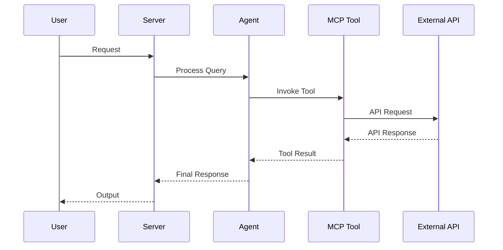

# AGENTS.md

<!--
This file is the hand-written source for AGENTS.md. The final AGENTS.md is
regenerated by `scripts/gen_agents_md.py`, which appends two generated
sections (Project Structure file tree + Concept Reference) to this prose.
Edit THIS file for any narrative / conventions changes, then run:
    python scripts/gen_agents_md.py
-->

> Claude Code loads this file via `CLAUDE.md` (`@AGENTS.md` import) — the two stay
> in sync. Edit `AGENTS.head.md` (then regenerate), never `CLAUDE.md`.

> **New to the platform (not just editing it)?** This file is *contributor/AI
> working-discipline*. For **what agent-utilities is, how to use it, its
> capabilities, and how to deploy it**, read **[docs/start-here.md](docs/start-here.md)**
> (or **[llms.txt](llms.txt)** for the AI entry index, **[docs/capabilities.md](docs/capabilities.md)**,
> and **[docs/ecosystem.md](docs/ecosystem.md)**).

## Working Discipline — think, simplify, stay surgical, verify (READ FIRST)

These four habits cut the most common LLM coding mistakes. The deeper, domain-specific
sections below (*Configuration discipline*, *Wire-First*, *No Legacy*, *Naming*, *Quality Bar*) are
**applications** of them — read those as the concrete enforcement of these defaults.
For trivial tasks, use judgment; the bias here is correctness over speed.

- **Think before coding.** State your assumptions explicitly. If a request has more than
  one reasonable reading, surface the options instead of silently picking one. If a
  simpler approach exists, say so and push back when warranted. When something is
  genuinely unclear, stop and name what's confusing — ask, don't guess. (Cf. *When Stuck*.)
- **Simplicity first.** Write the minimum code that solves the *stated* problem — no
  speculative features, no abstraction for single-use code, no configurability that
  wasn't requested, no error handling for impossible states. If you wrote 200 lines and
  it could be 50, rewrite it. Ask: "would a senior engineer call this overcomplicated?"
  This is the general form of two rules we already enforce: **Configuration discipline**
  (an env flag is a last resort — YAGNI) and **Wire-First** (no code ships without a live
  caller).
- **Stay surgical.** Every changed line should trace directly to the task. Don't refactor,
  reformat, or "improve" working code adjacent to your change; match the existing style
  even where you'd do it differently. Remove only the imports/symbols your *own* change
  orphaned; if you spot unrelated dead code, mention it rather than deleting it inline.
  **Two deliberate exceptions — both already standing rules here:** the **Quality Bar**
  (lint/format/type errors the pre-commit gate flags get fixed regardless of who
  introduced them) and **strangler-then-delete** (a planned migration removes the old
  path once the new one is live). In short: **surgical on behavior; clean on lint; delete
  only on a planned strangle.**
- **Verify against a goal.** Turn the task into a checkable outcome *before* you start:
  "fix the bug" → "write a failing test that reproduces it, then make it pass"; "add
  validation" → "tests for the invalid inputs pass"; "refactor X" → "the suite is green
  before and after". For multi-step work, state the short plan and the check for each
  step, then loop until the checks pass. **"Done" means a live path actually invokes it**
  (see *Wire-First*) **and the unit suite is green** — not merely that the code compiles.

## Architecture Reference (current)

- **Engine transport.** Python talks to the Rust `epistemic-graph` engine **only**
  through the out-of-process MessagePack/UDS client (`epistemic_graph.client`,
  with `pool.py` `ConnectionPool`/`ShardRouter`). There is **no PyO3**. Entry:
  `domains/finance/*` and `knowledge_graph/core/graph_compute.py`.
- **Knowledge graph (layered).** `knowledge_graph/facade.py` (`KnowledgeGraph`) is
  the single object the execution plane uses; it composes L0 compute (Rust client),
  L1 store (`backends/` — Postgres + epistemic_graph primary; neo4j/falkordb/ladybug
  demoted to `backends/contrib/`), and L2 semantic (`core/owl_bridge.py`, SHACL gate).
  `retrieval/capability_index.py` (`CapabilityIndex`, HNSW) powers `designate()` and
  reward write-back (`record_outcome`).
- **Routing.** `graph/routing/` is a strategy package (`Router`/`RoutingStrategy`)
  stranglering the monolith `graph/_router_impl.py`; strategies under
  `routing/strategies/` (fast_path, workflow_context, policy). `graph/planning/`
  is the unified `Planner` facade; `core/execution/` is the `ExecutionEngine`
  Protocol. Consolidated singletons: `core/registry/`, `core/checkpoint/`,
  one `core/config.py`, one `EmbeddingFactory` (`core/embedding_utilities.create_embedding_model`).
- **Ontology layer (first-class).** `knowledge_graph/ontology/` is the
  Palantir-Foundry-parity object/link/function/action system, reached **only** through
  `kg.ontology` (`KnowledgeGraph.ontology` → `OntologySystem`) — never reach into the
  submodules directly from the execution plane. It binds import-populated registries to the
  *live* facade (store / `owl_bridge` / retrieval), so interface targeting, derived-property
  compute, Functions-on-Objects, and ACL enforcement resolve against the real graph. Modules:
  `interfaces` (KG-2.38), `value_types` (KG-2.39), `derived_properties` (KG-2.40),
  `functions/` (KG-2.41), `edits/` (KG-2.43), `indexing/` (KG-2.44), `object_set` (KG-2.45),
  `permissioning` (KG-2.46), `property_types` (KG-2.47), `document_processing` (KG-2.48), and
  `links` (KG-2.26); action types live in `knowledge_graph/actions/` (KG-2.42). Conventions:
  registries ship **real built-ins at import** (never an empty shell); cite the Foundry/AIP doc
  in the module docstring and name from purpose, not the vendor; surface new capability over the
  `ontology_*` MCP tools (`mcp/kg_server.py`) and the agent-webui `/api/enhanced/ontology/*`
  routes (ObjectExplorer/Object/Vertex views).
- **Scale-out & autonomy planes (all opt-in; defaults stay zero-infra).**
  Identity: every gateway request is scoped to a server-minted JWT
  `ActorContext` with fail-closed permissioning and HMAC engine auth
  (`security/request_identity.py`, `security/auth.py`, OS-5.14). State:
  `STATE_DB_URI` externalizes checkpoints/sessions/queues onto shared Postgres
  with SKIP LOCKED claims + advisory-lock daemon leadership
  (`core/state_store.py`, `core/leadership.py`, OS-5.16–5.18). Engines shard
  by tenant behind client-side HRW routing (`GRAPH_SERVICE_ENDPOINTS`,
  `knowledge_graph/core/shard_topology.py`, KG-2.58). Work scales via
  fail-loud queue backends (`TASK_QUEUE_BACKEND`, KG-2.55–2.57) and
  queue-driven dispatch (`AGENT_DISPATCH_BACKEND=queue`,
  `orchestration/agent_dispatch*.py`, ORCH-1.45) consumed by the
  `kg-ingest-worker` / `agent-dispatch-worker` console scripts. Autonomy:
  every mutating fleet action passes the fail-closed ActionPolicy gate
  (`orchestration/action_policy.py` + `deploy/action-policy.default.yml`,
  OS-5.24) feeding the reconciler/playbooks/deploy-watch/autoscaler
  (OS-5.25–5.27, OS-5.29). Observability: Prometheus `/metrics`
  (`observability/gateway_metrics.py`, OS-5.23); multiplexer children are
  individually supervised (`mcp/child_resilience.py`, ECO-4.34). Docs:
  `docs/architecture/{state_externalization,engine_sharding,agent_dispatch,fleet_autonomy,gateway_scaling}.md`.
- **Single source of truth for concepts:** `docs/concepts.yaml` (regenerate via
  `scripts/build_concepts_yaml.py`; README/AGENTS counts come from it).
- **Guardrail gates (CI + pre-commit, `guardrails.yml`):** `scripts/check_no_stub.py`,
  `check_sprawl.py`, `check_concepts.py`, `check_coupling.py`,
  `check_retrieval_quality.py`, `check_no_env_sprawl.py`, with meta-tests in `tests/gates/`.
- **Cardinal rules:** no stubs (`raise NotImplementedError` only with `# ABSTRACT-OK`);
  strangler-then-delete (never "v2 beside old"); keep the unit suite green.

## Configuration discipline — an env var is a LAST RESORT (READ before adding any flag)

We were drowning in ~96 `KG_*`/`GRAPH_*` env flags — over-configuration that is
overwhelming to operate and a frequent source of footguns (a hang that only
`KG_INGEST_FEATURES=0` avoided). The standing rule: **prefer a system that detects
and self-configures over one that exposes a knob.** The full inventory + per-flag
verdict lives in `docs/architecture/configuration.md`.

**Add a new environment variable ONLY if ALL THREE hold:**
1. **Deployment-varying** — a path / DSN / secret / port / socket whose value genuinely
   differs per host and cannot be known at code time.
2. **Not auto-detectable** from the runtime — it cannot be derived from `cpu_count`,
   available memory, queue depth, or the presence of a file/service.
3. **No correct universal default** — there is no single value that works everywhere.

**Otherwise, do NOT add a flag:**
- One correct value → a named module constant.
- A hardware/load tunable (concurrency, batch size, pool size) → **auto-size** it
  (reuse `compute_ingest_worker_count()` in `knowledge_graph/core/engine_tasks.py`).
- An always-on behavior → just enable it. A single `KG_DEV_MODE` may gate *all* dev
  escape hatches; never one env flag per feature/daemon.
- An experiment → the feature-flag registry; then graduate or delete it. Never a new
  `KG_<EXPERIMENT>_*` family.
- "Someone might want to tune this" → YAGNI. Add it when a real second value exists.

**Never read `os.environ` in a module.** `core/config.py` (and `core/paths.py`) are
the ONLY files allowed to touch `os.environ`. Everywhere else, reads go through one of
two centralized, config.json-driven paths:

1. **A typed `AgentConfig` field** — for static, schema-worthy settings parsed once at
   import. Add `Field(alias="MY_VAR")` with a default + docstring; read `config.my_var`.
   Best for values that don't change after process start.
2. **`config.setting("MY_VAR", default, cast=…)`** — the sanctioned accessor for
   reads that must be **live** (daemon cadences read at loop start, anything a test
   varies with `monkeypatch.setenv`, runtime-toggled behavior). It reads `os.environ`
   at call time with a declared default + type coercion (inferred from the default's
   type, or pass `cast`). Because `config.json` is injected into `os.environ` first,
   both fields and `setting()` are config.json-driven — set any var in
   `~/.config/agent-utilities/config.json` (or `AGENT_UTILITIES_CONFIG_DIR`).

So the decision is: **field for static, `setting()` for dynamic — never bare
`os.environ.get`/`os.getenv`/`os.environ[...]`.** (Env *writes* for cross-process
signaling are still allowed.) This applies to **every** variable, not just
`KG_*`/`GRAPH_*` — `AGENT_*`, `VAULT_*`, `OTEL_*`, connector creds, all of it.

When a flag is justified, give it a default and document it in
`docs/architecture/configuration.md` and `docs/examples/config.json`. Enforced by
`scripts/check_no_env_sprawl.py` (a guardrail gate): any new bare `os.environ.get` /
`os.getenv` / `os.environ["…"]` **read** (any prefix) outside `core/config.py` /
`core/_env.py` fails CI. **The burn-down is complete — the baseline
(`scripts/env_flag_baseline.txt`) is empty: ZERO bare env reads remain in the
package.** Keep it that way; the only sanctioned reads are a typed `AgentConfig`
field or `config.setting(...)`. (`setting()` lives in the dependency-free
`core/_env.py` so it stays importable while `config` itself is initializing.)

## Reward / preference / RL-method primitives (AHE-3.x) — conventions

When adding reward, advantage, preference, or RL-method code (the AHE-3.1 spine and the
AHE-3.15/3.16/3.17 adaptations), follow these rules — they encode the 2026 reasoning-RL
work (`.specify/specs/reasoning-rl-2026/`):

- **Opt-in, default-unchanged.** A new parameter on an existing reward primitive MUST default
  to the prior behaviour (e.g. `batch_normalized_advantage(length_unbiased=False, mode="group")`
  reproduces GRPO exactly). New behaviour is opted into, never imposed.
- **Ship primitives WITH a live consumer — never speculatively.** A reward primitive with no
  caller is dead code (Wire-First). `entropy_progress_weights` ships because
  `RewardDecomposer.step_advantages` consumes it; ARPO branching ships because
  `SubagentLifecyclePolicy.determine_route` reads it. Trainer-only micro-mechanics (GSPO
  sequence-ratio, DPPO rollout pruning) stay **specified, not implemented**, until a
  policy-gradient trainer consumes them.
- **We are agentic, not a base-model trainer.** Prefer adaptations that land on live mechanisms —
  the capability reward-EMA router (`capability_index.record_outcome`), the eval/preference corpus,
  test-time fan-out — over re-implementing GRPO (already `training_signals.batch_normalized_advantage`).
- **Cite the paper in the docstring, name from purpose.** Provenance (arXiv id) goes in the
  docstring/CHANGELOG, never the identifier (`agent_step_po.py`, not `arpo_v1.py`). New
  `CONCEPT:AHE-3.x` tags are picked up by `scripts/build_concepts_yaml.py`; run
  `scripts/check_concepts.py` (CI gate) after adding one.

## Wire-First — reachable ≠ invoked (READ BEFORE shipping a complex feature)

A feature is **not done when its code exists and unit-tests pass** — it is done when a **live call
path actually invokes it**. We have repeatedly shipped code that was importable and unit-tested but
*never called on any real path* (e.g. `mount_skill_unit` stored a skill's SOP but the prompt builder
never read it; `UsageTelemetry` existed but `plan_and_retrieve` never recorded recall; a GEPA
held-out split existed but the entry point passed `dev_fraction=0`). These pass every unit test and
are still **dead code**.

When implementing any non-trivial feature you MUST verify and test the *invocation*, not just the API:

1. **Trace the live path end-to-end.** From an entry point (MCP tool, API route, CLI, hook, daemon
   tick, or a registry/discovery mechanism) to your new code. If you added a method/field/flag, grep
   that the existing hot path **actually calls/reads it** — don't assume `__init__` storing it is enough.
2. **Default the integration ON.** If a new behavior needs a flag/param to activate, the live entry
   point must pass a sensible default that turns it on (or it's off in production).
3. **Write a LIVE-PATH test, not just an API test.** Exercise the *existing* class/entry point and
   assert the new behavior happens as a side effect (e.g. "call `plan_and_retrieve`, assert recall was
   recorded"), in addition to unit-testing the helper in isolation. Name it `*_live_path` / `*_integration`.
4. **Run `check_wiring.py`** (import-graph, ≤3 hops) — but know its **blind spot**: it cannot see
   **plugin/decorator dynamic registration** (`register_source` + `pkgutil` discovery, entry-points,
   `@adaptor`). For those, also grep that a discovery/registration call runs on a live path. A
   "0 hops / unreachable" result for a self-registering module is a false negative — verify the
   discovery, don't delete the module.
5. **No silent storage.** A value set in `__init__`/a setter but read nowhere is a bug. Either wire it
   into the behavior or don't add it.

## Native by default — every enhancement is always-on and woven into the flow (READ BEFORE gating a feature)

We are greenfield and we own every consumer, so a new capability is not a thing
users *opt into* — it is **the new default behavior of the existing flow**. When
you add an enhancement, the bar is: **does it just happen, natively, on the next
run, for everyone, with no one asking for it?** If not, you have not finished
wiring it (see *Wire-First*). A capability that exists but must be invoked through
a separate command/action/flag is a **niche implementation** — the opposite of
what we want.

The flag decision, in strict order of preference:

1. **No flag — default ON, wired into the flow (the default choice).** Make the
   enhancement part of the path it improves so it runs every time. A new
   extraction layer runs as part of *ingestion*, not as a `do_extra_extraction`
   action; a new routing improvement runs inside the router, not behind
   `USE_BETTER_ROUTING=1`. Optimize it into the existing flow (share the LLM
   client, the embedder, the batch write, the delta-skip) so "on" is also "fast".
2. **Opt-OUT flag — only if a real run legitimately needs it off.** Default stays
   ON; the flag exists for a concrete disable case (e.g. a fast structural-only
   bulk backfill skips LLM enrichment). Reuse the *one* enrichment toggle that
   already gates that case — do not add a second.
3. **Opt-IN flag — ONLY when always-on would genuinely harm a normal run** because
   the behavior is *expensive or high-overhead*: heavy GPU/LLM cost on every item,
   a slow external call, a large memory footprint, or a dependency that may be
   absent. Even then, prefer **auto-detection / auto-sizing** (run it when the
   resource is present, scale it to load) over a manual knob — a knob is the last
   resort, governed by *Configuration discipline*.

So: **enhance the flow, don't bolt on a feature.** Default-on, native, optimized
together with everything around it. Reserve opt-out for a real disable case and
opt-in for genuinely expensive behavior — everything else just becomes how the
system works. This applies to *every* change, not just big ones.

## Two surfaces by default — every feature reachable via the gateway AND MCP (READ BEFORE shipping a capability)

**Every feature we build must be usable and configurable from two places: the
API gateway (REST) and the MCP server.** A capability that only a Python import
can reach is half-shipped. There is no third option and no "internal-only"
exemption — if it is a feature, both surfaces expose it.

The MCP server is a **thin wrapper**, never a second implementation. Both surfaces
dispatch into the **same single source of truth** — the existing
`_execute_tool()` action core that `agent_utilities/mcp/kg_server.py` (MCP) and
`agent_utilities/gateway/*_api.py` (REST) both call. So wiring a new feature to
both surfaces is *one* new action on that core plus a one-line registration on
each side, not two parallel handlers that can drift.

When you add a capability:

1. **Add the behavior once** to the action core / service layer (not inside a
   route handler or an MCP tool body).
2. **Register the MCP action** — a new `action=`/`mode=` value on the relevant
   `graph_*`/`ontology_*`/`object_*` tool (or a new thin tool), dispatching into
   the core. The tool function carries only argument-marshalling, never logic.
3. **Register the REST twin** — the matching `/api/...` route (action-routed POST
   on `graph_api.py`, or a granular typed route where the surface is typed, e.g.
   `/api/ontology/*`, `/api/objects/*`), dispatching into the *same* core.
4. **Keep them in lockstep.** The parity is enforced by a drift-guard gate (see
   *Surface-parity scanning* in the regression-gates list); a feature present on
   one surface and missing on the other is a **build break**, not a follow-up.

This is the surface contract for *Native by default*: "always-on in the flow"
governs internal behavior; "reachable from gateway + MCP" governs the operator
surface. A feature satisfies neither by existing — it satisfies both by being
wired, defaulted on, and exposed on both surfaces in the same change.

## No Legacy — no back-compat, update every consumer, delete the old path (READ BEFORE adding a shim)

**We own every consumer.** The whole world that calls our code lives under
`agent-packages/*` — there is no external caller pinned to an old version to
protect. So we **do not carry backward compatibility**: no deprecated aliases, no
compat shims, no `try_new_then_fall_back_to_old`, no "v2 beside v1", no
`*_legacy`/`*_deprecated`/`*_compat` symbols, no "kept for existing deployments"
branches, no parameter that exists only to reproduce the prior behavior.

When you change a shared contract — an engine wire method, the `epistemic_graph`
client API, a config key/env name, an MCP tool name, a function signature, a
return shape — the change is **atomic across the whole ecosystem**:

1. **Grep every consumer across `agent-packages/`** (engine, agent-utilities,
   data-science-mcp, the `agents/*` connectors, geniusbot, webui, terminal-ui,
   skills) and update them all in the *same* change.
2. **Delete the old path entirely** — the old method/alias/flag/branch is removed,
   not deprecated. A left-behind legacy reference is a **bug**, not compatibility.
3. **No deprecation window.** This is the aggressive form of *strangler-then-delete*
   (see *Stay surgical*): because no external consumer exists, you skip the
   strangle and go straight to migrate-and-delete in one commit.
4. **When you touch legacy, remove it.** If a change lands next to a dead
   back-compat path, delete that path as part of the work — legacy is explicitly
   *in scope* for deletion (it is not the "unrelated dead code" the surgical rule
   says to leave; that exception does not cover back-compat we've decided to drop).

**The one exception is on-disk / persisted state**, not code: a snapshot, WAL,
DB schema, or serialized format that survives a restart may need a **one-time data
migration** (read-old → write-new). That is data migration, not API back-compat —
do the migration, then remove the old-format reader once converted. Don't keep a
permanent dual-format reader "just in case."

## Branching & isolation — DEFAULT WORKFLOW (never edit `main`'s working tree directly)

This repo is a **shared working checkout**: multiple agent sessions operate on the same on-disk
clone, and another session switching branches (`git checkout`/`switch`) or resetting the tree
**reverts every uncommitted change in all sessions** — silently. Editing `main` in place loses work.
So the default for any non-trivial change is:

1. **Work in a dedicated git worktree**, not the main checkout. The worktree is a *physically
   separate directory* on its own branch, immune to branch switches in the main clone:
   ```
   git worktree add /home/apps/worktrees/<repo>-<topic> -b feat/<topic> main
   ```
   Do all edits, builds, and tests under that path. (`/home/apps/worktrees/` is the convention.)
2. **Commit early and often.** A working-tree reset can only wipe *uncommitted* changes — committing
   is what protects the work. Commit each coherent step; don't leave a large diff uncommitted.
3. **Merge to `main` locally at the end, in one go** (fast-forward / no-op-safe), then **clean
   up**: remove the worktree and delete the now-merged branch
   (`git worktree remove <path> && git branch -d <topic>`, or `rm_worktree remove <repo>
   <branch> --delete-branch`; `git worktree prune` clears stale entries). Push only when
   the user asks. See *Finishing work in a worktree* below for the full sequence.
4. A plain feature branch in the main checkout is **not** sufficient isolation — a sibling session's
   `git checkout` still mutates the shared tree. Use a worktree for real isolation.

The harness emits "file modified externally — intentional, don't revert" notes when a sibling
session touches a file; in a worktree those notes should stop for your files. If your edits keep
vanishing, you're in the shared checkout — move to a worktree.

## Tech Stack & Architecture
- Language/Version: Python 3.10+
- Core Libraries: `agent-utilities`, `fastmcp`, `pydantic-ai`
- Key principles: Functional patterns, Pydantic for data validation, asynchronous tool execution.
- Architecture:
    - `kg_server.py`: Main MCP server entry point and tool registration.
    - `agent.py`: Pydantic AI agent definition and logic.
    - `skills/`: Directory containing modular agent skills (if applicable).
    - `agent/`: Internal agent logic and prompt templates.

### Architecture Diagram


### Workflow Diagram


## Commands (run these exactly)
# Installation
pip install .[all]

# Quality & Linting (run from project root)
pre-commit run --all-files

# Execution Commands
# agent-utilities-kg
agent_utilities.mcp.kg_server:main

# Run the native compute backend daemon
cargo run -p epistemic-graph

## Project Structure Quick Reference
- MCP Entry Point → `kg_server.py`
- Native Compute Engine → `epistemic-graph` (Rust)
- Agent Entry Point → `agent.py`
- Source Code → `agent_utilities/`
- Skills → `skills/` (if exists)

## Code Style & Conventions
**Always:**
- Use `agent-utilities` for common patterns (e.g., `create_mcp_server`, `create_agent`).
- Define input/output models using Pydantic.
- Include descriptive docstrings for all tools (they are used as tool descriptions for LLMs).
- Check for optional dependencies using `try/except ImportError`.

### Naming — derive from purpose, never from process

Names (modules, classes, functions, MCP tools, vars) MUST describe **what the
thing is and does in its used context** — never the planning/process vocabulary
that happened to spawn it. Strip out roadmap/phase scaffolding: no `wave0`,
`phase2`, `step3`, `v2`, `new`, `milestone_*`, ticket IDs, sprint names, or a
plan's section title. Those describe *when/why we built it*, not *what it is*,
and they rot the moment the plan moves on.

- ❌ `wave0_scorers.py`, `build_wave0_suite()`, `phase2_router`, `eval_run_wave0`
- ✅ `reliability_scorers.py`, `build_reliability_suite()`, `eval_reliability`

Pick the most specific accurate noun for the behavior/domain (a suite of grounding
+ safety + retrieval-quality checks → *reliability* scorers). Provenance (which
plan/paper it came from) belongs in the docstring/CHANGELOG, not the identifier.

### External data sources — one reuse path (KG-2.59)

New external data sources are `mcp_tool` source presets (KG-2.59:
`protocols/source_connectors/connectors/mcp_tool.py`, `MCP_TOOL_PRESETS`) —
**never** new `UniversalConnector` dialects or bespoke connector modules. The
fleet's ~58 MCP servers already wrap the external systems; a new source is a
declarative preset (server + tool + field map + pagination), not new transport
code. Native connectors are reserved for **zero-infra defaults** (filesystem,
sqlite — things that must work with nothing deployed) and **hot-path
substrates** (the engine's own storage/queue backends).

**Good example:**
```python
from agent_utilities import create_mcp_server
from mcp.server.fastmcp import FastMCP

mcp = create_mcp_server("my-agent")

@mcp.tool()
async def my_tool(param: str) -> str:
    """Description for LLM."""
    return f"Result: {param}"
```

## Dos and Don'ts
**Do:**
- Run `pre-commit` before pushing changes.
- Use existing patterns from `agent-utilities`.
- Keep tools focused and idempotent where possible.

**Don't:**
- Use `cd` commands in scripts; use absolute paths or relative to project root.
- Add new dependencies to `dependencies` in `pyproject.toml` without checking `optional-dependencies` first.
- Hardcode secrets; use environment variables or `.env` files.

## Safety & Boundaries
**Always do:**
- Run lint/test via `pre-commit`.
- Use `agent-utilities` base classes.

**Ask first:**
- Major refactors of `kg_server.py` or `agent.py`.
- Deleting or renaming public tool functions.

**Never do:**
- Commit `.env` files or secrets.
- Modify `agent-utilities` or `universal-skills` files from within this package.

## When Stuck
- Propose a plan first before making large changes.
- Check `agent-utilities` documentation for existing helpers.

## ⛔ Keep the Repository Root Pristine — No Scratch / Temp / Debug Files

**The repository ROOT must contain only canonical project files** (packaging,
config, docs, lockfiles). The only hidden directories allowed at root are
`.git/`, `.github/`, and `.specify/` (plus a local, git-ignored `.venv/`).

**NEVER write any of the following — anywhere in the repo, and ESPECIALLY at the root:**
- One-off / debug / migration scripts: `fix_*.py`, `migrate_*.py`, `refactor_*.py`,
  `replace_*.py`, `update_*.py`, `debug_*.py`, or `test_*.py` **at the root**
  (real tests live in `tests/` only).
- Databases / data dumps: `*.db`, `*.db-wal`, `*.sqlite*`, `*.corrupted`.
- Logs / command output: `*.log`, scratch `*.txt`, `*.orig`, `*.rej`, `*.bak`.
- Build artifacts: `*.tsbuildinfo`, compiled binaries, coverage files.
- AI agent scratch directories: `.agent/`, `.agents/`, `.agent_data/`, `.tmp/`,
  `.hypothesis/`, or any per-tool cache committed to git.
- Any file that is NOT production source, a test in `tests/`, documentation, or
  a recognized config/lockfile.

**Why:** scratch at the root leaks private paths/credentials, bloats the tree,
breaks the anti-sprawl gate, and erodes a pristine codebase.

**Where scratch goes instead:** `~/workspace/scratch/` (experiments),
`~/workspace/reports/` (command output); tests go in `tests/` (pytest).
The `.gitignore` already blocks the scratch dirs above — do not force-add them.
Before finishing a task, run `git status` and confirm no stray root files were added.

## Quality Bar — Leave the Codebase Clean (REQUIRED)

After completing any code change, run the project's pre-commit suite and drive it
**fully green** before committing:

```bash
pre-commit run --all-files
```

Resolve **every** issue it reports — failures, lint errors, type errors, and
warnings — **including problems that pre-date your change and were not caused by
your edits**. The standing goal is a clean, working codebase with **no errors and
no warnings**. Do not silence checks (`# noqa`, `# type: ignore`, `SKIP=`,
`--no-verify`) to force green unless the exception is already documented in this
file as a known, unavoidable limitation. Only commit once `pre-commit run
--all-files` passes cleanly; if a check legitimately cannot pass, stop and explain
why rather than bypassing it.

## Working with Git Worktrees (multi-session)

Multiple agents/sessions work the `agent-packages/*` repos concurrently. **Do not
edit the canonical checkout** (`/home/apps/workspace/agent-packages/<repo>`) — a
background `repository-manager` sync can reset its working tree and discard
uncommitted edits. Take your own git worktree on your own branch instead:

```bash
# preferred — repository-manager MCP:
rm_worktree add <repo> <your-branch>      # -> /home/apps/worktrees/<repo>/<your-branch>

# raw-git fallback:
git -C agent-packages/<repo> checkout main
git -C agent-packages/<repo> worktree add /home/apps/worktrees/<repo>/<branch> -b <branch>
```

Work in the worktree and **commit often** (commits survive a working-tree reset).
Each session must use a **distinct branch** — git allows a branch in only one
worktree, which is what keeps concurrent sessions from colliding. Worktrees live
under `/home/apps/worktrees/` (outside the workspace scan, so the sync leaves them
alone).

**Finishing work in a worktree** — run this sequence before calling it done:
1. **Pre-commit green** — `pre-commit run --all-files`; resolve every issue per the
   *Quality Bar* above (including pre-existing), no `--no-verify`.
2. **Commit** in the worktree.
3. **Merge to main locally** — `rm_worktree merge <repo> <branch> --into main`
   (or `git merge --no-ff`). Push only when the user asks.
4. **Clean up** — remove the worktree and delete the merged branch:
   `rm_worktree remove <repo> <branch> --delete-branch`; `rm_worktree prune` clears
   stale entries. (Raw-git: `git worktree remove <path> && git branch -d <branch>`.)
