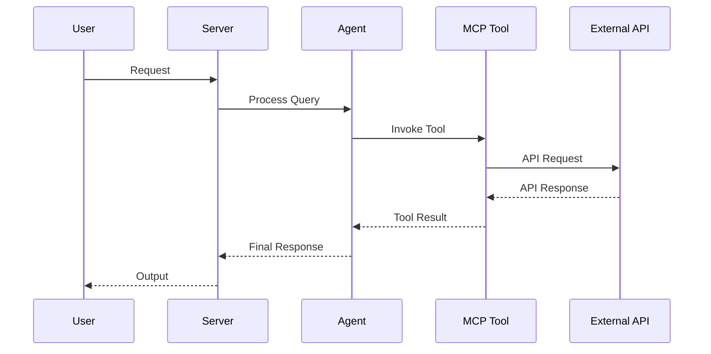

# AGENTS.md

<!--
This file is the hand-written source for AGENTS.md. The final AGENTS.md is
regenerated by `scripts/gen_agents_md.py`, which appends two generated
sections (Project Structure file tree + Concept Reference) to this prose.
Edit THIS file for any narrative / conventions changes, then run:
    python scripts/gen_agents_md.py
-->

> Claude Code loads this file via `CLAUDE.md` (`@AGENTS.md` import) — the two stay
> in sync. Edit `AGENTS.head.md` (then regenerate), never `CLAUDE.md`.

> **New to the platform (not just editing it)?** This file is *contributor/AI
> working-discipline*. For **what agent-utilities is, how to use it, its
> capabilities, and how to deploy it**, read **[docs/start-here.md](docs/start-here.md)**
> (or **[llms.txt](llms.txt)** for the AI entry index, **[docs/capabilities.md](docs/capabilities.md)**,
> and **[docs/ecosystem.md](docs/ecosystem.md)**).

## 🚀 Zero-to-deployed (genesis) — DEPLOYING this for an operator

If the human pointed you here to **stand this up** (not edit it), you are the
installer. Follow this exact procedure — it is the router; the runbook detail lives
in the skills and **[`genesis.yaml`](genesis.yaml)** (the machine-readable manifest
you loop over). The whole thing is built to need only this repo URL.

1. **Ask the profile, then resolve the adaptive run plan.** The profile —
   `tiny` (homelab / laptop, zero-infra) · `single-node-prod` (one durable host) ·
   `enterprise` (multi-host, full integration) — seeds defaults. Genesis then resolves
   a **granular run plan**: per platform-dep and per connector, **deploy-container /
   deploy-baremetal (pypi/uvx) / use-existing / skip** (so it fits an environment that
   already runs its own Postgres/Vault/ingress/IdP), plus the **orchestrator**
   (docker-compose / docker-swarm / podman rootful-rootless / podman-compose /
   kubernetes — k8s default for enterprise), the **IdP** (deploy Keycloak OR wire an
   existing Okta/OIDC org), the **secrets store** (OpenBao/HashiCorp Vault, read+seed),
   an optional **enterprise root-CA**, and the **ontology host** (Stardog/Jena/local).
   The axes + per-profile defaults live in `genesis.yaml` (`run_plan` + `profiles`).
   Ask which optional UIs they want too: `agent-webui`, `agent-terminal-ui`, `geniusbot`.
2. **Preflight the host.** `agent-utilities-doctor --preflight --profile <p>
   [--component <c>]` (or MCP `graph_configure action=preflight config_key=<p>`).
   It reports what's missing with fixes. Note: **no Rust needed** — the engine ships
   as a prebuilt wheel; Rust is only a fallback. Docker is only needed above `tiny`.
3. **Install.** `scripts/install.sh --profile <p> [--component <c>]`
   (Windows: `scripts/install.ps1`). It installs the package, drops the skill toolkit
   into every agent tool on the host, wires the `graph-os` MCP server, and generates a
   complete config. For a curl-first machine:
   `curl -fsSL https://knuckles-team.github.io/agent-utilities/install.sh | sh`.
4. **Run the right skill to finish wiring.** `single-node-prod`/`tiny` →
   **`agent-utilities-deployment`** (self-setup: full config → secrets → databases →
   launch). `enterprise` → **`agent-os-genesis`** (bare-host Kubernetes/RKE2 — or
   Swarm, if that `orchestrator` is chosen — → Vault-protocol(OpenBao)/DNS/Keycloak-
   SSO/ingress → the *-mcp fleet from `deploy/mcp-fleet.registry.yml`). Loop the
   `servers` and `components` in `genesis.yaml`; resolve secrets from OpenBao or `.env`.
5. **Verify.** `agent-utilities-doctor` must come back green (engine reachable, config
   healthy, fleet valid). Report what's wired and what the operator still needs to
   supply (e.g. provider keys, host inventory).

> 🧰 **Install the skills first — they unlock how to use everything else.** The very
> first move (even before full deploy) is **`agent-utilities install-skills`**: it drops
> the skill toolkit — including the **`agent-utilities` skill-graph** (the platform's own
> reference manual) plus the `agent-utilities-deployment` / `agent-os-genesis` /
> evolution / KG skills — into the calling agent tool and the agent-utilities XDG skills
> dir, where agents auto-load them. `agent-utilities-doctor`'s `skills` check flags it if
> absent. These skills are how an agent learns to drive the rest of the platform.

| Profile | Infra | MCP fleet | Secrets | Skill |
|---|---|---|---|---|
| `tiny` | none (in-process) | none | `.env` | `agent-utilities-deployment` |
| `single-node-prod` | Postgres/pg-age mirror (+Docker) | core connectors | OpenBao or `.env` | `agent-utilities-deployment` |
| `enterprise` | Kubernetes(RKE2)/Swarm · Vault(OpenBao) · Keycloak SSO · DNS · ingress · observability | all connectors | OpenBao | `agent-os-genesis` |

## Working Discipline — think, simplify, stay surgical, verify (READ FIRST)

These four habits cut the most common LLM coding mistakes. The deeper, domain-specific
sections below (*Configuration discipline*, *Wire-First*, *No Legacy*, *Naming*, *Quality Bar*) are
**applications** of them — read those as the concrete enforcement of these defaults.
For trivial tasks, use judgment; the bias here is correctness over speed.

- **Think before coding.** State your assumptions explicitly. If a request has more than
  one reasonable reading, surface the options instead of silently picking one. If a
  simpler approach exists, say so and push back when warranted. When something is
  genuinely unclear, stop and name what's confusing — ask, don't guess. (Cf. *When Stuck*.)
- **Simplicity first.** Write the minimum code that solves the *stated* problem — no
  speculative features, no abstraction for single-use code, no configurability that
  wasn't requested, no error handling for impossible states. If you wrote 200 lines and
  it could be 50, rewrite it. Ask: "would a senior engineer call this overcomplicated?"
  This is the general form of two rules we already enforce: **Configuration discipline**
  (an env flag is a last resort — YAGNI) and **Wire-First** (no code ships without a live
  caller).
- **Stay surgical.** Every changed line should trace directly to the task. Don't refactor,
  reformat, or "improve" working code adjacent to your change; match the existing style
  even where you'd do it differently. Remove only the imports/symbols your *own* change
  orphaned; if you spot unrelated dead code, mention it rather than deleting it inline.
  **Two deliberate exceptions — both already standing rules here:** the **Quality Bar**
  (lint/format/type errors the pre-commit gate flags get fixed regardless of who
  introduced them) and **strangler-then-delete** (a planned migration removes the old
  path once the new one is live). In short: **surgical on behavior; clean on lint; delete
  only on a planned strangle.**
- **Verify against a goal.** Turn the task into a checkable outcome *before* you start:
  "fix the bug" → "write a failing test that reproduces it, then make it pass"; "add
  validation" → "tests for the invalid inputs pass"; "refactor X" → "the suite is green
  before and after". For multi-step work, state the short plan and the check for each
  step, then loop until the checks pass. **"Done" means a live path actually invokes it**
  (see *Wire-First*) **and the unit suite is green** — not merely that the code compiles.

## Query the code KG before you grep (READ BEFORE exploring code)

The ecosystem's 80+ repos are continuously ingested into the KG as a typed,
resolved code graph (call graph, similar-code, routes, change-coupling, CONCEPT:
markers, docs). So **to learn how an area works, where a symbol is used, or what a
change impacts, query the KG FIRST — don't open with grep/read/Explore.** It is a
near-free, grounded, cross-session-consistent answer with `file:line` citations;
grep re-derives by hand what the KG already holds.

The one tool is **`graph_analyze action=code_context`** (REST: `POST
/graph/analyze/code-context`), CONCEPT:AU-KG.retrieval.synthesized-cited-answer:

- `query=<area / symbol / question>`, `target=` the **intent**:
  - **`how`** — "how does the messaging reply path work?" → definition + what it
    calls + owning CONCEPT + docs + routes.
  - **`usage`** — "where is `create_model` used?" → callers (`file:line`) +
    near-clones + the **cross-repo** usage view across the whole fleet (AU-KG.retrieval.every-usage-published-symbol).
  - **`impact`** — "what breaks if I change `_conn`?" → transitive callers
    (blast radius) + git change-coupling.
- It returns a synthesized `answer`, `citations` (`file:line`), and a
  `capability_id`.

**Then read only the few `file:line`s you need to *edit*, not to *understand*.**
After the task, close the loop: `graph_feedback correction_type=reads_avoided
target_id=<capability_id> corrected_value={"reads_avoided":true,"files_read":N,
"correct":true,"query":"…"}` so the retriever learns which answers replace a read
(CONCEPT:AU-AHE.evaluation.reads-avoided-feedback). If `code_context` returns no anchor, the area may be uningested
— run `source_sync source=all mode=delta` (and see `agent-utilities-doctor`'s
`ingestion_coverage` check) — then fall back to grep.

## Delegate to the KG + graph-os — you are the orchestrator + exception-resolver (READ BEFORE doing a task yourself)

This builds on *Query the code KG before you grep*: that rule offloads
*understanding* to the KG; this one offloads the *work* to graph-os and the local
LLM. The platform is built so the **local model + graph-os do the work and you
(the harness) orchestrate + resolve exceptions**. The standing default is
**delegate; reserve direct action for what the autonomous system genuinely cannot
do yet.** The trajectory is to move more onto graph-os over time and orchestrate
**off the harness** wherever possible.

Before doing a task yourself, delegate it:

- **Understanding code** → the KG, never grep first (the section above):
  `graph_analyze action=code_context` (`how`/`usage`/`impact`, CONCEPT:AU-KG.retrieval.synthesized-cited-answer) +
  `graph_query` / `graph_search` / `graph_code_nav`. If an area is uningested,
  `source_sync source=all mode=delta` first; close the loop with
  `graph_feedback correction_type=reads_avoided` (AU-AHE.evaluation.reads-avoided-feedback).
- **Doing a task** an ingested skill / workflow / agent can already do →
  `graph_orchestrate action=execute_agent` / `action=execute_workflow` on the
  local LLM — the `agent-utilities-expert` agent for ecosystem work, or the right
  ingested skill / workflow. The local qwen executes; you orchestrate. Reach the
  rest of the fleet through the full `engine_<domain>` MCP surface + the
  multiplexer meta-tools (`find_tools` / `load_tools`).
- **Evolving / managing the ecosystem** → drive the loop engine (`graph_loops` /
  `LoopController`), the evolution flywheel, and the AU-AHE.optimization.telemetry-optimization hardening loop;
  **REVIEW** their proposals through the spec / prompt review-veto gates
  (propose-and-hold is the default) rather than hand-doing what the flywheel
  produces.

Your role becomes two things:

1. **Orchestrate.** Decompose a goal, dispatch it to graph-os / the local LLM, and
   **steer** it: query live `EvolutionState`, the `:ToolCall` / `RunTrace`
   provenance (CONCEPT:AU-KG.temporal.message-history-read), reprioritize, approve/veto.
2. **Resolve exceptions.** When a delegated run fails, returns a wrong or
   ungrounded answer, or the system couldn't self-troubleshoot — **that** is your
   job. Query the `RunTrace` / `:ToolCall` to see exactly what the local LLM did
   (which tools, what args, what result), find **why** it failed, fix the gap (a
   missing/weak skill, an unbound tool, a prompt, missing data/ingestion), and
   **re-delegate**. You are the backstop the autonomous system escalates to.

Full visibility + steerability is guaranteed by design: every delegated run writes
`:ToolCall` / `RunTrace` to the epistemic-graph (CONCEPT:AU-KG.temporal.message-history-read) — query it via
graph-os. The **resource-priority edict** (interactive / orchestration work
outranks background ingestion, CONCEPT:AU-ORCH.scheduling.resource-priority-edict/1.99) guarantees your
orchestration is never starved by ingestion.

Every exception you resolve should **harden** the system (a new skill, a fixed tool
binding, a hardened prompt — via the AU-AHE.optimization.telemetry-optimization hardening loop) so it handles that
case itself next time. The goal is orchestrating completely off the harness.

## Architecture Reference (current)

- **Engine transport.** Python talks to the Rust `epistemic-graph` engine **only**
  through the out-of-process MessagePack/UDS client (`epistemic_graph.client`,
  with `pool.py` `ConnectionPool`/`ShardRouter`). There is **no PyO3**. Entry:
  `domains/finance/*` and `knowledge_graph/core/graph_compute.py`.
- **Knowledge graph (one engine authority + mirrors).** `knowledge_graph/facade.py`
  (`KnowledgeGraph`) is the single object the execution plane uses. The
  **epistemic-graph engine is the ONE authority** (compute + in-memory cache +
  semantic + durable persistence) — it serves all reads and acks all writes;
  `core/owl_bridge.py` (+ SHACL gate) is the semantic layer over it. Writes fan out
  to optional durable **mirrors** under `backends/` (Postgres/pg-age primary;
  neo4j/falkordb/ladybug under `backends/contrib/`) for interop/BI/DR — there is
  **no L0/L1/L2/L3 tier vocabulary**. `retrieval/capability_index.py`
  (`CapabilityIndex`, HNSW; in-process, not yet distributed) powers `designate()`
  and reward write-back (`record_outcome`). General Cypher (label/property MATCH
  + a real WHERE predicate + aggregates/`DISTINCT`) is executed by the **engine's
  own native Cypher** (`GraphComputeEngine.query_cypher`, its `eg-query`
  parser/executor) rather than a client-side regex interpreter (AU-P0-2,
  `backends/epistemic_graph_backend.py`); a rejected/unsupported shape now raises
  (`CypherEngineError`/`NotImplementedError`) instead of silently returning `[]`.
  Two AU-specific shapes stay on typed engine methods because native routing
  would give silently-wrong results: the virtual `id` node-identity accessor and
  relationship-type traversal/merge (edges are keyed by `rel_type`, not the
  engine's `relationship`/`type`).
- **Session currency (emerging).** `knowledge_graph/core/session.py`
  (`GraphSession`, AU-P0-1) wraps — does not replace — three today-ambient
  authorities (`ActorContext`, the correlation traceparent, per-call policy) into
  one explicit dataclass (`actor`/`tenant`/`scopes`/`graph`/`endpoint`/
  `catalog_epoch`/`txn`/`policy_version`/`trace_context`). `from_ambient()`
  bridges today's ambient state so existing callers are unaffected;
  `use_session()`/`current_session()` mirror `use_actor()`/`current_actor()`;
  `require_scope()` raises `ScopeError`. Threaded as a defaulted
  `session: GraphSession | None = None` param through `facade.query`/
  `designate`, `engine.add_node`/`add_edge`/`link_nodes`,
  `engine_query.query_cypher`, and `media_store.store_media` — **not** every
  internal writer yet (~40 remain unthreaded) and **not yet** consumed by a
  policy/routing authority (AU-P0-5/AU-P0-6, still open). This is not end-to-end
  tenant enforcement: the derived-property cache still omits tenant, secured
  reads are still a Python post-filter, engine placement is still client-side
  HRW (no server-side placement authority), and dispatch's `WorkItem`/lease
  plumbing doesn't consume it.
- **Routing.** `graph/routing/` is a strategy package (`Router`/`RoutingStrategy`)
  stranglering the monolith `graph/_router_impl.py`; strategies under
  `routing/strategies/` (fast_path, workflow_context, policy). `graph/planning/`
  is the unified `Planner` facade; `core/execution/` is the `ExecutionEngine`
  Protocol. Consolidated singletons: `core/registry/`, `core/checkpoint/`,
  one `core/config.py`, one `EmbeddingFactory` (`core/embedding_utilities.create_embedding_model`).
- **Ontology layer (first-class).** `knowledge_graph/ontology/` is the
  Palantir-Foundry-parity object/link/function/action system, reached **only** through
  `kg.ontology` (`KnowledgeGraph.ontology` → `OntologySystem`) — never reach into the
  submodules directly from the execution plane. It binds import-populated registries to the
  *live* facade (store / `owl_bridge` / retrieval), so interface targeting, derived-property
  compute, Functions-on-Objects, and ACL enforcement resolve against the real graph. Modules:
  `interfaces` (KG-2.38), `value_types` (KG-2.39), `derived_properties` (KG-2.40),
  `functions/` (AU-KG.ontology.default-runtime-bound-import), `edits/` (KG-2.43), `indexing/` (AU-KG.ontology.batch-incremental-sync-live), `object_set` (KG-2.45),
  `permissioning` (AU-KG.ontology.redact-object-materialize-restricted), `property_types` (KG-2.47), `document_processing` (KG-2.48), and
  `links` (KG-2.26); action types live in `knowledge_graph/actions/` (KG-2.42). Conventions:
  registries ship **real built-ins at import** (never an empty shell); cite the Foundry/AIP doc
  in the module docstring and name from purpose, not the vendor; surface new capability over the
  `ontology_*` MCP tools (`mcp/kg_server.py`) and the agent-webui `/api/enhanced/ontology/*`
  routes (ObjectExplorer/Object/Vertex views).
- **Connector ACL defaults are fail-closed (AU-P0-4).** An unknown/unconfigured
  connector ACL now defaults to `ExternalAccess.quarantined()` (deny-by-default,
  `protocols/source_connectors/base.py`), never `.public()` — flip a deployment
  back to the legacy public-by-default with `CONNECTOR_DEFAULT_PUBLIC=true`
  (default `false`). `connector_manifest_gate.precheck_source` still silently
  passes a source with no `connector_manifest.yml` UNLESS it's named in
  `CONNECTOR_MANIFEST_REQUIRE_ENTERPRISE` (opt-in allowlist, empty by default),
  in which case a missing manifest fails closed. `source_sync._reconcile` never
  tombstones on a failed/skipped live-id fetch, and only tombstones a genuinely
  empty snapshot for a source named in `SOURCE_SYNC_ALLOW_EMPTY_TOMBSTONE`
  (empty by default) — see [`configuration.md`](docs/architecture/configuration.md)
  and [`kg_connectors_and_ingestion.md`](docs/architecture/kg_connectors_and_ingestion.md).
- **Scale-out & autonomy planes (all opt-in; defaults stay zero-infra).**
  Identity: every gateway request is scoped to a server-minted JWT
  `ActorContext` with fail-closed permissioning and HMAC engine auth
  (`security/request_identity.py`, `security/auth.py`, OS-5.14). State:
  `STATE_DB_URI` externalizes checkpoints/sessions/queues onto shared Postgres
  with SKIP LOCKED claims + advisory-lock daemon leadership
  (`core/state_store.py`, `core/leadership.py`, AU-OS.state.unified-durable-state-externalization–5.18). Engines shard
  by tenant behind client-side HRW routing (`GRAPH_SERVICE_ENDPOINTS`,
  `knowledge_graph/core/shard_topology.py`, AU-KG.sharding.tenant-partitioned-sharding-hrw). Work scales via
  fail-loud queue backends (`TASK_QUEUE_BACKEND`, KG-2.55–2.57) and
  queue-driven dispatch (`AGENT_DISPATCH_BACKEND=queue`,
  `orchestration/agent_dispatch*.py`, ORCH-1.45) consumed by the
  `kg-ingest-worker` / `agent-dispatch-worker` console scripts. Autonomy:
  every mutating fleet action passes the fail-closed ActionPolicy gate
  (`orchestration/action_policy.py` + `deploy/action-policy.default.yml`,
  OS-5.24) feeding the reconciler/playbooks/deploy-watch/autoscaler
  (AU-OS.config.desired-state-fleet-reconciler–5.27, OS-5.29). Observability: Prometheus `/metrics`
  (`observability/gateway_metrics.py`, AU-OS.observability.no-op-without-metrics); multiplexer children are
  individually supervised (`mcp/child_resilience.py`, AU-ECO.mcp.profile-differences-from-client). Docs:
  `docs/architecture/{state_externalization,engine_sharding,agent_dispatch,fleet_autonomy,gateway_scaling}.md`.
- **Single source of truth for concepts:** `docs/concepts.yaml` (regenerate via
  `scripts/build_concepts_yaml.py`; README/AGENTS counts come from it).
- **Guardrail gates (CI + pre-commit, `guardrails.yml`):** `scripts/check_no_stub.py`,
  `check_sprawl.py`, `check_concepts.py`, `check_coupling.py`,
  `check_retrieval_quality.py`, `check_no_env_sprawl.py`, with meta-tests in `tests/gates/`.
- **Cardinal rules:** no stubs (`raise NotImplementedError` only with `# ABSTRACT-OK`);
  strangler-then-delete (never "v2 beside old"); keep the unit suite green.

## Dependency discipline — NO heavy ML/native deps in core (READ before adding a dependency)

agent-utilities core is the **serving plane**: the KG, retrieval, MCP server (`kg_server`),
the gateway/host daemon, and messaging. **It must install and run with zero heavy ML/native
dependencies** — specifically **never** add `torch`, `transformers`, `sentence-transformers`,
or any CUDA/AVX-compiled ML wheel to the core `dependencies`. They are GPU/CPU-baseline-pinned
(they SIGILL on older CPUs — e.g. an SSE4-only host — and bloat the serving image by ~GB), and
the heavy compute already lives elsewhere:

- **Embeddings → remote vLLM** (`core/embedding_utilities`, OpenAI-style HTTP). Never a local
  embedding model in core.
- **Vector similarity / ANN / graph algorithms → the Rust `epistemic-graph` engine**
  (`graph_compute` → the engine client). Never an O(N) torch/numpy scan in Python.
- **Reranking → remote vLLM** (`RemoteRerankScorer`, `KG_RERANK_MODEL`) or the dependency-free
  lexical scorer. The local cross-encoder is opt-in only (`KG_RERANK_LOCAL_NEURAL=1`).
- **Model training / heavy inference → `agents/data-science-mcp`**, reached over MCP — not
  imported into core.

Rules:
1. **Heavy ML deps live ONLY in optional extras** (`[finance]`, `[finance-kronos]`, a training
   extra), never the base `dependencies`. The serving image builds the **`serving`** extra
   (core + mcp + graph + backends + embeddings), NOT `[all]`.
2. **Every `import torch`/`transformers`/`sentence_transformers`/`hnswlib` MUST be
   `try/except ImportError`-guarded and lazy** (inside the function that uses it) so the
   package imports clean without them. **No eager re-export** of a torch module from an
   `__init__.py` that a live tool path touches — that silently puts torch on the serving path.
3. **New ML capability goes to data-science-mcp** (or a domain extra) and is called remotely,
   not added to core. If you think core needs torch, you're adding it to the wrong package.

The check: `import agent_utilities` and a `kg_server` boot must succeed with torch uninstalled
(the lean serving image has no torch).

## Sprawl boundaries — WHERE new deps / ontology / daemons go (READ BEFORE adding any of them)

Anti-sprawl is not just "don't duplicate code" — it's "put each thing in the ONE place it belongs."
Before adding a dependency, an ontology file, or a daemon/service, route it:

**Heavy dependencies → out of core, into the service that owns that weight.** (Extends *Dependency
discipline*.) Core (`agent-utilities`) is the lean serving plane; heavy work is reached over MCP:
- **Heavy AI / ML** (torch, transformers, sentence-transformers, training/inference, GPU) →
  **`agents/data-science-mcp`** (the `[training]` home). Never add these to core — call data-science-mcp.
- **Finance / trading / exchange / market** logic + deps → **`emerald-exchange`** (the finance/quant
  service), reached over MCP. The core `domains/finance` stays light (no torch/sklearn — already
  re-homed); new finance compute goes to emerald-exchange, not into core.
- **Heavy compute · vector similarity · ANN · graph algorithms · any KG compute** → the Rust
  **`epistemic-graph`** engine (the one database authority). **Always ask "can the engine do this?" before
  writing an O(N) cosine/graph loop in Python.** Python orchestrates; the engine computes.

**Ontology — extend the canonical, never sprawl a new `.ttl`.** The ontology is ONE consolidated
library (`core/ontology.ttl` + the domain `ontology_*.ttl`), validated by the valid/connected/SHACL
gate (CONCEPT:AU-KG.maintenance.canonical-ontology-library). New classes/links/value-types go **into the existing ontology file for that
domain** via `interfaces.to_owl`/`owl_bridge`. A new top-level ontology file is a **build break**
unless it's a genuinely new domain registered into the ontology library + gate. Don't create a
per-feature `.ttl`; don't redefine a class that already exists — extend it.

**Daemons / microservices — extend before you add.** The platform already has the KG host daemon,
the graph-os MCP surface, the multiplexer, the ingest/dispatch workers, and ~62 `*-mcp` services. A
new capability is almost always **a new action/tool on an existing service**, or a **connector
preset** (CONCEPT:AU-KG.ingest.mcp-tool-connector `mcp_tool` — external sources are declarative presets, NEVER new connector
modules or services). Add a new daemon/service **ONLY** for a genuinely new long-running
responsibility that fits no existing process — and even then it is a thin transport over the core
orchestrator (see *Universal capability*). "I'll spin up a service for this" is the wrong default.

Smell test for all three: if you're about to add a heavy dep to core, a new `.ttl`, or a new daemon,
first name the existing place it belongs (data-science-mcp / emerald-exchange / epistemic-graph / the
canonical ontology / an existing service action) and prove it can't go there.

## Configuration discipline — an env var is a LAST RESORT (READ before adding any flag)

We were drowning in ~96 `KG_*`/`GRAPH_*` env flags — over-configuration that is
overwhelming to operate and a frequent source of footguns (a hang that only
`KG_INGEST_FEATURES=0` avoided). The standing rule: **prefer a system that detects
and self-configures over one that exposes a knob.** The full inventory + per-flag
verdict lives in `docs/architecture/configuration.md`.

**Add a new environment variable ONLY if ALL THREE hold:**
1. **Deployment-varying** — a path / DSN / secret / port / socket whose value genuinely
   differs per host and cannot be known at code time.
2. **Not auto-detectable** from the runtime — it cannot be derived from `cpu_count`,
   available memory, queue depth, or the presence of a file/service.
3. **No correct universal default** — there is no single value that works everywhere.

**Otherwise, do NOT add a flag:**
- One correct value → a named module constant.
- A hardware/load tunable (concurrency, batch size, pool size) → **auto-size** it
  (reuse `compute_ingest_worker_count()` in `knowledge_graph/core/engine_tasks.py`).
- An always-on behavior → just enable it. A single `KG_DEV_MODE` may gate *all* dev
  escape hatches; never one env flag per feature/daemon.
- An experiment → the feature-flag registry; then graduate or delete it. Never a new
  `KG_<EXPERIMENT>_*` family.
- "Someone might want to tune this" → YAGNI. Add it when a real second value exists.

**Never read `os.environ` in a module.** `core/config.py` (and `core/paths.py`) are
the ONLY files allowed to touch `os.environ`. Everywhere else, reads go through one of
two centralized, config.json-driven paths:

1. **A typed `AgentConfig` field** — for static, schema-worthy settings parsed once at
   import. Add `Field(alias="MY_VAR")` with a default + docstring; read `config.my_var`.
   Best for values that don't change after process start.
2. **`config.setting("MY_VAR", default, cast=…)`** — the sanctioned accessor for
   reads that must be **live** (daemon cadences read at loop start, anything a test
   varies with `monkeypatch.setenv`, runtime-toggled behavior). It reads `os.environ`
   at call time with a declared default + type coercion (inferred from the default's
   type, or pass `cast`). Because `config.json` is injected into `os.environ` first,
   both fields and `setting()` are config.json-driven — set any var in
   `~/.config/agent-utilities/config.json` (or `AGENT_UTILITIES_CONFIG_DIR`).

So the decision is: **field for static, `setting()` for dynamic — never bare
`os.environ.get`/`os.getenv`/`os.environ[...]`.** (Env *writes* for cross-process
signaling are still allowed.) This applies to **every** variable, not just
`KG_*`/`GRAPH_*` — `AGENT_*`, `VAULT_*`, `OTEL_*`, connector creds, all of it.

When a flag is justified, give it a default and document it in
`docs/architecture/configuration.md` and `docs/examples/config.json`. Enforced by
`scripts/check_no_env_sprawl.py` (a guardrail gate): any new bare `os.environ.get` /
`os.getenv` / `os.environ["…"]` **read** (any prefix) outside `core/config.py` /
`core/_env.py` fails CI. **The burn-down is complete — the baseline
(`scripts/env_flag_baseline.txt`) is empty: ZERO bare env reads remain in the
package.** Keep it that way; the only sanctioned reads are a typed `AgentConfig`
field or `config.setting(...)`. (`setting()` lives in the dependency-free
`core/_env.py` so it stays importable while `config` itself is initializing.)

## Secrets & credential retrieval — where they live, how to get them (READ before any auth/secret task)

Secrets are **never stored in the repo** (`.env` holds non-secret defaults + the
*names* of vars; the `.claude/` deny-rules block reading `.env`/secret files). When
you need a real credential — to run, to debug an auth path, to reach a
jwt-protected fleet server — retrieve it from its store; do not grep it out of
another process's memory.

**Source of truth = OpenBao (Vault).** Runtime/fleet secrets live in **OpenBao at
`openbao.arpa`** (`OPENBAO_URL=http://openbao.arpa` + `OPENBAO_TOKEN`). Retrieve via,
in order of preference: the **`openbao-mcp`** MCP tools, the **`secret-vault-manager`**
skill, or the raw API / `bao` CLI. Deployed stacks inject these into each service's env
from OpenBao at deploy time (the `agents/*` connectors read their creds from env — e.g.
`GITLAB_TOKEN`, `OPENBAO_TOKEN`, provider keys — never from a file).

**Standardized KV layout (where every secret lives — READ THIS to find one fast).**
App/service secrets are a **KV v2 engine mounted at `apps/`**, one path per service:

> `apps/<service>` — e.g. `apps/ciso-assistant`, `apps/keycloak-mcp`,
> `apps/agent-utilities/*`, `apps/mcp-multiplexer/*`, `apps/homelab/*`.

- **API paths (KV v2):** read/write data at `apps/data/<service>`, metadata/list at
  `apps/metadata/<service>`. CLI: `bao kv get apps/<service>` / `bao kv put apps/<service> KEY=VAL …`.
  Raw: `curl -H "X-Vault-Token: $OPENBAO_TOKEN" $OPENBAO_URL/v1/apps/data/<service>`
  (POST `{"data":{…}}` to write). List services: `LIST apps/metadata`.
- **Policy / token:** the `OPENBAO_TOKEN` injected into each `*-mcp`/service stack
  carries the **`agent-apps-rw`** policy = `create/read/update/delete` on `apps/data/*`
  (+ list `apps/metadata/*`). It is scoped to `apps/` only — it **cannot** read
  `sys/mounts`, other mounts (`secret/`), or its own policy doc, so a `403` there is
  expected, not a misconfig. The token value lives in each deployed service's stack env
  (e.g. the `openbao-mcp` service env), sourced from OpenBao at deploy.
- **Convention for new services:** store secrets at `apps/<service>` with the same key
  names used in the service's `.env`; the `.env` (homelab `services/*` plaintext
  convention) and OpenBao are mirrors. A service's bootstrap/genesis step writes both
  (see e.g. `services/ciso-assistant/bootstrap.sh`, genesis Step 14c).

**MCP service-account auth (spawned-agent / multiplexer → jwt-protected fleet).**
A server that calls a `*.arpa` fleet MCP (or a `graph_orchestrate execute_agent`
spawn that binds one) must present a Keycloak client-credentials bearer. The
controlling vars are `MCP_CLIENT_AUTH=oidc-client-credentials`, `OIDC_CLIENT_ID`,
`OIDC_CLIENT_SECRET`, `OIDC_AUDIENCE`, `OIDC_TOKEN_URL` (`keycloak.arpa/.../token`).
They are **injected into each MCP server's `env`**, not committed:
- **Deployed fleet:** the stack env, sourced from OpenBao.
- **Local Claude Code sessions:** the MCP server `env` block in `~/.claude.json`
  (e.g. `mcpServers.mcp-multiplexer.env`). The mint path is
  `mcp/client_credentials.py` (`bearer_header`/`get_token`); the multiplexer
  attaches it to children and spawned agents inherit it
  (`orchestration/agent_runner._spawn_auth_headers`, CONCEPT:AU-ORCH.routing.mcp-child-error-unwrap/AU-OS.identity.so-jwt-protected-children).

**To run/debug an authenticated path** (e.g. `execute_agent` against a `*.arpa`
server): the creds must be present in the debug process's env — export them from
OpenBao (`bao kv get`) or reuse the session MCP config — and set
`MCP_CLIENT_AUTH=oidc-client-credentials`. A standalone debug `graph-os` also
needs `KG_SERVED_PROFILE=0` to accept local unauthenticated inbound calls. Never
echo a secret value into logs, command output, or a committed file.

A reusable harness for this lives at **`scripts/dev_execute_agent.py`** — it runs
one `execute_agent` against a named fleet server through a throwaway `graph-os`
and prints the result + masked server stderr. It reads creds from
``/tmp/oidc.env`` (or the env), which you populate from the store above; it holds
no credential-store path itself. **Credential access stays human-gated by
design**: in auto-accept mode the agent cannot read a secret or grant itself that
access, so a human performs the one-time cred load (or pre-authorizes the
specific command in their own `.claude/settings.local.json`). This boundary is
intentional and is not something to engineer around.

## Reward / preference / RL-method primitives (AU-AHE.optimization.telemetry-optimization) — conventions

When adding reward, advantage, preference, or RL-method code (the AHE-3.1 spine and the
AU-AHE.reward.this-is-read-back/3.16/3.17 adaptations), follow these rules — they encode the 2026 reasoning-RL
work (`.specify/specs/reasoning-rl-2026/`):

- **Opt-in, default-unchanged.** A new parameter on an existing reward primitive MUST default
  to the prior behaviour (e.g. `batch_normalized_advantage(length_unbiased=False, mode="group")`
  reproduces GRPO exactly). New behaviour is opted into, never imposed.
- **Ship primitives WITH a live consumer — never speculatively.** A reward primitive with no
  caller is dead code (Wire-First). `entropy_progress_weights` ships because
  `RewardDecomposer.step_advantages` consumes it; ARPO branching ships because
  `SubagentLifecyclePolicy.determine_route` reads it. Trainer-only micro-mechanics (GSPO
  sequence-ratio, DPPO rollout pruning) stay **specified, not implemented**, until a
  policy-gradient trainer consumes them.
- **We are agentic, not a base-model trainer.** Prefer adaptations that land on live mechanisms —
  the capability reward-EMA router (`capability_index.record_outcome`), the eval/preference corpus,
  test-time fan-out — over re-implementing GRPO (already `training_signals.batch_normalized_advantage`).
- **Cite the paper in the docstring, name from purpose.** Provenance (arXiv id) goes in the
  docstring/CHANGELOG, never the identifier (`agent_step_po.py`, not `arpo_v1.py`). New
  `CONCEPT:AU-AHE.optimization.telemetry-optimization` tags are picked up by `scripts/build_concepts_yaml.py`; run
  `scripts/check_concepts.py` (CI gate) after adding one.

## Wire-First — reachable ≠ invoked (READ BEFORE shipping a complex feature)

A feature is **not done when its code exists and unit-tests pass** — it is done when a **live call
path actually invokes it**. We have repeatedly shipped code that was importable and unit-tested but
*never called on any real path* (e.g. `mount_skill_unit` stored a skill's SOP but the prompt builder
never read it; `UsageTelemetry` existed but `plan_and_retrieve` never recorded recall; a GEPA
held-out split existed but the entry point passed `dev_fraction=0`). These pass every unit test and
are still **dead code**.

When implementing any non-trivial feature you MUST verify and test the *invocation*, not just the API:

1. **Trace the live path end-to-end.** From an entry point (MCP tool, API route, CLI, hook, daemon
   tick, or a registry/discovery mechanism) to your new code. If you added a method/field/flag, grep
   that the existing hot path **actually calls/reads it** — don't assume `__init__` storing it is enough.
2. **Default the integration ON.** If a new behavior needs a flag/param to activate, the live entry
   point must pass a sensible default that turns it on (or it's off in production).
3. **Write a LIVE-PATH test, not just an API test.** Exercise the *existing* class/entry point and
   assert the new behavior happens as a side effect (e.g. "call `plan_and_retrieve`, assert recall was
   recorded"), in addition to unit-testing the helper in isolation. Name it `*_live_path` / `*_integration`.
4. **Run `check_wiring.py`** (import-graph, ≤3 hops) — but know its **blind spot**: it cannot see
   **plugin/decorator dynamic registration** (`register_source` + `pkgutil` discovery, entry-points,
   `@adaptor`). For those, also grep that a discovery/registration call runs on a live path. A
   "0 hops / unreachable" result for a self-registering module is a false negative — verify the
   discovery, don't delete the module.
5. **No silent storage.** A value set in `__init__`/a setter but read nowhere is a bug. Either wire it
   into the behavior or don't add it.

## Native by default — every enhancement is always-on and woven into the flow (READ BEFORE gating a feature)

We are greenfield and we own every consumer, so a new capability is not a thing
users *opt into* — it is **the new default behavior of the existing flow**. When
you add an enhancement, the bar is: **does it just happen, natively, on the next
run, for everyone, with no one asking for it?** If not, you have not finished
wiring it (see *Wire-First*). A capability that exists but must be invoked through
a separate command/action/flag is a **niche implementation** — the opposite of
what we want.

The flag decision, in strict order of preference:

1. **No flag — default ON, wired into the flow (the default choice).** Make the
   enhancement part of the path it improves so it runs every time. A new
   extraction layer runs as part of *ingestion*, not as a `do_extra_extraction`
   action; a new routing improvement runs inside the router, not behind
   `USE_BETTER_ROUTING=1`. Optimize it into the existing flow (share the LLM
   client, the embedder, the batch write, the delta-skip) so "on" is also "fast".
2. **Opt-OUT flag — only if a real run legitimately needs it off.** Default stays
   ON; the flag exists for a concrete disable case (e.g. a fast structural-only
   bulk backfill skips LLM enrichment). Reuse the *one* enrichment toggle that
   already gates that case — do not add a second.
3. **Opt-IN flag — ONLY when always-on would genuinely harm a normal run** because
   the behavior is *expensive or high-overhead*: heavy GPU/LLM cost on every item,
   a slow external call, a large memory footprint, or a dependency that may be
   absent. Even then, prefer **auto-detection / auto-sizing** (run it when the
   resource is present, scale it to load) over a manual knob — a knob is the last
   resort, governed by *Configuration discipline*.

So: **enhance the flow, don't bolt on a feature.** Default-on, native, optimized
together with everything around it. Reserve opt-out for a real disable case and
opt-in for genuinely expensive behavior — everything else just becomes how the
system works. This applies to *every* change, not just big ones.

## Universal capability — ONE core, thin entrypoints (READ BEFORE adding a feature to one surface)

This is the **entrypoint dimension of anti-sprawl**, and the one most easily missed. agent-utilities
is **one pydantic-ai Knowledge-Graph orchestrator**. Every user/system-facing surface is a **thin
entrypoint (transport)** that feeds that orchestrator and renders its output — it is NOT a place to
re-implement agent capability:

> messaging stack (Telegram/Slack/Teams/… `messaging/`) · `agent-webui` · `agent-terminal-ui` ·
> `geniusbot` · `agents/*/…/agent_server.py` (A2A/HTTP, e.g. servicenow-api)

A capability — **memory, RLM/mementos, dynamic agent/swarm/tool/skill selection, slash commands,
reactions/emotes, multimodal (voice/image) input, streaming/typing, last-active routing, identity/
governance** — is built **once in the core orchestrator** (`Orchestrator.execute_agent`/`run_agent`,
the planner graph, the memory/ontology layers) and **inherited by every entrypoint**. An entrypoint
contributes ONLY: (1) how it receives input, (2) how it renders the orchestrator's output for its
medium. Nothing else.

Rules:
1. **Before adding a feature to ONE surface, ask: is this a core capability every entrypoint should
   have?** If yes, build it in the core orchestrator and let the entrypoint render it — do NOT
   implement it inside the messaging/webui/terminal/geniusbot layer. (Slash commands ✅, conversation
   history, reactions/emotes, voice/image are all capabilities that belong in core, not per-surface.)
2. **Never re-implement a capability per surface.** A messaging-only recall, a webui-only history, a
   terminal-only command parser are all sprawl — collapse them onto the one core path (No-Legacy).
3. **Smell test:** if adding or changing a feature means editing N entrypoints, it's in the wrong
   layer — move it to the core so the entrypoints inherit it with zero per-surface code.
4. **Definition of done for an entrypoint:** it is input-adaptation + output-rendering only, and a
   new core capability shows up in it with **no entrypoint code change**.

This generalizes *Two surfaces by default* (REST + MCP) from the gateway to ALL entrypoints. Plan +
the running opportunity list: `docs/architecture/entrypoint-unification.md`.

## Two surfaces by default — every feature reachable via the gateway AND MCP (READ BEFORE shipping a capability)

**Every feature we build must be usable and configurable from two places: the
API gateway (REST) and the MCP server.** A capability that only a Python import
can reach is half-shipped. There is no third option and no "internal-only"
exemption — if it is a feature, both surfaces expose it.

The MCP server is a **thin wrapper**, never a second implementation. Both surfaces
dispatch into the **same single source of truth** — the existing
`_execute_tool()` action core that `agent_utilities/mcp/kg_server.py` (MCP) and
`agent_utilities/gateway/*_api.py` (REST) both call. So wiring a new feature to
both surfaces is *one* new action on that core plus a one-line registration on
each side, not two parallel handlers that can drift.

When you add a capability:

1. **Add the behavior once** to the action core / service layer (not inside a
   route handler or an MCP tool body).
2. **Register the MCP action** — a new `action=`/`mode=` value on the relevant
   `graph_*`/`ontology_*`/`object_*` tool (or a new thin tool), dispatching into
   the core. The tool function carries only argument-marshalling, never logic.
3. **Register the REST twin** — the matching `/api/...` route (action-routed POST
   on `graph_api.py`, or a granular typed route where the surface is typed, e.g.
   `/api/ontology/*`, `/api/objects/*`), dispatching into the *same* core.
4. **Keep them in lockstep.** The parity is enforced by a drift-guard gate (see
   *Surface-parity scanning* in the regression-gates list); a feature present on
   one surface and missing on the other is a **build break**, not a follow-up.

This is the surface contract for *Native by default*: "always-on in the flow"
governs internal behavior; "reachable from gateway + MCP" governs the operator
surface. A feature satisfies neither by existing — it satisfies both by being
wired, defaulted on, and exposed on both surfaces in the same change.

## This package ships its OWN skills + the mcp-builder parity waiver (READ when touching skills/MCP)

agent-utilities is both the **hub** that discovers fleet-contributed skills/prompts
(`core/providers.py` → `agent_utilities.skill_providers` / `agent_utilities.prompt_providers`)
**and**, like every `agents/*` package, a **contributor of its own** (CONCEPT:AU-OS.deployment.agent-factory-autoload):

- Its unique skills live in **`agent_utilities/skills/`** (atomic skills at the top level,
  the genesis workflow under `skills/workflows/agent-os-genesis/`, and the `agent-utilities`
  skill-graph under `skills/skill_graphs/agent-utilities/`). They are declared via the single
  `[project.entry-points."agent_utilities.skill_providers"]` = `agent_utilities.skills` group and
  shipped through package-data `skills/**`, so `install-skills` (and the quick
  `agent-utilities install-skills` command) drops them into the XDG skills dir exactly like any
  other package. **Add a new AU-specific skill here**, not in universal-skills; generic/standalone
  skills (and the authoring builders + `kg-delegate`) stay in universal-skills.
- The hub deliberately does **NOT** declare a `prompt_providers` entry-point for itself: its
  `prompts/*.json` are already the packaged BASE layer (`registry_builder._iter_prompt_sources`
  ingests them with bare `prompt:<name>` ids and `source: agent-utilities:base`). A self-pointing
  provider would re-ingest every base prompt under a second `prompt:agent-utilities/<name>`
  namespace — so it is intentionally one-sided vs the `agents/*` pattern.

**MCP parity waiver.** The three FastMCP servers (`mcp/kg_server.py`, `mcp/multiplexer.py`,
`mcp/harness_server.py`) already follow mcp-builder's **tool-surface** conventions: built via
`create_mcp_server` (`mcp/server_factory.py`), the graph-os surface via the one-call
`register_tool_surface` (`mcp/verbose_tools.py`) owning `MCP_TOOL_MODE`, and every feature on the
REST **and** MCP surface over one `_execute_tool` core. The hub explicitly **WAIVES** the
**connector-shape** rows of `agent-package-builder`'s PARITY_MANIFEST (per-connector `auth.py
get_client`, per-domain `api_client_*` mixins, `a2a.json`, `validate_api_integration`, the
`{SERVICE}_URL/TOKEN/SSL_VERIFY` env trio, per-connector compose) — the golden reference there is a
*connector* (gitlab-api); agent-utilities is the framework hub with its own gateway/daemon/identity/
engine stack. Do **not** run `scripts/retrofit_fleet_contribution.py` against this repo (its
connector display-name / `extends agent-utilities:base` / namespaced-prompt / starter-skill
assumptions are wrong for the hub).

## Document & diagram by default — every change updates the architecture + docs (READ BEFORE finishing a feature)

Code is only half the deliverable: **a change is not done until its architecture
diagram and documentation are created or updated in the same change.** We have
repeatedly shipped substantial capability (whole concept clusters) whose only
written trace was a commit message — leaving the C4 diagrams, pillar docs, and
`docs/` guides stale and the references pointing at a system that no longer
matches reality. Stale architecture is worse than none: it actively misleads the
next agent.

The standing rule, applied to **every** non-trivial change (new feature, new
concept, refactor that moves a seam, new MCP action / REST route / loop stage):

1. **Diagram new work, refresh touched diagrams.** If you add a component or a
   flow, add a **Mermaid** diagram (C4 container/component or a flowchart) — or
   extend the existing one for that subsystem so it still reflects reality. Never
   leave a diagram describing a path you just changed. New cross-cutting programs
   get their own `docs/architecture/<name>.md`; single-component changes update
   the owning pillar/architecture doc.
2. **Document touched + new work.** Update the relevant `docs/` page (pillar,
   guide, architecture, or recipe) and the module docstring in the same change.
   A new capability gets prose + the diagram + a `CONCEPT:ID`; a changed one gets
   its existing docs corrected. If a doc references the thing you changed, update
   the reference so it never drifts.
3. **Wire it into the docs nav.** A new page is added to `mkdocs.yml` so it is
   discoverable — an unlinked page is the documentation equivalent of dead code.
4. **Keep the single sources of truth in sync.** `CONCEPT:ID` → `docs/concepts.yaml`
   (regenerate), the concept map, and the architecture diagram must agree. The
   diagram and the code are one contract; if they disagree, the change is not done.

In short: **if you touched the architecture, update the architecture diagram; if
you touched behavior, update the docs.** Treat diagrams and docs as part of the
definition of done, exactly like tests and Wire-First — not as a follow-up.

## No Legacy — no back-compat, update every consumer, delete the old path (READ BEFORE adding a shim)

**We own every consumer.** The whole world that calls our code lives under
`agent-packages/*` — there is no external caller pinned to an old version to
protect. So we **do not carry backward compatibility**: no deprecated aliases, no
compat shims, no `try_new_then_fall_back_to_old`, no "v2 beside v1", no
`*_legacy`/`*_deprecated`/`*_compat` symbols, no "kept for existing deployments"
branches, no parameter that exists only to reproduce the prior behavior.

When you change a shared contract — an engine wire method, the `epistemic_graph`
client API, a config key/env name, an MCP tool name, a function signature, a
return shape — the change is **atomic across the whole ecosystem**:

1. **Grep every consumer across `agent-packages/`** (engine, agent-utilities,
   data-science-mcp, the `agents/*` connectors, geniusbot, webui, terminal-ui,
   skills) and update them all in the *same* change.
2. **Delete the old path entirely** — the old method/alias/flag/branch is removed,
   not deprecated. A left-behind legacy reference is a **bug**, not compatibility.
3. **No deprecation window.** This is the aggressive form of *strangler-then-delete*
   (see *Stay surgical*): because no external consumer exists, you skip the
   strangle and go straight to migrate-and-delete in one commit.
4. **When you touch legacy, remove it.** If a change lands next to a dead
   back-compat path, delete that path as part of the work — legacy is explicitly
   *in scope* for deletion (it is not the "unrelated dead code" the surgical rule
   says to leave; that exception does not cover back-compat we've decided to drop).

**The one exception is on-disk / persisted state**, not code: a snapshot, WAL,
DB schema, or serialized format that survives a restart may need a **one-time data
migration** (read-old → write-new). That is data migration, not API back-compat —
do the migration, then remove the old-format reader once converted. Don't keep a
permanent dual-format reader "just in case."

## Branching & isolation — DEFAULT WORKFLOW (never edit `main`'s working tree directly)

This repo is a **shared working checkout**: multiple agent sessions operate on the same on-disk
clone, and another session switching branches (`git checkout`/`switch`) or resetting the tree
**reverts every uncommitted change in all sessions** — silently. Editing `main` in place loses work.
So the default for any non-trivial change is:

1. **Work in a dedicated git worktree**, not the main checkout. The worktree is a *physically
   separate directory* on its own branch, immune to branch switches in the main clone:
   ```
   git worktree add /home/apps/worktrees/<repo>-<topic> -b feat/<topic> main
   ```
   Do all edits, builds, and tests under that path. (`/home/apps/worktrees/` is the convention.)
2. **Commit early and often.** A working-tree reset can only wipe *uncommitted* changes — committing
   is what protects the work. Commit each coherent step; don't leave a large diff uncommitted.
3. **Before merging back, sync `main` INTO your branch and resolve conflicts THERE, then
   merge to `main` locally** (now a clean fast-forward). `main` drifts while you're checked
   out, so always `git merge origin/main` *down into* the feature branch first and fix every
   conflict on the branch — never resolve conflicts against the shared `main` tree. Then
   **clean up**: remove the worktree and delete the now-merged branch
   (`git worktree remove <path> && git branch -d <topic>`, or `rm_worktree remove <repo>
   <branch> --delete-branch`; `git worktree prune` clears stale entries). Push only when
   the user asks. See *Finishing work in a worktree* below for the full sequence.
4. A plain feature branch in the main checkout is **not** sufficient isolation — a sibling session's
   `git checkout` still mutates the shared tree. Use a worktree for real isolation.

The harness emits "file modified externally — intentional, don't revert" notes when a sibling
session touches a file; in a worktree those notes should stop for your files. If your edits keep
vanishing, you're in the shared checkout — move to a worktree.

## Tech Stack & Architecture
- Language/Version: Python 3.10+
- Core Libraries: `agent-utilities`, `fastmcp`, `pydantic-ai`
- Key principles: Functional patterns, Pydantic for data validation, asynchronous tool execution.
- Architecture:
    - `kg_server.py`: Main MCP server entry point and tool registration.
    - `agent.py`: Pydantic AI agent definition and logic.
    - `skills/`: Directory containing modular agent skills (if applicable).
    - `agent/`: Internal agent logic and prompt templates.

### Architecture Diagram


### Workflow Diagram


## Commands (run these exactly)
# Installation
pip install .[all]

# Quality & Linting (run from project root)
pre-commit run --all-files

# Execution Commands
# agent-utilities-kg
agent_utilities.mcp.kg_server:main

# Run the native compute backend daemon
cargo run -p epistemic-graph

## Project Structure Quick Reference
- MCP Entry Point → `kg_server.py`
- Native Compute Engine → `epistemic-graph` (Rust)
- Agent Entry Point → `agent.py`
- Source Code → `agent_utilities/`
- Skills → `skills/` (if exists)

## Code Style & Conventions
**Always:**
- Use `agent-utilities` for common patterns (e.g., `create_mcp_server`, `create_agent`).
- Define input/output models using Pydantic.
- Include descriptive docstrings for all tools (they are used as tool descriptions for LLMs).
- Check for optional dependencies using `try/except ImportError`.

### Naming — derive from purpose, never from process

Names (modules, classes, functions, MCP tools, vars) MUST describe **what the
thing is and does in its used context** — never the planning/process vocabulary
that happened to spawn it. Strip out roadmap/phase scaffolding: no `wave0`,
`phase2`, `step3`, `v2`, `new`, `milestone_*`, ticket IDs, sprint names, or a
plan's section title. Those describe *when/why we built it*, not *what it is*,
and they rot the moment the plan moves on.

- ❌ `wave0_scorers.py`, `build_wave0_suite()`, `phase2_router`, `eval_run_wave0`
- ✅ `reliability_scorers.py`, `build_reliability_suite()`, `eval_reliability`

Pick the most specific accurate noun for the behavior/domain (a suite of grounding
+ safety + retrieval-quality checks → *reliability* scorers). Provenance (which
plan/paper it came from) belongs in the docstring/CHANGELOG, not the identifier.

### External data sources — one reuse path (AU-KG.ingest.mcp-tool-connector)

New external data sources are `mcp_tool` source presets (AU-KG.ingest.mcp-tool-connector:
`protocols/source_connectors/connectors/mcp_tool.py`, `MCP_TOOL_PRESETS`) —
**never** new `UniversalConnector` dialects or bespoke connector modules. The
fleet's ~58 MCP servers already wrap the external systems; a new source is a
declarative preset (server + tool + field map + pagination), not new transport
code. Native connectors are reserved for **zero-infra defaults** (filesystem,
sqlite — things that must work with nothing deployed) and **hot-path
substrates** (the engine's own storage/queue backends).

**Good example:**
```python
from agent_utilities import create_mcp_server
from mcp.server.fastmcp import FastMCP

mcp = create_mcp_server("my-agent")

@mcp.tool()
async def my_tool(param: str) -> str:
    """Description for LLM."""
    return f"Result: {param}"
```

## Dos and Don'ts
**Do:**
- Run `pre-commit` before pushing changes.
- Use existing patterns from `agent-utilities`.
- Keep tools focused and idempotent where possible.

**Don't:**
- Use `cd` commands in scripts; use absolute paths or relative to project root.
- Add new dependencies to `dependencies` in `pyproject.toml` without checking `optional-dependencies` first.
- Hardcode secrets; use environment variables or `.env` files.

## Safety & Boundaries
**Always do:**
- Run lint/test via `pre-commit`.
- Use `agent-utilities` base classes.

**Ask first:**
- Major refactors of `kg_server.py` or `agent.py`.
- Deleting or renaming public tool functions.

**Never do:**
- Commit `.env` files or secrets.
- Modify `agent-utilities` or `universal-skills` files from within this package.

## When Stuck
- Propose a plan first before making large changes.
- Check `agent-utilities` documentation for existing helpers.

## ⛔ Keep the Repository Root Pristine — No Scratch / Temp / Debug Files

**The repository ROOT must contain only canonical project files** (packaging,
config, docs, lockfiles). The only hidden directories allowed at root are
`.git/`, `.github/`, and `.specify/` (plus a local, git-ignored `.venv/`).

**NEVER write any of the following — anywhere in the repo, and ESPECIALLY at the root:**
- One-off / debug / migration scripts: `fix_*.py`, `migrate_*.py`, `refactor_*.py`,
  `replace_*.py`, `update_*.py`, `debug_*.py`, or `test_*.py` **at the root**
  (real tests live in `tests/` only).
- Databases / data dumps: `*.db`, `*.db-wal`, `*.sqlite*`, `*.corrupted`.
- Logs / command output: `*.log`, scratch `*.txt`, `*.orig`, `*.rej`, `*.bak`.
- Build artifacts: `*.tsbuildinfo`, compiled binaries, coverage files.
- AI agent scratch directories: `.agent/`, `.agents/`, `.agent_data/`, `.tmp/`,
  `.hypothesis/`, or any per-tool cache committed to git.
- Any file that is NOT production source, a test in `tests/`, documentation, or
  a recognized config/lockfile.

**Why:** scratch at the root leaks private paths/credentials, bloats the tree,
breaks the anti-sprawl gate, and erodes a pristine codebase.

**Where scratch goes instead:** `~/workspace/scratch/` (experiments),
`~/workspace/reports/` (command output); tests go in `tests/` (pytest).
The `.gitignore` already blocks the scratch dirs above — do not force-add them.
Before finishing a task, run `git status` and confirm no stray root files were added.

## Quality Bar — Leave the Codebase Clean (REQUIRED)

After completing any code change, run the project's pre-commit suite and drive it
**fully green** before committing:

```bash
pre-commit run --all-files
```

Resolve **every** issue it reports — failures, lint errors, type errors, and
warnings — **including problems that pre-date your change and were not caused by
your edits**. The standing goal is a clean, working codebase with **no errors and
no warnings**. Do not silence checks (`# noqa`, `# type: ignore`, `SKIP=`,
`--no-verify`) to force green unless the exception is already documented in this
file as a known, unavoidable limitation. Only commit once `pre-commit run
--all-files` passes cleanly; if a check legitimately cannot pass, stop and explain
why rather than bypassing it.

**ALL gates, always green — pre-commit AND CI.** "Green" means more than the
pre-commit hooks: **every CI gate must pass and stay passing — never knowingly merge
a regression.** Before merging to `main`, the full gate suite must be green:
- **Every guardrail gate** (`guardrails.yml`): `check_no_stub`, `check_concepts`,
  `check_prompt_schema --strict`, `check_genesis_manifest`, `check_ontology`,
  `check_retrieval_quality`, `check_eval_corpus`, `check_reliability_corpus`,
  `check_sprawl`, `check_no_env_sprawl`, `check_surface_parity`, the
  `tests/gates` meta-tests, and `test_prod_profile_guard` — run the ones your change
  could touch locally; **a gate red on `main` is a release-blocker, fix it (even if a
  sibling introduced it) rather than merging over it.**
- **The CI parity tests** — the unit backend-cypher conformance AND the live
  cross-backend matrix (`backend-parity-nightly`: pggraph/neo4j/falkordb/fuseki
  conformance against the engine authority). A change that touches the backends,
  transpiler, ontology, config, or env vars **must keep the parity matrix green**;
  validate `-m live` locally (testcontainers + an engine) when you touch that surface.
- **`pipeline.yml` (build/test/release) and `pages.yml`** stay green too.
After pushing, **verify the workflows actually went green** (GitHub MCP `gith__actions`
`list_runs status=failure` on `main`, or the run URL) — a push is not "done" until CI
is confirmed green. If a gate cannot pass, stop and explain; never disable or
`continue-on-error` a blocking gate to get a merge through.

## Working with Git Worktrees (multi-session)

Multiple agents/sessions work the `agent-packages/*` repos concurrently. **Do not
edit the canonical checkout** (`/home/apps/workspace/agent-packages/<repo>`) — a
background `repository-manager` sync can reset its working tree and discard
uncommitted edits. Take your own git worktree on your own branch instead:

```bash
# preferred — repository-manager MCP:
rm_worktree add <repo> <your-branch>      # -> /home/apps/worktrees/<repo>/<your-branch>

# raw-git fallback:
git -C agent-packages/<repo> checkout main
git -C agent-packages/<repo> worktree add /home/apps/worktrees/<repo>/<branch> -b <branch>
```

Work in the worktree and **commit often** (commits survive a working-tree reset).
Each session must use a **distinct branch** — git allows a branch in only one
worktree, which is what keeps concurrent sessions from colliding. Worktrees live
under `/home/apps/worktrees/` (outside the workspace scan, so the sync leaves them
alone).

**Finishing work in a worktree** — run this sequence before calling it done:
1. **Pre-commit green** — `pre-commit run --all-files`; resolve every issue per the
   *Quality Bar* above (including pre-existing), no `--no-verify`.
2. **Commit** in the worktree.
3. **Sync `main` INTO your feature branch FIRST, and resolve every conflict there.**
   `main` drifts a lot while a worktree is checked out, so merge `main` *down* into the
   branch — `git -C <worktree> fetch origin && git -C <worktree> merge origin/main` (or
   `rm_worktree sync <repo> <branch>` where available) — and resolve all conflicts **in the
   feature branch**, re-running the gates after. This is the safety valve: conflict
   resolution happens on your isolated branch, never on the shared `main` tree, so the
   merge back is guaranteed clean.
4. **Merge to main locally** — now a clean **fast-forward** (no conflicts, since the branch
   already contains `main`): `rm_worktree merge <repo> <branch> --into main` (or
   `git merge --ff-only`). Push only when the user asks.
5. **Clean up** — remove the worktree and delete the merged branch:
   `rm_worktree remove <repo> <branch> --delete-branch`; `rm_worktree prune` clears
   stale entries. (Raw-git: `git worktree remove <path> && git branch -d <branch>`.)
