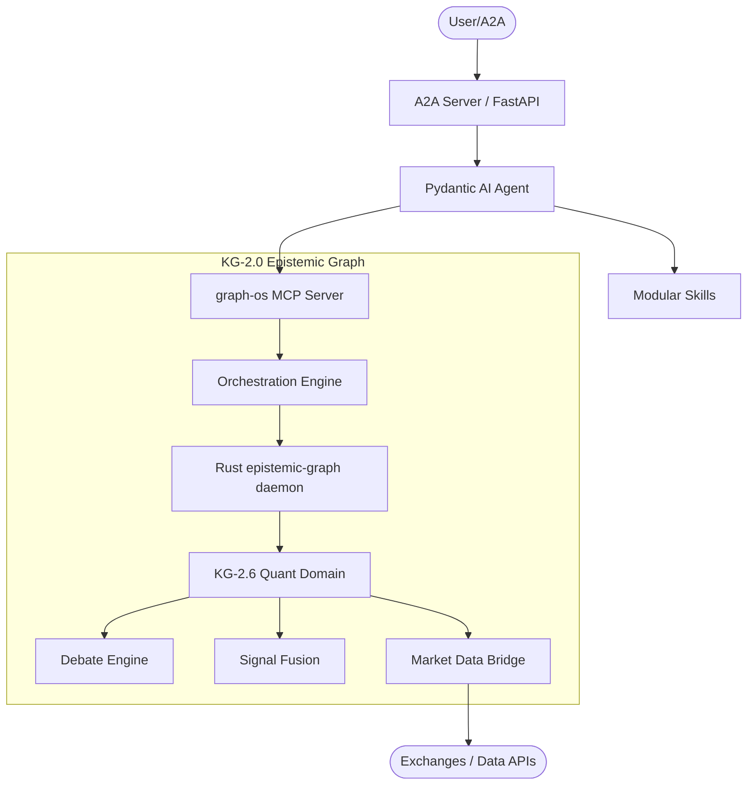
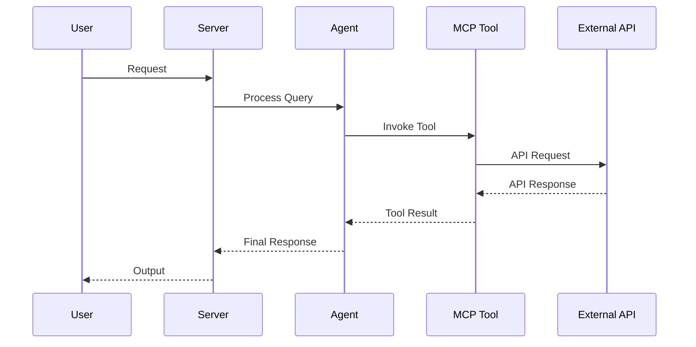

# AGENTS.md

<!--
This file is the hand-written source for AGENTS.md. The final AGENTS.md is
regenerated by `scripts/gen_agents_md.py`, which appends two generated
sections (Project Structure file tree + Concept Reference) to this prose.
Edit THIS file for any narrative / conventions changes, then run:
    python scripts/gen_agents_md.py
-->

## Tech Stack & Architecture
- Language/Version: Python 3.10+
- Core Libraries: `agent-utilities`, `fastmcp`, `pydantic-ai`
- Key principles: Functional patterns, Pydantic for data validation, asynchronous tool execution.
- Architecture:
    - `kg_server.py`: Main MCP server entry point and tool registration.
    - `agent.py`: Pydantic AI agent definition and logic.
    - `skills/`: Directory containing modular agent skills (if applicable).
    - `agent/`: Internal agent logic and prompt templates.

### Architecture Diagram


### Workflow Diagram


## Commands (run these exactly)
# Installation
pip install .[all]

# Quality & Linting (run from project root)
pre-commit run --all-files

# Execution Commands
# agent-utilities-kg
agent_utilities.mcp.kg_server:main

# Run the native compute backend daemon
cargo run -p epistemic-graph

## Project Structure Quick Reference
- MCP Entry Point → `kg_server.py`
- Native Compute Engine → `epistemic-graph` (Rust)
- Agent Entry Point → `agent.py`
- Source Code → `agent_utilities/`
- Skills → `skills/` (if exists)

## Code Style & Conventions
**Always:**
- Use `agent-utilities` for common patterns (e.g., `create_mcp_server`, `create_agent`).
- Define input/output models using Pydantic.
- Include descriptive docstrings for all tools (they are used as tool descriptions for LLMs).
- Check for optional dependencies using `try/except ImportError`.

**Good example:**
```python
from agent_utilities import create_mcp_server
from mcp.server.fastmcp import FastMCP

mcp = create_mcp_server("my-agent")

@mcp.tool()
async def my_tool(param: str) -> str:
    """Description for LLM."""
    return f"Result: {param}"
```

## Dos and Don'ts
**Do:**
- Run `pre-commit` before pushing changes.
- Use existing patterns from `agent-utilities`.
- Keep tools focused and idempotent where possible.

**Don't:**
- Use `cd` commands in scripts; use absolute paths or relative to project root.
- Add new dependencies to `dependencies` in `pyproject.toml` without checking `optional-dependencies` first.
- Hardcode secrets; use environment variables or `.env` files.

## Safety & Boundaries
**Always do:**
- Run lint/test via `pre-commit`.
- Use `agent-utilities` base classes.

**Ask first:**
- Major refactors of `kg_server.py` or `agent.py`.
- Deleting or renaming public tool functions.

**Never do:**
- Commit `.env` files or secrets.
- Modify `agent-utilities` or `universal-skills` files from within this package.

## When Stuck
- Propose a plan first before making large changes.
- Check `agent-utilities` documentation for existing helpers.

## ⛔ No Scratch or Temporary Files in Repository

**NEVER write any of the following to this repository:**
- Temporary test scripts (`test_*.py`, `debug_*.py` outside of `tests/`)
- Scratch scripts or experimental one-off files
- Log files (`.log`, `.txt` command output)
- Random text files with command output or debug dumps
- Any file that is NOT production source code, tests in `tests/`, or documentation

**Why:** These files expose private filesystem paths, credentials, and internal infrastructure details when pushed to GitHub publicly.

**Where to put scratch work instead:**
- Use `~/workspace/scratch/` for temporary scripts and experiments
- Use `~/workspace/reports/` for command output and reports
- Keep test scripts in the `tests/` directory following proper pytest conventions
