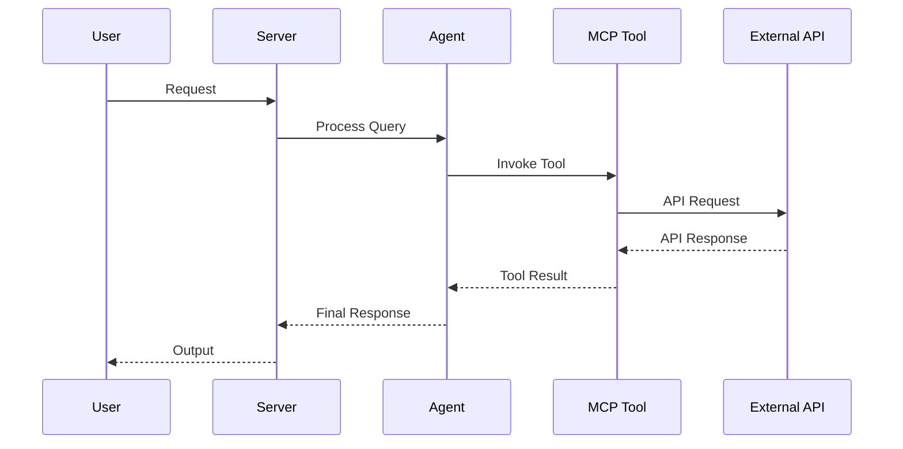

# AGENTS.md

<!--
This file is the hand-written source for AGENTS.md. The final AGENTS.md is
regenerated by `scripts/gen_agents_md.py`, which appends two generated
sections (Project Structure file tree + Concept Reference) to this prose.
Edit THIS file for any narrative / conventions changes, then run:
    python scripts/gen_agents_md.py
-->

> Claude Code loads this file via `CLAUDE.md` (`@AGENTS.md` import) — the two stay
> in sync. Edit `AGENTS.head.md` (then regenerate), never `CLAUDE.md`.

## Architecture Reference (current)

- **Engine transport.** Python talks to the Rust `epistemic-graph` engine **only**
  through the out-of-process MessagePack/UDS client (`epistemic_graph.client`,
  with `pool.py` `ConnectionPool`/`ShardRouter`). There is **no PyO3**. Entry:
  `domains/finance/*` and `knowledge_graph/core/graph_compute.py`.
- **Knowledge graph (layered).** `knowledge_graph/facade.py` (`KnowledgeGraph`) is
  the single object the execution plane uses; it composes L0 compute (Rust client),
  L1 store (`backends/` — Postgres + epistemic_graph primary; neo4j/falkordb/ladybug
  demoted to `backends/contrib/`), and L2 semantic (`core/owl_bridge.py`, SHACL gate).
  `retrieval/capability_index.py` (`CapabilityIndex`, HNSW) powers `designate()` and
  reward write-back (`record_outcome`).
- **Routing.** `graph/routing/` is a strategy package (`Router`/`RoutingStrategy`)
  stranglering the monolith `graph/_router_impl.py`; strategies under
  `routing/strategies/` (fast_path, workflow_context, policy). `graph/planning/`
  is the unified `Planner` facade; `core/execution/` is the `ExecutionEngine`
  Protocol. Consolidated singletons: `core/registry/`, `core/checkpoint/`,
  one `core/config.py`, one `EmbeddingFactory` (`core/embedding_utilities.create_embedding_model`).
- **Single source of truth for concepts:** `docs/concepts.yaml` (regenerate via
  `scripts/build_concepts_yaml.py`; README/AGENTS counts come from it).
- **Guardrail gates (CI + pre-commit, `guardrails.yml`):** `scripts/check_no_stub.py`,
  `check_sprawl.py`, `check_concepts.py`, `check_coupling.py`,
  `check_retrieval_quality.py`, with meta-tests in `tests/gates/`.
- **Cardinal rules:** no stubs (`raise NotImplementedError` only with `# ABSTRACT-OK`);
  strangler-then-delete (never "v2 beside old"); keep the unit suite green.

## Tech Stack & Architecture
- Language/Version: Python 3.10+
- Core Libraries: `agent-utilities`, `fastmcp`, `pydantic-ai`
- Key principles: Functional patterns, Pydantic for data validation, asynchronous tool execution.
- Architecture:
    - `kg_server.py`: Main MCP server entry point and tool registration.
    - `agent.py`: Pydantic AI agent definition and logic.
    - `skills/`: Directory containing modular agent skills (if applicable).
    - `agent/`: Internal agent logic and prompt templates.

### Architecture Diagram


### Workflow Diagram


## Commands (run these exactly)
# Installation
pip install .[all]

# Quality & Linting (run from project root)
pre-commit run --all-files

# Execution Commands
# agent-utilities-kg
agent_utilities.mcp.kg_server:main

# Run the native compute backend daemon
cargo run -p epistemic-graph

## Project Structure Quick Reference
- MCP Entry Point → `kg_server.py`
- Native Compute Engine → `epistemic-graph` (Rust)
- Agent Entry Point → `agent.py`
- Source Code → `agent_utilities/`
- Skills → `skills/` (if exists)

## Code Style & Conventions
**Always:**
- Use `agent-utilities` for common patterns (e.g., `create_mcp_server`, `create_agent`).
- Define input/output models using Pydantic.
- Include descriptive docstrings for all tools (they are used as tool descriptions for LLMs).
- Check for optional dependencies using `try/except ImportError`.

**Good example:**
```python
from agent_utilities import create_mcp_server
from mcp.server.fastmcp import FastMCP

mcp = create_mcp_server("my-agent")

@mcp.tool()
async def my_tool(param: str) -> str:
    """Description for LLM."""
    return f"Result: {param}"
```

## Dos and Don'ts
**Do:**
- Run `pre-commit` before pushing changes.
- Use existing patterns from `agent-utilities`.
- Keep tools focused and idempotent where possible.

**Don't:**
- Use `cd` commands in scripts; use absolute paths or relative to project root.
- Add new dependencies to `dependencies` in `pyproject.toml` without checking `optional-dependencies` first.
- Hardcode secrets; use environment variables or `.env` files.

## Safety & Boundaries
**Always do:**
- Run lint/test via `pre-commit`.
- Use `agent-utilities` base classes.

**Ask first:**
- Major refactors of `kg_server.py` or `agent.py`.
- Deleting or renaming public tool functions.

**Never do:**
- Commit `.env` files or secrets.
- Modify `agent-utilities` or `universal-skills` files from within this package.

## When Stuck
- Propose a plan first before making large changes.
- Check `agent-utilities` documentation for existing helpers.

## ⛔ Keep the Repository Root Pristine — No Scratch / Temp / Debug Files

**The repository ROOT must contain only canonical project files** (packaging,
config, docs, lockfiles). The only hidden directories allowed at root are
`.git/`, `.github/`, and `.specify/` (plus a local, git-ignored `.venv/`).

**NEVER write any of the following — anywhere in the repo, and ESPECIALLY at the root:**
- One-off / debug / migration scripts: `fix_*.py`, `migrate_*.py`, `refactor_*.py`,
  `replace_*.py`, `update_*.py`, `debug_*.py`, or `test_*.py` **at the root**
  (real tests live in `tests/` only).
- Databases / data dumps: `*.db`, `*.db-wal`, `*.sqlite*`, `*.corrupted`.
- Logs / command output: `*.log`, scratch `*.txt`, `*.orig`, `*.rej`, `*.bak`.
- Build artifacts: `*.tsbuildinfo`, compiled binaries, coverage files.
- AI agent scratch directories: `.agent/`, `.agents/`, `.agent_data/`, `.tmp/`,
  `.hypothesis/`, or any per-tool cache committed to git.
- Any file that is NOT production source, a test in `tests/`, documentation, or
  a recognized config/lockfile.

**Why:** scratch at the root leaks private paths/credentials, bloats the tree,
breaks the anti-sprawl gate, and erodes a pristine codebase.

**Where scratch goes instead:** `~/workspace/scratch/` (experiments),
`~/workspace/reports/` (command output); tests go in `tests/` (pytest).
The `.gitignore` already blocks the scratch dirs above — do not force-add them.
Before finishing a task, run `git status` and confirm no stray root files were added.
