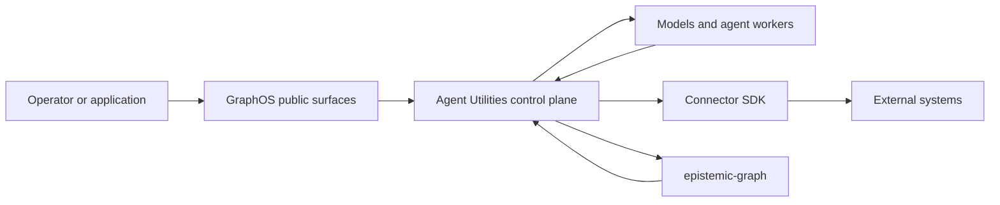

# Agent Utilities engineering contract

This file is the current source of truth for contributors and automation working
in this repository. Keep implementation, tests, public documentation, and this
contract aligned.

## What this repository owns

Agent Utilities is the Python **agent control plane and harness**. It owns:

- agent construction, model selection, skills, and tool binding;
- goal planning, routing, teams, workflows, loops, and execution policy;
- verified session context, budgets, approvals, and safety decisions;
- evaluation, replay, reward signals, outcome capture, and governed improvement;
- harness health, telemetry, operator workflows, and runtime configuration.

Adjacent repositories remain authoritative for their own layers:

| Repository | Authority |
|---|---|
| `epistemic-graph` | Durable graph state, UQL/query execution, transactions, RDF/OWL/SHACL, provenance, schemas, proofs, and durable work state |
| `graph-os` | Public MCP, REST, A2A, authentication, deployment, and service composition |
| `agent-connector-sdk` | Source transport, pagination, credentials, conflict handling, and write-back effects |
| `agent-webui` | Browser client for GraphOS contracts |

Do not implement a second graph engine, ontology authority, public gateway, or
connector transport here. Agent Utilities coordinates those capabilities through
typed contracts.

### Delegate through the graph

Use the running knowledge system before reconstructing repository context by
hand:

1. Query `graph_code action=code_context` with `target=how`, `usage`, or
   `impact`; read only the cited source needed for the change.
2. If the source is not indexed, request a bounded delta sync, then query again.
3. Delegate supported work through `graph_orchestrate`, `graph_agents`, or a
   registered `graph_workflows` workflow. Use `agent-utilities-expert` for this
   ecosystem.
4. Review the resulting `RunTrace` and `ToolCall` records. When delegation
   fails, repair the missing data, binding, skill, or prompt and retry.
5. Fall back to repository search when GraphOS is unavailable or the indexed
   evidence is insufficient. Report corrections through graph feedback when the
   graph supplied an incomplete answer.

The model proposes and executes work; epistemic-graph records authoritative
state; GraphOS admits and exposes operations; Agent Utilities applies control
policy.

## Architecture and module map

| Path | Responsibility |
|---|---|
| `agent_utilities/agent/` | Agent construction and execution adapters |
| `agent_utilities/orchestration/` | Planning, routing, teams, workflows, scheduling, and execution control |
| `agent_utilities/harness/` | Evaluation, replay, scoring, and improvement loops |
| `agent_utilities/core/` | Configuration, registries, workspace support, and shared control-plane primitives |
| `agent_utilities/security/` | Identity, authorization, action policy, secret interfaces, and sandboxes |
| `agent_utilities/observability/` | Metrics, traces, audit events, and usage accounting |
| `agent_utilities/knowledge_graph/` | Control-plane clients and projections over epistemic-graph contracts |
| `agent_utilities/mcp/`, `agent_utilities/gateway/` | Package integration adapters consumed by the GraphOS composition layer |
| `agent_utilities/skills/` | Bundled development, deployment, graph, and evolution workflows |
| `deploy/` | Deployment inputs consumed by GraphOS and platform automation |
| `docs/` | GitHub Pages source and generated reference material |
| `tests/` | Unit, wiring, contract, integration, security, and live-path evidence |
| `scripts/` | Deterministic generators, quality gates, and release checks |


```mermaid
flowchart LR
    Client[Operator or application] --> GraphOS[GraphOS public surfaces]
    GraphOS --> AU[Agent Utilities control plane]
    AU --> Models[Models and agent workers]
    AU --> SDK[Connector SDK]
    AU --> EG[epistemic-graph]
    SDK --> Sources[External systems]
    Models --> AU
    EG --> AU
```

Shared behavior belongs in one service or core implementation. Public adapters
must call that implementation rather than copy it. A feature is complete only
when a real entry point invokes it and the appropriate wiring or live-path test
proves the edge.

## Commands

Run commands from a linked worktree. Outside the workspace root, use the
workspace launcher so dependencies and the lock resolve against this checkout:

```bash
python3 scripts/uv_workspace.py doctor
python3 scripts/uv_workspace.py run --all-extras pytest tests/unit/path/to/test.py -q
python3 scripts/uv_workspace.py run --all-extras pytest -q
```

Regenerate and validate documentation:

```bash
python3 scripts/build_concepts_yaml.py
python3 scripts/gen_docs.py --write
python3 scripts/gen_agents_md.py
python3 scripts/docs_contract.py --check
pre-commit run public-surface --all-files
```

Run the normal all-files gate only through the shared lease and safety wrapper:

```bash
agent-utilities lane lease --resource precommit-all-files --operation gate -- \
  python3 scripts/safe_precommit_all_files.py
```

Useful focused checks:

```bash
python3 scripts/check_current_only_contract.py
python3 scripts/check_tracked_privacy.py
python3 scripts/check_version_consistency.py
```

Exit code 75 from a lane command means another lane owns the resource. Defer;
do not bypass the lease or start a competing global operation.

## Quality gates

Evidence must match the claim being made:

- **Unit** tests prove a component in isolation.
- **Wiring** tests drive a real entry point and observe the real seam.
- **Contract** tests pin exact public surfaces across supported modes.
- **Live-path** tests use the real transport and dependencies needed for a
  deployability claim.

Run focused tests first, then every affected gate, then the leased all-files
suite. Fix failures at their source; do not weaken assertions, hide findings,
skip a failing test, use `--no-verify`, or relabel a failure as unrelated.

Keep generated files generated. Change their source and rerun the owning
generator. Documentation changes must pass the shared `public-surface` hook,
the docs contract, privacy checks, and the strict Pages build.

The release version is defined by `agent_utilities/_version.py` and synchronized
across package metadata, installers, changelog, documentation, and locks by the
release tooling. Run `scripts/check_version_consistency.py`; never update a
single version surface by hand. Do not push, tag, publish, or promote a runtime
unless the user requested it and the exact main commit has passed hosted CI.
Publishing is performed by the reviewed GitHub release workflow, not an
interactive local upload.

## Development rules

- Read the relevant source, tests, architecture guide, and public entry points
  before editing. Revalidate assumptions against the current checkout.
- Make the smallest cohesive change that satisfies the requested architecture.
  Update all owned consumers atomically and delete the replaced path rather
  than adding aliases, dual writes, or fallback branches.
- Keep one authority for each responsibility. Reuse an existing abstraction
  before introducing a module, registry, daemon, environment key, or dependency.
- Put structured boundaries in typed models. Keep transports thin and expose a
  capability through its owning service rather than implementing it per UI.
- Keep base installation free of heavyweight training dependencies. Model
  training and GPU workloads belong in their dedicated service; graph compute
  belongs in epistemic-graph.
- Configuration is generated into XDG AgentConfig. Only the central config
  modules may read the process environment. Prefer detection and correct
  defaults over a new setting.
- Persist secret references, never resolved credentials. Do not commit `.env`
  files, tokens, private endpoints, host inventories, certificates, or local
  paths. All network and authorization failures fail closed.
- Treat caller identity and scope as server-verified context. Payloads may not
  mint authority, choose tenants, or bypass action policy.
- Keep repository root content to declared source, tests, documentation, and
  configuration. Scratch output, logs, caches, databases, and reports belong in
  the configured state directory, not the repository.
- Update the owning documentation and Mermaid diagram with behavior or
  architecture changes. Public files describe only current supported behavior.

## Documentation

`README.md` is the concise public entry page. The
[Pages site](https://knuckles-team.github.io/agent-utilities) owns detailed
architecture, configuration, deployment, operations, and generated references.
`docs/status.md` is the release-aware capability registry, and `llms.txt` is the
machine-oriented documentation index.

This file is the contributor and automation contract. Edit `AGENTS.head.md`,
then run `python3 scripts/gen_agents_md.py`; do not edit the generated
`AGENTS.md` directly. Keep examples synthetic and repository-relative. Do not
publish planning notes, checkout details, task chronology, or machine-specific
instructions in README, AGENTS, or Pages content.

New Pages documents must be linked from `mkdocs.yml`. Validate navigation,
local links, generated catalogs, and strict rendering before delivery.

## Branching & isolation

The canonical checkout is shared and read-only for feature work. Create a real
linked worktree from current `main`:

```bash
git worktree add \
  "${XDG_STATE_HOME}/repository-worktrees/agent-utilities/<topic>" \
  -b "<branch>" main
agent-utilities lane status
agent-utilities lane env
```

Do not use harness-managed worktree isolation for this repository. Do not
switch branches, reset, clean, or restore paths in a checkout another lane may
use.

Never use `git stash`: the stash reference is shared by every linked worktree.
Use a small scratch commit or `agent-utilities lane park` when work must be
parked. Never stage with `git add -A` or `git add .`; inspect status and the full
diff, then stage an explicit reviewed path list. Re-read the staged name list
and patch before committing.

Use lane-private build, test, cache, and scratch paths reported by `lane env`.
Take the declared lease before changing shared locks, generated global views,
or running all-files hooks. A contender defers rather than forcing access.

Commit each coherent unit with the repository-configured author identity.
Submit completed work through the serialized merge queue; do not merge into
shared `main` by hand. The queue validates the
candidate as merged and retains a recovery reference before pruning. Pushes,
tags, releases, deployments, and destructive cleanup require explicit scope
from the user.
