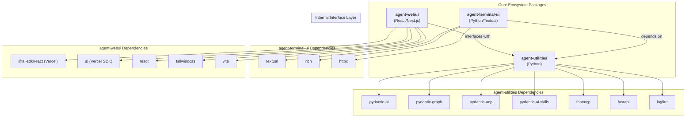

# AGENTS.md

> **Notice:** The `agent-utilities` project uses **Spec-Driven Development (SDD)**.
> - The core project constitution and governance rules are tracked natively in `.specify/memory/constitution.md`.
> - Feature specifications and task lists are tracked in `.specify/specs/` and `.specify/tasks/`.
> This file (`AGENTS.md`) serves as the active system prompt, but the definitive source of truth for architecture and new features is the SDD directory.

## Protocol-First Design Philosophy

<!-- CONCEPT:ORCH-1.0 Unified Intelligence Graph -->
<!-- CONCEPT:ORCH-1.1 Recursive HTN Planning -->
<!-- CONCEPT:ORCH-1.2 Specialist Routing -->
<!-- CONCEPT:ORCH-1.3 Execution & State Safety -->
<!-- CONCEPT:KG-2.0 Active Knowledge Graph -->
<!-- CONCEPT:KG-2.1 Tiered Memory & Rationale -->
<!-- CONCEPT:KG-2.2 Ontology & Epistemics -->
<!-- CONCEPT:KG-2.3 Graph Integrity & Fingerprinting -->
<!-- CONCEPT:AHE-3.0 Agentic Harness -->
<!-- CONCEPT:AHE-3.1 Evaluation & Distillation -->
<!-- CONCEPT:AHE-3.2 Evolution & Discovery -->
<!-- CONCEPT:AHE-3.3 Team & Synergy Optimization -->
<!-- CONCEPT:AHE-3.4 Distributed Agentic Evolution -->
<!-- CONCEPT:ECO-4.0 Unified Tool Interface -->
<!-- CONCEPT:ECO-4.1 MCP & Universal Skills -->
<!-- CONCEPT:ECO-4.2 A2A Network & Consensus -->
<!-- CONCEPT:ECO-4.3 Community Telemetry -->
<!-- CONCEPT:OS-5.0 Agent OS Kernel -->
<!-- CONCEPT:OS-5.1 Security & Auth -->
<!-- CONCEPT:OS-5.2 Resource Scheduling -->
<!-- CONCEPT:AHE-3.7 Heavy Thinking Orchestration -->
<!-- CONCEPT:KG-2.6 Financial Trading Pipeline -->
<!-- CONCEPT:ECO-4.4 Market Data Connector Protocol -->
<!-- CONCEPT:ECO-4.11 Graph-Native Durable Execution -->
<!-- CONCEPT:ECO-4.12 Secure Jupyter Sandbox -->
<!-- CONCEPT:AHE-3.23 OWL-Driven AgentSpecs Catalog -->
<!-- CONCEPT:ORCH-1.4 Swarm Preset Template Engine -->
<!-- CONCEPT:KG-2.7 Risk Scoring Ontology -->
<!-- CONCEPT:AHE-3.8 Backtest Evaluation Harness -->
<!-- CONCEPT:AHE-3.9 Horizon-Aware Task Curriculum -->
<!-- CONCEPT:AHE-3.10 Decomposed Reward Signals -->
<!-- CONCEPT:AHE-3.11 Structured Retry Manager -->
<!-- CONCEPT:OS-5.3 Session Concurrency -->
<!-- CONCEPT:OS-5.4 Prompt Injection Scanner -->
<!-- CONCEPT:OS-5.5 Tool Repetition Guard -->
<!-- CONCEPT:KG-2.10 Token-Aware Context Compaction -->
<!-- CONCEPT:AHE-3.12 Multi-Strategy EvalRunner -->
<!-- CONCEPT:AHE-3.13 Agent Config Versioning -->
<!-- CONCEPT:OS-5.6 Token Usage Tracker -->
<!-- CONCEPT:OS-5.7 Audit Logger -->
<!-- CONCEPT:OS-5.8 Guardrail Callback Engine -->
<!-- CONCEPT:KG-2.11 Research Intelligence Pipeline -->
<!-- CONCEPT:KG-2.12 KG Source Resolver -->
<!-- CONCEPT:ORCH-1.7 SDD Pipeline -->
<!-- CONCEPT:KG-2.13 Cross-Session Chat Recall -->
<!-- CONCEPT:KG-2.14 Project-Aware Context -->
<!-- CONCEPT:KG-2.15 Topological Analogy Engine -->
<!-- CONCEPT:KG-2.16 Semantic Subsumption -->
<!-- CONCEPT:AHE-3.14 Agentic Engineering Patterns -->
<!-- CONCEPT:OS-5.9 Telemetry & Observability -->
<!-- CONCEPT:OS-5.10 Policy & Prompt Governance -->
<!-- CONCEPT:OS-5.11 Topological Vulnerability Scanner -->
<!-- CONCEPT:ECO-4.7 Ecosystem Topology Map -->
<!-- CONCEPT:KG-2.19 Cross-Pillar Synergy Engine -->
<!-- CONCEPT:AHE-3.24 KG-Native Agentic Task Detection -->
<!-- CONCEPT:AHE-3.25 Topological Reasoning Detection -->
<!-- CONCEPT:ORCH-1.14 Ontological Fallback Chains -->
<!-- CONCEPT:KG-2.50 Vectorized Context-Window Filtering -->
<!-- CONCEPT:OS-5.19 Topological Session Persistence -->

**agent-utilities is a protocol-first, framework-light agent core library.**

### Core Design Principles (Do Not Violate)

- **Agents are protocol-native**: Agents communicate via open standards (ACP, A2A, MCP) not proprietary APIs
- **Protocol logic is isolated**: Protocol adapters are separate from agent business logic
- **Transport-agnostic**: Agents work over any transport (SSE, HTTP, stdio, WebRTC)
- **No framework lock-in**: Avoid opinionated orchestration frameworks like LangChain chains
- **Explicit state over implicit context**: State is explicit and managed, not hidden in global variables
- **Tools and transports are pluggable**: Any tool or transport can be swapped without changing agent code
- **UI-agnostic**: No assumptions about user interface (terminal, web, mobile, voice)
- **JSON Prompting (Prompts-as-Code)**: Favor structured JSON blueprints over free-form Markdown for high-fidelity task specification.
- **Graph-native intelligence**: All agent knowledge, routing decisions, and learned patterns are persisted in the Knowledge Graph — not flat files.
- **Event-driven invalidation**: Caches and indices are invalidated by mutation events, never by TTL. This eliminates stale-cache risks.
- **Feedback-driven learning**: Execution outcomes feed back to Self-Model and TeamConfig, enabling progressive routing improvement without human intervention.
- **Distributed Agentic Evolution (AHE-3.4)**: Agents testing new skills locally automatically bundle and PR them back to `agent-packages` to evolve the collective ecosystem.
- **Community Telemetry (ECO-4.3)**: Evolved artifacts maintain deterministic origin tracking, timestamps, and `Author: Autonomous` safety guardrails.
### When to Use agent-utilities

**Use agent-utilities when you need:**
- Production-grade agent orchestration with resilience and observability
- Protocol-native agents that can communicate across the ecosystem
- Graph-based orchestration with parallel execution
- Knowledge graph integration for long-term memory
- MCP tool integration for external capabilities
- Multi-agent coordination via ACP/A2A
- Dynamic team formation with proven coalition reuse
- Auto-activating capabilities based on task characteristics

**Do NOT use agent-utilities for:**
- Simple single-shot LLM calls (use pydantic-ai directly)
- UI development (use agent-webui or agent-terminal-ui)
- SaaS-specific integrations (build MCP servers instead)
- Opinionated agent personalities (build on top of agent-utilities)

## Tech Stack

- **Language**: Python 3.11+ (per `pyproject.toml` `requires-python`)
- **Core Framework**: [Pydantic AI](https://ai.pydantic.dev) (`pydantic-ai-slim>=1.73.0,<2.0.0`) & [Pydantic Graph](https://ai.pydantic.dev/pydantic-graph/) (`pydantic-graph>=0.1.8`)
- **Tooling**: `requests`, `pydantic` (`>=2.8.2`), `pyyaml`, `python-dotenv`, `fastapi` (`>=0.131.0`), `httpx` (`>=0.28.1`, core), `llama_index` (optional via `embeddings*` extras)
- **Architecture**: Centered around the `create_agent` factory, which supports a **Unified Skill Loading** model (`skill_types`) and automated **Graph Orchestration**.
- **Unified Specialist Discovery**: All specialist agents—prompt-based, MCP-derived, and A2A peers—are consolidated into a single, declarative source of truth: the **Knowledge Graph**.

### Dependency Notes

- **`httpx` is a core dep, not `[mcp]`-gated.** `a2a.py` imports it unconditionally.
- **`pydantic-acp` is used for the ACP adapter.** `acpkit` is NOT a dependency.
- **Defensive upper bounds (`<N+1.0`) on all direct deps** to prevent surprise breakage.
- **Circular import between `agent-utilities[ag-ui]` and `agent-webui`** is resolved cleanly with lockstep version bumps.

## Package Relationships

`agent-utilities` is the core Python engine. It provides the backend server that serves both the `agent-webui` assets and the `agent-terminal-ui` client.

- **Backend (`agent-utilities`)**: Handles LLM orchestration, tool execution, and a multi-protocol interface layer.
- **Web Frontend (`agent-webui`)**: A React application using Vercel AI SDK that provides a cinematic chat interface.
- **Terminal Frontend (`agent-terminal-ui`)**: A Textual-based terminal interface for direct CLI interaction.
- **Communication**: Frontends primarily connect via the Agent Communication Protocol (ACP).
- **Memory System**: Local project memory is managed via `AGENTS.md` (auto-loaded into the system prompt). Native agent memory is powered by a Knowledge Graph.

## Ecosystem Dependency Graph



## Commands

> **Testing Standard:** All pytests are strictly bounded by a **60-second timeout** via `pytest-timeout` (`addopts = --timeout=60`). Any test that sleeps or hangs indefinitely will fail automatically to preserve CI/CD stability.

```bash
# Run tests (unit + integration, excludes live)
uv run pytest -x -v

# Lint & format
uv run ruff check agent_utilities/ tests/
uv run ruff format --check agent_utilities/ tests/

# Type check
uv run mypy agent_utilities/

# Full pre-commit suite
pre-commit run --all-files

# Run the server
uv run python -m agent_utilities.server --debug --provider openai --model-id llama-3.2-3b-instruct
```

## Project Structure

```text
agent-utilities/
├── agent_utilities/          # Core package
│   ├── server/               # FastAPI server (ACP/A2A/MCP/AG-UI endpoints, process lifecycle)
│   ├── base_utilities.py     # Low-level helpers, env expansion, model I/O
│   ├── acp_adapter.py        # ACP adapter (per-session agent_factory)
│   ├── agui_emitter.py       # AG-UI wire format translator for direct graph execution
│   ├── graph/                # Graph orchestration (builder, runner, iter, routing, executor, verification)
│   │   ├── config_helpers.py # Registry Hot Cache (CONCEPT:ORCH-1.2)
│   │   ├── routing.py        # 3-stage hybrid routing (CONCEPT:AHE-3.3, CONCEPT:KG-2.1)
│   │   ├── executor.py       # Capability auto-activation (CONCEPT:ORCH-1.2)
│   │   ├── retry_manager.py  # Structured Retry Manager (CONCEPT:AHE-3.11)
│   │   └── verification.py   # Self-Model + TeamConfig feedback loop
│   ├── knowledge_graph/      # Unified Intelligence Graph (15-phase pipeline)
│   │   ├── self_model.py     # Persistent Self-Model (CONCEPT:KG-2.1)
│   │   ├── engine_registry.py # TeamConfig promotion/reuse (CONCEPT:AHE-3.3)
│   │   ├── ogm.py            # Object-Graph Mapper (CONCEPT:KG-2.0)
│   │   ├── fingerprint.py    # Structural Fingerprint Engine (CONCEPT:KG-2.3)
│   │   ├── graph_validator.py # Graph Integrity Validator (CONCEPT:KG-2.3)
│   │   ├── hypergraph.py     # Inductive Knowledge Hypergraphs (CONCEPT:KG-2.4)
│   │   ├── context_compactor.py # Token-Aware Context Compaction (CONCEPT:KG-2.10)
│   │   ├── source_resolver.py # KG Source Resolver (CONCEPT:KG-2.12)
│   │   ├── research_artifacts.py # Research Artifact Generator (CONCEPT:KG-2.11)
│   │   └── kb/entity_claim_extractor.py # Entity-Claim Extraction (CONCEPT:KG-2.2)
│   ├── protocols/            # Protocol adapters (ACP, A2A, AG-UI)
│   │   ├── a2a_graph_skill.py # PlannerGraphSkill (CONCEPT:ECO-4.2)
│   │   └── a2a_config.py     # A2A Config Loader (CONCEPT:ECO-4.2)
│   ├── models/               # Pydantic models and schema definitions
│   ├── security/             # Security: JWT auth, secrets, injection scanning, repetition guard
│   │   ├── prompt_scanner.py # Prompt Injection Scanner (CONCEPT:OS-5.4)
│   │   ├── repetition_guard.py # Tool Repetition Guard (CONCEPT:OS-5.5)
│   │   └── guardrail_engine.py # Guardrail Callback Engine (CONCEPT:OS-5.8)
│   ├── observability/        # Observability: evaluation, token tracking, audit, config versioning
│   │   ├── evaluation.py     # EvalRunner — Multi-Strategy Scoring (CONCEPT:AHE-3.12)
│   │   ├── token_tracker.py  # Token Usage Tracker — 4-Bucket Analytics (CONCEPT:OS-5.6)
│   │   ├── audit_logger.py   # Audit Logger — Compliance Logging (CONCEPT:OS-5.7)
│   │   └── config_versioning.py # Agent Config Versioning (CONCEPT:AHE-3.13)
│   ├── prompts/              # Externalized JSON prompt blueprints (51 files)
│   ├── policies/             # Engineering rule books (YAML frontmatter)
│   ├── capabilities/         # Self-healing: checkpointing, circuit breakers, teams
│   ├── tools/                # Agent tools (developer, workspace, etc.)
│   ├── mcp/                  # MCP server wrappers and agent manager
│   ├── rlm/                  # Recursive Language Model environments
│   ├── sdd/                  # Spec-Driven Development pipelines
│   ├── harness/              # Agentic Harness Engineering toolkit
│   │   ├── backtest_harness.py # Backtest Evaluation Harness (CONCEPT:AHE-3.8)
│   │   └── engineering.py    # Engineering Pattern Orchestrator (CONCEPT:AHE-3.14)
│   └── patterns/             # Design patterns (prompt chaining, prioritization, exploration)
├── tests/                    # Test suite (2060+ tests: unit, integration, knowledge_graph)
├── docs/                     # Comprehensive documentation (24 guides)
├── .specify/                 # SDD specs, tasks, and constitution
├── pyproject.toml            # PEP 621 project metadata
├── .env.example              # Environment variable template
└── AGENTS.md                 # This file (project rules for AI agents)
```

## Architectural Concepts

The system is built on 70 foundational concepts organized into 5 layers:

### Core Infrastructure (CONCEPT:ORCH-1.0 to CONCEPT:OS-5.1)
Agent creation, graph orchestration, workspace management, protocol adapters, serialization, structured prompts, RLM, capabilities, SDD, tools, and secrets.

### Emergent Architecture (CONCEPT:KG-2.0 to CONCEPT:ORCH-1.2)
KG Object-Graph Mapper, Swarm Orchestration, Evolutionary Variants, Persistent Self-Model, Global Workspace Attention.

### Design Patterns (CONCEPT:ORCH-1.1 to CONCEPT:AHE-3.2)
Prompt Chaining, Resource Optimization, Evaluation & Monitoring, Task Prioritization, Exploration & Discovery.

### First Principles (CONCEPT:ORCH-1.2 to CONCEPT:ECO-4.2)
Registry Hot Cache, TeamConfig Promotion, AgentCapability Type System, A2A PlannerGraphSkill.

### Unified Specialist & A2A Integration (CONCEPT:ECO-4.2 to CONCEPT:ORCH-1.2)
A2A Config File Loader, Unified Specialist Model (type collapse).
### KG Intelligence (CONCEPT:KG-2.2 to CONCEPT:KG-2.2)
Schema Packs (domain-configurable KG profiles), Backlink-Density Retrieval Boost, KG Eval Capture (regression testing).
### Conductor Orchestration (CONCEPT:ORCH-1.1 to CONCEPT:ORCH-1.5)
Conductor Workflow Specification, Execution Visibility Graph, Model Synergy Tracker, Recursive Graph Orchestration, Multi-Level Abstraction Layering (planners emit coarse abstraction steps, delegating fine-grained execution to specialists).
### UA-Inspired Enhancements (CONCEPT:KG-2.3, CONCEPT:KG-2.3, CONCEPT:KG-2.2)
Structural Fingerprint Engine (incremental KG updates), Graph Integrity Validator (4-tier auto-fix pipeline), Entity-Claim Extraction (MAGMA epistemic completion).
### Wide-Search Extraction & Traceability (CONCEPT:ORCH-1.1, CONCEPT:AHE-3.1)
Wide-Search Orchestration (Pydantic-native batch extraction and hybrid validation), Trace Distillation Error Categorization (Orchestrator vs Worker failure modes).
### Graph Topology Representation (CONCEPT:KG-2.2)
Context-Aware Entity Representations (injects multi-hop structural logic and OWL relationships into vector embeddings).
### Continual Learning & Experience (CONCEPT:AHE-3.5 to CONCEPT:AHE-3.10, CONCEPT:KG-2.4)
Experience Node Architecture (distills context-specific tactics), Cross-Rollout Critique (sequential contrastive failure analysis), Decomposed Context Retrieval (targeted multi-vector search), Memory-Aware Test-Time Scaling (batch-parallel experience distillation with zero-shot hypergraph generalization and topological feedback), Offline/Async Knowledge Compression (TraceDistiller for periodic episode-to-preference distillation), Topological Mincut Partitioning (emergent hierarchical waypoints with Label Propagation fallback), Temporal Drift & EWC Consolidation (Fisher-proxy mitigation of catastrophic forgetting), Heavy Thinking Orchestration (two-stage parallel-then-deliberate reasoning with tiered complexity gating, trajectory pruning/shuffling, iterative refinement, and KG-native trajectory persistence), Horizon-Aware Task Curriculum (progressive horizon scheduling with macro-action composition, subgoal checkpoints, and configurable promotion policies), and Decomposed Reward Signals (step-level vs trajectory-level reward separation for accurate credit assignment and experience distillation).
### Security & Reliability (CONCEPT:OS-5.4, CONCEPT:OS-5.5, CONCEPT:AHE-3.11, CONCEPT:KG-2.10)
Prompt Injection Scanner (pattern-based threat detection with 25+ vectors adapted from Goose), Tool Repetition Guard (infinite loop prevention with ExperienceNode distillation), Structured Retry Manager (shell-based success checks with TeamConfig reward integration), and Token-Aware Context Compaction (three-strategy intelligent window management with episodic KG persistence).
### Multi-Domain Architecture
Transitioned to a Multi-Domain Expert System supporting modular expansion into `finance`, `medical`, `law`, and `science`. Domains leverage Vectorized Topological Memory and the Knowledge Graph, with heavy dependencies loaded optionally (e.g., `agent-utilities[finance]`).

### Financial Intelligence (CONCEPT:KG-2.6, ECO-4.4, ORCH-1.4, KG-2.7, AHE-3.8)
Financial Trading Pipeline (FIBO-aligned KG primitives for Signal→Order→Position→Portfolio→Strategy lifecycle, augmented with Trading-as-Git semantics `VERSIONED_TRADE_COMMIT`, pre-execution `EXECUTION_GUARD`, `UNIFIED_TRADING_ACCOUNT` from OpenAlice, and `TIME_SERIES_FORECAST` from Kronos), Market Data Connector Protocol (generic `DataConnectorProtocol` with auto-fallback chain and provenance tracking), Swarm Preset Template Engine (YAML-driven DAG workflow orchestration with variable substitution), Risk Scoring Ontology (domain-agnostic assessment with transitive OWL propagation), Backtest Evaluation Harness (SQLite-backed strategy evaluation with walk-forward validation and benchmark comparison), and a production-grade Quantitative Finance framework with Stationary Feature Engineering, TradingLSTM networks, Kelly Sizing execution, and Kolmogorov-Smirnov regime shift detection.
### MATE Integration (CONCEPT:AHE-3.12, AHE-3.13, OS-5.6, OS-5.7, OS-5.8)
Multi-Strategy EvalRunner (exact match, semantic similarity, LLM-as-Judge with composite scoring), Token Usage Tracker (4-bucket granular analytics with budget alerting), Audit Logger (append-only compliance trail with 30+ action constants and retention), Guardrail Callback Engine (push-based input/output interception with block/redact/warn), and Agent Config Versioning (immutable snapshots with forward-only rollback and structured diffs). All ported from the MATE framework with KG-native persistence and OWL-promoted types for transitive reasoning.
### Research Intelligence (CONCEPT:KG-2.11, KG-2.12)
Research Intelligence Pipeline (automated end-to-end research ingestion: ScholarX Discovery → 9-domain Relevance Scoring → Tiered Ingestion → OWL Enrichment → Digest Generation), KG Source Resolver (bridges the KG indexing layer to the comparative-analysis skill by materializing stored documents to filesystem paths with metadata enrichment). Supports arXiv papers via ScholarX, local files (PDF/HTML/Markdown), and web URLs.
### Topological Reasoning (CONCEPT:KG-2.15, KG-2.16, OS-5.11, KG-2.47, KG-2.48, KG-2.49)
Topological Analogy Engine (leverages exact subgraph isomorphism via networkx VF2 and EncPI embeddings for cross-domain subgraph analogy matching), OWL-Driven Semantic Subsumption (hierarchy-aware zero-shot ontology alignment mapping vectorized topologies to OWL class prototypes with full lineage inference), and Topological Vulnerability Scanner (scans execution graphs for structural vulnerabilities using analogy matches to known risk subgraphs).
- **Graph-Native Durable Execution (ECO-4.11)**: Fault-tolerant, resumable execution tracking mapped directly to Knowledge Graph nodes for multi-leg algorithmic trading.
- **Secure Jupyter Sandbox (ECO-4.12)**: AST-verified code generation sandbox wrapping Jupyter kernels with formal State Machine invariant validations.
- **OWL-Driven AgentSpecs (AHE-3.23)**: Shareable, JSON-based blueprints of dynamic agent topologies semantically typed via OWL.
- **Formal Relations Engine (KG-2.47)**: Mathematical relation properties (Reflexive, Symmetric, Transitive closures) and Equivalence Classes from MCS Ch 4 for zero-shot entity resolution.
- **State Machine Invariant Engine (KG-2.48)**: Deterministic Finite Automata (DFA) abstractions and provable state invariants from MCS Ch 6 to prevent infinite loops.
- **Markov Transition Forecasting (KG-2.49)**: Markov Chain transition matrices over agent interaction traces (Vectorized Topologies) from MCS Ch 21 to predict statistical failure nodes via stationary distribution.

### Agentic-iModels Integration (CONCEPT:AHE-3.15, AHE-3.16, KG-2.17)
Agent-Interpretable Model Evolver (autoresearch loop evolving sklearn-compatible models for dual-objective accuracy + LLM readability, Pareto frontier tracking, MCP-delegated fitting via `data-science-mcp`), LLM-Graded Interpretability Tests (6-category 200-test protocol with reward hacking detection), and Model Display Optimization (display-predict decoupling with 5 strategies: linear_collapse, piecewise_table, symbolic_equation, coefficient_summary, adaptive/SmartAdditive). Based on Microsoft Research arXiv:2605.03808.
### Ecosystem Intelligence (CONCEPT:ECO-4.7, KG-2.19)
Ecosystem Topology Map (materializes the 40-repository ecosystem as first-class KG nodes with transitive dependency graphs, impact radius computation, and intelligent MCP server categorization via OWL classes: EcosystemPackage → FrontendPackage / MCPServerPackage / SkillPackage), Cross-Pillar Synergy Engine (discovers non-obvious functional synergies between the 5 Pillars via concept bridge analysis, pillar coupling metrics, and missing edge suggestions — leverages Analogy Engine KG-2.15 and SKOS taxonomy).

### Research-Driven Enhancements (CONCEPT:ORCH-1.8, KG-2.20, KG-2.21, KG-2.22, ECO-4.8, OS-5.12)
Derived from ScholarX May 7, 2026 scan of 50 arXiv papers (37 relevant, cross-matched against 42 ecosystem CONCEPT:IDs):
- **Learned Agent Routing (ORCH-1.8)**: Jointly optimizes decomposition depth, worker choice, and inference budget from execution traces. Three policies: RuleBasedPolicy, TraceLearnedPolicy (softmax scoring from historical traces with EMA quality tracking), CostAwareRouter (Pareto-optimal cost/accuracy filtering). Derived from Uno-Orchestra (arXiv:2605.05007v1, Score 31.2). New module: `agent_utilities/graph/routing_policy.py`.
- **Elastic Context Operators (KG-2.20)**: 5 atomic operators for elastic context orchestration (Skip, Compress, Rollback, Snippet, Delete). Compress is expressively complete while specialized operators reduce hallucination risk. Extends ContextCompactor (KG-2.10) with checkpoint/rollback support. Derived from LongSeeker (arXiv:2605.05191v1, Score 25.5). Extended module: `agent_utilities/knowledge_graph/context_compactor.py`.
- **Multi-Timescale Memory Dynamics (KG-2.21)**: Three-tier memory with exponential decay: Working (5min half-life), Episodic (4hr), Semantic (30-day). Consolidation promotes high-activation memories: Working→Episodic at 3+ accesses, Episodic→Semantic at 5+. Relevance-weighted keyword retrieval. Derived from Continual Knowledge Updating (arXiv:2605.05097v1, Score 11.2). New module: `agent_utilities/knowledge_graph/timescale_memory.py`.
- **Versioned KG Mutations (KG-2.22)**: Git-like transactional mutation semantics: KGTransaction (batched mutations), KGCommit (atomic application with rollback data), KGVersionEngine (commit/rollback/diff), KGDiff (structural diff between graph versions). Derived from Evolving Idea Graphs (arXiv:2605.04922v1, Score 11.2). New module: `agent_utilities/knowledge_graph/kg_versioning.py`.
- **Dynamic Skill Evolution (ECO-4.8)**: On-the-fly skill creation from execution traces. SkillNeologismDetector (identifies uncovered capabilities), SkillFactory (creates skill nodes from gaps), SkillMerger (Jaccard overlap consolidation). Derived from Skill Neologisms (arXiv:2605.04970v1, Score 11.9). New module: `agent_utilities/knowledge_graph/skill_evolver.py`.
- **Jailbreak Robustness Hardening (OS-5.12)**: Extends Prompt Injection Scanner (OS-5.4) with 4-category SoK taxonomy: template-based (DAN, AIM, UCAR, Grandma), optimization-based (GCG suffix, token smuggling), LLM-based (context confusion, multi-turn escalation), manual (role-play, authority override). 12 new threat patterns. Derived from SoK: Robustness against Jailbreak (arXiv:2605.05058v1, Score 16.2). Extended module: `agent_utilities/security/prompt_scanner.py`.

### KG-Native Autorouting (CONCEPT:AHE-3.24, AHE-3.25, ORCH-1.14, KG-2.50, OS-5.19)
- **KG-Native Agentic Task Detection (AHE-3.24)**: Evaluates topological complexity via KG subgraphs to route dense API toolchains to complex models automatically.
- **Topological Reasoning Detection (AHE-3.25)**: Maps user queries to `MathematicalFoundationNode` or quantitative financial concepts to trigger reasoning models natively.
- **Ontological Fallback Chains (ORCH-1.14)**: Uses the KG to find fallback models dynamically (via semantic equivalents) rather than relying on static lists during rate limits or server errors.
- **Vectorized Context-Window Filtering (KG-2.50)**: Semantically prunes non-relevant subgraph context before swapping models on token overflow, ensuring only contextually distant nodes are dropped.
- **Topological Session Persistence (OS-5.19)**: Pins the model for multi-turn conversations directly to the SessionNode to avoid jarring mid-thread model bouncing.

→ See [docs/overview.md](docs/overview.md) for the full Concept Galaxy diagram and **Concept Map table** (all 79 concepts with descriptions and code paths).

## Detailed Documentation

For comprehensive documentation, see the `docs/` directory:

- **[Overview Map](docs/overview.md)** — The Concept Galaxy connecting all 79 concepts, plus the **Concept Map table** (CONCEPT:ORCH-1.0 → CONCEPT:OS-5.12)
- **[Conductor Orchestration](docs/pillars/1_graph_orchestration/conductor-orchestration.md)** — Refined subtasks, visibility graphs, model synergies, recursive scaling (CONCEPT:ORCH-1.1–CONCEPT:ORCH-1.1)
- **[Architecture](docs/pillars/1_graph_orchestration/architecture.md)** — System architecture, protocol adapters, 3-stage hybrid routing
- **[Knowledge Graph](docs/pillars/2_epistemic_knowledge_graph/knowledge-graph.md)** — UIG, 15-phase pipeline, OWL reasoning, MAGMA views, graph integrity validation, entity-claim extraction
- **[First Principles](docs/pillars/1_graph_orchestration/first-principles.md)** — Registry Hot Cache, TeamConfig, AgentCapability, PlannerGraphSkill (CONCEPT:ORCH-1.2–CONCEPT:ECO-4.2)
- **[Emergent Architecture](docs/pillars/2_epistemic_knowledge_graph/emergent-architecture.md)** — OGM, Swarm, Variant Selection, Self-Model, Attention (CONCEPT:KG-2.0–CONCEPT:ORCH-1.2)
- **[Agents & Orchestration](docs/pillars/1_graph_orchestration/agents.md)** — Specialist registry, MCP loading, event system, governance
- **[Features](docs/pillars/3_agentic_harness_engineering/features.md)** — Model registry, SDD lifecycle, human-in-the-loop, tool safety, agentic patterns, feedback loops
- **[Configuration](docs/pillars/5_agent_os_infrastructure/configuration.md)** — All environment variables, config files, and CLI flags
- **[Development Guide](docs/pillars/4_ecosystem_and_tooling/development.md)** — Commands, testing, environment variables, code style, troubleshooting
- **[Creating an Agent](docs/pillars/4_ecosystem_and_tooling/creating-an-agent.md)** — Step-by-step guide using `genius-agent` as template
- **[Building MCP Servers](docs/pillars/4_ecosystem_and_tooling/building-mcp-servers.md)** — Building MCP servers and API wrappers
- **[Registry Cache](docs/pillars/1_graph_orchestration/registry-cache.md)** — Deep-dive into O(1) specialist lookups
- **[Process Lifecycle](docs/pillars/5_agent_os_infrastructure/process-lifecycle.md)** — Sidecar cleanup and signal handling
