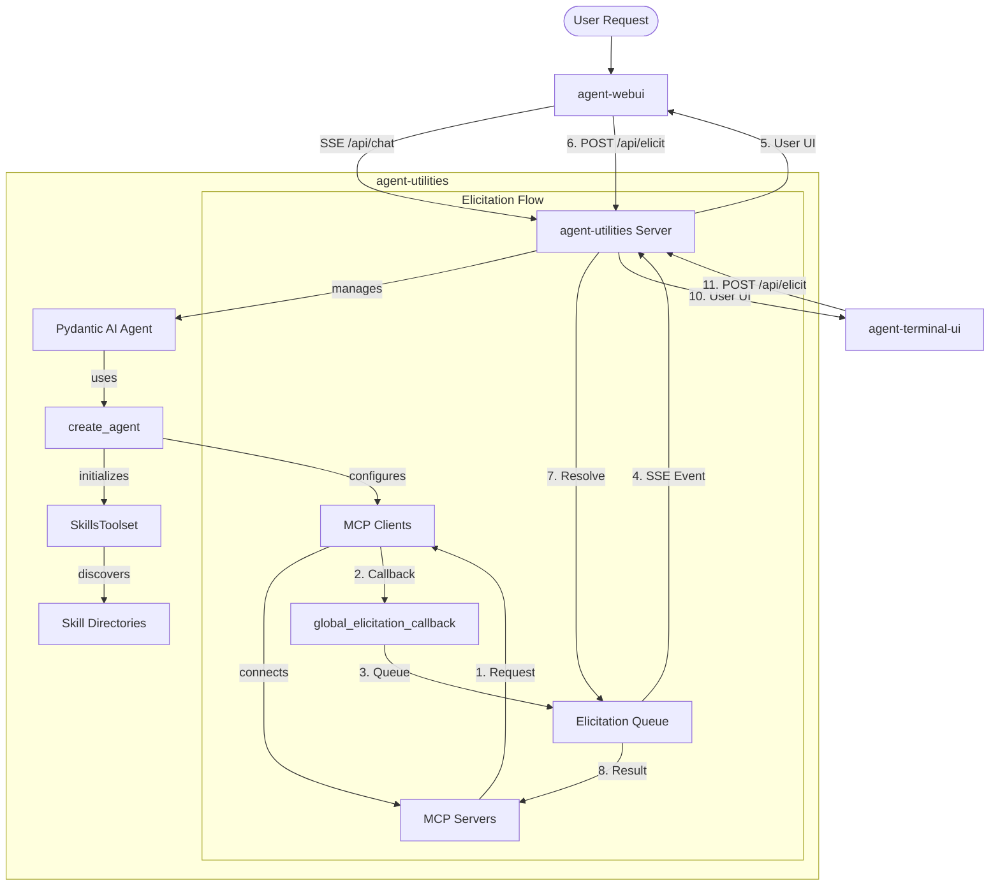

# AGENTS.md

## Tech Stack & Architecture
- **Language**: Python 3.10+
- **Core Framework**: [Pydantic AI](https://ai.pydantic.dev) & [Pydantic Graph](https://ai.pydantic.dev/pydantic-graph/)
- **Tooling**: `requests`, `pydantic`, `pyyaml`, `python-dotenv`, `fastapi`, `llama_index`
- **Architecture**: Centered around the `create_agent` factory, which has been modernized to support a **Unified Skill Loading** model (`skill_types`) and automated **Graph Orchestration**.
- **Specialist Discovery**: Automated discovery of domain specialist agents from `MCP_AGENTS.md` (local) and `A2A_AGENTS.md` (remote) registries, enabling dynamic graph expansion without hardcoded nodes.
- **Key Principles**:
    - Functional and modular utility design.
    - Standardized workspace management (`IDENTITY.md`, `MEMORY.md`).
    - **Elicitation First**: Robust support for structured user input during tool calls, bridging MCP and Web UIs.

## Package Relationships
`agent-utilities` is the core Python engine. It provides the backend server (`ag_ui_endpoint`) that serves both the `agent-webui` assets and the `agent-terminal-ui` client.
- **Backend (`agent-utilities`)**: Handles LLM orchestration, tool execution, and the SSE streaming protocol.
- **Web Frontend (`agent-webui`)**: A React application that provides a cinematic chat interface and specialized UI components.
- **Terminal Frontend (`agent-terminal-ui`)**: A Textual-based terminal interface for direct CLI interaction.
- **Communication**: Frontends talk to Backend via SSE for output and standard REST (POST) for input and elicitation responses.

## Core Architecture Diagram


## Graph Orchestration Architecture

```mermaid
  graph TB
  Start([User Query]) --> UsageGuard[Usage Guard: Rate Limiting]
  UsageGuard -- "Allow" --> router_step[Router: Topology Selection]
  UsageGuard -- "Block" --> End([End Result])

  router_step --> planner_step[Planner: Global Strategy]
  planner_step --> mem_step[Memory: Context Retrieval]
  mem_step --> dispatcher[Dispatcher: Dynamic Routing]

  subgraph "Discovery Phase"
    direction TB
    Researcher["<b>Researcher</b><br/>---<br/><i>u-skill:</i> web-search, web-crawler, web-fetch<br/><i>t-tool:</i> project_search, read_workspace_file"]
    Architect["<b>Architect</b><br/>---<br/><i>u-skill:</i> c4-architecture, product-management, product-strategy, user-research<br/><i>t-tool:</i> developer_tools"]
    A2ADiscovery["<b>A2A Discovery</b><br/>---<br/><i>source:</i> AGENTS.md<br/><i>t-tool:</i> fetch_agent_card"]
    res_joiner[Research Joiner: Barrier Sync]
  end

  dispatcher -- "Parallel Dispatch" --> Researcher
  dispatcher -- "Parallel Dispatch" --> Architect
  dispatcher -- "Parallel Dispatch" --> A2ADiscovery
  Researcher --> res_joiner
  Architect --> res_joiner
  A2ADiscovery --> res_joiner
  res_joiner -- "Coalesced Context" --> dispatcher

  subgraph "Execution Phase"
    direction TB

    subgraph "Programmers"
      direction LR
      PyP["<b>Python</b><br/>---<br/><i>u-skill:</i> agent-builder, tdd-methodology, mcp-builder, jupyter-notebook<br/><i>g-skill:</i> python-docs, fastapi-docs, pydantic-ai-docs<br/><i>t-tool:</i> developer_tools"]
      TSP["<b>TypeScript</b><br/>---<br/><i>u-skill:</i> react-development, web-artifacts, tdd-methodology, canvas-design<br/><i>g-skill:</i> nodejs-docs, react-docs, nextjs-docs, shadcn-docs<br/><i>t-tool:</i> developer_tools"]
      GoP["<b>Go</b><br/>---<br/><i>u-skill:</i> tdd-methodology<br/><i>g-skill:</i> go-docs<br/><i>t-tool:</i> developer_tools"]
      RustP["<b>Rust</b><br/>---<br/><i>u-skill:</i> tdd-methodology<br/><i>g-skill:</i> rust-docs<br/><i>t-tool:</i> developer_tools"]
      CP["<b>C/C++</b><br/>---<br/><i>t-tool:</i> developer_tools"]
      JSP["<b>JavaScript</b><br/>---<br/><i>u-skill:</i> web-artifacts, canvas-design<br/><i>g-skill:</i> nodejs-docs, react-docs<br/><i>t-tool:</i> developer_tools"]
    end

    subgraph "Infrastructure"
      direction LR
      DevOps["<b>DevOps</b><br/>---<br/><i>u-skill:</i> cloudflare-deploy<br/><i>g-skill:</i> docker-docs, terraform-docs<br/><i>t-tool:</i> developer_tools"]
      Cloud["<b>Cloud</b><br/>---<br/><i>u-skill:</i> c4-architecture<br/><i>g-skill:</i> aws-docs, azure-docs, gcp-docs<br/><i>t-tool:</i> developer_tools"]
      DBA["<b>Database</b><br/>---<br/><i>u-skill:</i> database-tools<br/><i>g-skill:</i> postgres-docs, mongodb-docs, redis-docs<br/><i>t-tool:</i> developer_tools"]
    end

    subgraph Specialized ["Specialized & Quality"]
      direction LR
      Sec["<b>Security</b><br/>---<br/><i>u-skill:</i> security-tools<br/><i>g-skill:</i> linux-docs<br/><i>t-tool:</i> developer_tools"]
      QA["<b>QA</b><br/>---<br/><i>u-skill:</i> qa-planning, tdd-methodology<br/><i>g-skill:</i> testing-library-docs<br/><i>t-tool:</i> developer_tools"]
      UIUX["<b>UI/UX</b><br/>---<br/><i>u-skill:</i> theme-factory, brand-guidelines, algorithmic-art<br/><i>g-skill:</i> shadcn-docs, tailwind-docs, framer-docs<br/><i>t-tool:</i> developer_tools"]
      Debug["<b>Debugger</b><br/>---<br/><i>u-skill:</i> developer-utilities, agent-builder<br/><i>t-tool:</i> developer_tools"]
    end

    subgraph Ecosystem ["Agent Ecosystem"]
      direction TB

      subgraph Infra_Management ["Infrastructure & DevOps"]
        AdGuardHome["<b>AdGuard Home Agent</b><br/>---<br/><i>mcp-tool:</i> adguard-mcp<br/><i>run:</i> python -m adguard_home_agent.mcp_server"]
        AnsibleTower["<b>Ansible Tower Agent</b><br/>---<br/><i>mcp-tool:</i> ansible-tower-mcp<br/><i>run:</i> python -m ansible_tower_mcp.mcp_server"]
        ContainerManager["<b>Container Manager Agent</b><br/>---<br/><i>mcp-tool:</i> container-mcp<br/><i>run:</i> python -m container_manager_mcp.mcp_server"]
        Microsoft["<b>Microsoft Agent</b><br/>---<br/><i>mcp-tool:</i> microsoft-mcp<br/><i>run:</i> python -m microsoft_agent.mcp_server"]
        Portainer["<b>Portainer Agent</b><br/>---<br/><i>mcp-tool:</i> portainer-mcp<br/><i>run:</i> python -m portainer_agent.mcp_server"]
        SystemsManager["<b>Systems Manager</b><br/>---<br/><i>mcp-tool:</i> systems-mcp<br/><i>run:</i> python -m systems_manager.mcp_server"]
        TunnelManager["<b>Tunnel Manager</b><br/>---<br/><i>mcp-tool:</i> tunnel-mcp<br/><i>run:</i> python -m tunnel_manager.mcp_server"]
        UptimeKuma["<b>Uptime Kuma Agent</b><br/>---<br/><i>mcp-tool:</i> uptime-mcp<br/><i>run:</i> python -m uptime_kuma_agent.mcp_server"]
        RepositoryManager["<b>Repository Manager</b><br/>---<br/><i>mcp-tool:</i> repository-mcp<br/><i>run:</i> python -m repository_manager.mcp_server"]
      end

      subgraph Media_HomeLab ["Media & Home Lab"]
        ArchiveBox["<b>ArchiveBox API</b><br/>---<br/><i>mcp-tool:</i> archivebox-mcp<br/><i>run:</i> python -m archivebox_api.mcp_server"]
        Arr["<b>Arr (Radarr/Sonarr)</b><br/>---<br/><i>mcp-tool:</i> arr-mcp<br/><i>run:</i> python -m arr_mcp.mcp_server"]
        AudioTranscriber["<b>Audio Transcriber</b><br/>---<br/><i>mcp-tool:</i> audio-transcriber-mcp<br/><i>run:</i> python -m audio_transcriber.mcp_server"]
        Jellyfin["<b>Jellyfin Agent</b><br/>---<br/><i>mcp-tool:</i> jellyfin-mcp<br/><i>run:</i> python -m jellyfin_mcp.mcp_server"]
        MediaDownloader["<b>Media Downloader</b><br/>---<br/><i>mcp-tool:</i> media-mcp<br/><i>run:</i> python -m media_downloader.mcp_server"]
        Owncast["<b>Owncast Agent</b><br/>---<br/><i>mcp-tool:</i> owncast-mcp<br/><i>run:</i> python -m owncast_agent.mcp_server"]
        qBittorrent["<b>qBittorrent Agent</b><br/>---<br/><i>mcp-tool:</i> qbittorrent-mcp<br/><i>run:</i> python -m qbittorrent_agent.mcp_server"]
      end

      subgraph Productive_Dev ["Productivity & Development"]
        Atlassian["<b>Atlassian Agent</b><br/>---<br/><i>mcp-tool:</i> atlassian-mcp<br/><i>run:</i> python -m atlassian_agent.mcp_server"]
        Genius["<b>Genius Agent</b><br/>---<br/><i>mcp-tool:</i> genius-mcp<br/><i>run:</i> python -m genius_agent.mcp_server"]
        GitHub["<b>GitHub Agent</b><br/>---<br/><i>mcp-tool:</i> github-mcp<br/><i>run:</i> python -m github_agent.mcp_server"]
        GitLab["<b>GitLab API</b><br/>---<br/><i>mcp-tool:</i> gitlab-mcp<br/><i>run:</i> python -m gitlab_api.mcp_server"]
        Langfuse["<b>Langfuse Agent</b><br/>---<br/><i>mcp-tool:</i> langfuse-mcp<br/><i>run:</i> python -m langfuse_agent.mcp_server"]
        LeanIX["<b>LeanIX Agent</b><br/>---<br/><i>mcp-tool:</i> leanix-mcp<br/><i>run:</i> python -m leanix_agent.mcp_server"]
        Plane["<b>Plane Agent</b><br/>---<br/><i>mcp-tool:</i> plane-mcp<br/><i>run:</i> python -m plane_agent.mcp_server"]
        Postiz["<b>Postiz Agent</b><br/>---<br/><i>mcp-tool:</i> postiz-mcp<br/><i>run:</i> python -m postiz_agent.mcp_server"]
        ServiceNow["<b>ServiceNow API</b><br/>---<br/><i>mcp-tool:</i> servicenow-mcp<br/><i>run:</i> python -m servicenow_api.mcp_server"]
        StirlingPDF["<b>StirlingPDF Agent</b><br/>---<br/><i>mcp-tool:</i> stirlingpdf-mcp<br/><i>run:</i> python -m stirlingpdf_agent.mcp_server"]
      end

      subgraph Data_Lifestyle ["Data & Lifestyle"]
        DocumentDB["<b>DocumentDB Agent</b><br/>---<br/><i>mcp-tool:</i> documentdb-mcp<br/><i>run:</i> python -m documentdb_mcp.mcp_server"]
        HomeAssistant["<b>Home Assistant Agent</b><br/>---<br/><i>mcp-tool:</i> home-assistant-mcp<br/><i>run:</i> python -m home_assistant_agent.mcp_server"]
        Mealie["<b>Mealie Agent</b><br/>---<br/><i>mcp-tool:</i> mealie-mcp<br/><i>run:</i> python -m mealie_mcp.mcp_server"]
        Nextcloud["<b>Nextcloud Agent</b><br/>---<br/><i>mcp-tool:</i> nextcloud-mcp<br/><i>run:</i> python -m nextcloud_agent.mcp_server"]
        Searxng["<b>Searxng Agent</b><br/>---<br/><i>mcp-tool:</i> searxng-mcp<br/><i>run:</i> python -m searxng_mcp.mcp_server"]
        Vector["<b>Vector Agent</b><br/>---<br/><i>mcp-tool:</i> vector-mcp<br/><i>run:</i> python -m vector_mcp.mcp_server"]
        Wger["<b>Wger Agent</b><br/>---<br/><i>mcp-tool:</i> wger-mcp<br/><i>run:</i> python -m wger_agent.mcp_server"]
      end
    end
  end

  dispatcher -- "Parallel Dispatch" --> Programmers
  dispatcher -- "Parallel Dispatch" --> Infrastructure
  dispatcher -- "Parallel Dispatch" --> Specialized
  dispatcher -- "Parallel Dispatch" --> Ecosystem

  Programmers --> exe_joiner[Execution Joiner: Barrier Sync]
  Infrastructure --> exe_joiner
  Specialized --> exe_joiner
  Ecosystem --> exe_joiner

  exe_joiner -- "Implementation Results" --> dispatcher

  dispatcher -- "Final Validation" --> verifier[Verifier: Quality Gate]
  verifier -- "Success" --> End
  verifier -- "Critical Fault" --> router_step
  dispatcher -- "Terminal Failure" --> End

  %% Styling
  style Researcher fill:#e1d5e7,stroke:#9673a6,stroke-width:2px
  style Architect fill:#e1d5e7,stroke:#9673a6,stroke-width:2px
  style A2ADiscovery fill:#e1d5e7,stroke:#9673a6,stroke-width:2px

  style Programmers fill:#dae8fe,stroke:#6c8ebf,stroke-width:2px
  style PyP fill:#dae8fe,stroke:#6c8ebf,stroke-width:1px
  style TSP fill:#dae8fe,stroke:#6c8ebf,stroke-width:1px
  style GoP fill:#dae8fe,stroke:#6c8ebf,stroke-width:1px
  style RustP fill:#dae8fe,stroke:#6c8ebf,stroke-width:1px
  style CP fill:#dae8fe,stroke:#6c8ebf,stroke-width:1px
  style JSP fill:#dae8fe,stroke:#6c8ebf,stroke-width:1px

  style Infrastructure fill:#fad9b8,stroke:#d6b656,stroke-width:2px
  style DevOps fill:#fad9b8,stroke:#d6b656,stroke-width:1px
  style Cloud fill:#fad9b8,stroke:#d6b656,stroke-width:1px
  style DBA fill:#fad9b8,stroke:#d6b656,stroke-width:1px

  style Specialized fill:#e0d3f5,stroke:#82b366,stroke-width:2px
  style Sec fill:#e0d3f5,stroke:#82b366,stroke-width:1px
  style QA fill:#e0d3f5,stroke:#82b366,stroke-width:1px
  style UIUX fill:#e0d3f5,stroke:#82b366,stroke-width:1px
  style Debug fill:#e0d3f5,stroke:#82b366,stroke-width:1px

  style Ecosystem fill:#f5f1d3,stroke:#d6b656,stroke-width:2px
  style Infra_Management fill:#fef9e7,stroke:#d6b656,stroke-width:1px
  style Media_HomeLab fill:#fef9e7,stroke:#d6b656,stroke-width:1px
  style Productive_Dev fill:#fef9e7,stroke:#d6b656,stroke-width:1px
  style Data_Lifestyle fill:#fef9e7,stroke:#d6b656,stroke-width:1px

  style verifier fill:#fff2cc,stroke:#d6b656,stroke-width:2px
  style End fill:#f8cecc,stroke:#b85450,stroke-width:2px
  style res_joiner fill:#f5f5f5,stroke:#666,stroke-dasharray: 5 5
  style exe_joiner fill:#f5f5f5,stroke:#666,stroke-dasharray: 5 5
  style dispatcher fill:#f5f5f5,stroke:#666,stroke-width:2px
  style Start color:#000000,fill:#38B6FF
	style subGraph0 color:#000000,fill:#f5ebd3
	style subGraph5 color:#000000,fill:#f5f1d3
	style dispatcher fill:#d5e8d4,stroke:#666,stroke-width:2px
  style Ecosystem fill:#f5d0ef,stroke:#d6b656,stroke-width:2px
  style LocalAgents fill:#f5d0ef,stroke:#d6b656,stroke-width:1px
	style RemotePeers fill:#f5d0ef,stroke:#d6b656,stroke-width:1px
```


## Commands (run these exactly)
# Development & Quality
ruff check --fix .
ruff format .
pytest

# Running a single test
# To run a specific test file:
#   pytest tests/test_example.py
# To run a specific test function in a file:
#   pytest tests/test_example.py::test_function_name
# To run tests matching a keyword:
#   pytest -k "keyword"

# Installation
pip install -e .      # Install in editable mode
pip install -e .[all] # Install with all optional extras

## Project Structure Quick Reference
- `agent_utilities/agent/` → Agent templates and `IDENTITY.md` definitions.
- `agent_utilities/agent_utilities.py` → Main entry point for `create_agent` and `create_agent_server`.
- `agent_utilities/agent_factory.py` → CLI factory for creating agents with argparse.
- `agent_utilities/mcp_utilities.py` → Utilities for FastMCP and MCP tool registration.
- `agent_utilities/base_utilities.py` → Generic helpers for file handling, type conversions, and CLI flags.
- `agent_utilities/tools.py` → Core "OS" tools for agents (read/write, search, list files).
- `agent_utilities/embedding_utilities.py` → Vector DB and embedding integration (LlamaIndex based).
- `agent_utilities/api_utilities.py` → Generic API helpers
- `agent_utilities/models.py` → Shared Pydantic models
- `agent_utilities/chat_persistence.py` → Chat history persistence utilities
- `agent_utilities/config.py` → Configuration management
- `agent_utilities/custom_observability.py` → Custom observability and tracing utilities
- `agent_utilities/decorators.py` → Utility decorators for caching, retries, etc.
- `agent_utilities/exceptions.py` → Custom exception classes
- `agent_utilities/graph_orchestration.py` → Graph-based agent orchestration with pydantic-graph
- `agent_utilities/model_factory.py` → Factory for creating LLM models
- `agent_utilities/memory.py` → Memory management for agents
- `agent_utilities/middlewares.py` → HTTP middleware utilities
- `agent_utilities/persistence.py` → General persistence utilities
- `agent_utilities/prompt_builder.py` → Prompt construction utilities
- `agent_utilities/scheduler.py` → Task scheduling utilities
- `agent_utilities/server.py` → HTTP server implementation
- `agent_utilities/tool_filtering.py` → Tool filtering utilities for tag-based access control
- `agent_utilities/tool_guard.py` → Universal tool guard implementation
- `agent_utilities/workspace.py` → Workspace management utilities
- `agent_utilities/a2a.py` → Agent-to-Agent communication utilities
- `agent_utilities/prompts/` → Prompt templates
- `agent_utilities/tools/` → Built-in agent tools
- `agent_utilities/agent_data/` → Workspace data files (IDENTITY.md, MEMORY.md, etc.)

## File Tree
```text
.
├── agent_utilities/
│   ├── agent/                 # Agent templates and definitions
│   ├── __init__.py            # Package exports
│   ├── __main__.py            # CLI entry point
│   ├── a2a.py                 # Agent-to-Agent communication
│   ├── agent_utilities.py     # Main entry point factory
│   ├── agent_factory.py       # CLI agent factory
│   ├── base_utilities.py      # Core shared helpers
│   ├── chat_persistence.py    # Chat history persistence
│   ├── config.py              # Configuration management
│   ├── custom_observability.py # Custom observability and tracing
│   ├── decorators.py          # Utility decorators
│   ├── embedding_utilities.py # Vector/Embedding utilities
│   ├── exceptions.py          # Custom exception classes
│   ├── graph_orchestration.py # Graph-based agent orchestration
│   ├── mcp_utilities.py       # MCP integration helpers
│   ├── memory.py              # Memory management
│   ├── middlewares.py         # HTTP middleware
│   ├── model_factory.py       # LLM model factory
│   ├── persistence.py         # General persistence utilities
│   ├── prompt_builder.py      # Prompt construction
│   ├── scheduler.py           # Task scheduling
│   ├── server.py              # HTTP server implementation
│   ├── tools.py               # Built-in agent tools
│   ├── tool_filtering.py      # Tool filtering utilities
│   ├── tool_guard.py          # Universal tool guard
│   ├── workspace.py           # Workspace management
│   ├── prompts/               # Prompt templates
│   └── tools/                 # Built-in agent tools
├── tests/
│   ├── test_graph_advanced.py
│   ├── test_graph_orchestration.py
│   ├── test_server.py
│   └── test_spawn_agent.py
├── pyproject.toml
└── README.md
```

## Code Style & Conventions

**Always:**
- Use the `try/except ImportError` guardrail pattern for optional dependencies.
- Use `agent_utilities.base_utilities.to_boolean` for parsing environment variables and CLI flags.
- Support `SSL_VERIFY` environment variable and `--insecure` CLI flag for all network operations.
- Prefer `pathlib.Path` for file path manipulations.

**Imports:**
- Standard library imports first, then third-party, then local application imports.
- Within each group, sort alphabetically.
- Avoid wildcard imports (`from module import *`).

**Formatting:**
- Maximum line length: 88 characters (as per Ruff/Black).
- Use 4 spaces per indentation level.
- No trailing whitespace.
- Use empty lines to separate functions and classes (2 blank lines before a class or function, 1 blank line between methods in a class).

**Types:**
- Use type hints for all function arguments and return values.
- Use `typing` module for complex types (List, Dict, Optional, etc.).
- Avoid using `Any` unless absolutely necessary.

**Naming Conventions:**
- Classes: CapWords (PascalCase).
- Functions and variables: snake_case.
- Constants: UPPER_SNAKE_CASE.
- Private functions and variables: single leading underscore (_snake_case).
- Private classes: single leading underscore (_CapWords) [though rare].

**Error Handling:**
- Catch specific exceptions, not bare `except:`.
- When raising exceptions, provide a clear error message.
- Use custom exception classes for module-specific errors.
- In general, prefer to raise exceptions and let the caller handle them, unless you can handle them locally.

**Good example (Guardrail):**
```python
try:
    from some_external_lib import feature
except ImportError:
    print("Error: Missing 'some_external_lib'. Please install with extras.")
    sys.exit(1)
```

## Dos and Don'ts
**Do:**
- Use `create_agent` for all new agent instances to ensure consistent workspace setup.
- Use `create_agent_factory` for CLI agent creation with argparse.
- Register tools with descriptive docstrings as they are parsed by the LLM.
- Keep `base_utilities` free of heavy dependencies.
- Utilize lazy imports for optional dependencies like FastAPI and LlamaIndex.
- Follow the existing patterns in each module when adding new functionality.

**Don't:**
- Import `fastapi` or `llama_index` at the top level (use lazy imports inside functions or classes).
- Hardcode file paths; use relative paths from the workspace root or environment variables.
- Modify global state unnecessarily; prefer functional approaches.

## Safety & Boundaries
**Always do:**
- Validate user-provided file paths to prevent traversal attacks.
- Run `ruff` and `pytest` before submitting PRs.
- Test error conditions and edge cases.

**Ask first:**
- Introducing new top-level dependencies.
- Changes to the `IDENTITY.md` or `MEMORY.md` management logic.
- Major architectural changes to the agent creation or graph orchestration systems.

**Never do:**
- Commit API keys or hardcoded secrets.
- Run tests that require external API access without proper mocks or environment configuration.
- Break backward compatibility without a strong justification.

## Universal Tool Guard (Global Safety)
By default, `agent-utilities` implements a **Universal Tool Guard** that automatically intercepts sensitive tool calls from MCP servers.

Any tool matching specific "danger" patterns (e.g., `delete_*`, `write_*`, `execute_*`, `drop_*`) will **automatically** trigger an elicitation request. The tool will not execute until you explicitly confirm it in the Web UI.

### Key Features
- **Zero Config**: Protections are applied automatically based on tool names.
- **Fail-Safe**: If elicitations aren't supported or fail, the sensitive tool is blocked by default.
- **Customizable**: You can disable the guard by setting `DISABLE_TOOL_GUARD=True` in your environment.

### Sensitive Patterns
The guard currently monitors for:
`delete`, `write`, `execute`, `rm_`, `rmdir`, `drop`, `truncate`, `update`, `patch`, `post`, `put`.

---

## How to use Elicitation
Elicitation is used when a tool requires additional structured input or confirmation from the user.

### In MCP Tools (FastMCP)
```python
from fastmcp import FastMCP, Context

mcp = FastMCP("MyServer")

@mcp.tool()
async def book_table(restaurant: str, ctx: Context) -> str:
    # Trigger elicitation for confirmation and additional details
    confirmation = await ctx.elicit(
        message=f"Please confirm booking for {restaurant}",
        schema={
            "type": "object",
            "properties": {
                "guests": {"type": "integer", "description": "Number of guests"},
                "time": {"type": "string", "description": "Time of booking"}
            },
            "required": ["guests", "time"]
        }
    )

    if confirmation.get("_action") == "cancel":
        return "Booking cancelled by user."

    return f"Booked for {confirmation['guests']} at {confirmation['time']}"
```

### Flow Details
1.  **Request**: Tool calls `ctx.elicit`.
2.  **Streaming**: Backend sends an `elicitation` event to `agent-webui`.
3.  **UI**: Component in `Part.tsx` renders a form.
4.  **Response**: User submits, backend resolves the `Future`, and the tool call resumes with the data.

## When Stuck
- Refer to `agent_utilities.py` for the implementation details of `create_agent`.
- Refer to `agent_factory.py` for CLI agent creation implementation.
- Review `mcp_utilities.py` for how tools are being registered and exposed to MCP.
- Review `graph_orchestration.py` for graph-based agent orchestration.
- Ask for clarification if the multi-agent supervisor logic is unclear.

## Pydantic AI VercelAIAdapter Integration Notes
When using `pydantic-ai` with the `VercelAIAdapter` (which handles `/api/chat` requests from the React frontend):
- The frontend (Vercel AI SDK) provides the **entire conversation history** in every payload.
- Pydantic AI's `UserPromptNode` logic assumes that if a `message_history` is provided, the conversation is simply being "resumed".
- As a result, Pydantic AI **skips** applying any static `system_prompt`s defined in `Agent.__init__` because it assumes the system prompt must have been added earlier in the history.
- The `agent-webui` React application does *not* explicitly pass the system message in its payload. Therefore, static system prompts get silently dropped during `/api/chat` inferences.
- **Solution:** Always use the dynamic `@agent.instructions` decorator for critical agent identity injection. Pydantic AI's graph evaluates dynamic instructions on *every* `ModelRequest` regardless of existing message history, ensuring the identity is always passed to the LLM.

## Agent Data Files
The `agent_utilities/agent_data/` directory contains important workspace files:
- `IDENTITY.md` - Defines the agent's identity, purpose, and behavior guidelines
- `MEMORY.md` - Persistent memory for the agent across sessions
- `USER.md` - Information about the current user
- `A2A_AGENTS.md` - Agent-to-Agent communication protocols
- `CRON.md` - Scheduled task definitions
- `CRON_LOG.md` - Execution logs for cron tasks
- `HEARTBEAT.md` - Agent health and status indicators

These files are automatically managed by the workspace system and should be referenced when building agents that need to maintain state or identity.

## Adding New Modules
When adding new utility modules to the agent_utilities package:
1. Follow the existing code style and conventions
2. Add appropriate type hints
3. Include comprehensive docstrings
4. Add unit tests in the tests/ directory
5. Export public functions/classes in `__init__.py` if they should be part of the public API
6. Consider if the module should have lazy imports for heavy dependencies
7. Follow the pattern of existing similar modules for consistency
8. Update this AGENTS.md file to document the new module's purpose

## Testing Guidelines
- Write tests for all new functionality
- Aim for high test coverage, especially for utility functions
- Use pytest fixtures for common test setup
- Mock external dependencies when possible
- Test both success and failure paths
- Follow the existing test patterns in the tests/ directory

## Documentation Standards
- All public functions and classes should have docstrings
- Docstrings should follow Google or NumPy style
- Complex algorithms should include explanatory comments
- Examples should be provided for non-trivial functions
- Keep documentation up-to-date when making changes

## Dependency Management
- Prefer to keep dependencies minimal
- For optional dependencies, use try/except ImportError patterns
- Document any new dependencies in pyproject.toml
- Consider if heavy dependencies should be lazy-loaded
- Follow semantic versioning for dependencies when possible

## Recent Changes
- Added `agent_factory.py` for CLI agent creation with argparse
- Updated `pyproject.toml` with new optional dependencies
- Enhanced MCP server connection handling with loopback guards
- Improved tool filtering and tag-based access control
- Added OpenTelemetry tracing support
- Enhanced workspace management with better path resolution
- Updated agent creation to support dynamic system prompts from workspace
- Improved error handling and logging throughout the codebase
