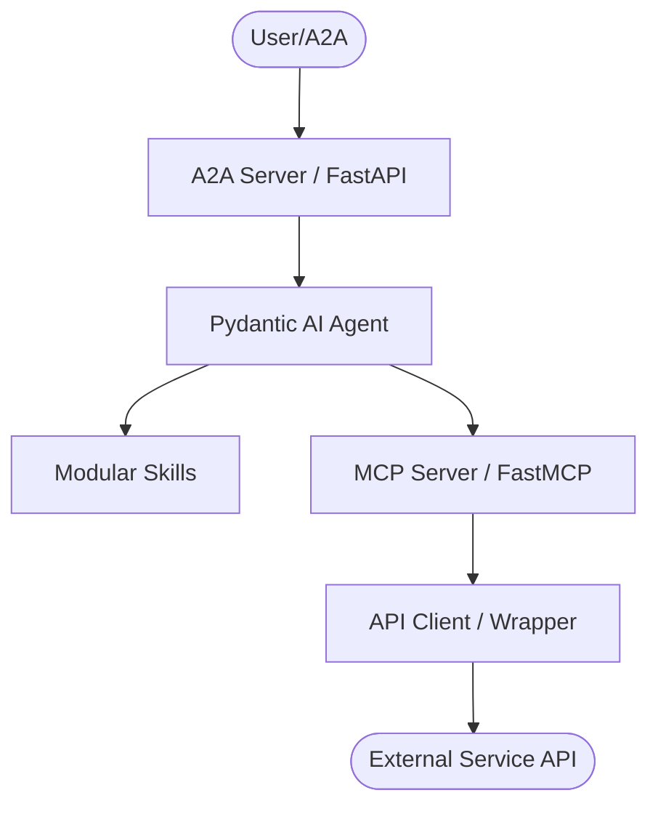
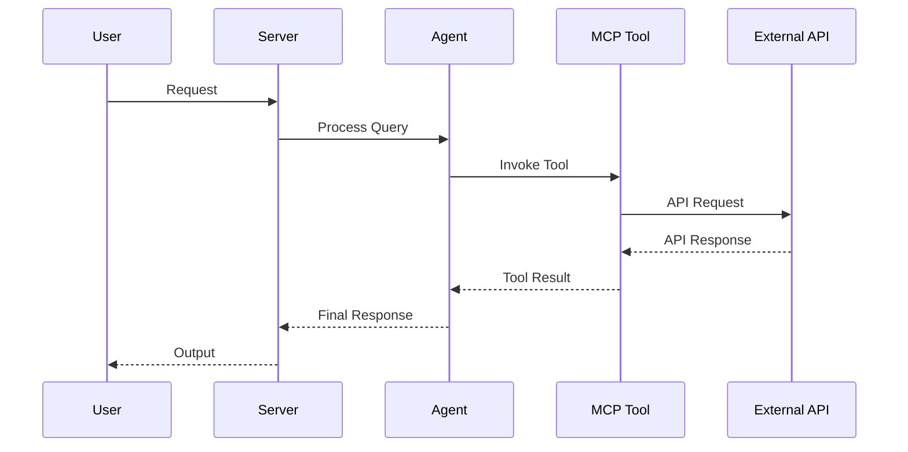

# AGENTS.md

## Tech Stack & Architecture
- Language/Version: Python 3.10+
- Core Libraries: `agent-utilities`, `fastmcp`, `pydantic-ai`
- Key principles: Functional patterns, Pydantic for data validation, asynchronous tool execution.
- Architecture:
    - `mcp_server.py`: Main MCP server entry point and tool registration.
    - `agent.py`: Pydantic AI agent definition and logic.
    - `skills/`: Directory containing modular agent skills (if applicable).
    - `agent/`: Internal agent logic and prompt templates.

### Architecture Diagram


### Workflow Diagram


## Commands (run these exactly)
# Installation
pip install .[all]

# Quality & Linting (run from project root)
pre-commit run --all-files

# Execution Commands
# agent-utilities-kg
agent_utilities.mcp.kg_server:main

## Project Structure Quick Reference
- MCP Entry Point → `mcp_server.py`
- Agent Entry Point → `agent.py`
- Source Code → `agent_utilities/`
- Skills → `skills/` (if exists)

### File Tree
```text
├── .acp-sessions
├── .bumpversion.cfg
├── .codespellignore
├── .env
├── .env.example
├── .gitattributes
├── .github
│   └── workflows
│       ├── concept-governance.yml
│       ├── pages.yml
│       └── pipeline.yml
├── .gitignore
├── .hypothesis
│   ├── .gitignore
│   ├── constants
│   │   ├── 0002191fe947f3e9
│   │   ├── 00192921479f16e4
│   │   ├── 001d10463f58df41
│   │   ├── 004e722d2b39195a
│   │   ├── 006b559781a41f7f
│   │   ├── 006db9bede6b0af5
│   │   ├── 0076862b86e5af6b
│   │   ├── 00c3d93858d73d12
│   │   ├── 00d073ef4b896ea5
│   │   ├── 01005e417f3b643c
│   │   ├── 010a2ccabf065868
│   │   ├── 01185a32d76f8148
│   │   ├── 012fab47096c94ea
│   │   ├── 0151e79485006582
│   │   ├── 0155df2536c15cb0
│   │   ├── 015cc7d675964cd1
│   │   ├── 01802cc4261ad611
│   │   ├── 01831d6f995783ed
│   │   ├── 018541b4fd3e09c0
│   │   ├── 0198191ad8360425
│   │   ├── 01aee0199437b243
│   │   ├── 01b5b91f7b091ade
│   │   ├── 01ec7d476fcf65f5
│   │   ├── 01f8bbabaa1552be
│   │   ├── 021a244166bfb8a1
│   │   ├── 0220a6e24fd589a6
│   │   ├── 02299a7b5c070b51
│   │   ├── 02361c7d2d1bf455
│   │   ├── 023c3b54759430fe
│   │   ├── 024bb16058ccd0f6
│   │   ├── 0259e149e6156894
│   │   ├── 028b1c73e72101a1
│   │   ├── 028d51fa43655bbb
│   │   ├── 02ae7008c02fd673
│   │   ├── 02b12d2d6a14a4f1
│   │   ├── 02f7c794c55faa36
│   │   ├── 02fd924c71b3afae
│   │   ├── 030adc670aa501f2
│   │   ├── 0318a1f0ef54561c
│   │   ├── 031b8c1b8ea8a34b
│   │   ├── 03378628ade90ce0
│   │   ├── 0358cd077e7a1d94
│   │   ├── 035c2aead6f561c9
│   │   ├── 03620697a47f5c81
│   │   ├── 037947aab47547c0
│   │   ├── 038a911bd43201c7
│   │   ├── 0396cebb23932a2e
│   │   ├── 039c39e8ac4a2275
│   │   ├── 03a0bc33c3be41ac
│   │   ├── 03ab1e6e6bb21915
│   │   ├── 03abbc119a742b89
│   │   ├── 03cabb343f7568ac
│   │   ├── 03ecab753e9cfb60
│   │   ├── 041044a5fb797cdf
│   │   ├── 04188d6793d39e0c
│   │   ├── 041b82baf95116f0
│   │   ├── 044aa4a97dd3204b
│   │   ├── 0470771c6f16453b
│   │   ├── 049647eca0251fa5
│   │   ├── 04d895af21e4e708
│   │   ├── 051278ef21d95efb
│   │   ├── 051c967728ffe6d6
│   │   ├── 05375f2abd58d56d
│   │   ├── 05397a7be2606862
│   │   ├── 053b93b66911eb7b
│   │   ├── 05436fe5b4986704
│   │   ├── 0570a7c52cd987f9
│   │   ├── 0588d4bd0750fc1e
│   │   ├── 05b04254974374a4
│   │   ├── 05c0230ebc9b80ba
│   │   ├── 05c043edc7560858
│   │   ├── 05c773d5dee3d2ac
│   │   ├── 05ccca93e65a9a2e
│   │   ├── 05f7658291d0b08e
│   │   ├── 06289ccea36e9c81
│   │   ├── 0628f2618034526e
│   │   ├── 062ddbc296e368f2
│   │   ├── 06c4fd33ccda233b
│   │   ├── 06ef7524a62d2ec3
│   │   ├── 06feae7d1f446d5b
│   │   ├── 070fd7dee16fc891
│   │   ├── 071a705608690431
│   │   ├── 0736e2d4acddd01a
│   │   ├── 0764d8227e773a3a
│   │   ├── 07839564ee868270
│   │   ├── 0797a2e758c7dfc5
│   │   ├── 079a27ef2ef145fa
│   │   ├── 07b6d5f385afd3e0
│   │   ├── 07ca69cf7d92c600
│   │   ├── 07d21a0986c9e187
│   │   ├── 07e63ca34029e6cc
│   │   ├── 07f11866f77631dc
│   │   ├── 08474bfd8289b41b
│   │   ├── 08483b7d6794bb72
│   │   ├── 086851c97a389ca0
│   │   ├── 08aac09452304bd3
│   │   ├── 08bc76ef477aec4c
│   │   ├── 08d3b57d161139c1
│   │   ├── 090bad511b1ddf93
│   │   ├── 0912a6649c9093cc
│   │   ├── 095e5585f7f2c707
│   │   ├── 09675daa1b32fe0c
│   │   ├── 098da80a076593da
│   │   ├── 099efc17e9deab49
│   │   ├── 09be4d7882477cf5
│   │   ├── 09bf3061312150cc
│   │   ├── 09c4cce0f373044f
│   │   ├── 09d9aba947a14b78
│   │   ├── 09fc6e4d3eb5825d
│   │   ├── 0a174ab092bdf149
│   │   ├── 0a28d54a691a9850
│   │   ├── 0a3476cce8efb627
│   │   ├── 0a53f4113028d774
│   │   ├── 0a7a822ba51e5294
│   │   ├── 0a8b823d3cd84a55
│   │   ├── 0abeb6a2eeaa494b
│   │   ├── 0ac541f35d92ee69
│   │   ├── 0ad329c8fb503d49
│   │   ├── 0ae5682d8cdc22e4
│   │   ├── 0aea4fee3e783979
│   │   ├── 0afc9aee7c33e2f3
│   │   ├── 0b17efc5d4ce2dcb
│   │   ├── 0b20ed40a9a9d8fb
│   │   ├── 0b242a4a768117e8
│   │   ├── 0b2f15ee3e53db45
│   │   ├── 0b39faedf7009118
│   │   ├── 0b78a7291ba5c70f
│   │   ├── 0bbf713aaf267494
│   │   ├── 0bd13cd080eaf4bb
│   │   ├── 0c1e5df19a835378
│   │   ├── 0c4930647bb0efdf
│   │   ├── 0c5c5e15615e3822
│   │   ├── 0c6a2657d4f36fb9
│   │   ├── 0c9054695019eb08
│   │   ├── 0ca4a5822f1e3250
│   │   ├── 0cae5f85a6a3c503
│   │   ├── 0cbc594cc71d4d29
│   │   ├── 0ceee24d18e2ee88
│   │   ├── 0cefde497d0b8056
│   │   ├── 0d069835202bfa5d
│   │   ├── 0d1880663dff96b8
│   │   ├── 0d192a0064e49ed4
│   │   ├── 0d2840639b71a13f
│   │   ├── 0d65a410db824952
│   │   ├── 0d81dd8c57144454
│   │   ├── 0dd1ff29d8cbe072
│   │   ├── 0ddad570eebb7fa2
│   │   ├── 0e2bfa30dc0b3fb2
│   │   ├── 0e311ad60e65e351
│   │   ├── 0e37161ce661e483
│   │   ├── 0e405e81767ab782
│   │   ├── 0e94732359ae3e52
│   │   ├── 0e9cd752f4214b36
│   │   ├── 0ec2bae09abd5d88
│   │   ├── 0ecfea4e8bc83e2e
│   │   ├── 0edac1bc029575f5
│   │   ├── 0eddf8f31d8ea443
│   │   ├── 0ef97519e00a903b
│   │   ├── 0efd39a9b07814e6
│   │   ├── 0f00997050228a3d
│   │   ├── 0f2f514cae182901
│   │   ├── 0f3acba2ec85a713
│   │   ├── 0f628f34057c1c70
│   │   ├── 0f79916b192aa7d6
│   │   ├── 0f7a86578e666205
│   │   ├── 0f9b7f50ebf249d2
│   │   ├── 0fa54c6cdc396adb
│   │   ├── 0fae99c6092b66a1
│   │   ├── 0fc9a11759b0e8dc
│   │   ├── 0fd008637f4d3419
│   │   ├── 0fd6b82d7f0ba8b1
│   │   ├── 0ffe71ab918ef218
│   │   ├── 1006a9256420c9b8
│   │   ├── 1007f6d8f360ff03
│   │   ├── 1047b92fa7d8b919
│   │   ├── 1057ba0fdac72477
│   │   ├── 106d337d971fda8e
│   │   ├── 10700d3011ef15f4
│   │   ├── 107ad4dffbdf9ae5
│   │   ├── 108836c27b5f51b2
│   │   ├── 108bae7ab1cb4b1f
│   │   ├── 10fe2fb9a71937d5
│   │   ├── 110a1d1d892c7388
│   │   ├── 110acd6d0212458c
│   │   ├── 1118331ec8b552a9
│   │   ├── 114d307ff0cba1ca
│   │   ├── 117ee83657cfb10f
│   │   ├── 11982919b0350d8a
│   │   ├── 11a4fb9bf042a054
│   │   ├── 11b2bff1a3b3730b
│   │   ├── 122b0f64dfba73b4
│   │   ├── 12551c019fbc9d12
│   │   ├── 12a047986411a8a4
│   │   ├── 12a8be3033056a28
│   │   ├── 12b1dcf77a48a3eb
│   │   ├── 12e499e889b8145b
│   │   ├── 12e7e479072c853b
│   │   ├── 12f935788d06b745
│   │   ├── 12ff0ed8c4115fbf
│   │   ├── 13084c1c1c6b75a1
│   │   ├── 134c5f26c274dffa
│   │   ├── 13b6ec42c7db497d
│   │   ├── 13ef1f90ca4c5389
│   │   ├── 13efa0910df75e7a
│   │   ├── 14474eb951b51672
│   │   ├── 146ce438f76c65d3
│   │   ├── 146ed4bd6bb466d5
│   │   ├── 14742718f2a4f9e6
│   │   ├── 149ef8974f8744ac
│   │   ├── 14b7fc72c89a5674
│   │   ├── 14fdab6586761512
│   │   ├── 155fe8b661053459
│   │   ├── 15647f5536a392c4
│   │   ├── 15ef0c3589572c80
│   │   ├── 15f35ba2e56b7651
│   │   ├── 160027a7214e10d1
│   │   ├── 161b294a3552536a
│   │   ├── 161b8e1ee81d034f
│   │   ├── 16283ae38402ec2d
│   │   ├── 163fcc5f4e7ee0ef
│   │   ├── 164032534ea3bc6e
│   │   ├── 1641dce054dc9303
│   │   ├── 166c5f455b7f05ad
│   │   ├── 1688f6cc842b3ff1
│   │   ├── 16e227b888eb1d6b
│   │   ├── 1711dca7bbb78b0f
│   │   ├── 1738d080943a02af
│   │   ├── 17677dce9b748b9f
│   │   ├── 178aecef11e8b849
│   │   ├── 17c9a0e9fb774cb0
│   │   ├── 17e3f8cea4119fc7
│   │   ├── 180ec65c5537576c
│   │   ├── 182adc249c6945e6
│   │   ├── 182edc8036c77a06
│   │   ├── 1838c6d5ce295bcb
│   │   ├── 185cd212b3dcf9dd
│   │   ├── 18681151d3c9f582
│   │   ├── 1877575d1a8064ca
│   │   ├── 1881610677106d39
│   │   ├── 18ad4b80f7a8903e
│   │   ├── 18b35968022c092a
│   │   ├── 18e118ab5f17fc77
│   │   ├── 18f1405f4b23c9c6
│   │   ├── 18ffca781922a86e
│   │   ├── 190ea4cf0c364aed
│   │   ├── 193028e70313a5fd
│   │   ├── 193d502c7883d0dd
│   │   ├── 195f725243c7fdd3
│   │   ├── 198152a2723c1c6f
│   │   ├── 199b324f8fdea4d9
│   │   ├── 19f8752e942959d1
│   │   ├── 19ffe9f8925eaa8f
│   │   ├── 1a05e8f7aaaa5bf9
│   │   ├── 1a0ed8ebcff165b9
│   │   ├── 1a41ae86289b3f68
│   │   ├── 1a51c14370129ae1
│   │   ├── 1a5326b88fdd03ad
│   │   ├── 1a74069d6f6a53ef
│   │   ├── 1a742f41f70ea774
│   │   ├── 1a8a29aa5cac31dc
│   │   ├── 1aab22a2f53fa980
│   │   ├── 1ab69f255ef442e7
│   │   ├── 1ad6f7b9dcfcbe39
│   │   ├── 1ae048294ffca6c0
│   │   ├── 1ae869ece86937e7
│   │   ├── 1afa345e67c21883
│   │   ├── 1b03f42066d45ce5
│   │   ├── 1b49affbb67a6773
│   │   ├── 1b5ab75bf753dacb
│   │   ├── 1b72fd4c17eb1080
│   │   ├── 1b7432ddb6b6dfe9
│   │   ├── 1ba25af4b5e9821e
│   │   ├── 1ba37bcaf2396cd1
│   │   ├── 1bb7b5486210edb0
│   │   ├── 1bc03d9210a0250f
│   │   ├── 1bcfc7257df97d11
│   │   ├── 1be1f27e6b2b23f7
│   │   ├── 1c07f726b47e3db3
│   │   ├── 1c111992e9d0c63a
│   │   ├── 1c261c8508e39aa5
│   │   ├── 1c36b3e629a0f04f
│   │   ├── 1c6e5e5c624635e5
│   │   ├── 1ca06e95570da972
│   │   ├── 1ca7b2f9a96750ba
│   │   ├── 1cb7a7e70d3c10d9
│   │   ├── 1ccd361adbc6e578
│   │   ├── 1cce0c53a0aa1633
│   │   ├── 1cf53a3a7c278921
│   │   ├── 1cf6c5cdd359b01a
│   │   ├── 1d0180100181c4ea
│   │   ├── 1d13ed074a825136
│   │   ├── 1d33b5236929c4dd
│   │   ├── 1d5248e67f38fa39
│   │   ├── 1d58d64e4130408d
│   │   ├── 1d83a9052f744fe7
│   │   ├── 1d8a770762618392
│   │   ├── 1d96cf9d881b5d4e
│   │   ├── 1da37b62784b8769
│   │   ├── 1da42ec9990dcf90
│   │   ├── 1daeb6ed4186140b
│   │   ├── 1dbecd008a2ef9d5
│   │   ├── 1dc359315dc82348
│   │   ├── 1dc772a0c7332f7d
│   │   ├── 1de0fc5c8055ef41
│   │   ├── 1e056eb4f8771c2b
│   │   ├── 1e33a0b6d8189362
│   │   ├── 1e37939b54e87158
│   │   ├── 1e3bcfc227f999e6
│   │   ├── 1e440fd435cb5520
│   │   ├── 1e5742cdf1a0cdaa
│   │   ├── 1e83108180781e49
│   │   ├── 1e88173ca224bca3
│   │   ├── 1f179fced48fd2d4
│   │   ├── 1f1b07b59a233d84
│   │   ├── 1f1ebc571a4af9b7
│   │   ├── 1f28e549f1c5db4e
│   │   ├── 1f3c020458cedb1d
│   │   ├── 1f43641ce5c87190
│   │   ├── 1f4a6f584caf17bf
│   │   ├── 1f4a6faa1844f4d8
│   │   ├── 1f6146c77d62c90e
│   │   ├── 1fcb47e51ee25002
│   │   ├── 1fd680c12eb59087
│   │   ├── 1fdb3c95bc3eecc1
│   │   ├── 1ff82dc6c6014893
│   │   ├── 20099f9438c32339
│   │   ├── 200fcd4277b4863f
│   │   ├── 20200e8c84b22312
│   │   ├── 203e53cb09817f72
│   │   ├── 203fb7b9fcce6655
│   │   ├── 206190513c31cfdf
│   │   ├── 2076439c97f6289f
│   │   ├── 20917c6e4ede83c5
│   │   ├── 209200518c25038b
│   │   ├── 209cdd8d743b0cf7
│   │   ├── 20c9f607c67a2dee
│   │   ├── 20f1ac5c7ec99cf7
│   │   ├── 212b901ce156a381
│   │   ├── 2194a2f35a7c51db
│   │   ├── 21a0f475c5352c06
│   │   ├── 21add1639cb4110f
│   │   ├── 21b2521ab8be3f4c
│   │   ├── 21cf68b0c3fa33aa
│   │   ├── 21d3cd5c095dd9b6
│   │   ├── 21df65500a3aa918
│   │   ├── 21ee05cd8b73be1f
│   │   ├── 221a9a4285dd6e56
│   │   ├── 221ce6dde78196a1
│   │   ├── 2222838cd9c407c2
│   │   ├── 2235807621d8b725
│   │   ├── 2254aa288627d69b
│   │   ├── 2259282db7510c77
│   │   ├── 22598c6df2ebcac9
│   │   ├── 2262032e03827602
│   │   ├── 226a1eb8c4f2fb16
│   │   ├── 228504fa1ce180e8
│   │   ├── 228de7e041d1d140
│   │   ├── 2299957f9c1ddb23
│   │   ├── 22aa8e3f1ba3b192
│   │   ├── 22abf6058e5a6c79
│   │   ├── 22c5e9a7a6335dd0
│   │   ├── 22cc34a1c5c4fbc2
│   │   ├── 22d2f15496f2cb7d
│   │   ├── 22f1777c97dcda4e
│   │   ├── 23309ddfd10dabc5
│   │   ├── 233b31ae92c6f6d3
│   │   ├── 234595c7cc133af4
│   │   ├── 234ed90fd76b8189
│   │   ├── 235982f9fc4dde8e
│   │   ├── 239fd1a5cfe42671
│   │   ├── 23a484697acc20b3
│   │   ├── 23a80b92680dde6c
│   │   ├── 23acecdc80cef6ca
│   │   ├── 23b0831286f80613
│   │   ├── 23d82aa4fd104dbb
│   │   ├── 23de3c8efc283fa6
│   │   ├── 23e116313e1f3403
│   │   ├── 2438213548c974ab
│   │   ├── 2445136b545b55ae
│   │   ├── 24843e8974d0e2ef
│   │   ├── 24ba4d0b5925bda6
│   │   ├── 24c793e2b60498a5
│   │   ├── 24fc5ae58208a25f
│   │   ├── 250532d1210c012b
│   │   ├── 253969e2f0de6d82
│   │   ├── 254e86af412dd705
│   │   ├── 25561746bff596cb
│   │   ├── 25576b4748174837
│   │   ├── 25621960a3f7b6c9
│   │   ├── 258111d5664da2c6
│   │   ├── 25878421010898fc
│   │   ├── 2588add9e0f3cd5b
│   │   ├── 2595259db820e348
│   │   ├── 25c39a7824a8047f
│   │   ├── 25c99375821e6f2b
│   │   ├── 2602f30f1d89df4b
│   │   ├── 261f5e37ccce60ca
│   │   ├── 262cb49c601af00c
│   │   ├── 2638a3b8d03b37ca
│   │   ├── 264272423b1c1aa2
│   │   ├── 26584c6ae6c503eb
│   │   ├── 265df8189e955357
│   │   ├── 267416c8f66c5ac9
│   │   ├── 26a9143d463e73a6
│   │   ├── 26a964efc0f6afcd
│   │   ├── 26bf91fae83ce50a
│   │   ├── 26d7004517da12eb
│   │   ├── 26d9abea78d694c9
│   │   ├── 26e31ea1f7228903
│   │   ├── 2705310ed1b398dd
│   │   ├── 271ce4f808bae7d3
│   │   ├── 272f558635afe78c
│   │   ├── 274560ebd3c4c3a5
│   │   ├── 27461a4560763b04
│   │   ├── 276f4f892c1e3813
│   │   ├── 27b6b643df5b093f
│   │   ├── 27d0063c5959a6f1
│   │   ├── 27e917a20c48f719
│   │   ├── 27f2d2b512fe2894
│   │   ├── 28000e7c8d2768aa
│   │   ├── 282a165e06e35bd0
│   │   ├── 285021715af83876
│   │   ├── 28510cb4d483533a
│   │   ├── 285b7a8c218fdace
│   │   ├── 287a835d33c9d40e
│   │   ├── 287b4236fd2bbb34
│   │   ├── 28efcc97e8e07d31
│   │   ├── 28f3118d3f142ee7
│   │   ├── 28f894b3cbb45974
│   │   ├── 28fd4b3055845125
│   │   ├── 291814e0a3650c09
│   │   ├── 29429b73526b89d0
│   │   ├── 295d50d41334ead5
│   │   ├── 297810a30b863c36
│   │   ├── 29a9c5e82371a2c7
│   │   ├── 29d6fecb92b59fe5
│   │   ├── 2a09b25dbce606ce
│   │   ├── 2a7cbcdb79e4bb62
│   │   ├── 2a9a1dd555ee10ef
│   │   ├── 2a9b5df3987b85ea
│   │   ├── 2aa0c85891f84cec
│   │   ├── 2ac09820518ca761
│   │   ├── 2add8a2f04b8acba
│   │   ├── 2aecbd0f616c54d4
│   │   ├── 2af2992163b4653e
│   │   ├── 2b10201a47d3f716
│   │   ├── 2b1b5b51893fe31f
│   │   ├── 2b3c2cf8e4c67d23
│   │   ├── 2b4053d5a68d64e3
│   │   ├── 2b48fb1c3748a465
│   │   ├── 2b55218a5bad11b4
│   │   ├── 2b80f9b0d42b1172
│   │   ├── 2b8fb647a13cbb41
│   │   ├── 2bb698d60dab0873
│   │   ├── 2bbfc17a56728536
│   │   ├── 2bc54c8bbba52262
│   │   ├── 2beec4a1e1dab170
│   │   ├── 2c6e166c0fc7357f
│   │   ├── 2ca2d3a8af61df4d
│   │   ├── 2cab239a6908e45c
│   │   ├── 2cfa46a794efe400
│   │   ├── 2d35817820359767
│   │   ├── 2d3f795d10960f31
│   │   ├── 2d43e7d450a47047
│   │   ├── 2d5a251cacb4f8f3
│   │   ├── 2d83bc8194766190
│   │   ├── 2dc6694b9171e456
│   │   ├── 2dd9cf4e8dccd3a2
│   │   ├── 2de857fa00aa849d
│   │   ├── 2ded494159ef185d
│   │   ├── 2e247fa2d4fea4a9
│   │   ├── 2e90e9b833b51a7e
│   │   ├── 2eb08ec72c63219c
│   │   ├── 2ed750077a72af7d
│   │   ├── 2ef532654c22c20e
│   │   ├── 2ef87d6e869a97a5
│   │   ├── 2f18803aede0b5e2
│   │   ├── 2f22423dac2730aa
│   │   ├── 2f2997e7f76aea29
│   │   ├── 2f2b67ed264540fb
│   │   ├── 2f49888d399714a6
│   │   ├── 2f87768233f868ed
│   │   ├── 2f8f2e124e0e0ac9
│   │   ├── 2f92761e50ff6888
│   │   ├── 2facd87e3bb310ad
│   │   ├── 2fc98bf2915decc5
│   │   ├── 2fd4adddec046bc5
│   │   ├── 2fda912527187aee
│   │   ├── 2fe3cad274efc46b
│   │   ├── 2fe93b0d8f1d1664
│   │   ├── 30102b8fde4175e9
│   │   ├── 302bb26b3646cb68
│   │   ├── 3030546391e18d95
│   │   ├── 3052425bc70b9139
│   │   ├── 30c8dbab26143050
│   │   ├── 30d8f64c874b5465
│   │   ├── 30e241fbb864aebf
│   │   ├── 30ef0a2658953185
│   │   ├── 3113d8dff1567f56
│   │   ├── 3120f0c071e03d19
│   │   ├── 317d4461a4c8f165
│   │   ├── 318e12dd096cbb00
│   │   ├── 318e49316e8acaa6
│   │   ├── 31a43c60a703dbb2
│   │   ├── 31b75b3105d4ad01
│   │   ├── 31e5579519ba1afd
│   │   ├── 322ce32a43b18070
│   │   ├── 324ad1005864f7cc
│   │   ├── 327e22e492468729
│   │   ├── 32b5fc4d1e6e4a76
│   │   ├── 32c3834f51ca5c57
│   │   ├── 32c676ce1ea10f2e
│   │   ├── 331221b63daaa18e
│   │   ├── 3323a7a4fc3563bb
│   │   ├── 3326fed6e38c846a
│   │   ├── 332fd43f81c2591b
│   │   ├── 336fea62c30e602a
│   │   ├── 3383974f8e65f41f
│   │   ├── 33aa8aa6e118ff82
│   │   ├── 33b7d4737d392d9c
│   │   ├── 33bcb10b120b1d6b
│   │   ├── 33c803c94828b6f5
│   │   ├── 33d409d537a659ce
│   │   ├── 33f17842660e6513
│   │   ├── 3416c60edc3584eb
│   │   ├── 341e5676a8e380e0
│   │   ├── 344d3308a783edca
│   │   ├── 344e829647b19b95
│   │   ├── 346562992fe2ac80
│   │   ├── 34a9bc0c6a5bc3b7
│   │   ├── 34b47699a27f4abf
│   │   ├── 34c69119c6b0450a
│   │   ├── 34ccd68bcc5de616
│   │   ├── 34d63836b9a7f862
│   │   ├── 34e5f9834b914ca2
│   │   ├── 34edf01da44ff281
│   │   ├── 34ff9e4187e888c2
│   │   ├── 350798b0c2867894
│   │   ├── 352f9ee2bf112041
│   │   ├── 3550d503444d37bc
│   │   ├── 35790a5880294b90
│   │   ├── 358b51fe9198719e
│   │   ├── 358fea19f2eb7470
│   │   ├── 35d104b403287133
│   │   ├── 3604f845a386d26f
│   │   ├── 360582ed3f061912
│   │   ├── 3619af07a50e87cb
│   │   ├── 361a7fb4ba570eab
│   │   ├── 364b07ac4632973c
│   │   ├── 364e9bb83bae87ba
│   │   ├── 3651ab95f6e37756
│   │   ├── 365f9f9b481f2091
│   │   ├── 366d591146cdda64
│   │   ├── 3680fc2fe8388e77
│   │   ├── 3684c39038680cfc
│   │   ├── 368f19d2cc26015d
│   │   ├── 36bd4c8e36667fa2
│   │   ├── 36be678ae556b636
│   │   ├── 36c0941647eccb51
│   │   ├── 36d191c7f3d36cfa
│   │   ├── 36db937b13a4ff1d
│   │   ├── 36fd256b7485a2aa
│   │   ├── 37260416592437d5
│   │   ├── 372ae7d00561b2ec
│   │   ├── 37320fbd8a7a1f1d
│   │   ├── 3747257b481bc6e4
│   │   ├── 37597e3c7428bf07
│   │   ├── 37792ce495db97f0
│   │   ├── 37a2615b91171583
│   │   ├── 37a290928d585660
│   │   ├── 37d9f4e3691dae8e
│   │   ├── 380bf48e7cba7dfb
│   │   ├── 383619be662d766e
│   │   ├── 385fbf93113f5472
│   │   ├── 38dda355e2c73911
│   │   ├── 38eec420bb176a00
│   │   ├── 391d41d56bbfdaf3
│   │   ├── 392405de9404600e
│   │   ├── 39279f09f71b1b04
│   │   ├── 3954456fa033d75c
│   │   ├── 396d2230d464a6d2
│   │   ├── 39de7fe4e46f5fca
│   │   ├── 39f03c37f25ff8e9
│   │   ├── 39fb58aeafe23f4e
│   │   ├── 3a0f60c93ac0687f
│   │   ├── 3a2eb499a5815ad3
│   │   ├── 3a3420163ae70a46
│   │   ├── 3a6f93151669e766
│   │   ├── 3a743c7455373446
│   │   ├── 3a87d5b2ec34e379
│   │   ├── 3a8afc0df9576cba
│   │   ├── 3a8da3ac478a5e1c
│   │   ├── 3a90d0941c98a658
│   │   ├── 3aabae308fd24c12
│   │   ├── 3ab4d559665c86a6
│   │   ├── 3ab56cd8f2e45b1c
│   │   ├── 3acd1c25d1b0eaa1
│   │   ├── 3ae9951acbd27e75
│   │   ├── 3af66abca0ca7352
│   │   ├── 3b108b8fa0bda709
│   │   ├── 3b1bd88444cba10c
│   │   ├── 3b1f4148495797fe
│   │   ├── 3b3b8ac310a31b75
│   │   ├── 3b40e48512643e7e
│   │   ├── 3b42cf21bf756099
│   │   ├── 3b52c5d7a1797335
│   │   ├── 3b5358a5c15f4612
│   │   ├── 3b5784f6822e2ee5
│   │   ├── 3b76f4d39608476f
│   │   ├── 3bc5a2a617f4a19d
│   │   ├── 3bdb264ad0fe0418
│   │   ├── 3be5f5b9aea854d1
│   │   ├── 3bed5b14015a0770
│   │   ├── 3c03062b2fbf5f1e
│   │   ├── 3c110a86da783e4b
│   │   ├── 3c15ed29fe459b19
│   │   ├── 3c18ff26f55f10ed
│   │   ├── 3c681235e3dbda61
│   │   ├── 3c85b9f4e3f4ddd3
│   │   ├── 3c8f06a4a77f4496
│   │   ├── 3c96093ca102e6bf
│   │   ├── 3ca8d2ca37177f4c
│   │   ├── 3ca9e7119be5847b
│   │   ├── 3cb27f7719a4a370
│   │   ├── 3cec513875fec3ec
│   │   ├── 3cef3905608d87fc
│   │   ├── 3cf1bd7dce21c4f7
│   │   ├── 3d22539ae35a545a
│   │   ├── 3d3c4ffb1cdd9927
│   │   ├── 3d6697f35d2242be
│   │   ├── 3d81b2572ba6ceee
│   │   ├── 3d976b82e12fef50
│   │   ├── 3dab7e01a35615e3
│   │   ├── 3db0d09a2f06c3d8
│   │   ├── 3dbad6f2d16d992c
│   │   ├── 3dce634e59a729bc
│   │   ├── 3de1ca6491176637
│   │   ├── 3de1ef84f55f41fc
│   │   ├── 3ded5b92e5fbca8f
│   │   ├── 3e0de2068e4b0cdf
│   │   ├── 3e12f59289adedc5
│   │   ├── 3e1317de2c2c0580
│   │   ├── 3e332aee25280d29
│   │   ├── 3e3d2a1cb9199edb
│   │   ├── 3e48d9212a9db53e
│   │   ├── 3e6cbe6c1cb71d09
│   │   ├── 3e86ee1b676c064a
│   │   ├── 3eb0e8f86e3e33f3
│   │   ├── 3eb189d91a99aa86
│   │   ├── 3edf3c00ad2befdf
│   │   ├── 3eee869209c6ba85
│   │   ├── 3ef30340606b6926
│   │   ├── 3f0d5e4c69cddad2
│   │   ├── 3f445f238b189b2a
│   │   ├── 3f63fdd3e9b6b37f
│   │   ├── 3f6a293feb140529
│   │   ├── 3f6f108167c6286d
│   │   ├── 3f7214b231ff565f
│   │   ├── 3fb3cf1e005153c0
│   │   ├── 3fb619ba82fdde36
│   │   ├── 3fb7956f55d6bbd3
│   │   ├── 3fbaf2a3e7e28497
│   │   ├── 3fbec68e100acd4b
│   │   ├── 3fe488738eda6bdf
│   │   ├── 3ff5c906096788a9
│   │   ├── 40505ef90915a75d
│   │   ├── 406cff6d4765451d
│   │   ├── 4091f459025cff35
│   │   ├── 40a5e52804be7120
│   │   ├── 40b43d8598049e24
│   │   ├── 40b89048086dd9fd
│   │   ├── 40cffe9c40772be7
│   │   ├── 40de05efcce3c7bc
│   │   ├── 40e00885b8616926
│   │   ├── 40e33378ff20bee6
│   │   ├── 4110688db101494c
│   │   ├── 4111967a236ef901
│   │   ├── 4111b2efde69f6a5
│   │   ├── 41162c9943db9a1d
│   │   ├── 417d03e8e71c22c1
│   │   ├── 41958e04217b03e5
│   │   ├── 41959412cedbc5fa
│   │   ├── 419752fa72aaa593
│   │   ├── 41f3b9f05f2eeac6
│   │   ├── 41fd000fa88a3b2f
│   │   ├── 4213c3d9878cb448
│   │   ├── 4220c6d1a92472bd
│   │   ├── 422e7a471e32b096
│   │   ├── 4253a8250e1229b8
│   │   ├── 4254eccddff89083
│   │   ├── 4278f190bcfc8e7d
│   │   ├── 428c33f18aab47e4
│   │   ├── 42a6c0db6ff1bbf7
│   │   ├── 42cb23607beacf6c
│   │   ├── 42f368fe1565ab96
│   │   ├── 4306941edc1e691d
│   │   ├── 434f18aa4c1867c0
│   │   ├── 436bb6f5941ff0e6
│   │   ├── 43727c081a706fdf
│   │   ├── 43a12c56b1d568bc
│   │   ├── 43b3b2e91b422de4
│   │   ├── 43ccd078892abcef
│   │   ├── 43cec79d6bf91ff3
│   │   ├── 43ffd06f41e5e04f
│   │   ├── 443496a8becb18a0
│   │   ├── 44382101d2edc54f
│   │   ├── 4440598d23e6ea70
│   │   ├── 4443e6f53aef1f79
│   │   ├── 4457d15cbe01be95
│   │   ├── 445f96cb65ef85d5
│   │   ├── 448151da00ea5823
│   │   ├── 44971ea411745967
│   │   ├── 44a275ce4e697732
│   │   ├── 44b6e1c94304b2f6
│   │   ├── 44ffa6e05a09eea0
│   │   ├── 452075f323b16f65
│   │   ├── 45243cfd9507f389
│   │   ├── 452c472c9594aa75
│   │   ├── 4536215db8f0b2e7
│   │   ├── 45626c1003ae42c7
│   │   ├── 45b2543383ec0f00
│   │   ├── 45c57bff94a461d0
│   │   ├── 45d6c8d6ee8f67da
│   │   ├── 45fd6b07c83bbb6f
│   │   ├── 4608f3c58fee04d7
│   │   ├── 460e566d21dd081d
│   │   ├── 462cb1a8bc9e84be
│   │   ├── 462da3a0717da39d
│   │   ├── 46550f5d0eea4f75
│   │   ├── 466e4393771949bb
│   │   ├── 469aec1a70316d38
│   │   ├── 46eed06824edcb02
│   │   ├── 46f9a6c695dbce8d
│   │   ├── 47024fc07b91bb46
│   │   ├── 47103fa46ac8a81d
│   │   ├── 4710f4095201ecd3
│   │   ├── 4718610007b6149e
│   │   ├── 4724a8f7cb0f3bd0
│   │   ├── 4724fa09da4156c2
│   │   ├── 4750cac5929ea1df
│   │   ├── 477cb8768df0e402
│   │   ├── 479e1e109aa786ca
│   │   ├── 47dc192f916355f3
│   │   ├── 4814e839e42a3a33
│   │   ├── 485b6e82cc2be073
│   │   ├── 489d3c5550af0044
│   │   ├── 48a4d87a3e146744
│   │   ├── 48b92ce1ff7a5876
│   │   ├── 48c10fa36ac75872
│   │   ├── 48e89f7ab5f98ef5
│   │   ├── 48f315e1b6340377
│   │   ├── 48f83998c7b68fb5
│   │   ├── 48ff165703447482
│   │   ├── 490827c5158abf0b
│   │   ├── 49350243fe3e7edb
│   │   ├── 49541cdbfcd0953a
│   │   ├── 496d99bc0925c90f
│   │   ├── 497b17cb79991a2d
│   │   ├── 49872b40270e9f27
│   │   ├── 49bc1e11bfc56c18
│   │   ├── 49dbff769e7e1ccb
│   │   ├── 4a1400e6848230aa
│   │   ├── 4a14bee29ab1d83d
│   │   ├── 4a192445a3586cdd
│   │   ├── 4a252b9458263724
│   │   ├── 4a2634e0b8e0ec9a
│   │   ├── 4a3c153499c76609
│   │   ├── 4a6137174a9724ca
│   │   ├── 4a6834f56279661b
│   │   ├── 4a6d3d67abce2156
│   │   ├── 4a71a05525b545c3
│   │   ├── 4a736116da5e08dd
│   │   ├── 4a77939535ff2560
│   │   ├── 4aa73fec20b65604
│   │   ├── 4ab1068f8d95001b
│   │   ├── 4ab19fd68046228d
│   │   ├── 4ae43b738e465011
│   │   ├── 4ae993caea98405c
│   │   ├── 4afdcc2d0b2cb8ab
│   │   ├── 4b03f00cda137cb8
│   │   ├── 4b04279877b2da39
│   │   ├── 4b15ffaeb3947b75
│   │   ├── 4b2003682c360749
│   │   ├── 4b2973e501bbb9e9
│   │   ├── 4b334440e3432501
│   │   ├── 4b3bea3e4cb9f50e
│   │   ├── 4b62c14c8f3326d1
│   │   ├── 4b88b64f40b4dd9c
│   │   ├── 4b8b4c804e61b81c
│   │   ├── 4b8da8c86324dee2
│   │   ├── 4b917b168a297d34
│   │   ├── 4b92fbeabcff85c7
│   │   ├── 4bb609fefcfd3b47
│   │   ├── 4bd8aa26087a018f
│   │   ├── 4be9d9a078b854d0
│   │   ├── 4bed6ebb380bc65b
│   │   ├── 4bee6d654fa55682
│   │   ├── 4bf2efc5f223ddbd
│   │   ├── 4bf7fe19a5ce4096
│   │   ├── 4c0164518ae2c928
│   │   ├── 4c13dae07e2a1d18
│   │   ├── 4c2ad34aff2bece4
│   │   ├── 4c51921f6b920332
│   │   ├── 4c688b8ef46c3a14
│   │   ├── 4c691ff8bc03bc21
│   │   ├── 4c8d2094e3b34b53
│   │   ├── 4c93cf44a20388ca
│   │   ├── 4c9e8b910da0ddd4
│   │   ├── 4cba0d335ef5671f
│   │   ├── 4cdbe1933f83d450
│   │   ├── 4ce23885ea15c95d
│   │   ├── 4d45360dc55f9ebc
│   │   ├── 4d494cea0f984b44
│   │   ├── 4d563682865cceb6
│   │   ├── 4d600db463b38f3a
│   │   ├── 4d901fdcf06ab0f5
│   │   ├── 4d9e53d167fd23d8
│   │   ├── 4dc6bc4235227598
│   │   ├── 4ddf44b43afe2a81
│   │   ├── 4dfa7d79e9103e45
│   │   ├── 4dff1521b8184c1d
│   │   ├── 4e014f0907db8b0b
│   │   ├── 4e0d006a847bbaf8
│   │   ├── 4e4b2666e277701d
│   │   ├── 4e6c288098a87bbb
│   │   ├── 4e7d27472e4d7b8c
│   │   ├── 4e8151bcdd61af9d
│   │   ├── 4e8153bb3b710654
│   │   ├── 4e8c437cb59576a8
│   │   ├── 4e9c6c80d80a3af5
│   │   ├── 4eddab0f5fc21c43
│   │   ├── 4f07ddefe26e3e5b
│   │   ├── 4f4177b13eca6d1a
│   │   ├── 4f5cce8cad77ebd2
│   │   ├── 4fd5f06ff26208c3
│   │   ├── 4fd82b97d7fdd2ff
│   │   ├── 4fe784a096be25e8
│   │   ├── 4fec1c7c35b20ce1
│   │   ├── 5019648e9d825902
│   │   ├── 502714c127200816
│   │   ├── 504b67637e998924
│   │   ├── 506bee2221d652f4
│   │   ├── 50ce732711da1da6
│   │   ├── 5108f178093d6b1a
│   │   ├── 511bfb415636a3b4
│   │   ├── 511c4cbab83fc16c
│   │   ├── 514774e28ef81ef2
│   │   ├── 5150d9e86c5a4871
│   │   ├── 51578fb82f066e6c
│   │   ├── 5171ce65ce65b2fe
│   │   ├── 517f52b28feb4abc
│   │   ├── 518d4105f8f8b1d3
│   │   ├── 5190dfddf179e2d7
│   │   ├── 51967a8bdd17b40c
│   │   ├── 51ce27acfda95110
│   │   ├── 51d396146d087d3f
│   │   ├── 52054a3dca491a7b
│   │   ├── 520e6d96fe45e335
│   │   ├── 5211ee55a93855b1
│   │   ├── 521558a1bd91cfae
│   │   ├── 5237b1a82329e386
│   │   ├── 523d5306b0dcb4e4
│   │   ├── 5244743755a3c0e2
│   │   ├── 52460d96b307e3cb
│   │   ├── 52604090435d9bdd
│   │   ├── 526726534592c8e4
│   │   ├── 52fb2b9e3dcee81f
│   │   ├── 5333d9e2e4ab2ebc
│   │   ├── 53997b53db4217b8
│   │   ├── 539a7bb7a6ccf48d
│   │   ├── 53b4207f7dcea32a
│   │   ├── 53dfd3bcb38dc486
│   │   ├── 53ef93c8bc6f45a7
│   │   ├── 53f4bffe768b952a
│   │   ├── 542d2fe69f8d2c6c
│   │   ├── 54647f7d736658e6
│   │   ├── 5479f2fbde0686ac
│   │   ├── 547aeef6ff260f5d
│   │   ├── 548f707524cd69a1
│   │   ├── 54a76f7b699b87d6
│   │   ├── 54aa9488cbafb10a
│   │   ├── 54b23c745afeab61
│   │   ├── 54c7583226fe1340
│   │   ├── 54dd96c1f9ea3ba7
│   │   ├── 54e9d46bbaa18293
│   │   ├── 54f7a24054e16e92
│   │   ├── 54fb6216794708d0
│   │   ├── 5519860d4817d286
│   │   ├── 5557be0e60b2adcd
│   │   ├── 556d0e46aa956b95
│   │   ├── 557434d0f380c0f9
│   │   ├── 55750a5f37e8fd98
│   │   ├── 557d9b443ed3dbe0
│   │   ├── 55a98a813be78d2d
│   │   ├── 55ab86eae90a6fad
│   │   ├── 55d0c4130207cb5b
│   │   ├── 55d62e72d80b6498
│   │   ├── 55feccf51d344d61
│   │   ├── 561bd7b4ce18bec1
│   │   ├── 563c7c2588460607
│   │   ├── 5641d231e3014294
│   │   ├── 564a6bfb5272e170
│   │   ├── 56584b2334dbb185
│   │   ├── 565fa20f5c0e9eaf
│   │   ├── 568b6ae3de50d227
│   │   ├── 56be1c1612fefd58
│   │   ├── 56cc7365b2dd5d2b
│   │   ├── 56e1560e58c4b990
│   │   ├── 570bbfd795f8f6f4
│   │   ├── 571677d35e4e56e5
│   │   ├── 5716c94439327dd5
│   │   ├── 57284d49e65db1fe
│   │   ├── 573bba1f5e82cd0a
│   │   ├── 574bbf125e7aafa7
│   │   ├── 57553ad9056ee633
│   │   ├── 576e4d5f02b0a061
│   │   ├── 5798fd1be240f360
│   │   ├── 57b21e8ee1554b00
│   │   ├── 57ce5428ab6ffca2
│   │   ├── 57d23321cfc12bda
│   │   ├── 57d98b35598846a4
│   │   ├── 5803f524409caa9a
│   │   ├── 5811f12d1997ecad
│   │   ├── 5827d5d07bf74d2d
│   │   ├── 5843193b3663d531
│   │   ├── 5860ec388ae2c787
│   │   ├── 587055b36f665ebf
│   │   ├── 587a14fb7a50d7a0
│   │   ├── 588d95a236a86076
│   │   ├── 589775d008e58f17
│   │   ├── 589b25c828097734
│   │   ├── 58a4f6f878ac7745
│   │   ├── 59049a0b884ea49f
│   │   ├── 5940e3e1ec60ce88
│   │   ├── 5952103910bb85a4
│   │   ├── 595b26acb1d922c3
│   │   ├── 5962944738f3a08c
│   │   ├── 596dd71226145d35
│   │   ├── 59b0bc62a8d43778
│   │   ├── 59b36be6736764ac
│   │   ├── 59d5050ac1aebec1
│   │   ├── 59f78f22c9b39b28
│   │   ├── 5a1ea7d767c20ca2
│   │   ├── 5a557b94c36f0dd0
│   │   ├── 5a6dc6202ab4c6b4
│   │   ├── 5aa0cac895d3656d
│   │   ├── 5ab6f6be989ea62c
│   │   ├── 5ac6d254f841267b
│   │   ├── 5acef96b9aa40160
│   │   ├── 5ae8a99ff2608e44
│   │   ├── 5af00b10d86e2515
│   │   ├── 5af5eb3a00a740ce
│   │   ├── 5b5a3d7934c839fe
│   │   ├── 5b77a94b233dbb40
│   │   ├── 5b79ef050d487596
│   │   ├── 5b7a1212870c89be
│   │   ├── 5b7c3f388ece62ff
│   │   ├── 5b813f8cc95abb8c
│   │   ├── 5b90f5f742a0c739
│   │   ├── 5bd03dc9b902c5ef
│   │   ├── 5bef1d723951a51c
│   │   ├── 5bef935edb3a8fc0
│   │   ├── 5bf126de26c6e40d
│   │   ├── 5c089ddc9fef5c1a
│   │   ├── 5c0f27587834ed30
│   │   ├── 5c20e76a7ed565db
│   │   ├── 5c39a03d0662254a
│   │   ├── 5c6d13e6ea48e9c5
│   │   ├── 5c7b4f96d4bebde3
│   │   ├── 5cbf0df5fb0adf82
│   │   ├── 5cd45bc7b4557d06
│   │   ├── 5d029a93497a10de
│   │   ├── 5d1423e1666081bf
│   │   ├── 5d5a45d6ee0dd13c
│   │   ├── 5d5acaad169aeb85
│   │   ├── 5d8241af7c2d12af
│   │   ├── 5db172888366a907
│   │   ├── 5dbfec904b177c7a
│   │   ├── 5dc3f522de548e79
│   │   ├── 5dcf8f8117f20ded
│   │   ├── 5dd245754b4956ba
│   │   ├── 5ddc672e2114f477
│   │   ├── 5de91f1e15d49d0a
│   │   ├── 5e1d74184d694c78
│   │   ├── 5e25a20964d015b2
│   │   ├── 5e5de07198be1914
│   │   ├── 5e803d3d019c9dc1
│   │   ├── 5e8e0699865f0ee4
│   │   ├── 5e95193bc57e150e
│   │   ├── 5eb297221674d3af
│   │   ├── 5ec5ddd99858774d
│   │   ├── 5eef695dd338c700
│   │   ├── 5ef751692749f1df
│   │   ├── 5effa45506c700e1
│   │   ├── 5f4acca8b3f80040
│   │   ├── 5f57072eea016c79
│   │   ├── 5f64c56881b0b150
│   │   ├── 5f6b26ada4cf18fc
│   │   ├── 5f6ce58d6735bacf
│   │   ├── 5f77dec07cd33466
│   │   ├── 5f81d1c57c16aa24
│   │   ├── 5f8e2671786b4184
│   │   ├── 5f8f055c497cd1aa
│   │   ├── 5fd7d2ddad5642a2
│   │   ├── 6009c94b4af2a9a3
│   │   ├── 6046da8cd4a26aa4
│   │   ├── 604afd210a10d066
│   │   ├── 6062b997d9f76eeb
│   │   ├── 607ce0889e8bcebc
│   │   ├── 60a8309727df8bde
│   │   ├── 60bcf299f612089f
│   │   ├── 60e96fcb2d76c560
│   │   ├── 60f2d09b8aeacd23
│   │   ├── 6106359b8aecd1c0
│   │   ├── 6148b91606a02d00
│   │   ├── 616085ea757161e6
│   │   ├── 616396d98ef8144e
│   │   ├── 61a9e68b6b127901
│   │   ├── 61a9fdddb0dc7ce7
│   │   ├── 61b1c38bcb2d8684
│   │   ├── 61b53c3d5135a4a1
│   │   ├── 61f2a33e2132c25c
│   │   ├── 62150dae0fe68130
│   │   ├── 621dd22dc93e6572
│   │   ├── 6238adadc8b84c6b
│   │   ├── 624fbe539c0b2b73
│   │   ├── 627105baeaac3682
│   │   ├── 6285acc223bb2e8d
│   │   ├── 6294d4eca74d8855
│   │   ├── 62db17f84e7fff8a
│   │   ├── 62deb57d45e9a3ae
│   │   ├── 62f318d0afb2c69e
│   │   ├── 62fe99799b897f0b
│   │   ├── 63233c5d3ad6ae6d
│   │   ├── 632acfbd53c8ce57
│   │   ├── 633bb6a5b284c6aa
│   │   ├── 633e16e6a545964a
│   │   ├── 635b7b08677d67c5
│   │   ├── 637074e37842f58d
│   │   ├── 63a03e2160db2559
│   │   ├── 63a3340f7de7dfc2
│   │   ├── 63c32fd80a3722d5
│   │   ├── 63e406e4a8fbbaf3
│   │   ├── 63e951fe9fa2846a
│   │   ├── 640f09e4e4094bb1
│   │   ├── 643525d4856474af
│   │   ├── 643d676206ac8f54
│   │   ├── 64b286746646936a
│   │   ├── 64b43a954f61cce6
│   │   ├── 64c1a76eb2413ded
│   │   ├── 64cab64a938c7f47
│   │   ├── 64d400cbe5ef2243
│   │   ├── 64d6ba40dd70d94e
│   │   ├── 64dd22b6222a8e96
│   │   ├── 64e64b1f34384e4e
│   │   ├── 6509f668fc9c3ff9
│   │   ├── 651359ef16bca5a1
│   │   ├── 65505d628273571d
│   │   ├── 655b180706d02300
│   │   ├── 655b26f78271f9fa
│   │   ├── 65638ec9cc09dc45
│   │   ├── 6569f2880dfd9fec
│   │   ├── 6583550605d832ea
│   │   ├── 65a8f89b670cae03
│   │   ├── 65c20a1ccb2cc1dc
│   │   ├── 65e4bb96865a1daa
│   │   ├── 661a85963392b29b
│   │   ├── 66284299fbaa1f11
│   │   ├── 665c23af9b52cee4
│   │   ├── 666ed7e14b5db596
│   │   ├── 66a01aaa2f82c4f0
│   │   ├── 66c74f426ca39476
│   │   ├── 66ca851bc4284839
│   │   ├── 66da1775c0ebee13
│   │   ├── 66da256b882622f5
│   │   ├── 66f6776b5d6de0a7
│   │   ├── 66f844d3c1a4f0f5
│   │   ├── 6707a3afb915f854
│   │   ├── 673e1fab9716c727
│   │   ├── 674f796596d4c835
│   │   ├── 67694e31ff992112
│   │   ├── 67734607a9790b98
│   │   ├── 677aaebcaa08bcba
│   │   ├── 677d9e6e12588024
│   │   ├── 677fcc4fb2955a0e
│   │   ├── 6780688390f55303
│   │   ├── 679328bcc0bb77e2
│   │   ├── 6795acd58e4ca5e5
│   │   ├── 67b0a8ccf18bf5d2
│   │   ├── 67b83535f049e1f1
│   │   ├── 67b94a4ab31ec17b
│   │   ├── 67d2ad11833cc754
│   │   ├── 67d30b9189df9ca8
│   │   ├── 67e321113a52d644
│   │   ├── 680dfe3ef2894ac2
│   │   ├── 681a10277bc281f7
│   │   ├── 68262ad30321eacb
│   │   ├── 683dc4e9e861fa2a
│   │   ├── 6867e3bc8abb6ba0
│   │   ├── 687adecf9c231a43
│   │   ├── 6882351a427c6e5c
│   │   ├── 68a6489b736b4fad
│   │   ├── 68bfc8b270478188
│   │   ├── 68c5e8407ff8e36d
│   │   ├── 690910dd0e49b663
│   │   ├── 6922748c6f29c07d
│   │   ├── 692dc3a6fe8276f5
│   │   ├── 6944767cf6f42f98
│   │   ├── 69500586b489a4bc
│   │   ├── 698e76b69ebb612e
│   │   ├── 699771db8f4dcfbb
│   │   ├── 699b83571ce3106d
│   │   ├── 69d35f438a7670be
│   │   ├── 69d505ec12680750
│   │   ├── 69da7a7975f9b602
│   │   ├── 69ddd5ef8e252718
│   │   ├── 69e1ee95871e25d2
│   │   ├── 69fe18dc2f8244ac
│   │   ├── 6a237078ff63ea55
│   │   ├── 6a2c246a48186ea8
│   │   ├── 6a4c1b37c6514e61
│   │   ├── 6a5b3fcfa421d0d5
│   │   ├── 6a764ce33aa4ea3f
│   │   ├── 6a849349fe73e219
│   │   ├── 6a8b239fd2ea7403
│   │   ├── 6a9f1456581e2f53
│   │   ├── 6aa5af070c441288
│   │   ├── 6ab9a29f470d20f4
│   │   ├── 6aca1dbce9cdee72
│   │   ├── 6adcf998046762ce
│   │   ├── 6ade4b5167ceadbb
│   │   ├── 6ae4e4149150cbaf
│   │   ├── 6aec650604f8137f
│   │   ├── 6b01fe5348bcbd34
│   │   ├── 6b12aa6a2c1ff60b
│   │   ├── 6b1c19e9e98894f1
│   │   ├── 6b22e60fb3707e0a
│   │   ├── 6b76751844d96443
│   │   ├── 6b78e8bb5efecc20
│   │   ├── 6b7b0c544c8e167d
│   │   ├── 6b9acd50be452f73
│   │   ├── 6bac860430a824b9
│   │   ├── 6bbac69d213e2ae7
│   │   ├── 6bc0136c8e9869ba
│   │   ├── 6bc876cafd6059e8
│   │   ├── 6bd4eb9eb4d7e55c
│   │   ├── 6be236ca5553860c
│   │   ├── 6bfb0b5839918d9c
│   │   ├── 6c0c116ecd1d91ed
│   │   ├── 6c35ad35dd6d0758
│   │   ├── 6c3b9dba0e7ef856
│   │   ├── 6c4b1b54358827c2
│   │   ├── 6c71d5fd691b1795
│   │   ├── 6c7ba5ab12e9dcec
│   │   ├── 6c861a3476169f1c
│   │   ├── 6cb9d9bb65325b16
│   │   ├── 6cca4af52b26b23f
│   │   ├── 6d116cadc76dd760
│   │   ├── 6d4aa7aa5bd8935a
│   │   ├── 6d4cf414e92f0414
│   │   ├── 6d5e921df6c4b35c
│   │   ├── 6d8d1d485297d5ac
│   │   ├── 6da6be67b7101717
│   │   ├── 6da6efa2835c9443
│   │   ├── 6da9d7af055660d2
│   │   ├── 6db32e502194e4b9
│   │   ├── 6dd1668617d3bc92
│   │   ├── 6de0a88b62e1c4eb
│   │   ├── 6ded007d213538f7
│   │   ├── 6def8dc9e8595fdc
│   │   ├── 6e09c0d17302b1e7
│   │   ├── 6e796ef6b1ed764a
│   │   ├── 6e9cd486602198bc
│   │   ├── 6ea4a5e7f71686c4
│   │   ├── 6eaa004ade4ee813
│   │   ├── 6eb8a0b9dfc9dc6e
│   │   ├── 6eca8fd03559c844
│   │   ├── 6ee1a405dc92e8a1
│   │   ├── 6efbbcd8ec67ffb7
│   │   ├── 6effe1159229f7b2
│   │   ├── 6f509dc07f1cc11b
│   │   ├── 6f5cc3c8732af18d
│   │   ├── 6f606544e5f35f36
│   │   ├── 6f96e6fcd0c92441
│   │   ├── 6f9b9dd7b5034db7
│   │   ├── 6fb8be6daf24b121
│   │   ├── 6fdfc04ac05c856e
│   │   ├── 70035c81cf48f1d5
│   │   ├── 7005a9f926fb31f6
│   │   ├── 7012e0cd56e28c00
│   │   ├── 701aa7de7b941bc4
│   │   ├── 706eabb8a5233af9
│   │   ├── 7081c595a7ca37db
│   │   ├── 70890e52e8a156ec
│   │   ├── 7093969d521d82c1
│   │   ├── 7095ef9664a45a9f
│   │   ├── 70b72bc688278b86
│   │   ├── 70c2241423f14e15
│   │   ├── 70c31e38d938bc4f
│   │   ├── 70d55752362e237e
│   │   ├── 70e5224a268f4f77
│   │   ├── 70efe3a13d6a056c
│   │   ├── 70f200896505c5da
│   │   ├── 710f0c32acd75eb9
│   │   ├── 7115d516c47888f2
│   │   ├── 7134742c5c8e22d0
│   │   ├── 7148d6238a2901cb
│   │   ├── 717dc660a5d6cab7
│   │   ├── 7197c9252ecf9cec
│   │   ├── 71c4518d9badf67a
│   │   ├── 71fb065b970d38b0
│   │   ├── 7200f0140233e38f
│   │   ├── 72081b1809cab07f
│   │   ├── 721e3b22e7936454
│   │   ├── 7243ac1002dad577
│   │   ├── 725b2af3322ee3f5
│   │   ├── 726b60147692a0c7
│   │   ├── 7270b43814651a19
│   │   ├── 727239f209afff93
│   │   ├── 72a04ff70bafb0bf
│   │   ├── 72a297844fdb3fc6
│   │   ├── 72b444678c9f3963
│   │   ├── 72dca6981d7181ef
│   │   ├── 72debcc2327fdea1
│   │   ├── 7346aee88bb04b48
│   │   ├── 7350c0318a19bdb2
│   │   ├── 738b63da135bee5a
│   │   ├── 73956679c39ef35b
│   │   ├── 739730ab3d07883c
│   │   ├── 73b23952cd94f85b
│   │   ├── 73beea28d3b0443b
│   │   ├── 73cfd663c7958a54
│   │   ├── 73d0b4101a9a23d5
│   │   ├── 73da70c7e1886f22
│   │   ├── 742379955a3c3e51
│   │   ├── 745a9a35a312ae5d
│   │   ├── 745befd47ea1cb10
│   │   ├── 7473393e85a9d6a5
│   │   ├── 747548a5b04e3e95
│   │   ├── 74b97c5d7ade08c9
│   │   ├── 74d30b92926e3114
│   │   ├── 74ded837652133c9
│   │   ├── 74e882fe15eb1c36
│   │   ├── 7520e4ddca50f708
│   │   ├── 7525ff2d6bd1f960
│   │   ├── 753bb7de8129067b
│   │   ├── 75574ac64dfc0668
│   │   ├── 756bb63ba09e596e
│   │   ├── 75761af20b283d76
│   │   ├── 75765944c56265f9
│   │   ├── 758327bb3dea00f5
│   │   ├── 759673e97be99c7e
│   │   ├── 759c9a2beb908dd0
│   │   ├── 75b8657d0cc8a933
│   │   ├── 75c659b13e3df122
│   │   ├── 75ce59f8411866b7
│   │   ├── 75d55b548ca865cd
│   │   ├── 75d5f20e21f79ade
│   │   ├── 75e0a2d04c338b90
│   │   ├── 76084bf14ed6b11a
│   │   ├── 76500b75cfd24775
│   │   ├── 766857e136a6d608
│   │   ├── 766b2ef214d27b8f
│   │   ├── 767171b061a50044
│   │   ├── 767234c9d2160e03
│   │   ├── 767434d32d0cf061
│   │   ├── 767bd56986559bc1
│   │   ├── 76828cee5e05f981
│   │   ├── 76ab8fc30103ed47
│   │   ├── 76b22f26ad5dd6e9
│   │   ├── 76fa8be7f630b1a1
│   │   ├── 7706ce2fe440d313
│   │   ├── 7710c13fb44ebb22
│   │   ├── 7753680291a7d54a
│   │   ├── 7756a686a59c9cf2
│   │   ├── 776fbf62f16ea9ff
│   │   ├── 777b219caac30a11
│   │   ├── 77b22591c024ef8e
│   │   ├── 77b6af60cefda28a
│   │   ├── 77bf88e324624c7b
│   │   ├── 77dc247174fe918b
│   │   ├── 77ffa67dd86d5549
│   │   ├── 780273a532a25f54
│   │   ├── 781d2a2c5892e0cd
│   │   ├── 78213f08bddb1e9f
│   │   ├── 78507233e7f16f44
│   │   ├── 7854644c43538e77
│   │   ├── 785674dfe215bf31
│   │   ├── 786c9cfb6995c797
│   │   ├── 787552044fedd53e
│   │   ├── 7876c6d2663a477b
│   │   ├── 7882d1e7de023978
│   │   ├── 78884d1f0bb32725
│   │   ├── 78ba8a8325c0f543
│   │   ├── 78ef916602f16950
│   │   ├── 79187215075bb0ba
│   │   ├── 797b27ce8361121b
│   │   ├── 79af2d8b334dea9d
│   │   ├── 79cd51d221094ed6
│   │   ├── 79db299b83ccf132
│   │   ├── 79fa802ceb6daee7
│   │   ├── 79fd270cb3f27adc
│   │   ├── 7a0c25695d44b65d
│   │   ├── 7a307d5c0c2893e3
│   │   ├── 7a34582f7b9f7644
│   │   ├── 7a4d99e9f24ebf67
│   │   ├── 7a6235b6b0ba63d1
│   │   ├── 7a7d30f6eee133a3
│   │   ├── 7a851e761e05dbed
│   │   ├── 7aa7a25643916d02
│   │   ├── 7ab8909dfc6575cc
│   │   ├── 7b11f948cb17f732
│   │   ├── 7b15248b4848b202
│   │   ├── 7b248d26ca6b1489
│   │   ├── 7b4d6b502b3b43ac
│   │   ├── 7b82d70d67633a74
│   │   ├── 7b83acd79f97687e
│   │   ├── 7b91efce3dce784f
│   │   ├── 7b9912b4f467852a
│   │   ├── 7bde6107b36e0575
│   │   ├── 7bf5adb4b781ca0c
│   │   ├── 7c125ac3ee4b0925
│   │   ├── 7c287e62df7c6060
│   │   ├── 7c3581bf438d26ce
│   │   ├── 7c49cfeb886ac4ba
│   │   ├── 7c4aa8a1a39e9949
│   │   ├── 7c8993fe2698f1e5
│   │   ├── 7caad2656d297a47
│   │   ├── 7cbe6ec52fcab07d
│   │   ├── 7cc61eee5d80c7b4
│   │   ├── 7ceeb569c997c410
│   │   ├── 7cefb1a832e8886d
│   │   ├── 7cf475ce1c3560a7
│   │   ├── 7d006226d8b4ebb7
│   │   ├── 7d06e57d516651e1
│   │   ├── 7d0a52e0f2ee2797
│   │   ├── 7d0e50ccfd86a078
│   │   ├── 7d365bd075fb17b4
│   │   ├── 7d3bc0a46ff3f164
│   │   ├── 7d417eddfbb1ce89
│   │   ├── 7d4819fd7cc78fa2
│   │   ├── 7d51623ee0262400
│   │   ├── 7d75772d4c04e51d
│   │   ├── 7d8dfd8926cba0fb
│   │   ├── 7db1ae903f49fc57
│   │   ├── 7dbe3a120160b310
│   │   ├── 7dc392ff666a492c
│   │   ├── 7dc4779ea32b98f6
│   │   ├── 7de668d4fac27798
│   │   ├── 7dea05bbc7d9083c
│   │   ├── 7df233c88282d1be
│   │   ├── 7e08bfddca256844
│   │   ├── 7e2ec29bbc0548df
│   │   ├── 7e3ed529816436b5
│   │   ├── 7e4142c3632b7643
│   │   ├── 7e6e3da144f2cefd
│   │   ├── 7e6e85c08810d674
│   │   ├── 7e72a992b63e7a66
│   │   ├── 7e811d2b065a960a
│   │   ├── 7ea6dc129bf9e31f
│   │   ├── 7eb971a6b79406a6
│   │   ├── 7ec47d7df9168b5d
│   │   ├── 7ef27a88fe2e463b
│   │   ├── 7f0c39d18281bba2
│   │   ├── 7f10fdb056e45055
│   │   ├── 7f275fea34d87724
│   │   ├── 7f40ca04a947df67
│   │   ├── 7f633e553e24d82f
│   │   ├── 7f8e6f876f3a3143
│   │   ├── 7fd7e2227e520132
│   │   ├── 7fe4eb13303c5230
│   │   ├── 801cb3c1e71faa6d
│   │   ├── 805e89f492a4641c
│   │   ├── 8076578effe8d5c3
│   │   ├── 808a85f7fc9e982b
│   │   ├── 80aff545a3f3e15d
│   │   ├── 80c0f2706401e176
│   │   ├── 80e853f616d98a22
│   │   ├── 80ebb9ed98be0a14
│   │   ├── 811787a5ef7c1fc5
│   │   ├── 8138e6e224f49d42
│   │   ├── 814eabe72f6fcf50
│   │   ├── 814fe9fd876435c1
│   │   ├── 81afed202c424189
│   │   ├── 81ecc105d907a94f
│   │   ├── 822d0becd127e04b
│   │   ├── 822ec47c2468e6dd
│   │   ├── 823d0eaba58c89cc
│   │   ├── 8286155b9d240563
│   │   ├── 8286713fede4ac28
│   │   ├── 829148b6992d52cb
│   │   ├── 8299bc3d9eb8df62
│   │   ├── 82b8b69fc5d4e4f5
│   │   ├── 82e9af4d61eddb96
│   │   ├── 8301d338d0240e5e
│   │   ├── 831d75d1aafaed5b
│   │   ├── 831f05239cc1c5f1
│   │   ├── 8323e77bc5d0c30d
│   │   ├── 837052d8d7e98d16
│   │   ├── 8387dc2ca4d3f585
│   │   ├── 838be9ce899809ca
│   │   ├── 83a06e4b4bb2e2d5
│   │   ├── 83ac5532d0bc2bd0
│   │   ├── 83b798dff9650bbf
│   │   ├── 83bb537ca5072115
│   │   ├── 83c90ea4308b5453
│   │   ├── 83eb7d70c5aa12ea
│   │   ├── 83f9ab531f0f0340
│   │   ├── 840129628ad3021f
│   │   ├── 8433fe7f66187f80
│   │   ├── 845d01c6cc596e67
│   │   ├── 846b018315d5f9b3
│   │   ├── 847dd356d5643692
│   │   ├── 847ff6c144e574e6
│   │   ├── 84802cac29172fe6
│   │   ├── 848196a57cb5826e
│   │   ├── 848ba90e71d5a15b
│   │   ├── 84d75c59b92d8506
│   │   ├── 84e2afb3625ce85f
│   │   ├── 84ed8bba1c7ed4df
│   │   ├── 8512dc9f60f037b7
│   │   ├── 85254051ef67beaa
│   │   ├── 85393001cdf689e7
│   │   ├── 8547a9df21d27a01
│   │   ├── 857ec6016e08669e
│   │   ├── 857ee9f5f0b4bf6e
│   │   ├── 85a9dc308f38f1ee
│   │   ├── 862597cb22e3da54
│   │   ├── 8631d3604f53f4bb
│   │   ├── 8641b463977203d9
│   │   ├── 8696999cc3310f2a
│   │   ├── 869789df85083fe9
│   │   ├── 86b8f4f85738e0ee
│   │   ├── 86c37c9522435963
│   │   ├── 86d3ae2155d807be
│   │   ├── 86d4c05451170723
│   │   ├── 86e0ae2417bb225f
│   │   ├── 86fab4362e32d255
│   │   ├── 8700925042749772
│   │   ├── 870d1d199b4d49fe
│   │   ├── 8712a7d264d8b61c
│   │   ├── 8716fe3e43cea0b0
│   │   ├── 871a02a84c0f90f0
│   │   ├── 8724430f09d3cf6c
│   │   ├── 874214fd8c525d90
│   │   ├── 8759b9f8363d9dcf
│   │   ├── 87adc4d08b72ab74
│   │   ├── 87b0d9228f5cedb5
│   │   ├── 87b5725bcf60b4ba
│   │   ├── 87e80c8a37c564dc
│   │   ├── 8800fc6261b5ab03
│   │   ├── 88177495ab20282e
│   │   ├── 88385590423b0d26
│   │   ├── 883ced388772bf08
│   │   ├── 885695ce718552c9
│   │   ├── 88949937a4ad0400
│   │   ├── 88955369cf3cb015
│   │   ├── 88a0bcf90c1b0d02
│   │   ├── 88a5cdc44027a13a
│   │   ├── 88a8c3c90ca9bef0
│   │   ├── 88ba56ccb6ec47ad
│   │   ├── 88bcf4b171e6edb6
│   │   ├── 88c7499b3c0e9198
│   │   ├── 88c952252c2d7d07
│   │   ├── 88ced33d765fc212
│   │   ├── 88d135f753785077
│   │   ├── 88e50255e02e5cab
│   │   ├── 88e884d58bf066fc
│   │   ├── 88f0a2d8e93ae7d5
│   │   ├── 88f40b86f96d6d1d
│   │   ├── 890e55894120e1c3
│   │   ├── 891a140e11d5ea48
│   │   ├── 891b462373a5af92
│   │   ├── 894ac2a6d158279c
│   │   ├── 8961592f66755ace
│   │   ├── 8983cce415705a47
│   │   ├── 89a635e46779cabc
│   │   ├── 89e2cae050855d95
│   │   ├── 8a02766e1dd8dbe6
│   │   ├── 8a3820361df95da8
│   │   ├── 8a3c670579d02d9e
│   │   ├── 8a44b2f795fee24a
│   │   ├── 8a4fec150b4b44b9
│   │   ├── 8a62f706fdc298bc
│   │   ├── 8a8143369ac49ce3
│   │   ├── 8a8ac803e6be5dc8
│   │   ├── 8a93b004625b410d
│   │   ├── 8aa63529b2930bd4
│   │   ├── 8ac19b39656aee5e
│   │   ├── 8ae0eccfd91fe201
│   │   ├── 8afdf5932b896694
│   │   ├── 8b056cba8ed0f6e1
│   │   ├── 8b306714ec54f8ac
│   │   ├── 8b3490d8eff9d372
│   │   ├── 8b4aecbdcc4445a1
│   │   ├── 8b4bec899373d62d
│   │   ├── 8b70fc4c42d5bedd
│   │   ├── 8bddcec47acc4bb2
│   │   ├── 8be508ca85eb9fed
│   │   ├── 8becf3e1b60ba0ff
│   │   ├── 8bee706fa157829d
│   │   ├── 8c0952e3f53cfb59
│   │   ├── 8c2cbd384eee2ed0
│   │   ├── 8c4d813e2a8cef18
│   │   ├── 8c6aec1038df04d7
│   │   ├── 8c904c88411e0cbe
│   │   ├── 8c99f3b64223ef81
│   │   ├── 8c9bf3c444239118
│   │   ├── 8ca9d20e330360ea
│   │   ├── 8cb7ddcb2e54560a
│   │   ├── 8cd9dcd5ad133f95
│   │   ├── 8cdc32924909dbde
│   │   ├── 8cfa6bab7c773f48
│   │   ├── 8d176929a9af219d
│   │   ├── 8d1878a61105c6bd
│   │   ├── 8d78ca74461c0d81
│   │   ├── 8d8625e16aea4c29
│   │   ├── 8d9276589e6573ff
│   │   ├── 8d9cc72aab9f81b3
│   │   ├── 8daea69b2c557e53
│   │   ├── 8daf6d2c0a8e5a81
│   │   ├── 8e05667ef34a2159
│   │   ├── 8e2e625d5b545985
│   │   ├── 8e362516d1e4877d
│   │   ├── 8e430c43a6a04c6b
│   │   ├── 8e4373405e9f0f14
│   │   ├── 8e443878c2022988
│   │   ├── 8e6a4e3cc825ff80
│   │   ├── 8e72a28062d42dc4
│   │   ├── 8e7c9d27e967b3f1
│   │   ├── 8e9181f4e8cf0755
│   │   ├── 8e9729e3554adadd
│   │   ├── 8ea3268c5e802556
│   │   ├── 8ea9cd1b3d4dfc4a
│   │   ├── 8eafa25209ad7b39
│   │   ├── 8ed9c988b7891017
│   │   ├── 8f063d5b44995b6a
│   │   ├── 8f3b4a4285080c44
│   │   ├── 8fa22f51da57c917
│   │   ├── 8fb6c7d34e76fd58
│   │   ├── 8fbe6d4561aea0d7
│   │   ├── 8fe6d156c2bcf353
│   │   ├── 8fed482f686c20d5
│   │   ├── 901e686df17f6a0b
│   │   ├── 9022b104cdaab429
│   │   ├── 902d4b0f3191a238
│   │   ├── 903498fc8ab7bef2
│   │   ├── 903f37f572599211
│   │   ├── 904a118f4c9b48d6
│   │   ├── 9072b7f55f3140ed
│   │   ├── 907acf9d3d8b51ba
│   │   ├── 907d55aa86f8ba73
│   │   ├── 908802c84637b9f3
│   │   ├── 909615dd0be197d9
│   │   ├── 90a886fb18675128
│   │   ├── 90b4b2f1e0547d9b
│   │   ├── 90d0b9b9ac752eeb
│   │   ├── 90e6242c59595d97
│   │   ├── 90f9ac031dc8ce23
│   │   ├── 911009d5c3102d41
│   │   ├── 91216157aba5f5ad
│   │   ├── 912853adf9c28849
│   │   ├── 9187e654a81f916b
│   │   ├── 919d0620aa44c2fc
│   │   ├── 91a9242ed3c7c809
│   │   ├── 91af4e7742872ca6
│   │   ├── 91df898cf36ebb11
│   │   ├── 91ec6e984aed6d35
│   │   ├── 91fa80d59560a80f
│   │   ├── 92065f73dfcdd404
│   │   ├── 920caa087dbaf610
│   │   ├── 9212c1fa0e89b569
│   │   ├── 921b71125be80ea5
│   │   ├── 921bcf46e2816b86
│   │   ├── 925ddcdf57d6563c
│   │   ├── 92625e19845c7042
│   │   ├── 9269c5593ae1cfeb
│   │   ├── 9274d679e43bf873
│   │   ├── 92787d8fe6dfc3ea
│   │   ├── 928989a1ca5e520a
│   │   ├── 928d222e382d4231
│   │   ├── 92956339453d7f8f
│   │   ├── 92a20de7b7174ec7
│   │   ├── 92a8b72ea8d019d6
│   │   ├── 92aed6024501fcc9
│   │   ├── 92b8efacfd52d598
│   │   ├── 92cd01f45bd2f47e
│   │   ├── 92e52cc3e9d30c09
│   │   ├── 92ec8f19dce07fee
│   │   ├── 92fa76bc93619cf3
│   │   ├── 936336d6906dfa36
│   │   ├── 93640697486c0132
│   │   ├── 93898f73f1e54028
│   │   ├── 93aa4282190e009c
│   │   ├── 93e06149cf03eb0f
│   │   ├── 93e3601da9500562
│   │   ├── 93f1802fbffd9a03
│   │   ├── 9436690b0df1b3d7
│   │   ├── 9453f9ed4d49d1ba
│   │   ├── 94604a8e6d017b04
│   │   ├── 94990c6785d6fddd
│   │   ├── 94ac6c346188efff
│   │   ├── 94b4569123fd532f
│   │   ├── 94be6d76b8acfebb
│   │   ├── 94e583e847775f76
│   │   ├── 94f91a8f0ad606ea
│   │   ├── 9505c22dcb646495
│   │   ├── 950dcbe62102d2e3
│   │   ├── 954a295117352bde
│   │   ├── 958737d6852b5d94
│   │   ├── 958dede382b4da30
│   │   ├── 95d7c23e74981369
│   │   ├── 95d8d9cb0fff858f
│   │   ├── 95f1b89c4ba20f13
│   │   ├── 95fb74daf817c52d
│   │   ├── 96098b4388c273d6
│   │   ├── 960a24124143f9ef
│   │   ├── 96106282dfcaedea
│   │   ├── 961d83766b745a4f
│   │   ├── 962bc070d81f55f4
│   │   ├── 963087efaa05111f
│   │   ├── 967b9783fe58cc5b
│   │   ├── 968b99c6044468cf
│   │   ├── 968c3d5196680289
│   │   ├── 96a02d1dd8bbb168
│   │   ├── 96a969ad383a2407
│   │   ├── 96c72bdf2ed17e00
│   │   ├── 96e259c1174fcf9c
│   │   ├── 96e9a6327eaf1724
│   │   ├── 96ff49e6e60f54c4
│   │   ├── 9707cd17539cb067
│   │   ├── 971a9377c0dc6138
│   │   ├── 97262f89e5e63bdd
│   │   ├── 973e99f36a8d3a37
│   │   ├── 975e25582ad314c2
│   │   ├── 97d8b90ab5f8d1ee
│   │   ├── 97daeb78a5efcddc
│   │   ├── 97fcd7fea28b7177
│   │   ├── 9808fc39447e3bcd
│   │   ├── 98135dc524ea7458
│   │   ├── 9814c096e7b80bf7
│   │   ├── 9844dd21276a3b2a
│   │   ├── 989cffe4c50bd04d
│   │   ├── 98b429a7faef33ba
│   │   ├── 98cd47de01c1f257
│   │   ├── 98ea69ca2ae5a5f3
│   │   ├── 990c9df128d18745
│   │   ├── 997922fd9d2f7c25
│   │   ├── 99871886bcf8d9f8
│   │   ├── 998ef1bbb314cb80
│   │   ├── 99f2f6d11ec5e2fc
│   │   ├── 9a1d6ad526c4b35c
│   │   ├── 9a3421b92a5a58cd
│   │   ├── 9a3cb092bd23c87e
│   │   ├── 9a4e0e5393b7cf2a
│   │   ├── 9a6ab9aca86d2539
│   │   ├── 9a73ce66187419ed
│   │   ├── 9a751c58b0a26abb
│   │   ├── 9a8428f5cc5fd2f3
│   │   ├── 9a84b1acde5f9196
│   │   ├── 9a95febb5503f018
│   │   ├── 9a9b32f6cadb474b
│   │   ├── 9aac06e2ac55f3fd
│   │   ├── 9ae8216763992833
│   │   ├── 9af62808d21acdba
│   │   ├── 9af8aef7bb92e41a
│   │   ├── 9b10065e9a5ea3b0
│   │   ├── 9b187b95c27a14f2
│   │   ├── 9b191605e84d79ab
│   │   ├── 9b1f3ebaeb1d0fbe
│   │   ├── 9b22c60f4666d20e
│   │   ├── 9b278fea1de2fa0d
│   │   ├── 9b372c36cfbf35ec
│   │   ├── 9b6d9cace6f7823e
│   │   ├── 9bd94e0ddd8abf77
│   │   ├── 9bea32ffe1c0d7f5
│   │   ├── 9c0c7ebe9ff2f547
│   │   ├── 9c169ab429e8bd7b
│   │   ├── 9c25552b6c71a420
│   │   ├── 9c457e104d35d78d
│   │   ├── 9cb0f43b508c5298
│   │   ├── 9cdb0c142c8b1908
│   │   ├── 9cdcae39cea080f8
│   │   ├── 9ce20fe4d1dbb517
│   │   ├── 9d01b5b8cd039a84
│   │   ├── 9d3f1cc9e03d120c
│   │   ├── 9d5d44cacc92042d
│   │   ├── 9d6aacd009441a80
│   │   ├── 9d8182766f533ed5
│   │   ├── 9d97ac5f90c783bf
│   │   ├── 9da428c637b28bec
│   │   ├── 9db3e9fb418ad18d
│   │   ├── 9dd00f6b2f4807db
│   │   ├── 9dda5807dae47ba2
│   │   ├── 9de0ce75c5d43dc2
│   │   ├── 9de5089168a53207
│   │   ├── 9df531b453a26990
│   │   ├── 9e000108fafc4524
│   │   ├── 9e1cc2f38dc5b324
│   │   ├── 9e348156c129da99
│   │   ├── 9e6219d639184982
│   │   ├── 9e68e57a05239693
│   │   ├── 9e932f10f88316ca
│   │   ├── 9e9608ffb94cbf88
│   │   ├── 9ea61858208504d2
│   │   ├── 9ea7092a6de03a73
│   │   ├── 9eacc2810caf09cd
│   │   ├── 9eb43739bef049dd
│   │   ├── 9ebecae766f62da1
│   │   ├── 9ec1a7a144fab63d
│   │   ├── 9eef7d10540f61f7
│   │   ├── 9f3c356badf58b1b
│   │   ├── 9f41a73cb089776d
│   │   ├── 9f44f88c0e180191
│   │   ├── 9f7c0e8ea309d00d
│   │   ├── 9f8d9179ddfd5987
│   │   ├── 9f9cce140063d142
│   │   ├── 9fee530bba3be979
│   │   ├── a047fe74281b0b39
│   │   ├── a065e7514221e6fe
│   │   ├── a07093317bbca553
│   │   ├── a087682873a390f5
│   │   ├── a0ae16914c6c5167
│   │   ├── a0afd1b6cbe34700
│   │   ├── a10a3a580a9fef94
│   │   ├── a14e086338175e2c
│   │   ├── a15578a2b17d36d3
│   │   ├── a1649d93bbbffad7
│   │   ├── a1717334b12e3043
│   │   ├── a1922900a022bf38
│   │   ├── a198b33dc283a292
│   │   ├── a1a66c73e1c9848d
│   │   ├── a1b3bba9010ff6e4
│   │   ├── a1bea7dc6de0ff50
│   │   ├── a1cf23e9b8fc7d14
│   │   ├── a1eee059920a1316
│   │   ├── a1f14c02df50c574
│   │   ├── a1f6b77854eb75e9
│   │   ├── a1fb3ffb05763af2
│   │   ├── a201b897732f389e
│   │   ├── a20b8bb97903408c
│   │   ├── a21b5ae6246173da
│   │   ├── a25fd4932261e89a
│   │   ├── a2785fa046dd008f
│   │   ├── a28383428c8bd6e0
│   │   ├── a289221a5c6ae502
│   │   ├── a2dec10dae42d2bf
│   │   ├── a310c2d8801aa803
│   │   ├── a32ec1e4d152f3f4
│   │   ├── a3471173daff09b3
│   │   ├── a3479e8f094571ca
│   │   ├── a36360ac47f9aebf
│   │   ├── a365ba012a85ed1d
│   │   ├── a37eb9d20ff028a0
│   │   ├── a384b02c8569bb2a
│   │   ├── a38f1476d6fe9823
│   │   ├── a3968c77d23020b5
│   │   ├── a398afca7cd26f33
│   │   ├── a3a689c65f8e5a56
│   │   ├── a3a7613263f18bea
│   │   ├── a3d31b8d2d721c2e
│   │   ├── a3f13606ef08ca28
│   │   ├── a434f3a10ee46f7e
│   │   ├── a465ca1507f81478
│   │   ├── a4778c2f36113d41
│   │   ├── a47d15ad88a2bdf7
│   │   ├── a4819f9fb6490794
│   │   ├── a485879611ed4891
│   │   ├── a494663bfd3aa8d0
│   │   ├── a499c59be966b900
│   │   ├── a4b4581486167e4a
│   │   ├── a4bf6664a04f0b8a
│   │   ├── a4c07e76672ca25a
│   │   ├── a4cb4dba1139fd8b
│   │   ├── a51d9b8cd0b0ebc8
│   │   ├── a5472c6ce46a9a1c
│   │   ├── a54ff3d5e51f9cff
│   │   ├── a55b769333a044e7
│   │   ├── a570ba7229ca6b44
│   │   ├── a583203020a4330a
│   │   ├── a5858dcccfecf7ea
│   │   ├── a5c6129c38326d1f
│   │   ├── a5cb4bd84c3147c8
│   │   ├── a5d881025d9b16e0
│   │   ├── a5d9ebf38e325b33
│   │   ├── a5dd9d67bec31aae
│   │   ├── a5e758866d2583cc
│   │   ├── a5f8daf876f41771
│   │   ├── a5f9690fbd0b6544
│   │   ├── a5f97c30e01a9c52
│   │   ├── a6128a2ab7fec838
│   │   ├── a62d4ff606c60d46
│   │   ├── a63bd72c417b17d0
│   │   ├── a6496f5a87b93727
│   │   ├── a661c863d6bb1e5a
│   │   ├── a686d2c0afb5ef07
│   │   ├── a696ebd1068d64c9
│   │   ├── a699cf64d51945ca
│   │   ├── a6c2fdba8466feac
│   │   ├── a6d25e4273c43742
│   │   ├── a6e0e5af07867bda
│   │   ├── a6e76ee113a3eeba
│   │   ├── a6ee664a329d1f21
│   │   ├── a733226a15d14a75
│   │   ├── a7e3b856f1832afb
│   │   ├── a7f615e5f1340976
│   │   ├── a7ff1616571beab6
│   │   ├── a7ffe408d31f35e1
│   │   ├── a80326085564b99e
│   │   ├── a813704b45a64189
│   │   ├── a82a4bccd343b334
│   │   ├── a8439686d1084cef
│   │   ├── a87e463758e61e47
│   │   ├── a884d3be66ff1af1
│   │   ├── a8a10b3a53dfc69b
│   │   ├── a8c614c4b2395411
│   │   ├── a8d0c53647a01051
│   │   ├── a8fe68afc43aa5c2
│   │   ├── a90492df838d4177
│   │   ├── a91fd23993823da2
│   │   ├── a94fd21fc0ba8d19
│   │   ├── a96a580cc9742471
│   │   ├── a9908003274469d9
│   │   ├── a9aeb7ee521ef7bb
│   │   ├── a9b755c60d5fd55d
│   │   ├── a9ccf717b6fce69c
│   │   ├── a9ffd02a4596d451
│   │   ├── aa268d9a8850c916
│   │   ├── aa6788f531f4568b
│   │   ├── aaa3cebce901e0a7
│   │   ├── aaa59b9663c48de7
│   │   ├── aaace11dedc4f319
│   │   ├── aaaf4b79fbe2323b
│   │   ├── aab46122d7a7f74c
│   │   ├── aab4df5d4dca6bf6
│   │   ├── aac01c1969a2c382
│   │   ├── aada7d7cb44b4382
│   │   ├── aafc99737ac802a5
│   │   ├── ab1a9a63274da34b
│   │   ├── ab1febf342838468
│   │   ├── ab2d528f6d33d80d
│   │   ├── ab38b0d8baf71a5d
│   │   ├── ab542f1cc4362564
│   │   ├── abaf5aa6a5c3ea7d
│   │   ├── abc115cefb5ea533
│   │   ├── abcab736704da58c
│   │   ├── abd651b5ccb2a9a3
│   │   ├── abe16be4caff398c
│   │   ├── abe7970734dea669
│   │   ├── abe84db770f9574d
│   │   ├── ac53cbb93a6d5779
│   │   ├── ac7a579ce7e37ce8
│   │   ├── aca686f5fe926b3a
│   │   ├── acc92d4bc5fa0054
│   │   ├── accb619bb13c2811
│   │   ├── aced055653962f4a
│   │   ├── ad1919bb82836c4b
│   │   ├── ad1b6b99eedbc747
│   │   ├── ad3458def94babcb
│   │   ├── ad620e27ab5c7c8c
│   │   ├── ad856bc6f7d7a211
│   │   ├── ad98672eb4b707c6
│   │   ├── ada97b6b618141ba
│   │   ├── adaae46dfdf1206d
│   │   ├── adf23d35d8f3abca
│   │   ├── ae1a3488105c3401
│   │   ├── ae28158ddbd37d6a
│   │   ├── ae4f56a8275a2194
│   │   ├── ae6fe091645464e1
│   │   ├── ae86db0a114daa6c
│   │   ├── ae98c1489a5bdb85
│   │   ├── aed0e01faaf151f4
│   │   ├── aee148bca1fb34e0
│   │   ├── af02c2f9c92e9a4c
│   │   ├── af30ab1e2c46ca3b
│   │   ├── af43e2a2e419730a
│   │   ├── af457f602bc67c32
│   │   ├── af635a5d4208fbfe
│   │   ├── af6a39877fde856f
│   │   ├── af8c4e3ff2d3d8e2
│   │   ├── af947014bb5f55a7
│   │   ├── afa08d3d73c5b9ff
│   │   ├── b003d9d7b3a44e1f
│   │   ├── b0210d1b737952ee
│   │   ├── b05b21f4ecc38b63
│   │   ├── b05d69d656e956a5
│   │   ├── b077f90233bbcb01
│   │   ├── b0804c1079fbbc58
│   │   ├── b08559cdf6081c95
│   │   ├── b09773073203decc
│   │   ├── b0aae150c1df5cd9
│   │   ├── b0da41fced3b8fad
│   │   ├── b0ff8aa150653b06
│   │   ├── b1358a034f49afea
│   │   ├── b179a6896c909420
│   │   ├── b182954126978e70
│   │   ├── b1873664378a2a12
│   │   ├── b19052fc84775e66
│   │   ├── b19fa8643e77c637
│   │   ├── b1a226131459997b
│   │   ├── b1bc5670d0a7105e
│   │   ├── b1bc8d593685cf2f
│   │   ├── b1c44e9d7f0b72b3
│   │   ├── b1f801359368b058
│   │   ├── b222c4a99c9e6b12
│   │   ├── b23d49190c12d64f
│   │   ├── b23de23b848f1b7f
│   │   ├── b28f8f8b799c13bb
│   │   ├── b2aaa070bb37aad6
│   │   ├── b2daa496493c9dfa
│   │   ├── b307bb13dadffdb7
│   │   ├── b30fe5956fe013d1
│   │   ├── b3288ef27c645100
│   │   ├── b32dd273313a72d4
│   │   ├── b3485b7116ab694e
│   │   ├── b3820c590cc0b778
│   │   ├── b3898adb6245b9a2
│   │   ├── b3a1430157c57188
│   │   ├── b3b1c70396a18435
│   │   ├── b3b48a75a3a92fcc
│   │   ├── b3beec75c9643f8c
│   │   ├── b3d3a539fad00ced
│   │   ├── b3e38dbbeb2406a1
│   │   ├── b3e3d42f5ca0849a
│   │   ├── b3ff5dd75f778cf0
│   │   ├── b424bfa0f72bb286
│   │   ├── b4278a61ffb79ddd
│   │   ├── b45a3aa7eb8e3428
│   │   ├── b468a203ed25494d
│   │   ├── b46a4e71beb5e6dd
│   │   ├── b490e95b3274ea99
│   │   ├── b4da313370052fcb
│   │   ├── b4fe28687ec8135d
│   │   ├── b50343f54439e9f2
│   │   ├── b5216d2a087b0342
│   │   ├── b530bf19a64f0dfb
│   │   ├── b5331a998620ca14
│   │   ├── b544110582336677
│   │   ├── b54e4884e9a3ad10
│   │   ├── b54fdb9c32042228
│   │   ├── b566c6314ac6c656
│   │   ├── b56b01909a617f55
│   │   ├── b582323b0d071efb
│   │   ├── b589f415b3b1f43c
│   │   ├── b5b281898cc8cb0a
│   │   ├── b5b5976bc3ae1488
│   │   ├── b5c2c740b9ff7d27
│   │   ├── b5c41951fd291852
│   │   ├── b5c449e4d48db901
│   │   ├── b5e14863d979a5b4
│   │   ├── b5ff42b2faca3935
│   │   ├── b60fb56d1c12b269
│   │   ├── b638682dbb568213
│   │   ├── b6430a27ce2c2b4a
│   │   ├── b683426812f9481c
│   │   ├── b68fb0ddad478091
│   │   ├── b694e2204c183c5b
│   │   ├── b6acaab4cb8be3c1
│   │   ├── b6dd3780801dacf1
│   │   ├── b6eb73ca0c77927d
│   │   ├── b6f014ba7ef62a76
│   │   ├── b7076f1997872af5
│   │   ├── b723ae8761f34289
│   │   ├── b744b391042e479a
│   │   ├── b748ee84b5586474
│   │   ├── b753fad1a653381e
│   │   ├── b76370509826259c
│   │   ├── b799e2467a00c6c9
│   │   ├── b799f2901369b493
│   │   ├── b7de1818992ab79d
│   │   ├── b7eb9fe1c728a270
│   │   ├── b81c83e77acffcc4
│   │   ├── b82573479476c1ac
│   │   ├── b833c196d22d213e
│   │   ├── b8757dd6257eaf7f
│   │   ├── b882689a4fbd301c
│   │   ├── b884a492287645a0
│   │   ├── b89f4d7849e89e7d
│   │   ├── b8c0d7f375e19c44
│   │   ├── b8d23bf8e4f632fb
│   │   ├── b8d6a1e17fb95a7e
│   │   ├── b8d9569d7f8d52a1
│   │   ├── b8f6e8cb203d8389
│   │   ├── b8ffb5126ab052a8
│   │   ├── b90aecd7ce26e7a2
│   │   ├── b91964486163e229
│   │   ├── b92cb183ce26f6c4
│   │   ├── b92e9c9464bcaac1
│   │   ├── b948b254b8c89b73
│   │   ├── b95ecf19919595d0
│   │   ├── b965a6b0dd332550
│   │   ├── b98ad56aceae33ac
│   │   ├── b994fe6edc18ee7e
│   │   ├── b9a6219de988b5f1
│   │   ├── b9b1e0a4c614c75a
│   │   ├── b9c00e22d1a01e9f
│   │   ├── b9db210118bda179
│   │   ├── b9fcd308289d0d4b
│   │   ├── ba2ddbdf500553e5
│   │   ├── ba7b325a326338e4
│   │   ├── ba95cf013d4e9e32
│   │   ├── ba987345b7db8ed8
│   │   ├── ba987f723d1d98d4
│   │   ├── baa3678ec2e56d07
│   │   ├── badc4cbd40e243a3
│   │   ├── bae2f7ec6f0907ba
│   │   ├── bae8d3fc1cdd891f
│   │   ├── bb01520afb42e3b3
│   │   ├── bb36ee4f07e3703a
│   │   ├── bb7e875f1746321e
│   │   ├── bba363ee9cd0dd87
│   │   ├── bba5a9cf951204b2
│   │   ├── bbdd228bb33b489f
│   │   ├── bbe91325dec01243
│   │   ├── bbfaff2f2933996a
│   │   ├── bbfb5223e8ca0688
│   │   ├── bc005da213e0c41c
│   │   ├── bc2be39fe4493e91
│   │   ├── bc349ed972a0ceb1
│   │   ├── bc764e86b00d7be7
│   │   ├── bcb924274edad8d6
│   │   ├── bce305010f55f91b
│   │   ├── bd05084f57386a6c
│   │   ├── bd1e19c70c1c108e
│   │   ├── bd1e299d7a9c35a1
│   │   ├── bd57ecff6bea0624
│   │   ├── bd7a2f1f16594ab0
│   │   ├── bd82a6772e6c5171
│   │   ├── bd8e5760a29b0cf8
│   │   ├── bd97ea16d3376cfa
│   │   ├── bdf1a2539072c56c
│   │   ├── be26799ffe32199e
│   │   ├── be5a350d7c5426ee
│   │   ├── be5f3187386a2954
│   │   ├── be98192ea624a1ac
│   │   ├── beb05916cb03685b
│   │   ├── beb5cdc233ca4d51
│   │   ├── bf055ea15e97d046
│   │   ├── bf370a2eed5012b4
│   │   ├── bf458dae8849d2eb
│   │   ├── bf541838a1b5633c
│   │   ├── bf552a9ce5ef8cdc
│   │   ├── bf71c901907c060f
│   │   ├── bf77bb951ac60f64
│   │   ├── bf797a64b2b214cf
│   │   ├── bfb99a170ee4b7bf
│   │   ├── bffc32458d045d34
│   │   ├── c018ec962798329a
│   │   ├── c032f4e881136d7f
│   │   ├── c03a54c96a2123f8
│   │   ├── c03f29930d92e193
│   │   ├── c042a0c5dd502d22
│   │   ├── c0668fff5bbe2a3c
│   │   ├── c07fe12c3d4d7809
│   │   ├── c08a17ed3ac76213
│   │   ├── c0d23e71330ab8f5
│   │   ├── c0d62aaca906978c
│   │   ├── c0dae424a9b97396
│   │   ├── c0f2f276336f4a16
│   │   ├── c10dc5371142c3f4
│   │   ├── c111147a53968d0d
│   │   ├── c12642a537c547f4
│   │   ├── c12899eba6e38ce1
│   │   ├── c140ee30baf0bf8b
│   │   ├── c1debe77d082e002
│   │   ├── c1e42af899517685
│   │   ├── c1e56e60ae70fd28
│   │   ├── c229e2e9a35919a6
│   │   ├── c230af6d5e9c491f
│   │   ├── c2461008774be6dc
│   │   ├── c25f4da3a7c62ae3
│   │   ├── c29573a245cbb6a9
│   │   ├── c2b9cbae17def4c7
│   │   ├── c2effdfaca5e10d7
│   │   ├── c316d5541bb5c458
│   │   ├── c3284679bbe778a3
│   │   ├── c367e500dfebf894
│   │   ├── c37efe0f82cd4f4a
│   │   ├── c3836ba3f95dd49c
│   │   ├── c38f6980ad14a661
│   │   ├── c394e0acdbc44cc7
│   │   ├── c39d8433e39fece7
│   │   ├── c4159161bc302a80
│   │   ├── c41f72753e05b7b9
│   │   ├── c428a71dcdc275c4
│   │   ├── c4424dc36c570238
│   │   ├── c459841724ddce25
│   │   ├── c4813060b1681085
│   │   ├── c48698a0650608c5
│   │   ├── c4872ee0b8ac277e
│   │   ├── c4a7b726cdd3e4b6
│   │   ├── c4bb025b412e932c
│   │   ├── c4d58de45bb422fc
│   │   ├── c4d63228856b5c5b
│   │   ├── c4ef23678f4c96f8
│   │   ├── c5061dddd33dff9e
│   │   ├── c50c313998d2350c
│   │   ├── c52fdc504333f89f
│   │   ├── c5592aa4542bb839
│   │   ├── c565eb4ed5ad68f6
│   │   ├── c57b4c64f65de708
│   │   ├── c582bdecd91a0938
│   │   ├── c584fc05a24115ba
│   │   ├── c5c989c5a6e10b31
│   │   ├── c5ce6a9873ae42c1
│   │   ├── c5edf66fa86b28e5
│   │   ├── c5f461d70a0eaaf5
│   │   ├── c6003c4eb14b8d77
│   │   ├── c600f4bc2659f13d
│   │   ├── c6179e513a2ec7b0
│   │   ├── c627ba2a66155650
│   │   ├── c633ef7c7f55d941
│   │   ├── c63d466ee96e917c
│   │   ├── c6428be7d7339af0
│   │   ├── c66e0456606d3213
│   │   ├── c681b1a3427c7d31
│   │   ├── c69f2400f62a8129
│   │   ├── c6a9a836abf3e1e6
│   │   ├── c6bbefcce72b4872
│   │   ├── c6c3ea432f6c4652
│   │   ├── c6cad116b127fac9
│   │   ├── c6cafd68dbf5e8e1
│   │   ├── c6cc3a3ab99b10ba
│   │   ├── c6d2d986a230c7de
│   │   ├── c6f0f445e3ab9fab
│   │   ├── c6f52c67525cd4b5
│   │   ├── c70c63d77ae1a127
│   │   ├── c718dec62fedd178
│   │   ├── c7429c074b6d183c
│   │   ├── c7564cb3f33414dd
│   │   ├── c760ea09c605fa25
│   │   ├── c786ce4e1bc5b1b3
│   │   ├── c7cbce4b6c5fad7c
│   │   ├── c7d72c64ad4e59bc
│   │   ├── c7ed4ffa929e668d
│   │   ├── c80ef84413f18ce9
│   │   ├── c8188d4a28083e8a
│   │   ├── c81ddb0eb35e5ece
│   │   ├── c83908f00259f9c0
│   │   ├── c84392363790fc3e
│   │   ├── c84e0d2237a12368
│   │   ├── c864486362b41337
│   │   ├── c8847e692f27cd75
│   │   ├── c8f3b67a183cef97
│   │   ├── c922383491d7f93a
│   │   ├── c98a6504523f52ab
│   │   ├── c99faad2003f23c5
│   │   ├── c9b110a28ccb5961
│   │   ├── c9c8a379e75541dc
│   │   ├── c9d65faad0fcb80b
│   │   ├── ca1b896bb193e8c3
│   │   ├── ca379046e1ec18dc
│   │   ├── ca46c8b57205210a
│   │   ├── ca909828a090c1ae
│   │   ├── ca96dbc789b350c5
│   │   ├── ca9bdc03b175fb11
│   │   ├── caa01663556f10db
│   │   ├── cab8ed854b042239
│   │   ├── cafea1205347b4e4
│   │   ├── cb4fce6bfac85f30
│   │   ├── cb6b1c9b7802f523
│   │   ├── cb7ca5a343dbe2cf
│   │   ├── cb7db512e7f50d26
│   │   ├── cbacd7f679f6e063
│   │   ├── cbe17e49980add3c
│   │   ├── cbf83fcb26dd462c
│   │   ├── cc2d17b5a7e8e984
│   │   ├── cc2ed0d87dde08fc
│   │   ├── cc814479b4b6edd6
│   │   ├── cc9070776fd1e495
│   │   ├── cc9cfd9778fb9101
│   │   ├── ccfdbfbe83f26d33
│   │   ├── cd21111fadcfc2b8
│   │   ├── cd33b4e6f444db49
│   │   ├── cd5af1b5f8e1688d
│   │   ├── cd6aa0ca5842fd9c
│   │   ├── cd6d5d2e3e238426
│   │   ├── cdb773815f535d7d
│   │   ├── cdba355f2f89916d
│   │   ├── ce0e35e3be66ef00
│   │   ├── ce183bfed781cfff
│   │   ├── ce2e42f129d8fa4b
│   │   ├── ce33f7c0b7ceafec
│   │   ├── ce674686b9f92137
│   │   ├── ce8a347feb1346d6
│   │   ├── ceaa8af6aad182c2
│   │   ├── ceb1d0465029fa83
│   │   ├── cebc48b86c5fb4b5
│   │   ├── cec823de8a00bd3b
│   │   ├── cecfbef0e10cb7f9
│   │   ├── cee316a7639744e7
│   │   ├── cee63b5bb6f0dd37
│   │   ├── cee64fdb0f12632f
│   │   ├── cf021ac1cf5e9238
│   │   ├── cf42725af6a61867
│   │   ├── cf4ec727760e9090
│   │   ├── cf59c07d2dfa2847
│   │   ├── cf84e0a770298990
│   │   ├── cf96318dbe9368f0
│   │   ├── cf9b40388fa6178b
│   │   ├── cfc1d8a12be4b904
│   │   ├── cfd766dc4c5bb533
│   │   ├── cfd7926adb4a02cb
│   │   ├── cffac111273272e2
│   │   ├── cffe4397a9479f7e
│   │   ├── d0109f8d197173d1
│   │   ├── d0196240ae8a9198
│   │   ├── d0298fd64297e3c6
│   │   ├── d02b8c9f32a9f45e
│   │   ├── d03614f2ca03e78d
│   │   ├── d04a1ad727e800df
│   │   ├── d06f681bb181bbb1
│   │   ├── d080ddc08d9204ef
│   │   ├── d084f30f6c4bfed2
│   │   ├── d0d05eba3c8f1455
│   │   ├── d12a60b540996aaf
│   │   ├── d191a97a1e5872f4
│   │   ├── d1b30ed4fb789692
│   │   ├── d1e23252a578260e
│   │   ├── d204d6830023693d
│   │   ├── d217271f1cce1717
│   │   ├── d2203ad2276d39be
│   │   ├── d22cfe25f7ba0dd2
│   │   ├── d26ed004f676b9e8
│   │   ├── d2be3dbb816e3425
│   │   ├── d2dc32ea29346e08
│   │   ├── d2e323b406c693d6
│   │   ├── d2e69bf2bdbee260
│   │   ├── d2f1681a7d3c9627
│   │   ├── d2f5b868c80d523d
│   │   ├── d326a4730f931255
│   │   ├── d32fe5903a7e6ba8
│   │   ├── d34eec7a19aa9742
│   │   ├── d3579b19800f0a94
│   │   ├── d3d57da166b3cad9
│   │   ├── d42e86133f01b739
│   │   ├── d4624c9decca435c
│   │   ├── d468a8a9c8696ba8
│   │   ├── d47c9295eb3c73db
│   │   ├── d48c364e54dfab5b
│   │   ├── d4986ebb8545a282
│   │   ├── d4aa39cba93af1e9
│   │   ├── d4af52a5c4f46835
│   │   ├── d4e4b0c2cd2bd925
│   │   ├── d52a453901d77ee0
│   │   ├── d5541ddf50929320
│   │   ├── d56417b168a3f8c9
│   │   ├── d57df597cb30d500
│   │   ├── d586693fc76636d4
│   │   ├── d5ac321bf05353cc
│   │   ├── d5fbb4114026f35d
│   │   ├── d63b988193af720f
│   │   ├── d6540f0774ddd534
│   │   ├── d657c7153bf39fea
│   │   ├── d65f409d05413b26
│   │   ├── d667f2f33b955a2d
│   │   ├── d6707b6c1a59b3c8
│   │   ├── d6ace81b9df8ecc3
│   │   ├── d721a3572134784d
│   │   ├── d734e1caac61220a
│   │   ├── d749364b54a14603
│   │   ├── d754f4aef2e02c7d
│   │   ├── d75d59927fd11396
│   │   ├── d772bce44b3c2835
│   │   ├── d787d63fda056068
│   │   ├── d7a4b63ed7172a2c
│   │   ├── d7b6824f1d46b49e
│   │   ├── d7bfdd6a4cbcee86
│   │   ├── d7cb800745af6f34
│   │   ├── d7f60f50596066c2
│   │   ├── d7f9a0b7661f03c3
│   │   ├── d816d7360d5b98c3
│   │   ├── d82940e8897931e8
│   │   ├── d8318a8add98caee
│   │   ├── d83218b411a6469a
│   │   ├── d837ab20b9cbdd32
│   │   ├── d843cf9facbdb298
│   │   ├── d850951f2f0c7c71
│   │   ├── d87f73d0584ca1d2
│   │   ├── d887524bee3f01b3
│   │   ├── d889eefe5949fa40
│   │   ├── d8b1f8e95b26e6fd
│   │   ├── d8b3bf885ca54ad1
│   │   ├── d8c89ffd0814a3c7
│   │   ├── d8cc9d54d40df3fa
│   │   ├── d8d5aedee9332fd9
│   │   ├── d8e0217ff318cb69
│   │   ├── d90d10e5454df4fa
│   │   ├── d912fbdd7cae0b5d
│   │   ├── d918a3692712f53b
│   │   ├── d920f58c230ffc37
│   │   ├── d92dfdcb6f6feb6f
│   │   ├── d940a8f7111744bc
│   │   ├── d9683d463a2dcf74
│   │   ├── d9715e45f27cbeca
│   │   ├── d97189349cae7faf
│   │   ├── d984933c90742ce1
│   │   ├── d99ff216b560506a
│   │   ├── d9d93f9d968f84a0
│   │   ├── d9e237ae0eaad5e7
│   │   ├── d9e4c7f5edca5821
│   │   ├── d9f69e8459d0adbc
│   │   ├── da0f46dc335ad46f
│   │   ├── da39a3ee5e6b4b0d
│   │   ├── da4c055a3ba4eb5f
│   │   ├── da6021088870e144
│   │   ├── da6235bff79185fc
│   │   ├── daa6c94500f40a49
│   │   ├── dabe0fa523bbb59c
│   │   ├── dae667039cc07772
│   │   ├── db0d7ec27ba0c5ba
│   │   ├── db14fdc08586e805
│   │   ├── db2c6c0303d2e4a5
│   │   ├── db3c94de368e4a33
│   │   ├── db7e599b68c5f58c
│   │   ├── db959bdbf449635f
│   │   ├── db9aaa6c01b629f0
│   │   ├── dba52fe186ec8a62
│   │   ├── dba7ded7b0c14ec3
│   │   ├── dbbc05baca6a8b60
│   │   ├── dbbda3cd3f7fbc84
│   │   ├── dbe03e6efa062d5d
│   │   ├── dbfc277d7b67bc43
│   │   ├── dc08335953fcd5e3
│   │   ├── dc0fa1f1913294f6
│   │   ├── dc1b757e07e4539f
│   │   ├── dc3505608a4d51d8
│   │   ├── dc5558eb52a575dd
│   │   ├── dc64c936ae3b1cac
│   │   ├── dc7a7f504f33c891
│   │   ├── dc9fc933f0bedf64
│   │   ├── dca70427ca55a0cb
│   │   ├── dcad8ede50c107fc
│   │   ├── dcc4a315066a26cc
│   │   ├── dd3252d8d2ac9dd1
│   │   ├── dd38fb32f138171f
│   │   ├── dd5ee8026e9276ce
│   │   ├── dd7944b671150657
│   │   ├── dd904d8cb4b581c9
│   │   ├── dd95cace318d8677
│   │   ├── ddd78dcf06ffb305
│   │   ├── ddeb4d7f489d2fc8
│   │   ├── ddf595d6ffba301f
│   │   ├── ddfe7539b3b4f3a7
│   │   ├── de02f86e19f058b9
│   │   ├── de092ce5a700de1e
│   │   ├── de108ce95ba09930
│   │   ├── de16c6c27335ead5
│   │   ├── de2e00fa0fe6d549
│   │   ├── de2eb198645a1b29
│   │   ├── de69ce08982c8515
│   │   ├── de7d4ba3de86c12f
│   │   ├── de938618e8e135e3
│   │   ├── de969ba78a04887d
│   │   ├── dea2b8cb0c49c2ca
│   │   ├── dea99868743104ba
│   │   ├── dec008349ea85d6f
│   │   ├── def5211716b3fae0
│   │   ├── df179f43dd3b6cab
│   │   ├── df1db865eee59ba6
│   │   ├── df1fd1a4adc12b47
│   │   ├── df489a1b858345c4
│   │   ├── df5ce86277c959c9
│   │   ├── df76aee837e2fca0
│   │   ├── df7893d759e2e74a
│   │   ├── df81a7fe1a0b172f
│   │   ├── df8d9ce79355da0d
│   │   ├── dfbdf08d6eed7487
│   │   ├── dfe932467b173545
│   │   ├── e0017d840658b1b8
│   │   ├── e0134b08e55eff78
│   │   ├── e04adfcbef018f35
│   │   ├── e08a691fbfb0aba7
│   │   ├── e08c96746fce3039
│   │   ├── e0a8cfd1bd1990b5
│   │   ├── e0b1b0ba4ffea121
│   │   ├── e0c0bb78f63c2c01
│   │   ├── e0c9f2f61a9ec7c2
│   │   ├── e0e43d88e843bb98
│   │   ├── e0f20990025973e2
│   │   ├── e0fa27c8126375f4
│   │   ├── e121aa7e7e74178e
│   │   ├── e12264b1b77aa19e
│   │   ├── e148e37da3cd2413
│   │   ├── e165fadd2b3529bb
│   │   ├── e19af66a7724d4da
│   │   ├── e1af8d552d61d7a3
│   │   ├── e1b22d00791d2e16
│   │   ├── e1bd3e08eec88fba
│   │   ├── e1e415f02f194099
│   │   ├── e20c4001d54f11bf
│   │   ├── e210fc9512c1fd04
│   │   ├── e232a73e37433abb
│   │   ├── e250f64b96dc8581
│   │   ├── e25f4bcadaceb8de
│   │   ├── e2630980df36462f
│   │   ├── e29e64b388071260
│   │   ├── e2acc6d4ace747f7
│   │   ├── e2b31c34335c6050
│   │   ├── e2e61bec94a5d191
│   │   ├── e2e75ef79638e4c5
│   │   ├── e2f15aaea02e4456
│   │   ├── e31530b8a6cd78b4
│   │   ├── e35d826c5b73ebab
│   │   ├── e37c2bc9941c3e2e
│   │   ├── e37ca066e4b8c421
│   │   ├── e37ec753977a604f
│   │   ├── e37f58054fb18362
│   │   ├── e384a715d12cb701
│   │   ├── e3b311eb57ba1060
│   │   ├── e3b76e54158a4826
│   │   ├── e3b8dc9f217dcb97
│   │   ├── e3d063524af2087f
│   │   ├── e3dcd08324abf0f3
│   │   ├── e3fc1cba3af13897
│   │   ├── e4033e9e8a76e6e1
│   │   ├── e4286e01839b1d52
│   │   ├── e42bc767a39608d6
│   │   ├── e43299aa6924c993
│   │   ├── e43f6a45038505ed
│   │   ├── e44997e633ffc044
│   │   ├── e4543d87e3ee1dba
│   │   ├── e45e6fa2292c0e44
│   │   ├── e4615169a5f19e3d
│   │   ├── e46683de5acf03cd
│   │   ├── e4671b589a6a1443
│   │   ├── e4858aab21cc2b5b
│   │   ├── e48774fb68391665
│   │   ├── e48b2930fbcf8013
│   │   ├── e4a79521b1ae8e78
│   │   ├── e5168882111793dc
│   │   ├── e521d570469a6d97
│   │   ├── e52e937edd8883e5
│   │   ├── e56144edb31e1c8b
│   │   ├── e5664a19d6ef5131
│   │   ├── e57ee0e04fc9673f
│   │   ├── e5a1a73e4c8f361a
│   │   ├── e5aa79295b659478
│   │   ├── e5b9b054f507593c
│   │   ├── e5c96e9c08dc2324
│   │   ├── e5e0637ebd31aeb4
│   │   ├── e5e350f13869348a
│   │   ├── e5ef533794bc79cf
│   │   ├── e63529e122ecb612
│   │   ├── e64aee343696e202
│   │   ├── e65859eaf270cb09
│   │   ├── e68ec0a0e8bb9fea
│   │   ├── e6dcfc085c5ef119
│   │   ├── e6ebeb569740f4e9
│   │   ├── e70b6a987a0e7cdc
│   │   ├── e74a41e4a91c87c5
│   │   ├── e752b1ec5a44f2af
│   │   ├── e76df0fc9712efe1
│   │   ├── e78906a601db4e82
│   │   ├── e7891eb57ad885a6
│   │   ├── e7ab71f8820de335
│   │   ├── e7c2e6180f472e9e
│   │   ├── e82069ade9a4e653
│   │   ├── e82f0bfa96ff3195
│   │   ├── e83a4c7a948f8eac
│   │   ├── e847ad18dea5891b
│   │   ├── e8757cc19f192364
│   │   ├── e8772856b5ae8871
│   │   ├── e88e550e4f337466
│   │   ├── e8a83f389f337d96
│   │   ├── e8ab8e33f439d665
│   │   ├── e8b562b4a47c2584
│   │   ├── e8d79595f8dbe2e4
│   │   ├── e8e45b1f6caa00fa
│   │   ├── e91b0d52516ae7b3
│   │   ├── e95356caa14dfe77
│   │   ├── e977761ddca7630e
│   │   ├── e99cb98028db1f6d
│   │   ├── e9b93830335fd6b6
│   │   ├── ea0fb1a42dd75008
│   │   ├── ea4f28ed559a123f
│   │   ├── ea617ec9470a4eb7
│   │   ├── ea841a8180a8a096
│   │   ├── ea8d527faae0d3cb
│   │   ├── ea9b1ef3b73f50b9
│   │   ├── eaaa8dc66b5c1f12
│   │   ├── eac349eae5c7f4f0
│   │   ├── eac5913d28a35860
│   │   ├── eafc9c2cc30caf28
│   │   ├── eafeae31f3f4872c
│   │   ├── eb1a83f9b479c3c0
│   │   ├── eb3871123e203da0
│   │   ├── eb4b6d78a26e025d
│   │   ├── eb68f458a66364b1
│   │   ├── eb6a7ee046d724a4
│   │   ├── eb871fb5b3276415
│   │   ├── eb8f76926ce1a6af
│   │   ├── eb9a2c460b85b8ed
│   │   ├── ebb2a446617f2975
│   │   ├── ebbb712ccb4a1b0c
│   │   ├── ebd48c9f507efab8
│   │   ├── ebf30c22a525650e
│   │   ├── ebf323dfe0719b88
│   │   ├── ebf5f1aadbe8ae1b
│   │   ├── ec139d9a6eae65ce
│   │   ├── ec4eeebd610c25d9
│   │   ├── ecbf604fdf353616
│   │   ├── ecc1d212b7fb310c
│   │   ├── ecc6f9096dc5f9ba
│   │   ├── ecc95f53fce794ba
│   │   ├── ecce1e5613e06acb
│   │   ├── ecdef2af0be027a3
│   │   ├── ed32ab4656bd24f7
│   │   ├── ed3e186cd6889b8b
│   │   ├── ed42783c7f76721b
│   │   ├── ed496dad652391ed
│   │   ├── ed91c299453f8d43
│   │   ├── edd85bbb58733d8d
│   │   ├── edda6e6480a4da19
│   │   ├── ee198b57907e766d
│   │   ├── ee25a9131f36ba2b
│   │   ├── ee55c3b41f8a6126
│   │   ├── ee6980f0883a6ebf
│   │   ├── ee7a6c2718501c9a
│   │   ├── ee921d41b00edda3
│   │   ├── eeaef19c2f9b2bfa
│   │   ├── eeb30b106502e113
│   │   ├── eee70bc5069c76c2
│   │   ├── eeeade9b359e9599
│   │   ├── ef0b2964aa03d6e6
│   │   ├── ef33355bdedbdeb0
│   │   ├── ef3526e446b10829
│   │   ├── ef52b6ecb4b0de1a
│   │   ├── ef53b95348ac541e
│   │   ├── ef6c75ce015a3c61
│   │   ├── ef7c8d948c2b49b7
│   │   ├── efa14f9ff29d9cb0
│   │   ├── efb79df768e24936
│   │   ├── efd76dcae12cc9b1
│   │   ├── efdbe4c3397001cc
│   │   ├── eff975b79b13ede1
│   │   ├── f00fd1d59ea9eed0
│   │   ├── f030d7f897f2611a
│   │   ├── f03d624bc38c9702
│   │   ├── f049ff385d60f928
│   │   ├── f05903d4d7d5d2b1
│   │   ├── f06688d1ce787a46
│   │   ├── f06927d69d4cc6ed
│   │   ├── f06f5a28b1a94af9
│   │   ├── f0ac848db5e9d99b
│   │   ├── f0d988a215f78ab5
│   │   ├── f11316d9bf509818
│   │   ├── f12c5ee2a408b31e
│   │   ├── f137c9ea8a4faf32
│   │   ├── f13993ef7fda1265
│   │   ├── f1478a1775b179dd
│   │   ├── f18d32e7dbc6a86c
│   │   ├── f19af62a6be55ced
│   │   ├── f1a27ae96987a335
│   │   ├── f1e376e6e69a9013
│   │   ├── f1e41e19daa14e5e
│   │   ├── f1fa01aa3e112096
│   │   ├── f212101699eb60f2
│   │   ├── f22032cf14e84e2c
│   │   ├── f2709c7f25699fd8
│   │   ├── f2719535a684360e
│   │   ├── f284bab0f31daaf9
│   │   ├── f289d4fe32a48cd7
│   │   ├── f296cb85d9df58e5
│   │   ├── f2a61587b44400d2
│   │   ├── f2b5838c49c5f344
│   │   ├── f2c424e9971cf889
│   │   ├── f2ce46cc25726ca1
│   │   ├── f2d5c3a68522be4b
│   │   ├── f2d71fb156b0f183
│   │   ├── f2eca0ddd353885d
│   │   ├── f2f02b39ad991c83
│   │   ├── f31b90e1b842a257
│   │   ├── f31d79fb697a4910
│   │   ├── f332d74e17ef2a4a
│   │   ├── f33c89e3babfa60c
│   │   ├── f34333b47bcaf502
│   │   ├── f347c68d50a47c7f
│   │   ├── f36812aca1d6b2db
│   │   ├── f368787f6aebfc88
│   │   ├── f38d7e17f62a2097
│   │   ├── f38fc0db54d1fa3e
│   │   ├── f3ad9c437e1f299c
│   │   ├── f3adf99b9a553cbf
│   │   ├── f3ce2eefe98b0a77
│   │   ├── f3d6c1f9c838de0a
│   │   ├── f3f5c1beaea72891
│   │   ├── f4040ee4438b9301
│   │   ├── f42151766ca28ff6
│   │   ├── f4235cec4a7e6771
│   │   ├── f4295d395bd4e4f2
│   │   ├── f444c51a67beb783
│   │   ├── f4485e2872e427b3
│   │   ├── f46e276784001b8d
│   │   ├── f4d5ddc5bc47b5eb
│   │   ├── f4db47ef97b88903
│   │   ├── f50f23dec383eaa2
│   │   ├── f51c8bc26228956f
│   │   ├── f522c7e35a3a116a
│   │   ├── f544c83b00a9da75
│   │   ├── f545d1650350b70a
│   │   ├── f5517eddb4ccd58f
│   │   ├── f5c9800adad825b5
│   │   ├── f610a130d19fba90
│   │   ├── f62bbfbeb4c12bf4
│   │   ├── f65640c963f92d56
│   │   ├── f6912f9e139256ae
│   │   ├── f69989e241d9962c
│   │   ├── f6a10e1f403dfbf1
│   │   ├── f6e04567ae228d93
│   │   ├── f6e08a98c0beb88d
│   │   ├── f6fdd18071e95afa
│   │   ├── f716d0002c848c79
│   │   ├── f719975ab75f7161
│   │   ├── f72a25b70d15b4c2
│   │   ├── f79c5ec0ea8dee83
│   │   ├── f7b7e752b6cc6bd5
│   │   ├── f7e4e10101c388c3
│   │   ├── f7ecdfdf091ecc6b
│   │   ├── f839388d3950948c
│   │   ├── f85876125019fcbe
│   │   ├── f869eb62cae8eda6
│   │   ├── f86bce3b25d3fe77
│   │   ├── f86e15cfe51bfe11
│   │   ├── f871cf9d52d7a96e
│   │   ├── f888a9ffd5097fd5
│   │   ├── f890a5a80dcfa9b9
│   │   ├── f90378a824b577e2
│   │   ├── f93c3299d92bbef6
│   │   ├── f93e97df1915d48b
│   │   ├── f940c177ab556b02
│   │   ├── f95673fbf3246c7d
│   │   ├── f99b9d17f2078dbb
│   │   ├── f9af28a1f767748c
│   │   ├── f9c732a13e0c089c
│   │   ├── f9d847d241b33de2
│   │   ├── f9e618f5198ac49b
│   │   ├── f9fa7d8e153653fc
│   │   ├── f9fb01e8c55ca692
│   │   ├── fa10da59e57ff4f5
│   │   ├── fa1ee00b603010cd
│   │   ├── fa210f196a5dfc74
│   │   ├── fa4002bc7c554009
│   │   ├── fa44f6511c7b136d
│   │   ├── fa4b50dc2c0ef759
│   │   ├── fa744409af98927d
│   │   ├── faa02ff202a6f17d
│   │   ├── fae700762f75ee15
│   │   ├── fb06c58f70435693
│   │   ├── fb2a7007935c4d21
│   │   ├── fb2cce28c09219ad
│   │   ├── fb51b9874f7a4701
│   │   ├── fb5a75219bad77b3
│   │   ├── fb9129ed64b85fe2
│   │   ├── fb9b35dcb92e33d2
│   │   ├── fbe1a1a0567bffb0
│   │   ├── fbeb4e2a1044ffad
│   │   ├── fbec9df757877857
│   │   ├── fbef5ccf299f2a66
│   │   ├── fbf6d36a0b80a16a
│   │   ├── fc112f3fde68ca73
│   │   ├── fc22de6f7fb7c653
│   │   ├── fc2db17bbaf01e7b
│   │   ├── fc61cf101daecf4f
│   │   ├── fc6e73d7fcb60d3a
│   │   ├── fc884d1def0d6685
│   │   ├── fc911bc5df6cf1ac
│   │   ├── fca4cf7af660744b
│   │   ├── fca74a58d521a346
│   │   ├── fca990ab646f418c
│   │   ├── fcb18347443bca83
│   │   ├── fcb30837fdb989d5
│   │   ├── fcc641973799b1b0
│   │   ├── fcd76b1038057444
│   │   ├── fd149a772241cfe7
│   │   ├── fd531c711676b4d8
│   │   ├── fd71d3893216fe8d
│   │   ├── fdb292d5720b4cb8
│   │   ├── fdb3d8ee50864510
│   │   ├── fdb6862a2214defa
│   │   ├── fde77c73a5e9b90b
│   │   ├── fdf55deb90f5d01f
│   │   ├── fe048ef6ab57db5e
│   │   ├── fe049cc2d18c09a9
│   │   ├── fe0c3747cf14e696
│   │   ├── fe3e25b26cf87ff7
│   │   ├── fe541fe4565041cd
│   │   ├── fe74e03d30b4dc48
│   │   ├── fe76753533e664c4
│   │   ├── fe8425251771f363
│   │   ├── fe865efa7a8e008b
│   │   ├── feaaa5e02b004953
│   │   ├── fec5e5fc6ea46646
│   │   ├── fedf88294c8ccd18
│   │   ├── fefe8e60d105672b
│   │   ├── ff280808702f2079
│   │   ├── ff466b207ce38101
│   │   ├── ff49141151980b41
│   │   ├── ff60bce9071111fb
│   │   ├── ff63d8404ee2bda5
│   │   ├── ff7e7e601bc9c472
│   │   ├── ffc118bda7c45c14
│   │   ├── ffca0c6a01440cb9
│   │   ├── ffd992f7ff31fce5
│   │   ├── ffd9e6a06cdab64c
│   │   └── ffffcc91193e0585
│   └── unicode_data
│       ├── 14.0.0
│       └── 15.1.0
├── .mypy_cache
│   ├── .gitignore
│   ├── 3.11
│   │   ├── @plugins_snapshot.json
│   │   ├── __future__.data.json
│   │   ├── __future__.meta.json
│   │   ├── _ast.data.json
│   │   ├── _ast.meta.json
│   │   ├── _asyncio.data.json
│   │   ├── _asyncio.meta.json
│   │   ├── _blake2.data.json
│   │   ├── _blake2.meta.json
│   │   ├── _bz2.data.json
│   │   ├── _bz2.meta.json
│   │   ├── _codecs.data.json
│   │   ├── _codecs.meta.json
│   │   ├── _collections_abc.data.json
│   │   ├── _collections_abc.meta.json
│   │   ├── _compression.data.json
│   │   ├── _compression.meta.json
│   │   ├── _contextvars.data.json
│   │   ├── _contextvars.meta.json
│   │   ├── _ctypes.data.json
│   │   ├── _ctypes.meta.json
│   │   ├── _decimal.data.json
│   │   ├── _decimal.meta.json
│   │   ├── _frozen_importlib.data.json
│   │   ├── _frozen_importlib.meta.json
│   │   ├── _frozen_importlib_external.data.json
│   │   ├── _frozen_importlib_external.meta.json
│   │   ├── _hashlib.data.json
│   │   ├── _hashlib.meta.json
│   │   ├── _io.data.json
│   │   ├── _io.meta.json
│   │   ├── _operator.data.json
│   │   ├── _operator.meta.json
│   │   ├── _pickle.data.json
│   │   ├── _pickle.meta.json
│   │   ├── _queue.data.json
│   │   ├── _queue.meta.json
│   │   ├── _random.data.json
│   │   ├── _random.meta.json
│   │   ├── _sitebuiltins.data.json
│   │   ├── _sitebuiltins.meta.json
│   │   ├── _socket.data.json
│   │   ├── _socket.meta.json
│   │   ├── _sqlite3.data.json
│   │   ├── _sqlite3.meta.json
│   │   ├── _ssl.data.json
│   │   ├── _ssl.meta.json
│   │   ├── _thread.data.json
│   │   ├── _thread.meta.json
│   │   ├── _tracemalloc.data.json
│   │   ├── _tracemalloc.meta.json
│   │   ├── _typeshed
│   │   ├── _warnings.data.json
│   │   ├── _warnings.meta.json
│   │   ├── _weakref.data.json
│   │   ├── _weakref.meta.json
│   │   ├── _weakrefset.data.json
│   │   ├── _weakrefset.meta.json
│   │   ├── abc.data.json
│   │   ├── abc.meta.json
│   │   ├── agent_utilities
│   │   ├── annotated_types
│   │   ├── argparse.data.json
│   │   ├── argparse.meta.json
│   │   ├── ast.data.json
│   │   ├── ast.meta.json
│   │   ├── asyncio
│   │   ├── base64.data.json
│   │   ├── base64.meta.json
│   │   ├── binascii.data.json
│   │   ├── binascii.meta.json
│   │   ├── builtins.data.json
│   │   ├── builtins.meta.json
│   │   ├── bz2.data.json
│   │   ├── bz2.meta.json
│   │   ├── cache.0.db
│   │   ├── cache.1.db
│   │   ├── cache.10.db
│   │   ├── cache.11.db
│   │   ├── cache.12.db
│   │   ├── cache.13.db
│   │   ├── cache.14.db
│   │   ├── cache.15.db
│   │   ├── cache.2.db
│   │   ├── cache.3.db
│   │   ├── cache.4.db
│   │   ├── cache.5.db
│   │   ├── cache.6.db
│   │   ├── cache.7.db
│   │   ├── cache.8.db
│   │   ├── cache.9.db
│   │   ├── cache.db
│   │   ├── check_paths.data.json
│   │   ├── check_paths.meta.json
│   │   ├── check_pydantic_ai.data.json
│   │   ├── check_pydantic_ai.meta.json
│   │   ├── codecs.data.json
│   │   ├── codecs.meta.json
│   │   ├── collections
│   │   ├── colorsys.data.json
│   │   ├── colorsys.meta.json
│   │   ├── concurrent
│   │   ├── conftest.data.json
│   │   ├── conftest.meta.json
│   │   ├── contextlib.data.json
│   │   ├── contextlib.meta.json
│   │   ├── contextvars.data.json
│   │   ├── contextvars.meta.json
│   │   ├── copy.data.json
│   │   ├── copy.meta.json
│   │   ├── copyreg.data.json
│   │   ├── copyreg.meta.json
│   │   ├── ctypes
│   │   ├── dataclasses.data.json
│   │   ├── dataclasses.meta.json
│   │   ├── datetime.data.json
│   │   ├── datetime.meta.json
│   │   ├── decimal.data.json
│   │   ├── decimal.meta.json
│   │   ├── difflib.data.json
│   │   ├── difflib.meta.json
│   │   ├── dis.data.json
│   │   ├── dis.meta.json
│   │   ├── email
│   │   ├── enum.data.json
│   │   ├── enum.meta.json
│   │   ├── errno.data.json
│   │   ├── errno.meta.json
│   │   ├── fractions.data.json
│   │   ├── fractions.meta.json
│   │   ├── functools.data.json
│   │   ├── functools.meta.json
│   │   ├── genericpath.data.json
│   │   ├── genericpath.meta.json
│   │   ├── gzip.data.json
│   │   ├── gzip.meta.json
│   │   ├── hashlib.data.json
│   │   ├── hashlib.meta.json
│   │   ├── hmac.data.json
│   │   ├── hmac.meta.json
│   │   ├── http
│   │   ├── importlib
│   │   ├── inspect.data.json
│   │   ├── inspect.meta.json
│   │   ├── integration
│   │   ├── io.data.json
│   │   ├── io.meta.json
│   │   ├── ipaddress.data.json
│   │   ├── ipaddress.meta.json
│   │   ├── itertools.data.json
│   │   ├── itertools.meta.json
│   │   ├── json
│   │   ├── keyword.data.json
│   │   ├── keyword.meta.json
│   │   ├── logging
│   │   ├── math.data.json
│   │   ├── math.meta.json
│   │   ├── merge_mcp_configs.data.json
│   │   ├── merge_mcp_configs.meta.json
│   │   ├── mimetypes.data.json
│   │   ├── mimetypes.meta.json
│   │   ├── mock_utils.data.json
│   │   ├── mock_utils.meta.json
│   │   ├── multiprocessing
│   │   ├── numbers.data.json
│   │   ├── numbers.meta.json
│   │   ├── opcode.data.json
│   │   ├── opcode.meta.json
│   │   ├── operator.data.json
│   │   ├── operator.meta.json
│   │   ├── os
│   │   ├── pathlib.data.json
│   │   ├── pathlib.meta.json
│   │   ├── pickle.data.json
│   │   ├── pickle.meta.json
│   │   ├── posixpath.data.json
│   │   ├── posixpath.meta.json
│   │   ├── pydantic
│   │   ├── pydantic_core
│   │   ├── queue.data.json
│   │   ├── queue.meta.json
│   │   ├── random.data.json
│   │   ├── random.meta.json
│   │   ├── re.data.json
│   │   ├── re.meta.json
│   │   ├── requests
│   │   ├── resource.data.json
│   │   ├── resource.meta.json
│   │   ├── select.data.json
│   │   ├── select.meta.json
│   │   ├── selectors.data.json
│   │   ├── selectors.meta.json
│   │   ├── shutil.data.json
│   │   ├── shutil.meta.json
│   │   ├── signal.data.json
│   │   ├── signal.meta.json
│   │   ├── socket.data.json
│   │   ├── socket.meta.json
│   │   ├── sqlite3
│   │   ├── sre_compile.data.json
│   │   ├── sre_compile.meta.json
│   │   ├── sre_constants.data.json
│   │   ├── sre_constants.meta.json
│   │   ├── sre_parse.data.json
│   │   ├── sre_parse.meta.json
│   │   ├── ssl.data.json
│   │   ├── ssl.meta.json
│   │   ├── string.data.json
│   │   ├── string.meta.json
│   │   ├── subprocess.data.json
│   │   ├── subprocess.meta.json
│   │   ├── sys
│   │   ├── tarfile.data.json
│   │   ├── tarfile.meta.json
│   │   ├── tempfile.data.json
│   │   ├── tempfile.meta.json
│   │   ├── test_a2a_discovery.data.json
│   │   ├── test_a2a_discovery.meta.json
│   │   ├── test_agent_registry.data.json
│   │   ├── test_agent_registry.meta.json
│   │   ├── test_capabilities.data.json
│   │   ├── test_capabilities.meta.json
│   │   ├── test_codemaps.data.json
│   │   ├── test_codemaps.meta.json
│   │   ├── test_config.data.json
│   │   ├── test_config.meta.json
│   │   ├── test_developer_tools.data.json
│   │   ├── test_developer_tools.meta.json
│   │   ├── test_graph_engine.data.json
│   │   ├── test_graph_engine.meta.json
│   │   ├── test_graph_hsm.data.json
│   │   ├── test_graph_hsm.meta.json
│   │   ├── test_graph_properties.data.json
│   │   ├── test_graph_properties.meta.json
│   │   ├── test_kb_logic.data.json
│   │   ├── test_kb_logic.meta.json
│   │   ├── test_knowledge_base.data.json
│   │   ├── test_knowledge_base.meta.json
│   │   ├── test_knowledge_graph.data.json
│   │   ├── test_knowledge_graph.meta.json
│   │   ├── test_knowledge_graph_backend.data.json
│   │   ├── test_knowledge_graph_backend.meta.json
│   │   ├── test_knowledge_graph_unit.data.json
│   │   ├── test_knowledge_graph_unit.meta.json
│   │   ├── test_knowledge_tools.data.json
│   │   ├── test_knowledge_tools.meta.json
│   │   ├── test_knowledge_tools_unit.data.json
│   │   ├── test_knowledge_tools_unit.meta.json
│   │   ├── test_mcp_integration.data.json
│   │   ├── test_mcp_integration.meta.json
│   │   ├── test_mcp_manager.data.json
│   │   ├── test_mcp_manager.meta.json
│   │   ├── test_mcp_utilities_integration.data.json
│   │   ├── test_mcp_utilities_integration.meta.json
│   │   ├── test_mermaid.data.json
│   │   ├── test_mermaid.meta.json
│   │   ├── test_model.data.json
│   │   ├── test_model.meta.json
│   │   ├── test_parser.data.json
│   │   ├── test_parser.meta.json
│   │   ├── test_partition_logic.data.json
│   │   ├── test_partition_logic.meta.json
│   │   ├── test_pipeline_phases.data.json
│   │   ├── test_pipeline_phases.meta.json
│   │   ├── test_prompt_builder.data.json
│   │   ├── test_prompt_builder.meta.json
│   │   ├── test_sdd_logic.data.json
│   │   ├── test_sdd_logic.meta.json
│   │   ├── test_tool_filtering.data.json
│   │   ├── test_tool_filtering.meta.json
│   │   ├── test_tools_logic.data.json
│   │   ├── test_tools_logic.meta.json
│   │   ├── test_workspace.data.json
│   │   ├── test_workspace.meta.json
│   │   ├── test_workspace_parsing.data.json
│   │   ├── test_workspace_parsing.meta.json
│   │   ├── textwrap.data.json
│   │   ├── textwrap.meta.json
│   │   ├── threading.data.json
│   │   ├── threading.meta.json
│   │   ├── time.data.json
│   │   ├── time.meta.json
│   │   ├── traceback.data.json
│   │   ├── traceback.meta.json
│   │   ├── tracemalloc.data.json
│   │   ├── tracemalloc.meta.json
│   │   ├── types.data.json
│   │   ├── types.meta.json
│   │   ├── typing.data.json
│   │   ├── typing.meta.json
│   │   ├── typing_extensions.data.json
│   │   ├── typing_extensions.meta.json
│   │   ├── typing_inspection
│   │   ├── unit
│   │   ├── unittest
│   │   ├── urllib
│   │   ├── urllib3
│   │   ├── uuid.data.json
│   │   ├── uuid.meta.json
│   │   ├── verify_acp.data.json
│   │   ├── verify_acp.meta.json
│   │   ├── verify_acp_stack.data.json
│   │   ├── verify_acp_stack.meta.json
│   │   ├── warnings.data.json
│   │   ├── warnings.meta.json
│   │   ├── weakref.data.json
│   │   ├── weakref.meta.json
│   │   ├── yaml
│   │   ├── zipfile
│   │   ├── zlib.data.json
│   │   ├── zlib.meta.json
│   │   └── zoneinfo
│   ├── 3.13
│   │   └── cache.db
│   └── CACHEDIR.TAG
├── .pre-commit-config.yaml
├── .specify
│   ├── design
│   │   ├── README.md
│   │   └── _template.md
│   ├── memory
│   │   ├── constitution.json
│   │   └── constitution.md
│   ├── reports
│   │   ├── ca_results
│   │   ├── ca_results_batch30
│   │   ├── code_enhancement_report.md
│   │   ├── comparative_analysis.md
│   │   ├── comparative_analysis_batch30.md
│   │   └── results.json
│   ├── specs
│   │   ├── DSTDD-Pipeline.md
│   │   ├── _template.md
│   │   ├── code-enhancement-20260501
│   │   └── code-enhancement-20260512
│   └── tasks
│       ├── document_pipeline.json
│       └── document_pipeline.md
├── AGENTS.md
├── CHANGELOG.md
├── LICENSE
├── MANIFEST.in
├── README.md
├── agent_utilities
│   ├── .agent_data
│   │   └── images
│   ├── __init__.py
│   ├── __main__.py
│   ├── agent
│   │   ├── __init__.py
│   │   ├── discovery.py
│   │   ├── factory.py
│   │   └── registry_builder.py
│   ├── agent_chat
│   │   ├── README.md
│   │   └── parser.py
│   ├── agent_utilities.py
│   ├── api_utilities.py
│   ├── automation
│   │   ├── __init__.py
│   │   ├── file_watcher.py
│   │   ├── maintenance_cron.py
│   │   └── research_pipeline.py
│   ├── base_utilities.py
│   ├── capabilities
│   │   ├── README.md
│   │   ├── __init__.py
│   │   ├── adversarial_verifier.py
│   │   ├── auto_healing.py
│   │   ├── checkpointing.py
│   │   ├── context_warnings.py
│   │   ├── eviction.py
│   │   ├── hooks.py
│   │   ├── orchestrator.py
│   │   ├── stuck_loop.py
│   │   └── teams.py
│   ├── core
│   │   ├── __init__.py
│   │   ├── agent_launcher.py
│   │   ├── agentspec_catalog.py
│   │   ├── chat_persistence.py
│   │   ├── cognitive_scheduler.py
│   │   ├── config.py
│   │   ├── decorators.py
│   │   ├── default_catalog.py
│   │   ├── discovery.py
│   │   ├── embedding_utilities.py
│   │   ├── exceptions.py
│   │   ├── interfaces.py
│   │   ├── model_factory.py
│   │   ├── paths.py
│   │   ├── persistence.py
│   │   ├── registry_cli.py
│   │   ├── resource_optimizer.py
│   │   ├── scheduler.py
│   │   ├── wiring.py
│   │   ├── workspace.py
│   │   └── workspace_config.py
│   ├── data
│   │   └── mcp_config.json
│   ├── decorators.py
│   ├── domains
│   │   ├── __init__.py
│   │   ├── finance
│   │   ├── government
│   │   ├── hr
│   │   ├── law
│   │   └── medical
│   ├── ecosystem
│   │   ├── bridge.py
│   │   └── browser
│   ├── exceptions.py
│   ├── graph
│   │   ├── README.md
│   │   ├── __init__.py
│   │   ├── adaptive_agent_router.py
│   │   ├── adaptive_provisioning.py
│   │   ├── builder.py
│   │   ├── client.py
│   │   ├── config_helpers.py
│   │   ├── dynamic_graph_orchestrator.py
│   │   ├── executor.py
│   │   ├── graph_models.py
│   │   ├── heavy_thinking.py
│   │   ├── hierarchical_planner.py
│   │   ├── horizon_curriculum.py
│   │   ├── hsm.py
│   │   ├── integration.py
│   │   ├── lifecycle.py
│   │   ├── memory_cache.py
│   │   ├── mermaid.py
│   │   ├── models.py
│   │   ├── nodes.py
│   │   ├── persistent_agents.py
│   │   ├── policy_driven_router.py
│   │   ├── protocol_agnostic_execution.py
│   │   ├── reward_decomposition.py
│   │   ├── routing.py
│   │   ├── service_registry.py
│   │   ├── state.py
│   │   ├── state_checkpoint.py
│   │   ├── steps.py
│   │   ├── subagent_patterns.py
│   │   ├── team_composer.py
│   │   ├── team_evolution.py
│   │   ├── topology_engine.py
│   │   ├── verification.py
│   │   └── workspace_attention.py
│   ├── graph_orchestration.py
│   ├── harness
│   │   ├── __init__.py
│   │   ├── agentic_evolution_engine.py
│   │   ├── background_spawner.py
│   │   ├── citation_tracker.py
│   │   ├── component_registry.py
│   │   ├── constraint_engine.py
│   │   ├── continuous_evaluation_engine.py
│   │   ├── engineering.py
│   │   ├── evaluation_engine.py
│   │   ├── evidence_corpus.py
│   │   ├── evolve_agent.py
│   │   ├── imodel_evolver.py
│   │   ├── manifest.py
│   │   ├── reasoning_effort.py
│   │   ├── trace_backend.py
│   │   ├── variant_pool.py
│   │   └── verifier.py
│   ├── images
│   │   └── geniusbot.png
│   ├── knowledge_graph
│   │   ├── README.md
│   │   ├── __init__.py
│   │   ├── __main__.py
│   │   ├── _engine_protocol.py
│   │   ├── adaptation
│   │   ├── backends
│   │   ├── core
│   │   ├── distillation
│   │   ├── id_management
│   │   ├── kb
│   │   ├── maintenance
│   │   ├── memory
│   │   ├── migrations.py
│   │   ├── ontology.ttl
│   │   ├── ontology_banking.ttl
│   │   ├── ontology_enterprise.ttl  ← Enterprise core (ArchiMate, ADR, governance)
│   │   ├── ontology_government.ttl
│   │   ├── ontology_hr.ttl
│   │   ├── ontology_legal.ttl
│   │   ├── ontology_medical.ttl
│   │   ├── ontology_sdd.ttl  ← SDD (Spec-Driven Development) classes
│   │   ├── orchestration
│   │   ├── pipeline
│   │   ├── research
│   │   ├── retrieval
│   │   ├── security
│   │   ├── self_model.py
│   │   └── shapes
│   │       └── governance.shapes.ttl  ← SHACL governance constraints
│   ├── main_agent.json
│   ├── mcp
│   │   ├── __init__.py
│   │   ├── agent_manager.py
│   │   ├── config_loader.py
│   │   ├── context_helpers.py
│   │   ├── delegated_auth.py
│   │   ├── harness_server.py
│   │   ├── kg_server.py
│   │   ├── middlewares.py
│   │   └── server_factory.py
│   ├── mcp_config.json
│   ├── mcp_utilities.py
│   ├── models
│   │   ├── README.md
│   │   ├── __init__.py
│   │   ├── agent.py
│   │   ├── codemap.py
│   │   ├── company_brain.py
│   │   ├── domains
│   │   ├── goal.py
│   │   ├── graph.py
│   │   ├── imodel.py
│   │   ├── knowledge_base.py
│   │   ├── knowledge_graph.py
│   │   ├── mcp.py
│   │   ├── model_registry.py
│   │   ├── project.py
│   │   ├── prompt.py
│   │   ├── scheduling.py
│   │   ├── schema_definition.py
│   │   ├── schema_pack.py
│   │   ├── schema_packs
│   │   ├── sdd.py
│   │   └── usage.py
│   ├── observability
│   │   ├── __init__.py
│   │   ├── approval_manager.py
│   │   ├── audit_logger.py
│   │   ├── config_versioning.py
│   │   ├── custom_observability.py
│   │   ├── event_aggregator.py
│   │   ├── mermaid.py
│   │   └── token_tracker.py
│   ├── orchestration
│   │   └── durable_execution.py
│   ├── patterns
│   │   ├── README.md
│   │   ├── __init__.py
│   │   ├── exploration.py
│   │   ├── first_run_tests.py
│   │   ├── interactive_explanations.py
│   │   ├── manager.py
│   │   ├── manual_test.py
│   │   ├── manual_testing.py
│   │   ├── prioritization.py
│   │   ├── prompt_chain.py
│   │   ├── subagents.py
│   │   ├── tdd.py
│   │   └── walkthroughs.py
│   ├── policies
│   │   ├── __init__.py
│   │   └── engineering_rules
│   ├── prompting
│   │   ├── __init__.py
│   │   ├── builder.py
│   │   ├── provider_adapter.py
│   │   └── structured.py
│   ├── prompts
│   │   ├── README.md
│   │   ├── __init__.py
│   │   ├── agent_engineer.json
│   │   ├── agent_summary.json
│   │   ├── architect.json
│   │   ├── base_agent.json
│   │   ├── brand_strategy.json
│   │   ├── browser_automation.json
│   │   ├── c_programmer.json
│   │   ├── cloud_architect.json
│   │   ├── code_generation.json
│   │   ├── content_generation.json
│   │   ├── coordinator.json
│   │   ├── cpp_programmer.json
│   │   ├── critique.json
│   │   ├── data_scientist.json
│   │   ├── database_expert.json
│   │   ├── debugger_expert.json
│   │   ├── devops_engineer.json
│   │   ├── document_specialist.json
│   │   ├── golang_programmer.json
│   │   ├── java_programmer.json
│   │   ├── javascript_programmer.json
│   │   ├── knowledge_graph.json
│   │   ├── main_agent.json
│   │   ├── memory_instruction.json
│   │   ├── memory_selection.json
│   │   ├── mobile_programmer.json
│   │   ├── planner.json
│   │   ├── project_manager.json
│   │   ├── python_programmer.json
│   │   ├── qa_expert.json
│   │   ├── repository_manager.json
│   │   ├── researcher.json
│   │   ├── router.json
│   │   ├── rust_programmer.json
│   │   ├── safety_guard.json
│   │   ├── safety_policy.json
│   │   ├── security_auditor.json
│   │   ├── systems_manager.json
│   │   ├── tool_guidance.json
│   │   ├── typescript_programmer.json
│   │   ├── ui_ux_designer.json
│   │   └── verifier.json
│   ├── protocols
│   │   ├── __init__.py
│   │   ├── a2a.py
│   │   ├── a2a_config.py
│   │   ├── a2a_graph_skill.py
│   │   ├── acp_adapter.py
│   │   ├── acp_providers.py
│   │   ├── agui_emitter.py
│   │   ├── capability.py
│   │   └── data_connector.py
│   ├── registry_graph.db
│   ├── registry_graph.db.lock
│   ├── rlm
│   │   ├── __init__.py
│   │   ├── config.py
│   │   ├── hook.py
│   │   ├── repl.py
│   │   └── specialist.py
│   ├── sdd
│   │   ├── README.md
│   │   ├── __init__.py
│   │   └── orchestrator.py
│   ├── security
│   │   ├── __init__.py
│   │   ├── auth.py
│   │   ├── cli.py
│   │   ├── execution_stability_engine.py
│   │   ├── guardrails.py
│   │   ├── permissions_kernel.py
│   │   ├── secrets_client.py
│   │   ├── security_policy_middleware.py
│   │   ├── threat_defense_engine.py
│   │   ├── tool_guard.py
│   │   └── zero_day_immunity.py
│   ├── server
│   │   ├── __init__.py
│   │   ├── app.py
│   │   ├── concurrency.py
│   │   ├── dependencies.py
│   │   ├── models.py
│   │   └── routers
│   └── tools
│       ├── README.md
│       ├── __init__.py
│       ├── a2a_tools.py
│       ├── agent_tools.py
│       ├── browser
│       ├── developer_tools.py
│       ├── dynamic_tool_orchestrator.py
│       ├── eval_harness.py
│       ├── git_tools.py
│       ├── jupyter_adapter.py
│       ├── kg_evolution_tools.py
│       ├── kg_share_tools.py
│       ├── knowledge_tools.py
│       ├── mcp_sync_tool.py
│       ├── memory_tools.py
│       ├── onboarding_tools.py
│       ├── pattern_tools.py
│       ├── sandbox_executor.py
│       ├── scheduler_tools.py
│       ├── sdd_tools.py
│       ├── self_improvement_tools.py
│       ├── style_tools.py
│       ├── team_tools.py
│       ├── tool_filtering.py
│       ├── tool_registry.py
│       ├── versioning.py
│       └── workspace_tools.py
├── docker
│   ├── Dockerfile
│   └── mcp.compose.yml
├── docs
│   ├── README.md
│   ├── concept_map.md
│   ├── guides
│   │   ├── AHE_ARCHITECTURE.md
│   │   ├── agent-os-architecture.md
│   │   ├── agent-registry.md
│   │   ├── agents.md
│   │   ├── agentspec-catalog.md
│   │   ├── architecture.md
│   │   ├── building-mcp-servers.md
│   │   ├── capabilities.md
│   │   ├── cognitive-scheduler.md
│   │   ├── conductor-orchestration.md
│   │   ├── configuration.md
│   │   ├── creating-an-agent.md
│   │   ├── design-patterns-alignment.md
│   │   ├── development.md
│   │   ├── durable-execution.md
│   │   ├── emergent-architecture.md
│   │   ├── enterprise_entities.md
│   │   ├── enterprise_ingestion.md
│   │   ├── features.md
│   │   ├── first-principles.md
│   │   ├── hsm.md
│   │   ├── kg_native_orchestration.md
│   │   ├── knowledge-graph.md
│   │   ├── mathematical_foundations.md
│   │   ├── models.md
│   │   ├── oauth_sso.md
│   │   ├── permissions-kernel.md
│   │   ├── process-lifecycle.md
│   │   ├── registry-cache.md
│   │   ├── rlm.md
│   │   ├── sdd.md
│   │   ├── secrets-auth.md
│   │   ├── secure-sandbox.md
│   │   ├── squeeze-evolve-routing.md
│   │   ├── structured-prompts.md
│   │   ├── system_integration.md
│   │   ├── tiered_graph_engine.md
│   │   └── tools.md
│   ├── layered_analysis_architecture.md
│   ├── overview.md
│   └── pillars
│       ├── 1_graph_orchestration
│       ├── 1_graph_orchestration.md
│       ├── 2_epistemic_knowledge_graph
│       ├── 2_epistemic_knowledge_graph.md
│       ├── 3_agentic_harness_engineering
│       ├── 3_agentic_harness_engineering.md
│       ├── 4_ecosystem_peripherals
│       ├── 4_ecosystem_peripherals.md
│       ├── 5_agent_os_infrastructure
│       ├── 5_agent_os_infrastructure.md
│       └── architecture_c4.md
├── examples
│   └── reference_agent
│       ├── README.md
│       ├── basic_agent.py
│       ├── graph_agent.py
│       ├── knowledge_graph_agent.py
│       ├── mcp_agent.py
│       ├── memory_agent.py
│       └── protocol_agent.py
├── mcp_config.example.json
├── opencode.json
├── pyproject.toml
├── pytest.ini
├── requirements.txt
├── scratch
│   ├── fix_config.py
│   ├── inspect_db.py
│   ├── peek_tasks.py
│   ├── peek_tasks2.py
│   ├── reset_db.py
│   └── test_staging.py
├── scratch.py
├── scripts
│   ├── check.py
│   ├── check_concepts.py
│   ├── check_stubs.py
│   ├── consolidate_concepts.py
│   ├── get_stats.py
│   ├── ingest_all.py
│   ├── ingest_paper.py
│   ├── install_git_hooks.py
│   ├── submit_diff.py
│   ├── verify_acp.py
│   └── verify_acp_stack.py
├── site
│   ├── 404.html
│   ├── AHE_ARCHITECTURE
│   │   └── index.html
│   ├── agent-os-architecture
│   │   └── index.html
│   ├── agent-registry
│   │   └── index.html
│   ├── agents
│   │   └── index.html
│   ├── architecture
│   │   └── index.html
│   ├── assets
│   │   ├── images
│   │   ├── javascripts
│   │   └── stylesheets
│   ├── building-mcp-servers
│   │   └── index.html
│   ├── capabilities
│   │   └── index.html
│   ├── cognitive-scheduler
│   │   └── index.html
│   ├── conductor-orchestration
│   │   └── index.html
│   ├── configuration
│   │   └── index.html
│   ├── creating-an-agent
│   │   └── index.html
│   ├── design-patterns-alignment
│   │   └── index.html
│   ├── development
│   │   └── index.html
│   ├── emergent-architecture
│   │   └── index.html
│   ├── features
│   │   └── index.html
│   ├── first-principles
│   │   └── index.html
│   ├── hsm
│   │   └── index.html
│   ├── index.html
│   ├── knowledge-graph
│   │   └── index.html
│   ├── models
│   │   └── index.html
│   ├── overview
│   │   └── index.html
│   ├── permissions-kernel
│   │   └── index.html
│   ├── process-lifecycle
│   │   └── index.html
│   ├── registry-cache
│   │   └── index.html
│   ├── research-analysis
│   │   └── index.html
│   ├── rlm
│   │   └── index.html
│   ├── sdd
│   │   └── index.html
│   ├── search
│   │   └── search_index.json
│   ├── secrets-auth
│   │   └── index.html
│   ├── sitemap.xml
│   ├── sitemap.xml.gz
│   ├── squeeze-evolve-routing
│   │   └── index.html
│   ├── structured-prompts
│   │   └── index.html
│   └── tools
│       └── index.html
├── test.db.lock
├── tests
│   ├── conftest.py
│   ├── integration
│   │   ├── __init__.py
│   │   ├── core
│   │   ├── graph
│   │   ├── knowledge_graph
│   │   ├── mcp
│   │   ├── protocols
│   │   └── sdd
│   ├── knowledge_graph
│   │   └── core
│   ├── test_a2a_graph_skill.py
│   ├── test_ahe_harness.py
│   ├── test_alpha_factors.py
│   ├── test_audit_logger.py
│   ├── test_backlink_boost.py
│   ├── test_backtest_harness.py
│   ├── test_bulk_ingestion.py
│   ├── test_causal_reasoning.py
│   ├── test_cognitive_scheduler.py
│   ├── test_comparative_analysis.py
│   ├── test_concurrency_manager.py
│   ├── test_conductor_workflow.py
│   ├── test_confidence_routing.py
│   ├── test_config_versioning.py
│   ├── test_data_connector.py
│   ├── test_distillation.py
│   ├── test_durable_execution.py
│   ├── test_dynamic_subgraph.py
│   ├── test_embedding_diagnostics.py
│   ├── test_eval_capture.py
│   ├── test_eval_runner.py
│   ├── test_evolutionary_aggregation.py
│   ├── test_finance_pipeline.py
│   ├── test_function_registry.py
│   ├── test_goal_models.py
│   ├── test_graph_theory_primitives.py
│   ├── test_guardrail_engine.py
│   ├── test_heavy_thinking.py
│   ├── test_imodel_evolver.py
│   ├── test_innovation_framework.py
│   ├── test_interpretability_tests.py
│   ├── test_jupyter_adapter.py
│   ├── test_kg_autorouting.py
│   ├── test_kg_ogm.py
│   ├── test_kronos_forecaster.py
│   ├── test_latent_space_regularizer.py
│   ├── test_market_data.py
│   ├── test_market_feeds.py
│   ├── test_memory_retriever.py
│   ├── test_model_display.py
│   ├── test_model_synergy.py
│   ├── test_optimal_execution.py
│   ├── test_payments.py
│   ├── test_permissions_kernel.py
│   ├── test_portfolio_optimizer.py
│   ├── test_probabilistic_reasoning.py
│   ├── test_profit_attribution.py
│   ├── test_prompt_integrity.py
│   ├── test_provider_adapter.py
│   ├── test_rag_kg_unification.py
│   ├── test_recursive_orchestration.py
│   ├── test_registry_cache.py
│   ├── test_registry_cli.py
│   ├── test_research_autopilot.py
│   ├── test_research_enhancements.py
│   ├── test_retrieval_quality.py
│   ├── test_risk_manager.py
│   ├── test_risk_scoring.py
│   ├── test_schema_packs.py
│   ├── test_security_and_serialization.py
│   ├── test_strategy_export.py
│   ├── test_strategy_sharing.py
│   ├── test_streaming.py
│   ├── test_structured_prompts.py.bak
│   ├── test_subagent_patterns.py
│   ├── test_team_config.py
│   ├── test_token_tracker.py
│   ├── test_trading_pipeline.py
│   ├── test_trading_swarm.py
│   ├── test_variant_pool.py
│   ├── test_versioned_orders.py
│   ├── test_visibility_graph.py
│   ├── test_visual_ta.py
│   ├── test_wide_search_graph.py
│   ├── test_workspace_attention.py
│   └── unit
│       ├── __init__.py
│       ├── core
│       ├── graph
│       ├── knowledge_graph
│       ├── mcp
│       ├── mock_utils.py
│       ├── performance
│       ├── pipeline
│       ├── protocols
│       ├── sdd
│       ├── test_banking.py
│       ├── test_browsecomp_innovations.py
│       ├── test_context_compactor.py
│       ├── test_engineering_rules.py
│       ├── test_evolutionary_memory.py
│       ├── test_horizon_curriculum.py
│       ├── test_hr_domain.py
│       ├── test_hypergraph.py
│       ├── test_kg_native_orchestration.py
│       ├── test_parallel_distillation.py
│       ├── test_policy_ingestor.py
│       ├── test_prompt_scanner.py
│       ├── test_repetition_guard.py
│       ├── test_research_artifacts.py
│       ├── test_research_pipeline.py
│       ├── test_research_synergies.py
│       ├── test_retry_manager.py
│       ├── test_reward_decomposition.py
│       ├── test_service_registry.py
│       ├── test_source_resolver.py
│       └── test_topological_scanner.py
├── uv.lock
└── vulture_whitelist.py
```

## Code Style & Conventions
**Always:**
- Use `agent-utilities` for common patterns (e.g., `create_mcp_server`, `create_agent`).
- Define input/output models using Pydantic.
- Include descriptive docstrings for all tools (they are used as tool descriptions for LLMs).
- Check for optional dependencies using `try/except ImportError`.

**Good example:**
```python
from agent_utilities import create_mcp_server
from mcp.server.fastmcp import FastMCP

mcp = create_mcp_server("my-agent")

@mcp.tool()
async def my_tool(param: str) -> str:
    """Description for LLM."""
    return f"Result: {param}"
```

## Dos and Don'ts
**Do:**
- Run `pre-commit` before pushing changes.
- Use existing patterns from `agent-utilities`.
- Keep tools focused and idempotent where possible.

**Don't:**
- Use `cd` commands in scripts; use absolute paths or relative to project root.
- Add new dependencies to `dependencies` in `pyproject.toml` without checking `optional-dependencies` first.
- Hardcode secrets; use environment variables or `.env` files.

## Safety & Boundaries
**Always do:**
- Run lint/test via `pre-commit`.
- Use `agent-utilities` base classes.

**Ask first:**
- Major refactors of `mcp_server.py` or `agent.py`.
- Deleting or renaming public tool functions.

**Never do:**
- Commit `.env` files or secrets.
- Modify `agent-utilities` or `universal-skills` files from within this package.

## When Stuck
- Propose a plan first before making large changes.
- Check `agent-utilities` documentation for existing helpers.
