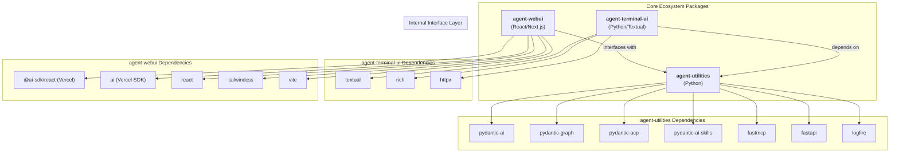

# AGENTS.md

> **Notice:** The `agent-utilities` project uses **Spec-Driven Development (SDD)**.
> - The core project constitution and governance rules are tracked natively in `.specify/memory/constitution.md`.
> - Feature specifications and task lists are tracked in `.specify/specs/` and `.specify/tasks/`.
> This file (`AGENTS.md`) serves as the active system prompt, but the definitive source of truth for architecture and new features is the SDD directory.

## Protocol-First Design Philosophy

<!-- CONCEPT:AU-001 Agent Creation -->
<!-- CONCEPT:AU-002 Graph Orchestration -->
<!-- CONCEPT:AU-003 Workspace Management -->
<!-- CONCEPT:AU-004 Protocol Layer -->
<!-- CONCEPT:AU-005 Serialization Safety -->
<!-- CONCEPT:AU-007 RLM Execution -->
<!-- CONCEPT:AU-008 Resilient Agent Capabilities -->
<!-- CONCEPT:AU-009 Spec-Driven Development -->
<!-- CONCEPT:AU-010 Agent Tool System -->
<!-- CONCEPT:AU-011 Secrets & Authentication -->

**agent-utilities is a protocol-first, framework-light agent core library.**

### Core Design Principles (Do Not Violate)

- **Agents are protocol-native**: Agents communicate via open standards (ACP, A2A, MCP) not proprietary APIs
- **Protocol logic is isolated**: Protocol adapters are separate from agent business logic
- **Transport-agnostic**: Agents work over any transport (SSE, HTTP, stdio, WebRTC)
- **No framework lock-in**: Avoid opinionated orchestration frameworks like LangChain chains
- **Explicit state over implicit context**: State is explicit and managed, not hidden in global variables
- **Tools and transports are pluggable**: Any tool or transport can be swapped without changing agent code
- **UI-agnostic**: No assumptions about user interface (terminal, web, mobile, voice)
- **JSON Prompting (Prompts-as-Code)**: Favor structured JSON blueprints over free-form Markdown for high-fidelity task specification.

### When to Use agent-utilities

**Use agent-utilities when you need:**
- Production-grade agent orchestration with resilience and observability
- Protocol-native agents that can communicate across the ecosystem
- Graph-based orchestration with parallel execution
- Knowledge graph integration for long-term memory
- MCP tool integration for external capabilities
- Multi-agent coordination via ACP/A2A

**Do NOT use agent-utilities for:**
- Simple single-shot LLM calls (use pydantic-ai directly)
- UI development (use agent-webui or agent-terminal-ui)
- SaaS-specific integrations (build MCP servers instead)
- Opinionated agent personalities (build on top of agent-utilities)

## Tech Stack

- **Language**: Python 3.11+ (per `pyproject.toml` `requires-python`)
- **Core Framework**: [Pydantic AI](https://ai.pydantic.dev) (`pydantic-ai-slim>=1.73.0,<2.0.0`) & [Pydantic Graph](https://ai.pydantic.dev/pydantic-graph/) (`pydantic-graph>=0.1.8`)
- **Tooling**: `requests`, `pydantic` (`>=2.8.2`), `pyyaml`, `python-dotenv`, `fastapi` (`>=0.131.0`), `httpx` (`>=0.28.1`, core), `llama_index` (optional via `embeddings*` extras)
- **Architecture**: Centered around the `create_agent` factory, which supports a **Unified Skill Loading** model (`skill_types`) and automated **Graph Orchestration**.
- **Unified Specialist Discovery**: All specialist agents—prompt-based, MCP-derived, and A2A peers—are consolidated into a single, declarative source of truth: the **Knowledge Graph**.

### Dependency Notes

- **`httpx` is a core dep, not `[mcp]`-gated.** `a2a.py` imports it unconditionally.
- **`pydantic-acp` is used for the ACP adapter.** `acpkit` is NOT a dependency.
- **Defensive upper bounds (`<N+1.0`) on all direct deps** to prevent surprise breakage.
- **Circular import between `agent-utilities[ag-ui]` and `agent-webui`** is resolved cleanly with lockstep version bumps.

## Package Relationships

`agent-utilities` is the core Python engine. It provides the backend server that serves both the `agent-webui` assets and the `agent-terminal-ui` client.

- **Backend (`agent-utilities`)**: Handles LLM orchestration, tool execution, and a multi-protocol interface layer.
- **Web Frontend (`agent-webui`)**: A React application using Vercel AI SDK that provides a cinematic chat interface.
- **Terminal Frontend (`agent-terminal-ui`)**: A Textual-based terminal interface for direct CLI interaction.
- **Communication**: Frontends primarily connect via the Agent Communication Protocol (ACP).
- **Memory System**: Local project memory is managed via `AGENTS.md` (auto-loaded into the system prompt). Native agent memory is power by a Knowledge Graph.

## Ecosystem Dependency Graph



## Commands

```bash
# Run tests (unit + integration, excludes live)
uv run pytest -x -v

# Lint & format
uv run ruff check agent_utilities/ tests/
uv run ruff format --check agent_utilities/ tests/

# Type check
uv run mypy agent_utilities/

# Run the server
uv run python -m agent_utilities.server --debug --provider openai --model-id llama-3.2-3b-instruct
```

## Project Structure

```text
agent-utilities/
├── agent_utilities/          # Core package
│   ├── server.py             # FastAPI server (ACP/A2A/MCP/AG-UI endpoints)
│   ├── base_utilities.py     # Low-level helpers, env expansion, model I/O
│   ├── acp_adapter.py        # ACP adapter (per-session agent_factory)
│   ├── agui_emitter.py       # AG-UI wire format translator for direct graph execution
│   ├── secrets_client.py     # Pluggable secrets manager (in-memory/SQLite/Vault)
│   ├── auth.py               # JWT + API key authentication (authlib)
│   ├── graph/                # Graph orchestration (builder, runner, iter, nodes)
│   ├── knowledge_graph/      # Unified Intelligence Graph (14-phase pipeline)
│   ├── models/               # Pydantic models and schema definitions
│   ├── protocols/            # Protocol adapters (ACP, A2A, AG-UI)
│   ├── prompts/              # Externalized JSON prompt blueprints (51 files)
│   └── tools/                # Agent tools (developer, workspace, etc.)
├── tests/                    # Test suite (unit, integration, knowledge_graph)
├── docs/                     # Comprehensive documentation
├── .specify/                 # SDD specs, tasks, and constitution
├── pyproject.toml            # PEP 621 project metadata
├── .env.example              # Environment variable template
└── AGENTS.md                 # This file (project rules for AI agents)
```

## Detailed Documentation

For comprehensive documentation, see the `docs/` directory:

- **[Architecture](docs/architecture.md)** — Core architecture diagrams, graph orchestration (HSM/BT), protocol layer, server endpoints
- **[Knowledge Graph](docs/knowledge-graph.md)** — UIG, 14-phase pipeline, backends, OWL reasoning, MAGMA views, KB layer, maintenance
- **[Agents & Orchestration](docs/agents.md)** — Specialist registry, MCP loading, event system, memory CRUD, governance
- **[Features](docs/features.md)** — Model registry, SDD lifecycle, human-in-the-loop, tool safety, JSON prompting, agentic patterns
- **[Development Guide](docs/development.md)** — Commands, testing, environment variables, project structure, code style, troubleshooting
- **[Creating an Agent](docs/creating-an-agent.md)** — Step-by-step guide to creating a Python agent using `genius-agent` as template
- **[Building MCP Servers](docs/building-mcp-servers.md)** — Building MCP servers and API wrappers with context helpers
