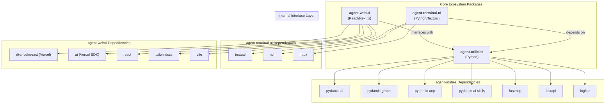

# AGENTS.md

> **Notice:** The `agent-utilities` project uses **Spec-Driven Development (SDD)**.
> - The core project constitution and governance rules are tracked natively in `.specify/memory/constitution.md`.
> - Feature specifications and task lists are tracked in `.specify/specs/` and `.specify/tasks/`.
> This file (`AGENTS.md`) serves as the active system prompt, but the definitive source of truth for architecture and new features is the SDD directory.

## Protocol-First Design Philosophy

<!-- CONCEPT:ORCH-1.0 Unified Intelligence Graph -->
<!-- CONCEPT:ORCH-1.1 Recursive HTN Planning -->
<!-- CONCEPT:ORCH-1.2 Specialist Routing -->
<!-- CONCEPT:ORCH-1.3 Execution & State Safety -->
<!-- CONCEPT:KG-2.0 Active Knowledge Graph -->
<!-- CONCEPT:KG-2.1 Tiered Memory & Rationale -->
<!-- CONCEPT:KG-2.2 Ontology & Epistemics -->
<!-- CONCEPT:KG-2.3 Graph Integrity & Fingerprinting -->
<!-- CONCEPT:AHE-3.0 Agentic Harness -->
<!-- CONCEPT:AHE-3.1 Evaluation & Distillation -->
<!-- CONCEPT:AHE-3.2 Evolution & Discovery -->
<!-- CONCEPT:AHE-3.3 Team & Synergy Optimization -->
<!-- CONCEPT:AHE-3.4 Distributed Agentic Evolution -->
<!-- CONCEPT:ECO-4.0 Unified Tool Interface -->
<!-- CONCEPT:ECO-4.1 MCP & Universal Skills -->
<!-- CONCEPT:ECO-4.2 A2A Network & Consensus -->
<!-- CONCEPT:ECO-4.3 Community Telemetry -->
<!-- CONCEPT:OS-5.0 Agent OS Kernel -->
<!-- CONCEPT:OS-5.1 Security & Auth -->
<!-- CONCEPT:OS-5.2 Resource Scheduling -->
<!-- CONCEPT:AHE-3.7 Heavy Thinking Orchestration -->
<!-- CONCEPT:KG-2.6 Financial Trading Pipeline -->
<!-- CONCEPT:ECO-4.4 Market Data Connector Protocol -->
<!-- CONCEPT:ECO-4.11 Graph-Native Durable Execution -->
<!-- CONCEPT:ECO-4.12 Secure Jupyter Sandbox -->
<!-- CONCEPT:AHE-3.23 OWL-Driven AgentSpecs Catalog -->
<!-- CONCEPT:ORCH-1.4 Swarm Preset Template Engine -->
<!-- CONCEPT:KG-2.7 Risk Scoring Ontology -->
<!-- CONCEPT:AHE-3.8 Backtest Evaluation Harness -->
<!-- CONCEPT:AHE-3.9 Horizon-Aware Task Curriculum -->
<!-- CONCEPT:AHE-3.10 Decomposed Reward Signals -->
<!-- CONCEPT:AHE-3.11 Structured Retry Manager -->
<!-- CONCEPT:OS-5.3 Session Concurrency -->
<!-- CONCEPT:OS-5.4 Prompt Injection Scanner -->
<!-- CONCEPT:OS-5.5 Tool Repetition Guard -->
<!-- CONCEPT:KG-2.10 Token-Aware Context Compaction -->
<!-- CONCEPT:AHE-3.12 Multi-Strategy EvalRunner -->
<!-- CONCEPT:AHE-3.13 Agent Config Versioning -->
<!-- CONCEPT:OS-5.6 Token Usage Tracker -->
<!-- CONCEPT:OS-5.7 Audit Logger -->
<!-- CONCEPT:OS-5.8 Guardrail Callback Engine -->
<!-- CONCEPT:KG-2.11 Research Intelligence Pipeline -->
<!-- CONCEPT:KG-2.12 KG Source Resolver -->
<!-- CONCEPT:ORCH-1.7 SDD Pipeline -->
<!-- CONCEPT:KG-2.13 Cross-Session Chat Recall -->
<!-- CONCEPT:KG-2.14 Project-Aware Context -->
<!-- CONCEPT:KG-2.15 Topological Analogy Engine -->
<!-- CONCEPT:KG-2.16 Semantic Subsumption -->
<!-- CONCEPT:AHE-3.14 Agentic Engineering Patterns -->
<!-- CONCEPT:OS-5.9 Telemetry & Observability -->
<!-- CONCEPT:OS-5.10 Policy & Prompt Governance -->
<!-- CONCEPT:OS-5.11 Topological Vulnerability Scanner -->
<!-- CONCEPT:ECO-4.7 Ecosystem Topology Map -->
<!-- CONCEPT:KG-2.19 Cross-Pillar Synergy Engine -->
<!-- CONCEPT:AHE-3.24 KG-Native Agentic Task Detection -->
<!-- CONCEPT:AHE-3.25 Topological Reasoning Detection -->
<!-- CONCEPT:ORCH-1.14 Ontological Fallback Chains -->
<!-- CONCEPT:KG-2.50 Vectorized Context-Window Filtering -->
<!-- CONCEPT:OS-5.19 Topological Session Persistence -->

**agent-utilities is a protocol-first, framework-light agent core library.**

### Core Design Principles (Do Not Violate)

- **Agents are protocol-native**: Agents communicate via open standards (ACP, A2A, MCP) not proprietary APIs
- **Protocol logic is isolated**: Protocol adapters are separate from agent business logic
- **Transport-agnostic**: Agents work over any transport (SSE, HTTP, stdio, WebRTC)
- **No framework lock-in**: Avoid opinionated orchestration frameworks like LangChain chains
- **Explicit state over implicit context**: State is explicit and managed, not hidden in global variables
- **Tools and transports are pluggable**: Any tool or transport can be swapped without changing agent code
- **UI-agnostic**: No assumptions about user interface (terminal, web, mobile, voice)
- **JSON Prompting (Prompts-as-Code)**: Favor structured JSON blueprints over free-form Markdown for high-fidelity task specification.
- **Graph-native intelligence**: All agent knowledge, routing decisions, and learned patterns are persisted in the Knowledge Graph — not flat files.
- **Event-driven invalidation**: Caches and indices are invalidated by mutation events, never by TTL. This eliminates stale-cache risks.
- **Feedback-driven learning**: Execution outcomes feed back to Self-Model and TeamConfig, enabling progressive routing improvement without human intervention.
- **Distributed Agentic Evolution (AHE-3.4)**: Agents testing new skills locally automatically bundle and PR them back to `agent-packages` to evolve the collective ecosystem.
- **Community Telemetry (ECO-4.3)**: Evolved artifacts maintain deterministic origin tracking, timestamps, and `Author: Autonomous` safety guardrails.
### When to Use agent-utilities

**Use agent-utilities when you need:**
- Production-grade agent orchestration with resilience and observability
- Protocol-native agents that can communicate across the ecosystem
- Graph-based orchestration with parallel execution
- Knowledge graph integration for long-term memory
- MCP tool integration for external capabilities
- Multi-agent coordination via ACP/A2A
- Dynamic team formation with proven coalition reuse
- Auto-activating capabilities based on task characteristics

**Do NOT use agent-utilities for:**
- Simple single-shot LLM calls (use pydantic-ai directly)
- UI development (use agent-webui or agent-terminal-ui)
- SaaS-specific integrations (build MCP servers instead)
- Opinionated agent personalities (build on top of agent-utilities)

## Tech Stack

- **Language**: Python 3.11+ (per `pyproject.toml` `requires-python`)
- **Core Framework**: [Pydantic AI](https://ai.pydantic.dev) (`pydantic-ai-slim>=1.73.0,<2.0.0`) & [Pydantic Graph](https://ai.pydantic.dev/pydantic-graph/) (`pydantic-graph>=0.1.8`)
- **Tooling**: `requests`, `pydantic` (`>=2.8.2`), `pyyaml`, `python-dotenv`, `fastapi` (`>=0.131.0`), `httpx` (`>=0.28.1`, core), `llama_index` (optional via `embeddings*` extras)
- **Architecture**: Centered around the `create_agent` factory, which supports a **Unified Skill Loading** model (`skill_types`) and automated **Graph Orchestration**.
- **Unified Specialist Discovery**: All specialist agents—prompt-based, MCP-derived, and A2A peers—are consolidated into a single, declarative source of truth: the **Knowledge Graph**.

### Dependency Notes

- **`httpx` is a core dep, not `[mcp]`-gated.** `a2a.py` imports it unconditionally.
- **`pydantic-acp` is used for the ACP adapter.** `acpkit` is NOT a dependency.
- **Defensive upper bounds (`<N+1.0`) on all direct deps** to prevent surprise breakage.
- **Circular import between `agent-utilities[ag-ui]` and `agent-webui`** is resolved cleanly with lockstep version bumps.

## Package Relationships

`agent-utilities` is the core Python engine. It provides the backend server that serves both the `agent-webui` assets and the `agent-terminal-ui` client.

- **Backend (`agent-utilities`)**: Handles LLM orchestration, tool execution, and a multi-protocol interface layer.
- **Web Frontend (`agent-webui`)**: A React application using Vercel AI SDK that provides a cinematic chat interface.
- **Terminal Frontend (`agent-terminal-ui`)**: A Textual-based terminal interface for direct CLI interaction.
- **Communication**: Frontends primarily connect via the Agent Communication Protocol (ACP).
- **Memory System**: Local project memory is managed via `AGENTS.md` (auto-loaded into the system prompt). Native agent memory is powered by a Knowledge Graph.

## Ecosystem Dependency Graph



## Commands

> **Testing Standard:** All pytests are strictly bounded by a **60-second timeout** via `pytest-timeout` (`addopts = --timeout=60`). Any test that sleeps or hangs indefinitely will fail automatically to preserve CI/CD stability.

```bash
# Run tests (unit + integration, excludes live)
uv run pytest -x -v

# Lint & format
uv run ruff check agent_utilities/ tests/
uv run ruff format --check agent_utilities/ tests/

# Type check
uv run mypy agent_utilities/

# Full pre-commit suite
pre-commit run --all-files

# Run the server
uv run python -m agent_utilities.server --debug --provider openai --model-id llama-3.2-3b-instruct
```

## Project Structure

```text
agent-utilities/
├── agent_utilities/          # Core package
│   ├── server/               # FastAPI server (ACP/A2A/MCP/AG-UI endpoints, process lifecycle)
│   ├── base_utilities.py     # Low-level helpers, env expansion, model I/O
│   ├── acp_adapter.py        # ACP adapter (per-session agent_factory)
│   ├── agui_emitter.py       # AG-UI wire format translator for direct graph execution
│   ├── graph/                # Graph orchestration (builder, runner, iter, routing, executor, verification)
│   │   ├── config_helpers.py # Registry Hot Cache (CONCEPT:ORCH-1.2)
│   │   ├── routing.py        # 3-stage hybrid routing (CONCEPT:AHE-3.3, CONCEPT:KG-2.1)
│   │   ├── executor.py       # Capability auto-activation (CONCEPT:ORCH-1.2)
│   │   ├── retry_manager.py  # Structured Retry Manager (CONCEPT:AHE-3.11)
│   │   └── verification.py   # Self-Model + TeamConfig feedback loop
│   ├── knowledge_graph/      # Unified Intelligence Graph (15-phase pipeline)
│   │   ├── self_model.py     # Persistent Self-Model (CONCEPT:KG-2.1)
│   │   ├── engine_registry.py # TeamConfig promotion/reuse (CONCEPT:AHE-3.3)
│   │   ├── ogm.py            # Object-Graph Mapper (CONCEPT:KG-2.0)
│   │   ├── fingerprint.py    # Structural Fingerprint Engine (CONCEPT:KG-2.3)
│   │   ├── graph_validator.py # Graph Integrity Validator (CONCEPT:KG-2.3)
│   │   ├── hypergraph.py     # Inductive Knowledge Hypergraphs (CONCEPT:KG-2.4)
│   │   ├── context_compactor.py # Token-Aware Context Compaction (CONCEPT:KG-2.10)
│   │   ├── source_resolver.py # KG Source Resolver (CONCEPT:KG-2.12)
│   │   ├── research_artifacts.py # Research Artifact Generator (CONCEPT:KG-2.11)
│   │   └── kb/entity_claim_extractor.py # Entity-Claim Extraction (CONCEPT:KG-2.2)
│   ├── protocols/            # Protocol adapters (ACP, A2A, AG-UI)
│   │   ├── a2a_graph_skill.py # PlannerGraphSkill (CONCEPT:ECO-4.2)
│   │   └── a2a_config.py     # A2A Config Loader (CONCEPT:ECO-4.2)
│   ├── models/               # Pydantic models and schema definitions
│   ├── security/             # Security: JWT auth, secrets, injection scanning, repetition guard
│   │   ├── prompt_scanner.py # Prompt Injection Scanner (CONCEPT:OS-5.4)
│   │   ├── repetition_guard.py # Tool Repetition Guard (CONCEPT:OS-5.5)
│   │   └── guardrail_engine.py # Guardrail Callback Engine (CONCEPT:OS-5.8)
│   ├── observability/        # Observability: evaluation, token tracking, audit, config versioning
│   │   ├── evaluation.py     # EvalRunner — Multi-Strategy Scoring (CONCEPT:AHE-3.12)
│   │   ├── token_tracker.py  # Token Usage Tracker — 4-Bucket Analytics (CONCEPT:OS-5.6)
│   │   ├── audit_logger.py   # Audit Logger — Compliance Logging (CONCEPT:OS-5.7)
│   │   └── config_versioning.py # Agent Config Versioning (CONCEPT:AHE-3.13)
│   ├── prompts/              # Externalized JSON prompt blueprints (51 files)
│   ├── policies/             # Engineering rule books (YAML frontmatter)
│   ├── capabilities/         # Self-healing: checkpointing, circuit breakers, teams
│   ├── tools/                # Agent tools (developer, workspace, etc.)
│   ├── mcp/                  # MCP server wrappers and agent manager
│   ├── rlm/                  # Recursive Language Model environments
│   ├── sdd/                  # Spec-Driven Development pipelines
│   ├── harness/              # Agentic Harness Engineering toolkit
│   │   ├── backtest_harness.py # Backtest Evaluation Harness (CONCEPT:AHE-3.8)
│   │   └── engineering.py    # Engineering Pattern Orchestrator (CONCEPT:AHE-3.14)
│   └── patterns/             # Design patterns (prompt chaining, prioritization, exploration)
├── tests/                    # Test suite (2060+ tests: unit, integration, knowledge_graph)
├── docs/                     # Comprehensive documentation (24 guides)
├── .specify/                 # SDD specs, tasks, and constitution
├── pyproject.toml            # PEP 621 project metadata
├── .env.example              # Environment variable template
└── AGENTS.md                 # This file (project rules for AI agents)
```

## Architectural Concepts

The system is built on **33 canonical concepts** organized into 5 pillars with gap-free numbering.

→ **Full Registry**: [docs/concept_map.md](docs/concept_map.md) — canonical concept IDs, descriptions, and module paths.

| Pillar | ID Range | Count | Focus |
|:------|:---------|:---:|:------|
| **ORCH** | 1.0–1.6 | 7 | Intelligence graph, HTN planning, routing, execution safety, DSTDD |
| **KG** | 2.0–2.8 | 9 | Active KG, memory, ontology, retrieval, research, finance, enterprise |
| **AHE** | 3.0–3.6 | 7 | Evaluation, evolution, teams, heavy thinking, backtest |
| **ECO** | 4.0–4.4 | 5 | MCP, A2A, telemetry, connectors, KG server |
| **OS** | 5.0–5.4 | 5 | Kernel, security, scheduling, guardrails, observability |

### Governance: Extend-Before-Invent

Before adding a new CONCEPT: tag, agents MUST query the KG via `kg_analogy_search` to find existing concepts with similarity ≥ 0.7. If found, extend the existing concept instead of creating a new one. New concepts require a DSTDD design spec (`.specify/design/<feature>/design.md`).

## Documentation

| Resource | Description |
|:---------|:------------|
| [Concept Map](docs/concept_map.md) | Canonical registry (single source of truth) |
| [Overview](docs/overview.md) | Concept Galaxy — 33 concepts, Mermaid map, query lifecycle |
| [C4 Architecture](docs/pillars/architecture_c4.md) | System context, container, and component diagrams |

### Pillar Summaries

| Pillar | Path |
|:-------|:-----|
| Graph Orchestration | [docs/pillars/1_graph_orchestration.md](docs/pillars/1_graph_orchestration.md) |
| Epistemic Knowledge Graph | [docs/pillars/2_epistemic_knowledge_graph.md](docs/pillars/2_epistemic_knowledge_graph.md) |
| Agentic Harness Engineering | [docs/pillars/3_agentic_harness_engineering.md](docs/pillars/3_agentic_harness_engineering.md) |
| Ecosystem & Peripherals | [docs/pillars/4_ecosystem_peripherals.md](docs/pillars/4_ecosystem_peripherals.md) |
| Agent OS Infrastructure | [docs/pillars/5_agent_os_infrastructure.md](docs/pillars/5_agent_os_infrastructure.md) |

### Guides (Non-Concept References)

All narrative guides are in `docs/guides/`:

| Guide | Description |
|:------|:------------|
| [Architecture](docs/guides/architecture.md) | System architecture, protocol adapters, 3-stage routing |
| [Knowledge Graph](docs/guides/knowledge-graph.md) | 15-phase pipeline, OWL reasoning, MAGMA views |
| [Creating an Agent](docs/guides/creating-an-agent.md) | Step-by-step guide using `genius-agent` as template |
| [Building MCP Servers](docs/guides/building-mcp-servers.md) | FastMCP servers, API wrappers, context helpers |
| [Configuration](docs/guides/configuration.md) | All environment variables, config files, CLI flags |
| [Features](docs/guides/features.md) | Model registry, SDD lifecycle, human-in-the-loop |
| [Development](docs/guides/development.md) | Testing, contributing, code style |
