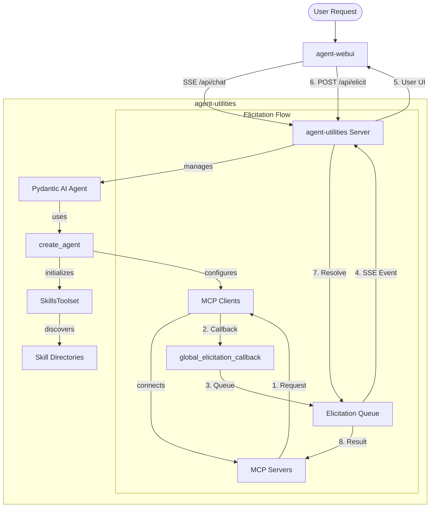

# AGENTS.md

## Tech Stack & Architecture
- **Language**: Python 3.10+
- **Core Framework**: [Pydantic AI](https://ai.pydantic.dev)
- **Tooling**: `requests`, `pydantic`, `pyyaml`, `python-dotenv`
- **Architecture**: Centered around the `create_agent` factory, which automates workspace initialization, skill discovery via `SkillsToolset`, and MCP server integration.
- **Key Principles**:
    - Functional and modular utility design.
    - Lazy loading for heavy dependencies (FastAPI, LlamaIndex).
    - Standardized workspace management (`IDENTITY.md`, `MEMORY.md`).
    - **Elicitation First**: Robust support for structured user input during tool calls, bridging MCP and Web UIs.

## Package Relationships
`agent-utilities` is the core Python engine. It provides the backend server (`ag_ui_endpoint`) that serves the `agent-webui` assets (if enabled).
- **Backend (`agent-utilities`)**: Handles LLM orchestration, tool execution, and the SSE streaming protocol.
- **Frontend (`agent-webui`)**: A React application that provides the chat interface and specialized UI components for elicitation.
- **Communication**: Frontend talks to Backend via SSE for output and standard REST (POST) for input and elicitation responses.

## Core Architecture Diagram


## Commands (run these exactly)
# Development & Quality
ruff check --fix .
ruff format .
pytest

# Installation
pip install -e "."      # Install in editable mode
pip install -e ".[all]" # Install with all optional extras

## Project Structure Quick Reference
- `agent_utilities/agent/` → Agent templates and `IDENTITY.md` definitions.
- `agent_utilities/agent_utilities.py` → Main entry point for `create_agent` and `create_agent_server`.
- `agent_utilities/mcp_utilities.py` → Utilities for FastMCP and MCP tool registration.
- `agent_utilities/base_utilities.py` → Generic helpers for file handling, type conversions, and CLI flags.
- `agent_utilities/tools.py` → Core "OS" tools for agents (read/write, search, list files).
- `agent_utilities/embedding_utilities.py` → Vector DB and embedding integration (LlamaIndex based).

## File Tree
```text
.
├── agent_utilities/
│   ├── agent/                 # Agent templates and definitions
│   ├── agent_utilities.py      # Main entry point factory
│   ├── mcp_utilities.py       # MCP integration helpers
│   ├── base_utilities.py      # Core shared helpers
│   ├── tools.py               # Built-in agent tools
│   ├── embedding_utilities.py # Vector/Embedding utilities
│   ├── api_utilities.py       # Generic API helpers
│   └── models.py              # Shared Pydantic models
├── pyproject.toml
└── README.md
```

## Code Style & Conventions
**Always:**
- Use the `try/except ImportError` guardrail pattern for optional dependencies.
- Use `agent_utilities.base_utilities.to_boolean` for parsing environment variables and CLI flags.
- Support `SSL_VERIFY` environment variable and `--insecure` CLI flag for all network operations.
- Prefer `pathlib.Path` for file path manipulations.

**Good example (Guardrail):**
```python
try:
    from some_external_lib import feature
except ImportError:
    print("Error: Missing 'some_external_lib'. Please install with extras.")
    sys.exit(1)
```

## Dos and Don'ts
**Do:**
- Use `create_agent` for all new agent instances to ensure consistent workspace setup.
- Register tools with descriptive docstrings as they are parsed by the LLM.
- Keep `base_utilities` free of heavy dependencies.

**Don't:**
- Import `fastapi` or `llama_index` at the top level (use lazy imports inside functions or classes).
- Hardcode file paths; use relative paths from the workspace root or environment variables.

## Safety & Boundaries
**Always do:**
- Validate user-provided file paths to prevent traversal attacks.
- Run `ruff` and `pytest` before submitting PRs.

**Ask first:**
- Introducing new top-level dependencies.
- Changes to the `IDENTITY.md` or `MEMORY.md` management logic.

**Never do:**
- Commit API keys or hardcoded secrets.
- Run tests that require external API access without proper mocks or environment configuration.

## Universal Tool Guard (Global Safety)
By default, `agent-utilities` implements a **Universal Tool Guard** that automatically intercepts sensitive tool calls from MCP servers.

Any tool matching specific "danger" patterns (e.g., `delete_*`, `write_*`, `execute_*`, `drop_*`) will **automatically** trigger an elicitation request. The tool will not execute until you explicitly confirm it in the Web UI.

### Key Features
- **Zero Config**: Protections are applied automatically based on tool names.
- **Fail-Safe**: If elicitations aren't supported or fail, the sensitive tool is blocked by default.
- **Customizable**: You can disable the guard by setting `DISABLE_TOOL_GUARD=True` in your environment.

### Sensitive Patterns
The guard currently monitors for:
`delete`, `write`, `execute`, `rm_`, `rmdir`, `drop`, `truncate`, `update`, `patch`, `post`, `put`.

---

## How to use Elicitation
Elicitation is used when a tool requires additional structured input or confirmation from the user.

### In MCP Tools (FastMCP)
```python
from fastmcp import FastMCP, Context

mcp = FastMCP("MyServer")

@mcp.tool()
async def book_table(restaurant: str, ctx: Context) -> str:
    # Trigger elicitation for confirmation and additional details
    confirmation = await ctx.elicit(
        message=f"Please confirm booking for {restaurant}",
        schema={
            "type": "object",
            "properties": {
                "guests": {"type": "integer", "description": "Number of guests"},
                "time": {"type": "string", "description": "Time of booking"}
            },
            "required": ["guests", "time"]
        }
    )

    if confirmation.get("_action") == "cancel":
        return "Booking cancelled by user."

    return f"Booked for {confirmation['guests']} at {confirmation['time']}"
```

### Flow Details
1.  **Request**: Tool calls `ctx.elicit`.
2.  **Streaming**: Backend sends an `elicitation` event to `agent-webui`.
3.  **UI**: Component in `Part.tsx` renders a form.
4.  **Response**: User submits, backend resolves the `Future`, and the tool call resumes with the data.

## Safety & Boundaries
**Always do:**
- Validate user-provided file paths to prevent traversal attacks.
- Run `ruff` and `pytest` before submitting PRs.

**Ask first:**
- Introducing new top-level dependencies.
- Changes to the `IDENTITY.md` or `MEMORY.md` management logic.

**Never do:**
- Commit API keys or hardcoded secrets.
- Run tests that require external API access without proper mocks or environment configuration.

## When Stuck
- Refer to `agent_utilities.py` for the implementation details of `create_agent`.
- Review `mcp_utilities.py` for how tools are being registered and exposed to MCP.
- Ask for clarification if the multi-agent supervisor logic is unclear.
