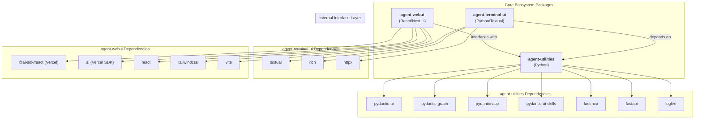
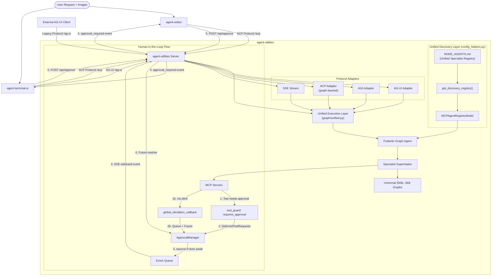
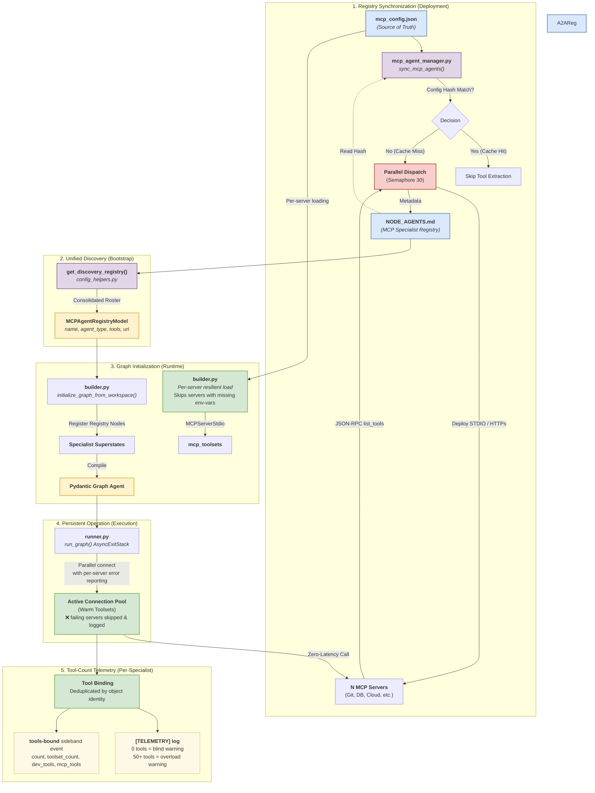
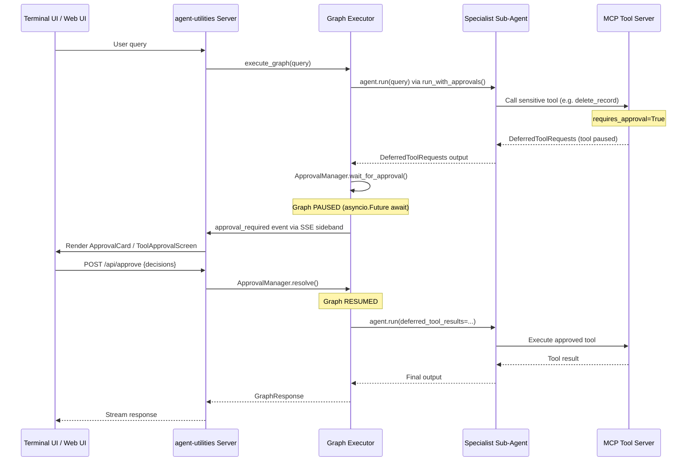

# AGENTS.md

## Tech Stack & Architecture
- **Language**: Python 3.10+
- **Core Framework**: [Pydantic AI](https://ai.pydantic.dev) & [Pydantic Graph](https://ai.pydantic.dev/pydantic-graph/)
- **Tooling**: `requests`, `pydantic`, `pyyaml`, `python-dotenv`, `fastapi`, `llama_index`
- **Architecture**: Centered around the `create_agent` factory, which has been modernized to support a **Unified Skill Loading** model (`skill_types`) and automated **Graph Orchestration**.
- **Unified Specialist Discovery**: All specialist agents—prompt-based, MCP-derived, and A2A peers—are consolidated into a single, declarative source of truth: `NODE_AGENTS.md`. This unified registry is dynamically rebuilt from prompt frontmatter and MCP configurations, ensuring consistent registration, tag-prompting, and tool binding across the entire orchestration layer.
- **Key Principles**:
    - Functional and modular utility design.
    - Standardized workspace management (`IDENTITY.md`, `MEMORY.md`).
    - **Elicitation First**: Robust support for structured user input during tool calls, bridging MCP and Web UIs.

## Package Relationships
`agent-utilities` is the core Python engine. It provides the backend server that serves both the `agent-webui` assets and the `agent-terminal-ui` client.
- **Backend (`agent-utilities`)**: Handles LLM orchestration, tool execution, and a multi-protocol interface layer.
- **Web Frontend (`agent-webui`)**: A React application using Vercel AI SDK that provides a cinematic chat interface.
- **Terminal Frontend (`agent-terminal-ui`)**: A Textual-based terminal interface for direct CLI interaction.
- **Communication**: Frontends primarily connect via the Agent Communication Protocol (ACP) for standardized sessions, planning, and streaming across the ecosystem.
- **Legacy Compatibility**: A secondary **AG-UI protocol layer** is exposed at `/ag-ui`, providing a standard streaming interface compatible with native Pydantic AI and Agent UI clients.

## Ecosystem Dependency Graph
This diagram visualizes the high-level relationships and core dependencies across the three primary ecosystem packages.




## Core Architecture Diagram


## MCP Loading & Registry Architecture
This diagram illustrates how MCP servers are discovered, specialized, and persisted in the graph.
The **Unified Discovery** phase merges MCP and A2A sources into a single roster before graph initialization.




## Graph Orchestration Architecture

```mermaid
  graph TB
  Start([User Query + Images]) --> ACPLayer["<b>ACP / AG-UI / SSE </b><br/><i>(Unified Protocol Layer)</i>"]
  ACPLayer --> UsageGuard[Usage Guard: Rate Limiting]
  UsageGuard -- "Allow" --> router_step[Router: Topology Selection]
  UsageGuard -- "Block" --> End([End Result])

  router_step -- "Trivial Query" --> End
  router_step -- "Full Pipeline" --> dispatcher[Dispatcher: Dynamic Routing]
  dispatcher -- "First Entry" --> mem_step[Memory: Context Retrieval]
  mem_step --> dispatcher[Dispatcher: Dynamic Routing]

  subgraph "Discovery Phase"
    direction TB
    Researcher["<b>Researcher</b><br/>---<br/><i>u-skill:</i> web-search, web-crawler, web-fetch<br/><i>t-tool:</i> project_search, read_workspace_file"]
    Architect["<b>Architect</b><br/>---<br/><i>u-skill:</i> c4-architecture, spec-generator, product-strategy, user-research, brainstorming<br/><i>t-tool:</i> developer_tools"]
    MCPDiscovery["<b>Unified Registry</b><br/>---<br/><i>source:</i> NODE_AGENTS.md<br/>"]
    res_joiner[Research Joiner: Barrier Sync]
  end

  dispatcher -- "Research First" --> Researcher
  dispatcher -- "Research First" --> Architect
  dispatcher -- "Research First" --> MCPDiscovery
  Researcher --> res_joiner
  Architect --> res_joiner
  MCPDiscovery --> res_joiner
  res_joiner -- "Coalesced Context" --> dispatcher

  subgraph "Execution Phase"
    direction TB

    subgraph "Programmers"
      direction LR
      PyP["<b>Python</b><br/>---<br/><i>u-skill:</i> agent-builder, tdd-methodology, mcp-builder, jupyter-notebook<br/><i>g-skill:</i> python-docs, fastapi-docs, pydantic-ai-docs<br/><i>t-tool:</i> developer_tools"]
      TSP["<b>TypeScript</b><br/>---<br/><i>u-skill:</i> react-development, web-artifacts, tdd-methodology, canvas-design<br/><i>g-skill:</i> nodejs-docs, react-docs, nextjs-docs, shadcn-docs<br/><i>t-tool:</i> developer_tools"]
      GoP["<b>Go</b><br/>---<br/><i>u-skill:</i> tdd-methodology<br/><i>g-skill:</i> go-docs<br/><i>t-tool:</i> developer_tools"]
      RustP["<b>Rust</b><br/>---<br/><i>u-skill:</i> tdd-methodology<br/><i>g-skill:</i> rust-docs<br/><i>t-tool:</i> developer_tools"]
      CSP["<b>C Programmer</b><br/>---<br/><i>u-skill:</i> developer-utilities<br/><i>g-skill:</i> c-docs<br/><i>t-tool:</i> developer_tools"]
      CPP["<b>C++ Programmer</b><br/>---<br/><i>u-skill:</i> developer-utilities<br/><i>t-tool:</i> developer_tools"]
      JSP["<b>JavaScript</b><br/>---<br/><i>u-skill:</i> web-artifacts, canvas-design, developer-utilities<br/><i>g-skill:</i> nodejs-docs, react-docs<br/><i>t-tool:</i> developer_tools"]
    end

    subgraph "Infrastructure"
      direction LR
      DevOps["<b>DevOps</b><br/>---<br/><i>u-skill:</i> cloudflare-deploy<br/><i>g-skill:</i> docker-docs, terraform-docs<br/><i>t-tool:</i> developer_tools"]
      Cloud["<b>Cloud</b><br/>---<br/><i>u-skill:</i> c4-architecture<br/><i>g-skill:</i> aws-docs, azure-docs, gcp-docs<br/><i>t-tool:</i> developer_tools"]
      DBA["<b>Database</b><br/>---<br/><i>u-skill:</i> database-tools<br/><i>g-skill:</i> postgres-docs, mongodb-docs, redis-docs<br/><i>t-tool:</i> developer_tools"]
    end

    subgraph Specialized ["Specialized & Quality"]
      direction LR
      Sec["<b>Security</b><br/>---<br/><i>u-skill:</i> security-tools<br/><i>g-skill:</i> linux-docs<br/><i>t-tool:</i> developer_tools"]
      QA["<b>QA</b><br/>---<br/><i>u-skill:</i> spec-verifier, tdd-methodology<br/><i>g-skill:</i> testing-library-docs<br/><i>t-tool:</i> developer_tools"]
      UIUX["<b>UI/UX</b><br/>---<br/><i>u-skill:</i> theme-factory, brand-guidelines, algorithmic-art<br/><i>g-skill:</i> shadcn-docs, framer-docs<br/><i>t-tool:</i> developer_tools"]
      Debug["<b>Debugger</b><br/>---<br/><i>u-skill:</i> developer-utilities, agent-builder<br/><i>t-tool:</i> developer_tools"]
    end

    subgraph Ecosystem ["Agent Ecosystem"]
      direction TB

      subgraph Infra_Management ["Infrastructure & DevOps"]
        AdGuardHome["<b>AdGuard Home Agent</b><br/>---<br/><i>mcp-tool:</i> adguard-mcp<br/>"]
        AnsibleTower["<b>Ansible Tower Agent</b><br/>---<br/><i>mcp-tool:</i> ansible-tower-mcp<br/>"]
        ContainerManager["<b>Container Manager Agent</b><br/>---<br/><i>mcp-tool:</i> container-mcp<br/>"]
        Microsoft["<b>Microsoft Agent</b><br/>---<br/><i>mcp-tool:</i> microsoft-mcp<br/>"]
        Portainer["<b>Portainer Agent</b><br/>---<br/><i>mcp-tool:</i> portainer-mcp<br/>"]
        SystemsManager["<b>Systems Manager</b><br/>---<br/><i>mcp-tool:</i> systems-mcp<br/>"]
        TunnelManager["<b>Tunnel Manager</b><br/>---<br/><i>mcp-tool:</i> tunnel-mcp<br/>"]
        UptimeKuma["<b>Uptime Kuma Agent</b><br/>---<br/><i>mcp-tool:</i> uptime-mcp<br/>"]
        RepositoryManager["<b>Repository Manager</b><br/>---<br/><i>mcp-tool:</i> repository-mcp<br/>"]
      end

      subgraph Media_HomeLab ["Media & Home Lab"]
        ArchiveBox["<b>ArchiveBox API</b><br/>---<br/><i>mcp-tool:</i> archivebox-mcp<br/>"]
        Arr["<b>Arr (Radarr/Sonarr)</b><br/>---<br/><i>mcp-tool:</i> arr-mcp<br/>"]
        AudioTranscriber["<b>Audio Transcriber</b><br/>---<br/><i>mcp-tool:</i> audio-transcriber-mcp<br/>"]
        Jellyfin["<b>Jellyfin Agent</b><br/>---<br/><i>mcp-tool:</i> jellyfin-mcp<br/>"]
        MediaDownloader["<b>Media Downloader</b><br/>---<br/><i>mcp-tool:</i> media-mcp<br/>"]
        Owncast["<b>Owncast Agent</b><br/>---<br/><i>mcp-tool:</i> owncast-mcp<br/>"]
        qBittorrent["<b>qBittorrent Agent</b><br/>---<br/><i>mcp-tool:</i> qbittorrent-mcp<br/>"]
      end

      subgraph Productive_Dev ["Productivity & Development"]
        Atlassian["<b>Atlassian Agent</b><br/>---<br/><i>mcp-tool:</i> atlassian-mcp<br/>"]
        Genius["<b>Genius Agent</b><br/>---<br/><i>mcp-tool:</i> genius-mcp<br/>"]
        GitHub["<b>GitHub Agent</b><br/>---<br/><i>mcp-tool:</i> github-mcp<br/>"]
        GitLab["<b>GitLab API</b><br/>---<br/><i>mcp-tool:</i> gitlab-mcp<br/>"]
        Langfuse["<b>Langfuse Agent</b><br/>---<br/><i>mcp-tool:</i> langfuse-mcp<br/>"]
        LeanIX["<b>LeanIX Agent</b><br/>---<br/><i>mcp-tool:</i> leanix-mcp<br/>"]
        Plane["<b>Plane Agent</b><br/>---<br/><i>mcp-tool:</i> plane-mcp<br/>"]
        Postiz["<b>Postiz Agent</b><br/>---<br/><i>mcp-tool:</i> postiz-mcp<br/>"]
        ServiceNow["<b>ServiceNow API</b><br/>---<br/><i>mcp-tool:</i> servicenow-mcp<br/>"]
        StirlingPDF["<b>StirlingPDF Agent</b><br/>---<br/><i>mcp-tool:</i> stirlingpdf-mcp<br/>"]
      end

      subgraph Data_Lifestyle ["Data & Lifestyle"]
        DocumentDB["<b>DocumentDB Agent</b><br/>---<br/><i>mcp-tool:</i> documentdb-mcp<br/>"]
        HomeAssistant["<b>Home Assistant Agent</b><br/>---<br/><i>mcp-tool:</i> home-assistant-mcp<br/>"]
        Mealie["<b>Mealie Agent</b><br/>---<br/><i>mcp-tool:</i> mealie-mcp<br/>"]
        Nextcloud["<b>Nextcloud Agent</b><br/>---<br/><i>mcp-tool:</i> nextcloud-mcp<br/>"]
        Searxng["<b>Searxng Agent</b><br/>---<br/><i>mcp-tool:</i> searxng-mcp<br/>"]
        Vector["<b>Vector Agent</b><br/>---<br/><i>mcp-tool:</i> vector-mcp<br/>"]
        Wger["<b>Wger Agent</b><br/>---<br/><i>mcp-tool:</i> wger-mcp<br/>"]
      end
    end
  end

  dispatcher -- "Parallel Dispatch" --> Programmers
  dispatcher -- "Parallel Dispatch" --> Infrastructure
  dispatcher -- "Parallel Dispatch" --> Specialized
  dispatcher -- "Parallel Dispatch" --> Ecosystem

  Programmers --> exe_joiner[Execution Joiner: Barrier Sync]
  Infrastructure --> exe_joiner
  Specialized --> exe_joiner
  Ecosystem --> exe_joiner

  exe_joiner -- "Implementation Results" --> dispatcher

  dispatcher -- "Plan Complete" --> verifier[Verifier: Quality Gate]
  verifier -- "Pass (Score >= 0.7)" --> End
  verifier -- "Fail (Score < 0.7)" --> dispatcher
  dispatcher -- "Terminal Failure" --> End
  planner_step --> dispatcher
  synthesizer -- "Final Response" --> End
  dispatcher -- "Terminal Failure" --> End

  subgraph SDD_Lifecycle ["<b>Spec-Driven Development (SDD)</b>"]
    direction TB
    Const["<b>Constitution</b><br/>(Governance)"] --> Spec["<b>Specification</b><br/>(FeatureSpec)"]
    Spec --> SDDPlan["<b>Technical Plan</b><br/>(ImplementationPlan)"]
    SDDPlan --> SDDTasks["<b>Task List</b><br/>(TaskList)"]
    SDDTasks --> SDDExec["<b>Execution</b><br/>(Parallel Dispatch)"]
    SDDExec --> SDDVerify["<b>Verification</b><br/>(Spec Audit)"]
  end

  %% Styling
  style Researcher fill:#e1d5e7,stroke:#9673a6,stroke-width:2px
  style Architect fill:#e1d5e7,stroke:#9673a6,stroke-width:2px
  style A2ADiscovery fill:#e1d5e7,stroke:#9673a6,stroke-width:2px
  style MCPDiscovery fill:#e1d5e7,stroke:#9673a6,stroke-width:2px

  style Programmers fill:#dae8fe,stroke:#6c8ebf,stroke-width:2px
  style PyP fill:#dae8fe,stroke:#6c8ebf,stroke-width:1px
  style TSP fill:#dae8fe,stroke:#6c8ebf,stroke-width:1px
  style GoP fill:#dae8fe,stroke:#6c8ebf,stroke-width:1px
  style RustP fill:#dae8fe,stroke:#6c8ebf,stroke-width:1px
  style CSP fill:#dae8fe,stroke:#6c8ebf,stroke-width:1px
  style CPP fill:#dae8fe,stroke:#6c8ebf,stroke-width:1px
  style JSP fill:#dae8fe,stroke:#6c8ebf,stroke-width:1px

  style Infrastructure fill:#fad9b8,stroke:#d6b656,stroke-width:2px
  style DevOps fill:#fad9b8,stroke:#d6b656,stroke-width:1px
  style Cloud fill:#fad9b8,stroke:#d6b656,stroke-width:1px
  style DBA fill:#fad9b8,stroke:#d6b656,stroke-width:1px

  style Specialized fill:#e0d3f5,stroke:#82b366,stroke-width:2px
  style Sec fill:#e0d3f5,stroke:#82b366,stroke-width:1px
  style QA fill:#e0d3f5,stroke:#82b366,stroke-width:1px
  style UIUX fill:#e0d3f5,stroke:#82b366,stroke-width:1px
  style Debug fill:#e0d3f5,stroke:#82b366,stroke-width:1px

  style Ecosystem fill:#f5f1d3,stroke:#d6b656,stroke-width:2px
  style Infra_Management fill:#fef9e7,stroke:#d6b656,stroke-width:1px
  style Media_HomeLab fill:#fef9e7,stroke:#d6b656,stroke-width:1px
  style Productive_Dev fill:#fef9e7,stroke:#d6b656,stroke-width:1px
  style Data_Lifestyle fill:#fef9e7,stroke:#d6b656,stroke-width:1px

  style verifier fill:#fff2cc,stroke:#d6b656,stroke-width:2px
```


## Spec-Driven Development (SDD) Lifecycle
The `agent-utilities` ecosystem implements a high-fidelity orchestration pipeline based on Spec-Driven Development. This lifecycle ensures technical precision, architectural consistency, and parallel execution safety.

### Phase 1: Governance & Specification
1.  **Project Start**: The **Planner** triggers `constitution-generator` to establish `constitution.md` (governance rules, tech stack).
2.  **Feature Definition**: The **Planner** triggers `spec-generator` to produce `spec.md` (user stories, acceptance criteria, requirements).
3.  **Technical Approach**: The **Planner** triggers `task-planner` to generate `plan.md` (technical approach) and `tasks.md` (inter-dependent graph of tasks).

### Phase 2: Parallel Execution
The **Dispatcher** reads the `tasks.md` and routes sub-tasks to specialized agents.
- **Dependency Tracking**: Tasks are executed in parallel if they have no unmet dependencies.
- **Context Isolation**: Each specialist receives only relevant context for its assigned task.

### Phase 3: Continuous Verification
1.  **Quality Gate**: After execution, the **Verifier** node uses `spec-verifier` to evaluate the results against the original `spec.md`.
2.  **Self-Correction**: If verification fails (score < 0.7), feedback is injected back into the **Planner** for targeted re-planning and execution.

### SDD Skills Reference
| Skill | Purpose | Bound To |
|:------|:--------|:---------|
| `constitution-generator` | Establish project governance and stack. | Planner |
| `spec-generator` | Create feature-level specifications. | Planner, Architect, Project Manager |
| `task-planner` | Generate technical implementation plans. | Planner, Coordinator |
| `spec-verifier` | Evaluate results against specifications. | Verifier, QA Expert, Critique |
  style synthesizer fill: #d5e8d4,stroke:#82b366,stroke-width:2px
  style planner_step fill: #dae8fe,stroke:#6c8ebf,stroke-width:2px
  style End fill:#f8cecc,stroke:#b85450,stroke-width:2px
  style res_joiner fill:#f5f5f5,stroke:#666,stroke-dasharray: 5 5
  style exe_joiner fill:#f5f5f5,stroke:#666,stroke-dasharray: 5 5
  style dispatcher fill:#f5f5f5,stroke:#666,stroke-width:2px
  style Start color:#000000,fill:#38B6FF
	style subGraph0 color:#000000,fill:#f5ebd3
	style subGraph5 color:#000000,fill:#f5f1d3
	style dispatcher fill:#d5e8d4,stroke:#666,stroke-width:2px
  style Ecosystem fill:#f5d0ef,stroke:#d6b656,stroke-width:2px
  style LocalAgents fill:#f5d0ef,stroke:#d6b656,stroke-width:1px
	style RemotePeers fill:#f5d0ef,stroke:#d6b656,stroke-width:1px
  style ACPLayer color:#000000,fill:#38B6FF,stroke-width:2px
  style Start color:#000000,fill:#38B6FF
	style subGraph0 color:#000000,fill:#f5ebd3
	style subGraph5 color:#000000,fill:#f5f1d3
	style dispatcher fill:#d5e8d4,stroke:#666,stroke-width:2px
  style Ecosystem fill:#f5d0ef,stroke:#d6b656,stroke-width:2px
  style LocalAgents fill:#f5d0ef,stroke:#d6b656,stroke-width:1px
	style RemotePeers fill:#f5d0ef,stroke:#d6b656,stroke-width:1px
```

## Server Endpoint Reference

All endpoints are registered on the FastAPI application in `server.py`.

| Endpoint | Method | Tag | Description |
|---|---|---|---|
| `/health` | GET | Core | Health check and server metadata |
| `/ag-ui` | POST | Agent UI | AG-UI streaming endpoint with sideband graph events and merged agent/elicitation streams |
| `/stream` | POST | Agent UI | Generic SSE stream endpoint for graph agent execution |
| `/acp` | MOUNT | ACP | Agent Communication Protocol (pydantic-acp). Handles sessions, planning, approvals, and streaming |
| `/a2a` | MOUNT | A2A | Agent-to-Agent (fastA2A) JSON-RPC endpoint for inter-agent communication |
| `/api/approve` | POST | Human-in-the-Loop | Resolves pending tool approvals and MCP elicitation requests. Body: `{request_id, decisions, feedback}` |
| `/chats` | GET | Core | List all stored chat sessions |
| `/chats/{chat_id}` | GET | Core | Get full message history for a specific chat |
| `/chats/{chat_id}` | DELETE | Core | Delete a specific chat session |
| `/mcp/config` | GET | Interoperability | Return the current MCP server configuration |
| `/mcp/tools` | GET | Interoperability | List all tools from connected MCP servers |
| `/mcp/reload` | POST | Interoperability | Hot-reload MCP servers and rebuild graph without restarting |

## The Complete Execution Journey

The graph orchestration system follows a rigorous, multi-stage pipeline designed for maximum precision, resilience, and multi-modal understanding.

### Phase 1: Ingress & Protocol Handling
1. **Entry**: A user query (text + optional images) arrives via any supported protocol: AG-UI (`/ag-ui`), ACP (`/acp`), SSE (`/stream`), or REST (`/api/chat`).
2. **Unified Execution**: All protocols funnel through the same graph engine via `graph/unified.py`. ACP requests are routed through the full HSM pipeline using `create_graph_acp_app()`.
3. **State Initialization**: A fresh `GraphState` is initialized with the consolidated `query_parts`.

### Phase 2: Safety & Policy Enforcement
4. **Usage Guard**: The `usage_guard_step` triggers immediately. It checks the session's token usage and estimated cost against safety limits (e.g., $5.00 / 500k tokens).
5. **Policy Check**: If enabled, a lightweight LLM check validates the query against security policies before any expensive operations begin.

### Phase 3: Routing & Planning
6. **Fast-Path Check**: Trivial or conversational queries (e.g. "hello", "thanks") are detected and answered directly, bypassing the full graph pipeline.
7. **Routing**: The `router_step` analyzes the multi-modal intent and generates a `GraphPlan` (a sequence of `ExecutionStep` objects) using the router LLM model.
8. **Infinite-Loop Guard**: A `node_transitions` counter (max 50) prevents runaway graph execution.

### Phase 4: Context Enrichment & Dispatch
9. **Memory Selection**: ON first entry, the `dispatcher` routes to `memory_selection_step` which performs as RAG-style lookup across workspace `.md` files to inject relevant historical context.
10. **Research-Before-Execution Ordering**: The dispatcher reorders the plan to guarantee all research steps (researcher, architect) execute before any specialist execution steps.
11. **Dispatch**: The `dispatcher` spawns the selected specialist nodes. If multiple domains are involved, it leverages `parallel_batch_processor` for concurrent execution.

### Phase 5: Parallel Execution
12. **Specialist Loop**: Each specialist (e.g., `python_programmer_step`) enters a high-fidelity `Agent.run()` loop. They have access to:
    - Dedicated system prompts from `prompts/`.
    - Domain-specific toolsets (MCP + Universal Skills).
    - The original multi-modal query parts for visual reasoning.
13. **Convergence**: Results from all specialists are coalesced at the `execution_joiner` and written to the unified `results_registry`.

### Phase 6: Verification & Synthesis
14. **Verification**: The `verifier_step` acts as a quality gate. It compares the accumulated results against the original user intent using a structured `ValidationResult` scoring (0.0-1.0).
15. **Two-Tier Feedback Loop**:
    - **Score 0.4-0.7** (execution failure): Re-dispatches the same plan with feedback injection for a corrective run.
    - **Score < 0.4** (plan failure): Routes to `planner_step` which generates a **new plan** incorporating verification feedback and previous results.
16. **Synthesis**: Once validated (score >= 0.7), the `synthesizer_step` composes the final markdown response from the `results_registry`. This is separate from validation to avoid wasting synthesis work on re-dispatch cycles.
17. **Memory Persistence**: Execution metadata (query, plan, results, tokens, verification attempts) is persisted to `MEMORY.md` for future context retrieval.


## Graph Event System & Phase Map

Every significant state transition in the graph emits a structured event via `emit_graph_event()` (defined in `graph/config_helpers.py`). These events serve **two purposes**:

1. **Server-side structured logging** — The `_log_graph_trace()` function uses `_PHASE_MAP` to prefix each log line with a phase label (e.g., `[ROUTING] routing_started`, `[EXECUTION] specialist_enter`). This provides a human-readable execution trace in server logs without needing the UI.

2. **Real-time UI sideband streaming** — Each event is pushed to an `asyncio.Queue` as a `data-graph-event` payload, which is streamed to connected frontends (web UI, terminal UI) via SSE. The frontends consume the raw `event` field (e.g., `routing_started`, `expert_tool_call`) to drive the graph activity visualizer, approval cards, and status indicators.

### Event Emission Contract

```python
emit_graph_event(
    eq=event_queue,           # asyncio.Queue (or None to skip)
    event_type="routing_started",  # Must be a key in _PHASE_MAP
    query=ctx.state.query,    # Arbitrary metadata kwargs
)
```

This produces:
- **Log line**: `[ROUTING] routing_started query=...`
- **SSE payload**: `{"type": "data-graph-event", "data": {"event": "routing_started", "timestamp": 1234567890.0, "query": "..."}}`

### `_PHASE_MAP` Reference

The `_PHASE_MAP` (in `graph/config_helpers.py`) maps every event type to a high-level execution phase. Events not in the map fall back to the generic `"GRAPH"` phase. All event types use `snake_case` (no hyphens).

| Phase | Event Types | Emitted By |
|---|---|---|
| **LIFECYCLE** | `graph_start`, `graph_complete`, `node_start`, `node_complete` | `runner.py`, `steps.py` |
| **SAFETY** | `safety_warning` | `steps.py` (usage_guard) |
| **ROUTING** | `routing_started`, `routing_completed` | `steps.py` (router) |
| **PLANNING** | `plan_created` | `steps.py` (dispatcher) |
| **REPLANNING** | `replanning_started`, `replanning_completed` | `steps.py` (planner) |
| **DISPATCH** | `step_dispatched`, `batch_dispatched` | `steps.py` (dispatcher) |
| **ENRICHMENT** | `context_gap_detected` | `steps.py` (memory_selection) |
| **EXECUTION** | `specialist_enter`, `specialist_exit`, `expert_metadata`, `expert_thinking`, `expert_warning`, `expert_text`, `expert_complete`, `tools_bound`, `subagent_started`, `subagent_completed`, `subagent_thought` | `hsm.py`, `executor.py` |
| **FALLBACK** | `specialist_fallback` | `executor.py` |
| **TOOL_CALL** | `expert_tool_call`, `subagent_tool_call` | `executor.py`, `steps.py` |
| **TOOL_RESULT** | `tool_result` | `executor.py`, `steps.py` |
| **PARALLEL** | `orthogonal_regions_start`, `orthogonal_regions_complete`, `region_start`, `region_complete` | `hsm.py` |
| **VERIFICATION** | `verification_result` | `steps.py` (verifier) |
| **SYNTHESIS** | `agent_node_delta`, `synthesis_fallback` | `executor.py`, `steps.py` |
| **APPROVAL** | `approval_required`, `approval_resolved`, `elicitation` | `approval_manager.py`, `executor.py` |
| **RECOVERY** | `error_recovery_replan`, `error_recovery_terminal` | `steps.py` (error_recovery) |
| **TERMINATION** | `graph_force_terminated` | `steps.py` (dispatcher) |

### When to Update `_PHASE_MAP`

**You must add an entry to `_PHASE_MAP`** whenever you:
- Add a new `emit_graph_event()` call with a new event type string
- Add a new `_emit_node_lifecycle()` call with a new event name

If you emit an event type that is NOT in `_PHASE_MAP`, the log line will show `[GRAPH]` as a generic fallback, which makes debugging harder. The phase map is the authoritative registry of all graph events.

**Naming convention**: Always use `snake_case` for event types (e.g., `specialist_enter`, not `specialist-enter`).

### Frontend Event Consumers

The frontends consume these events from the SSE sideband stream:

| Frontend | Events Used | Purpose |
|---|---|---|
| **agent-webui** (`graph-activity.tsx`) | `routing_started`, `routing_completed`, `expert_tool_call`, `subagent_tool_call`, `approval_required` | Graph activity visualizer, approval cards |
| **agent-terminal-ui** (`app.py`) | `specialist_enter`, `routing_started`, `routing_completed`, `approval_required` | Status line updates, tool approval modal |

When adding new events that the frontends should display, coordinate the event type name with both UI projects.


## Hierarchical State Machine (HSM) Architecture

The graph orchestration system is a **Hierarchical State Machine**. It follows the same formal model used in robotics,
game engines, UML statecharts, and SCXML workflow engines. Understanding the HSM framing provides critical guidance for
future enhancements.

### HSM Level Mapping
```
Level 0: Root Graph (N Orchestration Nodes)
├── usage_guard → router → dispatcher → memory_selection → dispatcher
├── researcher, architect, verifier (discovery/validation)
├── parallel_batch_processor → expert_executor (fan-out)
├── research_joiner, execution_joiner (fan-in)
├── verifier → synthesizer → END (quality gate + response composition)
└── planner (re-planning on verification failure)

Level 1: Superstates - Specialist Agents
├── Specialist Roster (from NODE_AGENTS.md: Unified Specialist Registry)
│   Each loads: name-matched prompt + discovered capabilities + mapped MCP toolsets
│   Supports: 'prompt' (local), 'mcp' (stdio), and 'a2a' (remote) agent types
└── Unified Execution: Dynamic routing based on registry-provided metadata

Level 2: Substates - Agent Internal Loop
└── Pydantic AI Agent.run() = UserPromptNode → ModelRequestNode → CallToolsNode → ...
    Multi-turn tool iteration (max 3 iterations per specialist)

Level 3: Leaf States - MCP Tool Execution
└── Each tool call invokes an MCP server subprocess via stdio/HTTP
    Atomic operations: get_project(), list_branches(), run_cypher_query(), etc.
```

### Maintaining the Specialist Registry (NODE_AGENTS.md)

The specialist ecosystem is managed via `NODE_AGENTS.md`. This registry is the primary source of truth for routing and specialized proficiency of each node in the cluster.

**How it works**
1. Each entry in `NODE_AGENTS.md` (e.g. `python_programmer`, `researcher`) matches to a `.md` markdown file in `agent_utilities/prompts/` (for prompt agents) or a remote endpoint (for A2A/MCP agents).
2. The `agent_registry_builder.py` script automatically synchronizes this registry by parsing prompt frontmatter and MCP server configurations.
3. When the `builder.py` graph generator spawns the orchestrator, it loads all agents from this registry, bypassing the need for hardcoded skill maps.
4. Capability tags (e.g., `web-search`, `git-operations`) are assigned to agents in the registry, and the `expert_executor` uses these tags to dynamically bind the correct toolsets at runtime.

**Future Enhancements & Best Practices**
- When adding a new role, create the corresponding `[role].md` with YAML frontmatter in `agent_utilities/prompts/`.
- Run the registry rebuilder to update `NODE_AGENTS.md`: `python3 -m agent_utilities.agent_registry_builder`.
- The `agent-webui` interface will naturally ingest the new node ID. Keep role IDs in `snake_case`.

### Concept Mapping
| agent-utilities Concept        | HSM Concept            | Details                                           |
|--------------------------------|------------------------|---------------------------------------------------|
| Root graph                     | Root state machine     | N Orchestration nodes                             |
| Router → Dispatcher            | Top-level transitions  | Router generates plan, dispatcher executes        |
| Planner (re-plan only)         | Re-entry transition    | Invoked by verifier on score < 0.4                |
| Synthesizer                    | Terminal action        | Composes final response from the results          |
| `NODE_SKILL_MAP` agents        | Superstates (L1)       | N hardcoded domains                               |
| Dynamic agents (unified)       | Superstates (L1)       | N from `discover_all_specialists()` (MCP + A2A)   |
| `_execute_specialized_step()`  | Enter superstate       | Loads prompt + skills + deduplicated MCP toolsets |
| `_execute_dynamic_mcp_agent()` | Enter superstate       | Loads prompt + MCP tools + telemetry               |
| `Agent.run()` internal loop    | Substates (L2)         | Model request/tool cycles                         |
| MCP tool call (stdio)          | Leaf states (L3)       | Atomic operations                                 |
| `return "execution_joiner"`    | Exit superstate        | Returns to parent                                 |
| Verifier feedback loop         | Re-entry transition    | Parent re-dispatches to child                     |
| Verifier re-plan               | Cross-level transition | Routes to planner on plan failure                 |
| Circuit breaker (open)         | Guard condition        | Blocks entry to failed state                      |
| Specialist fallback            | Default transition     | Redirects on failure                              |
| `node_transitions` guard       | Watchdog timer         | Force-terminates after 50 transitions             |
| Memory-first dispatch          | Entry action           | Enriches context before first step                |
| Research-before-execution      | Phase ordering         | Discovery completes before execution              |

### HSM Design Principals for Future Growth

1. **Treat subgraphs as macro-states.** A specialist should behave as a single opaque state to the dispatcher. Define
   clear input/output contracts. Never route from the parent into a specialist's internal state.
2. **Scale horizonatally, not vertically.** Instead of adding nodes to an existing graph, add new subgraphs (new MCP servers, new agent packages). This keeps graph sizes small and startup cost bounded.
3. **Plan enhancements by level.** Routing concern → L0. Planning concern → L0 planner.
   Domain behavior → L1 specialist. Tool-level fix → L3 MCP. This prevents "logic gravity" where everything sinks into one layer.
4. **Use types as boundaries.** `ExecutionStep`, `GraphPlan`, `GraphResponse`, and `MCPAgent` are the boundary
   contracts between levels. Internal state is private.
5. **Defer flattening.** Never try to visualize or reason about the full system as one graph. Visualize one level at a time. Debug at the current level.
6. **The growth test:** If you feel tempted to add more nodes to a graph, pause and ask whether you should add a new state machine instead.

### Behavior Tree (BT) Concepts

The graph also incorporates key Behavior Tree patterns **inside** the HSM structure.
The principle: *graphs decide where you are; BT-style logic decides what to do next inside that place.*

| agent-utilities Concept                                                                | Behavior Tree (BT) Concept   | Details                                                                         |
|----------------------------------------------------------------------------------------|------------------------------|---------------------------------------------------------------------------------|
| `_attempt_specialist_fallback`, `static_route_query`, `check_specialist_preconditions` | Selector (priority/fallback) | Specialist fallback chain, static route before LLM call |
| `dispatcher_step`, `assert_state_valid`                                                | Sequence (fail-fast)         | Plan step execution with cursor, state invariant assertions                     |
| `_execute_dynamic_mcp_agent`, `expert_executor_step`                                   | Retry decorator              | Tool-level retries with exponential backoff, expert retries, re-plan on failure |
| `asyncio.wait_for()` in specialist execution                                           | Timeout decorator            | Per-node timeout via `ExecutionStep.timeout`                                    |
| `graph.NodeResult`                                                                     | Tri-state result             | `NodeResult.SUCCESS / FAILURE / RUNNING` enum                                   |
| `check_specialist_preconditions`                                                       | Precondition guard           | Check server health + tool availability before entering specialist               |
| `assert_state_valid()`                                                                 | Boundary re-evaluation       | State invariants at dispatcher and verifier boundaries                          |

### Spec-Driven Development (SDD) Layer
The SDD layer sits between the **Planner** and the **Execution** phase of the HSM. It provides a formal, machine-readable contract that domain specialists must fulfill.

**SDD State Transitions:**
- **Planner (Initial)**: Invokes `constitution-generator` and `spec-generator`.
- **Planner (Strategic)**: Invokes `task-planner` to create the `TaskList`.
- **Dispatcher**: Uses `SDDManager` to analyze the `TaskList` for parallelization batches.
- **Verifier**: Invokes `spec-verifier` to perform high-fidelity audits against the `FeatureSpec`.
- **Planner (Recovery)**: Re-runs `task-planner` with feedback on failure to adjust the strategy.

**SDD Models & Persistence:**
All SDD artifacts are stored in the agent's `agent_data/` directory:
- `constitution.json` -> Global project rules.
- `specs/[feature_id].json` -> Detailed feature requirements.
- `plans/[feature_id].json` -> Technical implementation strategy.
- `tasks/[feature_id].json` -> Structured progress and dependency tracking.

**Design Rule:** The `TaskList` (JSON) is the authoritative source for the orchestrator, while `tasks.md` remains the human-readable mirror for user transparency.

**Design rule:** If logic chooses between options → BT concept. If logic defines long-lived phases → HSM concept.

## Commands (run these exactly)
# Development & Quality
ruff check --fix .
ruff format .
pytest

# Running a single test
# To run a specific test file:
#   pytest tests/test_example.py
# To run a specific test function in a file:
#   pytest tests/test_example.py::test_function_name
# To run tests matching a keyword:
#   pytest -k "keyword"

# Installation
pip install -e .      # Install in editable mode
pip install -e .[all] # Install with all optional extras

## Validation & Diagnostics

To ensure the graph orchestrator and its specialists are functioning correctly, use the following validation tools:

### End-to-End Specialist Validation
High-fidelity testing of individual specialist nodes through the SSE streaming protocol. This bypasses the Web UI and provides granular execution logs to monitor tool calls and result registration.

**Usage:**
```bash
# From the project root
python scripts/verify_graph.py "List all projects in the workspace"
```

**Monitored Events:**
- **Graph Lifecycle**: `graph-start`, `node-start`, `graph-complete` events.
- **Tool Execution**: `expert_tool_call` and `expert_tool_result` events with detailed payloads.
- **Payload Integrity**: Verifies unified result storage in `results_registry` for expert nodes.

### Integration Test Suite
Comprehensive tests located in `tests/` validate the entire stack from registry sync to tool execution:
- **Registry Sync**: Validates discovery of MCP tools and specialist tags from `mcp_config.json`.
- **Connection Resilience**: Tests parallel AnyIO initialization of toolsets without structured concurrency violations.
- **Port Stability**: Robust port cleanup and health check coordination for local development.

## Project Structure Quick Reference
- `agent_utilities/agent/` → Agent templates and `IDENTITY.md` definitions.
- `agent_utilities/agent_utilities.py` → Main entry point for `create_agent` and `create_agent_server`.
- `agent_utilities/agent_factory.py` → CLI factory for creating agents with argparse.
- `agent_utilities/mcp_utilities.py` → Utilities for FastMCP and MCP tool registration.
- `agent_utilities/base_utilities.py` → Generic helpers for file handling, type conversions, and CLI flags.
- `agent_utilities/tools/` → Built-in agent tools (developer_tools, git_tools, workspace_tools).
- `agent_utilities/embedding_utilities.py` → Vector DB and embedding integration (LlamaIndex based).
- `agent_utilities/api_utilities.py` → Generic API helpers
- `agent_utilities/models.py` → Shared Pydantic models (`GraphResponse`, `GraphPlan`, `MCPAgent`, `DiscoveredSpecialist`, etc.)
- `agent_utilities/chat_persistence.py` → Chat history persistence utilities
- `agent_utilities/config.py` → Configuration management
- `agent_utilities/custom_observability.py` → Custom observability and tracing utilities
- `agent_utilities/decorators.py` → Utility decorators for caching, retries, etc.
- `agent_utilities/exceptions.py` → Custom exception classes
- `agent_utilities/graph/` → **Graph orchestration subpackage** (the core engine):
  - `graph/builder.py` → `initialize_graph_from_workspace()`, unified discovery, per-server resilient MCP loading
  - `graph/unified.py` → `execute_graph()`, `execute_graph_stream()` - protocol-agnostic entry points
  - `graph/runner.py` → `run_graph()` with sequential MCP connect + clear failure reporting
  - `graph/steps.py` → All graph node step functions (router, dispatcher, verifier, synthesizer, etc.)
  - `graph/executor.py` → Specialist execution, `agent_matches_node_id()`, tool-count telemetry, deduplicated binding
  - `graph/state.py` → `GraphState`, `GraphDeps` Pydantic models
  - `graph/hsm.py` → HSM/BT entry/exit hooks, preconditions, static routing
  - `graph/config_helpers.py` → `load_mcp_agents_registry()`, `NODE_SKILL_MAP`, emit helpers, structured trace logger
- `agent_utilities/model_factory.py` → Factory for creating LLM models
- `agent_utilities/memory.py` → Memory management for agents
- `agent_utilities/middlewares.py` → HTTP middleware utilities
- `agent_utilities/persistence.py` → General persistence utilities
- `agent_utilities/prompt_builder.py` → Prompt construction utilities
- `agent_utilities/scheduler.py` → Task scheduling utilities
- `agent_utilities/server.py` → HTTP server implementation
- `agent_utilities/tool_filtering.py` → Tool filtering utilities for tag-based access control
- `agent_utilities/tool_guard.py` → Universal tool guard implementation
- `agent_utilities/approval_manager.py` → Human-in-the-loop approval manager (`ApprovalManager`, `run_with_approvals`, `global_elicitation_callback`)
- `agent_utilities/acp_adapter.py` → ACP protocol adapter with graph-backed execution and native plan integration
- `agent_utilities/acp_providers.py` → ACP plan persistence provider (mirrors plan state to PLAN.md)
- `agent_utilities/discovery.py` → Unified specialist discovery (`discover_agents`, `discover_all_specialists`)
- `agent_utilities/event_aggregator.py` → CRON/HEARTBEAT aggregation for orchestrated agents
- `agent_utilities/workspace.py` → Workspace management utilities
- `agent_utilities/a2a.py` → Agent-to-Agent communication, unified discovery (`discover_all_specialists()`)
- `agent_utilities/prompts/` → Prompt templates (one `.md` per specialist role)
- `agent_utilities/agent_data/` → Workspace data files (IDENTITY.md, MEMORY.md, NODE_AGENTS.md, etc.)

## Code Style & Conventions

**Always:**
- Use the `try/except ImportError` guardrail pattern for optional dependencies.
- Use `agent_utilities.base_utilities.to_boolean` for parsing environment variables and CLI flags.
- Support `SSL_VERIFY` environment variable and `--insecure` CLI flag for all network operations.
- Prefer `pathlib.Path` for file path manipulations.

**Imports:**
- Standard library imports first, then third-party, then local application imports.
- Within each group, sort alphabetically.
- Avoid wildcard imports (`from module import *`).

**Formatting:**
- Maximum line length: 88 characters (as per Ruff/Black).
- Use 4 spaces per indentation level.
- No trailing whitespace.
- Use empty lines to separate functions and classes (2 blank lines before a class or function, 1 blank line between methods in a class).

**Types:**
- Use type hints for all function arguments and return values.
- Use `typing` module for complex types (List, Dict, Optional, etc.).
- Avoid using `Any` unless absolutely necessary.

**Naming Conventions:**
- Classes: CapWords (PascalCase).
- Functions and variables: snake_case.
- Constants: UPPER_SNAKE_CASE.
- Private functions and variables: single leading underscore (_snake_case).
- Private classes: single leading underscore (_CapWords) [though rare].

**Error Handling:**
- Catch specific exceptions, not bare `except:`.
- When raising exceptions, provide a clear error message.
- Use custom exception classes for module-specific errors.
- In general, prefer to raise exceptions and let the caller handle them, unless you can handle them locally.

**Good example (Guardrail):**
```python
try:
    from some_external_lib import feature
except ImportError:
    print("Error: Missing 'some_external_lib'. Please install with extras.")
    sys.exit(1)
```

## Dos and Don'ts
**Do:**
- Use `create_agent` for all new agent instances to ensure consistent workspace setup.
- Use `create_agent_factory` for CLI agent creation with argparse.
- Register tools with descriptive docstrings as they are parsed by the LLM.
- Keep `base_utilities` free of heavy dependencies.
- Utilize lazy imports for optional dependencies like FastAPI and LlamaIndex.
- Follow the existing patterns in each module when adding new functionality.
- Pass **all toolsets at Agent construction time** via `Agent(toolsets=[...])`.
- Use `ApprovalRequiredToolset` from `pydantic_ai.toolsets.approval_required` for MCP tool approval.
- Use the public `agent.toolsets` property (read-only) for inspection; iterate with `isinstance(ts, FunctionToolset)` to find function tools.

**Don't:**
- Import `fastapi` or `llama_index` at the top level (use lazy imports inside functions or classes).
- Hardcode file paths; use relative paths from the workspace root or environment variables.
- Modify global state unnecessarily; prefer functional approaches.
- **NEVER** append to `agent.toolsets` after construction — it is a **read-only property** that returns a new list each call. `agent.toolsets.append(x)` is a silent no-op.
- **NEVER** access `agent._function_toolset`, `agent._user_toolsets`, or any underscore-prefixed pydantic-ai attributes. These are private implementation details that break across versions.
- **NEVER** set custom attributes on toolset objects (e.g., `toolset._my_flag = True`). Use a local `set[int]` with `id(toolset)` for tracking.
- **NEVER** import from `pydantic_acp.runtime._*` internal modules. Use only public `pydantic_acp` exports.

## Safety & Boundaries
**Always do:**
- Validate user-provided file paths to prevent traversal attacks.
- Run `ruff` and `pytest` before submitting PRs.
- Test error conditions and edge cases.

**Ask first:**
- Introducing new top-level dependencies.
- Changes to the `IDENTITY.md` or `MEMORY.md` management logic.
- Major architectural changes to the agent creation or graph orchestration systems.

**Never do:**
- Commit API keys or hardcoded secrets.
- Run tests that require external API access without proper mocks or environment configuration.
- Break backward compatibility without a strong justification.

## Universal Tool Guard (Global Safety)
By default, `agent-utilities` implements a **Universal Tool Guard** that automatically intercepts sensitive tool calls from MCP servers and graph specialist sub-agents.

Any tool matching specific "danger" patterns (e.g., `delete_*`, `write_*`, `execute_*`, `drop_*`) is flagged with pydantic-ai's native `requires_approval=True` attribute. When a specialist sub-agent calls a flagged tool, the graph **pauses at that exact node** and waits for explicit user approval before continuing.

### Key Features
- **Zero Config**: Protections are applied automatically based on tool names via `apply_tool_guard_approvals()`.
- **True Pause-and-Resume**: The graph does NOT terminate on approval requests. It suspends via `asyncio.Future` and resumes when the user responds.
- **Protocol-Agnostic**: Works identically across AG-UI (web UI), terminal UI, ACP, and SSE protocols.
- **Persistent Choices**: When using ACP, users can select "Always Allow" / "Always Deny" for specific tools.
- **Customizable**: Disable with `TOOL_GUARD_MODE=off` or `DISABLE_TOOL_GUARD=True`.

### Sensitive Patterns
The guard currently monitors for:
`delete`, `write`, `execute`, `rm_`, `rmdir`, `drop`, `truncate`, `update`, `patch`, `post`, `put`, `create`, `add`, `upload`, `set`, `reset`, `clear`, `revert`, `replace`, `rename`, `move`, `start`, `stop`, `restart`, `kill`, `terminate`, `reboot`, `shutdown`, `git_*`.

### Tool Approval Registry (`NODE_AGENTS.md`)

The **Tool Inventory Table** in `NODE_AGENTS.md` includes an `Approval` column that records which MCP tools require human approval:

```markdown
| Tool Name | Description | Tag | Source | Score | Approval |
|-----------|-------------|-----|--------|-------|----------|
| get_records | Fetch table records | records | servicenow-mcp | 85 | No |
| delete_record | Delete a table record | records | servicenow-mcp | 90 | Yes |
| execute_script | Run a server-side script | scripts | servicenow-mcp | 70 | Yes |
```

**How it works:**
1. During `sync_mcp_agents()`, the `is_sensitive_tool()` function pattern-matches each tool name and auto-populates the `Approval` column.
2. You can manually override by editing `NODE_AGENTS.md` — set `Yes` to force approval on tools that don't match patterns, or `No` to exempt trusted tools.
3. At graph runtime, `build_sensitive_tool_names()` reads the registry and `flag_mcp_tool_definitions()` wraps MCP toolsets with pydantic-ai's native `ApprovalRequiredToolset`.  When a flagged tool is called, the wrapper raises `ApprovalRequired` (unless `ctx.tool_call_approved` is already `True` from a prior approval round), causing pydantic-ai to return `DeferredToolRequests`.
4. When the specialist agent calls a flagged tool, pydantic-ai returns `DeferredToolRequests` instead of executing it, and `run_with_approvals()` pauses the graph until the user responds.

### Human-in-the-Loop Architecture



### Approval Manager Components

| Component | File | Purpose |
|---|---|---|
| `ApprovalManager` | `approval_manager.py` | asyncio.Future registry for pause/resume |
| `run_with_approvals()` | `approval_manager.py` | Transparent approval loop wrapping `agent.run()` |
| `global_elicitation_callback()` | `approval_manager.py` | MCP `ctx.elicit()` pause/resume callback |
| `apply_tool_guard_approvals()` | `tool_guard.py` | Flags sensitive tools with `requires_approval=True` |
| `/api/approve` | `server.py` | REST endpoint to resolve pending approvals |
| `_approval_manager` | `server.py` | Singleton `ApprovalManager` shared with graph |
| `ApprovalCard.tsx` | `agent-webui` | Web UI approval component |
| `ToolApprovalScreen` | `agent-terminal-ui` | Terminal UI modal for tool approval |

---

## How to use Elicitation
Elicitation is used when an MCP tool requires additional structured input or confirmation from the user. Both tool approval (sensitive tool interception) and MCP elicitation (structured forms) use the same underlying `ApprovalManager` pause/resume mechanism.

### In MCP Tools (FastMCP)
```python
from fastmcp import FastMCP, Context

mcp = FastMCP("MyServer")

@mcp.tool()
async def book_table(restaurant: str, ctx: Context) -> str:
    # Trigger elicitation for confirmation and additional details
    confirmation = await ctx.elicit(
        message=f"Please confirm booking for {restaurant}",
        schema={
            "type": "object",
            "properties": {
                "guests": {"type": "integer", "description": "Number of guests"},
                "time": {"type": "string", "description": "Time of booking"}
            },
            "required": ["guests", "time"]
        }
    )

    if confirmation.get("_action") == "cancel":
        return "Booking cancelled by user."

    return f"Booked for {confirmation['guests']} at {confirmation['time']}"
```

### Flow Details
1.  **Request**: MCP tool calls `ctx.elicit` inside its handler.
2.  **Callback**: `global_elicitation_callback()` pushes an `elicitation` event to the sideband queue and creates an `asyncio.Future` via `ApprovalManager`.
3.  **Streaming**: Backend streams the event to the UI (web or terminal) via SSE sideband.
4.  **UI**: `ElicitationModal` (web) or a terminal prompt renders the form from JSON Schema.
5.  **Response**: User submits, UI sends `POST /api/approve` with the structured data.
6.  **Resume**: `ApprovalManager.resolve()` sets the future result, unblocking the MCP tool which continues execution with the user's data.

## When Stuck
- Refer to `agent_utilities.py` for the implementation details of `create_agent`.
- Refer to `agent_factory.py` for CLI agent creation implementation.
- Review `mcp_utilities.py` for how tools are being registered and exposed to MCP.
- Review `graph_orchestration.py` for graph-based agent orchestration.
- Ask for clarification if the multi-agent supervisor logic is unclear.

## Pydantic AI VercelAIAdapter Integration Notes
When using `pydantic-ai` with the `VercelAIAdapter` (which handles `/api/chat` requests from the React frontend):
- The frontend (Vercel AI SDK) provides the **entire conversation history** in every payload.
- Pydantic AI's `UserPromptNode` logic assumes that if a `message_history` is provided, the conversation is simply being "resumed".
- As a result, Pydantic AI **skips** applying any static `system_prompt`s defined in `Agent.__init__` because it assumes the system prompt must have been added earlier in the history.
- The `agent-webui` React application does *not* explicitly pass the system message in its payload. Therefore, static system prompts get silently dropped during `/api/chat` inferences.
- **Solution:** Always use the dynamic `@agent.instructions` decorator for critical agent identity injection. Pydantic AI's graph evaluates dynamic instructions on *every* `ModelRequest` regardless of existing message history, ensuring the identity is always passed to the LLM.

## Agent Data Files
The `agent_utilities/agent_data/` directory contains important workspace files:
- `IDENTITY.md` - Defines the agent's identity, purpose, and behavior guidelines
- `MEMORY.md` - Persistent memory for the agent across sessions
- `USER.md` - Information about the current user
- `A2A_AGENTS.md` - Agent-to-Agent communication protocols
- `CRON.md` - Scheduled task definitions
- `CRON_LOG.md` - Execution logs for cron tasks
- `HEARTBEAT.md` - Agent health and status indicators

These files are automatically managed by the workspace system and should be referenced when building agents that need to maintain state or identity.

## Adding New Modules
When adding new utility modules to the agent_utilities package:
1. Follow the existing code style and conventions
2. Add appropriate type hints
3. Include comprehensive docstrings
4. Add unit tests in the tests/ directory
5. Export public functions/classes in `__init__.py` if they should be part of the public API
6. Consider if the module should have lazy imports for heavy dependencies
7. Follow the pattern of existing similar modules for consistency
8. Update this AGENTS.md file to document the new module's purpose

## Testing Guidelines
- Write tests for all new functionality
- Aim for high test coverage, especially for utility functions
- Use pytest fixtures for common test setup
- Mock external dependencies when possible
- Test both success and failure paths
- Follow the existing test patterns in the tests/ directory

## Documentation Standards
- All public functions and classes should have docstrings
- Docstrings should follow Google or NumPy style
- Complex algorithms should include explanatory comments
- Examples should be provided for non-trivial functions
- Keep documentation up-to-date when making changes

## Dependency Management
- Prefer to keep dependencies minimal
- For optional dependencies, use try/except ImportError patterns
- Document any new dependencies in pyproject.toml
- Consider if heavy dependencies should be lazy-loaded
- Follow semantic versioning for dependencies when possible
