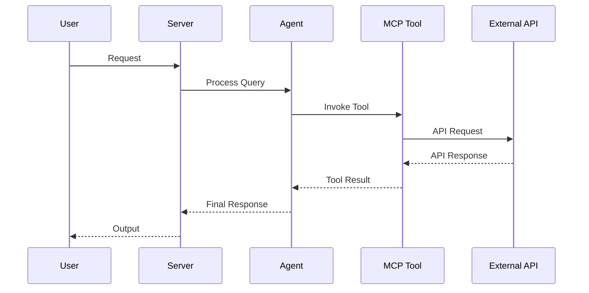

# AGENTS.md

<!--
This file is the hand-written source for AGENTS.md. The final AGENTS.md is
regenerated by `scripts/gen_agents_md.py`, which appends two generated
sections (Project Structure file tree + Concept Reference) to this prose.
Edit THIS file for any narrative / conventions changes, then run:
    python scripts/gen_agents_md.py
-->

> Claude Code loads this file via `CLAUDE.md` (`@AGENTS.md` import) — the two stay
> in sync. Edit `AGENTS.head.md` (then regenerate), never `CLAUDE.md`.

> **New to the platform (not just editing it)?** This file is *contributor/AI
> working-discipline*. For **what agent-utilities is, how to use it, its
> capabilities, and how to deploy it**, read **[docs/start-here.md](docs/start-here.md)**
> (or **[llms.txt](llms.txt)** for the AI entry index, **[docs/capabilities.md](docs/capabilities.md)**,
> and **[docs/ecosystem.md](docs/ecosystem.md)**).

## Working Discipline — think, simplify, stay surgical, verify (READ FIRST)

These four habits cut the most common LLM coding mistakes. The deeper, domain-specific
sections below (*Configuration discipline*, *Wire-First*, *Naming*, *Quality Bar*) are
**applications** of them — read those as the concrete enforcement of these defaults.
For trivial tasks, use judgment; the bias here is correctness over speed.

- **Think before coding.** State your assumptions explicitly. If a request has more than
  one reasonable reading, surface the options instead of silently picking one. If a
  simpler approach exists, say so and push back when warranted. When something is
  genuinely unclear, stop and name what's confusing — ask, don't guess. (Cf. *When Stuck*.)
- **Simplicity first.** Write the minimum code that solves the *stated* problem — no
  speculative features, no abstraction for single-use code, no configurability that
  wasn't requested, no error handling for impossible states. If you wrote 200 lines and
  it could be 50, rewrite it. Ask: "would a senior engineer call this overcomplicated?"
  This is the general form of two rules we already enforce: **Configuration discipline**
  (an env flag is a last resort — YAGNI) and **Wire-First** (no code ships without a live
  caller).
- **Stay surgical.** Every changed line should trace directly to the task. Don't refactor,
  reformat, or "improve" working code adjacent to your change; match the existing style
  even where you'd do it differently. Remove only the imports/symbols your *own* change
  orphaned; if you spot unrelated dead code, mention it rather than deleting it inline.
  **Two deliberate exceptions — both already standing rules here:** the **Quality Bar**
  (lint/format/type errors the pre-commit gate flags get fixed regardless of who
  introduced them) and **strangler-then-delete** (a planned migration removes the old
  path once the new one is live). In short: **surgical on behavior; clean on lint; delete
  only on a planned strangle.**
- **Verify against a goal.** Turn the task into a checkable outcome *before* you start:
  "fix the bug" → "write a failing test that reproduces it, then make it pass"; "add
  validation" → "tests for the invalid inputs pass"; "refactor X" → "the suite is green
  before and after". For multi-step work, state the short plan and the check for each
  step, then loop until the checks pass. **"Done" means a live path actually invokes it**
  (see *Wire-First*) **and the unit suite is green** — not merely that the code compiles.

## Architecture Reference (current)

- **Engine transport.** Python talks to the Rust `epistemic-graph` engine **only**
  through the out-of-process MessagePack/UDS client (`epistemic_graph.client`,
  with `pool.py` `ConnectionPool`/`ShardRouter`). There is **no PyO3**. Entry:
  `domains/finance/*` and `knowledge_graph/core/graph_compute.py`.
- **Knowledge graph (layered).** `knowledge_graph/facade.py` (`KnowledgeGraph`) is
  the single object the execution plane uses; it composes L0 compute (Rust client),
  L1 store (`backends/` — Postgres + epistemic_graph primary; neo4j/falkordb/ladybug
  demoted to `backends/contrib/`), and L2 semantic (`core/owl_bridge.py`, SHACL gate).
  `retrieval/capability_index.py` (`CapabilityIndex`, HNSW) powers `designate()` and
  reward write-back (`record_outcome`).
- **Routing.** `graph/routing/` is a strategy package (`Router`/`RoutingStrategy`)
  stranglering the monolith `graph/_router_impl.py`; strategies under
  `routing/strategies/` (fast_path, workflow_context, policy). `graph/planning/`
  is the unified `Planner` facade; `core/execution/` is the `ExecutionEngine`
  Protocol. Consolidated singletons: `core/registry/`, `core/checkpoint/`,
  one `core/config.py`, one `EmbeddingFactory` (`core/embedding_utilities.create_embedding_model`).
- **Ontology layer (first-class).** `knowledge_graph/ontology/` is the
  Palantir-Foundry-parity object/link/function/action system, reached **only** through
  `kg.ontology` (`KnowledgeGraph.ontology` → `OntologySystem`) — never reach into the
  submodules directly from the execution plane. It binds import-populated registries to the
  *live* facade (store / `owl_bridge` / retrieval), so interface targeting, derived-property
  compute, Functions-on-Objects, and ACL enforcement resolve against the real graph. Modules:
  `interfaces` (KG-2.38), `value_types` (KG-2.39), `derived_properties` (KG-2.40),
  `functions/` (KG-2.41), `edits/` (KG-2.43), `indexing/` (KG-2.44), `object_set` (KG-2.45),
  `permissioning` (KG-2.46), `property_types` (KG-2.47), `document_processing` (KG-2.48), and
  `links` (KG-2.26); action types live in `knowledge_graph/actions/` (KG-2.42). Conventions:
  registries ship **real built-ins at import** (never an empty shell); cite the Foundry/AIP doc
  in the module docstring and name from purpose, not the vendor; surface new capability over the
  `ontology_*` MCP tools (`mcp/kg_server.py`) and the agent-webui `/api/enhanced/ontology/*`
  routes (ObjectExplorer/Object/Vertex views).
- **Scale-out & autonomy planes (all opt-in; defaults stay zero-infra).**
  Identity: every gateway request is scoped to a server-minted JWT
  `ActorContext` with fail-closed permissioning and HMAC engine auth
  (`security/request_identity.py`, `security/auth.py`, OS-5.14). State:
  `STATE_DB_URI` externalizes checkpoints/sessions/queues onto shared Postgres
  with SKIP LOCKED claims + advisory-lock daemon leadership
  (`core/state_store.py`, `core/leadership.py`, OS-5.16–5.18). Engines shard
  by tenant behind client-side HRW routing (`GRAPH_SERVICE_ENDPOINTS`,
  `knowledge_graph/core/shard_topology.py`, KG-2.58). Work scales via
  fail-loud queue backends (`TASK_QUEUE_BACKEND`, KG-2.55–2.57) and
  queue-driven dispatch (`AGENT_DISPATCH_BACKEND=queue`,
  `orchestration/agent_dispatch*.py`, ORCH-1.45) consumed by the
  `kg-ingest-worker` / `agent-dispatch-worker` console scripts. Autonomy:
  every mutating fleet action passes the fail-closed ActionPolicy gate
  (`orchestration/action_policy.py` + `deploy/action-policy.default.yml`,
  OS-5.24) feeding the reconciler/playbooks/deploy-watch/autoscaler
  (OS-5.25–5.27, OS-5.29). Observability: Prometheus `/metrics`
  (`observability/gateway_metrics.py`, OS-5.23); multiplexer children are
  individually supervised (`mcp/child_resilience.py`, ECO-4.34). Docs:
  `docs/architecture/{state_externalization,engine_sharding,agent_dispatch,fleet_autonomy,gateway_scaling}.md`.
- **Single source of truth for concepts:** `docs/concepts.yaml` (regenerate via
  `scripts/build_concepts_yaml.py`; README/AGENTS counts come from it).
- **Guardrail gates (CI + pre-commit, `guardrails.yml`):** `scripts/check_no_stub.py`,
  `check_sprawl.py`, `check_concepts.py`, `check_coupling.py`,
  `check_retrieval_quality.py`, `check_no_env_sprawl.py`, with meta-tests in `tests/gates/`.
- **Cardinal rules:** no stubs (`raise NotImplementedError` only with `# ABSTRACT-OK`);
  strangler-then-delete (never "v2 beside old"); keep the unit suite green.

## Configuration discipline — an env var is a LAST RESORT (READ before adding any flag)

We were drowning in ~96 `KG_*`/`GRAPH_*` env flags — over-configuration that is
overwhelming to operate and a frequent source of footguns (a hang that only
`KG_INGEST_FEATURES=0` avoided). The standing rule: **prefer a system that detects
and self-configures over one that exposes a knob.** The full inventory + per-flag
verdict lives in `docs/architecture/configuration.md`.

**Add a new environment variable ONLY if ALL THREE hold:**
1. **Deployment-varying** — a path / DSN / secret / port / socket whose value genuinely
   differs per host and cannot be known at code time.
2. **Not auto-detectable** from the runtime — it cannot be derived from `cpu_count`,
   available memory, queue depth, or the presence of a file/service.
3. **No correct universal default** — there is no single value that works everywhere.

**Otherwise, do NOT add a flag:**
- One correct value → a named module constant.
- A hardware/load tunable (concurrency, batch size, pool size) → **auto-size** it
  (reuse the CPU/mem sizer in `knowledge_graph/core/engine_tasks.py`, ~L1683).
- An always-on behavior → just enable it. A single `KG_DEV_MODE` may gate *all* dev
  escape hatches; never one env flag per feature/daemon.
- An experiment → the feature-flag registry; then graduate or delete it. Never a new
  `KG_<EXPERIMENT>_*` family.
- "Someone might want to tune this" → YAGNI. Add it when a real second value exists.

**When a flag IS justified:** add a typed field to `AgentConfig` (`core/config.py`)
with `Field(alias="...")` and read it via the `config` object — **never** a bare
`os.environ.get()` in a module — give it a default, and document it in
`docs/architecture/configuration.md`. Enforced by `scripts/check_no_env_sprawl.py`
(a guardrail gate): a bare `os.environ.get("KG_*"/"GRAPH_*"/"EPISTEMIC_*")` outside
`core/config.py` fails CI.

## Reward / preference / RL-method primitives (AHE-3.x) — conventions

When adding reward, advantage, preference, or RL-method code (the AHE-3.1 spine and the
AHE-3.15/3.16/3.17 adaptations), follow these rules — they encode the 2026 reasoning-RL
work (`.specify/specs/reasoning-rl-2026/`):

- **Opt-in, default-unchanged.** A new parameter on an existing reward primitive MUST default
  to the prior behaviour (e.g. `batch_normalized_advantage(length_unbiased=False, mode="group")`
  reproduces GRPO exactly). New behaviour is opted into, never imposed.
- **Ship primitives WITH a live consumer — never speculatively.** A reward primitive with no
  caller is dead code (Wire-First). `entropy_progress_weights` ships because
  `RewardDecomposer.step_advantages` consumes it; ARPO branching ships because
  `SubagentLifecyclePolicy.determine_route` reads it. Trainer-only micro-mechanics (GSPO
  sequence-ratio, DPPO rollout pruning) stay **specified, not implemented**, until a
  policy-gradient trainer consumes them.
- **We are agentic, not a base-model trainer.** Prefer adaptations that land on live mechanisms —
  the capability reward-EMA router (`capability_index.record_outcome`), the eval/preference corpus,
  test-time fan-out — over re-implementing GRPO (already `training_signals.batch_normalized_advantage`).
- **Cite the paper in the docstring, name from purpose.** Provenance (arXiv id) goes in the
  docstring/CHANGELOG, never the identifier (`agent_step_po.py`, not `arpo_v1.py`). New
  `CONCEPT:AHE-3.x` tags are picked up by `scripts/build_concepts_yaml.py`; run
  `scripts/check_concepts.py` (CI gate) after adding one.

## Wire-First — reachable ≠ invoked (READ BEFORE shipping a complex feature)

A feature is **not done when its code exists and unit-tests pass** — it is done when a **live call
path actually invokes it**. We have repeatedly shipped code that was importable and unit-tested but
*never called on any real path* (e.g. `mount_skill_unit` stored a skill's SOP but the prompt builder
never read it; `UsageTelemetry` existed but `plan_and_retrieve` never recorded recall; a GEPA
held-out split existed but the entry point passed `dev_fraction=0`). These pass every unit test and
are still **dead code**.

When implementing any non-trivial feature you MUST verify and test the *invocation*, not just the API:

1. **Trace the live path end-to-end.** From an entry point (MCP tool, API route, CLI, hook, daemon
   tick, or a registry/discovery mechanism) to your new code. If you added a method/field/flag, grep
   that the existing hot path **actually calls/reads it** — don't assume `__init__` storing it is enough.
2. **Default the integration ON.** If a new behavior needs a flag/param to activate, the live entry
   point must pass a sensible default that turns it on (or it's off in production).
3. **Write a LIVE-PATH test, not just an API test.** Exercise the *existing* class/entry point and
   assert the new behavior happens as a side effect (e.g. "call `plan_and_retrieve`, assert recall was
   recorded"), in addition to unit-testing the helper in isolation. Name it `*_live_path` / `*_integration`.
4. **Run `check_wiring.py`** (import-graph, ≤3 hops) — but know its **blind spot**: it cannot see
   **plugin/decorator dynamic registration** (`register_source` + `pkgutil` discovery, entry-points,
   `@adaptor`). For those, also grep that a discovery/registration call runs on a live path. A
   "0 hops / unreachable" result for a self-registering module is a false negative — verify the
   discovery, don't delete the module.
5. **No silent storage.** A value set in `__init__`/a setter but read nowhere is a bug. Either wire it
   into the behavior or don't add it.

## Branching & isolation — DEFAULT WORKFLOW (never edit `main`'s working tree directly)

This repo is a **shared working checkout**: multiple agent sessions operate on the same on-disk
clone, and another session switching branches (`git checkout`/`switch`) or resetting the tree
**reverts every uncommitted change in all sessions** — silently. Editing `main` in place loses work.
So the default for any non-trivial change is:

1. **Work in a dedicated git worktree**, not the main checkout. The worktree is a *physically
   separate directory* on its own branch, immune to branch switches in the main clone:
   ```
   git worktree add /home/apps/worktrees/<repo>-<topic> -b feat/<topic> main
   ```
   Do all edits, builds, and tests under that path. (`/home/apps/worktrees/` is the convention.)
2. **Commit early and often.** A working-tree reset can only wipe *uncommitted* changes — committing
   is what protects the work. Commit each coherent step; don't leave a large diff uncommitted.
3. **Merge to `main` locally at the end, in one go** (fast-forward / no-op-safe), then **clean
   up**: remove the worktree and delete the now-merged branch
   (`git worktree remove <path> && git branch -d <topic>`, or `rm_worktree remove <repo>
   <branch> --delete-branch`; `git worktree prune` clears stale entries). Push only when
   the user asks. See *Finishing work in a worktree* below for the full sequence.
4. A plain feature branch in the main checkout is **not** sufficient isolation — a sibling session's
   `git checkout` still mutates the shared tree. Use a worktree for real isolation.

The harness emits "file modified externally — intentional, don't revert" notes when a sibling
session touches a file; in a worktree those notes should stop for your files. If your edits keep
vanishing, you're in the shared checkout — move to a worktree.

## Tech Stack & Architecture
- Language/Version: Python 3.10+
- Core Libraries: `agent-utilities`, `fastmcp`, `pydantic-ai`
- Key principles: Functional patterns, Pydantic for data validation, asynchronous tool execution.
- Architecture:
    - `kg_server.py`: Main MCP server entry point and tool registration.
    - `agent.py`: Pydantic AI agent definition and logic.
    - `skills/`: Directory containing modular agent skills (if applicable).
    - `agent/`: Internal agent logic and prompt templates.

### Architecture Diagram


### Workflow Diagram


## Commands (run these exactly)
# Installation
pip install .[all]

# Quality & Linting (run from project root)
pre-commit run --all-files

# Execution Commands
# agent-utilities-kg
agent_utilities.mcp.kg_server:main

# Run the native compute backend daemon
cargo run -p epistemic-graph

## Project Structure Quick Reference
- MCP Entry Point → `kg_server.py`
- Native Compute Engine → `epistemic-graph` (Rust)
- Agent Entry Point → `agent.py`
- Source Code → `agent_utilities/`
- Skills → `skills/` (if exists)

## Code Style & Conventions
**Always:**
- Use `agent-utilities` for common patterns (e.g., `create_mcp_server`, `create_agent`).
- Define input/output models using Pydantic.
- Include descriptive docstrings for all tools (they are used as tool descriptions for LLMs).
- Check for optional dependencies using `try/except ImportError`.

### Naming — derive from purpose, never from process

Names (modules, classes, functions, MCP tools, vars) MUST describe **what the
thing is and does in its used context** — never the planning/process vocabulary
that happened to spawn it. Strip out roadmap/phase scaffolding: no `wave0`,
`phase2`, `step3`, `v2`, `new`, `milestone_*`, ticket IDs, sprint names, or a
plan's section title. Those describe *when/why we built it*, not *what it is*,
and they rot the moment the plan moves on.

- ❌ `wave0_scorers.py`, `build_wave0_suite()`, `phase2_router`, `eval_run_wave0`
- ✅ `reliability_scorers.py`, `build_reliability_suite()`, `eval_reliability`

Pick the most specific accurate noun for the behavior/domain (a suite of grounding
+ safety + retrieval-quality checks → *reliability* scorers). Provenance (which
plan/paper it came from) belongs in the docstring/CHANGELOG, not the identifier.

**Good example:**
```python
from agent_utilities import create_mcp_server
from mcp.server.fastmcp import FastMCP

mcp = create_mcp_server("my-agent")

@mcp.tool()
async def my_tool(param: str) -> str:
    """Description for LLM."""
    return f"Result: {param}"
```

## Dos and Don'ts
**Do:**
- Run `pre-commit` before pushing changes.
- Use existing patterns from `agent-utilities`.
- Keep tools focused and idempotent where possible.

**Don't:**
- Use `cd` commands in scripts; use absolute paths or relative to project root.
- Add new dependencies to `dependencies` in `pyproject.toml` without checking `optional-dependencies` first.
- Hardcode secrets; use environment variables or `.env` files.

## Safety & Boundaries
**Always do:**
- Run lint/test via `pre-commit`.
- Use `agent-utilities` base classes.

**Ask first:**
- Major refactors of `kg_server.py` or `agent.py`.
- Deleting or renaming public tool functions.

**Never do:**
- Commit `.env` files or secrets.
- Modify `agent-utilities` or `universal-skills` files from within this package.

## When Stuck
- Propose a plan first before making large changes.
- Check `agent-utilities` documentation for existing helpers.

## ⛔ Keep the Repository Root Pristine — No Scratch / Temp / Debug Files

**The repository ROOT must contain only canonical project files** (packaging,
config, docs, lockfiles). The only hidden directories allowed at root are
`.git/`, `.github/`, and `.specify/` (plus a local, git-ignored `.venv/`).

**NEVER write any of the following — anywhere in the repo, and ESPECIALLY at the root:**
- One-off / debug / migration scripts: `fix_*.py`, `migrate_*.py`, `refactor_*.py`,
  `replace_*.py`, `update_*.py`, `debug_*.py`, or `test_*.py` **at the root**
  (real tests live in `tests/` only).
- Databases / data dumps: `*.db`, `*.db-wal`, `*.sqlite*`, `*.corrupted`.
- Logs / command output: `*.log`, scratch `*.txt`, `*.orig`, `*.rej`, `*.bak`.
- Build artifacts: `*.tsbuildinfo`, compiled binaries, coverage files.
- AI agent scratch directories: `.agent/`, `.agents/`, `.agent_data/`, `.tmp/`,
  `.hypothesis/`, or any per-tool cache committed to git.
- Any file that is NOT production source, a test in `tests/`, documentation, or
  a recognized config/lockfile.

**Why:** scratch at the root leaks private paths/credentials, bloats the tree,
breaks the anti-sprawl gate, and erodes a pristine codebase.

**Where scratch goes instead:** `~/workspace/scratch/` (experiments),
`~/workspace/reports/` (command output); tests go in `tests/` (pytest).
The `.gitignore` already blocks the scratch dirs above — do not force-add them.
Before finishing a task, run `git status` and confirm no stray root files were added.

## Quality Bar — Leave the Codebase Clean (REQUIRED)

After completing any code change, run the project's pre-commit suite and drive it
**fully green** before committing:

```bash
pre-commit run --all-files
```

Resolve **every** issue it reports — failures, lint errors, type errors, and
warnings — **including problems that pre-date your change and were not caused by
your edits**. The standing goal is a clean, working codebase with **no errors and
no warnings**. Do not silence checks (`# noqa`, `# type: ignore`, `SKIP=`,
`--no-verify`) to force green unless the exception is already documented in this
file as a known, unavoidable limitation. Only commit once `pre-commit run
--all-files` passes cleanly; if a check legitimately cannot pass, stop and explain
why rather than bypassing it.

## Working with Git Worktrees (multi-session)

Multiple agents/sessions work the `agent-packages/*` repos concurrently. **Do not
edit the canonical checkout** (`/home/apps/workspace/agent-packages/<repo>`) — a
background `repository-manager` sync can reset its working tree and discard
uncommitted edits. Take your own git worktree on your own branch instead:

```bash
# preferred — repository-manager MCP:
rm_worktree add <repo> <your-branch>      # -> /home/apps/worktrees/<repo>/<your-branch>

# raw-git fallback:
git -C agent-packages/<repo> checkout main
git -C agent-packages/<repo> worktree add /home/apps/worktrees/<repo>/<branch> -b <branch>
```

Work in the worktree and **commit often** (commits survive a working-tree reset).
Each session must use a **distinct branch** — git allows a branch in only one
worktree, which is what keeps concurrent sessions from colliding. Worktrees live
under `/home/apps/worktrees/` (outside the workspace scan, so the sync leaves them
alone).

**Finishing work in a worktree** — run this sequence before calling it done:
1. **Pre-commit green** — `pre-commit run --all-files`; resolve every issue per the
   *Quality Bar* above (including pre-existing), no `--no-verify`.
2. **Commit** in the worktree.
3. **Merge to main locally** — `rm_worktree merge <repo> <branch> --into main`
   (or `git merge --no-ff`). Push only when the user asks.
4. **Clean up** — remove the worktree and delete the merged branch:
   `rm_worktree remove <repo> <branch> --delete-branch`; `rm_worktree prune` clears
   stale entries. (Raw-git: `git worktree remove <path> && git branch -d <branch>`.)

## Project Structure (generated)

_Auto-generated by `scripts/gen_agents_md.py`. Build/cache directories are excluded; large directories are summarized._

```text
├── .github/
│   └── workflows/
│       ├── concept-governance.yml
│       ├── guardrails.yml
│       ├── pages.yml
│       └── pipeline.yml
├── .specify/
│   ├── design/
│   │   ├── ahe-3.12-longmemeval-harness/
│   │   ├── ahe-3.13-layered-pre-emit-gate/
│   │   ├── ahe-3.7-stateful-harness/
│   │   ├── e5-skill-intelligence/
│   │   ├── e6-dev-lifecycle-cli/
│   │   ├── kg-2-14-ground-truth-hierarchy/
│   │   ├── kg-2-20-mementified-context-management/
│   │   ├── kg-2.1-memory-consolidation/
│   │   ├── kg-2.10-orchestration-synthesis/
│   │   ├── kg-2.11-bitemporal-memory-layers/
│   │   ├── kg-2.12-memory-first-retrieval/
│   │   ├── kg-2.13-background-learning-engine/
│   │   ├── kg-2.24-live-refreshable-artifact/
│   │   ├── kg-2.3-latentrag-retrieval/
│   │   ├── kg-2.7-research-assimilation/
│   │   ├── kg-2.8-enrichment-interlinking/
│   │   ├── kg-2.9-enterprise-os/
│   │   ├── orch-1-32-kg-governed-swarm/
│   │   ├── orch-1.27-role-specialized-routing/
│   │   ├── orch-1.33-multi-cli-adapter-registry/
│   │   ├── orch-1.34-provider-normalizing-proxy/
│   │   ├── orch-1.35-midturn-tool-result-injection/
│   │   ├── orch-1.37-orchestration-flow-diagram-surfacing/
│   │   ├── orch-1.39-invoker-spawned-context-handoff/
│   │   ├── orch-1.40-session-anchored-collections-and-channels/
│   │   ├── os-5.11-run-scoped-tool-token/
│   │   ├── _template.md
│   │   ├── kg-parallel-execution-plan.md
│   │   └── README.md
│   ├── memory/
│   │   ├── constitution.json
│   │   └── constitution.md
│   ├── reports/
│   │   ├── ca000_discovery.json
│   │   ├── ca003_architecture_agent_utilities.json
│   │   ├── ca003_architecture_hermes.json
│   │   ├── ca003b_arch_diff.json
│   │   ├── ca004b_relevance.json
│   │   ├── ca010_innovations.json
│   │   ├── ca010_innovations_article.json
│   │   ├── code-enhancer-optimization-analysis.md
│   │   ├── comparative_analysis.md
│   │   ├── comparative_analysis_open-design.md
│   │   ├── concept_cross_reference.md
│   │   ├── deferred-followups.md
│   │   ├── innovation_ledger_open-design.json
│   │   ├── kimi-swarm-comparative-analysis.md
│   │   ├── memento-comparative-analysis.md
│   │   ├── memory-os-comparative-analysis.md
│   │   ├── mypy-remediation-plan.md
│   │   ├── orch-1.37-followups.md
│   │   └── rlm-gepa-comparative-analysis.md
│   └── specs/
│       ├── ahe-3.12-longmemeval-harness/
│       ├── ahe-3.7-stateful-harness/
│       ├── e1-execution-substrate/
│       ├── e2-interactive-loop/
│       ├── e3-quality-gates/
│       ├── e4-live-artifacts/
│       ├── e5-skill-intelligence/
│       ├── e6-dev-lifecycle/
│       ├── kg-2-14-ground-truth-hierarchy/
│       ├── kg-2.1-memory-consolidation/
│       ├── kg-2.11-bitemporal-memory-layers/
│       ├── kg-2.12-memory-first-retrieval/
│       ├── kg-2.13-background-learning-engine/
│       ├── kg-2.3-latentrag-retrieval/
│       ├── kg-2.7-batched-graph-access/
│       ├── kg-2.7-idempotent-assimilation-passes/
│       ├── kg-2.7-research-assimilation/
│       ├── kg-2.8-durable-tier-autoheal/
│       ├── orch-1.27-role-specialized-routing/
│       ├── orch-1.37-orchestration-flow-diagram-surfacing/
│       ├── os-5.5-l1-cache-fidelity/
│       ├── reasoning-rl-2026/
│       ├── _template.md
│       └── DSTDD-Pipeline.md
├── agent_utilities/ (48 entries)
├── deploy/
│   ├── action-policy.default.yml
│   └── mcp-fleet.registry.yml
├── docker/
│   ├── pggraph-init/
│   │   └── 01-extensions.sql
│   ├── recipes/
│   │   └── README.md
│   ├── docker-compose.kafka.yml
│   ├── Dockerfile
│   ├── egeria.compose.yml
│   ├── engine-shards.compose.yml
│   ├── falkordb.compose.yml
│   ├── kafka-kraft.compose.yml
│   ├── mcp.compose.yml
│   ├── neo4j.compose.yml
│   └── pggraph.compose.yml
├── docs/
│   ├── architecture/
│   │   ├── agent_dispatch.md
│   │   ├── assimilation_engine.md
│   │   ├── autonomous_governance_and_zero_trust.md
│   │   ├── company_brain_runtime.md
│   │   ├── concept_extraction_standards.md
│   │   ├── configuration.md
│   │   ├── engine_sharding.md
│   │   ├── enterprise_supervisory_and_parity.md
│   │   ├── event_backbone_architecture.md
│   │   ├── event_sourcing_and_routing.md
│   │   ├── failure_driven_evolution.md
│   │   ├── fleet_autonomy.md
│   │   ├── gateway_scaling.md
│   │   ├── global_workspace_attention.md
│   │   ├── graph_backends_architecture.md
│   │   ├── graph_service_layer.md
│   │   ├── in_house_training_substrate.md
│   │   ├── knowledge_distillation_skill_graphs.md
│   │   ├── knowledge_graph_ingestion_stability.md
│   │   ├── layered_analysis_architecture.md
│   │   ├── multi_agent_social_system.md
│   │   ├── ontology_system.md
│   │   ├── phased_release_architecture.md
│   │   ├── state_externalization.md
│   │   ├── vector_index_lifecycle.md
│   │   └── vendor_neutral_enterprise_ontology.md
│   ├── examples/
│   │   ├── workflows/
│   │   ├── action-policy-postures.md
│   │   ├── autoscaling-signals.md
│   │   ├── config.json
│   │   ├── evolution-publication.md
│   │   ├── example_mcp_config.json
│   │   ├── example_tunnel_inventory.yaml
│   │   ├── fleet-events-wiring.md
│   │   ├── graph-os-mcp-examples.md
│   │   ├── identity-jwt.md
│   │   ├── mcp-consumption.md
│   │   ├── mcp-orchestration-examples.md
│   │   ├── observability.md
│   │   ├── ontology-to-workflow.md
│   │   ├── queue-dispatch-walkthrough.md
│   │   └── sharding-walkthrough.md
│   ├── guides/ (55 entries)
│   ├── pillars/
│   │   ├── 1_graph_orchestration/
│   │   ├── 2_epistemic_knowledge_graph/
│   │   ├── 3_agentic_harness_engineering/
│   │   ├── 4_ecosystem_peripherals/
│   │   ├── 5_agent_os_infrastructure/
│   │   ├── 1_graph_orchestration.md
│   │   ├── 2_epistemic_knowledge_graph.md
│   │   ├── 3_agentic_harness_engineering.md
│   │   ├── 4_ecosystem_peripherals.md
│   │   ├── 5_agent_os_infrastructure.md
│   │   ├── 6_geniusbot_cockpit.md
│   │   ├── architecture_c4.md
│   │   ├── master_integration.md
│   │   └── memory_architecture.md
│   ├── recipes/
│   │   ├── enterprise.md
│   │   ├── single-node-prod.md
│   │   └── tiny.md
│   ├── reference/
│   │   ├── palantir-foundry/
│   │   └── metrics.md
│   ├── scaling/
│   │   ├── capacity_model.md
│   │   └── capacity_model.py
│   ├── capabilities.md
│   ├── centralized_kg_coordination.md
│   ├── comparative_analysis_palantir_aip.md
│   ├── comparative_analysis_quant_frameworks.md
│   ├── concept_map.md
│   ├── concepts.yaml
│   ├── CONTEXT.md
│   ├── ecosystem.md
│   ├── index.md
│   ├── journey.md
│   ├── legal_automation_roadmap.md
│   ├── NAMING.md
│   ├── overview.md
│   ├── owl_kg_synergies.md
│   ├── README.md
│   ├── start-here.md
│   └── workflow-kg-synergy.md
├── examples/
│   ├── action-policies/
│   │   ├── locked-down.yml
│   │   ├── scoped-autonomous.yml
│   │   └── supervised.yml
│   ├── ontology_workflow/
│   │   ├── compile_process_call.json
│   │   ├── execute_workflow_call.json
│   │   ├── lift_sample_process.py
│   │   └── sample_process.bpmn
│   └── reference_agent/
│       ├── basic_agent.py
│       ├── graph_agent.py
│       ├── knowledge_graph_agent.py
│       ├── mcp_agent.py
│       ├── memory_agent.py
│       ├── protocol_agent.py
│       └── README.md
├── scripts/ (48 entries)
├── tests/ (136 entries)
├── workspace/
├── .bumpversion.cfg
├── .codespellignore
├── .env
├── .env.example
├── .gitattributes
├── .gitignore
├── .pre-commit-config.yaml
├── AGENTS.head.md
├── AGENTS.md
├── CHANGELOG.md
├── CLAUDE.md
├── CONTRIBUTING.md
├── LICENSE
├── llms.txt
├── MANIFEST.in
├── mcp_config.example.json
├── mkdocs.yml
├── opencode.json
├── pyproject.toml
├── pytest.ini
├── README.md
├── requirements.txt
├── uv.lock
└── vulture_whitelist.py
```

## Concept Reference (generated)

_Auto-generated from `docs/concepts.yaml` (single source of truth). 177 concepts across 18 pillars._

| Pillar | Count | Concept IDs |
|:------|:---:|:------|
| **AHE-3** | 18 | AHE-3.x, AHE-3.0, AHE-3.1, AHE-3.2, AHE-3.3, AHE-3.4, AHE-3.9, AHE-3.11, AHE-3.12, AHE-3.13, AHE-3.14, AHE-3.15, AHE-3.16, AHE-3.17, AHE-3.18, AHE-3.19, AHE-3.20, AHE-3.21 |
| **CTX-1** | 1 | CTX-1.0 |
| **ECO-4** | 24 | ECO-4.0, ECO-4.1, ECO-4.3, ECO-4.04, ECO-4.05, ECO-4.10, ECO-4.11, ECO-4.12, ECO-4.13, ECO-4.17, ECO-4.21, ECO-4.22, ECO-4.23, ECO-4.24, ECO-4.25, ECO-4.26, ECO-4.27, ECO-4.28, ECO-4.29, ECO-4.30, ECO-4.31, ECO-4.32, ECO-4.33, ECO-4.34 |
| **EE-033** | 1 | EE-033 |
| **EE-034** | 1 | EE-034 |
| **EE-036** | 1 | EE-036 |
| **EE-037** | 1 | EE-037 |
| **EE-039** | 1 | EE-039 |
| **EG-009** | 1 | EG-009 |
| **KG-1** | 1 | KG-1.0 |
| **KG-2** | 60 | KG-2.0, KG-2.1, KG-2.2, KG-2.3, KG-2.4, KG-2.5, KG-2.6, KG-2.7, KG-2.8, KG-2.9, KG-2.10, KG-2.11, KG-2.12, KG-2.13, KG-2.14, KG-2.15, KG-2.16, KG-2.17, KG-2.18, KG-2.19, KG-2.20, KG-2.20g, KG-2.21, KG-2.22, KG-2.23, KG-2.24, KG-2.25, KG-2.26, KG-2.27, KG-2.28, KG-2.29, KG-2.30, KG-2.31, KG-2.32, KG-2.33, KG-2.34, KG-2.35, KG-2.36, KG-2.37, KG-2.38, KG-2.39, KG-2.40, KG-2.41, KG-2.42, KG-2.43, KG-2.44, KG-2.45, KG-2.46, KG-2.47, KG-2.48, KG-2.49, KG-2.50, KG-2.52, KG-2.53, KG-2.54, KG-2.55, KG-2.56, KG-2.57, KG-2.58, KG-2.59 |
| **LGC-1** | 1 | LGC-1.0 |
| **ORCH-1** | 37 | ORCH-1.0, ORCH-1.1, ORCH-1.2, ORCH-1.3, ORCH-1.3b, ORCH-1.4, ORCH-1.8, ORCH-1.9, ORCH-1.10, ORCH-1.11, ORCH-1.12, ORCH-1.13, ORCH-1.20, ORCH-1.21, ORCH-1.22, ORCH-1.23, ORCH-1.24, ORCH-1.26, ORCH-1.27, ORCH-1.28, ORCH-1.29, ORCH-1.30, ORCH-1.31, ORCH-1.32, ORCH-1.33, ORCH-1.34, ORCH-1.35, ORCH-1.36, ORCH-1.37, ORCH-1.38, ORCH-1.39, ORCH-1.40, ORCH-1.41, ORCH-1.42, ORCH-1.43, ORCH-1.44, ORCH-1.45 |
| **ORCH-2** | 1 | ORCH-2.0 |
| **ORCH-5** | 1 | ORCH-5.0 |
| **OS-5** | 25 | OS-5.0, OS-5.1, OS-5.2, OS-5.3, OS-5.4, OS-5.5, OS-5.6, OS-5.8, OS-5.9, OS-5.10, OS-5.11, OS-5.12, OS-5.13, OS-5.14, OS-5.15, OS-5.16, OS-5.17, OS-5.18, OS-5.23, OS-5.24, OS-5.25, OS-5.26, OS-5.27, OS-5.28, OS-5.29 |
| **SAFE-1** | 1 | SAFE-1.0 |
| **UTIL-1** | 1 | UTIL-1.0 |
