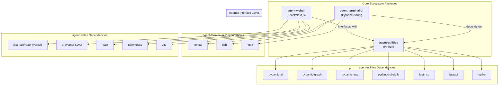

# AGENTS.md

> **Notice:** The `agent-utilities` project uses **Spec-Driven Development (SDD)**.
> - The core project constitution and governance rules are tracked natively in `.specify/memory/constitution.md`.
> - Feature specifications and task lists are tracked in `.specify/specs/` and `.specify/tasks/`.
> This file (`AGENTS.md`) serves as the active system prompt, but the definitive source of truth for architecture and new features is the SDD directory.

## Protocol-First Design Philosophy

<!-- CONCEPT:ORCH-1.0 Unified Intelligence Graph -->
<!-- CONCEPT:ORCH-1.1 Recursive HTN Planning -->
<!-- CONCEPT:ORCH-1.2 Specialist Routing -->
<!-- CONCEPT:ORCH-1.3 Execution & State Safety -->
<!-- CONCEPT:KG-2.0 Active Knowledge Graph -->
<!-- CONCEPT:KG-2.1 Tiered Memory & Rationale -->
<!-- CONCEPT:KG-2.2 Ontology & Epistemics -->
<!-- CONCEPT:KG-2.3 Graph Integrity & Fingerprinting -->
<!-- CONCEPT:AHE-3.0 Agentic Harness -->
<!-- CONCEPT:AHE-3.1 Evaluation & Distillation -->
<!-- CONCEPT:AHE-3.2 Evolution & Discovery -->
<!-- CONCEPT:AHE-3.3 Team & Synergy Optimization -->
<!-- CONCEPT:AHE-3.4 Distributed Agentic Evolution -->
<!-- CONCEPT:ECO-4.0 Unified Tool Interface -->
<!-- CONCEPT:ECO-4.1 MCP & Universal Skills -->
<!-- CONCEPT:ECO-4.2 A2A Network & Consensus -->
<!-- CONCEPT:ECO-4.3 Community Telemetry -->
<!-- CONCEPT:OS-5.0 Agent OS Kernel -->
<!-- CONCEPT:OS-5.1 Security & Auth -->
<!-- CONCEPT:OS-5.2 Resource Scheduling -->

**agent-utilities is a protocol-first, framework-light agent core library.**

### Core Design Principles (Do Not Violate)

- **Agents are protocol-native**: Agents communicate via open standards (ACP, A2A, MCP) not proprietary APIs
- **Protocol logic is isolated**: Protocol adapters are separate from agent business logic
- **Transport-agnostic**: Agents work over any transport (SSE, HTTP, stdio, WebRTC)
- **No framework lock-in**: Avoid opinionated orchestration frameworks like LangChain chains
- **Explicit state over implicit context**: State is explicit and managed, not hidden in global variables
- **Tools and transports are pluggable**: Any tool or transport can be swapped without changing agent code
- **UI-agnostic**: No assumptions about user interface (terminal, web, mobile, voice)
- **JSON Prompting (Prompts-as-Code)**: Favor structured JSON blueprints over free-form Markdown for high-fidelity task specification.
- **Graph-native intelligence**: All agent knowledge, routing decisions, and learned patterns are persisted in the Knowledge Graph — not flat files.
- **Event-driven invalidation**: Caches and indices are invalidated by mutation events, never by TTL. This eliminates stale-cache risks.
- **Feedback-driven learning**: Execution outcomes feed back to Self-Model and TeamConfig, enabling progressive routing improvement without human intervention.
- **Distributed Agentic Evolution (AHE-3.4)**: Agents testing new skills locally automatically bundle and PR them back to `agent-packages` to evolve the collective ecosystem.
- **Community Telemetry (ECO-4.3)**: Evolved artifacts maintain deterministic origin tracking, timestamps, and `Author: Autonomous` safety guardrails.
### When to Use agent-utilities

**Use agent-utilities when you need:**
- Production-grade agent orchestration with resilience and observability
- Protocol-native agents that can communicate across the ecosystem
- Graph-based orchestration with parallel execution
- Knowledge graph integration for long-term memory
- MCP tool integration for external capabilities
- Multi-agent coordination via ACP/A2A
- Dynamic team formation with proven coalition reuse
- Auto-activating capabilities based on task characteristics

**Do NOT use agent-utilities for:**
- Simple single-shot LLM calls (use pydantic-ai directly)
- UI development (use agent-webui or agent-terminal-ui)
- SaaS-specific integrations (build MCP servers instead)
- Opinionated agent personalities (build on top of agent-utilities)

## Tech Stack

- **Language**: Python 3.11+ (per `pyproject.toml` `requires-python`)
- **Core Framework**: [Pydantic AI](https://ai.pydantic.dev) (`pydantic-ai-slim>=1.73.0,<2.0.0`) & [Pydantic Graph](https://ai.pydantic.dev/pydantic-graph/) (`pydantic-graph>=0.1.8`)
- **Tooling**: `requests`, `pydantic` (`>=2.8.2`), `pyyaml`, `python-dotenv`, `fastapi` (`>=0.131.0`), `httpx` (`>=0.28.1`, core), `llama_index` (optional via `embeddings*` extras)
- **Architecture**: Centered around the `create_agent` factory, which supports a **Unified Skill Loading** model (`skill_types`) and automated **Graph Orchestration**.
- **Unified Specialist Discovery**: All specialist agents—prompt-based, MCP-derived, and A2A peers—are consolidated into a single, declarative source of truth: the **Knowledge Graph**.

### Dependency Notes

- **`httpx` is a core dep, not `[mcp]`-gated.** `a2a.py` imports it unconditionally.
- **`pydantic-acp` is used for the ACP adapter.** `acpkit` is NOT a dependency.
- **Defensive upper bounds (`<N+1.0`) on all direct deps** to prevent surprise breakage.
- **Circular import between `agent-utilities[ag-ui]` and `agent-webui`** is resolved cleanly with lockstep version bumps.

## Package Relationships

`agent-utilities` is the core Python engine. It provides the backend server that serves both the `agent-webui` assets and the `agent-terminal-ui` client.

- **Backend (`agent-utilities`)**: Handles LLM orchestration, tool execution, and a multi-protocol interface layer.
- **Web Frontend (`agent-webui`)**: A React application using Vercel AI SDK that provides a cinematic chat interface.
- **Terminal Frontend (`agent-terminal-ui`)**: A Textual-based terminal interface for direct CLI interaction.
- **Communication**: Frontends primarily connect via the Agent Communication Protocol (ACP).
- **Memory System**: Local project memory is managed via `AGENTS.md` (auto-loaded into the system prompt). Native agent memory is powered by a Knowledge Graph.

## Ecosystem Dependency Graph



## Commands

> **Testing Standard:** All pytests are strictly bounded by a **60-second timeout** via `pytest-timeout` (`addopts = --timeout=60`). Any test that sleeps or hangs indefinitely will fail automatically to preserve CI/CD stability.

```bash
# Run tests (unit + integration, excludes live)
uv run pytest -x -v

# Lint & format
uv run ruff check agent_utilities/ tests/
uv run ruff format --check agent_utilities/ tests/

# Type check
uv run mypy agent_utilities/

# Full pre-commit suite
pre-commit run --all-files

# Run the server
uv run python -m agent_utilities.server --debug --provider openai --model-id llama-3.2-3b-instruct
```

## Project Structure

```text
agent-utilities/
├── agent_utilities/          # Core package
│   ├── server/               # FastAPI server (ACP/A2A/MCP/AG-UI endpoints, process lifecycle)
│   ├── base_utilities.py     # Low-level helpers, env expansion, model I/O
│   ├── acp_adapter.py        # ACP adapter (per-session agent_factory)
│   ├── agui_emitter.py       # AG-UI wire format translator for direct graph execution
│   ├── graph/                # Graph orchestration (builder, runner, iter, routing, executor, verification)
│   │   ├── config_helpers.py # Registry Hot Cache (AU-024)
│   │   ├── routing.py        # 3-stage hybrid routing (AU-025, AU-016)
│   │   ├── executor.py       # Capability auto-activation (AU-026)
│   │   └── verification.py   # Self-Model + TeamConfig feedback loop
│   ├── knowledge_graph/      # Unified Intelligence Graph (15-phase pipeline)
│   │   ├── self_model.py     # Persistent Self-Model (AU-016)
│   │   ├── engine_registry.py # TeamConfig promotion/reuse (AU-025)
│   │   ├── ogm.py            # Object-Graph Mapper (AU-013)
│   │   ├── fingerprint.py    # Structural Fingerprint Engine (AU-048)
│   │   ├── graph_validator.py # Graph Integrity Validator (AU-053)
│   │   └── kb/entity_claim_extractor.py # Entity-Claim Extraction (AU-054)
│   ├── protocols/            # Protocol adapters (ACP, A2A, AG-UI)
│   │   ├── a2a_graph_skill.py # PlannerGraphSkill (AU-027)
│   │   └── a2a_config.py     # A2A Config Loader (AU-028)
│   ├── models/               # Pydantic models and schema definitions
│   ├── security/             # JWT + API key auth, secrets client
│   ├── prompts/              # Externalized JSON prompt blueprints (51 files)
│   ├── policies/             # Engineering rule books (YAML frontmatter)
│   ├── capabilities/         # Self-healing: checkpointing, circuit breakers, teams
│   ├── tools/                # Agent tools (developer, workspace, etc.)
│   ├── mcp/                  # MCP server wrappers and agent manager
│   ├── rlm/                  # Recursive Language Model environments
│   ├── sdd/                  # Spec-Driven Development pipelines
│   ├── harness/              # Agentic Harness Engineering toolkit
│   └── patterns/             # Design patterns (prompt chaining, prioritization, exploration)
├── tests/                    # Test suite (1857 tests: unit, integration, knowledge_graph)
├── docs/                     # Comprehensive documentation (24 guides)
├── .specify/                 # SDD specs, tasks, and constitution
├── pyproject.toml            # PEP 621 project metadata
├── .env.example              # Environment variable template
└── AGENTS.md                 # This file (project rules for AI agents)
```

## Architectural Concepts

The system is built on 27 foundational concepts organized into 5 layers:

### Core Infrastructure (AU-001 to AU-011)
Agent creation, graph orchestration, workspace management, protocol adapters, serialization, structured prompts, RLM, capabilities, SDD, tools, and secrets.

### Emergent Architecture (AU-013 to AU-017)
KG Object-Graph Mapper, Swarm Orchestration, Evolutionary Variants, Persistent Self-Model, Global Workspace Attention.

### Design Patterns (AU-018 to AU-022)
Prompt Chaining, Resource Optimization, Evaluation & Monitoring, Task Prioritization, Exploration & Discovery.

### First Principles (AU-024 to AU-027)
Registry Hot Cache, TeamConfig Promotion, AgentCapability Type System, A2A PlannerGraphSkill.

### Unified Specialist & A2A Integration (AU-028 to AU-029)
A2A Config File Loader, Unified Specialist Model (type collapse).
### KG Intelligence (AU-041 to AU-043)
Schema Packs (domain-configurable KG profiles), Backlink-Density Retrieval Boost, KG Eval Capture (regression testing).
### Conductor Orchestration (AU-044 to AU-047)
Conductor Workflow Specification, Execution Visibility Graph, Model Synergy Tracker, Recursive Graph Orchestration.
### UA-Inspired Enhancements (AU-048, AU-053, AU-054)
Structural Fingerprint Engine (incremental KG updates), Graph Integrity Validator (4-tier auto-fix pipeline), Entity-Claim Extraction (MAGMA epistemic completion).
### Wide-Search Extraction & Traceability (AU-056, AU-057)
Wide-Search Orchestration (Pydantic-native batch extraction and hybrid validation), Trace Distillation Error Categorization (Orchestrator vs Worker failure modes).
### Graph Topology Representation (AU-058)
Context-Aware Entity Representations (injects multi-hop structural logic and OWL relationships into vector embeddings).

→ See [docs/overview.md](docs/overview.md) for the full Concept Galaxy diagram and **Concept Map table** (all 58 AU-XXX concepts with descriptions and code paths).

## Detailed Documentation

For comprehensive documentation, see the `docs/` directory:

- **[Overview Map](docs/overview.md)** — The Concept Galaxy connecting all 54 concepts, plus the **Concept Map table** (AU-001 → AU-054)
- **[Conductor Orchestration](docs/conductor-orchestration.md)** — Refined subtasks, visibility graphs, model synergies, recursive scaling (AU-044–AU-047)
- **[Architecture](docs/architecture.md)** — System architecture, protocol adapters, 3-stage hybrid routing
- **[Knowledge Graph](docs/knowledge-graph.md)** — UIG, 15-phase pipeline, OWL reasoning, MAGMA views, graph integrity validation, entity-claim extraction
- **[First Principles](docs/first-principles.md)** — Registry Hot Cache, TeamConfig, AgentCapability, PlannerGraphSkill (AU-024–AU-027)
- **[Emergent Architecture](docs/emergent-architecture.md)** — OGM, Swarm, Variant Selection, Self-Model, Attention (AU-013–AU-017)
- **[Agents & Orchestration](docs/agents.md)** — Specialist registry, MCP loading, event system, governance
- **[Features](docs/features.md)** — Model registry, SDD lifecycle, human-in-the-loop, tool safety, agentic patterns, feedback loops
- **[Configuration](docs/configuration.md)** — All environment variables, config files, and CLI flags
- **[Development Guide](docs/development.md)** — Commands, testing, environment variables, code style, troubleshooting
- **[Creating an Agent](docs/creating-an-agent.md)** — Step-by-step guide using `genius-agent` as template
- **[Building MCP Servers](docs/building-mcp-servers.md)** — Building MCP servers and API wrappers
- **[Registry Cache](docs/registry-cache.md)** — Deep-dive into O(1) specialist lookups
- **[Process Lifecycle](docs/process-lifecycle.md)** — Sidecar cleanup and signal handling
