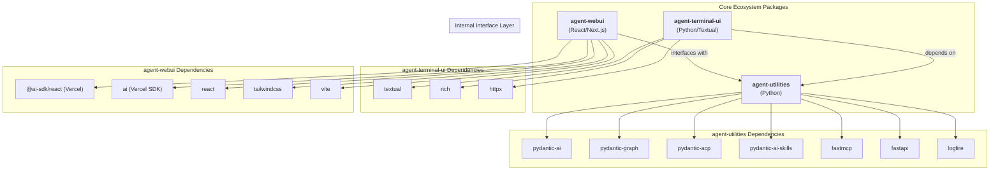
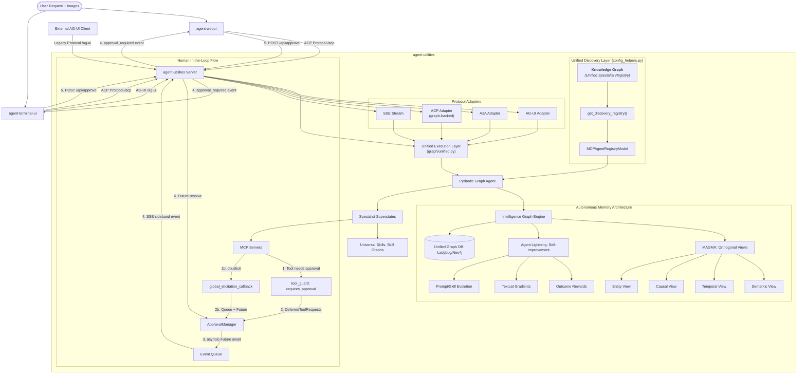
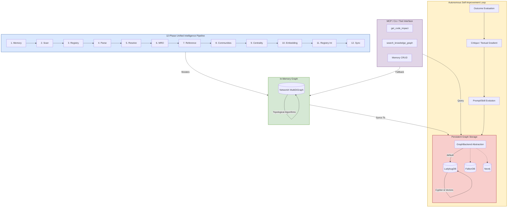
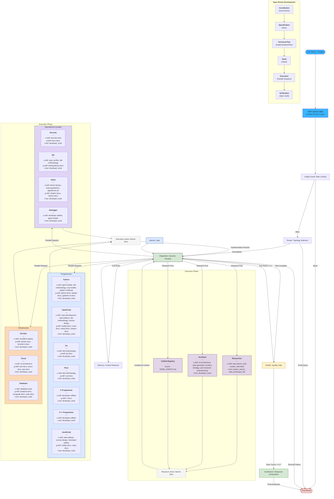
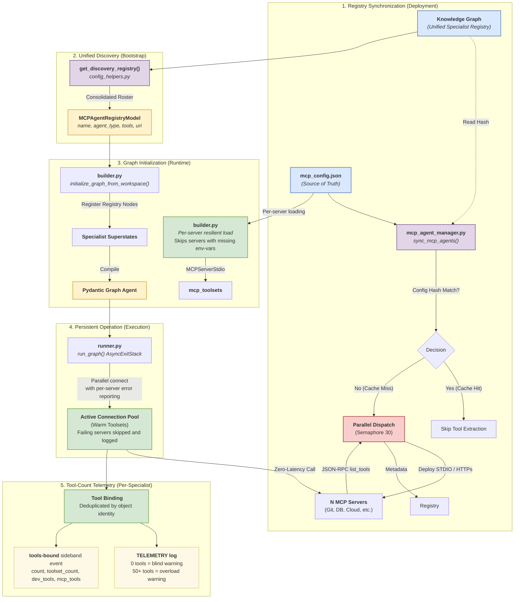
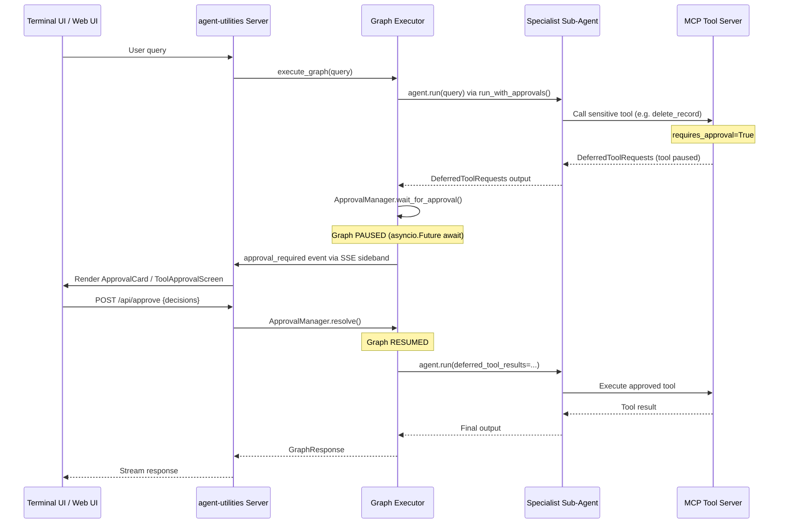

# AGENTS.md

## Protocol-First Design Philosophy

**agent-utilities is a protocol-first, framework-light agent core library.**

### Core Design Principles (Do Not Violate)

- **Agents are protocol-native**: Agents communicate via open standards (ACP, A2A, MCP) not proprietary APIs
- **Protocol logic is isolated**: Protocol adapters are separate from agent business logic
- **Transport-agnostic**: Agents work over any transport (SSE, HTTP, stdio, WebRTC)
- **No framework lock-in**: Avoid opinionated orchestration frameworks like LangChain chains
- **Explicit state over implicit context**: State is explicit and managed, not hidden in global variables
- **Tools and transports are pluggable**: Any tool or transport can be swapped without changing agent code
- **UI-agnostic**: No assumptions about user interface (terminal, web, mobile, voice)
- **JSON Prompting (Prompts-as-Code)**: Favor structured JSON blueprints over free-form Markdown for high-fidelity task specification.

### Protocol Layer Architecture

The framework provides three canonical protocol adapters:

1. **ACP (Agent Communication Protocol)**: Primary protocol for standardized sessions, planning, and streaming
2. **A2A (Agent-to-Agent)**: Peer-to-peer agent communication and coordination
3. **AG-UI**: Legacy streaming interface for backward compatibility with native Pydantic AI clients

All protocol adapters are centralized in `agent_utilities/`:
- `acp_adapter.py`: ACP envelope formatting, session management, streaming
- `a2a.py`: A2A peer discovery, JSON-RPC client, registry management
- Server endpoints: `/acp` (MOUNT), `/a2a` (MOUNT), `/ag-ui` (POST)

### When to Use agent-utilities

**Use agent-utilities when you need:**
- Production-grade agent orchestration with resilience and observability
- Protocol-native agents that can communicate across the ecosystem
- Graph-based orchestration with parallel execution
- Knowledge graph integration for long-term memory
- MCP tool integration for external capabilities
- Multi-agent coordination via ACP/A2A

**Do NOT use agent-utilities for:**
- Simple single-shot LLM calls (use pydantic-ai directly)
- UI development (use agent-webui or agent-terminal-ui)
- SaaS-specific integrations (build MCP servers instead)
- Opinionated agent personalities (build on top of agent-utilities)

## Tech Stack & Architecture
- **Language**: Python 3.10+
- **Core Framework**: [Pydantic AI](https://ai.pydantic.dev) & [Pydantic Graph](https://ai.pydantic.dev/pydantic-graph/)
- **Tooling**: `requests`, `pydantic`, `pyyaml`, `python-dotenv`, `fastapi`, `llama_index`
- **Architecture**: Centered around the `create_agent` factory, which has been modernized to support a **Unified Skill Loading** model (`skill_types`) and automated **Graph Orchestration**.
- **Unified Specialist Discovery**: All specialist agents—prompt-based, MCP-derived, and A2A peers—are consolidated into a single, declarative source of truth: the **Knowledge Graph**. This unified registry is dynamically built from prompt frontmatter and MCP configurations, ensuring consistent registration, tag-prompting, and tool binding across the entire orchestration layer.
- **Key Principles**:
    - Functional and modular utility design.
    - Standardized workspace management (`main_agent.md`, `Knowledge Graph`).
    - **Elicitation First**: Robust support for structured user input during tool calls, bridging MCP and Web UIs.

## Package Relationships
`agent-utilities` is the core Python engine. It provides the backend server that serves both the `agent-webui` assets and the `agent-terminal-ui` client.
- **Backend (`agent-utilities`)**: Handles LLM orchestration, tool execution, and a multi-protocol interface layer.
- **Web Frontend (`agent-webui`)**: A React application using Vercel AI SDK that provides a cinematic chat interface.
- **Terminal Frontend (`agent-terminal-ui`)**: A Textual-based terminal interface for direct CLI interaction. Achieves feature parity with **Claude Code** through:
  - **Keyboard Shortcuts**: `Ctrl+L` (Clear Log), `Ctrl+O` (Toggle Sidebar), `Alt+P` (Model Picker), `Alt+T` (Extended Thinking), `Ctrl+R` (History Search).
  - **Input Prefixes**: `!` for direct Bash execution, `@` for fuzzy file mentions.
  - **Slash Commands**: Comprehensive registry including `/compact`, `/memory`, `/diff`, `/recap`, `/fast`, and `/add-dir`.
- **Communication**: Frontends primarily connect via the Agent Communication Protocol (ACP) for standardized sessions, planning, and streaming across the ecosystem.
- **Memory System**: Local project memory is managed via `AGENTS.md` and `MEMORY.md`.
  - `AGENTS.md`: Manual project rules, build commands, and style guidelines (Claude Code parity for `CLAUDE.md`).
  - `MEMORY.md`: Automatically maintained agent memory and state.
  - Both are auto-loaded into the system prompt by the `agent-utilities` backend.

## Ecosystem Dependency Graph



## Core Architecture Diagram


## The Unified Intelligence Graph (UIG)
The ecosystem leverages a **Unified Intelligence Graph** (UIG) that bridges long-term agent memory with deep structural codebase awareness and cross-domain research knowledge. This single, intelligence-driven cognitive substrate allows agents to reason simultaneously about specialists, tools, memory, code, and external standard operating procedures.

### Core Components
- **Autonomous Memory & Reasoning**:
    - **Episodes**: Discrete interaction units (e.g., a specific tool run or chat turn).
    - **Reasoning Traces**: Step-by-step "chains of thought" stored as linked nodes.
    - **Reflections & Goals**: High-level summaries and objective nodes that guide future planning.
- **Research Knowledge Base (KB)**:
    - **Topics & Concepts**: Domain-specific hubs (e.g., "Medical Oncology") linked to atomic knowledge units ("p53 gene").
    - **Evidence & Sources**: Verifiable claims grounded in original documents (Sources) with metadata like DOI and authors.
    - **Cross-Domain Emergence**: Unrelated topics (e.g., Chemistry and Medicine) automatically link through shared concepts or molecular pathways.
- **Temporal Dynamics & Importance**:
    - **Importance Scoring**: Every node has an `importance_score` (0.0 - 1.0) calculated via PageRank centrality.
    - **Temporal Decay**: Ebbinghaus-style decay reduces the importance of old memories over time, allowing the graph to "forget" low-signal noise.
    - **Hub Node Protection**: Critical foundational concepts can be marked as `is_permanent` to prevent automated pruning.
- **Unified Discovery Library**:
    - **Tools**: Dynamic registry of MCP tools, A2A agents, and internal skill graphs.
    - **Prompts**: Versioned system prompts and templates discovered via semantic search.
- **Governance & Policies**:
    - **Guardrails**: Graph-native policies that enforce constraints (e.g., "Always use TDD").
    - **SOP Execution**: Process flows and step sequences retrieved from the KG to guide agent behavior.

### Maintenance & Scalability
The `GraphMaintainer` autonomously manages the graph's health:
1. **Validation**: Pydantic-based schema validation for all entity types.
2. **Pruning**: Automated detached deletion of low-importance, non-permanent nodes.
3. **Consolidation**: Distilling old chat episodes into high-level summaries.
4. **Deduplication**: Merging similar concepts via semantic embedding similarity.

---

## Knowledge Graph Architecture



### Unified Intelligence Pipeline (12 Phases)
To provide robust cross-repository intelligence, the graph is built using a sequential, topological DAG pipeline. Each phase adds a layer of intelligence:

| Phase | Name | Purpose |
|-------|------|---------|
| 1 | **Memory** | Hydrates existing state (Nodes/Edges) from **LadybugDB** to maintain continuity. |
| 2 | **Scan** | Walks the filesystem, respects `.gitignore`, and identifies all source code files. |
| 3 | **Registry** | Ingests `prompts/*.md` and MCP server definitions into the **Knowledge Graph** as specialist nodes. |
| 4 | **Parse** | AST parsing (**tree-sitter**) to extract symbols (Classes, Functions, Imports) from code. |
| 5 | **Resolve** | Maps raw import strings to actual `File` or `Symbol` nodes across the workspace. |
| 6 | **MRO** | Resolves Method Resolution Order and inheritance chains for OO structures. |
| 7 | **Reference** | Builds the call graph by identifying where specific symbols are referenced or invoked. |
| 8 | **Communities** | Clusters nodes into tightly-coupled modules using **Louvain** topological clustering. |
| 9 | **Centrality** | Runs **PageRank** analysis to identify critical path "God Objects" and core utilities. |
| 10 | **Embedding** | Generates semantic vector embeddings via LM Studio (`text-embedding-nomic-embed-text-v2-moe`) for hybrid search. |
| 11 | **Registry Int**| Maps MCP tools and agent skills directly to the code structures that implement them. |
| 12 | **Sync** | Projects the NetworkX graph into the persistent **LadybugDB** Cypher store. |
| 13 | **Knowledge Base** | Compiles articles, concepts, and facts into the **LLM Knowledge Base** layer. |
| 14 | **Workspace Sync** | Clones repos from `workspace.yml` using **repository-manager** and triggers auto-ingestion. |

### Operational Reliability & Coordination
The ecosystem integrates advanced operational primitives to ensure long-term autonomy and resilient multi-agent collaboration.

| Capability | Logic | Graph Integration |
| :--- | :--- | :--- |
| **Stuck Loop Detection** | Detects repetitive tool calls, alternating patterns, and no-op loops. | Records `SelfEvaluationNode` for long-term pattern auditing. |
| **Lifecycle Hooks** | Unified PRE/POST_TOOL_USE and BEFORE/AFTER_RUN hooks for auditing. | Auto-traces every tool call as a `ToolCallNode` in the graph. |
| **Context Warnings** | Proactively warns model as token budget nears 70% (URGENT) and 90% (CRITICAL). | Records critical context pressure events in the graph memory. |
| **Output Eviction** | Intercepts massive tool outputs (>80k chars) and moves them to KB. | Stores full content as `RawSource` node; leaves preview in history. |
| **Conversation Checkpoints**| Full conversation snapshots (checkpoints) at tool/turn boundaries. | Persisted as `CheckpointNode` for cross-process fork/rewind. |
| **Agent Teams** | Shared task management and P2P messaging across agent groups. | Persists `TeamNode` and `TaskNode` with assigned relationships. |
| **Governance** | Policies and guardrails discovered from the graph during planning. | `PolicyNode` linked to topics and agents. |
| **Process Flows** | Standard Operating Procedures (SOPs) fetched and executed dynamically. | `ProcessFlowNode` and `ProcessStepNode` sequences. |
| **Output Styles** | Dynamic response style discovery (concise, formal, etc.) via KB. | Styles are stored as `Article` nodes in `kb:output-styles`. |

### Agent Communication Protocol (ACP)
All inter-agent coordination (Teams) and frontend communication (TUI/Web) leverages the **Agent Communication Protocol (ACP)**. This provides a standardized message bus for sideband events (approvals, logs, status) and P2P message routing between agent specialists.

### Memory & Code Lifecycle (CRUD + Analysis)
Agents interact with this layer using the `knowledge_tools` suite to manage memory, reason about the codebase, and manage the ecosystem state.

| Operation | Tool | Trigger Criteria |
| :--- | :--- | :--- |
| **CREATE MEMORY** | `add_knowledge_memory` | When a new **project fact**, **user preference**, or **permanent decision** is established. |
| **READ MEMORY** | `get_knowledge_memory` | When the agent needs the **full context** or timestamp for a historical decision/memory. |
| **SEARCH** | `search_knowledge_graph` | **Hybrid Search**: Performs a keyword and topological search across agents, tools, code, and memories. |
| **IMPACT** | `get_code_impact` | **Topological Analysis**: Before making changes, analyzes which symbols or files will be affected. |
| **UPDATE MEMORY** | `update_knowledge_memory`| When a previous memory is found to be **outdated, incomplete, or refined**. |
| **DELETE MEMORY** | `delete_knowledge_memory`| When a memory is proven **false, irrelevant, or superseded**. |
| **LINK** | `link_knowledge_nodes` | When a relationship is discovered between disparate items (e.g., linking a memory to a code symbol). |
| **SYNC** | `sync_feature_to_memory`| Automatically captures the full **SDD lifecycle** (Spec, Plan, Tasks) after a feature is completed. |
| **HEARTBEAT** | `log_heartbeat` | Agent telemetry logging to the `Heartbeat` node schema. |
| **CLIENT/USER** | `create_client` / `create_user` / `save_preference` | Creating user profiles and preferences directly into the graph schema. |
| **CHAT/CRON** | `save_chat_message` / `log_cron_execution` | Storing execution and dialog logs, maintained dynamically by background pruning tasks. |
| **REASONING** | `ingest_episode` / `record_outcome` | Capturing reasoning traces and evaluating outcomes for self-improvement. |
| **MAGMA** | `retrieve_orthogonal_context` | Policy-guided retrieval across Semantic, Temporal, Causal, and Entity views. |
| **SPAWNING** | `spawn_specialized_agent` | Creating dynamic sub-agents with curated toolsets for complex tasks. |

### Example: Research Knowledge Base
The UIG can be used to store and reason over complex research domains. For example, in **Medical Oncology**:
1.  **Topic**: `Medical Oncology` (Hub node).
2.  **Concept**: `p53 Gene` linked to `Medical Oncology`.
3.  **Source**: A PubMed paper (`Nature 2026`) linked to `p53 Gene` via `:SUPPORTS`.
4.  **Evidence**: A claim ("p53 mutations drive apoptosis failure") linked to the `Source`.
5.  **Person**: The researcher who authored the paper linked via `:AUTHORED`.

Because the graph is domain-agnostic, a separate topic like **Environmental Chemistry** can link to the same `p53 Gene` concept if a toxin affects the same pathway, surfacing **hidden cross-domain relationships** automatically.

### MAGMA-Inspired Orthogonal Reasoning Views
The graph engine supports policy-guided retrieval across four orthogonal views, ensuring the agent has the right context for the right task:
- **Semantic View**: Traditional RAG/vector search for conceptual similarity.
- **Temporal View**: Episodic memory retrieval based on chronological sequences and Ebbinghaus-style temporal decay.
- **Causal View**: Reasoning traces and "Why" links (e.g., `ReasoningTrace -> ToolCall -> OutcomeEvaluation`).
- **Entity View**: Structural knowledge of People, Organizations, Locations, and Code Symbols.

### Agent Lightning Self-Improvement Loop
The system autonomously refines its own performance through a continuous feedback loop:
1. **Outcome Evaluation**: Every significant episode is evaluated for success (Reward) using `record_outcome`.
2. **Critique (Textual Gradients)**: Unsuccessful episodes generate "textual gradients" (Critiques) identifying failure points.
3. **Prompt Evolution**: Critiques are used to generate improved versions of system prompts (`SystemPrompt` nodes) via `optimize_prompt`.
4. **Skill Spawning**: The agent can propose and persist new Python skills (`ProposedSkill`) based on observed needs.

### Unified Resource Management (CallableResource)
All external resources are first-class graph nodes, allowing the agent to reason over its own capabilities:
- **MCP_TOOL**: Tools discovered from external MCP servers.
- **A2A_AGENT**: Remote agent peers reachable via fastA2A.
- **AGENT_SKILL**: Local Python skills defined with YAML/Markdown frontmatter.
- **SPAWNED_AGENT**: Dynamically created sub-agent instances with minimal, curated toolsets.

### Governance & Operational Workflows
The Knowledge Graph now serves as the unified registry for project governance (Policies) and operational workflows (Process Flows). This integration allows the agent to reason over established SOPs and guardrails during the planning and execution phases.

- **Policies**: Declarative constraints and guardrails (e.g., "Always use TDD", "No destructive operations on production"). Policies are grounded in Knowledge Base topics and applied based on the current context.
- **Process Flows**: Procedural step-by-step execution guides (SOPs) retrieved from the KG. The Planner agent discovers relevant flows and can choose to follow them for consistent execution.
- **Dynamic Execution**: The `LoadAndExecuteProcessFlow` node (`process_executor`) allows the graph to transition into a guided execution mode based on a retrieved SOP.

### Memory Maintenance & Pruning
The `GraphMaintainer` class (`maintenance.py`) runs several background maintenance operations using the unified `GraphBackend.prune()` interface:
1. **Embedding Enrichment**: Vectorizes unembedded content via LM Studio.
2. **Cron Log Pruning**: Deletes successful logs older than 30 days.
3. **Chat Summarization**: Compresses old threads into `ChatSummary` nodes.
4. **Importance Scoring**: PageRank-based centrality scoring for all nodes.
5. **Temporal Decay**: Ebbinghaus-style 5%/day decay on importance scores.
6. **Memory Consolidation**: Distills old episodes into semantic summaries.
7. **Low-Signal Pruning**: Removes nodes below importance threshold (0.05) using the backend-native pruning logic.
8. **Knowledge Base Maintenance**: Archiving and health checks for the KB layer.

### Backend Abstraction Layer
All graph storage is routed through the `GraphBackend` ABC (`backends/base.py`), providing **hot-swappable** database backends with unified methods for execution, schema creation, and **functional pruning**.

**Supported Backends:**
| Backend | Status | Connection | Use Case |
|---|---|---|---|
| **LadybugDB** | Full (default) | File path (`knowledge_graph.db`) | Embedded, zero-config, schema-enforced Cypher |
| **FalkorDB** | Stub | `host:port` (Redis protocol) | Distributed, high-throughput graph workloads |
| **Neo4j** | Stub | `bolt://host:port` | Enterprise, ACID-compliant graph databases |

**Factory Usage:**
```python
from agent_utilities.knowledge_graph.backends import create_backend

# Default: LadybugDB at knowledge_graph.db
backend = create_backend()

# Explicit backend selection
backend = create_backend(backend_type="neo4j", uri="bolt://prod-neo4j:7687")
backend = create_backend(backend_type="falkordb", host="redis-host", port=6380)

# With db_path for LadybugDB
backend = create_backend(db_path="/data/agent.db")
```

**Environment Variables:**
| Variable | Description | Default |
|---|---|---|
| `GRAPH_BACKEND` | Backend type: `ladybug`, `falkordb`, `neo4j` | `ladybug` |
| `GRAPH_DB_PATH` | File path for LadybugDB | `knowledge_graph.db` |
| `GRAPH_DB_HOST` | Host for FalkorDB/Neo4j | `localhost` |
| `GRAPH_DB_PORT` | Port for FalkorDB (6379) or Neo4j (7687) | varies |
| `GRAPH_DB_URI` | Full URI for Neo4j | `bolt://localhost:7687` |
| `GRAPH_DB_USER` | Username for Neo4j | `neo4j` |
| `GRAPH_DB_PASSWORD` | Password for Neo4j | `password` |
| `GRAPH_DB_NAME` | Database name for FalkorDB | `agent_graph` |

**Architecture:** All consumers (engine, pipeline phases, server, MCP manager, registry builder) use `create_backend()` or receive a shared `backend` instance via dependency injection. No module directly imports a specific backend class — the factory handles selection based on config/env.

### Knowledge Base (KB) Layer
An LLM-maintained personal wiki system built directly into the knowledge graph — replacing Obsidian as the "IDE frontend" with a graph-native, agent-queryable alternative.

**Architecture Flow:**
```
Raw Sources (PDF/DOCX/EPUB/MD/URL)
    ↓ KBDocumentParser (vector-mcp pattern: SimpleDirectoryReader + chunking)
DocumentChunks (hash-deduplicated)
    ↓ KBExtractor (Pydantic AI: result_type=ExtractedArticle)
Validated Articles / Facts / Concepts (type-safe)
    ↓ KBIngestionEngine
Graph Nodes: KnowledgeBase → Article → KBConcept / KBFact / KBIndex
    ↓ Phase 13 / Backend Sync
Persistent Storage (LadybugDB / Neo4j / FalkorDB)
    ↓ KB Tools (list, search, get, health, archive, export)
Agent Q&A and Knowledge Queries
```

**KB Node Hierarchy:**
- `KnowledgeBase` (namespace root, e.g., `kb:pydantic-ai-docs`) — top-level namespace for agent discoverability
  - `Article` — compiled wiki article with full markdown content and embedding
  - `KBConcept` — key concepts extracted from articles (linked via `ABOUT`)
  - `KBFact` — atomic facts with certainty scores (linked via `CITES` to sources)
  - `RawSource` — original ingested documents (linked via `COMPILED_FROM`)
  - `KBIndex` — auto-maintained discovery index with suggested queries (linked via `INDEXES_KB`)

**Agent Discoverability:** Agents call `list_knowledge_bases()` to get a flat list of all KBs with topics, article counts, and example queries — then drill in with `search_knowledge_base_tool()` or `get_kb_article()`.

**Supported Source Formats:**
| Format | Parser | Notes |
|---|---|---|
| Markdown (`.md`) | Native | Primary format, skill-graphs use this |
| PDF (`.pdf`) | pypdf / LlamaIndex | Optional dep |
| Word (`.docx`) | python-docx | Optional dep |
| EPUB (`.epub`) | ebooklib | Optional dep |
| HTML / Web-clip | BeautifulSoup + httpx | URL or local file |
| Skill-Graph dirs | SKILL.md frontmatter + reference/ | Auto-detected |

**KB Tools (8 total):**
| Tool | Description |
|---|---|
| `ingest_knowledge_base` | Ingest directory, file, URL, or skill-graph into a named KB |
| `list_knowledge_bases` | List all KBs with status, article counts, and suggested queries |
| `search_knowledge_base_tool` | Hybrid keyword search within a specific or all KBs |
| `get_kb_article` | Retrieve full markdown content of a specific article |
| `update_knowledge_base` | Incrementally re-ingest changed files (hash-based, cheap) |
| `run_kb_health_check` | LLM-backed audit: contradictions, orphans, gaps, suggestions |
| `archive_knowledge_base` | Compress low-importance articles to summary-only (saves memory) |
| `export_knowledge_base` | Export to Obsidian-compatible markdown with YAML frontmatter |

**Maintenance Operations (added to GraphMaintainer):**
- **KB Article Compression** (op 8): Articles > `kb_archive_age_days` old + importance < `kb_archive_importance_threshold` → summary-only
- **KB Index Refresh** (op 9): Weekly refresh of `KBIndex` nodes for KBs with new/changed articles
- **KB Contradiction Resolution** (op 10): Scan `CONTRADICTS_KB` edges → flag for LLM review

**PipelineConfig KB Fields:**
```python
enable_knowledge_base: bool = True           # Enable Phase 13
kb_auto_ingest_skill_graphs: bool = False    # Auto-ingest enabled skill-graphs at startup
kb_chunk_size: int = 1024                    # Tokens per document chunk (matches vector-mcp)
kb_extraction_model: Optional[str] = None   # LLM model for extraction (None = default)
kb_archive_age_days: int = 180              # Age threshold for archiving
kb_archive_importance_threshold: float = 0.3 # Importance threshold for compression
```

**Visualization:**
- **agent-webui**: `/kb` route — KB browser sidebar, article viewer, D3.js minimap of article→concept links
- **agent-terminal-ui**: `\kb list`, `\kb search <query>`, `\kb article <title>`, `\kb health` commands

## Graph Orchestration Architecture



> **Note:** MCP ecosystem agents (AdGuard, Jellyfin, Ansible Tower, etc.) are dynamically spawned as `CallableResource` nodes in the Knowledge Graph. They are discovered at runtime from `mcp_config.json` and do not appear in this static diagram.

## MCP Loading & Registry Architecture



## Spec-Driven Development (SDD) Lifecycle
The `agent-utilities` ecosystem implements a high-fidelity orchestration pipeline based on Spec-Driven Development. This lifecycle ensures technical precision, architectural consistency, and parallel execution safety.

### Phase 1: Governance & Specification
1.  **Project Start**: The **Planner** triggers `constitution-generator` to establish `constitution.md` (governance rules, tech stack).
2.  **Feature Definition**: The **Planner** triggers `spec-generator` to produce `spec.md` (user stories, acceptance criteria, requirements).
3.  **Technical Approach**: The **Planner** triggers `task-planner` to generate `plan.md` (technical approach) and `tasks.md` (inter-dependent graph of tasks).
4.  **Baseline Testing**: Before implementation, the **Planner** triggers `first_run_tests` to establish a verified baseline of the current workspace state.

### Phase 2: Parallel Execution
The **Dispatcher** reads the `tasks.md` and routes sub-tasks to specialized agents.
- **Dependency Tracking**: Tasks are executed in parallel if they have no unmet dependencies.
- **Context Isolation**: Each specialist receives only relevant context for its assigned task.
- **`[P]` Markers**: The `Task.parallel: bool` field and `[P]` markdown markers enable explicit parallel-wave control.
- **Agentic Manual Testing**: Specialists can trigger `run_manual_test` to verify behaviors that are difficult to automate (e.g. CLI output, UI state).

### Phase 3: Continuous Verification
1.  **Quality Gate**: After execution, the **Verifier** node uses `spec-verifier` to evaluate the results against the original `spec.md`.
2.  **Self-Correction**: If verification fails (score < 0.7), feedback is injected back into the **Planner** for targeted re-planning and execution.
3.  **Linear Walkthroughs**: Upon success, the agent triggers `generate_walkthrough` to produce a step-by-step documentation of the implementation.

### Phase 4: Long-Term Memory Evolution
1.  **Interactive Explanations**: For complex logic, the agent generates `interactive-explain` artifacts (HTML/JS) to aid human understanding.
2.  **Memory Capture**: The `sync_feature_to_memory` tool is invoked to summarize the `Spec`, `ImplementationPlan`, and execution results.
2.  **Historical Reference**: Future planning sessions can search the Knowledge Graph to retrieve technical context from previous related work.

### SDD Model Flow & Persistence

| Phase | Input Model | Output Model | Workspace Artifact | Tool / Skill |
| :--- | :--- | :--- | :--- | :--- |
| **Governance** | - | `ProjectConstitution` | `agent_data/constitution.json` | `constitution-generator` |
| **Requirements** | `ProjectConstitution` | `Spec` | `agent_data/specs/{id}.json` | `spec-generator` |
| **Architecture** | `Spec` | `ImplementationPlan` | `agent_data/plans/{id}.json` | `task-planner` |
| **Planning** | `ImplementationPlan` | `Tasks` | `agent_data/tasks/{id}.json` | `task-planner` |
| **Execution** | `Tasks` | `Tasks` (Updated) | `agent_data/tasks/{id}.json` | `sdd-implementer` |
| **Verification** | `Tasks` + `Spec` | `ValidationResult` | - | `spec-verifier` |

### SDD Skills Reference
| Skill | Group | Purpose | Bound To |
|:------|:------|:--------|:---------|
| `constitution-generator` | sdd | Establish project governance and stack. | Planner |
| `spec-generator` | sdd | Create feature-level specifications. | Planner, Architect, Project Manager |
| `task-planner` | sdd | Generate technical implementation plans with `[P]` markers. | Planner, Coordinator |
| `spec-verifier` | sdd | Evaluate results against specifications. | Verifier, QA Expert, Critique |
| `sdd-implementer` | sdd | Execute tasks from the generated plan. | Specialist Programmers |
| `workspace-manager` | sdd | Bootstrap and manage `.specify/` directory layout. | Planner |
| `manual-testing-enhanced` | sdd | exploratory testing and manual verification. | QA Expert, Verifier |
| `code-walkthrough` | docs | Generates linear codebase documentation. | Document Specialist |
| `interactive-explain` | docs | Generates interactive HTML explanations. | Document Specialist |

### Spec-Kit Command Parity
| Spec-Kit Command | Agent-Utilities Tool | Description |
| :--- | :--- | :--- |
| `speckit init` | `setup_sdd` | Initializes the `agent_data` structure. |
| `speckit spec` | `save_spec` / `export_sdd_to_markdown` | Creates and mirrors specifications. |
| `speckit tasks` | `save_tasks` / `export_sdd_to_markdown` | Creates and mirrors task lists. |
| `speckit implement` | `get_sdd_parallel_batches` | Identifies parallel execution opportunities. |
| `speckit verify` | `spec-verifier` skill | Audits implementation against specification. |

**Extended Features:**
- **Markdown Sync**: All structured models (JSON) can be mirrored to Markdown for human review using `export_sdd_to_markdown`. Default output is Markdown; JSON is supported.
- **Parallel Markers**: Support for the `[P]` marker in Markdown task lists. Use `import_sdd_from_markdown` to ingest manual changes.
- **File Collision Safety**: Automatic detection of file path overlaps to prevent race conditions during parallel execution.

## Hierarchical State Machine (HSM) Architecture

The graph orchestration system is a **Hierarchical State Machine**. It follows the same formal model used in robotics, game engines, UML statecharts, and SCXML workflow engines.

### HSM Level Mapping
```
Level 0: Root Graph (N Orchestration Nodes)
├── usage_guard → router → dispatcher → memory_selection → dispatcher
├── researcher, architect, verifier (discovery/validation)
├── parallel_batch_processor → expert_executor (fan-out)
├── research_joiner, execution_joiner (fan-in)
├── verifier → synthesizer → END (quality gate + response composition)
└── planner (re-planning on verification failure)

Level 1: Superstates - Specialist Agents
├── Specialist Roster (Dynamically discovered from the **Knowledge Graph**)
│   Each loads: name-matched prompt + discovered capabilities + mapped MCP toolsets
│   Supports: 'prompt' (local), 'mcp' (stdio), and 'a2a' (remote) agent types
└── Unified Execution: Dynamic routing based on registry-provided metadata

Level 2: Substates - Agent Internal Loop
└── Pydantic AI Agent.run() = UserPromptNode → ModelRequestNode → CallToolsNode → ...
    Multi-turn tool iteration (max 3 iterations per specialist)

Level 3: Leaf States - MCP Tool Execution
└── Each tool call invokes an MCP server subprocess via stdio/HTTP
    Atomic operations: get_project(), list_branches(), run_cypher_query(), etc.
```

### Concept Mapping
| agent-utilities Concept        | HSM Concept            | Details                                           |
|--------------------------------|------------------------|---------------------------------------------------|
| Root graph                     | Root state machine     | N Orchestration nodes                             |
| Router → Dispatcher            | Top-level transitions  | Router generates plan, dispatcher executes        |
| Planner (re-plan only)         | Re-entry transition    | Invoked by verifier on score < 0.4                |
| Synthesizer                    | Terminal action        | Composes final response from the results          |
| `NODE_SKILL_MAP` agents        | Superstates (L1)       | N hardcoded domains                               |
| Dynamic agents (unified)       | Superstates (L1)       | N from `discover_all_specialists()` (MCP + A2A)   |
| `_execute_specialized_step()`  | Enter superstate       | Loads prompt + skills + deduplicated MCP toolsets |
| `Agent.run()` internal loop    | Substates (L2)         | Model request/tool cycles                         |
| MCP tool call (stdio)          | Leaf states (L3)       | Atomic operations                                 |
| Verifier feedback loop         | Re-entry transition    | Parent re-dispatches to child                     |
| Circuit breaker (open)         | Guard condition        | Blocks entry to failed state                      |
| `node_transitions` guard       | Watchdog timer         | Force-terminates after 50 transitions             |
| Memory-first dispatch          | Entry action           | Enriches context before first step                |
| Research-before-execution      | Phase ordering         | Discovery completes before execution              |
| Process-Guided Planning        | Knowledge Influx        | KG-native SOPs injected into Planner context      |
| Policy Guardrails              | Transition Guard       | Policies enforce constraints at state boundaries |

### HSM Design Principles
1. **Treat subgraphs as macro-states.** A specialist should behave as a single opaque state to the dispatcher. Define clear input/output contracts.
2. **Scale horizontally, not vertically.** Add new subgraphs (new MCP servers, new agent packages) instead of adding nodes to existing graphs.
3. **Plan enhancements by level.** Routing concern → L0. Domain behavior → L1 specialist. Tool-level fix → L3 MCP.
4. **Use types as boundaries.** `ExecutionStep`, `GraphPlan`, `GraphResponse`, and `MCPAgent` are the boundary contracts between levels.
5. **Defer flattening.** Never visualize the full system as one graph. Visualize one level at a time.
6. **The growth test:** If tempted to add more nodes to a graph, ask whether you should add a new state machine instead.

### Behavior Tree (BT) Concepts
The graph incorporates key Behavior Tree patterns **inside** the HSM structure.

| agent-utilities Concept | BT Concept | Details |
|---|---|---|
| `_attempt_specialist_fallback`, `static_route_query` | Selector (priority/fallback) | Specialist fallback chain, static route before LLM |
| `dispatcher_step`, `assert_state_valid` | Sequence (fail-fast) | Plan step execution with cursor |
| `_execute_dynamic_mcp_agent`, `expert_executor_step` | Retry decorator | Tool-level retries with exponential backoff |
| `asyncio.wait_for()` in specialist execution | Timeout decorator | Per-node timeout via `ExecutionStep.timeout` |
| `check_specialist_preconditions` | Precondition guard | Check server health before entering specialist |
| `assert_state_valid()` | Boundary re-evaluation | State invariants at dispatcher and verifier boundaries |

**Design rule:** If logic chooses between options → BT concept. If logic defines long-lived phases → HSM concept.

## Human-in-the-Loop & Tool Safety

### Universal Tool Guard (Global Safety)
By default, `agent-utilities` implements a **Universal Tool Guard** that automatically intercepts sensitive tool calls from MCP servers and graph specialist sub-agents.

Any tool matching specific "danger" patterns (e.g., `delete_*`, `write_*`, `execute_*`, `drop_*`) is flagged with pydantic-ai's native `requires_approval=True` attribute. When a specialist sub-agent calls a flagged tool, the graph **pauses at that exact node** and waits for explicit user approval before continuing.

**Key Features:**
- **Zero Config**: Protections are applied automatically based on tool names via `apply_tool_guard_approvals()`.
- **True Pause-and-Resume**: The graph does NOT terminate on approval requests. It suspends via `asyncio.Future` and resumes when the user responds.
- **Protocol-Agnostic**: Works identically across AG-UI (web UI), terminal UI, ACP, and SSE protocols.
- **Persistent Choices**: When using ACP, users can select "Always Allow" / "Always Deny" for specific tools.
- **Customizable**: Disable with `TOOL_GUARD_MODE=off` or `DISABLE_TOOL_GUARD=True`.

**Sensitive Patterns:**
`delete`, `write`, `execute`, `rm_`, `rmdir`, `drop`, `truncate`, `update`, `patch`, `post`, `put`, `create`, `add`, `upload`, `set`, `reset`, `clear`, `revert`, `replace`, `rename`, `move`, `start`, `stop`, `restart`, `kill`, `terminate`, `reboot`, `shutdown`, `git_*`.

### Approval Manager Architecture



### Approval Manager Components

| Component | File | Purpose |
|---|---|---|
| `ApprovalManager` | `approval_manager.py` | asyncio.Future registry for pause/resume |
| `run_with_approvals()` | `approval_manager.py` | Transparent approval loop wrapping `agent.run()` |
| `global_elicitation_callback()` | `approval_manager.py` | MCP `ctx.elicit()` pause/resume callback |
| `apply_tool_guard_approvals()` | `tool_guard.py` | Flags sensitive tools with `requires_approval=True` |
| `/api/approve` | `server.py` | REST endpoint to resolve pending approvals |
| `_approval_manager` | `server.py` | Singleton `ApprovalManager` shared with graph |
| `ApprovalCard.tsx` | `agent-webui` | Web UI approval component |
| `ToolApprovalScreen` | `agent-terminal-ui` | Terminal UI modal for tool approval |

### How to use Elicitation
Elicitation is used when an MCP tool requires additional structured input or confirmation from the user. Both tool approval and MCP elicitation use the same underlying `ApprovalManager` pause/resume mechanism.

**In MCP Tools (FastMCP):**
```python
from fastmcp import FastMCP, Context

mcp = FastMCP("MyServer")

@mcp.tool()
async def book_table(restaurant: str, ctx: Context) -> str:
    confirmation = await ctx.elicit(
        message=f"Please confirm booking for {restaurant}",
        schema={
            "type": "object",
            "properties": {
                "guests": {"type": "integer", "description": "Number of guests"},
                "time": {"type": "string", "description": "Time of booking"}
            },
            "required": ["guests", "time"]
        }
    )
    if confirmation.get("_action") == "cancel":
        return "Booking cancelled by user."
    return f"Booked for {confirmation['guests']} at {confirmation['time']}"
```

**Flow:** MCP tool calls `ctx.elicit` → `global_elicitation_callback()` pushes event to sideband queue + creates `asyncio.Future` → Backend streams to UI → User submits `POST /api/approve` → `ApprovalManager.resolve()` unblocks MCP tool.

## The Complete Execution Journey

### Phase 1: Ingress & Protocol Handling
1. **Entry**: A user query (text + optional images) arrives via any supported protocol: AG-UI (`/ag-ui`), ACP (`/acp`), SSE (`/stream`), or REST (`/api/chat`).
2. **Unified Execution**: All protocols funnel through the same graph engine via `graph/unified.py`.
3. **State Initialization**: A fresh `GraphState` is initialized with the consolidated `query_parts`.

### Phase 2: Safety & Policy Enforcement
4. **Usage Guard**: The `usage_guard_step` checks session's token usage and estimated cost against safety limits.
5. **Policy Check**: If enabled, a lightweight LLM check validates the query against security policies.

### Phase 3: Routing & Planning
6. **Fast-Path Check**: Trivial or conversational queries are answered directly, bypassing the full graph pipeline.
7. **Routing**: The `router_step` analyzes the multi-modal intent and generates a `GraphPlan`.
8. **Infinite-Loop Guard**: A `node_transitions` counter (max 50) prevents runaway graph execution.

### Phase 4: Context Enrichment & Dispatch
9. **Memory Selection**: On first entry, the `dispatcher` routes to `memory_selection_step` for RAG-style context injection.
10. **Research-Before-Execution**: The dispatcher reorders the plan to guarantee research steps execute before specialist steps.
11. **Dispatch**: The `dispatcher` spawns selected specialist nodes with concurrent execution via `parallel_batch_processor`.

### Phase 5: Parallel Execution
12. **Specialist Loop**: Each specialist enters a high-fidelity `Agent.run()` loop with dedicated system prompts, domain-specific toolsets, and original multi-modal query parts.
13. **Convergence**: Results are coalesced at the `execution_joiner` and written to the `results_registry`.

### Phase 6: Verification & Synthesis
14. **Verification**: The `verifier_step` compares results against user intent using a `ValidationResult` score (0.0-1.0).
15. **Feedback Loop**: Score 0.4-0.7 → re-dispatch same plan with feedback. Score < 0.4 → full re-plan via `planner_step`.
16. **Synthesis**: Once validated (score >= 0.7), the `synthesizer_step` composes the final markdown response.
17. **Memory Persistence**: Execution metadata is persisted to the Knowledge Graph as a `historical_execution` memory.

## Graph Event System & Phase Map

Every significant state transition emits a structured event via `emit_graph_event()` (`graph/config_helpers.py`). Events serve two purposes:
1. **Server-side structured logging** — `_log_graph_trace()` uses `_PHASE_MAP` to prefix each log line with a phase label.
2. **Real-time UI sideband streaming** — Each event is pushed as a `data-graph-event` payload via SSE.

### Event Emission Contract
```python
emit_graph_event(
    eq=event_queue,           # asyncio.Queue (or None to skip)
    event_type="routing_started",  # Must be a key in _PHASE_MAP
    query=ctx.state.query,    # Arbitrary metadata kwargs
)
```

### `_PHASE_MAP` Reference

| Phase | Event Types | Emitted By |
|---|---|---|
| **LIFECYCLE** | `graph_start`, `graph_complete`, `node_start`, `node_complete` | `runner.py`, `steps.py` |
| **SAFETY** | `safety_warning` | `steps.py` (usage_guard) |
| **ROUTING** | `routing_started`, `routing_completed` | `steps.py` (router) |
| **PLANNING** | `plan_created` | `steps.py` (dispatcher) |
| **REPLANNING** | `replanning_started`, `replanning_completed` | `steps.py` (planner) |
| **DISPATCH** | `step_dispatched`, `batch_dispatched` | `steps.py` (dispatcher) |
| **ENRICHMENT** | `context_gap_detected` | `steps.py` (memory_selection) |
| **EXECUTION** | `specialist_enter`, `specialist_exit`, `expert_metadata`, `expert_thinking`, `expert_text`, `expert_complete`, `tools_bound`, `subagent_started`, `subagent_completed` | `hsm.py`, `executor.py` |
| **TOOL_CALL** | `expert_tool_call`, `subagent_tool_call` | `executor.py`, `steps.py` |
| **TOOL_RESULT** | `tool_result` | `executor.py`, `steps.py` |
| **PARALLEL** | `orthogonal_regions_start`, `orthogonal_regions_complete`, `region_start`, `region_complete` | `hsm.py` |
| **VERIFICATION** | `verification_result` | `steps.py` (verifier) |
| **SYNTHESIS** | `agent_node_delta`, `synthesis_fallback` | `executor.py`, `steps.py` |
| **APPROVAL** | `approval_required`, `approval_resolved`, `elicitation` | `approval_manager.py`, `executor.py` |
| **RECOVERY** | `error_recovery_replan`, `error_recovery_terminal` | `steps.py` (error_recovery) |
| **TERMINATION** | `graph_force_terminated` | `steps.py` (dispatcher) |

**You must add an entry to `_PHASE_MAP`** whenever you add a new `emit_graph_event()` call. Always use `snake_case` for event types.

### Frontend Event Consumers
| Frontend | Events Used | Purpose |
|---|---|---|
| **agent-webui** (`graph-activity.tsx`) | `routing_started`, `routing_completed`, `expert_tool_call`, `subagent_tool_call`, `approval_required` | Graph activity visualizer, approval cards |
| **agent-terminal-ui** (`app.py`) | `specialist_enter`, `routing_started`, `routing_completed`, `approval_required` | Status line updates, tool approval modal |

## Server Endpoint Reference

| Endpoint | Method | Tag | Description |
|---|---|---|---|
| `/health` | GET | Core | Health check and server metadata |
| `/ag-ui` | POST | Agent UI | AG-UI streaming endpoint with sideband graph events |
| `/stream` | POST | Agent UI | Generic SSE stream endpoint for graph agent execution |
| `/acp` | MOUNT | ACP | Agent Communication Protocol (pydantic-acp) |
| `/a2a` | MOUNT | A2A | Agent-to-Agent (fastA2A) JSON-RPC endpoint |
| `/api/approve` | POST | Human-in-the-Loop | Resolves pending tool approvals and MCP elicitation requests |
| `/chats` | GET | Core | List all stored chat sessions |
| `/chats/{chat_id}` | GET | Core | Get full message history for a specific chat |
| `/chats/{chat_id}` | DELETE | Core | Delete a specific chat session |
| `/mcp/config` | GET | Interoperability | Return the current MCP server configuration |
| `/mcp/tools` | GET | Interoperability | List all tools from connected MCP servers |
| `/mcp/reload` | POST | Interoperability | Hot-reload MCP servers and rebuild graph |

## Development Reference

### Maintaining the Specialist Registry (Discovery Phase)
The specialist ecosystem is managed via the **Knowledge Graph**. This registry is the primary source of truth for routing.

**How it works:**
1. Each specialist entry in the graph matches to a `.md` file in `agent_utilities/prompts/` (for prompt agents) or a remote endpoint (for A2A/MCP agents).
2. The `agent_registry_builder.py` script automatically synchronizes this registry by parsing prompt frontmatter and ingesting them as `PromptNode`s.
3. When `builder.py` spawns the orchestrator, it loads all agents via `get_discovery_registry()`.
4. Capability tags are assigned to agents, and the `expert_executor` uses these tags to dynamically bind toolsets at runtime.

**Adding a new role:**
1. Create `[role].md` with YAML frontmatter in `agent_utilities/prompts/`.
2. The graph will automatically pick up the new role during the next ingestion phase or server reload.
3. Keep role IDs in `snake_case`.

### Commands (run these exactly)
```bash
# Development & Quality
ruff check --fix .
ruff format .
pytest

# Running a single test
pytest tests/test_example.py
pytest tests/test_example.py::test_function_name
pytest -k "keyword"

# Installation
pip install -e .      # Install in editable mode
pip install -e .[all] # Install with all optional extras
```

### Validation & Diagnostics

**End-to-End Specialist Validation:**
```bash
python scripts/verify_graph.py "List all projects in the workspace"
```

**Integration Test Suite:**
Comprehensive tests in `tests/` validate the entire stack:
- `test_knowledge_graph_integration.py` — Full KG lifecycle (30 tests): schema, CRUD, ingestion, MAGMA, spawning, self-improvement, maintenance.
- `test_graph_enhancements.py` — Engine features: episode ingestion, MAGMA retrieval, agent spawning, Lightning self-improvement.
- `test_knowledge_graph_backend.py` — Backend abstraction: LadybugDB, FalkorDB, Neo4j stubs.
- `test_knowledge_maintenance.py` — Pruning, enrichment, summarization.
- `test_mcp_integration.py` — MCP server ingestion, metadata linkage.
- `test_sdd_logic.py` — SDD serialization, parallel opportunities.
- `test_acp_integration.py` — ACP graph delegation, session persistence, event mapping.

**Terminal UI Parity (Claude Code):**
| Feature | Status | Implementation |
| :--- | :--- | :--- |
| **Slash Commands** | Supported | `/init`, `/review`, `/test`, `/search`, `/stats`, `/cost` |
| **Streaming Diffs** | Planned | Integration with `developer_tools` for rich diff rendering. |
| **Cost Tracking** | Supported | Real-time token and USD cost display in status line. |
| **ACP Sessions** | Supported | Full session resume and history browsing. |

### Project Structure Quick Reference
- `agent_utilities/agent/` → Agent templates and `IDENTITY.md` definitions.
- `agent_utilities/agent_utilities.py` → Main entry point for `create_agent` and `create_agent_server`.
- `agent_utilities/agent_factory.py` → CLI factory for creating agents with argparse.
- `agent_utilities/mcp_utilities.py` → Utilities for FastMCP and MCP tool registration.
- `agent_utilities/base_utilities.py` → Generic helpers for file handling, type conversions, and CLI flags.
- `agent_utilities/tools/` → Built-in agent tools (developer_tools, git_tools, workspace_tools).
- `agent_utilities/embedding_utilities.py` → Vector DB and embedding integration (LlamaIndex based).
- `agent_utilities/models/` → **Unified Models Package** (SDD + Knowledge Graph models).
  - `models/knowledge_graph.py` → 30+ Pydantic node/edge types (Episode, ReasoningTrace, CallableResource, etc.)
  - `models/schema_definition.py` → DDL schema (30 node tables, 27+ relationship tables)
  - `models/sdd.py` → SDD models (Spec, Task, Tasks, ImplementationPlan, ProjectConstitution)
- `agent_utilities/knowledge_graph/` → **Knowledge Graph subpackage**:
  - `engine.py` → `IntelligenceGraphEngine` (CRUD, MAGMA retrieval, spawning, Lightning)
  - `maintenance.py` → `GraphMaintainer` (7 maintenance operations)
  - `backends/` → `GraphBackend` ABC + `create_backend()` factory + LadybugDB, FalkorDB, Neo4j implementations
  - `pipeline/` → 12-phase topological pipeline (Kahn's algorithm runner)
- `agent_utilities/graph/` → **Graph orchestration subpackage** (the core engine):
  - `graph/builder.py` → `initialize_graph_from_workspace()`, unified discovery
  - `graph/unified.py` → `execute_graph()`, `execute_graph_stream()` - protocol-agnostic entry
  - `graph/runner.py` → `run_graph()` with sequential MCP connect + clear failure reporting
  - `graph/steps.py` → All graph node step functions (router, dispatcher, verifier, synthesizer)
  - `graph/executor.py` → Specialist execution, tool-count telemetry, deduplicated binding
  - `graph/state.py` → `GraphState`, `GraphDeps` Pydantic models
  - `graph/hsm.py` → HSM/BT entry/exit hooks, preconditions, static routing
  - `graph/config_helpers.py` → `load_mcp_agents_registry()`, emit helpers, `_PHASE_MAP`
- `agent_utilities/approval_manager.py` → Human-in-the-loop (ApprovalManager, run_with_approvals, elicitation)
- `agent_utilities/acp_adapter.py` → ACP protocol adapter with graph-backed execution
- `agent_utilities/sdd.py` → SDDManager (save/load/export/import with [P] markers)
- `agent_utilities/server.py` → HTTP server implementation
- `agent_utilities/tool_guard.py` → Universal tool guard implementation

### Code Style & Conventions

**Always:**
- Use `try/except ImportError` guardrail pattern for optional dependencies.
- Use `agent_utilities.base_utilities.to_boolean` for parsing environment variables.
- Support `SSL_VERIFY` environment variable and `--insecure` CLI flag.
- Prefer `pathlib.Path` for file path manipulations.
- Use type hints for all function arguments and return values.
- Maximum line length: 88 characters (Ruff/Black). 4 spaces per indentation level.

**Naming Conventions:**
- Classes: PascalCase. Functions/variables: snake_case. Constants: UPPER_SNAKE_CASE.

**Do:**
- Use `create_agent` for all new agent instances.
- Register tools with descriptive docstrings as they are parsed by the LLM.
- Pass **all toolsets at Agent construction time** via `Agent(toolsets=[...])`.
- Use `ApprovalRequiredToolset` for MCP tool approval.

**Don't:**
- Import `fastapi` or `llama_index` at the top level (use lazy imports).
- **NEVER** append to `agent.toolsets` after construction (it's a read-only property).
- **NEVER** access `agent._function_toolset` or any underscore-prefixed pydantic-ai attributes.
- **NEVER** import from `pydantic_acp.runtime._*` internal modules.

### Safety & Boundaries
**Always do:** Validate file paths. Run `ruff` and `pytest` before PRs. Test error conditions.

**Ask first:** Introducing new top-level dependencies. Changes to Knowledge Graph management logic. Major architectural changes.

**Never do:** Commit API keys. Run tests requiring external APIs without mocks. Break backward compatibility.

### Pydantic AI VercelAIAdapter Note
- The frontend (Vercel AI SDK) provides the **entire conversation history** in every payload.
- Pydantic AI **skips** static `system_prompt`s when `message_history` is provided.
- **Solution:** Always use the dynamic `@agent.instructions` decorator for critical agent identity injection.

### Agent Data Files
The `agent_utilities/agent_data/` directory contains workspace files:
- `main_agent.md` - Primary orchestrator identity and configuration
- `Knowledge Graph` - Persistent memory and specialist registry via LadybugDB
- `mcp_config.json` - External tool server configurations
- `skills/` - Local Python skills with YAML frontmatter

### Ingestion Optimization
Starting in `v0.2.56`, MCP tool ingestion is performed in **parallel** using `anyio` task groups. This significantly reduces startup time for agents with multiple MCP servers, preventing the 60s timeout common in large clusters.

### Troubleshooting Multi-Agent Environments

#### Startup Timeouts
If agents timeout during "Ingesting MCP tools", ensure:
1. All MCP servers are reachable and start within 10-15s individually.
2. Parallel ingestion is not disabled (default is 5 concurrent connections).

#### Database Lock Contention
When running multiple agents on the same host, LadybugDB (DuckDB) may encounter file locks if multiple processes try to sync to the same `knowledge_graph.db`.
- **Recommendation**: Set a unique `GRAPH_DB_PATH` per agent (e.g., `GRAPH_DB_PATH=./agent_data/graph.db`).
- **Resilience**: The backend now includes a 5-attempt retry mechanism with exponential backoff and jitter to handle transient lock contention.

### Adding New Modules
1. Follow existing code style and conventions
2. Add type hints and comprehensive docstrings
3. Add unit tests in `tests/`
4. Export in `__init__.py` if part of public API
5. Use lazy imports for heavy dependencies
6. Update this AGENTS.md to document the new module

### When Stuck
- `agent_utilities.py` → `create_agent` implementation
- `agent_factory.py` → CLI agent creation
- `mcp_utilities.py` → MCP tool registration
- `graph/builder.py` → Graph initialization and workspace discovery
- `knowledge_graph/engine.py` → Intelligence Graph API

## JSON Prompting (Structured Prompts)

Agent Utilities uses a **JSON-native** prompting architecture. All system prompts have been migrated from Markdown to `.json` blueprints powered by the `StructuredPrompt` Pydantic model. This ensures that every agent task is explicitly specified and type-safe.

### Key Benefits
- **Zero Guesswork**: Explicitly specify task, tone, audience, and structure.
- **Type Safety**: Pydantic models validate prompt structure before execution.
- **Graph Integration**: Prompts can be hydrated dynamically from the Knowledge Graph.
- **Nested Blueprints**: Define reusable components like hooks, body structures, and CTAs.

### Usage Example
Structured prompts can be loaded from `agent_utilities/prompts/structured/*.json` or directly from the Knowledge Graph.

```json
{
  "task": "write a tweet",
  "topic": "dopamine detox",
  "style": "viral",
  "structure": {
    "hook": "curiosity-driven",
    "body": "3 insights",
    "cta": "question"
  }
}
```

The `StructuredPrompt` model renders this into a clean JSON string that serves as the system prompt, forcing the LLM to adhere to the blueprint.

## Agentic Engineering Patterns

The ecosystem incorporates foundational patterns for **Agentic Engineering**, enabling closed-loop development cycles and high-fidelity knowledge hoarding.

### 1. Spec-Driven TDD (Red/Green/Refactor)
Agents natively support a Spec-Driven TDD workflow. Requirements from the `SDDManager` are used to drive a formalized Red-Green-Refactor cycle:
- **Red Phase**: Subagent writes a failing test case based on requirements.
- **Green Phase**: Subagent implements code to satisfy the test.
- **Refactor Phase**: Subagent optimizes code quality while maintaining test pass status.
- **Tools**: `run_tdd_cycle`, `setup_sdd`, `save_spec`.

### 2. Isolated Subagent Dispatch
Complex tasks are broken down and dispatched to specialized subagents with isolated contexts:
- **Isolation**: Each subagent receives a fresh, curated context to prevent "context pollution."
- **Specialization**: Subagents are spawned with specific toolsets (e.g., TDD experts, shell experts).
- **Orchestration**: Parallel execution via the Dispatcher's task-graph awareness.

### 3. Agentic Manual Testing
Verification of behaviors that are difficult to unit-test (e.g., CLI output, network state) is performed via autonomous manual testing:
- **Goal-Oriented**: The agent is given a verification goal and autonomous access to shell/curl tools.
- **Runtime Verification**: Steps are executed in real-time to confirm system state.
- **Tools**: `run_manual_test`.

### 4. Knowledge Hoarding (Pattern Templates)
Successful engineering cycles (e.g., a specific TDD solution for a recurring problem) are persisted as reusable **Pattern Templates** in the Knowledge Graph:
- **Recombination**: Agents search for existing templates to "hoard" and recombine successful solutions.
- **Self-Improvement**: Successful outcomes increase the `success_rate` and `importance_score` of patterns.
- **Graph Nodes**: `PatternTemplate` nodes linked via `IMPLEMENTS` and `DERIVED_FROM`.

---

*Last Updated: 2026-04-21*
