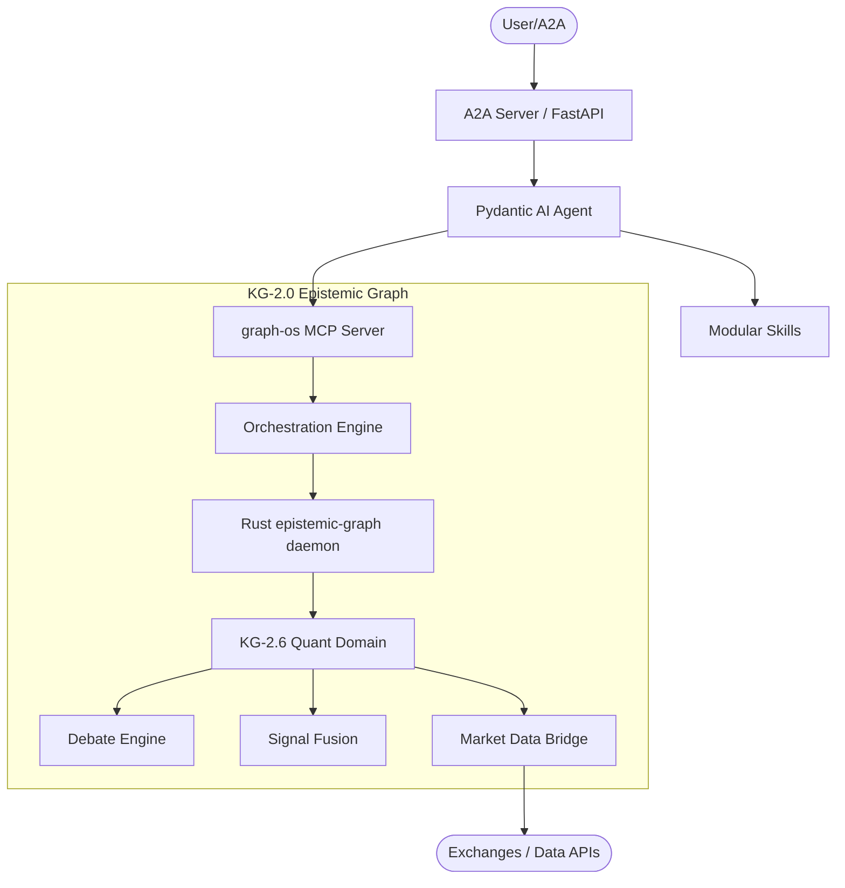
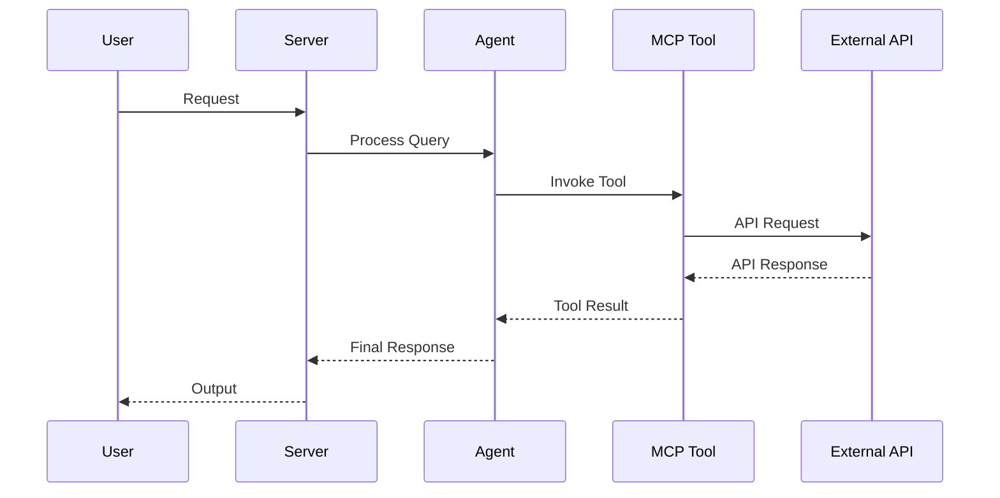

# AGENTS.md

<!--
This file is the hand-written source for AGENTS.md. The final AGENTS.md is
regenerated by `scripts/gen_agents_md.py`, which appends two generated
sections (Project Structure file tree + Concept Reference) to this prose.
Edit THIS file for any narrative / conventions changes, then run:
    python scripts/gen_agents_md.py
-->

## Tech Stack & Architecture
- Language/Version: Python 3.10+
- Core Libraries: `agent-utilities`, `fastmcp`, `pydantic-ai`
- Key principles: Functional patterns, Pydantic for data validation, asynchronous tool execution.
- Architecture:
    - `kg_server.py`: Main MCP server entry point and tool registration.
    - `agent.py`: Pydantic AI agent definition and logic.
    - `skills/`: Directory containing modular agent skills (if applicable).
    - `agent/`: Internal agent logic and prompt templates.

### Architecture Diagram


### Workflow Diagram


## Commands (run these exactly)
# Installation
pip install .[all]

# Quality & Linting (run from project root)
pre-commit run --all-files

# Execution Commands
# agent-utilities-kg
agent_utilities.mcp.kg_server:main

# Run the native compute backend daemon
cargo run -p epistemic-graph

## Project Structure Quick Reference
- MCP Entry Point → `kg_server.py`
- Native Compute Engine → `epistemic-graph` (Rust)
- Agent Entry Point → `agent.py`
- Source Code → `agent_utilities/`
- Skills → `skills/` (if exists)

## Code Style & Conventions
**Always:**
- Use `agent-utilities` for common patterns (e.g., `create_mcp_server`, `create_agent`).
- Define input/output models using Pydantic.
- Include descriptive docstrings for all tools (they are used as tool descriptions for LLMs).
- Check for optional dependencies using `try/except ImportError`.

**Good example:**
```python
from agent_utilities import create_mcp_server
from mcp.server.fastmcp import FastMCP

mcp = create_mcp_server("my-agent")

@mcp.tool()
async def my_tool(param: str) -> str:
    """Description for LLM."""
    return f"Result: {param}"
```

## Dos and Don'ts
**Do:**
- Run `pre-commit` before pushing changes.
- Use existing patterns from `agent-utilities`.
- Keep tools focused and idempotent where possible.

**Don't:**
- Use `cd` commands in scripts; use absolute paths or relative to project root.
- Add new dependencies to `dependencies` in `pyproject.toml` without checking `optional-dependencies` first.
- Hardcode secrets; use environment variables or `.env` files.

## Safety & Boundaries
**Always do:**
- Run lint/test via `pre-commit`.
- Use `agent-utilities` base classes.

**Ask first:**
- Major refactors of `kg_server.py` or `agent.py`.
- Deleting or renaming public tool functions.

**Never do:**
- Commit `.env` files or secrets.
- Modify `agent-utilities` or `universal-skills` files from within this package.

## When Stuck
- Propose a plan first before making large changes.
- Check `agent-utilities` documentation for existing helpers.

## ⛔ No Scratch or Temporary Files in Repository

**NEVER write any of the following to this repository:**
- Temporary test scripts (`test_*.py`, `debug_*.py` outside of `tests/`)
- Scratch scripts or experimental one-off files
- Log files (`.log`, `.txt` command output)
- Random text files with command output or debug dumps
- Any file that is NOT production source code, tests in `tests/`, or documentation

**Why:** These files expose private filesystem paths, credentials, and internal infrastructure details when pushed to GitHub publicly.

**Where to put scratch work instead:**
- Use `~/workspace/scratch/` for temporary scripts and experiments
- Use `~/workspace/reports/` for command output and reports
- Keep test scripts in the `tests/` directory following proper pytest conventions

## Project Structure (generated)

_Auto-generated by `scripts/gen_agents_md.py`. Build/cache directories are excluded; large directories are summarized._

```text
├── .agent/
│   └── handoffs/
│       ├── 2026-05-19-190800-tool-distribution-testing.md
│       └── 2026-05-24-020900-parallel-engine-workflow-library.md
├── .agent_data/
│   └── images/
│       ├── 113faa3c3edf4f53be3e4243e8691a88.png
│       ├── 27378ca090bf4ffc88ce120a8fe4545d.png
│       ├── 3015bdb88c41495cb103c416c1dc5694.png
│       ├── 40fd31175e9840109a1574abc7235c68.png
│       ├── 54df10b8abc2433cbcd938fc5487a5fc.png
│       ├── 56f42484cb534cfb9224eefc9eabce3e.png
│       ├── 5b45b14a001046939aba73e1a734230e.png
│       ├── 6787716196684c1fbaf4507219efdd96.png
│       ├── 72b524c2d5bb4824898f3533b1063301.png
│       ├── 74558fa2c422499697c6f8767b51f13a.png
│       ├── 84a85475049d4b599eefc7e805eb74f0.png
│       ├── 92a3e94efd764a8f86dc634892bc215e.png
│       ├── 986054d3fbc94a22ba87117e1d95c96b.png
│       ├── c308e418175843fa8f25d9a0f5755105.png
│       ├── c6c0e907f2be4ef8b476156dde0f117c.png
│       ├── cda1350f79fe4a47b265bc74dd33ef87.png
│       ├── d41de543206448de824d1894fe9394a3.png
│       ├── e6dc76ed741d4fda8cdbd3f4a9ee019e.png
│       └── ef6be22c91fa44a6be0383f07d8eadbf.png
├── .agents/
│   ├── audits/
│   │   └── staleness_2026-06-01.md
│   └── governance/
│       ├── governance_2026-05-26.md
│       └── governance_2026-06-01.md
├── .github/
│   └── workflows/
│       ├── concept-governance.yml
│       ├── pages.yml
│       └── pipeline.yml
├── .specify/
│   ├── design/
│   │   ├── ahe-3.7-stateful-harness/
│   │   ├── kg-2.1-memory-consolidation/
│   │   ├── kg-2.3-latentrag-retrieval/
│   │   ├── kg-2.7-research-assimilation/
│   │   ├── _template.md
│   │   └── README.md
│   ├── history/
│   │   └── brain/ (52 entries)
│   ├── memory/
│   │   ├── constitution.json
│   │   └── constitution.md
│   ├── reports/
│   │   ├── ca000_discovery.json
│   │   ├── ca003_architecture_agent_utilities.json
│   │   ├── ca003_architecture_hermes.json
│   │   ├── ca003b_arch_diff.json
│   │   ├── ca004b_relevance.json
│   │   ├── ca010_innovations.json
│   │   ├── ca010_innovations_article.json
│   │   ├── comparative_analysis.md
│   │   └── concept_cross_reference.md
│   └── specs/
│       ├── ahe-3.7-stateful-harness/
│       ├── kg-2.1-memory-consolidation/
│       ├── kg-2.3-latentrag-retrieval/
│       ├── kg-2.7-research-assimilation/
│       ├── _template.md
│       └── DSTDD-Pipeline.md
├── agent_utilities/ (48 entries)
├── docker/
│   ├── pggraph-init/
│   │   └── 01-extensions.sql
│   ├── docker-compose.kafka.yml
│   ├── Dockerfile
│   ├── falkordb.compose.yml
│   ├── kafka-kraft.compose.yml
│   ├── mcp.compose.yml
│   ├── neo4j.compose.yml
│   └── pggraph.compose.yml
├── docs/
│   ├── architecture/
│   │   ├── autonomous_governance_and_zero_trust.md
│   │   ├── concept_extraction_standards.md
│   │   ├── event_backbone_architecture.md
│   │   ├── event_sourcing_and_routing.md
│   │   ├── graph_backends_architecture.md
│   │   ├── graph_service_layer.md
│   │   ├── knowledge_graph_ingestion_stability.md
│   │   ├── layered_analysis_architecture.md
│   │   ├── phased_release_architecture.md
│   │   └── vector_index_lifecycle.md
│   ├── examples/
│   │   ├── workflows/
│   │   ├── config.json
│   │   ├── example_mcp_config.json
│   │   ├── example_tunnel_inventory.yaml
│   │   ├── graph-os-mcp-examples.md
│   │   └── mcp-orchestration-examples.md
│   ├── guides/ (49 entries)
│   ├── pillars/
│   │   ├── 1_graph_orchestration/
│   │   ├── 2_epistemic_knowledge_graph/
│   │   ├── 3_agentic_harness_engineering/
│   │   ├── 4_ecosystem_peripherals/
│   │   ├── 5_agent_os_infrastructure/
│   │   ├── 1_graph_orchestration.md
│   │   ├── 2_epistemic_knowledge_graph.md
│   │   ├── 3_agentic_harness_engineering.md
│   │   ├── 4_ecosystem_peripherals.md
│   │   ├── 5_agent_os_infrastructure.md
│   │   ├── 6_geniusbot_cockpit.md
│   │   ├── architecture_c4.md
│   │   ├── master_integration.md
│   │   └── memory_architecture.md
│   ├── centralized_kg_coordination.md
│   ├── concept_map.md
│   ├── concepts.yaml
│   ├── index.md
│   ├── journey.md
│   ├── legal_automation_roadmap.md
│   ├── NAMING.md
│   ├── overview.md
│   ├── owl_kg_synergies.md
│   ├── README.md
│   └── workflow-kg-synergy.md
├── examples/
│   └── reference_agent/
│       ├── basic_agent.py
│       ├── graph_agent.py
│       ├── knowledge_graph_agent.py
│       ├── mcp_agent.py
│       ├── memory_agent.py
│       ├── protocol_agent.py
│       └── README.md
├── gap_plans/
│   ├── _callmap.json
│   └── _feature_ledger.yaml
├── plan/
│   └── transcribe_audio_capability_plan.md
├── scripts/
│   ├── add_trace_decorator.py
│   ├── build_concepts_yaml.py
│   ├── build_feature_ledger.py
│   ├── check.py
│   ├── check_capability_ledger.py
│   ├── check_concept_gaps.py
│   ├── check_concepts.py
│   ├── check_stubs.py
│   ├── consolidate_concepts.py
│   ├── consolidation_callmap.py
│   ├── drop_models.py
│   ├── find_unmapped_labels.py
│   ├── fix_precommit_hooks.py
│   ├── format_ttl.py
│   ├── gen_agents_md.py
│   ├── gen_docs.py
│   ├── get_stats.py
│   ├── ingest_all.py
│   ├── ingest_config.py
│   ├── ingest_paper.py
│   ├── inject_concept_ids.py
│   ├── inject_precommit_hooks.py
│   ├── install_git_hooks.py
│   ├── mermaid_linter.py
│   ├── parse_awesome_deep_trading.py
│   ├── patch_schema.py
│   ├── security_sanitizer.py
│   ├── submit_diff.py
│   ├── validate_diagrams.py
│   ├── verify_acp.py
│   ├── verify_acp_stack.py
│   └── verify_kafka_sync.py
├── site/
│   ├── architecture/
│   │   ├── autonomous_governance_and_zero_trust/
│   │   ├── concept_extraction_standards/
│   │   ├── event_backbone_architecture/
│   │   ├── event_sourcing_and_routing/
│   │   ├── graph_backends_architecture/
│   │   ├── graph_service_layer/
│   │   ├── knowledge_graph_ingestion_stability/
│   │   ├── layered_analysis_architecture/
│   │   ├── phased_release_architecture/
│   │   └── vector_index_lifecycle/
│   ├── assets/
│   │   ├── images/
│   │   ├── javascripts/
│   │   └── stylesheets/
│   ├── centralized_kg_coordination/
│   │   └── index.html
│   ├── concept_map/
│   │   └── index.html
│   ├── examples/
│   │   ├── graph-os-mcp-examples/
│   │   ├── mcp-orchestration-examples/
│   │   ├── workflows/
│   │   ├── config.json
│   │   ├── example_mcp_config.json
│   │   └── example_tunnel_inventory.yaml
│   ├── guides/ (49 entries)
│   ├── journey/
│   │   └── index.html
│   ├── legal_automation_roadmap/
│   │   └── index.html
│   ├── NAMING/
│   │   └── index.html
│   ├── overview/
│   │   └── index.html
│   ├── owl_kg_synergies/
│   │   └── index.html
│   ├── pillars/
│   │   ├── 1_graph_orchestration/
│   │   ├── 2_epistemic_knowledge_graph/
│   │   ├── 3_agentic_harness_engineering/
│   │   ├── 4_ecosystem_peripherals/
│   │   ├── 5_agent_os_infrastructure/
│   │   ├── 6_geniusbot_cockpit/
│   │   ├── architecture_c4/
│   │   ├── master_integration/
│   │   └── memory_architecture/
│   ├── search/
│   │   └── search_index.json
│   ├── workflow-kg-synergy/
│   │   └── index.html
│   ├── 404.html
│   ├── index.html
│   ├── sitemap.xml
│   └── sitemap.xml.gz
├── tests/ (107 entries)
├── workspace/
├── .bumpversion.cfg
├── .codespellignore
├── .env
├── .env.example
├── .gitattributes
├── .gitignore
├── .pre-commit-config.yaml
├── AGENTS.head.md
├── AGENTS.md
├── CHANGELOG.md
├── fix_links.py
├── knowledge_graph.db
├── LICENSE
├── MANIFEST.in
├── mcp_config.example.json
├── migrate_config.py
├── mkdocs.yml
├── mkdocs_test.yml
├── opencode.json
├── pyproject.toml
├── pytest.ini
├── README.md
├── replace_imports.py
├── requirements.txt
├── test_a.py
├── test_b.py
├── test_db.py
├── test_idle.py
├── test_mapping.py
├── test_quant.py
├── test_shacl.py
├── test_shacl_real.py
├── update_concepts.py
├── uv.lock
└── vulture_whitelist.py
```

## Concept Reference (generated)

_Auto-generated from `docs/concepts.yaml` (single source of truth). 67 concepts across 12 pillars._

| Pillar | Count | Concept IDs |
|:------|:---:|:------|
| **AHE-3** | 8 | AHE-3.x, AHE-3.0, AHE-3.1, AHE-3.2, AHE-3.3, AHE-3.4, AHE-3.9, AHE-3.11 |
| **CTX-1** | 1 | CTX-1.0 |
| **ECO-4** | 13 | ECO-4.0, ECO-4.1, ECO-4.3, ECO-4.04, ECO-4.05, ECO-4.10, ECO-4.11, ECO-4.12, ECO-4.13, ECO-4.17, ECO-4.21, ECO-4.22, ECO-4.23 |
| **KG-1** | 1 | KG-1.0 |
| **KG-2** | 11 | KG-2.0, KG-2.1, KG-2.2, KG-2.3, KG-2.4, KG-2.5, KG-2.6, KG-2.7, KG-2.8, KG-2.21, KG-2.23 |
| **LGC-1** | 1 | LGC-1.0 |
| **ORCH-1** | 18 | ORCH-1.0, ORCH-1.1, ORCH-1.2, ORCH-1.3, ORCH-1.3b, ORCH-1.4, ORCH-1.8, ORCH-1.9, ORCH-1.10, ORCH-1.11, ORCH-1.12, ORCH-1.13, ORCH-1.20, ORCH-1.21, ORCH-1.22, ORCH-1.23, ORCH-1.24, ORCH-1.26 |
| **ORCH-2** | 1 | ORCH-2.0 |
| **ORCH-5** | 1 | ORCH-5.0 |
| **OS-5** | 10 | OS-5.0, OS-5.1, OS-5.2, OS-5.3, OS-5.4, OS-5.5, OS-5.6, OS-5.8, OS-5.9, OS-5.10 |
| **SAFE-1** | 1 | SAFE-1.0 |
| **UTIL-1** | 1 | UTIL-1.0 |

