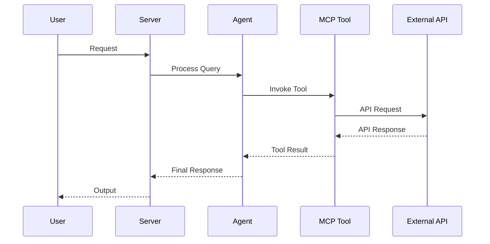

# AGENTS.md

<!--
This file is the hand-written source for AGENTS.md. The final AGENTS.md is
regenerated by `scripts/gen_agents_md.py`, which appends two generated
sections (Project Structure file tree + Concept Reference) to this prose.
Edit THIS file for any narrative / conventions changes, then run:
    python scripts/gen_agents_md.py
-->

> Claude Code loads this file via `CLAUDE.md` (`@AGENTS.md` import) — the two stay
> in sync. Edit `AGENTS.head.md` (then regenerate), never `CLAUDE.md`.

## Architecture Reference (current)

- **Engine transport.** Python talks to the Rust `epistemic-graph` engine **only**
  through the out-of-process MessagePack/UDS client (`epistemic_graph.client`,
  with `pool.py` `ConnectionPool`/`ShardRouter`). There is **no PyO3**. Entry:
  `domains/finance/*` and `knowledge_graph/core/graph_compute.py`.
- **Knowledge graph (layered).** `knowledge_graph/facade.py` (`KnowledgeGraph`) is
  the single object the execution plane uses; it composes L0 compute (Rust client),
  L1 store (`backends/` — Postgres + epistemic_graph primary; neo4j/falkordb/ladybug
  demoted to `backends/contrib/`), and L2 semantic (`core/owl_bridge.py`, SHACL gate).
  `retrieval/capability_index.py` (`CapabilityIndex`, HNSW) powers `designate()` and
  reward write-back (`record_outcome`).
- **Routing.** `graph/routing/` is a strategy package (`Router`/`RoutingStrategy`)
  stranglering the monolith `graph/_router_impl.py`; strategies under
  `routing/strategies/` (fast_path, workflow_context, policy). `graph/planning/`
  is the unified `Planner` facade; `core/execution/` is the `ExecutionEngine`
  Protocol. Consolidated singletons: `core/registry/`, `core/checkpoint/`,
  one `core/config.py`, one `EmbeddingFactory` (`core/embedding_utilities.create_embedding_model`).
- **Single source of truth for concepts:** `docs/concepts.yaml` (regenerate via
  `scripts/build_concepts_yaml.py`; README/AGENTS counts come from it).
- **Guardrail gates (CI + pre-commit, `guardrails.yml`):** `scripts/check_no_stub.py`,
  `check_sprawl.py`, `check_concepts.py`, `check_coupling.py`,
  `check_retrieval_quality.py`, with meta-tests in `tests/gates/`.
- **Cardinal rules:** no stubs (`raise NotImplementedError` only with `# ABSTRACT-OK`);
  strangler-then-delete (never "v2 beside old"); keep the unit suite green.

## Wire-First — reachable ≠ invoked (READ BEFORE shipping a complex feature)

A feature is **not done when its code exists and unit-tests pass** — it is done when a **live call
path actually invokes it**. We have repeatedly shipped code that was importable and unit-tested but
*never called on any real path* (e.g. `mount_skill_unit` stored a skill's SOP but the prompt builder
never read it; `UsageTelemetry` existed but `plan_and_retrieve` never recorded recall; a GEPA
held-out split existed but the entry point passed `dev_fraction=0`). These pass every unit test and
are still **dead code**.

When implementing any non-trivial feature you MUST verify and test the *invocation*, not just the API:

1. **Trace the live path end-to-end.** From an entry point (MCP tool, API route, CLI, hook, daemon
   tick, or a registry/discovery mechanism) to your new code. If you added a method/field/flag, grep
   that the existing hot path **actually calls/reads it** — don't assume `__init__` storing it is enough.
2. **Default the integration ON.** If a new behavior needs a flag/param to activate, the live entry
   point must pass a sensible default that turns it on (or it's off in production).
3. **Write a LIVE-PATH test, not just an API test.** Exercise the *existing* class/entry point and
   assert the new behavior happens as a side effect (e.g. "call `plan_and_retrieve`, assert recall was
   recorded"), in addition to unit-testing the helper in isolation. Name it `*_live_path` / `*_integration`.
4. **Run `check_wiring.py`** (import-graph, ≤3 hops) — but know its **blind spot**: it cannot see
   **plugin/decorator dynamic registration** (`register_source` + `pkgutil` discovery, entry-points,
   `@adaptor`). For those, also grep that a discovery/registration call runs on a live path. A
   "0 hops / unreachable" result for a self-registering module is a false negative — verify the
   discovery, don't delete the module.
5. **No silent storage.** A value set in `__init__`/a setter but read nowhere is a bug. Either wire it
   into the behavior or don't add it.

## Tech Stack & Architecture
- Language/Version: Python 3.10+
- Core Libraries: `agent-utilities`, `fastmcp`, `pydantic-ai`
- Key principles: Functional patterns, Pydantic for data validation, asynchronous tool execution.
- Architecture:
    - `kg_server.py`: Main MCP server entry point and tool registration.
    - `agent.py`: Pydantic AI agent definition and logic.
    - `skills/`: Directory containing modular agent skills (if applicable).
    - `agent/`: Internal agent logic and prompt templates.

### Architecture Diagram


### Workflow Diagram


## Commands (run these exactly)
# Installation
pip install .[all]

# Quality & Linting (run from project root)
pre-commit run --all-files

# Execution Commands
# agent-utilities-kg
agent_utilities.mcp.kg_server:main

# Run the native compute backend daemon
cargo run -p epistemic-graph

## Project Structure Quick Reference
- MCP Entry Point → `kg_server.py`
- Native Compute Engine → `epistemic-graph` (Rust)
- Agent Entry Point → `agent.py`
- Source Code → `agent_utilities/`
- Skills → `skills/` (if exists)

## Code Style & Conventions
**Always:**
- Use `agent-utilities` for common patterns (e.g., `create_mcp_server`, `create_agent`).
- Define input/output models using Pydantic.
- Include descriptive docstrings for all tools (they are used as tool descriptions for LLMs).
- Check for optional dependencies using `try/except ImportError`.

**Good example:**
```python
from agent_utilities import create_mcp_server
from mcp.server.fastmcp import FastMCP

mcp = create_mcp_server("my-agent")

@mcp.tool()
async def my_tool(param: str) -> str:
    """Description for LLM."""
    return f"Result: {param}"
```

## Dos and Don'ts
**Do:**
- Run `pre-commit` before pushing changes.
- Use existing patterns from `agent-utilities`.
- Keep tools focused and idempotent where possible.

**Don't:**
- Use `cd` commands in scripts; use absolute paths or relative to project root.
- Add new dependencies to `dependencies` in `pyproject.toml` without checking `optional-dependencies` first.
- Hardcode secrets; use environment variables or `.env` files.

## Safety & Boundaries
**Always do:**
- Run lint/test via `pre-commit`.
- Use `agent-utilities` base classes.

**Ask first:**
- Major refactors of `kg_server.py` or `agent.py`.
- Deleting or renaming public tool functions.

**Never do:**
- Commit `.env` files or secrets.
- Modify `agent-utilities` or `universal-skills` files from within this package.

## When Stuck
- Propose a plan first before making large changes.
- Check `agent-utilities` documentation for existing helpers.

## ⛔ Keep the Repository Root Pristine — No Scratch / Temp / Debug Files

**The repository ROOT must contain only canonical project files** (packaging,
config, docs, lockfiles). The only hidden directories allowed at root are
`.git/`, `.github/`, and `.specify/` (plus a local, git-ignored `.venv/`).

**NEVER write any of the following — anywhere in the repo, and ESPECIALLY at the root:**
- One-off / debug / migration scripts: `fix_*.py`, `migrate_*.py`, `refactor_*.py`,
  `replace_*.py`, `update_*.py`, `debug_*.py`, or `test_*.py` **at the root**
  (real tests live in `tests/` only).
- Databases / data dumps: `*.db`, `*.db-wal`, `*.sqlite*`, `*.corrupted`.
- Logs / command output: `*.log`, scratch `*.txt`, `*.orig`, `*.rej`, `*.bak`.
- Build artifacts: `*.tsbuildinfo`, compiled binaries, coverage files.
- AI agent scratch directories: `.agent/`, `.agents/`, `.agent_data/`, `.tmp/`,
  `.hypothesis/`, or any per-tool cache committed to git.
- Any file that is NOT production source, a test in `tests/`, documentation, or
  a recognized config/lockfile.

**Why:** scratch at the root leaks private paths/credentials, bloats the tree,
breaks the anti-sprawl gate, and erodes a pristine codebase.

**Where scratch goes instead:** `~/workspace/scratch/` (experiments),
`~/workspace/reports/` (command output); tests go in `tests/` (pytest).
The `.gitignore` already blocks the scratch dirs above — do not force-add them.
Before finishing a task, run `git status` and confirm no stray root files were added.

## Project Structure (generated)

_Auto-generated by `scripts/gen_agents_md.py`. Build/cache directories are excluded; large directories are summarized._

```text
├── .github/
│   └── workflows/
│       ├── concept-governance.yml
│       ├── guardrails.yml
│       ├── pages.yml
│       └── pipeline.yml
├── .specify/
│   ├── design/
│   │   ├── agent-spec-grounding/
│   │   ├── ahe-3.12-longmemeval-harness/
│   │   ├── ahe-3.7-stateful-harness/
│   │   ├── composable-skill-system/
│   │   ├── decay-scanner-importance-halflife/
│   │   ├── epistemic-graph-backed-gepa-state/
│   │   ├── four-level-fallback-cascade/
│   │   ├── generation-lineage-provenance/
│   │   ├── generic-environment-adapter/
│   │   ├── gepa-heldout-pareto-split/
│   │   ├── kg-2-14-ground-truth-hierarchy/
│   │   ├── kg-2.1-memory-consolidation/
│   │   ├── kg-2.10-orchestration-synthesis/
│   │   ├── kg-2.11-bitemporal-memory-layers/
│   │   ├── kg-2.12-memory-first-retrieval/
│   │   ├── kg-2.13-background-learning-engine/
│   │   ├── kg-2.3-latentrag-retrieval/
│   │   ├── kg-2.7-research-assimilation/
│   │   ├── kg-2.8-enrichment-interlinking/
│   │   ├── kg-2.9-enterprise-os/
│   │   ├── multi-source-surgical-injection/
│   │   ├── orch-1.27-role-specialized-routing/
│   │   ├── patch-merge-selection/
│   │   ├── recall-usage-telemetry/
│   │   ├── recoverable-vs-fatal-timeout/
│   │   ├── rlm-role-specialized-optimization/
│   │   ├── self-curating-llm-wiki/
│   │   ├── semantic-dedup-merge/
│   │   ├── social-closer-filter/
│   │   ├── structured-runtrace-telemetry/
│   │   ├── trust-scoring-feedback-loop/
│   │   ├── typed-session-learning-extraction/
│   │   ├── _template.md
│   │   ├── kg-parallel-execution-plan.md
│   │   └── README.md
│   ├── memory/
│   │   ├── constitution.json
│   │   └── constitution.md
│   ├── reports/
│   │   ├── ca000_discovery.json
│   │   ├── ca003_architecture_agent_utilities.json
│   │   ├── ca003_architecture_hermes.json
│   │   ├── ca003b_arch_diff.json
│   │   ├── ca004b_relevance.json
│   │   ├── ca010_innovations.json
│   │   ├── ca010_innovations_article.json
│   │   ├── comparative_analysis.md
│   │   ├── concept_cross_reference.md
│   │   ├── deferred-followups.md
│   │   ├── memory-os-comparative-analysis.md
│   │   └── rlm-gepa-comparative-analysis.md
│   └── specs/
│       ├── agent-spec-grounding/
│       ├── ahe-3.12-longmemeval-harness/
│       ├── ahe-3.7-stateful-harness/
│       ├── composable-skill-system/
│       ├── decay-scanner-importance-halflife/
│       ├── epistemic-graph-backed-gepa-state/
│       ├── four-level-fallback-cascade/
│       ├── generation-lineage-provenance/
│       ├── generic-environment-adapter/
│       ├── gepa-heldout-pareto-split/
│       ├── kg-2-14-ground-truth-hierarchy/
│       ├── kg-2.1-memory-consolidation/
│       ├── kg-2.11-bitemporal-memory-layers/
│       ├── kg-2.12-memory-first-retrieval/
│       ├── kg-2.13-background-learning-engine/
│       ├── kg-2.3-latentrag-retrieval/
│       ├── kg-2.7-research-assimilation/
│       ├── multi-source-surgical-injection/
│       ├── orch-1.27-role-specialized-routing/
│       ├── patch-merge-selection/
│       ├── recall-usage-telemetry/
│       ├── recoverable-vs-fatal-timeout/
│       ├── rlm-role-specialized-optimization/
│       ├── self-curating-llm-wiki/
│       ├── semantic-dedup-merge/
│       ├── social-closer-filter/
│       ├── structured-runtrace-telemetry/
│       ├── trust-scoring-feedback-loop/
│       ├── typed-session-learning-extraction/
│       ├── _template.md
│       └── DSTDD-Pipeline.md
├── agent_utilities/ (48 entries)
├── docker/
│   ├── pggraph-init/
│   │   └── 01-extensions.sql
│   ├── docker-compose.kafka.yml
│   ├── Dockerfile
│   ├── falkordb.compose.yml
│   ├── kafka-kraft.compose.yml
│   ├── mcp.compose.yml
│   ├── neo4j.compose.yml
│   └── pggraph.compose.yml
├── docs/
│   ├── architecture/
│   │   ├── autonomous_governance_and_zero_trust.md
│   │   ├── company_brain_runtime.md
│   │   ├── concept_extraction_standards.md
│   │   ├── event_backbone_architecture.md
│   │   ├── event_sourcing_and_routing.md
│   │   ├── graph_backends_architecture.md
│   │   ├── graph_service_layer.md
│   │   ├── knowledge_graph_ingestion_stability.md
│   │   ├── layered_analysis_architecture.md
│   │   ├── phased_release_architecture.md
│   │   ├── vector_index_lifecycle.md
│   │   └── vendor_neutral_enterprise_ontology.md
│   ├── examples/
│   │   ├── workflows/
│   │   ├── config.json
│   │   ├── example_mcp_config.json
│   │   ├── example_tunnel_inventory.yaml
│   │   ├── graph-os-mcp-examples.md
│   │   └── mcp-orchestration-examples.md
│   ├── guides/ (49 entries)
│   ├── pillars/
│   │   ├── 1_graph_orchestration/
│   │   ├── 2_epistemic_knowledge_graph/
│   │   ├── 3_agentic_harness_engineering/
│   │   ├── 4_ecosystem_peripherals/
│   │   ├── 5_agent_os_infrastructure/
│   │   ├── 1_graph_orchestration.md
│   │   ├── 2_epistemic_knowledge_graph.md
│   │   ├── 3_agentic_harness_engineering.md
│   │   ├── 4_ecosystem_peripherals.md
│   │   ├── 5_agent_os_infrastructure.md
│   │   ├── 6_geniusbot_cockpit.md
│   │   ├── architecture_c4.md
│   │   ├── master_integration.md
│   │   └── memory_architecture.md
│   ├── scaling/
│   │   ├── capacity_model.md
│   │   └── capacity_model.py
│   ├── centralized_kg_coordination.md
│   ├── concept_map.md
│   ├── concepts.yaml
│   ├── index.md
│   ├── journey.md
│   ├── legal_automation_roadmap.md
│   ├── NAMING.md
│   ├── overview.md
│   ├── owl_kg_synergies.md
│   ├── README.md
│   └── workflow-kg-synergy.md
├── examples/
│   └── reference_agent/
│       ├── basic_agent.py
│       ├── graph_agent.py
│       ├── knowledge_graph_agent.py
│       ├── mcp_agent.py
│       ├── memory_agent.py
│       ├── protocol_agent.py
│       └── README.md
├── scripts/
│   ├── add_trace_decorator.py
│   ├── build_concepts_yaml.py
│   ├── build_feature_ledger.py
│   ├── check.py
│   ├── check_capability_ledger.py
│   ├── check_concept_gaps.py
│   ├── check_concepts.py
│   ├── check_coupling.py
│   ├── check_designation_eval.py
│   ├── check_eval_corpus.py
│   ├── check_longmemeval.py
│   ├── check_no_stub.py
│   ├── check_retrieval_quality.py
│   ├── check_sprawl.py
│   ├── check_stubs.py
│   ├── consolidate_concepts.py
│   ├── consolidation_callmap.py
│   ├── drop_models.py
│   ├── find_unmapped_labels.py
│   ├── fix_precommit_hooks.py
│   ├── format_ttl.py
│   ├── gen_agents_md.py
│   ├── gen_docs.py
│   ├── get_stats.py
│   ├── ingest_all.py
│   ├── ingest_config.py
│   ├── ingest_paper.py
│   ├── inject_concept_ids.py
│   ├── inject_precommit_hooks.py
│   ├── install_git_hooks.py
│   ├── mermaid_linter.py
│   ├── parse_awesome_deep_trading.py
│   ├── patch_schema.py
│   ├── security_sanitizer.py
│   ├── stress_ingest.py
│   ├── submit_diff.py
│   ├── validate_diagrams.py
│   ├── verify_acp.py
│   ├── verify_acp_stack.py
│   └── verify_kafka_sync.py
├── site/
│   ├── architecture/
│   │   ├── autonomous_governance_and_zero_trust/
│   │   ├── concept_extraction_standards/
│   │   ├── event_backbone_architecture/
│   │   ├── event_sourcing_and_routing/
│   │   ├── graph_backends_architecture/
│   │   ├── graph_service_layer/
│   │   ├── knowledge_graph_ingestion_stability/
│   │   ├── layered_analysis_architecture/
│   │   ├── phased_release_architecture/
│   │   └── vector_index_lifecycle/
│   ├── assets/
│   │   ├── images/
│   │   ├── javascripts/
│   │   └── stylesheets/
│   ├── centralized_kg_coordination/
│   │   └── index.html
│   ├── concept_map/
│   │   └── index.html
│   ├── examples/
│   │   ├── graph-os-mcp-examples/
│   │   ├── mcp-orchestration-examples/
│   │   ├── workflows/
│   │   ├── config.json
│   │   ├── example_mcp_config.json
│   │   └── example_tunnel_inventory.yaml
│   ├── guides/ (49 entries)
│   ├── journey/
│   │   └── index.html
│   ├── legal_automation_roadmap/
│   │   └── index.html
│   ├── NAMING/
│   │   └── index.html
│   ├── overview/
│   │   └── index.html
│   ├── owl_kg_synergies/
│   │   └── index.html
│   ├── pillars/
│   │   ├── 1_graph_orchestration/
│   │   ├── 2_epistemic_knowledge_graph/
│   │   ├── 3_agentic_harness_engineering/
│   │   ├── 4_ecosystem_peripherals/
│   │   ├── 5_agent_os_infrastructure/
│   │   ├── 6_geniusbot_cockpit/
│   │   ├── architecture_c4/
│   │   ├── master_integration/
│   │   └── memory_architecture/
│   ├── search/
│   │   └── search_index.json
│   ├── workflow-kg-synergy/
│   │   └── index.html
│   ├── 404.html
│   ├── index.html
│   ├── sitemap.xml
│   └── sitemap.xml.gz
├── tests/ (111 entries)
├── workspace/
├── .bumpversion.cfg
├── .codespellignore
├── .env
├── .env.example
├── .gitattributes
├── .gitignore
├── .pre-commit-config.yaml
├── AGENTS.head.md
├── AGENTS.md
├── CHANGELOG.md
├── CLAUDE.md
├── LICENSE
├── MANIFEST.in
├── mcp_config.example.json
├── mkdocs.yml
├── opencode.json
├── pyproject.toml
├── pytest.ini
├── README.md
├── requirements.txt
├── uv.lock
└── vulture_whitelist.py
```

## Concept Reference (generated)

_Auto-generated from `docs/concepts.yaml` (single source of truth). 84 concepts across 12 pillars._

| Pillar | Count | Concept IDs |
|:------|:---:|:------|
| **AHE-3** | 9 | AHE-3.x, AHE-3.0, AHE-3.1, AHE-3.2, AHE-3.3, AHE-3.4, AHE-3.9, AHE-3.11, AHE-3.12 |
| **CTX-1** | 1 | CTX-1.0 |
| **ECO-4** | 13 | ECO-4.0, ECO-4.1, ECO-4.3, ECO-4.04, ECO-4.05, ECO-4.10, ECO-4.11, ECO-4.12, ECO-4.13, ECO-4.17, ECO-4.21, ECO-4.22, ECO-4.23 |
| **KG-1** | 1 | KG-1.0 |
| **KG-2** | 22 | KG-2.0, KG-2.1, KG-2.2, KG-2.3, KG-2.4, KG-2.5, KG-2.6, KG-2.7, KG-2.8, KG-2.9, KG-2.10, KG-2.11, KG-2.12, KG-2.13, KG-2.14, KG-2.15, KG-2.16, KG-2.17, KG-2.18, KG-2.19, KG-2.21, KG-2.23 |
| **LGC-1** | 1 | LGC-1.0 |
| **ORCH-1** | 23 | ORCH-1.0, ORCH-1.1, ORCH-1.2, ORCH-1.3, ORCH-1.3b, ORCH-1.4, ORCH-1.8, ORCH-1.9, ORCH-1.10, ORCH-1.11, ORCH-1.12, ORCH-1.13, ORCH-1.20, ORCH-1.21, ORCH-1.22, ORCH-1.23, ORCH-1.24, ORCH-1.26, ORCH-1.27, ORCH-1.28, ORCH-1.29, ORCH-1.30, ORCH-1.31 |
| **ORCH-2** | 1 | ORCH-2.0 |
| **ORCH-5** | 1 | ORCH-5.0 |
| **OS-5** | 10 | OS-5.0, OS-5.1, OS-5.2, OS-5.3, OS-5.4, OS-5.5, OS-5.6, OS-5.8, OS-5.9, OS-5.10 |
| **SAFE-1** | 1 | SAFE-1.0 |
| **UTIL-1** | 1 | UTIL-1.0 |

