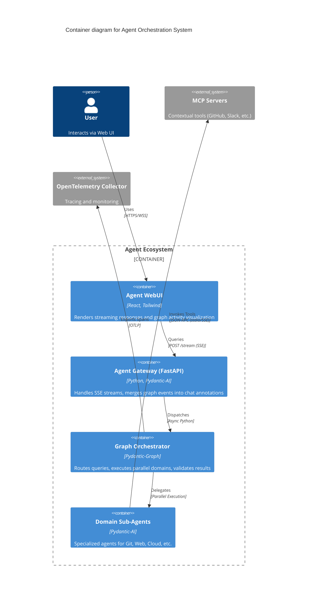
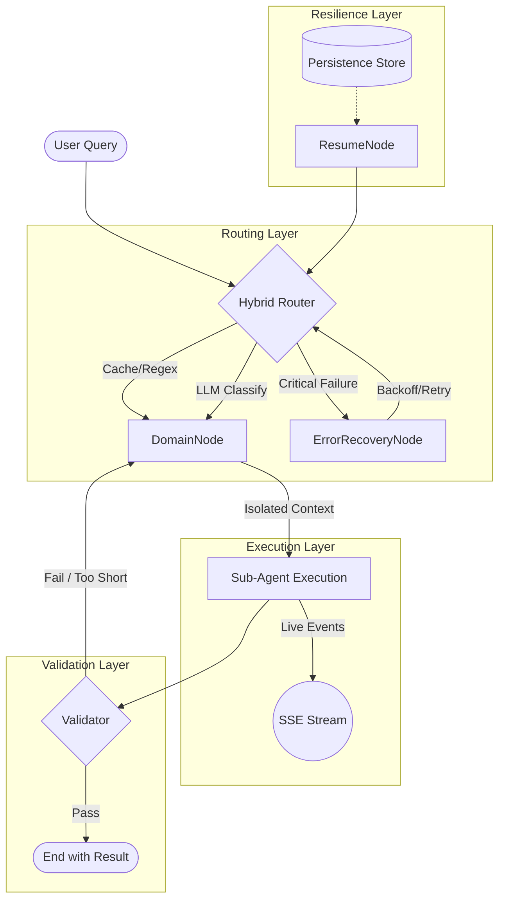

# Agent Utilities - Pydantic AI Utilities


*Version: 0.2.36*

## Overview

Agent Utilities provides a robust foundation for building production-ready Pydantic AI Agents. Recently refactored into a high-performance **modular architecture**, it simplifies agent creation, adds advanced **Graph Orchestration**, and provides essential "operating system" tools including state persistence, resilience, and high-fidelity streaming.

## Key Features

- **Agent Creation**: Streamlined `create_agent` function that handles MCP servers, skills, and model configuration automatically.
- **Advanced Graph Orchestration**: Multi-domain routing with `HybridRouterNode` (Rule-based + LLM) and **parallel execution** with `ParallelDomainNode`.
- **Resilience & Accuracy**: Native support for **Error Recovery** (exponential backoff), **State Persistence** (checkpointing), and **Result Validation**.
- **Observability**: Real-time **Graph Streaming** (SSE) and **Lifecycle Hooks** (`on_tool_start`, `on_tool_end`) for distributed telemetry.
- **Typed Foundation**: Zero-config dependency injection using `AgentDeps`.
- **Multi-Agent Support**: Native support for the supervisor pattern, allowing complex tasks to be delegated to specialized child agents.
- **Agent Server**: Built-in FastAPI server with standardized `/mcp`, `/a2a`, `/ag-ui`, and `/stream` (SSE) endpoints.
- **Workspace Management**: Automated management of agent state through standard markdown files (`IDENTITY.md`, `MEMORY.md`, `USER.md`).
- **Lightweight & Lazy**: Core utilities are lightweight. Heavy dependencies are lazy-loaded only when requested via optional extras.

## Architecture & Orchestration

| `adguard-home-agent` | Graph |
| `agent-utilities` | Library | Production-grade Orchestration. Supports Parallel execution, Real-time sub-agent streaming, High-fidelity observability, and Session Resumability |
| `agent-webui` | Library | Cinematic Graph Activity Visualization. |

`agent-utilities` implements a multi-stage execution pipeline using `pydantic-graph` for maximum precision and resilience.

### C4 Container Diagram


### Execution Flow



## Installation

```bash
# Core utilities only
pip install agent-utilities

# With full agent support (recommended)
pip install agent-utilities[agent]

# With MCP server support
pip install agent-utilities[mcp]

# With embedding/vector support
pip install agent-utilities[embeddings]
```

## Quick Start

```python
from agent_utilities import create_agent

# Create a simple agent with workspace tools
agent = create_agent(name="MyAgent")

# Or create a multi-agent supervisor
agent = create_agent(
    name="Supervisor",
    agent_definitions=[{"name": "Researcher", "description": "Search the web"}]
)
```
