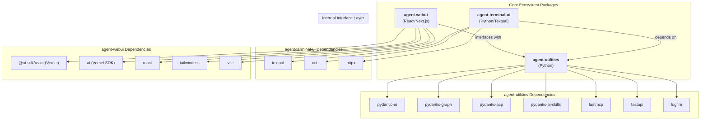
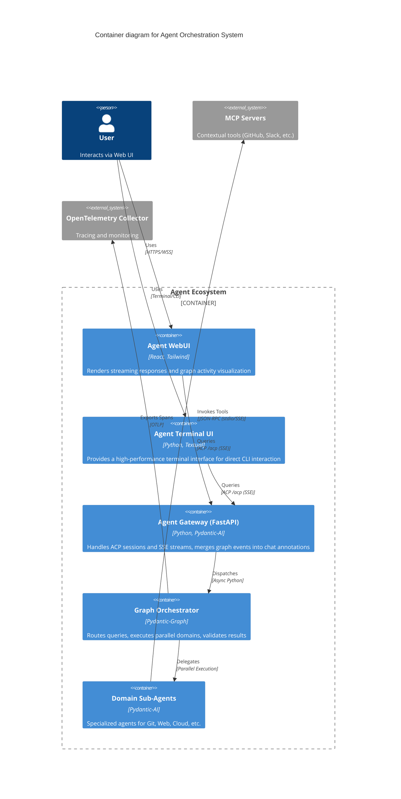

# Agent Utilities - Pydantic AI Utilities


*Version: 0.2.39*

## Overview

Agent Utilities provides a robust foundation for building production-ready Pydantic AI Agents. Recently refactored into a high-performance **modular architecture**, it simplifies agent creation, adds advanced **Graph Orchestration**, and provides essential "operating system" tools including state persistence, resilience, and high-fidelity streaming.

## Key Features

- **Native Multi-Modal (Vision) Support**: Direct processing of image context within the graph orchestrator. Decodes base64 image data into `pydantic_ai.BinaryContent` for high-fidelity multi-modal reasoning.
- **Dynamic MCP Tool Distribution**: Load an `mcp_config.json` and the system automatically connects to each MCP server, extracts and tags every tool, partitions them into focused specialist agents (~10-20 tools each), and registers them as graph nodes at runtime. This keeps context windows light - "GitLab Projects" specialist only sees 10 project tools.
- **Flexible Skill Loading**: Unified `skill_types` parameter to dynamically load `universal` skills, `graphs`, or custom workspace toolsets.
- **Advanced Graph Orchestration**: Router → Planner → Dispatcher pipeline with parallel fan-out execution. Dynamic step registration for both hardcoded skill agents and MCP-discovered specialists.
- **Self-Healing**: Circuit breaker for MCP Servers (closed/open/half-open), specialist fallback chain, tool-level retries with exponential backoff, per-node timeout, and automatic re-planning on failure.
- **Self-Correcting**: Verifier feedback loop with structured `ValidationResult` scoring. Low-quality results trigger re-dispatch with feedback injection and preserved message history.
- **Self-Improving**: Execution memory persisted to `MEMORY.md` after each run. Past failure patterns automatically inform future routing decisions.
- **Resilience & Accuracy**: Error recovery with local retries, re-planning loops, and result verification via the Verifier quality gate.
- **Observability**: Real-time **Graph Streaming** (SSE) and lifecycle events. Early OTEL/logfire gate.
- **Typed Foundation**: Zero-config dependency injection using `AgentDeps`.
- **Specialist Discovery**: Automated discovery of domain specialists from `NODE_AGENTS.md` and `A2A_AGENTS.md` registries.
- **Agent Server**: Built-in FastAPI server with standardized `/mcp`, `/a2a`, `/ag-ui`, `/stream` (SSE), and **`/docs` (Swagger UI)** endpoints.
- **Automatic Documentation**: Runtime generation of OpenAPI specifications for all agent server APIs.
- **Workspace Management**: Automated management of agent state through standard markdown files (`IDENTITY.md`, `MEMORY.md`, `USER.md`).
- **Lightweight & Lazy**: Core utilities are lightweight. Heavy dependencies are lazy-loaded only when requested via optional extras.

## Architecture & Orchestration

| `adguard-home-agent` | Graph |
| `agent-utilities` | Library | Production-grade Orchestration. Supports Parallel execution, Real-time sub-agent streaming, High-fidelity observability, and Session Resumability |
| `agent-webui` | Library | Cinematic Graph Activity Visualization. |
| `agent-terminal-ui` | Library | High-performance Terminal User Interface (TUI) for local CLI interaction. |

`agent-utilities` implements a multi-stage execution pipeline using `pydantic-graph` for maximum precision and resilience.

### Ecosystem Dependency Graph



### C4 Container Diagram


### Execution Flow: Dynamic Multi-Layer Parallelism
`agent-utilities` implements a multi-stage execution pipeline with **autonomous gap analysis** and **resilient feedback loops**. The system can "fan out" research tasks in parallel before coalescing results. If implementation fails, it can automatically retry locally or loop back to research.

```mermaid
  graph TB
  Start([User Query + Images]) --> ACPLayer["<b>ACP Protocol Adapter</b><br/><i>(pydantic-acp)</i>"]
  ACPLayer --> UsageGuard[Usage Guard: Rate Limiting]
  UsageGuard -- "Allow" --> router_step[Router: Topology Selection]
  UsageGuard -- "Block" --> End([End Result])

  router_step --> planner_step[Planner: Global Strategy]
  planner_step --> mem_step[Memory: Context Retrieval]
  mem_step --> dispatcher[Dispatcher: Dynamic Routing]

  subgraph "Discovery Phase"
    direction TB
    Researcher["<b>Researcher</b><br/>---<br/><i>u-skill:</i> web-search, web-crawler, web-fetch<br/><i>t-tool:</i> project_search, read_workspace_file"]
    Architect["<b>Architect</b><br/>---<br/><i>u-skill:</i> c4-architecture, product-management, product-strategy, user-research<br/><i>t-tool:</i> developer_tools"]
    A2ADiscovery["<b>A2A Discovery</b><br/>---<br/><i>source:</i> AGENTS.md<br/><i>t-tool:</i> fetch_agent_card"]
    res_joiner[Research Joiner: Barrier Sync]
  end

  dispatcher -- "Parallel Dispatch" --> Researcher
  dispatcher -- "Parallel Dispatch" --> Architect
  dispatcher -- "Parallel Dispatch" --> A2ADiscovery
  Researcher --> res_joiner
  Architect --> res_joiner
  A2ADiscovery --> res_joiner
  res_joiner -- "Coalesced Context" --> dispatcher

  subgraph "Execution Phase"
    direction TB

    subgraph "Programmers"
      direction LR
      PyP["<b>Python</b><br/>---<br/><i>u-skill:</i> agent-builder, tdd-methodology, mcp-builder, jupyter-notebook<br/><i>g-skill:</i> python-docs, fastapi-docs, pydantic-ai-docs<br/><i>t-tool:</i> developer_tools"]
      TSP["<b>TypeScript</b><br/>---<br/><i>u-skill:</i> react-development, web-artifacts, tdd-methodology, canvas-design<br/><i>g-skill:</i> nodejs-docs, react-docs, nextjs-docs, shadcn-docs<br/><i>t-tool:</i> developer_tools"]
      GoP["<b>Go</b><br/>---<br/><i>u-skill:</i> tdd-methodology<br/><i>g-skill:</i> go-docs<br/><i>t-tool:</i> developer_tools"]
      RustP["<b>Rust</b><br/>---<br/><i>u-skill:</i> tdd-methodology<br/><i>g-skill:</i> rust-docs<br/><i>t-tool:</i> developer_tools"]
      CSP["<b>C Programmer</b><br/>---<br/><i>u-skill:</i> developer-utilities<br/><i>g-skill:</i> c-docs<br/><i>t-tool:</i> developer_tools"]
      CPP["<b>C++ Programmer</b><br/>---<br/><i>u-skill:</i> developer-utilities<br/><i>g-skill:</i> cpp-docs<br/><i>t-tool:</i> developer_tools"]
      JSP["<b>JavaScript</b><br/>---<br/><i>u-skill:</i> web-artifacts, canvas-design, developer-utilities<br/><i>g-skill:</i> nodejs-docs, react-docs<br/><i>t-tool:</i> developer_tools"]
    end

    subgraph "Infrastructure"
      direction LR
      DevOps["<b>DevOps</b><br/>---<br/><i>u-skill:</i> cloudflare-deploy<br/><i>g-skill:</i> docker-docs, terraform-docs<br/><i>t-tool:</i> developer_tools"]
      Cloud["<b>Cloud</b><br/>---<br/><i>u-skill:</i> c4-architecture<br/><i>g-skill:</i> aws-docs, azure-docs, gcp-docs<br/><i>t-tool:</i> developer_tools"]
      DBA["<b>Database</b><br/>---<br/><i>u-skill:</i> database-tools<br/><i>g-skill:</i> postgres-docs, mongodb-docs, redis-docs<br/><i>t-tool:</i> developer_tools"]
    end

    subgraph Specialized ["Specialized & Quality"]
      direction LR
      Sec["<b>Security</b><br/>---<br/><i>u-skill:</i> security-tools<br/><i>g-skill:</i> linux-docs<br/><i>t-tool:</i> developer_tools"]
      QA["<b>QA</b><br/>---<br/><i>u-skill:</i> qa-planning, tdd-methodology<br/><i>g-skill:</i> testing-library-docs<br/><i>t-tool:</i> developer_tools"]
      UIUX["<b>UI/UX</b><br/>---<br/><i>u-skill:</i> theme-factory, brand-guidelines, algorithmic-art<br/><i>g-skill:</i> shadcn-docs, tailwind-docs, framer-docs<br/><i>t-tool:</i> developer_tools"]
      Debug["<b>Debugger</b><br/>---<br/><i>u-skill:</i> developer-utilities, agent-builder<br/><i>t-tool:</i> developer_tools"]
    end

    subgraph Ecosystem ["Agent Ecosystem"]
      direction TB

      subgraph Infra_Management ["Infrastructure & DevOps"]
        AdGuardHome["<b>AdGuard Home Agent</b><br/>---<br/><i>mcp-tool:</i> adguard-mcp<br/>"]
        AnsibleTower["<b>Ansible Tower Agent</b><br/>---<br/><i>mcp-tool:</i> ansible-tower-mcp<br/>"]
        ContainerManager["<b>Container Manager Agent</b><br/>---<br/><i>mcp-tool:</i> container-mcp<br/>"]
        Microsoft["<b>Microsoft Agent</b><br/>---<br/><i>mcp-tool:</i> microsoft-mcp<br/>"]
        Portainer["<b>Portainer Agent</b><br/>---<br/><i>mcp-tool:</i> portainer-mcp<br/>"]
        SystemsManager["<b>Systems Manager</b><br/>---<br/><i>mcp-tool:</i> systems-mcp<br/>"]
        TunnelManager["<b>Tunnel Manager</b><br/>---<br/><i>mcp-tool:</i> tunnel-mcp<br/>"]
        UptimeKuma["<b>Uptime Kuma Agent</b><br/>---<br/><i>mcp-tool:</i> uptime-mcp<br/>"]
        RepositoryManager["<b>Repository Manager</b><br/>---<br/><i>mcp-tool:</i> repository-mcp<br/>"]
      end

      subgraph Media_HomeLab ["Media & Home Lab"]
        ArchiveBox["<b>ArchiveBox API</b><br/>---<br/><i>mcp-tool:</i> archivebox-mcp<br/>"]
        Arr["<b>Arr (Radarr/Sonarr)</b><br/>---<br/><i>mcp-tool:</i> arr-mcp<br/>"]
        AudioTranscriber["<b>Audio Transcriber</b><br/>---<br/><i>mcp-tool:</i> audio-transcriber-mcp<br/>"]
        Jellyfin["<b>Jellyfin Agent</b><br/>---<br/><i>mcp-tool:</i> jellyfin-mcp<br/>"]
        MediaDownloader["<b>Media Downloader</b><br/>---<br/><i>mcp-tool:</i> media-mcp<br/>"]
        Owncast["<b>Owncast Agent</b><br/>---<br/><i>mcp-tool:</i> owncast-mcp<br/>"]
        qBittorrent["<b>qBittorrent Agent</b><br/>---<br/><i>mcp-tool:</i> qbittorrent-mcp<br/>"]
      end

      subgraph Productive_Dev ["Productivity & Development"]
        Atlassian["<b>Atlassian Agent</b><br/>---<br/><i>mcp-tool:</i> atlassian-mcp<br/>"]
        Genius["<b>Genius Agent</b><br/>---<br/><i>mcp-tool:</i> genius-mcp<br/>"]
        GitHub["<b>GitHub Agent</b><br/>---<br/><i>mcp-tool:</i> github-mcp<br/>"]
        GitLab["<b>GitLab API</b><br/>---<br/><i>mcp-tool:</i> gitlab-mcp<br/>"]
        Langfuse["<b>Langfuse Agent</b><br/>---<br/><i>mcp-tool:</i> langfuse-mcp<br/>"]
        LeanIX["<b>LeanIX Agent</b><br/>---<br/><i>mcp-tool:</i> leanix-mcp<br/>"]
        Plane["<b>Plane Agent</b><br/>---<br/><i>mcp-tool:</i> plane-mcp<br/>"]
        Postiz["<b>Postiz Agent</b><br/>---<br/><i>mcp-tool:</i> postiz-mcp<br/>"]
        ServiceNow["<b>ServiceNow API</b><br/>---<br/><i>mcp-tool:</i> servicenow-mcp<br/>"]
        StirlingPDF["<b>StirlingPDF Agent</b><br/>---<br/><i>mcp-tool:</i> stirlingpdf-mcp<br/>"]
      end

      subgraph Data_Lifestyle ["Data & Lifestyle"]
        DocumentDB["<b>DocumentDB Agent</b><br/>---<br/><i>mcp-tool:</i> documentdb-mcp<br/>"]
        HomeAssistant["<b>Home Assistant Agent</b><br/>---<br/><i>mcp-tool:</i> home-assistant-mcp<br/>"]
        Mealie["<b>Mealie Agent</b><br/>---<br/><i>mcp-tool:</i> mealie-mcp<br/>"]
        Nextcloud["<b>Nextcloud Agent</b><br/>---<br/><i>mcp-tool:</i> nextcloud-mcp<br/>"]
        Searxng["<b>Searxng Agent</b><br/>---<br/><i>mcp-tool:</i> searxng-mcp<br/>"]
        Vector["<b>Vector Agent</b><br/>---<br/><i>mcp-tool:</i> vector-mcp<br/>"]
        Wger["<b>Wger Agent</b><br/>---<br/><i>mcp-tool:</i> wger-mcp<br/>"]
      end
    end
  end

  dispatcher -- "Parallel Dispatch" --> Programmers
  dispatcher -- "Parallel Dispatch" --> Infrastructure
  dispatcher -- "Parallel Dispatch" --> Specialized
  dispatcher -- "Parallel Dispatch" --> Ecosystem

  Programmers --> exe_joiner[Execution Joiner: Barrier Sync]
  Infrastructure --> exe_joiner
  Specialized --> exe_joiner
  Ecosystem --> exe_joiner

  exe_joiner -- "Implementation Results" --> dispatcher

  dispatcher -- "Final Validation" --> verifier[Verifier: Quality Gate]
  verifier -- "Success" --> End
  verifier -- "Critical Fault" --> router_step
  dispatcher -- "Terminal Failure" --> End

  %% Styling
  style Researcher fill:#e1d5e7,stroke:#9673a6,stroke-width:2px
  style Architect fill:#e1d5e7,stroke:#9673a6,stroke-width:2px
  style A2ADiscovery fill:#e1d5e7,stroke:#9673a6,stroke-width:2px

  style Programmers fill:#dae8fe,stroke:#6c8ebf,stroke-width:2px
  style PyP fill:#dae8fe,stroke:#6c8ebf,stroke-width:1px
  style TSP fill:#dae8fe,stroke:#6c8ebf,stroke-width:1px
  style GoP fill:#dae8fe,stroke:#6c8ebf,stroke-width:1px
  style RustP fill:#dae8fe,stroke:#6c8ebf,stroke-width:1px
  style CSP fill:#dae8fe,stroke:#6c8ebf,stroke-width:1px
  style CPP fill:#dae8fe,stroke:#6c8ebf,stroke-width:1px
  style JSP fill:#dae8fe,stroke:#6c8ebf,stroke-width:1px

  style Infrastructure fill:#fad9b8,stroke:#d6b656,stroke-width:2px
  style DevOps fill:#fad9b8,stroke:#d6b656,stroke-width:1px
  style Cloud fill:#fad9b8,stroke:#d6b656,stroke-width:1px
  style DBA fill:#fad9b8,stroke:#d6b656,stroke-width:1px

  style Specialized fill:#e0d3f5,stroke:#82b366,stroke-width:2px
  style Sec fill:#e0d3f5,stroke:#82b366,stroke-width:1px
  style QA fill:#e0d3f5,stroke:#82b366,stroke-width:1px
  style UIUX fill:#e0d3f5,stroke:#82b366,stroke-width:1px
  style Debug fill:#e0d3f5,stroke:#82b366,stroke-width:1px

  style Ecosystem fill:#f5f1d3,stroke:#d6b656,stroke-width:2px
  style Infra_Management fill:#fef9e7,stroke:#d6b656,stroke-width:1px
  style Media_HomeLab fill:#fef9e7,stroke:#d6b656,stroke-width:1px
  style Productive_Dev fill:#fef9e7,stroke:#d6b656,stroke-width:1px
  style Data_Lifestyle fill:#fef9e7,stroke:#d6b656,stroke-width:1px

  style verifier fill:#fff2cc,stroke:#d6b656,stroke-width:2px
  style End fill:#f8cecc,stroke:#b85450,stroke-width:2px
  style res_joiner fill:#f5f5f5,stroke:#666,stroke-dasharray: 5 5
  style exe_joiner fill:#f5f5f5,stroke:#666,stroke-dasharray: 5 5
  style dispatcher fill:#f5f5f5,stroke:#666,stroke-width:2px
  style Start color:#000000,fill:#38B6FF
	style subGraph0 color:#000000,fill:#f5ebd3
	style subGraph5 color:#000000,fill:#f5f1d3
	style dispatcher fill:#d5e8d4,stroke:#666,stroke-width:2px
  style Ecosystem fill:#f5d0ef,stroke:#d6b656,stroke-width:2px
  style LocalAgents fill:#f5d0ef,stroke:#d6b656,stroke-width:1px
	style RemotePeers fill:#f5d0ef,stroke:#d6b656,stroke-width:1px
  style ACPLayer color:#000000,fill:#38B6FF,stroke-width:2px
  style Start color:#000000,fill:#38B6FF
	style subGraph0 color:#000000,fill:#f5ebd3
	style subGraph5 color:#000000,fill:#f5f1d3
	style dispatcher fill:#d5e8d4,stroke:#666,stroke-width:2px
  style Ecosystem fill:#f5d0ef,stroke:#d6b656,stroke-width:2px
  style LocalAgents fill:#f5d0ef,stroke:#d6b656,stroke-width:1px
	style RemotePeers fill:#f5d0ef,stroke:#d6b656,stroke-width:1px

```



### MCP Loading & Registry Architecture
This diagram illustrates how MCP servers are discovered, specialized, and persisted in the graph.

```mermaid
graph TD
    subgraph Registry_Phase ["1. Registry Synchronization (Deployment)"]
        Config["<b>mcp_config.json</b><br/><i>(Source of Truth)</i>"] --> Manager["<b>mcp_agent_manager.py</b><br/><i>sync_mcp_agents()</i>"]
        Registry["<b>NODE_AGENTS.md</b><br/><i>(Specialist Registry)</i>"] -.->|Read Hash| Manager

        Manager -->|Config Hash Match?| Branch{Decision}
        Branch -- "Yes (Cache Hit)" --> Skip["Skip Tool Extraction"]
        Branch -- "No (Cache Miss)" --> Parallel["<b>Parallel Dispatch</b><br/>(Semaphore 30)"]

        Parallel -->|Deploy STDIO| Servers["<b>N MCP Servers</b><br/>(Git, DB, Cloud, etc.)"]
        Servers -->|JSON-RPC list_tools| Parallel
        Parallel -->|Metadata| Registry
    end

    subgraph Initialization_Phase ["2. Graph Initialization (Runtime)"]
        Config -->|Per-server resilient load| Loader["<b>builder.py</b><br/><i>MCPServerStdio per server</i><br/>⚠️ Skips missing env-vars<br/>❌ Logs failed servers clearly"]
        Registry --> Builder["<b>builder.py</b><br/><i>initialize_graph_from_workspace()</i>"]
        Loader -->|mcp_toolsets| graph
        Builder -->|Register Nodes| Specialists["<b>Specialist Superstates</b><br/>(Python, TS, GitLab, etc.)"]
        Specialists -->|Compile| graph["<b>Pydantic Graph Agent</b>"]
    end

    subgraph Operation_Phase ["3. Persistent Operation (Execution)"]
        graph --> Lifespan["<b>runner.py</b><br/><i>run_graph() AsyncExitStack</i>"]
        Lifespan -->|"Sequential connect<br/>per-server error reporting"| ConnPool["<b>Active Connection Pool</b><br/>(Warm Toolsets)<br/>❌ failing servers skipped & logged"]
        ConnPool -->|Zero-Latency Call| Servers
    end

    %% Styling
    style Config fill:#dae8fe,stroke:#6c8ebf,stroke-width:2px
    style Registry fill:#dae8fe,stroke:#6c8ebf,stroke-width:2px
    style Manager fill:#e1d5e7,stroke:#9673a6,stroke-width:2px
    style Parallel fill:#f8cecc,stroke:#b85450,stroke-width:2px
    style ConnPool fill:#d5e8d4,stroke:#82b366,stroke-width:2px
    style graph fill:#fff2cc,stroke:#d6b656,stroke-width:2px
    style Loader fill:#d5e8d4,stroke:#82b366,stroke-width:2px
```


## Installation

```bash
# Core utilities only
pip install agent-utilities

# With full agent support (recommended)
pip install agent-utilities[agent]

# With MCP server support
pip install agent-utilities[mcp]

# With embedding/vector support
pip install agent-utilities[embeddings]
```

## Quick Start

```python
from agent_utilities import create_agent

# Create a simple agent with workspace tools
agent = create_agent(name="MyAgent")

# Create a powerful Graph Agent with Universal Skills
# This automatically discovers domain specialists from registries
agent = create_agent(
    name="ProAgent",
    skill_types=["universal", "graphs"]
)

# Environment variable support (standard in .env)
# SKILL_TYPES=universal,graphs
```

## API Documentation

Every agent server automatically hosts an interactive Swagger UI for its APIs.

- **URL**: `http://localhost:8000/docs`
- **Spec**: `http://localhost:8000/openapi.json`

This interface allows you to test the `/health`, `/ag-ui`, and `/stream` endpoints directly from your browser.
