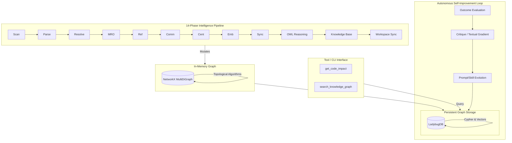
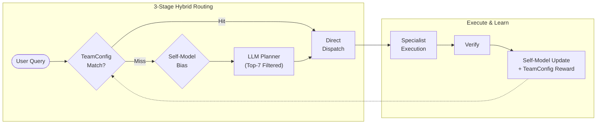
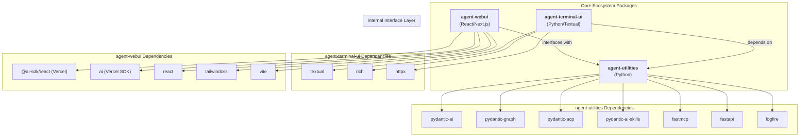
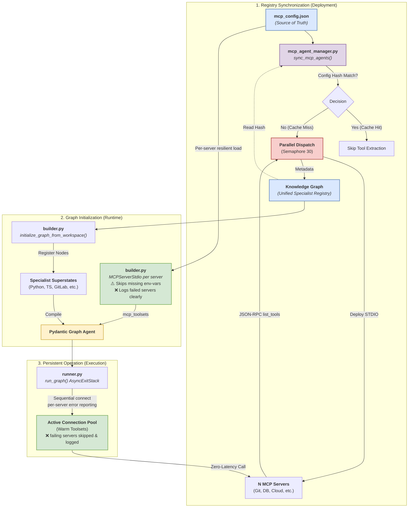

# Agent Utilities - AGI Harness


*Version: 0.4.0*

## Table of Contents

- [Overview](#overview)
- [Key Features](#key-features)
- [Intelligence Graph](#-intelligence-graph)
- [First Principles Architecture](#-first-principles-architecture)
- [Concept Map](#-concept-map)
- [Architecture & Orchestration](#architecture--orchestration)
- [Multi-Model Config & Secret Storage](#multi-model-config--secret-storage)
- [Installation](#installation)
- [Quick Start](#quick-start)
- [Creating an Agent](#creating-an-agent)
- [Building MCP Servers](#building-mcp-servers--api-wrappers)
- [API Documentation](#api-documentation)
- [Documentation](#documentation)
- [Contributing](#contributing)
- [License](#license)

## Overview
Agent Utilities provides a robust foundation for building production-ready Pydantic AI Agents with an Artificial General Intelligence (AGI) Harness, it simplifies agent creation, adds advanced **Graph Orchestration**, and provides essential "operating system" tools including state persistence, resilience, and high-fidelity streaming.

## Key Features

- **Native Multi-Modal (Vision) Support**: Direct processing of image context within the graph orchestrator. Decodes base64 image data into `pydantic_ai.BinaryContent` for high-fidelity multi-modal reasoning.
- **Dynamic MCP Tool Distribution**: Load an `mcp_config.json` and the system automatically connects to each MCP server, extracts and tags every tool, partitions them into focused specialist agents (~10-20 tools each), and registers them as graph nodes at runtime. This keeps context windows light — "GitLab Projects" specialist only sees 10 project tools.
- **Registry Hot Cache (AU-024)**: Session-scoped O(1) specialist lookups with event-driven invalidation. Filters 50+ specialists down to the top-7 relevant per query, reducing prompt bloat by ~7x. Invalidates on MCP reload, pipeline completion, Self-Model updates, and TeamConfig promotions.
- **TeamConfig Promotion (AU-025)**: Proven specialist coalitions are automatically persisted as reusable templates in the Knowledge Graph. Enables 3-stage hybrid routing: TeamConfig match → Self-Model bias → LLM planning fallback. Includes RLM + TeamConfig synergy for automatic recursive decomposition on large inputs.
- **AgentCapability Auto-Activation (AU-026)**: First-class KG capability nodes with trigger conditions and handler modules. Capabilities like RLM, critic, and summarizer auto-activate based on input constraints (e.g., input size, domain, tool count).
- **A2A-Native Graph Execution (AU-027)**: `PlannerGraphSkill` provides a direct A2A entry point that bypasses LLM orchestration overhead. When a graph is present, A2A requests route directly through the graph planner.
- **A2A Config File (AU-028)**: File-based external A2A agent discovery via `a2a_config.json`. Supports `secret://`, `env://`, and `vault://` auth token resolution. Includes soft-fail startup and periodic background re-fetch of remote agent cards.
- **Unified Specialist Model (AU-029)**: Collapses the `prompt`/`mcp` agent type distinction into a single `specialist` type. Any specialist can host any combination of MCP tools and/or agent skills. A2A agents remain their own execution protocol.
- **Post-Execution Feedback Loop**: Verification outcomes feed back to both the Self-Model (domain success rates, tool proficiency) and TeamConfig (reward tracking), enabling continuous routing improvement.
- **Process Lifecycle Management**: `atexit` and signal handlers ensure all child processes (MCP servers, TUI, background threads) are gracefully killed on server exit.
- **Flexible Skill Loading**: Unified `skill_types` parameter to dynamically load `universal` skills, `graphs`, or custom workspace toolsets.
- **Advanced Graph Orchestration**: Router → Planner → Dispatcher pipeline with parallel fan-out execution. Dynamic step registration for both hardcoded skill agents and MCP-discovered specialists.
- **Self-Healing**: Circuit breaker for MCP Servers (closed/open/half-open), specialist fallback chain, tool-level retries with exponential backoff, per-node timeout, and automatic re-planning on failure.
- **Self-Correcting**: Verifier feedback loop with structured `ValidationResult` scoring. Low-quality results trigger re-dispatch with feedback injection and preserved message history.
- **Self-Improving**: Execution memory persisted natively to the Knowledge Graph after each run. Past failure patterns automatically inform future routing decisions via the Self-Model (AU-016).
- **Agentic Engineering Patterns**: Out-of-the-box support for **TDD Cycles** (Red-Green-Refactor), **First Run Tests** (baseline establishment), **Agentic Manual Testing** (exploratory verification), **Code Walkthroughs** (linear documentation), and **Interactive Explanations** (HTML/JS artifacts).
- **Resilience & Accuracy**: Error recovery with local retries, re-planning loops, and result verification via the Verifier quality gate.
- **Observability**: Real-time **Graph Streaming** (SSE) and lifecycle events. Per-step state snapshots via `graph.iter()`. Early OTEL/logfire gate.
- **Direct Graph Execution**: Protocol adapters (AG-UI, ACP) can bypass the outer LLM agent and invoke `graph.iter()` directly, eliminating one full inference round-trip per request. Controlled via `GRAPH_DIRECT_EXECUTION` env var.
- **Typed Foundation**: Zero-config dependency injection using `AgentDeps`.
- **Specialist Discovery**: Automated discovery of domain specialists directly from the **Knowledge Graph**.
- **Autonomous Memory Architecture**: MAGMA-inspired orthogonal reasoning views (Semantic, Temporal, Causal, Entity) combined with Agent Lightning-style self-improvement loops. Unifies code awareness, chat memory, and **Research Knowledge Bases** (Medical, Chemistry, etc.) into a singular, schema-enforced graph. Cross-domain relationships emerge automatically through shared concepts. Supports unified ingestion of MCP, A2A, and Skill-based resources with automated importance scoring and temporal decay.
- **Agent Server**: Built-in FastAPI server with standardized `/mcp`, `/a2a`, `/acp` (Standardized Protocol), and **`/docs` (Swagger UI)** endpoints.
- **Automatic Documentation**: Runtime generation of OpenAPI specifications for all agent server APIs.
- **Workspace Management**: Automated management of agent state through standardized structures. (Note: Legacy files like `IDENTITY.md` and `USER.md` have been migrated to the Knowledge Graph and `main_agent.json` templates).
- **Spec-Driven Development (SDD)**: High-fidelity orchestration pipeline that decomposes goals into structured Specifications (`Spec`), Implementation Plans, and dependency-aware Tasks. Ensures technical precision and parallel execution safety.
- **Unified Intelligence Graph**: A powerful 14-phase topological pipeline that unifies **NetworkX** in-memory analysis with Cypher persistence. Enables deep structural codebase awareness, cross-repository symbol mapping, and long-term agent memory. Includes a **Hybrid OWL Reasoning Sidecar** for deterministic transitive inference.
- **Graph Database Abstraction**: Out-of-the-box support for multiple Cypher-compatible backends including **LadybugDB** (default embedded), **FalkorDB**, and **Neo4j**.
- **Graph-Native Ecosystem State**: Flat-file management (`MEMORY.md`, `USER.md`, `HEARTBEAT.md`, `CRON.md`) has been fully deprecated. Agent memory, execution logs, client profiles, and background scheduled tasks are now stored natively as highly-relational nodes within the Knowledge Graph.
- **Automated Graph Maintenance**: Built-in Cypher-driven maintenance routines (`maintenance.py`) that handle vector embedding enrichment, scheduled cron log pruning, intelligent chat summarization, and **Concept Merging/Pruning** to ensure sustainable long-term memory. Supports **Hub Node Protection** for critical foundational knowledge.
- **Lightweight & Lazy**: Core utilities are lightweight. Heavy dependencies are lazy-loaded only when requested via optional extras.

- **JSON-as-Code Prompting & Governance**: Standardized Pydantic models for structured prompting. Moves away from free-form Markdown to robust, versioned JSON blueprints for high-precision task specification. Engineering rule books have been migrated to the `agent_utilities/policies/` directory with versioned YAML frontmatter, and prompt-based governance uses an explicit `rules` key.
- **Project-Aware Memory (AGENTS.md)**: Native support for Claude-style project rules and memory. Backend automatically loads and injects `AGENTS.md` (Project Rules) into the system prompt for high-fidelity codebase awareness.

## 🧠 Intelligence Graph

Agent Utilities implements a sophisticated 14-phase pipeline to map and analyze your workspace. This system unifies **NetworkX** (for topological algorithms) and **LadybugDB** (for persistent Cypher queries and hybrid search).

### The 14-Phase Unified Intelligence Pipeline

| Phase | Name | Purpose |
| :--- | :--- | :--- |
| **1** | **Memory** | Hydrates existing state (Nodes/Edges) from **LadybugDB** to maintain session continuity. |
| **2** | **Scan** | Performs the initial directory walk, respecting `.gitignore`, to identify all source code files. |
| **3** | **Registry** | Ingests `prompts/*.md` and MCP server definitions into the **Knowledge Graph** as specialist nodes. |
| **4** | **Parse** | AST parsing (**tree-sitter**) to extract symbols (Classes, Functions) and raw import statements. |
| **5** | **Resolve** | Maps raw import strings into actual graph edges between `File` and `Symbol` nodes. |
| **6** | **MRO** | Calculates Method Resolution Order and inheritance hierarchies for OOP structures. |
| **7** | **Reference** | Builds the call graph by identifying where specific symbols are referenced or invoked. |
| **8** | **Communities** | Clusters nodes into tightly-coupled modules using topological algorithms like **Louvain**. |
| **9** | **Centrality** | Runs **PageRank** analysis to identify critical path "God Objects" and core utilities. |
| **10** | **Embedding** | Generates semantic vector embeddings for all symbols to enable high-fidelity hybrid search. |
| **11** | **Sync** | Projects the in-memory NetworkX graph into the persistent **LadybugDB** Cypher store. |
| **12** | **OWL Reasoning** | Promotes stable nodes to OWL, runs HermiT/Stardog inference, downfeeds inferred facts. |
| **13** | **Knowledge Base** | Compiles articles, concepts, and facts into the **LLM Knowledge Base** layer. |
| **14** | **Workspace Sync** | Clones repos from `workspace.yml` using **repository-manager** and triggers auto-ingestion. |

### Architecture



### MAGMA-Inspired Orthogonal Reasoning Views
The graph engine supports policy-guided retrieval across four orthogonal views:
- **Semantic View**: Traditional RAG/vector search for conceptual similarity.
- **Temporal View**: Episodic memory retrieval based on chronological sequences and Ebbinghaus-style temporal decay.
- **Causal View**: Reasoning traces and "Why" links (e.g., `ReasoningTrace -> ToolCall -> OutcomeEvaluation`).
- **Entity View**: Structural knowledge of People, Organizations, Locations, and Code Symbols.
- **Research Knowledge Base**: Grounded evidence and sources for domain-specific topics (e.g., Medical Journals).

## 🧬 First Principles Architecture

The **First Principles Architecture** (AU-024 through AU-027) rewires the routing, dispatch, and feedback layers from basic primitives. These four concepts solve the key scalability and intelligence bottlenecks that emerge when managing dozens of specialists and hundreds of tools.

| Concept | Problem Solved | Solution |
|:--------|:--------------|:---------|
| **AU-024: Registry Hot Cache** | O(N) specialist lookups on every routing call | Session-scoped cache with O(1) lookups, event-driven invalidation |
| **AU-025: TeamConfig Promotion** | LLM re-discovers same specialist teams for recurring patterns | Persist proven coalitions as reusable templates in the KG |
| **AU-026: AgentCapability System** | Static tool bindings; no dynamic capability activation | First-class KG capability nodes with trigger conditions |
| **AU-027: PlannerGraphSkill** | A2A requests require full LLM round-trip | Direct graph-backed A2A routing, bypassing LLM overhead |
| **AU-028: A2A Config File** | No mechanism to discover/register external A2A agents | File-based auto-discovery with `secret://` auth & periodic refresh |
| **AU-029: Unified Specialist** | Artificial `prompt`/`mcp` type split complicates dispatch | Single `specialist` type hosting any tools/skills combination |



→ **Deep-dive**: [docs/first-principles.md](docs/first-principles.md) · [docs/registry-cache.md](docs/registry-cache.md) · [docs/process-lifecycle.md](docs/process-lifecycle.md)

## 🗺 Concept Map

The full architecture is organized into **29 traceable concepts** (AU-001 through AU-029). Each concept has a unique identifier, code path, and deep-dive documentation link.

→ **Full Concept Map table**: [docs/overview.md](docs/overview.md#concept-index) — includes all 29 concepts with descriptions, source paths, and documentation links.

| Group | Concepts | Focus |
|:------|:---------|:------|
| Core Infrastructure | AU-001 to AU-006, AU-010, AU-011 | Agent creation, workspace, serialization, prompts, tools, security |
| Advanced Patterns | AU-007, AU-008, AU-009, AU-012 | RLM, resilience, SDD, harness engineering |
| Emergent Architecture | AU-013 to AU-017 | KG OGM, swarm, variants, self-model, attention |
| Design Patterns | AU-018 to AU-022 | Prompt chaining, resource optimization, evaluation, prioritization, exploration |
| First Principles | AU-024 to AU-027 | Registry cache, TeamConfig, capability system, A2A planner |
| Unified Specialist & A2A | AU-028, AU-029 | A2A config file loader, unified specialist type collapse |

## Architecture & Orchestration

| `adguard-home-agent` | Graph |
| `agent-utilities` | Library | Production-grade Orchestration. Supports Parallel execution, Real-time sub-agent streaming, High-fidelity observability, and Session Resumability |
| `agent-webui` | Library | Cinematic Graph Activity Visualization. |
| `agent-terminal-ui` | Library | High-performance Terminal User Interface (TUI) achieving feature parity with **Claude Code** (Slash commands, Keyboard shortcuts, File mentions). |

`agent-utilities` implements a multi-stage execution pipeline using `pydantic-graph` for maximum precision and resilience. Protocol adapters (AG-UI, ACP) leverage `graph.iter()` for direct, step-by-step graph execution — bypassing the outer LLM agent entirely when a graph is present.

### Ecosystem Dependency Graph



### C4 Container Diagram


### MCP Tools Mapping

| Ecosystem Category | MCP Server | Tool / Agent |
| :--- | :--- | :--- |
| **Infrastructure** | `adguard-mcp` | AdGuard Home Agent |
| **Infrastructure** | `systems-mcp` | Systems Manager |
| **Development** | `github-mcp` | GitHub Agent |
| **Development** | `gitlab-mcp` | GitLab API |
| **Media & HomeLab** | `jellyfin-mcp` | Jellyfin Agent |

### Human-in-the-Loop (Tool Approval & Elicitation)

`agent-utilities` provides true **pause-and-resume** human-in-the-loop for sensitive tool execution and MCP elicitation. When a specialist sub-agent calls a tool flagged with `requires_approval=True`, the graph suspends at that exact node, streams an approval request to the connected UI, and resumes only after the user responds.

**Key Components:**
- **`ApprovalManager`** (`approval_manager.py`) — asyncio.Future-based registry that pauses coroutines and resumes them when the UI responds
- **`run_with_approvals()`** — wraps pydantic-ai's two-call `DeferredToolRequests` → `DeferredToolResults` pattern into a single blocking call
- **`/api/approve`** endpoint — REST endpoint that both UIs POST to when the user approves/denies
- **`global_elicitation_callback()`** — MCP `ctx.elicit()` callback using the same pause/resume mechanism

**Protocol Support:**
| Protocol | Approval Mechanism |
|---|---|
| AG-UI (web + terminal) | Sideband SSE events + `POST /api/approve` |
| ACP | pydantic-acp's native `NativeApprovalBridge` (automatic) |
| SSE (`/stream`) | Same as AG-UI |

### Server Endpoints

| Endpoint | Method | Description |
|---|---|---|
| `/health` | GET | Health check and server metadata |
| `/ag-ui` | POST | AG-UI streaming with sideband graph events |
| `/stream` | POST | SSE stream for graph execution |
| `/acp` | MOUNT | ACP protocol (sessions, planning, approvals) |
| `/a2a` | MOUNT | Agent-to-Agent JSON-RPC |
| `/api/approve` | POST | Resolve pending tool approvals and MCP elicitation |
| `/chats` | GET | List chat sessions |
| `/chats/{id}` | GET/DELETE | Get or delete a chat session |
| `/mcp/config` | GET | Current MCP server configuration |
| `/mcp/tools` | GET | List all connected MCP tools |
| `/mcp/reload` | POST | Hot-reload MCP servers and rebuild graph |

### Spec-Driven Development (SDD) Lifecycle

`agent-utilities` implements a rigorous SDD workflow to ensure that complex feature requests are handled with absolute technical fidelity and measurable success criteria.

1.  **Project Constitution** (`constitution-generator`): Establishes the governing principles, tech stack standards, and quality gates for the entire agent workshop.
2.  **Requirement Specification** (`spec-generator`): Decomposes user intent into a formal `Spec` including user scenarios, functional requirements, and measurable success metrics.
3.  **Technical Implementation Plan** (`task-planner`): Generates a step-by-step architectural approach and a `Tasks` model with explicit dependencies and file-path affinity for collision-free parallel execution.
4.  **Baseline & Manual Testing**: Integrates `first_run_tests` and `run_manual_test` into the implementation phase to ensure baseline stability and exploratory verification.
5.  **Parallel Execution** (`SDDManager`): The `dispatcher` leverages the SDD analysis engine to identify safe parallel execution batches, fanning out implementation tasks to domain specialists (Python, TS, etc.).
6.  **Quality Verification & Documentation**: Audits results via `spec-verifier`, then generates `code-walkthrough` and `interactive-explain` artifacts to document the final implementation.

### Execution Flow: Dynamic Multi-Layer Parallelism
`agent-utilities` implements a multi-stage execution pipeline with **autonomous gap analysis** and **resilient feedback loops**. The system can "fan out" research tasks in parallel before coalescing results. If implementation fails, it can automatically retry locally or loop back to research.


### MCP Loading & Registry Architecture
This diagram illustrates how MCP servers are discovered, specialized, and persisted in the graph.




## Quick Start

```bash
# Start a Graph Agent server with Universal Skills
agent-utilities --provider openai --model-id gpt-4o --skill-types universal,graphs

# Start with a custom MCP configuration
agent-utilities --mcp-config mcp_config.json --web --port 8000

# Run in validation mode (no API keys required)
VALIDATION_MODE=true agent-utilities --debug
```

```python
from agent_utilities import create_agent, create_graph_agent_server

# Quick agent creation
agent = create_agent(name="MyAgent", skill_types=["universal", "graphs"])

# Full server with protocols (ACP, A2A, MCP, AG-UI)
create_graph_agent_server(provider="openai", model_id="gpt-4o", port=8000)
```

> See [docs/creating-an-agent.md](docs/creating-an-agent.md) for the complete walkthrough.

## Multi-Model Config

### Multi-Model Configuration (`MODELS_CONFIG`)

Define a registry of models mapped to routing tiers (`light`, `medium`, `heavy`, `reasoning`) and capabilities. The graph orchestrator autonomously selects the right model for each task based on required complexity.

**Light Configuration Example:**
```json
{
  "models": [
    {
      "id": "gpt-mini", "provider": "openai", "model_id": "gpt-4o-mini",
      "api_key_env": "OPENAI_API_KEY", "tier": "medium", "tags": ["code"]
    }
  ]
}
```
**Usage:**
```bash
export MODELS_CONFIG=/path/to/models.json
```
*The graph orchestrator automatically uses `pick_for_task(complexity="medium")` during execution.*
> **Full Documentation:** See [docs/models.md](docs/models.md) for advanced schema options, local model fallbacks, and routing logic.

## Local Secret Storage (Vault & SQLite)

The ecosystem provides a unified `SecretsClient` designed to replace static `.env` files, supporting `inmemory`, `sqlite`, and HashiCorp `vault` backends.

**Light Configuration Example (SQLite):**
```bash
export SECRETS_BACKEND=sqlite
export SECRETS_SQLITE_PATH=~/.agent-utilities/secrets.db
```

**Usage in Code & URI Schemes:**
Secrets can be resolved securely in Python via the context, or directly in `mcp_config.json` via URI schemes:
```python
# Direct code resolution without os.environ
token = ctx.deps.secrets_client.get_or_env("gitlab/token", "GITLAB_TOKEN")

# URI Scheme support for configuration files
"env_vars": { "GITLAB_TOKEN": "secret://gitlab/token" }
```

**Secret Manager CLI:**
Use the built-in CLI to easily populate your local database before running your agent:
```bash
secret-manager set gitlab/token glpat-xxx
secret-manager list
```

> **Full Documentation:** See [docs/secrets-auth.md](docs/secrets-auth.md) for HashiCorp Vault setup, encryption details, and API references.

## Installation

```bash
# Core utilities only (Minimal)
pip install agent-utilities

# ---------------------------------------------------------
# 1. Agent & Orchestration Environments
# ---------------------------------------------------------
# With full agent support (recommended - includes terminal, ag-ui, mcp, graph)
pip install agent-utilities[agent]

# Protocol adapters & UI
pip install agent-utilities[acp]        # Standardized ACP protocol
pip install agent-utilities[ag-ui]      # Agent WebUI streaming
pip install agent-utilities[terminal]   # Terminal UI

# Browser & Web Automation
pip install agent-utilities[browser]    # Playwright browser integration

# ---------------------------------------------------------
# 2. Model Providers (Slim dependencies)
# ---------------------------------------------------------
pip install agent-utilities[agent-anthropic]
pip install agent-utilities[agent-google]
pip install agent-utilities[agent-groq]
pip install agent-utilities[agent-mistral]
pip install agent-utilities[agent-huggingface]

# ---------------------------------------------------------
# 3. Alternative Knowledge Graph Backends
# ---------------------------------------------------------

pip install agent-utilities[neo4j]
pip install agent-utilities[falkordb]

# ---------------------------------------------------------
# 4. RAG & Embeddings
# ---------------------------------------------------------
# Base embedding support
pip install agent-utilities[embeddings]

# Provider-specific embeddings
pip install agent-utilities[embeddings-openai]
pip install agent-utilities[embeddings-huggingface]
pip install agent-utilities[embeddings-ollama]

# ---------------------------------------------------------
# 5. OWL Reasoning & Ontologies
# ---------------------------------------------------------
# Core OWL reasoning (Owlready2 + HermiT)
# Note: Requires Java Runtime Environment (sudo apt install default-jre)
pip install agent-utilities[owl]

# Stardog OWL backend
pip install agent-utilities[stardog]

# ---------------------------------------------------------
# 6. Tools & Infrastructure
# ---------------------------------------------------------
pip install agent-utilities[mcp]        # MCP Server hosting capabilities
pip install agent-utilities[logfire]    # Observability & Tracing
pip install agent-utilities[vault]      # HashiCorp Vault secrets
pip install agent-utilities[auth]       # Authlib integration

# ---------------------------------------------------------
# 7. Everything
# ---------------------------------------------------------
# Install all production dependencies
pip install agent-utilities[all]
```


## API Documentation

Every agent server automatically hosts an interactive Swagger UI for its APIs.

- **URL**: `http://localhost:8000/docs`
- **Spec**: `http://localhost:8000/openapi.json`

This interface allows you to test the `/health`, `/acp`, and `/mcp` endpoints directly from your browser.

## Creating an Agent

All agents in the ecosystem follow the same pattern powered by `agent-utilities`. Here's the reference template used by `genius-agent`:

```python
#!/usr/bin/python
import logging, os, sys
from agent_utilities import (
    build_system_prompt_from_workspace,
    create_agent_parser,
    create_graph_agent_server,
    initialize_workspace,
    load_identity,
)

__version__ = "1.0.0"
logging.basicConfig(level=logging.INFO, format="%(asctime)s - %(name)s - %(levelname)s - %(message)s")

initialize_workspace()
# Note: load_identity() now transparently retrieves the agent's identity from the Knowledge Graph
meta = load_identity()

DEFAULT_AGENT_NAME = os.getenv("DEFAULT_AGENT_NAME", meta.get("name", "My Agent"))
DEFAULT_AGENT_SYSTEM_PROMPT = os.getenv(
    "AGENT_SYSTEM_PROMPT", meta.get("content") or build_system_prompt_from_workspace()
)

def agent_server():
    print(f"{DEFAULT_AGENT_NAME} v{__version__}", file=sys.stderr)
    parser = create_agent_parser()
    args = parser.parse_args()
    create_graph_agent_server(
        mcp_url=args.mcp_url, mcp_config=args.mcp_config or "mcp_config.json",
        host=args.host, port=args.port, provider=args.provider,
        model_id=args.model_id, base_url=args.base_url, api_key=args.api_key,
        enable_web_ui=args.web, debug=args.debug,
    )

if __name__ == "__main__":
    agent_server()
```

> **Full guide**: See [docs/creating-an-agent.md](docs/creating-an-agent.md) for the complete walkthrough including project structure, `main_agent.json`, `mcp_config.json`, `pyproject.toml`, and all CLI flags.

## Building MCP Servers & API Wrappers

Use `create_mcp_server()` to bootstrap a fully configured FastMCP server with authentication, middleware, and CLI parsing:

```python
from agent_utilities.mcp.utilities import create_mcp_server, ctx_progress, ctx_log, ctx_confirm_destructive
from fastmcp import Context
from pydantic import Field

args, mcp, middlewares = create_mcp_server(name="My Service MCP", version="1.0.0")

@mcp.tool(annotations={"title": "Delete Resource", "destructiveHint": True}, tags={"resources"})
async def delete_resource(
    resource_id: str = Field(description="Resource ID to delete."),
    ctx: Context = Field(description="MCP context.", default=None),
) -> dict:
    """Delete a resource. Expected return object type: dict"""
    if not await ctx_confirm_destructive(ctx, f"delete resource {resource_id}"):
        return {"status": "cancelled"}
    await ctx_progress(ctx, 0, 100)
    # ... perform deletion ...
    await ctx_progress(ctx, 100, 100)
    return {"status": "success", "deleted": resource_id}
```

**Context helpers** (`ctx_*`) are the standard way to interact with MCP context across the ecosystem:
- `ctx_progress(ctx, progress, total)` — Report progress
- `ctx_confirm_destructive(ctx, action)` — Elicitation guard for destructive operations
- `ctx_log(ctx, logger, level, msg)` — Dual-log to server and MCP client
- `ctx_set_state/ctx_get_state` — Namespaced session state
- `ctx_sample(ctx, prompt)` — Ask the client LLM to generate a response

> **Full guide**: See [docs/building-mcp-servers.md](docs/building-mcp-servers.md) for complete coverage including API wrappers, authentication options, OpenAPI import, and running instructions.


## Documentation

Comprehensive system documentation is available in the [`docs/`](docs/) directory:

> **New to the project?** Start with the [**Concept Overview Map**](docs/overview.md) to get oriented.

### Getting Started

| Guide | Description |
| :--- | :--- |
| [Overview Map](docs/overview.md) | The Concept Galaxy connecting all 29 core concepts (AU-001 to AU-029), plus the **Concept Map table** |
| [Creating an Agent](docs/creating-an-agent.md) | Step-by-step guide to bootstrapping a new Pydantic AI agent |
| [Building MCP Servers](docs/building-mcp-servers.md) | Guide for creating FastMCP servers, API wrappers, and context helpers |

### Architecture & Design

| Guide | Description |
| :--- | :--- |
| [Architecture](docs/architecture.md) | System architecture, component diagrams, protocol adapters, 3-stage routing, direct graph execution |
| [AHE Architecture](docs/AHE_ARCHITECTURE.md) | Agentic Harness Engineering — trace distillation, prompt evolution, component observation |
| [Design Patterns](docs/design-patterns-alignment.md) | Alignment of codebase with established AHE and SDD design patterns |
| [Hierarchical State Machines](docs/hsm.md) | Orthogonal regions, entry/exit hooks, and static routing |

### Intelligence & Learning

| Guide | Description |
| :--- | :--- |
| [Knowledge Graph](docs/knowledge-graph.md) | Unified Intelligence Graph, 14-phase pipeline, OWL Reasoning, MAGMA views, maintenance |
| [Emergent Architecture](docs/emergent-architecture.md) | OGM, Swarm Orchestration, Variant Selection, Self-Model, Global Workspace Attention (AU-013–AU-017) |
| [First Principles Architecture](docs/first-principles.md) | Registry Hot Cache, TeamConfig Promotion, AgentCapability System, A2A PlannerGraphSkill (AU-024–AU-027) |
| [Registry Cache](docs/registry-cache.md) | Session-scoped O(1) specialist lookups, event-driven invalidation, performance analysis |

### Execution & Orchestration

| Guide | Description |
| :--- | :--- |
| [Agents & Orchestration](docs/agents.md) | Specialist registry, MCP loading, event system, memory CRUD, governance |
| [SDD Orchestrator](docs/sdd.md) | Spec-Driven Development pipeline and task decomposition |
| [RLM / REPL](docs/rlm.md) | Recursive Language Model patterns, smart auto-triggers, AHE integration, KG/OWL helpers |
| [Features](docs/features.md) | Model registry, SDD lifecycle, human-in-the-loop, tool safety, agentic patterns, process lifecycle |

### Configuration & Security

| Guide | Description |
| :--- | :--- |
| [Configuration](docs/configuration.md) | Unified reference for all environment variables, config files, and CLI flags |
| [Models & Routing](docs/models.md) | Multi-model registries, routing tiers, and `MODELS_CONFIG` |
| [Secrets & Auth](docs/secrets-auth.md) | `SecretsClient`, Vault integration, URI references, and `secret-manager` CLI |
| [Capabilities](docs/capabilities.md) | Self-healing, circuit breakers, checkpointing, capability auto-activation, team dispatch |

### Reference

| Guide | Description |
| :--- | :--- |
| [Tools Registry](docs/tools.md) | 18 tool modules across 5 categories |
| [Structured Prompts](docs/structured-prompts.md) | JSON prompt schema, Pydantic models, and prompt catalog |
| [Process Lifecycle](docs/process-lifecycle.md) | Sidecar cleanup, signal handling, and child process management |
| [Development](docs/development.md) | Developer guide, testing strategies, contributing rules, and repository management |

## Contributing

Contributions are welcome. Please follow these guidelines:

1. **Fork** the repository and create a feature branch.
2. **Write tests** for new functionality — all tests must include assertions.
3. **Follow existing patterns** — use the established Pydantic models, structured prompts, and concept markers.
4. **Run the test suite** before submitting: `uv run pytest tests/ -q`
5. **Update documentation** in `docs/` if your changes affect public APIs.

See [AGENTS.md](AGENTS.md) for project-specific conventions and architecture rules.

## License

This project is licensed under the terms specified in the [LICENSE](LICENSE) file.
