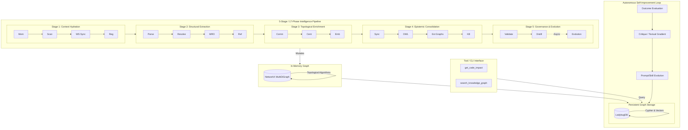
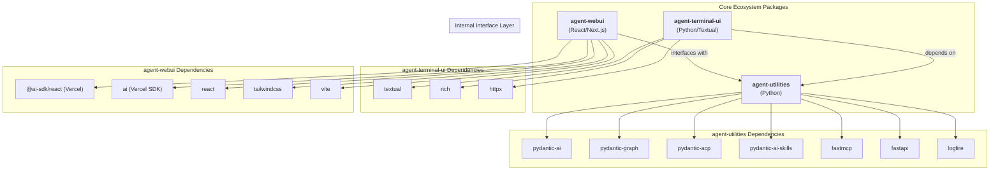
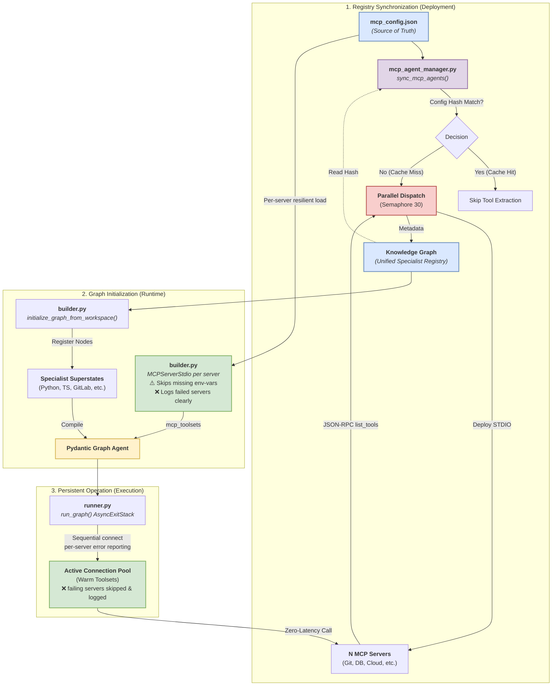

# Agent Utilities - AGI Harness


*Version: 0.10.0*

## Table of Contents

- [Overview](#overview)
- [Key Features](#key-features)
- [Intelligence Graph](#-intelligence-graph)
- [First Principles Architecture](#-first-principles-architecture)
- [Concept Map](#-concept-map)
- [Architecture & Orchestration](#architecture--orchestration)
- [Multi-Model Config & Secret Storage](#multi-model-config--secret-storage)
- [Installation](#installation)
- [Quick Start](#quick-start)
- [Creating an Agent](#creating-an-agent)
- [Building MCP Servers](#building-mcp-servers--api-wrappers)
- [API Documentation](#api-documentation)
- [Documentation](#documentation)
- [Contributing](#contributing)
- [License](#license)

## 🌌 Mission & Future State: Distributed Evolution
The core vision for `agent-utilities` transcends being just an execution harness—it is the bedrock for **Distributed Agentic Evolution**.

As autonomous agents leverage this ecosystem to solve complex problems, they continuously learn, adapt, and refine their own capabilities. Our future state envisions a community of independent, self-improving agents that not only run on this harness but dynamically contribute their localized evolutionary breakthroughs—new skills, optimized TeamConfigs, refined prompts, and advanced reasoning traces—back to the open-source collective.

By tying our unified Knowledge Graph, capability auto-activation, and cross-agent communication protocols together, `agent-utilities` becomes an interconnected hive mind where the evolution of one agent elevates the intelligence of all. The harness is not just a way to run an agent; it is the heartbeat of a distributed, self-evolving intelligence network.

## Key Features

- **Multi-Domain Architectural Pattern**: Transitioned `agent-utilities` to a Multi-Domain Expert System supporting modular expansion into `finance`, `medical`, `law`, and `science`. Domain integrations leverage Vectorized Topological Memory and the core Knowledge Graph, with heavy domain-specific dependencies optionally loaded via tags (e.g., `agent-utilities[finance]`).
- **Quantitative Finance Framework**: Production-grade, KG-native financial framework designed for global asset classes (Crypto, Equities, Forex, Derivatives). Includes Stationary Feature Engineering (ADF tests), Topological TradingLSTM (sequence processing + networkx regimes), Walk-Forward Validation, Kelly Criterion sizing, and Kolmogorov-Smirnov shift detection.
- **Background Concept Research Daemon (CONCEPT:KG-2.6)**: Native, persistent background intelligence integration. Selects high-degree concepts and queues them for deep analysis using the configured inference model (configured via `model_registry_path` and `KG_INFERENCE_MODEL`).
- **API Client Standardization**: Unified `api_client.py` file naming convention across the entire ecosystem, simplifying downstream imports and skill tooling.
- **FIBO & Quant Ontology Alignment**: Extended `ontology.ttl` with `DomainEntity`, `ScientificEntity`, `LegalEntity`, and specialized finance classes (`FinancialInstrument`, `TradingStrategy`, `StationaryFeature`, `LSTMNetwork`, `MarketRegime`, `ExecutionSignal`, `KellySizing`).
- **Native Multi-Modal (Vision) Support (CONCEPT:ORCH-1.0)**: Direct processing of image context within the graph orchestrator. Decodes base64 image data into `pydantic_ai.BinaryContent` for high-fidelity multi-modal reasoning.
- **Dynamic MCP Tool Distribution (CONCEPT:ECO-4.0)**: Load an `mcp_config.json` and the system automatically connects to each MCP server, extracts and tags every tool, partitions them into focused specialist agents (~10-20 tools each), and registers them as graph nodes at runtime. This keeps context windows light — "GitLab Projects" specialist only sees 10 project tools.
- **Registry Hot Cache (CONCEPT:ORCH-1.2)**: Session-scoped O(1) specialist lookups with event-driven invalidation. Filters 50+ specialists down to the top-7 relevant per query, reducing prompt bloat by ~7x. Invalidates on MCP reload, pipeline completion, Self-Model updates, and TeamConfig promotions.
- **TeamConfig Promotion (CONCEPT:AHE-3.3)**: Proven specialist coalitions are automatically persisted as reusable templates in the Knowledge Graph. Enables 3-stage hybrid routing: TeamConfig match → Self-Model bias → LLM planning fallback. Includes RLM + TeamConfig synergy for automatic recursive decomposition on large inputs.
- **AgentCapability Auto-Activation (CONCEPT:ORCH-1.2)**: First-class KG capability nodes with trigger conditions and handler modules. Capabilities like RLM, critic, and summarizer auto-activate based on input constraints (e.g., input size, domain, tool count).
- **A2A-Native Graph Execution (CONCEPT:ECO-4.1)**: `PlannerGraphSkill` provides a direct A2A entry point that bypasses LLM orchestration overhead. When a graph is present, A2A requests route directly through the graph planner.
- **A2A Config File (CONCEPT:ECO-4.1)**: File-based external A2A agent discovery via `a2a_config.json`. Supports `secret://`, `env://`, and `vault://` auth token resolution. Includes soft-fail startup and periodic background re-fetch of remote agent cards.
- **Unified Specialist Model (CONCEPT:ORCH-1.2)**: Collapses the `prompt`/`mcp` agent type distinction into a single `specialist` type. Any specialist can host any combination of MCP tools and/or agent skills. A2A agents remain their own execution protocol.
- **Post-Execution Feedback Loop (CONCEPT:AHE-3.3)**: Verification outcomes feed back to both the Self-Model (domain success rates, tool proficiency) and TeamConfig (reward tracking), enabling continuous routing improvement.
- **Process Lifecycle Management (CONCEPT:OS-5.2)**: `atexit` and signal handlers ensure all child processes (MCP servers, TUI, background threads) are gracefully killed on server exit.
- **Flexible Skill Loading (CONCEPT:ECO-4.0)**: Unified `skill_types` parameter to dynamically load `universal` skills, `graphs`, or custom workspace toolsets.
- **Advanced Graph Orchestration (CONCEPT:ORCH-1.0)**: Router → Planner → Dispatcher pipeline with parallel fan-out execution. Dynamic step registration for both hardcoded skill agents and MCP-discovered specialists.
- **Self-Healing (CONCEPT:ORCH-1.3)**: Circuit breaker for MCP Servers (closed/open/half-open), specialist fallback chain, tool-level retries with exponential backoff, per-node timeout, and automatic re-planning on failure.
- **Self-Correcting (CONCEPT:AHE-3.1)**: Verifier feedback loop with structured `ValidationResult` scoring. Low-quality results trigger re-dispatch with feedback injection and preserved message history.
- **Self-Improving (CONCEPT:KG-2.1)**: Execution memory persisted natively to the Knowledge Graph after each run. Past failure patterns automatically inform future routing decisions via the Self-Model (CONCEPT:KG-2.1).
- **Agentic Engineering Patterns (CONCEPT:AHE-3.2)**: Out-of-the-box support for **TDD Cycles** (Red-Green-Refactor), **First Run Tests** (baseline establishment), **Agentic Manual Testing** (exploratory verification), **Code Walkthroughs** (linear documentation), and **Interactive Explanations** (HTML/JS artifacts).
- **Observability (CONCEPT:OS-5.4)**: Real-time **Graph Streaming** (SSE) and lifecycle events. Per-step state snapshots via `graph.iter()`. Early OTEL/logfire gate.
- **Direct Graph Execution (CONCEPT:ORCH-1.0)**: Protocol adapters (AG-UI, ACP) can bypass the outer LLM agent and invoke `graph.iter()` directly, eliminating one full inference round-trip per request. Controlled via `GRAPH_DIRECT_EXECUTION` env var.
- **Specialist Discovery (CONCEPT:ECO-4.0)**: Automated discovery of domain specialists directly from the **Knowledge Graph**.
- **Autonomous Memory Architecture (CONCEPT:KG-2.1)**: MAGMA-inspired orthogonal reasoning views (Semantic, Temporal, Causal, Entity) combined with Autonomous Self-Improvement loops. Unifies code awareness, chat memory, and **Research Knowledge Bases** (Medical, Chemistry, etc.) into a singular, schema-enforced graph. Cross-domain relationships emerge automatically through shared concepts. Supports unified ingestion of MCP, A2A, and Skill-based resources with automated importance scoring and temporal decay.
- **Agent Server (CONCEPT:ECO-4.0)**: Built-in FastAPI server with standardized `/mcp`, `/a2a`, `/acp` (Standardized Protocol), and **`/docs` (Swagger UI)** endpoints.
- **Automatic Documentation (CONCEPT:ECO-4.0)**: Runtime generation of OpenAPI specifications for all agent server APIs.
- **Workspace Management (CONCEPT:OS-5.0)**: Automated management of agent state through standardized structures. (Note: Legacy files like `IDENTITY.md` and `USER.md` have been migrated to the Knowledge Graph and `main_agent.json` templates).
- **Spec-Driven Development (SDD) (CONCEPT:ORCH-1.7)**: High-fidelity orchestration pipeline that decomposes goals into structured Specifications (`Spec`), Implementation Plans, and dependency-aware Tasks. Ensures technical precision and parallel execution safety.
- **Unified Intelligence Graph (CONCEPT:ORCH-1.0)**: A powerful 15-phase topological pipeline that unifies **NetworkX** in-memory analysis with Cypher persistence. Enables deep structural codebase awareness, cross-repository symbol mapping, and long-term agent memory. Includes a **Hybrid OWL Reasoning Sidecar** for deterministic transitive inference and a **Graph Integrity Validator** for post-ingestion validation.
- **Graph Database Abstraction (CONCEPT:KG-2.0)**: Out-of-the-box support for multiple Cypher-compatible backends including **LadybugDB** (default embedded), **FalkorDB**, and **Neo4j**.
- **Graph-Native Ecosystem State (CONCEPT:KG-2.0)**: Flat-file management (`MEMORY.md`, `USER.md`, `HEARTBEAT.md`, `CRON.md`) has been fully deprecated. Agent memory, execution logs, client profiles, and background scheduled tasks are now stored natively as highly-relational nodes within the Knowledge Graph.
- **Automated Graph Maintenance (CONCEPT:KG-2.0)**: Built-in Cypher-driven maintenance routines (`maintenance.py`) that handle vector embedding enrichment, scheduled cron log pruning, intelligent chat summarization, and **Concept Merging/Pruning** to ensure sustainable long-term memory. Supports **Hub Node Protection** for critical foundational knowledge.
- **Confidence-Gated & Adaptive Model Routing (CONCEPT:ORCH-1.2)**: Adaptive model tier selection using runtime confidence signals from specialist consensus, plus fast-path model routing (`gpt-4o-mini`) for simple queries. High-confidence groups route to cheaper models; low-confidence groups escalate. Also leverages ACO pheromone trails to actively down-weight specialists with historically low success rates.
- **Evolutionary Aggregation (CONCEPT:ORCH-1.2)**: Group-level diversity scoring with three-tier aggregation (majority vote / light synthesis / deep aggregation). Convergence-aware early stopping prevents diversity collapse in multi-loop specialist tasks.
- **Schema Packs (CONCEPT:KG-2.2)**: Domain-configurable KG profiles with dual ADDITIVE/EXCLUSIVE modes. Scopes active node types, edge types, retrieval boosts, and OWL extensions to a specific domain. Pre-built packs: `core`, `research-state`, `biomedical`, `finance`.
- **Backlink-Density Retrieval Boost (CONCEPT:KG-2.2)**: Logarithmic in-degree retrieval weighting in `HybridRetriever`. Hub entities with many inbound edges are boosted proportionally. Pack-configurable strategy: `global`, `context_only`, or `disabled`.
- **KG Eval Capture (CONCEPT:KG-2.2)**: Lightweight regression testing harness recording query-result pairs to a separate SQLite database. Enables Jaccard@k replay and top-1 stability tracking after KG changes.
- **Conductor Workflow Specification (CONCEPT:ORCH-1.1)**: Refined natural-language subtask instructions per specialist step. The planner crafts focused sub-goals tailored to each specialist's strengths instead of forwarding the raw user query. Inspired by the RL Conductor (Nielsen et al., ICLR 2026).
- **Multi-Level Abstraction Layering (CONCEPT:ORCH-1.3)**: Planners emit coarse-grained abstraction steps and delegate fine-grained execution to specialist nodes, reducing upfront planning token overhead.
- **Execution Visibility Graph (CONCEPT:ORCH-1.1)**: Per-step `access_list` controlling which prior step results are visible to each specialist. Enables tree-structured workflows with precise context isolation, reducing prompt bloat and preventing context pollution.
- **Model Synergy Tracker (CONCEPT:AHE-3.3)**: Tracks per-model-combination success rates in the SelfModel via EMA. When a preferred model becomes unavailable, the system queries historical synergies to find the best alternative combination.
- **Recursive Graph Orchestration (CONCEPT:ORCH-1.1)**: Nested `run_graph()` calls for self-referential test-time scaling. When a plan fails, a recursive orchestrator spawns an inner graph with the parent's full error context to devise a corrected strategy. Controlled by `MAX_RECURSION_DEPTH` (default 2).
- **Structural Fingerprint Engine (CONCEPT:KG-2.3)**: AST-based signature extraction and three-level change classification (NONE/COSMETIC/STRUCTURAL) for incremental KG updates. Avoids costly full re-ingestion when only comments or formatting changed. Generic capability for any workspace.
- **Graph Integrity Validator (CONCEPT:KG-2.3)**: Non-blocking 4-tier graph validation inspired by Understand-Anything's graph-reviewer. Auto-fixes LLM type aliases (30+ mappings), clamps out-of-range scores, detects dangling edges, orphan nodes, and self-referencing loops. Runs as the 15th pipeline phase.
- **Entity-Claim Extraction / MAGMA Completion (CONCEPT:KG-2.2)**: Two-phase entity-claim extraction that fills the MAGMA epistemic view with real data. Deterministic regex extraction of citations, wikilinks, and assertions + `ClaimNode` model with confidence scoring. `retrieve_epistemic_view()` now fully implemented with Cypher queries.
- **Wide-Search Orchestration (CONCEPT:ORCH-1.1)**: Pydantic-native Graph node architecture for orchestrating large-scale extractions. Automates batch decomposition within the SDD pipeline and uses a hybrid validation strategy (fast-path schema validation + slow-path `wide_search_joiner` LLM repair node).
- **Trace Distillation Error Categorization (CONCEPT:AHE-3.1)**: Categorizes orchestrator (`ORCHESTRATOR_SKILL`) vs worker (`WORKER_SKILL`) failure modes through AHE skill distillation to enable targeted self-evolving updates.
- **Context-Aware Entity Representations (CONCEPT:KG-2.2)**: Injects multi-hop topological structure (up to 2 levels of parents/children) and OWL-inferred relationships directly into node vector embeddings. Enables robust "topology-aware" semantic search and immediate re-embedding on inference downfeed.
- **Experience Node Architecture (CONCEPT:AHE-3.4)**: Introduces `ExperienceNode` to natively store condition-action tactical rules inside the Knowledge Graph for continual learning.
- **Cross-Rollout Critique (CONCEPT:AHE-3.4)**: Adds contrastive self-correction distillation. When a failure is followed by a successful retry, the system distills the action-level tactical fix and persists it as an `ExperienceNode`.
- **Decomposed Context Retrieval (CONCEPT:AHE-3.4)**: Modifies `HybridRetriever` to decompose complex queries into abstract technical sub-queries for targeted multi-vector retrieval, expanding context precision.
- **Inductive Knowledge Hypergraphs (CONCEPT:KG-2.4)**: Implements Positional Interaction Encodings (`EncPI`) to map true n-ary relationships (hyperedges) natively into the unified intelligence pipeline. By vectorizing relation intersections, the `HybridRetriever` achieves zero-shot generalization over entirely novel runtime topologies.
- **Memory-Aware Test-Time Scaling (CONCEPT:AHE-3.4)**: Integrates batch-parallel trajectory generation into the HTN planner. Distills reasoning memory concurrently across multiple parallel attempts (successes and failures) yielding zero-shot hypergraph generalization and structural topological feedback.
- **Offline/Async Knowledge Compression (CONCEPT:KG-2.4)**: Adds `TraceDistiller` to periodically run `ConsolidationEngine` background tasks, abstracting episode-level execution traces into generalized `PreferenceNode` and `PrincipleNode` knowledge points.
- **Topological Mincut Partitioning (CONCEPT:KG-2.5)**: Uses NetworkX Louvain detection to dynamically partition the Knowledge Graph into emergent topological clusters. Includes Label Propagation fallback for failed partitioning loops. Stable communities are persisted back to the cypher backend, providing hierarchical waypoints for graph traversal.
- **Temporal Drift & EWC Consolidation (CONCEPT:AHE-3.4)**: Tracks concept drift across node embeddings via coefficient of variation. Mitigates catastrophic forgetting by applying a lightweight Fisher-proxy Elastic Weight Consolidation (EWC++) when modifying established knowledge graph representations.
- **Heavy Thinking Orchestration (CONCEPT:AHE-3.5)**: Two-stage parallel-then-deliberate reasoning pipeline adapted from HEAVYSKILL research. Spawns K parallel thinker agents (default 4), prunes thinking tokens, shuffles trajectory order to prevent position bias, and synthesizes a consensus answer via sequential deliberation. Features tiered hybrid complexity gating (heuristic → confidence → LLM fallback), iterative convergence refinement, KG-native `TrajectoryNode`/`DeliberationNode` persistence, and `WorkspaceAttention.deliberation_score()` for cross-trajectory consensus analysis.
- **Horizon-Aware Task Curriculum (CONCEPT:AHE-3.6)**: Progressive horizon scheduling derived from Long-Horizon Training research (Kim et al., ICML 2026). Implements `MacroAction` composition to reduce effective interaction steps, `SubgoalCheckpoint` milestones for intermediate credit assignment, and configurable promotion policies (threshold/plateau/adaptive EMA) to advance through progressively longer horizons.
- **Decomposed Reward Signals (CONCEPT:AHE-3.1)**: Separates step-level reward (local constraint satisfaction) from trajectory-level reward (goal achievement) using `R_total = R_trajectory + α·ΣR_step`. Prevents penalizing correct intermediate steps in failed trajectories. `RewardDecomposer` extracts distillation insights (correct-in-failures, incorrect-in-successes patterns) for experience pipeline integration.
- **Prompt Injection Scanner (CONCEPT:OS-5.1)**: Pattern-based runtime threat detection with 25+ threat vectors covering reverse shells, data exfiltration, privilege escalation, encoded payloads, and prompt override attempts. Adapted from Goose's `scanner.rs`. Integrates with `PolicyEngine` and persists findings as `SecurityFindingNode` in the KG for OWL transitive risk propagation.
- **Tool Repetition Guard (CONCEPT:OS-5.3)**: Prevents infinite tool call loops by tracking consecutive identical calls and per-session budgets. Adapted from Goose's `tool_monitor.rs`. Denied repetitions distill into `ExperienceNode` tactical rules (CONCEPT:AHE-3.4) for cross-session loop avoidance.
- **Token-Aware Context Compaction (CONCEPT:KG-2.1)**: Intelligent context window management with three strategies (`summarize_tools`, `drop_middle`, `progressive`). Adapted from Goose's `context_mgmt/mod.rs`. Compaction summaries persist as `EpisodeNode` snapshots for cross-session context recall via `MemoryRetriever`.
- **Structured Retry Manager (CONCEPT:ORCH-1.3)**: Shell-based success checks, on-failure hooks, and configurable timeouts. Adapted from Goose's `retry.rs`. Retry outcomes feed into `TeamConfigNode` reward signaling for routing improvement.
- **Multi-Strategy EvalRunner (CONCEPT:AHE-3.1)**: Three scoring modes — exact match (Jaccard-normalized), semantic similarity (embedding cosine), and LLM-as-Judge (structured JSON prompt) — with configurable composite weights and `EvaluationMonitor` integration. Ported from MATE's `eval_runner.py`. OWL-promoted as `eval_run` nodes.
- **Token Usage Tracker (CONCEPT:OS-5.4)**: 4-bucket granular token analytics (prompt/response/thoughts/tool_use) with session aggregation, per-agent breakdown, budget alerting, and `record_from_llm_response()` adapter for pydantic-ai. Ported from MATE's `token_usage_service.py`. OWL-promoted as `token_usage_record` nodes.
- **Audit Logger (CONCEPT:OS-5.4)**: Append-only compliance audit trail with 30+ action constants, never-raise semantics, FIFO eviction, configurable retention, and query filtering. Ported from MATE's `audit_service.py`. OWL-promoted as `audit_log` nodes.
- **Guardrail Callback Engine (CONCEPT:OS-5.3)**: Push-based input/output guardrail interception with block/redact/warn/log actions, regex and keyword pattern matching, and `PolicyEngine` adapter for unified evaluation. Ported from MATE's `guardrail_callback.py`. OWL-promoted as `guardrail_trigger` nodes.
- **Agent Config Versioning (CONCEPT:AHE-3.2)**: Immutable configuration snapshots with sequential versioning, forward-only rollback, structured diffs, and SUPERSEDES edge chains. Ported from MATE's `AgentConfigVersion` model. OWL-promoted as `agent_config_version` nodes.
- **Research Intelligence Pipeline (CONCEPT:KG-2.6)**: Automated end-to-end research ingestion: ScholarX Discovery → 9-domain Relevance Scoring → Tiered Ingestion (full KG + SQLite for relevant papers ≥3.0, abstract-only for marginal ≥1.0) → OWL Enrichment → Digest Generation. Supports arXiv papers via ScholarX, local files (PDF/HTML/Markdown), and web URLs. KG-backed watchlists via PolicyNodes.
- **KG Source Resolver (CONCEPT:KG-2.6)**: Bridges the KG indexing layer to the comparative-analysis skill by materializing stored documents to filesystem paths with metadata enrichment. Enables `--kg-query` flag in `discover_projects.py` for KG-backed source resolution. Optional — gracefully returns empty when no KG is available.
- **Cross-Session Chat Recall (CONCEPT:KG-2.1)**: Keyword-based search across stored chat sessions using the KG Cypher backend. Adapted from Goose's `ChatHistorySearch`. Provides `search_chat_history()` with relevance scoring and date filtering.
- **Topological Analogy Engine (CONCEPT:KG-2.5)**: Leverages exact subgraph isomorphism (networkx VF2) and vectorized embeddings (`EncPI`) to find analogous subgraphs across different domains, enabling structural pattern matching and cross-domain innovation extraction.
- **OWL-Driven Semantic Subsumption (CONCEPT:KG-2.2)**: Hierarchy-aware zero-shot ontology alignment. Automatically computes topological embedding cosine similarity against OWL class prototypes to infer and inject new concepts directly into the correct class lineage.
- **JSON-as-Code Prompting & Governance (CONCEPT:OS-5.1)**: Standardized Pydantic models for structured prompting. Moves away from free-form Markdown to robust, versioned JSON blueprints for high-precision task specification. Engineering rule books have been migrated to the `agent_utilities/policies/` directory with versioned YAML frontmatter, and prompt-based governance uses an explicit `rules` key.
- **Topological Vulnerability Scanner (CONCEPT:OS-5.1)**: Enhances security by moving beyond text-based pattern-matching. Scans execution graphs for structural vulnerabilities (e.g., untrusted data flows, circular dependency deadlocks) by matching them against known risk subgraphs in the KG.
- **Formal Relations Engine (CONCEPT:KG-2.6)**: Mathematical relation properties (Reflexive, Symmetric, Transitive closures) and Equivalence Classes from MCS Ch 4 for zero-shot entity resolution.
- **State Machine Invariant Engine (CONCEPT:KG-2.6)**: Deterministic Finite Automata (DFA) abstractions and provable state invariants from MCS Ch 6 to prevent infinite loops.
- **Markov Transition Forecasting (CONCEPT:KG-2.6)**: Markov Chain transition matrices over agent interaction traces (Vectorized Topologies) from MCS Ch 21 to predict statistical failure nodes via stationary distribution.
- **Graph-Native Durable Execution (CONCEPT:ECO-4.3)**: Integrates DBOS-style fault-tolerant resumability natively into the LadybugDB Knowledge Graph for multi-leg algorithmic trading.
- **Secure Jupyter Sandbox (CONCEPT:ECO-4.3)**: Isolated execution environments for quantitative analysis with State Machine invariant checks and AST-based Vectorized Topology safety boundaries.
- **OWL-Driven AgentSpecs Catalog (CONCEPT:AHE-3.5)**: Dynamic generation of JSON blueprints from Knowledge Graph configurations, ensuring strict semantic typing via OWL Ontologies.
- **Project-Aware Memory (AGENTS.md) (CONCEPT:KG-2.1)**: Native support for Claude-style project rules and memory. Backend automatically loads and injects `AGENTS.md` (Project Rules) into the system prompt for high-fidelity codebase awareness.
- **Agent-Interpretable Model Evolver (CONCEPT:AHE-3.3)**: Autoresearch loop that evolves scikit-learn-compatible model classes optimized for both predictive accuracy and LLM readability via `__str__()`. Manages Pareto frontier tracking, reward decomposition (AHE-3.10 integration), and KG-native evolutionary lineage via `EVOLVED_MODEL` edges. Actual model fitting delegated to `data-science-mcp` via MCP tool calls. Based on Microsoft Research's Agentic-iModels (arXiv:2605.03808).
- **LLM-Graded Interpretability Tests (CONCEPT:AHE-3.3)**: 6-category, 200-test protocol measuring whether an LLM can simulate model behavior (predictions, feature effects, counterfactuals) from `__str__()` alone. Includes reward hacking detection, numerical tolerance grading, and EvalRunner (AHE-3.12) integration. Based on arXiv:2605.03808.
- **Topological Graph Visualization (CONCEPT:KG-2.8)**: Scalable WebGL-based Knowledge Graph visualization engine using Sigma.js and ForceAtlas2 physics for the `agent-webui`. Implements intelligent mass assignment and radial clustering for high-mass structural nodes to prevent graph spaghetti at 100K+ scale. Provides full interactive CRUD capabilities via React overlay UIs.
- **Model Display Optimization (CONCEPT:KG-2.6)**: Display-predict decoupling engine optimizing model `__str__()` for agent consumption independently of `predict()` logic. 5 strategies: linear_collapse, piecewise_table, symbolic_equation, coefficient_summary, and adaptive (SmartAdditive pattern). Bounded complexity budgets and per-feature R² gating. Based on arXiv:2605.03808.
- **Learned Agent Routing (CONCEPT:ORCH-1.4)**: Jointly optimizes decomposition depth, worker choice, and inference budget from execution traces. Three policies: RuleBasedPolicy, TraceLearnedPolicy (softmax scoring from historical traces with EMA quality tracking), CostAwareRouter (Pareto-optimal cost/accuracy filtering). Derived from Uno-Orchestra research (arXiv:2605.05007v1).
- **Elastic Context Operators (CONCEPT:KG-2.2)**: 5 atomic operators (Skip, Compress, Rollback, Snippet, Delete) for elastic context orchestration with checkpoint/rollback support. Derived from LongSeeker (arXiv:2605.05191v1).
- **Multi-Timescale Memory Dynamics (CONCEPT:KG-2.2)**: Three-tier memory with timescale-aware exponential decay (Working 5min, Episodic 4hr, Semantic 30-day). Consolidation promotes high-activation memories. Derived from Continual Knowledge Updating (arXiv:2605.05097v1).
- **Versioned KG Mutations (CONCEPT:KG-2.3)**: Git-like transactional mutation semantics: KGTransaction, KGCommit, KGVersionEngine (commit/rollback/diff), KGDiff. Derived from Evolving Idea Graphs (arXiv:2605.04922v1).
- **Dynamic Skill Evolution (CONCEPT:ECO-4.0)**: On-the-fly skill creation and consolidation: SkillNeologismDetector, SkillFactory, SkillMerger. Derived from Skill Neologisms (arXiv:2605.04970v1).
- **Jailbreak Robustness Hardening (CONCEPT:OS-5.3)**: 4-category SoK jailbreak taxonomy (template/optimization/LLM/manual) with 12 new threat patterns. Derived from SoK: Robustness against Jailbreak (arXiv:2605.05058v1).
- **KG-Native Agentic Task Detection (CONCEPT:AHE-3.5)**: Evaluates topological complexity via KG subgraphs to route dense API toolchains to complex models automatically.
- **Topological Reasoning Detection (CONCEPT:AHE-3.5)**: Maps user queries to `MathematicalFoundationNode` or quantitative financial concepts to trigger reasoning models natively.
- **Ontological Fallback Chains (CONCEPT:ORCH-1.2)**: Uses the KG to find fallback models dynamically (via semantic equivalents) rather than relying on static lists during rate limits or server errors.
- **Vectorized Context-Window Filtering (CONCEPT:KG-2.9)**: Semantically prunes non-relevant subgraph context before swapping models on token overflow, ensuring only contextually distant nodes are dropped.
- **Topological Session Persistence (CONCEPT:OS-5.0)**: Pins the model for multi-turn conversations directly to the SessionNode to avoid jarring mid-thread model bouncing.
- **KG-Driven Pydantic Graph Engine (CONCEPT:ORCH-1.4)**: Shifts from synthesizing graph configurations to dynamically polling the Knowledge Graph for state transitions at every step.
- **Ontological State Checkpointing (CONCEPT:KG-2.6)**: Persists Pydantic Graph active states as ExecutionStateNodes, enabling zero-latency resume and background agent handoffs.
- **Adaptive Tool Provisioning (CONCEPT:ECO-4.0)**: Real-time provisioning of MCP tools, APIs, and native functions into an execution context strictly driven by KG capabilities.
- **Graph-Native Team Evolution (CONCEPT:AHE-3.5)**: Analyzes historical execution traces to autonomously propose architectural topological mutations and capability expansions.
- **Terminal Agent Launcher (CONCEPT:ECO-4.5)**: `kg_launch_terminal_agent` MCP tool to spawn CLI agents (`agent-terminal-ui`, `claude`, `opencode`, `devin`) in managed tmux sessions with configurable `--prompt` and `--override` flags. Default agent configurable via `DEFAULT_TERMINAL_AGENT` in XDG config.
- **Native Innovation Discovery Engine (CONCEPT:KG-2.0)**: Backend-native biomimicry and technology signal extraction via `discover_innovations()`. Performs vector search + keyword-driven signal enrichment (14 biomimicry, 28 tech keywords) with zero LLM calls. Exposed through `kg_search(mode='discover')` MCP tool for instant innovation cross-referencing across all ingested research papers and codebases.
- **Native LLM Analysis via FastMCP Sampling (CONCEPT:KG-2.0)**: `kg_analyze` MCP tool leveraging FastMCP's `ctx.sample()` for server-side LLM processing. Supports 3-layer pipeline: L1 vector discovery → L2 LLM synthesis (feature recommendations) → L3 deep extraction (algorithms, patterns, integration blueprints). All processing happens inside the MCP server — skills consume enriched results.
- **Background Concept Research Daemon (CONCEPT:KG-2.6)**: An automated deep-analysis loop within the `SQLiteTaskQueue`. Triggered via `kg_analyze(action="background_research")`, this persistent worker natively extracts features, infers `ANALOGOUS_TO` relationships, and recursively researches new concepts down to `KG_ANALYSIS_MAX_DEPTH` without blocking the main agent workflow. Configurable via `KG_INFERENCE_MODEL` and `KG_LLM_CONCURRENCY`.
- **Multi-IDE Conversation Log Ingestion (CONCEPT:KG-2.1)**: Native ingestion pipeline for external IDE/agent conversation logs from Antigravity, Windsurf, Claude Code, and Codex. Creates `Thread`/`Message` nodes with temporal metadata and source provenance. Triggered via `kg_ingest(target_path='conversations')` or filtered with `kg_ingest(target_path='conversations:antigravity,windsurf')`.
- **Disk-Aware DB Backup (CONCEPT:KG-2.0)**: Self-healing database management with disk-space-aware backups (skips if <1GB free), non-destructive WAL corruption recovery (preserves main DB, only cleans transient WAL/journal files), and configurable backup retention via `DEFAULT_KG_BACKUPS`.

## 🧠 Intelligence Graph

Agent Utilities implements a sophisticated 5-Stage, 17-Phase pipeline to map and analyze your workspace. This system unifies **NetworkX** (for topological algorithms) and **LadybugDB** (for persistent Cypher queries and hybrid search) while enforcing strict Isomorphism (Structural Deduplication).

### The 17-Phase Unified Intelligence Pipeline

#### Stage 1: Context Hydration
| Phase | Name | Purpose |
| :--- | :--- | :--- |
| **1** | **Memory** | Hydrates existing state (Nodes/Edges) from **LadybugDB** to maintain session continuity. |
| **2** | **Scan** | Performs the initial directory walk, respecting `.gitignore`, to identify all source code files. |
| **3** | **Workspace Sync** | Clones repos from `workspace.yml` using **repository-manager** and triggers auto-ingestion. |
| **4** | **Registry** | Ingests `prompts/*.md` and MCP server definitions into the **Knowledge Graph** as specialist nodes. |

#### Stage 2: Structural Extraction
| Phase | Name | Purpose |
| :--- | :--- | :--- |
| **5** | **Parse** | AST parsing (**tree-sitter**) with **AST_hash** structural signatures for exact isomorphism deduplication. |
| **6** | **Resolve** | Maps raw import strings into actual graph edges between `File` and `Symbol` nodes via `IMPLEMENTS`. |
| **7** | **MRO** | Calculates Method Resolution Order and inheritance hierarchies for OOP structures. |
| **8** | **Reference** | Builds the call graph by identifying where specific symbols are referenced or invoked. |

#### Stage 3: Topological & Semantic Enrichment
| Phase | Name | Purpose |
| :--- | :--- | :--- |
| **9** | **Communities** | Clusters nodes into tightly-coupled modules using topological algorithms like **Louvain**. |
| **10** | **Centrality** | Runs **PageRank** analysis to identify critical path "God Objects" and core utilities. |
| **11** | **Embedding** | Generates semantic vector embeddings for all symbols to enable high-fidelity hybrid search. |

#### Stage 4: Epistemic Consolidation
| Phase | Name | Purpose |
| :--- | :--- | :--- |
| **12** | **Sync** | Projects the in-memory NetworkX graph into the persistent **LadybugDB** via structural `MERGE` statements. |
| **13** | **OWL Reasoning** | Promotes stable nodes to OWL, runs inference, and downfeeds inferred facts. |
| **14** | **External Graphs** | Registers and queries federated SPARQL/LPG endpoints. |
| **15** | **Knowledge Base** | Compiles articles, concepts, and facts into the **LLM Knowledge Base** layer with hash-based deduplication. |

#### Stage 5: Governance & Evolution
| Phase | Name | Purpose |
| :--- | :--- | :--- |
| **16** | **Validate** | Runs **CONCEPT:KG-2.3 Graph Integrity Validator** — 4-tier non-blocking post-ingestion validation with auto-fix. |
| **17** | **Experience Distillation** | Synchronously parses local execution logs and extracts `ReasoningTrace` episodic topologies. |
| **18** | **Decision Evolution** | (Async) Uses analogical search over `OutcomeEvaluation` nodes to autonomously propose `HypothesisNode` architectural mutations. |

### Architecture



### MAGMA-Inspired Orthogonal Reasoning Views
The graph engine supports policy-guided retrieval across four orthogonal views:
- **Semantic View**: Traditional RAG/vector search for conceptual similarity.
- **Temporal View**: Episodic memory retrieval based on chronological sequences and Ebbinghaus-style temporal decay.
- **Causal View**: Reasoning traces and "Why" links (e.g., `ReasoningTrace -> ToolCall -> OutcomeEvaluation`).
- **Entity View**: Structural knowledge of People, Organizations, Locations, and Code Symbols.
- **Epistemic View** (CONCEPT:KG-2.2): Beliefs, supporting evidence (BUILDS_ON, EXEMPLIFIES, CITES), and contradictions. Powered by `retrieve_epistemic_view()`.
- **Research Knowledge Base**: Grounded evidence and sources for domain-specific topics (e.g., Medical Journals).

### Persistent Task Tracking (CONCEPT:KG-2.0)
Background ingestion jobs across the entire ecosystem are no longer transient in-memory tasks. The `IntelligenceGraphEngine` provides a native, decoupled `TaskManagerMixin` where jobs are durably persisted natively as `Task` nodes directly within the Knowledge Graph.
- **Job Recovery**: If the MCP server or your IDE restarts, pending ingestion jobs are automatically recovered from the cypher backend on startup and placed back into the execution queue.
- **Provenance**: Jobs store `agent_id`, timestamp, and metadata (like `.git` directory mapping) as topological properties.
- **Distributed Compute & LadybugDB Limits**: The task queue utilizes LadybugDB's underlying SQLite WAL mode with pessimistic locking to enable concurrent, multi-process workers. While LadybugDB is highly efficient for most agentic workloads, theoretical bottlenecks exist around heavy concurrent writes (SQLite's `BUSY` timeout) and memory bounds during massive full-workspace ingestion. To mitigate OOM errors on large codebases, ingestion workers are spawned as isolated sub-processes using `asyncio.create_subprocess_exec`, ensuring the main Engine process remains stable regardless of individual job memory pressure.
- **Monitoring**: Check statuses reliably using `kg_list_jobs`, `kg_job_status`, and `kg_clear_jobs` tools, which interact natively with the Cypher engine instead of memory.

## 🧬 First Principles Architecture

The **First Principles Architecture** (CONCEPT:ORCH-1.2 through CONCEPT:ECO-4.1) rewires the routing, dispatch, and feedback layers from basic primitives. These four concepts solve the key scalability and intelligence bottlenecks that emerge when managing dozens of specialists and hundreds of tools.

| Concept | Problem Solved | Solution |
|:--------|:--------------|:---------|
| **CONCEPT:ORCH-1.2: Registry Hot Cache** | O(N) specialist lookups on every routing call | Session-scoped cache with O(1) lookups, event-driven invalidation |
| **CONCEPT:AHE-3.3: TeamConfig Promotion** | LLM re-discovers same specialist teams for recurring patterns | Persist proven coalitions as reusable templates in the KG |
| **CONCEPT:ORCH-1.2: AgentCapability System** | Static tool bindings; no dynamic capability activation | First-class KG capability nodes with trigger conditions |
| **CONCEPT:ECO-4.1: PlannerGraphSkill** | A2A requests require full LLM round-trip | Direct graph-backed A2A routing, bypassing LLM overhead |
| **CONCEPT:ECO-4.1: A2A Config File** | No mechanism to discover/register external A2A agents | File-based auto-discovery with `secret://` auth & periodic refresh |
| **CONCEPT:ORCH-1.2: Unified Specialist** | Artificial `prompt`/`mcp` type split complicates dispatch | Single `specialist` type hosting any tools/skills combination |


→ **Deep-dive**: [docs/first-principles.md](docs/pillars/1_graph_orchestration/first-principles.md) · [docs/registry-cache.md](docs/pillars/1_graph_orchestration/registry-cache.md) · [docs/process-lifecycle.md](docs/pillars/5_agent_os_infrastructure/process-lifecycle.md)

## 🗺 Concept Map

Consolidated from 169 tags into **34 canonical concepts** across **5 Core Pillars**.

→ **Full Concept Map**: [docs/concept_map.md](docs/concept_map.md) — canonical concept registry (single source of truth).
→ **Concept Index**: [docs/overview.md](docs/overview.md#concept-index) — all pillars with descriptions and code paths.

| Pillar | ID Range | Count | Focus |
|:------|:---------|:---:|:------|
| **ORCH-1** Graph Orchestration | ORCH-1.0 – 1.6 | 7 | Intelligence graph, HTN planning, routing, execution safety, DSTDD |
| **KG-2** Knowledge Graph | KG-2.0 – 2.8 | 9 | Active KG, memory, ontology, retrieval, research, finance, enterprise |
| **AHE-3** Agentic Harness | AHE-3.0 – 3.6 | 7 | Evaluation, evolution, teams, heavy thinking, backtest |
| **ECO-4** Ecosystem | ECO-4.0 – 4.5 | 6 | MCP, A2A, telemetry, connectors, KG server, terminal agent launcher |
| **OS-5** Agent OS | OS-5.0 – 5.4 | 5 | Kernel, security, scheduling, guardrails, observability |

## Architecture & Orchestration

| `adguard-home-agent` | Graph |
| `agent-utilities` | Library | Production-grade Orchestration. Supports Parallel execution, Real-time sub-agent streaming, High-fidelity observability, and Session Resumability |
| `agent-webui` | Library | Cinematic Graph Activity Visualization. |
| `agent-terminal-ui` | Library | High-performance Terminal User Interface (TUI) achieving feature parity with **Claude Code** (Slash commands, Keyboard shortcuts, File mentions). |

`agent-utilities` implements a multi-stage execution pipeline using `pydantic-graph` for maximum precision and resilience. Protocol adapters (AG-UI, ACP) leverage `graph.iter()` for direct, step-by-step graph execution — bypassing the outer LLM agent entirely when a graph is present.

### Ecosystem Dependency Graph



### C4 Container Diagram


### MCP Tools Mapping

| Ecosystem Category | MCP Server | Tool / Agent |
| :--- | :--- | :--- |
| **Infrastructure** | `adguard-mcp` | AdGuard Home Agent |
| **Infrastructure** | `systems-mcp` | Systems Manager |
| **Development** | `github-mcp` | GitHub Agent |
| **Development** | `gitlab-mcp` | GitLab API |
| **Media & HomeLab** | `jellyfin-mcp` | Jellyfin Agent |

### Human-in-the-Loop (Tool Approval & Elicitation)

`agent-utilities` provides true **pause-and-resume** human-in-the-loop for sensitive tool execution and MCP elicitation. When a specialist sub-agent calls a tool flagged with `requires_approval=True`, the graph suspends at that exact node, streams an approval request to the connected UI, and resumes only after the user responds.

**Key Components:**
- **`ApprovalManager`** (`approval_manager.py`) — asyncio.Future-based registry that pauses coroutines and resumes them when the UI responds
- **`run_with_approvals()`** — wraps pydantic-ai's two-call `DeferredToolRequests` → `DeferredToolResults` pattern into a single blocking call
- **`/api/approve`** endpoint — REST endpoint that both UIs POST to when the user approves/denies
- **`global_elicitation_callback()`** — MCP `ctx.elicit()` callback using the same pause/resume mechanism

**Protocol Support:**
| Protocol | Approval Mechanism |
|---|---|
| AG-UI (web + terminal) | Sideband SSE events + `POST /api/approve` |
| ACP | pydantic-acp's native `NativeApprovalBridge` (automatic) |
| SSE (`/stream`) | Same as AG-UI |

### Server Endpoints

| Endpoint | Method | Description |
|---|---|---|
| `/health` | GET | Health check and server metadata |
| `/ag-ui` | POST | AG-UI streaming with sideband graph events |
| `/stream` | POST | SSE stream for graph execution |
| `/acp` | MOUNT | ACP protocol (sessions, planning, approvals) |
| `/a2a` | MOUNT | Agent-to-Agent JSON-RPC |
| `/api/approve` | POST | Resolve pending tool approvals and MCP elicitation |
| `/chats` | GET | List chat sessions |
| `/chats/{id}` | GET/DELETE | Get or delete a chat session |
| `/mcp/config` | GET | Current MCP server configuration |
| `/mcp/tools` | GET | List all connected MCP tools |
| `/mcp/reload` | POST | Hot-reload MCP servers and rebuild graph |

### Spec-Driven Development (SDD) Lifecycle

`agent-utilities` implements a rigorous SDD workflow to ensure that complex feature requests are handled with absolute technical fidelity and measurable success criteria.

1.  **Project Constitution** (`constitution-generator`): Establishes the governing principles, tech stack standards, and quality gates for the entire agent workshop.
2.  **Requirement Specification** (`spec-generator`): Decomposes user intent into a formal `Spec` including user scenarios, functional requirements, and measurable success metrics.
3.  **Technical Implementation Plan** (`task-planner`): Generates a step-by-step architectural approach and a `Tasks` model with explicit dependencies and file-path affinity for collision-free parallel execution.
4.  **Baseline & Manual Testing**: Integrates `first_run_tests` and `run_manual_test` into the implementation phase to ensure baseline stability and exploratory verification.
5.  **Parallel Execution** (`SDDManager`): The `dispatcher` leverages the SDD analysis engine to identify safe parallel execution batches, fanning out implementation tasks to domain specialists (Python, TS, etc.).
6.  **Quality Verification & Documentation**: Audits results via `spec-verifier`, then generates `code-walkthrough` and `interactive-explain` artifacts to document the final implementation.

### Execution Flow: Dynamic Multi-Layer Parallelism
`agent-utilities` implements a multi-stage execution pipeline with **autonomous gap analysis** and **resilient feedback loops**. The system can "fan out" research tasks in parallel before coalescing results. If implementation fails, it can automatically retry locally or loop back to research.

```mermaid
  graph TB
  Start([User Query + Images]) --> ACPLayer["<b>ACP / AG-UI / SSE </b><br/><i>(Unified Protocol Layer)</i>"]
  ACPLayer --> UsageGuard[Usage Guard: Rate Limiting]
  UsageGuard -- "Allow" --> router_step[Router: Topology Selection]
  UsageGuard -- "Block" --> End([End Result])

  router_step -- "Trivial Query" --> End
  router_step -- "Full Pipeline" --> dispatcher[Dispatcher: Dynamic Routing]
  dispatcher -- "First Entry" --> mem_step[Memory: Context Retrieval]
  mem_step --> dispatcher[Dispatcher: Dynamic Routing]

  subgraph "Discovery Phase"
    direction TB
    Researcher["<b>Researcher</b><br/>---<br/><i>u-skill:</i> web-search, web-crawler, web-fetch<br/><i>t-tool:</i> project_search, read_workspace_file"]
    Architect["<b>Architect</b><br/>---<br/><i>u-skill:</i> c4-architecture, spec-generator, product-strategy, user-research, brainstorming<br/><i>t-tool:</i> developer_tools"]
    KGDiscovery["<b>Unified Discovery</b><br/>---<br/><i>source:</i> Knowledge Graph<br/>"]
    res_joiner[Research Joiner: Barrier Sync]
  end

  dispatcher -- "Research First" --> Researcher
  dispatcher -- "Research First" --> Architect
  dispatcher -- "Research First" --> KGDiscovery
  Researcher --> res_joiner
  Architect --> res_joiner
  KGDiscovery --> res_joiner
  res_joiner -- "Coalesced Context" --> dispatcher

  subgraph "Execution Phase"
    direction TB

    subgraph "Programmers"
      direction LR
      PyP["<b>Python</b><br/>---<br/><i>u-skill:</i> agent-builder, tdd-methodology, mcp-builder, jupyter-notebook<br/><i>g-skill:</i> python-docs, fastapi-docs, pydantic-ai-docs<br/><i>t-tool:</i> developer_tools"]
      TSP["<b>TypeScript</b><br/>---<br/><i>u-skill:</i> react-development, web-artifacts, tdd-methodology, canvas-design<br/><i>g-skill:</i> nodejs-docs, react-docs, nextjs-docs, shadcn-docs<br/><i>t-tool:</i> developer_tools"]
      GoP["<b>Go</b><br/>---<br/><i>u-skill:</i> tdd-methodology<br/><i>g-skill:</i> go-docs<br/><i>t-tool:</i> developer_tools"]
      RustP["<b>Rust</b><br/>---<br/><i>u-skill:</i> tdd-methodology<br/><i>g-skill:</i> rust-docs<br/><i>t-tool:</i> developer_tools"]
      CSP["<b>C Programmer</b><br/>---<br/><i>u-skill:</i> developer-utilities<br/><i>g-skill:</i> c-docs<br/><i>t-tool:</i> developer_tools"]
      CPP["<b>C++ Programmer</b><br/>---<br/><i>u-skill:</i> developer-utilities<br/><i>t-tool:</i> developer_tools"]
      JSP["<b>JavaScript</b><br/>---<br/><i>u-skill:</i> web-artifacts, canvas-design, developer-utilities<br/><i>g-skill:</i> nodejs-docs, react-docs<br/><i>t-tool:</i> developer_tools"]
    end

    subgraph "Infrastructure"
      direction LR
      DevOps["<b>DevOps</b><br/>---<br/><i>u-skill:</i> cloudflare-deploy<br/><i>g-skill:</i> docker-docs, terraform-docs<br/><i>t-tool:</i> developer_tools"]
      Cloud["<b>Cloud</b><br/>---<br/><i>u-skill:</i> c4-architecture<br/><i>g-skill:</i> aws-docs, azure-docs, gcp-docs<br/><i>t-tool:</i> developer_tools"]
      DBA["<b>Database</b><br/>---<br/><i>u-skill:</i> database-tools<br/><i>g-skill:</i> postgres-docs, mongodb-docs, redis-docs<br/><i>t-tool:</i> developer_tools"]
    end

    subgraph Specialized ["Specialized & Quality"]
      direction LR
      Sec["<b>Security</b><br/>---<br/><i>u-skill:</i> security-tools<br/><i>g-skill:</i> linux-docs<br/><i>t-tool:</i> developer_tools"]
      QA["<b>QA</b><br/>---<br/><i>u-skill:</i> spec-verifier, tdd-methodology<br/><i>g-skill:</i> testing-library-docs<br/><i>t-tool:</i> developer_tools"]
      UIUX["<b>UI/UX</b><br/>---<br/><i>u-skill:</i> theme-factory, brand-guidelines, algorithmic-art<br/><i>g-skill:</i> shadcn-docs, framer-docs<br/><i>t-tool:</i> developer_tools"]
      Debug["<b>Debugger</b><br/>---<br/><i>u-skill:</i> developer-utilities, agent-builder<br/><i>t-tool:</i> developer_tools"]
    end

    subgraph Ecosystem ["Agent Ecosystem"]
      direction TB

      subgraph Infra_Management ["Infrastructure & DevOps"]
        AdGuardHome["<b>AdGuard Home Agent</b><br/>---<br/><i>mcp-tool:</i> adguard-mcp<br/>"]
        AnsibleTower["<b>Ansible Tower Agent</b><br/>---<br/><i>mcp-tool:</i> ansible-tower-mcp<br/>"]
        ContainerManager["<b>Container Manager Agent</b><br/>---<br/><i>mcp-tool:</i> container-mcp<br/>"]
        Microsoft["<b>Microsoft Agent</b><br/>---<br/><i>mcp-tool:</i> microsoft-mcp<br/>"]
        Portainer["<b>Portainer Agent</b><br/>---<br/><i>mcp-tool:</i> portainer-mcp<br/>"]
        SystemsManager["<b>Systems Manager</b><br/>---<br/><i>mcp-tool:</i> systems-mcp<br/>"]
        TunnelManager["<b>Tunnel Manager</b><br/>---<br/><i>mcp-tool:</i> tunnel-mcp<br/>"]
        UptimeKuma["<b>Uptime Kuma Agent</b><br/>---<br/><i>mcp-tool:</i> uptime-mcp<br/>"]
        RepositoryManager["<b>Repository Manager</b><br/>---<br/><i>mcp-tool:</i> repository-mcp<br/>"]
      end

      subgraph Media_HomeLab ["Media & Home Lab"]
        ArchiveBox["<b>ArchiveBox API</b><br/>---<br/><i>mcp-tool:</i> archivebox-mcp<br/>"]
        Arr["<b>Arr (Radarr/Sonarr)</b><br/>---<br/><i>mcp-tool:</i> arr-mcp<br/>"]
        AudioTranscriber["<b>Audio Transcriber</b><br/>---<br/><i>mcp-tool:</i> audio-transcriber-mcp<br/>"]
        Jellyfin["<b>Jellyfin Agent</b><br/>---<br/><i>mcp-tool:</i> jellyfin-mcp<br/>"]
        MediaDownloader["<b>Media Downloader</b><br/>---<br/><i>mcp-tool:</i> media-mcp<br/>"]
        Owncast["<b>Owncast Agent</b><br/>---<br/><i>mcp-tool:</i> owncast-mcp<br/>"]
        qBittorrent["<b>qBittorrent Agent</b><br/>---<br/><i>mcp-tool:</i> qbittorrent-mcp<br/>"]
      end

      subgraph Productive_Dev ["Productivity & Development"]
        Atlassian["<b>Atlassian Agent</b><br/>---<br/><i>mcp-tool:</i> atlassian-mcp<br/>"]
        Genius["<b>Genius Agent</b><br/>---<br/><i>mcp-tool:</i> genius-mcp<br/>"]
        GitHub["<b>GitHub Agent</b><br/>---<br/><i>mcp-tool:</i> github-mcp<br/>"]
        GitLab["<b>GitLab API</b><br/>---<br/><i>mcp-tool:</i> gitlab-mcp<br/>"]
        Langfuse["<b>Langfuse Agent</b><br/>---<br/><i>mcp-tool:</i> langfuse-mcp<br/>"]
        LeanIX["<b>LeanIX Agent</b><br/>---<br/><i>mcp-tool:</i> leanix-mcp<br/>"]
        Plane["<b>Plane Agent</b><br/>---<br/><i>mcp-tool:</i> plane-mcp<br/>"]
        Postiz["<b>Postiz Agent</b><br/>---<br/><i>mcp-tool:</i> postiz-mcp<br/>"]
        ServiceNow["<b>ServiceNow API</b><br/>---<br/><i>mcp-tool:</i> servicenow-mcp<br/>"]
        StirlingPDF["<b>StirlingPDF Agent</b><br/>---<br/><i>mcp-tool:</i> stirlingpdf-mcp<br/>"]
      end

      subgraph Data_Lifestyle ["Data & Lifestyle"]
        HomeAssistant["<b>Home Assistant Agent</b><br/>---<br/><i>mcp-tool:</i> home-assistant-mcp<br/>"]
        Mealie["<b>Mealie Agent</b><br/>---<br/><i>mcp-tool:</i> mealie-mcp<br/>"]
        Nextcloud["<b>Nextcloud Agent</b><br/>---<br/><i>mcp-tool:</i> nextcloud-mcp<br/>"]
        Searxng["<b>Searxng Agent</b><br/>---<br/><i>mcp-tool:</i> searxng-mcp<br/>"]
        Wger["<b>Wger Agent</b><br/>---<br/><i>mcp-tool:</i> wger-mcp<br/>"]
      end
    end
  end

  dispatcher -- "Parallel Dispatch" --> Programmers
  dispatcher -- "Parallel Dispatch" --> Infrastructure
  dispatcher -- "Parallel Dispatch" --> Specialized
  dispatcher -- "Parallel Dispatch" --> Ecosystem

  Programmers --> exe_joiner[Execution Joiner: Barrier Sync]
  Infrastructure --> exe_joiner
  Specialized --> exe_joiner
  Ecosystem --> exe_joiner

  exe_joiner -- "Implementation Results" --> dispatcher

  dispatcher -- "Plan Complete" --> verifier[Verifier: Quality Gate]
  verifier -- "Score >= 0.7" --> synthesizer[Synthesizer: Response Composition]
  verifier -- "Score 0.4-0.7" --> dispatcher
  verifier -- "Score < 0.4" --> planner_step[Planner: Re-plan with Feedback]
  planner_step --> dispatcher
  synthesizer -- "Final Response" --> End
  dispatcher -- "Terminal Failure" --> End

  %% Styling
  style Researcher fill:#e1d5e7,stroke:#9673a6,stroke-width:2px
  style Architect fill:#e1d5e7,stroke:#9673a6,stroke-width:2px
  style A2ADiscovery fill:#e1d5e7,stroke:#9673a6,stroke-width:2px
  style MCPDiscovery fill:#e1d5e7,stroke:#9673a6,stroke-width:2px

  style Programmers fill:#dae8fe,stroke:#6c8ebf,stroke-width:2px
  style PyP fill:#dae8fe,stroke:#6c8ebf,stroke-width:1px
  style TSP fill:#dae8fe,stroke:#6c8ebf,stroke-width:1px
  style GoP fill:#dae8fe,stroke:#6c8ebf,stroke-width:1px
  style RustP fill:#dae8fe,stroke:#6c8ebf,stroke-width:1px
  style CSP fill:#dae8fe,stroke:#6c8ebf,stroke-width:1px
  style CPP fill:#dae8fe,stroke:#6c8ebf,stroke-width:1px
  style JSP fill:#dae8fe,stroke:#6c8ebf,stroke-width:1px

  style Infrastructure fill:#fad9b8,stroke:#d6b656,stroke-width:2px
  style DevOps fill:#fad9b8,stroke:#d6b656,stroke-width:1px
  style Cloud fill:#fad9b8,stroke:#d6b656,stroke-width:1px
  style DBA fill:#fad9b8,stroke:#d6b656,stroke-width:1px

  style Specialized fill:#e0d3f5,stroke:#82b366,stroke-width:2px
  style Sec fill:#e0d3f5,stroke:#82b366,stroke-width:1px
  style QA fill:#e0d3f5,stroke:#82b366,stroke-width:1px
  style UIUX fill:#e0d3f5,stroke:#82b366,stroke-width:1px
  style Debug fill:#e0d3f5,stroke:#82b366,stroke-width:1px

  style Ecosystem fill:#f5f1d3,stroke:#d6b656,stroke-width:2px
  style Infra_Management fill:#fef9e7,stroke:#d6b656,stroke-width:1px
  style Media_HomeLab fill:#fef9e7,stroke:#d6b656,stroke-width:1px
  style Productive_Dev fill:#fef9e7,stroke:#d6b656,stroke-width:1px
  style Data_Lifestyle fill:#fef9e7,stroke:#d6b656,stroke-width:1px

  style verifier fill:#fff2cc,stroke:#d6b656,stroke-width:2px
  style synthesizer fill: #d5e8d4,stroke:#82b366,stroke-width:2px
  style planner_step fill: #dae8fe,stroke:#6c8ebf,stroke-width:2px
  style End fill:#f8cecc,stroke:#b85450,stroke-width:2px
  style res_joiner fill:#f5f5f5,stroke:#666,stroke-dasharray: 5 5
  style exe_joiner fill:#f5f5f5,stroke:#666,stroke-dasharray: 5 5
  style dispatcher fill:#f5f5f5,stroke:#666,stroke-width:2px
  style Start color:#000000,fill:#38B6FF
	style subGraph0 color:#000000,fill:#f5ebd3
	style subGraph5 color:#000000,fill:#f5f1d3
	style dispatcher fill:#d5e8d4,stroke:#666,stroke-width:2px
  style Ecosystem fill:#f5d0ef,stroke:#d6b656,stroke-width:2px
  style LocalAgents fill:#f5d0ef,stroke:#d6b656,stroke-width:1px
	style RemotePeers fill:#f5d0ef,stroke:#d6b656,stroke-width:1px
  style ACPLayer color:#000000,fill:#38B6FF,stroke-width:2px
  style Start color:#000000,fill:#38B6FF
	style subGraph0 color:#000000,fill:#f5ebd3
	style subGraph5 color:#000000,fill:#f5f1d3
	style dispatcher fill:#d5e8d4,stroke:#666,stroke-width:2px
  style Ecosystem fill:#f5d0ef,stroke:#d6b656,stroke-width:2px
  style LocalAgents fill:#f5d0ef,stroke:#d6b656,stroke-width:1px
	style RemotePeers fill:#f5d0ef,stroke:#d6b656,stroke-width:1px

```



### MCP Loading & Registry Architecture
This diagram illustrates how MCP servers are discovered, specialized, and persisted in the graph.




### External Agent Discovery (mcp_config.json)

Register the Knowledge Graph in your IDE's `mcp_config.json` using the standard CLI pattern:

```json
{
  "mcpServers": {
    "agent-utilities-kg": {
      "command": "uv",
      "args": ["run", "agent-utilities-kg"],
      "env": {
        "AGENT_ID": "local-developer",
        "WORKSPACE_PATH": "${workspaceFolder}"
      }
    }
  }
}
```

## Quick Start

```bash
# Start a Graph Agent server with Universal Skills
agent-utilities --provider openai --model-id gpt-4o --skill-types universal,graphs

# Start with a custom MCP configuration
agent-utilities --mcp-config mcp_config.json --web --port 8000

# Run in validation mode (no API keys required)
VALIDATION_MODE=true agent-utilities --debug
```

```python
from agent_utilities import create_agent, create_graph_agent_server

# Quick agent creation
agent = create_agent(name="MyAgent", skill_types=["universal", "graphs"])

# Full server with protocols (ACP, A2A, MCP, AG-UI)
create_graph_agent_server(provider="openai", model_id="gpt-4o", port=8000)
```

> See [docs/creating-an-agent.md](docs/pillars/4_ecosystem_and_tooling/creating-an-agent.md) for the complete walkthrough.

## Configuration & Environment Variables

### Standardized LLM Environment Variables

The ecosystem relies on a standardized, tiered LLM variable system defined in `.env`. These tiers allow for flexibility and cost optimization across the ecosystem:

- **Core LLM**: `LLM_PROVIDER`, `LLM_MODEL_ID`, `LLM_BASE_URL`, `LLM_API_KEY`
- **Lite LLM** *(Fast/Cheap tasks)*: `LITE_LLM_PROVIDER`, `LITE_LLM_MODEL_ID`, `LITE_LLM_BASE_URL`, `LITE_LLM_API_KEY`
- **Super LLM** *(Complex reasoning)*: `SUPER_LLM_PROVIDER`, `SUPER_LLM_MODEL_ID`, `SUPER_LLM_BASE_URL`, `SUPER_LLM_API_KEY`
- **Role-Specific**: `ROUTER_MODEL`, `KG_MODEL_ID`
- **Embeddings**: `EMBEDDING_PROVIDER`, `EMBEDDING_MODEL_ID`, `EMBEDDING_BASE_URL`, `EMBEDDING_API_KEY`

> **Full Documentation:** See [docs/configuration.md](docs/pillars/5_agent_os_infrastructure/configuration.md) for a complete list of environment variables, defaults, and fallback logic.

### Multi-Model Configuration (`MODELS_CONFIG`)

Define a registry of models mapped to routing tiers (`light`, `medium`, `heavy`, `reasoning`) and capabilities. The graph orchestrator autonomously selects the right model for each task based on required complexity.

**Light Configuration Example:**
```json
{
  "models": [
    {
      "id": "gpt-mini", "provider": "openai", "model_id": "gpt-4o-mini",
      "api_key_env": "OPENAI_API_KEY", "tier": "medium", "tags": ["code"]
    }
  ]
}
```
**Usage:**
```bash
export MODELS_CONFIG=/path/to/models.json
```
*The graph orchestrator automatically uses `pick_for_task(complexity="medium")` during execution.*
> **Full Documentation:** See [docs/models.md](docs/pillars/2_epistemic_knowledge_graph/models.md) for advanced schema options, local model fallbacks, and routing logic.

## Local Secret Storage (Vault & SQLite)

The ecosystem provides a unified `SecretsClient` designed to replace static `.env` files, supporting `inmemory`, `sqlite`, and HashiCorp `vault` backends.

**Light Configuration Example (SQLite):**
```bash
export SECRETS_BACKEND=sqlite
export SECRETS_SQLITE_PATH=~/.agent-utilities/secrets.db
```

**Usage in Code & URI Schemes:**
Secrets can be resolved securely in Python via the context, or directly in `mcp_config.json` via URI schemes:
```python
# Direct code resolution without os.environ
token = ctx.deps.secrets_client.get_or_env("gitlab/token", "GITLAB_TOKEN")

# URI Scheme support for configuration files
"env_vars": { "GITLAB_TOKEN": "secret://gitlab/token" }
```

**Secret Manager CLI:**
Use the built-in CLI to easily populate your local database before running your agent:
```bash
secret-manager set gitlab/token glpat-xxx
secret-manager list
```

> **Full Documentation:** See [docs/secrets-auth.md](docs/pillars/5_agent_os_infrastructure/secrets-auth.md) for HashiCorp Vault setup, encryption details, and API references.

## Installation

```bash
# Core utilities only (Minimal)
pip install agent-utilities

# ---------------------------------------------------------
# 1. Agent & Orchestration Environments
# ---------------------------------------------------------
# With full agent support (recommended - includes terminal, ag-ui, mcp, graph)
pip install agent-utilities[agent]

# Protocol adapters & UI
pip install agent-utilities[acp]        # Standardized ACP protocol
pip install agent-utilities[ag-ui]      # Agent WebUI streaming
pip install agent-utilities[terminal]   # Terminal UI

# Browser & Web Automation
pip install agent-utilities[browser]    # Playwright browser integration

# ---------------------------------------------------------
# 2. Model Providers (Slim dependencies)
# ---------------------------------------------------------
pip install agent-utilities[agent-anthropic]
pip install agent-utilities[agent-google]
pip install agent-utilities[agent-groq]
pip install agent-utilities[agent-mistral]
pip install agent-utilities[agent-huggingface]

# ---------------------------------------------------------
# 3. Alternative Knowledge Graph Backends
# ---------------------------------------------------------

pip install agent-utilities[neo4j]
pip install agent-utilities[falkordb]

# ---------------------------------------------------------
# 4. RAG & Embeddings
# ---------------------------------------------------------
# Base embedding support
pip install agent-utilities[embeddings]

# Provider-specific embeddings
pip install agent-utilities[embeddings-openai]
pip install agent-utilities[embeddings-huggingface]
pip install agent-utilities[embeddings-ollama]

# ---------------------------------------------------------
# 5. OWL Reasoning & Ontologies
# ---------------------------------------------------------
# Core OWL reasoning (Owlready2 + HermiT)
# Note: Requires Java Runtime Environment (sudo apt install default-jre)
pip install agent-utilities[owl]

# Stardog OWL backend
pip install agent-utilities[stardog]

# ---------------------------------------------------------
# 6. Tools & Infrastructure
# ---------------------------------------------------------
pip install agent-utilities[mcp]        # MCP Server hosting capabilities
pip install agent-utilities[logfire]    # Observability & Tracing
pip install agent-utilities[vault]      # HashiCorp Vault secrets
pip install agent-utilities[auth]       # Authlib integration

# ---------------------------------------------------------
# 7. Everything
# ---------------------------------------------------------
# Install all production dependencies
pip install agent-utilities[all]
```


## API Documentation

Every agent server automatically hosts an interactive Swagger UI for its APIs.

- **URL**: `http://localhost:8000/docs`
- **Spec**: `http://localhost:8000/openapi.json`

This interface allows you to test the `/health`, `/acp`, and `/mcp` endpoints directly from your browser.

## Creating an Agent

All agents in the ecosystem follow the same pattern powered by `agent-utilities`. Here's the reference template used by `genius-agent`:

```python
#!/usr/bin/python
import logging, os, sys
from agent_utilities import (
    build_system_prompt_from_workspace,
    create_agent_parser,
    create_graph_agent_server,
    initialize_workspace,
    load_identity,
)

__version__ = "1.0.0"
logging.basicConfig(level=logging.INFO, format="%(asctime)s - %(name)s - %(levelname)s - %(message)s")

initialize_workspace()
# Note: load_identity() now transparently retrieves the agent's identity from the Knowledge Graph
meta = load_identity()

DEFAULT_AGENT_NAME = os.getenv("DEFAULT_AGENT_NAME", meta.get("name", "My Agent"))
DEFAULT_AGENT_SYSTEM_PROMPT = os.getenv(
    "AGENT_SYSTEM_PROMPT", meta.get("content") or build_system_prompt_from_workspace()
)

def agent_server():
    print(f"{DEFAULT_AGENT_NAME} v{__version__}", file=sys.stderr)
    parser = create_agent_parser()
    args = parser.parse_args()
    create_graph_agent_server(
        mcp_url=args.mcp_url, mcp_config=args.mcp_config or "mcp_config.json",
        host=args.host, port=args.port, provider=args.provider,
        model_id=args.model_id, base_url=args.base_url, api_key=args.api_key,
        enable_web_ui=args.web, debug=args.debug,
    )

if __name__ == "__main__":
    agent_server()
```

> **Full guide**: See [docs/creating-an-agent.md](docs/pillars/4_ecosystem_and_tooling/creating-an-agent.md) for the complete walkthrough including project structure, `main_agent.json`, `mcp_config.json`, `pyproject.toml`, and all CLI flags.

## Building MCP Servers & API Wrappers

Use `create_mcp_server()` to bootstrap a fully configured FastMCP server with authentication, middleware, and CLI parsing:

```python
from agent_utilities.mcp.utilities import create_mcp_server, ctx_progress, ctx_log, ctx_confirm_destructive
from fastmcp import Context
from pydantic import Field

args, mcp, middlewares = create_mcp_server(name="My Service MCP", version="1.0.0")

@mcp.tool(annotations={"title": "Delete Resource", "destructiveHint": True}, tags={"resources"})
async def delete_resource(
    resource_id: str = Field(description="Resource ID to delete."),
    ctx: Context = Field(description="MCP context.", default=None),
) -> dict:
    """Delete a resource. Expected return object type: dict"""
    if not await ctx_confirm_destructive(ctx, f"delete resource {resource_id}"):
        return {"status": "cancelled"}
    await ctx_progress(ctx, 0, 100)
    # ... perform deletion ...
    await ctx_progress(ctx, 100, 100)
    return {"status": "success", "deleted": resource_id}
```

**Context helpers** (`ctx_*`) are the standard way to interact with MCP context across the ecosystem:
- `ctx_progress(ctx, progress, total)` — Report progress
- `ctx_confirm_destructive(ctx, action)` — Elicitation guard for destructive operations
- `ctx_log(ctx, logger, level, msg)` — Dual-log to server and MCP client
- `ctx_set_state/ctx_get_state` — Namespaced session state
- `ctx_sample(ctx, prompt)` — Ask the client LLM to generate a response

> **Full guide**: See [docs/building-mcp-servers.md](docs/pillars/4_ecosystem_and_tooling/building-mcp-servers.md) for complete coverage including API wrappers, authentication options, OpenAPI import, and running instructions.


## Documentation

Comprehensive system documentation is available in the [`docs/`](docs/) directory:

> **New to the project?** Start with the [**Concept Overview Map**](docs/overview.md) to get oriented.

### Core References

| Guide | Description |
| :--- | :--- |
| [Overview Map](docs/overview.md) | The Concept Galaxy — 33 canonical concepts, query lifecycle, concept index |
| [Concept Map](docs/concept_map.md) | Canonical concept registry (single source of truth) |
| [C4 Architecture](docs/pillars/architecture_c4.md) | System context, container, and component diagrams |

### Pillar Deep-Dives

| Pillar | Guide |
| :--- | :--- |
| Graph Orchestration | [docs/pillars/1_graph_orchestration.md](docs/pillars/1_graph_orchestration.md) |
| Epistemic Knowledge Graph | [docs/pillars/2_epistemic_knowledge_graph.md](docs/pillars/2_epistemic_knowledge_graph.md) |
| Agentic Harness Engineering | [docs/pillars/3_agentic_harness_engineering.md](docs/pillars/3_agentic_harness_engineering.md) |
| Ecosystem & Peripherals | [docs/pillars/4_ecosystem_peripherals.md](docs/pillars/4_ecosystem_peripherals.md) |
| Agent OS Infrastructure | [docs/pillars/5_agent_os_infrastructure.md](docs/pillars/5_agent_os_infrastructure.md) |

## Contributing

Contributions are welcome. Please follow these guidelines:

1. **Fork** the repository and create a feature branch.
2. **Write tests** for new functionality — all tests must include assertions.
3. **Follow existing patterns** — use the established Pydantic models, structured prompts, and concept markers.
4. **Run the test suite** before submitting: `uv run pytest tests/ -q`.
   > **Note:** All tests are strictly bounded by a 60-second timeout via `pytest-timeout`. Any test that sleeps or hangs indefinitely will fail automatically. Ensure you don't use `time.sleep` without bounds.
5. **Update documentation** in `docs/` if your changes affect public APIs.

See [AGENTS.md](AGENTS.md) for project-specific conventions and architecture rules.

## License

This project is licensed under the terms specified in the [LICENSE](LICENSE) file.
