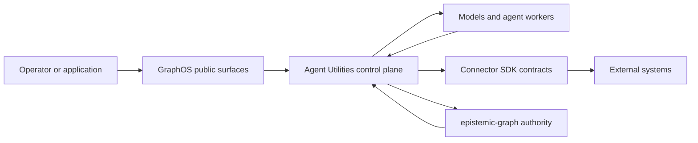

# Agent Utilities

The Python control plane for building, coordinating, evaluating, and improving
AI agents. Agent Utilities turns goals into governed work, connects models and
skills, carries execution context, and records outcomes through stable ecosystem
contracts.

[](https://pypi.org/project/agent-utilities/)
[](https://pypi.org/project/agent-utilities/)
[](https://pypi.org/project/agent-utilities/)
[](https://pypi.org/project/agent-utilities/)
[](https://pypi.org/project/agent-utilities/)
[](https://pypi.org/project/agent-utilities/)
[](https://github.com/Knuckles-Team/agent-utilities/actions/workflows/release.yml)
[](https://knuckles-team.github.io/agent-utilities/)
[](https://github.com/Knuckles-Team/agent-utilities/stargazers)
[](https://github.com/Knuckles-Team/agent-utilities/forks)
[](https://github.com/Knuckles-Team/agent-utilities/graphs/contributors)
[](LICENSE)
[](https://github.com/Knuckles-Team/agent-utilities/commits/main)
[](https://github.com/Knuckles-Team/agent-utilities/pulls)
[](https://github.com/Knuckles-Team/agent-utilities/pulls?q=is%3Apr+is%3Aclosed)
[](https://github.com/Knuckles-Team/agent-utilities/issues)
[](https://github.com/Knuckles-Team/agent-utilities)
[](https://github.com/Knuckles-Team/agent-utilities)
[](https://github.com/Knuckles-Team/agent-utilities)
[](https://github.com/Knuckles-Team/agent-utilities)

*Version: 2.5.0*

## Overview

Agent Utilities is the **agent control plane and harness**. It owns the runtime
that turns an authenticated goal into model and agent work:

- agent construction, model selection, skills, and tool binding;
- planning, routing, teams, workflows, loops, and execution policy;
- session context, identity propagation, budgets, approvals, and safety gates;
- evaluation, replay, reward signals, outcome capture, and governed evolution;
- harness telemetry, health signals, replay controls, and operator workflows.

The neighboring projects have deliberately separate responsibilities:

| Project | Responsibility |
|---|---|
| [epistemic-graph](https://github.com/Knuckles-Team/epistemic-graph) | Durable graph, query, reasoning, ontology, schema, provenance, and work-state authority |
| [graph-os](https://github.com/Knuckles-Team/graph-os) | Public MCP, REST, A2A, authentication, deployment, and service-composition runtime |
| [agent-connector-sdk](https://github.com/Knuckles-Team/agent-connector-sdk) | Source transport, pagination, credentials, conflict handling, and write-back contracts |
| [agent-webui](https://github.com/Knuckles-Team/agent-webui) | Browser interface for the GraphOS API |

Those boundaries keep graph truth, transport, public composition, and agent
behavior independently testable. The
[capability status](https://knuckles-team.github.io/agent-utilities/status/)
is the authority for what is available in each release.

## Install

Agent Utilities requires Python 3.12 or newer.

```bash
pip install agent-utilities
```

For a self-contained GraphOS serving environment:

```bash
pip install "agent-utilities[serving]"
```

Optional integrations are grouped by extra so a control-plane install does not
silently acquire heavyweight model-training dependencies. See the
[installation guide](https://knuckles-team.github.io/agent-utilities/guides/installation/)
for supported extras and platform notes.

## Quick start

Create an agent with the model provider configured in AgentConfig:

```python
from agent_utilities import create_agent

agent, toolsets = create_agent(
    name="assistant",
    skill_types=["universal", "graphs"],
)

result = agent.run_sync("Summarize the work assigned to this session.")
print(result.output)
```

Generate a local profile, validate its identity boundary, and launch the MCP
composition service:

```bash
setup-config generate --profile tiny
agent-utilities-doctor --only graph_identity auth
graph-os --transport stdio
```

The `tiny` profile supervises the packaged epistemic-graph engine over a private
local transport. Network transports and non-tiny profiles require configured
external identity; failed identity acquisition does not fall back to local
authority.

For an end-to-end walkthrough, continue with
[Quick Start](https://knuckles-team.github.io/agent-utilities/guides/quick-start/).

## Architecture


```mermaid
flowchart LR
    Client[Operator or application] --> GraphOS[GraphOS public surfaces]
    GraphOS --> AU[Agent Utilities control plane]
    AU --> Models[Models and agent workers]
    AU --> SDK[Connector SDK contracts]
    AU --> EG[epistemic-graph authority]
    SDK --> Sources[External systems]
    EG --> AU
    Models --> AU
```

Agent Utilities proposes and coordinates work. GraphOS admits and exposes it.
The connector SDK communicates with external systems. Epistemic Graph validates,
persists, queries, and reasons over committed state. Public transports do not
reimplement the control plane, and the control plane does not become a second
database or connector stack.

## Key capabilities

- **Agent runtime** — Pydantic-AI construction, provider selection, structured
  outputs, content guardrails, toolsets, and reusable skills.
- **Orchestration** — graph planning, routing, multi-agent teams, durable loops,
  checkpoints, budgets, and approval-aware execution.
- **Context and memory coordination** — bounded context compilation and typed
  reads and writes through epistemic-graph contracts.
- **Evaluation and improvement** — eval corpora, replay, outcome scoring,
  preference signals, failure analysis, and review-gated evolution proposals.
- **Governance** — server-minted identity, capability scopes, action policy,
  tenant isolation, auditable traces, and fail-closed safety decisions.
- **Operations** — harness health checks, workers, metrics, tracing, runtime
  configuration, and evaluation evidence.

The complete, release-aware inventory lives in the
[capability catalog](https://knuckles-team.github.io/agent-utilities/capabilities/).

## Capability map

<!-- BEGIN GENERATED: concepts -->

Synthesized from concept markers in the codebase into **1229 canonical concepts** across **9 pillars**.

> Generated from [`docs/concepts.yaml`](docs/concepts.yaml); see [`docs/status.md`](docs/status.md) for the release-aware breakdown and [`docs/pillars/`](docs/pillars/) for the architecture map.

<!-- END GENERATED: concepts -->

Concept markers connect implementation, tests, and documentation. Counts are
generated from `docs/concepts.yaml`; maturity and availability are reported in
the [status registry](https://knuckles-team.github.io/agent-utilities/status/).

## Documentation

- [Documentation home](https://knuckles-team.github.io/agent-utilities) —
  start here, choose a consumption model, and understand the runtime.
- [Architecture](https://knuckles-team.github.io/agent-utilities/architecture/)
  — current component boundaries and flows.
- [Guides and recipes](https://knuckles-team.github.io/agent-utilities/guides/)
  — agents, orchestration, deployment, connectors, and operations.
- [Deployment configurations](https://knuckles-team.github.io/agent-utilities/guides/deployment-configurations/)
  — supported GraphOS runtime profiles from local evaluation to multi-host use.
- [API reference](https://knuckles-team.github.io/agent-utilities/reference/api/)
  — generated Python surface.
- [Runtime configuration](https://knuckles-team.github.io/agent-utilities/reference/runtime-configuration/)
  — generated settings catalog.
- [Status](https://knuckles-team.github.io/agent-utilities/status/) — generated
  capability and maturity registry.
- [For AI agents](https://knuckles-team.github.io/agent-utilities/for-ai-agents/)
  — repository orientation and task entry points.

`AGENTS.md` is contributor and automation guidance, not product documentation.
Operational explanations live on the documentation site so this README remains
a stable entry page.

## Development

Read [CONTRIBUTING.md](CONTRIBUTING.md) and [AGENTS.md](AGENTS.md) before making
changes. Add tests at the appropriate unit, wiring, contract, or live-path
level, update the owning documentation, and run the repository's normal gates
before submitting a pull request.

```bash
python3 scripts/uv_workspace.py run --all-extras pytest -q
python3 scripts/safe_precommit_all_files.py
```

Report vulnerabilities privately through
[GitHub Security Advisories](https://github.com/Knuckles-Team/agent-utilities/security/advisories/new).

## License

Agent Utilities is released under the [MIT License](LICENSE).
