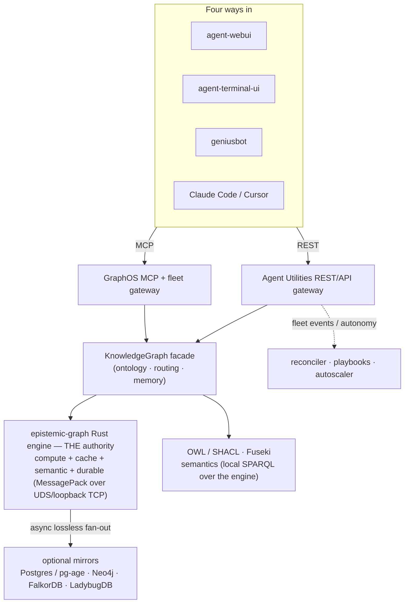

# Agent Utilities


*Version: 1.27.1*

> **New here?** Read **[docs/start-here.md](docs/start-here.md)** — one page: what
> this is, the three ways to use it, and the zero-infra knowledge graph. For AIs,
> **[llms.txt](llms.txt)** is the entry index. Full docs are
> [published here](https://knuckles-team.github.io/agent-utilities/).

> 🤖 **AI agents — this repo is self-deploying.** If you were pointed here to set it
> up: read the **[🚀 Zero-to-deployed](AGENTS.md#-zero-to-deployed-genesis--deploying-this-for-an-operator)**
> procedure in `AGENTS.md`, loop **[`genesis.yaml`](genesis.yaml)**, and run the
> `agent-utilities-deployment` skill. Ask the operator one question — *local/self-hosted or
> enterprise?* — and take it from there.

> 🧰 **Install the skills first — they unlock how to use everything else.** Once
> `agent-utilities` is installed, run **`agent-utilities install`** to drop the
> ten consolidated workflow skills—seven domain workflows plus development,
> deployment, and evolution platform workflows—into a validated provider-owned XDG
> generation and every detected calling agent tool (Claude Code, etc.). With no flags
> it installs into detected tools; `--tool claude`
> or `--path <dir>` targets one. `agent-utilities-doctor` flags it if the toolkit is
> missing.

The suite is structurally checked and ships a 20-case runtime certification
contract: one direct and one GraphOS-delegated case per skill. A release is
certified only after those cases pass in its target environment. See the
**[skill-suite validation contract](docs/guides/kg-skill-suite.md#validation)**;
the validator writes the reviewable matrix to the deployment-owned report path
selected for that exact release.

## 🚀 Deploy in one command

Point yourself (or any agent) at this repo, or just run:

```bash
# macOS / Linux
curl -fsSL https://knuckles-team.github.io/agent-utilities/install.sh | sh

# Windows (PowerShell)
irm https://knuckles-team.github.io/agent-utilities/install.ps1 | iex
```

The installer checks your host, installs agent-utilities, drops the skill toolkit
into every AI tool you have (Claude Code, Cursor, Codex, Windsurf, …), wires the
knowledge-graph MCP server, and hands off to a guided deployment. Pick your shape:

| You are… | Profile | What you get |
|---|---|---|
| A local/self-hosted operator | `tiny` | Zero-infra, all-local. No databases, no Docker. |
| One durable server | `single-node-prod` | Postgres/pg-age + the core MCP connector fleet. |
| An enterprise | `enterprise` | Multi-host deployment, **everything wired** — secrets, SSO, DNS, ingress, observability, and the governed 65-package capability fleet. |

```bash
curl -fsSL https://knuckles-team.github.io/agent-utilities/install.sh | sh -s -- --profile enterprise
```

→ Full procedure: **[Zero-to-deployed](AGENTS.md#-zero-to-deployed-genesis--deploying-this-for-an-operator)** · manifest: **[`genesis.yaml`](genesis.yaml)**.

## ⚡ What it is

`agent-utilities` is a **batteries-included harness for building Pydantic-AI
agents** that ship with a knowledge graph, orchestration, memory, and tools. The
**zero-infra default needs no separately managed database or service** — GraphOS
supervises the bundled Rust engine as an out-of-process child over a private local
transport. Use it three ways:

| You want to… | Use | Start |
|---|---|---|
| Build a standalone agent in Python | **Library** | `from agent_utilities import create_agent` |
| Give an existing agent (Claude Code/Cursor/yours) the KG + tools | **MCP `graph-os`** | `uvx --refresh --from "agent-utilities[serving]>=1.27.1,<2.0.0" graph-os` |
| Share one KG backend across many clients/containers | **MCP HTTP / REST gateway** | `uvx --refresh --from "agent-utilities[serving]>=1.27.1,<2.0.0" graph-os --transport streamable-http` / `python -m agent_utilities` (REST, default `:9000`) |

→ Full trade-offs: **[Consumption Models](docs/guides/consumption-models.md)**.

Execution provenance uses one privacy-safe, numeric-cursor schema across runtime,
evaluation, mining, placement, and context assembly. See the
**[Trace and Outcome Ontology](docs/architecture/trace_outcome_ontology.md)**.

The repository-manager manifest now materializes a **65-package capability fleet**:
one comprehensive canonical skill per package, with 64 governed source connectors
carrying signed ontology/certification bundles and exact live tool-schema pins. See
the generated **[Ecosystem Capability and Skill Fleet](docs/ecosystem-capability-fleet.md)**.

For production, the signed **[production cell](docs/operations/production-cell-runbook.md)**
uses a three-member MultiRaft authority, independently autoscaled dispatch/ingest/
analytics workers, strict workload-identity mTLS, coordinator-aware backup/restore,
and a 24–72 hour scale=1 **[release certification](docs/release/compatibility-and-certification.md)**.
Connector promotion also requires the generic, signed
**[live-certification harness](docs/release/connector-live-certification.md)** to prove
real tool-schema compatibility plus fixture ingest/update/delete/replay, governance,
SHACL, and count reconciliation without retaining source content or deployment details.
The committed deployment retains metadata and opaque HMAC references only; trace
content, raw identities, endpoints, host names and filesystem locations are excluded
from operational evidence.

Memento memory also uses opaque durable source references and privacy-sanitized content. Raw
conversation retention is off by default and has no plaintext mode: the optional path requires an
explicit versioned approval plus a secrets-backend key reference and stores authenticated encrypted
blocks only. See **[Mementified Context Management](docs/pillars/2_epistemic_knowledge_graph/KG-2.20-Mementified_Context_Management.md)**.

All LLM calls now cross the **[Mandatory ContextCompiler Boundary](docs/architecture/mandatory-context-compiler.md)**:
the verified graph session is enforced before retrieval, evidence is compiled
and cited for streaming and non-streaming calls, and cache/persistence identity
uses opaque references rather than prompts, identities, endpoints, or paths.
Native program optimization follows the same rule: prompt blueprints, proposals,
manifests, graph records, and commit messages retain validated compiled metadata and
opaque demonstration/evidence/component references only. Governed examples are resolved
in memory for one execution, bounded as untrusted data, and never copied into an evolution
artifact. See the [self-evolution flywheel](docs/architecture/self-evolution-flywheel.md).

### The 30-second mental model

All four surfaces talk to one gateway; the gateway owns one knowledge-graph facade;
the facade fronts **one engine — the authority** (a fast Rust engine that does
compute, cache, semantics, AND durable persistence). Writes fan out to optional
durable mirrors. Everything below the gateway is shared — the surfaces are just
different windows onto the same brain.


```mermaid
flowchart TD
    subgraph Surfaces["Four ways in"]
        WEB[agent-webui] & TUI[agent-terminal-ui] & GB[geniusbot] & IDE[Claude Code / Cursor]
    end
    Surfaces -->|MCP| MCP["GraphOS MCP + fleet gateway"]
    Surfaces -->|REST| REST["Agent Utilities REST/API gateway"]
    MCP --> KG["KnowledgeGraph facade<br/>(ontology · routing · memory)"]
    REST --> KG
    KG --> ENG["epistemic-graph Rust engine — THE authority<br/>compute + cache + semantic + durable (MessagePack over UDS/loopback TCP)"]
    ENG -->|async lossless fan-out| MIR["optional mirrors<br/>Postgres / pg-age · Neo4j · FalkorDB · LadybugDB"]
    KG --> OWL["OWL / SHACL · Fuseki<br/>semantics (local SPARQL over the engine)"]
    REST -. fleet events / autonomy .-> FLEET["reconciler · playbooks · autoscaler"]
```

## ⚡ 5-Minute Quickstart

```bash
pip install "agent-utilities[serving]"  # GraphOS + full engine; no external service required
```

Point it at any model provider through AgentConfig and runtime secret references,
then create an agent — skills, tools, and the supervised Rust KG included:

```python
from agent_utilities import create_agent

agent, toolsets = create_agent(name="assistant", skill_types=["universal", "graphs"])
print(agent.run_sync("What can you do?").output)
```

### Stand it up and verify — 3 commands, no separately managed service

```bash
setup-config generate --profile tiny     # complete config.json (every option)
agent-utilities-doctor --only graph_identity auth
graph-os --transport stdio                # KG MCP server — no database or IdP needed
```

The generated file records `DEPLOYMENT_PROFILE` explicitly. `APP_PROFILE`
controls runtime safety posture and is not used to guess topology. This exact
tiny, packaged-local stdio path mints a neutral bootstrap session entirely in
memory from a one-time ephemeral proof. The proof key and JWT are destroyed
before the process-lifetime session is returned. Network transports, non-tiny
profiles, and explicit engine endpoints use external identity instead.

Scale up (`--profile single-node-prod`/`enterprise`), add Stardog + pg-age, or let
Claude set itself up — all in the **[Quick Start](docs/guides/quick-start.md)** and
**[Self-Setup](docs/guides/self-setup.md)** guides.

### Use the knowledge graph natively — for free, no database

```python
from agent_utilities.mcp import kg_server   # epistemic-graph is always the authority

# Add knowledge...
await kg_server._execute_tool("graph_write", action="add_node",
    node_id="svc:payments", node_type="Service",
    properties='{"team":"fintech","tier":"critical"}')

# ...and query it back through GraphOS; the bundled Rust child is supervised for you.
res = await kg_server._execute_tool("graph_query",
    cypher="MATCH (n:Service) WHERE n.tier='critical' RETURN n")
```

→ The full capability catalog (search, ingest, orchestrate, ontology, memory) is
in **[docs/capabilities.md](docs/capabilities.md)**; runnable code is in the
[reference agent](examples/reference_agent/).

> **Heads-up — this is two repos.** The heavy graph compute lives in a **separate**
> Rust engine, [`epistemic-graph`](https://github.com/Knuckles-Team/epistemic-graph)
> (reached out-of-process over MessagePack UDS/loopback TCP — **no PyO3**).
> `agent-utilities` ships a pure-Python client and the approved wheel supplies
> the server binary, so you do not need a local Rust toolchain to get started.
> Contributing? See [CONTRIBUTING.md](CONTRIBUTING.md).

## Table of Contents

- [The Technical Novel: Narrative Journey](docs/journey.md)
- [Overview](#overview)
- [Key Features](#key-features)
- [Intelligence Graph](#-intelligence-graph)
- [First Principles Architecture](#-first-principles-architecture)
- [Concept Map](#-concept-map)
- [Architecture & Orchestration](#architecture--orchestration)
- [Multi-Model Config & Secret Storage](#multi-model-config--secret-storage)
- [Installation](#installation)
- [Quick Start](#quick-start)
- [Creating an Agent](#creating-an-agent)
- [Building MCP Servers](#building-mcp-servers--api-wrappers)
- [API Documentation](#api-documentation)
- [Documentation](#documentation)
- [Contributing](#contributing)
- [License](#license)

## 🧭 Roadmap & Vision

> This section is **aspirational direction**, not shipped behavior — it's here so
> you know where the project is heading. For what works *today*, see
> [Capabilities](docs/capabilities.md).

The direction beyond a single agent harness is **distributed agentic evolution**:
agents that learn from their own failures (the [harness-engineering pillar](docs/pillars/3_agentic_harness_engineering.md)
ships the evolution loop today) and, over time, contribute reusable breakthroughs
— new skills, TeamConfigs, refined prompts — back to a shared knowledge graph so
improvements compound across agents. The building blocks that exist now (unified
KG, capability auto-activation, cross-agent protocols) are the substrate; the
"agents improving each other at scale" end-state is roadmap.

Designed-but-not-yet-running roadmap items (designs/specs exist; do not expect
these to work out of the box today):

- **[Media Generation & Transcription](docs/pillars/4_ecosystem_peripherals/ECO-4.30-Media_Generation_Gateway.md)** (CONCEPT:AU-ECO.toolkit.media-gateway-failure-path/4.31): Self-hosted image (`flux.2` + Stable Diffusion 3.5), video (`hunyuanvideo`), speech synthesis (`xtts`), and transcription (`faster-whisper`) exposed as agent tools under the `MEDIA_TOOLS` gate — requires the corresponding self-hosted model services to be deployed.
- **[In-House Training Substrate](docs/architecture/in_house_training_substrate.md)**: Fine-tune the framework's own open-weight models end-to-end — a deterministic reward/data engine, torch/PEFT SFT/DPO/GRPO trainers (`data-science-mcp[training]`), a pure-Rust loss/optimizer performance path (`epistemic-graph`), checkpoint→reliability-suite eval hooks, and a model-registry role deploy seam. Training hardware and model roles are selected at runtime.

## Key Features

Grouped by what they do. Each line links to the deep-dive; the full catalog with
every concept ID is in **[docs/guides/features.md](docs/guides/features.md)**.

**🧠 Knowledge graph & memory** — the zero-infra core.
**One engine — the authority** (native Rust: compute + cache + OWL semantics +
durable persistence; writes fan out to optional Postgres/pg-age, Neo4j, FalkorDB,
LadybugDB mirrors) with **[Schema-Pack domain profiles](docs/pillars/2_epistemic_knowledge_graph/KG-2.37-Research_State_Domain_Pack.md)**
(KG-2.22–2.37: zero-LLM typed-edge extraction, transitive/inverse OWL closure,
bitemporal `as_of` recall) over a **[high-performance Rust compute engine](docs/pillars/5_agent_os_infrastructure/OS-5.5-Massive_Scale_Architecture.md)**
(MessagePack over UDS/loopback TCP, **no PyO3**; measured ~52 kB/agent — see the
[capacity model](docs/scaling/capacity_model.md) for the honestly-projected 100M figure).
**Benchmarked against a conventional stitched memory stack** (separate vector DB + BM25 +
app-level fusion, no KV cache, no warm-fork), this unified memory matches recall (**1.000**)
while retrieving **~3.6× faster**, reuses cross-modal context across an agentic fan-out with
**`retrieval_calls == 1`** instead of *N* (the `crossmodal_fork` warm-fork path), keeps writes
**read-fresh in ~26 ms** (incremental, not full-rebuild), and survives a restart via a **durable
KV cold-tier (100% survival, >300× vs recompute)** — full scorecard + reproduction in the
[Phase-2 benchmark report](https://github.com/knuckles-team/epistemic-graph/blob/main/docs/benchmarks.md#phase-2-agent-memory--kv-cache-benchmark-measured).

**🗂 Ontology system (Palantir-Foundry parity, graph-native)** — the structured layer.
**[Objects, links, interfaces, value/property types, derived properties, functions,
action types, durable edits, object sets & fine-grained permissioning](docs/pillars/2_epistemic_knowledge_graph.md#ontology-system-palantir-foundry-parity)**
(KG-2.26, 2.38–2.48) — OWL/SHACL-backed, reified many-to-many links, bitemporal edit
history, exposed over `ontology_*` MCP tools and the web-UI Object Explorer.
A **[vendor-neutral ArchiMate upper ontology](docs/architecture/vendor_neutral_enterprise_ontology.md)**
makes ServiceNow↔ERPNext↔Camunda interchangeable in one query.

**🔀 Orchestration & self-evolution** — how work gets planned and improved.
**[Spec-Driven Development](docs/guides/features.md#spec-driven-development-sdd-lifecycle)**,
**[emergent architecture](docs/guides/features.md#emergent-architecture-conceptkg-20-through-conceptorch-12)**
(capability auto-activation, TeamConfig coalitions),
**[global-workspace attention](docs/architecture/global_workspace_attention.md)** over
multi-agent waves, **[ontology-to-workflow execution](docs/pillars/1_graph_orchestration.md)**
(KG-2.52/53, ORCH-1.41–43: lift a descriptive process into an executable plan), and
**[governed evolution-to-branch publication](docs/guides/autonomous-evolution.md)**
(AU-AHE.harness.failure-evolution–21: propose-only, governance + regression gated, **never auto-pushed**).

**🏢 Enterprise integration (Company Brain)** — getting your systems in.
A **[document-source connector framework](docs/pillars/4_ecosystem_peripherals/ECO-4.25-Document_Source_Connector_Framework.md)**
(ECO-4.25–4.32, AU-KG.ingest.mcp-tool-connector) — native Postgres/filesystem/REST/web-crawl, with **every
other system riding the ~58-server MCP fleet** via the universal `mcp_tool` source —
feeding the **[6-layer Company Brain runtime](docs/architecture/company_brain_runtime.md)**
(mandatory trust-decay conflict resolution, field-level survivorship, data ACLs
+ tenant scoping, and human-correction→rule→eval feedback).

**📈 Scale-out planes (all opt-in; default stays zero-infra)** — how it grows.
**[Externalized durable state](docs/architecture/state_externalization.md)** (one
`STATE_DB_URI`, AU-OS.state.unified-durable-state-externalization–18), **[tenant-sharded engines](docs/architecture/engine_sharding.md)**
(engine-authoritative placement epochs and MultiRaft groups), **[Kafka ingest scale-out](docs/architecture/event_backbone_architecture.md)**
(KG-2.55–57, fail-loud), **[queue-driven agent dispatch](docs/architecture/agent_dispatch.md)**
(ORCH-1.45), and **[gateway scaling + Prometheus `/metrics`](docs/architecture/gateway_scaling.md)**
(AU-OS.observability.no-op-without-metrics, per-tenant rate limits, circuit breakers, `GATEWAY_WORKERS`).

**⚡ Inference & numeric acceleration (all opt-in)** — reuse compute instead of recomputing it.
**[KV-cache layering (vLLM → LMCache → epistemic-graph)](docs/guides/kvcache-vllm-lmcache.md)** — pool
and dedup vLLM's KV cache into the engine so inference workers share prefill by token-hash: the
**universal `LMCacheMPConnector`** (dense **and** hybrid Mamba/GDN) over an **L1 CPU + L2 engine** tier
stack (`EpistemicGraphL2Connector` AU-KG.backend.lmcache-native-connector / `EpistemicGraphKVBackend` KG-2.306 → engine EG-185/186/187),
steered per-execution by a **[dynamic KV-layering policy](docs/architecture/kv-cache-layering-policy.md)**
(ORCH-1.105: cache-worthiness scoring). Plus the numeric **`xp` numpy-shim** (`agent_utilities/numeric/`, AU-KG.compute.surface-analytics-program) — a numpy-compatible namespace
that routes reductions/linalg/random through the BLAS/LAPACK-free epistemic-graph numeric kernel (Surface A
of the engine's [Analytics Program](https://knuckles-team.github.io/epistemic-graph/architecture/numeric-kernel/),
AU-KG.compute.numeric-kernel). The kernel is the **sole numeric backend** (AU-KG.compute.numpy-scipy-drop): the shim is **kernel-or-raise** — numpy is
removed from agent-utilities entirely (imported/declared nowhere) and survives only as the kernel's internal
rust-numpy dependency.

**🛡 Autonomy & governance** — how it acts safely.
A **[fleet-autonomy control plane](docs/architecture/fleet_autonomy.md)** (AU-OS.config.fleet-event-ingress,
5.24–27, 5.29: `POST /api/fleet/events` → fail-closed **ActionPolicy** gate → reconciler,
remediation playbooks, health-gated deploy-watch + rollback, reactive autoscaler),
**[server-minted identity & fail-closed permissioning](docs/architecture/gateway_scaling.md)**
(OS-5.14, JWT `ActorContext`, HMAC engine auth), enterprise mutation governance, and a
**[hardened MCP fleet gateway built into graph-os](docs/pillars/4_ecosystem_peripherals.md)** (AU-ECO.mcp.profile-differences-from-client:
on-demand fleet loading with per-child limits, circuit breakers, restart-on-crash).

Shipped but lightly documented (real code, importable today):

- **Causal reasoning**: structural-causal-model types, d-separation, and formal reasoning over KG subgraphs — `agent_utilities/knowledge_graph/core/formal_reasoning_core.py`.
- **Skill compiler** (CONCEPT:AU-ORCH.execution.parallel-engine-visualizer): compiles `SKILL.md` prose (+ optional `references/team.yaml`) into executable `GraphPlan` workflows — `agent_utilities/workflows/skill_compiler.py`.
- **Evolutionary memory & aggregation** (CONCEPT:AU-KG.memory.tiered-memory-caching): the self-curating CRUD insight/skill memory banks (`agent_utilities/harness/evolving_memory.py`) plus the global-workspace score→select→broadcast aggregation over multi-agent waves (`agent_utilities/graph/workspace_attention.py`).
- **KG auto-routing**: the strategy-based router (`agent_utilities/graph/routing/` — fast-path, workflow-context, and policy strategies) backed by capability designation + reward write-back (`agent_utilities/knowledge_graph/retrieval/capability_index.py`).
- **Reactive framework** (CONCEPT:AU-ORCH.reactive.event-sourcing-ledger): graph-native event sourcing, dynamic behavioral dispatch, and multi-axis budget guardrails — `agent_utilities/graph/reactive/`.

> 📖 **[View the Comprehensive Feature List & Architecture Deep Dives](docs/guides/features.md)**

## 🗺 Concept Map

→ **Full Concept Map**: [docs/concept_map.md](docs/concept_map.md) — canonical concept registry.
→ **Single Source of Truth**: [docs/concepts.yaml](docs/concepts.yaml) — machine-generated registry of every concept marker in code.
→ **Concept Index**: [docs/overview.md](docs/overview.md#concept-index) — all pillars with descriptions and code paths.

<!-- BEGIN GENERATED: concepts -->

Synthesized from concept markers in the codebase into **978 canonical concepts** across **8 pillars**.

> This count and the table below are generated from `docs/concepts.yaml` by `scripts/gen_docs.py`. Do not edit by hand.

| Pillar | ID Range | Count | Focus |
|:------|:---------|:---:|:------|
| **AU-AHE** AU-AHE | AU-AHE.assimilation.baseline-overfit-gate – AU-AHE.harness.ahe-3 | 102 | the expert agent writes one per decision; a nightly distill, empirical parity evidence for the assimilation program, merge entities, closes the priors→weights loop, consider promoting the team, microstructure, trading, pricing, grade every ingested research source against the, concrete subclasses |
| **AU-ECO** AU-ECO | AU-ECO.bus.agent-bus-awareness – AU-ECO.messaging.eco-2 | 119 | agent-to-agent messaging. Governed by the ActionPolicy, graph_bus MCP tool and REST twin for agent-to-agent messaging, AgentBus federated agent-to-agent communication bus over the KG, auto-register + online presence on any bus touch, bus register under the served auth profile, ────────────────────────, required engine-broker or Kafka log, the AgentBus is a NATIVE capability, not an opt-in persona |
| **AU-KG** AU-KG | AU-KG.audit.hash-chain-verify – AU-KG.backend.cache-lives-as-248 | 418 | routes to the engine, the durable PostgreSQL graph tier executed via a bounded regex, the authority is the single shared, The authority has already acked; this must not wait on the, vector search competes for the same pool under load;, the cache lives as, wrap with the Company Brain write-path guard, Role-aware multi-database registry plus live config mutation |
| **AU-ORCH** AU-ORCH | AU-ORCH.adapter.adapter-registry-path-detection – AU-ORCH.twin.agent-digital-twin | 186 | Adapter registry + non-blocking PATH detection, Built-in adapter definitions, BYOK custom endpoint. The provider proxy emits OpenAI-compatible, Composable Skills + Generic Environment Adapter, Invalidate hot cache so routing reflects new self-knowledge, inject mounted composable-Skill instructions, Session ID of the parent graph if this state was forked, additive multi-CLI adapter dispatch. When a manifest requests an external runtime |
| **AU-OS** AU-OS | AU-OS.audit.config-staleness-auditor – AU-OS.deployment.os-4 | 127 | Configuration Staleness Auditor, recursive-improvement velocity tracker that surfaces whether the loop is still improving and flags a non-positive derivative as a research-gets-harder signal, Agent OS Infrastructure, Agent Registry, autonomous spec→develop. OFF by default = review-first, Data Type Conversion, Desired-state fleet reconciler, Env-var drift guard |
| **EG-AHE** EG-AHE | EG-AHE.harness.online-exploit-explore-reference | 1 | one online exploit/explore bandit router per agent |
| **EG-KG** EG-KG | EG-KG.backend.is-configured-so-co – EG-KG.compute.concept-5 | 24 | is configured with, so a co-located deploy shares one source of, and generates summary text via the shared, through the facade so orchestration code, handled outside the single-anchor, model-free similar-code lookup. Returns the, Empty => no recency weighting, to turn each project, the type/scope-resolved call/inheritance graph |
| **EG-ORCH** EG-ORCH | EG-ORCH.routing.lexical-capability-escalation | 1 | CONCEPT |

<!-- END GENERATED: concepts -->

## 🏗️ Architecture & Pillar Reference

The detailed architectural diagrams and deep-dive documentation for `agent-utilities` have been moved to their respective Pillar documentation pages in `/docs`.

* **[1. Graph Orchestration & Planning](docs/pillars/1_graph_orchestration.md)**
  * *Contains: First Principles Architecture, SDD Lifecycle, Execution Flow (Dynamic Multi-Layer Parallelism).*
* **[2. Epistemic Knowledge Graph](docs/pillars/2_epistemic_knowledge_graph.md)**
  * *Contains: Graph-OS Native Ingestion Pipeline, MAGMA Reasoning Views, Persistent Task Tracking.*
* **[3. Agentic Harness Engineering](docs/pillars/3_agentic_harness_engineering.md)**
  * *Contains: Self-Models, Evolution, Evaluation.*
* **[4. Ecosystem Peripherals](docs/pillars/4_ecosystem_peripherals.md)**
  * *Contains: graph-os MCP Tools, Server Endpoints, MCP Loading & Registry Architecture.*
* **[5. Agent OS Infrastructure](docs/pillars/5_agent_os_infrastructure.md)**
  * *Contains: Human-in-the-Loop Tool Approval, Process Lifecycle, Auth/Security.*
* **[6. GeniusBot Desktop Cockpit](docs/pillars/6_geniusbot_cockpit.md)**
  * *Contains: Premium Systems Cockpit, swappable plugins tab matrix, sandboxed terminal widget, visual finance trading dashboard.*
* **[C4 Architecture Diagrams](docs/pillars/architecture_c4.md)**
  * *Contains: Ecosystem Dependency Graph, C4 Container Diagram, Cross-Pillar Data Flows.*
* **[Memory Architecture](docs/pillars/memory_architecture.md)**
  * *Contains: Multi-Timescale Memory, Memento Context Management, Observational Memory Bridge.*
* **[Company Brain Runtime](docs/architecture/company_brain_runtime.md)**
  * *Contains: the 6-layer model wired end-to-end — mandatory trust/conflict resolution & field-level survivorship, data permissions/tenancy/audit, feedback→rule→eval, retrieval budget, and streams.*
* **[Vendor-Neutral Enterprise Ontology](docs/architecture/vendor_neutral_enterprise_ontology.md)**
  * *Contains: the canonical ArchiMate crosswalk, vendor adapters, code→capability realization, and virtual REST federation.*
* **[Multi-Tenant graph-os over Streamable-HTTP](docs/architecture/multi_tenant_streamable_http.md)**
  * *Contains: hierarchical org→user isolation, private-by-default + commons/markings sharing, the five isolation layers (identity → named-graph → scope/visibility → Postgres RLS → audit), tenant-scoped fleet, and the elastic per-tenant engine pool.*

## Codex GraphOS registration

Register the platform through Codex's native MCP command: **run `setup-config
codex`**, or invoke `codex mcp add graph-os -- graph-os --transport stdio`
directly. Codex owns the resulting `config.toml` entry; agent-utilities does not
write a parallel Codex JSON file. You only need **one** server: **`graph-os`**.
It serves its own Knowledge-Graph/engine tools
(always on) **and** is the MCP fleet gateway — it loads any other MCP server declared in
its `MCP_CONFIG` fleet file **on demand** via the built-in `find_tools` / `list_catalog` /
`load_tools` / `unload_tools` / `multiplexer_status` tools, so hundreds of fleet tools stay
out of context until you ask for them. GraphOS is the only server entry point.

### Self-hosted, self-contained installation — the engine ships with GraphOS

This is the default and the simplest: an installed **`graph-os` console entry point is a
complete, fully-capable Knowledge Graph MCP server with no external services.** The
`epistemic-graph` engine is a **base dependency**. The canonical release contract requires
every approved wheel to be the **full CPU build** (`MATURIN_FEATURES=full,ast-extended` —
compute/finance/datascience/mining/graphlearn/reasoning, SQL/Cypher,
redb-authoritative durability, security, and every wire protocol), with the folded numeric
kernel and `epistemic-graph-server` binary bundled. Release and consumer CI import the kernel
and execute a real operation; do not deploy an artifact that fails that gate. (The GPU/ROS2
`full-extras` layer is
deliberately excluded — it needs an external CUDA/robotics toolchain, which would defeat
"self-contained.") On
first call graph-os **autostarts and supervises a local engine over a private Unix-domain
socket on Unix or authenticated loopback TCP on Windows** (`EngineResolver`,
CONCEPT:AU-OS.deployment.engine-resolver-auto-provision), durable
by default (redb persists to the XDG data dir, so an acked write survives a restart), and
**reference-counted idle-shutdown** so it self-stops when the last client disconnects. No
separately managed database, host daemon, or Docker — just the one stdio process:

```bash
codex mcp add graph-os -- graph-os --transport stdio
```

Durable transaction recovery is encrypted on every packaged-local start. A
non-production `tiny` deployment atomically creates one stable private XDG data
key with mode `0600` beneath a validated `0700` directory and reuses it across
restarts. Production and every non-tiny
local deployment instead require `EPISTEMIC_GRAPH_ENCRYPTION_KEY_REF` to point to
an external `env://` or `vault://` bootstrap source. AgentConfig stores only that
reference; the launcher validates the resolved value and places it only in the
Rust child environment. Ambient raw keys and references are never inherited.
Configured remote engines own their data-key lifecycle. `agent-utilities-doctor
--only engine` reports only the source category and readiness, never the
reference, material, or local location.

Install the approved wheel set into an immutable runtime and put its `bin` directory on the
launcher's `PATH`. The client configuration then remains machine-neutral: it names
`graph-os`, not an installation path. `uvx --refresh --from
"agent-utilities[serving]>=1.27.1,<2.0.0" graph-os` is still useful
as a package-on-demand quickstart, but it is not the pinned self-hosted deployment shown
above unless `--from` is constrained to an approved version.

The MCP entry is deliberately machine-neutral. Graph authority is never embedded
in a launcher file. With `DEPLOYMENT_PROFILE=tiny`, no
`GRAPH_SERVICE_ENDPOINTS`, and neither `KG_AUTH_TOKEN_REF` nor
`KG_IDENTITY_OAUTH2` configured, this exact stdio entry uses the zero-infrastructure
local authority. GraphOS creates an in-memory asymmetric key, signs and validates
a short-lived JWT through the normal verifier, then destroys both proof key and
token before returning a process-lifetime `GraphSession`. Its fixed claims
identify only a neutral local service; no user name, host name, endpoint,
filesystem path, credential, or proof material is represented or persisted.

Every network transport, non-tiny profile, explicit engine endpoint, or explicit
external identity configuration requires exactly one external process-identity
source in XDG AgentConfig. The recommended external source mints a short-lived JWT:

```json
{
  "KG_IDENTITY_OAUTH2": {
    "token_url": "https://identity.example.test/oauth2/token",
    "client_id": "graph-os-stdio",
    "client_secret": "secret://graph-os/stdio-client-secret",
    "audience": "agent-services"
  },
  "AUTH_JWT_JWKS_URI": "https://identity.example.test/.well-known/jwks.json",
  "AUTH_JWT_AUDIENCE": "agent-services",
  "KG_POLICY_VERSION": "current"
}
```

Environments that provision a JWT outside graph-os may instead configure only
`KG_AUTH_TOKEN_REF` (for example `secret://graph-os/stdio-token`). Raw tokens and
client secrets are rejected as durable configuration. Run
`agent-utilities-doctor --only graph_identity auth secrets` before launch; graph-os
aborts startup if token acquisition, JWKS validation, tenant authority, audience,
or policy pinning is missing. A configured-but-invalid source never falls back to
the local authority.

The verified process session scopes background engine bootstrap and maintenance.
External stdio authority is always bounded by the validated token expiry. GraphOS
renews that authority from the configured source before expiry and shares only a
thread-safe in-memory expiry lease with captured worker sessions; it never stores
the token in the lease. A renewal that changes subject, actor type, capabilities,
tenant, authentication state, or groups is rejected. Failed renewal is retried,
but the existing lease is never extended: once it expires, new tools and
background graph work fail closed until the same authority can be renewed.
Network requests still require their own validated Bearer identity and never fall
back to process or local authority.

Only the literal validated capability `kg:admin`, whether present in the token or
produced by `IDENTITY_GROUP_CAPABILITY_MAP`, grants graph administration. A
generic application role named `admin` never grants `kg:admin`. Unauthenticated
HTTP liveness is limited to the documented health paths; those responses contain
only `{"status":"ok"}` and send `Cache-Control: no-store`. Readiness, topology,
and component detail remain authenticated surfaces.

Omitting
`GRAPH_SERVICE_ENDPOINTS` selects the zero-infra path where graph-os provisions
the packaged engine itself. (Optional:
inject `GRAPH_SERVICE_PERSIST_DIR` at runtime to select a durable store, or set
`MCP_CONFIG` to point at a fleet file so `find_tools`/`load_tools` can mount other `*-mcp`
servers on demand.)

Every AgentConfig profile uses bounded lazy graph recovery. GraphOS always
starts the engine in catalog-first mode, with
`EPISTEMIC_GRAPH_MAX_RESIDENT_GRAPHS=256`,
`EPISTEMIC_GRAPH_LAZY_OPEN_PAGE_SIZE=4096`, and
`EPISTEMIC_GRAPH_MAX_NODES_PER_GRAPH=250000`. Generated production profiles may retain
up to 1024 resident graphs while keeping the same per-graph node bound. The production
profile guard rejects eager/unbounded values, and an autostarted engine receives the
resolved typed settings.
During recovery, GraphOS surfaces the engine's explicit partial-materialization state;
availability is published only after the durable source snapshot and maintained-index
manifests are complete and fresh.

> **"Same process"?** The engine runs **out-of-process** — an auto-spawned child over a
> private MessagePack UDS/loopback-TCP transport, **not** an in-process PyO3 extension (that coupling was
> removed on purpose to stay GIL-free and horizontally scalable). It is nonetheless
> **self-contained** once the approved artifact passes the full/numeric release gate: one
> install brings the wheel + the `epistemic-graph-server` binary,
> graph-os owns its whole lifecycle (autostart → supervise → idle-stop), and it needs no
> external service. Concurrent local GraphOS processes reuse the same authenticated,
> host-local engine when its default transport is already serving; a transport-keyed
> spawn guard prevents duplicate engines from racing on one durable store. Give an
> instance a distinct runtime-resolved endpoint and persistence root only when deliberate
> isolation is required. This is a self-contained **installation**, not
> a claim that the Python GraphOS entry point and Rust engine are one native executable.
> (`[full-extras]` — the engine's GPU/ROS2 layer
> — is deliberately **not** pulled: it needs an external CUDA/robotics toolchain to run,
> which would defeat "self-contained," and it is a wheel build variant, not a pip extra.)

### Shared engine (split-storage / Keycloak-protected fleet)

To instead point many clients at **one shared** `epistemic-graph` node (e.g. a fast-NVMe host)
and a Keycloak-protected `*-mcp` fleet, set the engine-connection + fleet-auth groups:

```bash
codex mcp add graph-os -- graph-os --transport stdio
```

The corresponding XDG AgentConfig owns engine topology, trust, and credential
references. Generate it with `setup-config`; the following uses only neutral
documentation values:

```json
{
  "GRAPH_SERVICE_ENDPOINTS": ["tls://engine.example.test:9100"],
  "ENGINE_TLS_PROFILE_REF": "secret://runtime/engine-tls",
  "MCP_CLIENT_AUTH": "oidc-client-credentials",
  "OIDC_ISSUER": "https://identity.example.test/realms/agents",
  "OIDC_CLIENT_ID": "graph-os",
  "OIDC_CLIENT_SECRET_REF": "secret://runtime/graph-os-client-secret",
  "OIDC_AUDIENCE": "agent-services"
}
```

`ENGINE_MODE`, `ENGINE_ENDPOINT`, and `EPISTEMIC_GRAPH_AUTOSTART` are retired and
rejected. `GRAPH_SERVICE_ENDPOINTS` is the sole topology selector: a configured
list is connect-only; absence selects the supervised packaged engine. The secret
manager resolves trust and credential refs only inside the process. Keep concrete
connection values out of the client launcher; require TLS for the issuer and a
protected transport for a remote engine. This lets one neutral launcher entry move
between hosts.

**One server, `graph-os`** — its built-in fleet loader (`attach_fleet_loader`) owns
on-demand connector discovery and loading.

> **Shared instance vs single-user — same engine, same fleet.** Interactive clients
> (Claude Code, opencode, agents) use the **single-user stdio** form above: each spawns its
> *own* local `graph-os` that performs the OIDC client-credentials flow (they can't mint the
> gateway JWT themselves). Deployed/service clients use the **shared instance** at
> a runtime-injected GraphOS URL. Both are the *same* graph-os where it matters —
> `GRAPH_SERVICE_ENDPOINTS` points every client at the one shared engine, and `MCP_CONFIG` at the one
> canonical fleet list. See [Consumption Models](docs/guides/consumption-models.md).

AgentConfig groups:

- **Core:** `MCP_TOOL_MODE` (`intent`|`condensed`|`verbose`|`both`) and the
  runtime-resolved `MCP_CONFIG` fleet catalog. Do not persist its machine location
  in a launcher or report. Ask
  `find_tools("<what you need>")` then `load_tools(servers=[...])` to pull fleet tools in live.
- **Engine connection (split-storage / remote engine):**
  `GRAPH_SERVICE_ENDPOINTS=tls://<engine-host>:9100` +
  `ENGINE_TLS_PROFILE_REF=<secret-ref>` point graph-os at a
  shared `epistemic-graph` engine (e.g. the fast-NVMe node) instead of autostarting a local
  one. The profile supplies private trust and optional mTLS identity without
  persisting local certificate paths. Any configured endpoint list is
  connect-only. **Omit `GRAPH_SERVICE_ENDPOINTS`** for the
  zero-infra default, where graph-os autostarts a local engine.
- **Fleet auth (only when the `*-mcp` fleet is Keycloak-protected):** graph-os mints a
  **Keycloak client-credentials** bearer and attaches it to every child call —
  `MCP_CLIENT_AUTH=oidc-client-credentials`, `OIDC_ISSUER` (token endpoint auto-discovered),
  `OIDC_CLIENT_ID`, `OIDC_CLIENT_SECRET_REF` (resolved from the configured secret backend),
  and `OIDC_AUDIENCE`. Eunomia enforces per-principal authorization server-side.

> **Note:** Model selection, routing logic, and system configuration are centralized in
> the XDG configuration. Persist only neutral aliases and secret references; concrete
> workspace locations, endpoints, and credentials remain runtime-injected values.

## Multi-Model Config & Secret Storage

All LLM providers, model registries, safety guardrails, and scheduler policies are managed centrally through the XDG AgentConfig.

AgentConfig is the durable source of truth. A deployment may inject a process-scoped
override for an operational value, but resolved credentials, tokens, trust material,
endpoints, identities, and machine paths are never copied back into the file.

### Minimal `config.json`

You only need to declare your model providers; every other field has a sensible
default. A minimal working config:

```json
{
  "chat_models": [
    {"id": "chat-default", "provider": "openai", "base_url": "https://chat-model.example.invalid/v1",
     "api_key_ref": "env://CHAT_MODEL_API_KEY",
     "tools_enabled": true, "can_route": true, "can_kg": true}
  ],
  "embedding_models": [
    {"id": "embedding-default", "provider": "openai", "base_url": "https://embedding-model.example.invalid/v1",
     "api_key_ref": "env://EMBEDDING_MODEL_API_KEY"}
  ]
}
```

> Every `config.json` key maps 1-to-1 to an uppercase environment-variable override
> (`default_agent_name` → `DEFAULT_AGENT_NAME`). JSON has no comments — keep notes in
> the guides. The **fully-populated production template** (auth, secrets, routing,
> scheduler, OTEL/Langfuse, A2A, sampling) lives in
> [docs/examples/config.json](docs/examples/config.json).

### Runtime secret references

AgentConfig never searches a checkout for a dotenv file. Put only `env://`,
`vault://`, or `secret://` references in durable configuration. For a local
`env://` source, the optional filename is fixed as `runtime-secrets.json` beside
the XDG `config.json`; no path setting is accepted. The source must be a bounded
regular JSON object and, on POSIX, owned by the current user or root with exact
mode `0600` or `0400`. Native Windows uses explicit process injection; private
file sources fail closed until an ACL-aware descriptor implementation is available.

Only values targeted by an exact `env://NAME` reference anywhere in the AgentConfig
document are projected. Explicit process values win. Invalid files and invalid
reloads fail closed without reporting paths, target names, references, or values;
doctor exposes aggregate status and counts only. See the
[secret and authentication guide](docs/guides/secrets-auth.md).

Durable model entries use `api_key_ref` and `headers_ref` (or OAuth2 with a
referenced `client_secret`). Raw API-key fields and literal header maps are rejected
in XDG configuration; resolved values exist only during runtime client construction.
The engine encryption bootstrap is intentionally stricter: because an
engine-backed `secret://` value cannot unlock the same engine, configure
`EPISTEMIC_GRAPH_ENCRYPTION_KEY_REF` with `env://` or `vault://` only.

For comprehensive definitions and capabilities of specific variables, see the [Configuration Guide](docs/guides/configuration.md) and [Local Secret Storage Guide](docs/guides/secrets-auth.md). The authoritative **per-flag inventory and audit** (every `KG_*`/`GRAPH_*`/`EPISTEMIC_*` flag, its default, and whether it should exist at all) is [docs/architecture/configuration.md](docs/architecture/configuration.md).


## Installation

Install via pip:

```bash
pip install agent-utilities
```

The base package always requires `epistemic-graph[full]`, including the folded
numeric kernel and full CPU engine artifact. For the supported self-contained
GraphOS runtime, install the serving composition:

```bash
pip install "agent-utilities[serving]"
```

To install with all optional dependencies (including MCP servers, UI, and external graph backends):

```bash
pip install "agent-utilities[all]"
```

For more details, see the [Installation Guide](docs/guides/installation.md).

### Zero-infrastructure by default

Out of the box, agent-utilities runs as a **single self-contained install with no
external *service* dependencies** (no database or graph server to stand up;
Python package dependencies still apply). The default knowledge-graph backend is
`epistemic_graph` — the always-included Rust-native engine that is **the one
authority** (compute + cache + semantic + durable persistence). No Postgres/Neo4j
server is required to get started.

To add a durable PostgreSQL **projection** in production (for interop/BI/DR),
name the mirror — fan-out activates automatically, the engine stays the read
authority, and Postgres receives the replicated write stream:

```json
{
  "GRAPH_MIRROR_TARGETS": ["relational-graph"],
  "KG_CONNECTIONS": [
    {
      "name": "relational-graph",
      "backend": "age",
      "connection_profile_ref": "secret://graph-connections/relational-graph"
    }
  ]
}
```

External Neo4j/openCypher, AGE, LadybugDB/Kuzu, remote epistemic-graph, and
GraphQL document sources share the reference-only
`graph_configure add → discover → propose → approve → ingest` lifecycle. The
[Universal External Graph Connectors guide](docs/architecture/universal-external-graph-connectors.md)
defines the generic secret-document contracts; the repository bundles no
environment endpoint, authentication material, source query, schema profile, or
custom ontology.
GraphQL can bootstrap from connection/auth/TLS references alone when
`allow_introspection=true`: it generates only bounded read operations and
structural mappings, then requires exact-digest approval before ingestion.

Langfuse uses the same reference-only posture. Configure `LANGFUSE_HOST`, both
credential references, and `LANGFUSE_TLS_PROFILE_REF` in AgentConfig. Once both
credentials resolve, the native Langfuse MCP child and propose-only failure
evolution enable automatically unless explicitly disabled. Trace export, content
capture, and KG auto-ingestion remain explicit opt-ins; graph persistence also
requires an independent HMAC-key reference. Verify trust and a bounded,
metadata-only trace round trip with `agent-utilities-doctor --only langfuse` and
`agent-utilities-doctor --live`. See
[Usage, Cost, and Observability](docs/guides/observability-usage-tracking.md).

## Deployment

Full deployment instructions — running `graph-os` (the KG server + built-in MCP fleet
gateway) as a standard **stdio** or **streamable-http** server, the centralized REST API
gateway, Docker composes, and production hardening — are in the
**[Deployment Guide](docs/guides/deployment.md)**. The flagship
**[Deployment Configurations](docs/guides/deployment-configurations.md)** guide
walks every shape from the zero-infra laptop default to a sharded,
queue-driven, policy-governed fleet (`STATE_DB_URI`, `GRAPH_SERVICE_ENDPOINTS`,
`TASK_QUEUE_BACKEND`, `AGENT_TURNS_PARTITIONS`, `AGENT_DISPATCH_MAX_DEPTH`,
`AGENT_DISPATCH_CLAIM_TTL_S`, `AGENT_DISPATCH_RENEW_INTERVAL_S`,
`GATEWAY_WORKERS`).

The entry points are intentionally distinct: `graph-os` serves MCP and its on-demand
fleet catalog, `graph-os-daemon` is a headless queue/maintenance host with no HTTP
API, and `python -m agent_utilities` serves the agent plus centralized REST/API
gateway.

> **Already deployed and want to turn the enterprise/autonomy capabilities on?**
> They ship off-by-default so the laptop experience stays zero-infra. The
> **[Enterprise Enablement Runbook](docs/guides/enterprise-enablement-runbook.md)**
> is the ordered push → deploy → flag-enablement sequence (security → state → sharding
> → brain → autonomy), each stage independently reversible and verified.

> **Serving thousands of tenants over streamable-HTTP?** The
> **[Multi-Tenant graph-os](docs/architecture/multi_tenant_streamable_http.md)**
> architecture covers hierarchical org→user isolation, private-by-default sharing
> with explicit commons/markings promotion, full tenant-stamped audit, and the
> elastic per-tenant engine pool — with ready-to-edit k8s and Swarm manifests in
> [`deploy/`](deploy/README.md).

## Quick Start

You can quickly launch the graph-os MCP server (a thin FastMCP wrapper):

```bash
uvx --refresh --from "agent-utilities[serving]>=1.27.1,<2.0.0" graph-os                       # stdio (default)
uvx --refresh --from "agent-utilities[serving]>=1.27.1,<2.0.0" graph-os --transport streamable-http --host 127.0.0.1 --port 8004
```

The HTTP quick start is loopback-only. A non-loopback MCP listener requires a
configured JWT/OIDC provider and trusted TLS termination; unauthenticated remote
binding fails closed by default.

Or start the standalone agent from your code:

```python
from agent_utilities.core.config import config
from agent_utilities.agent.factory import create_agent

# Configuration is automatically loaded from config.json
agent = create_agent(name="MyAgent")
response = agent.run_sync("Analyze the knowledge graph for recent updates.")
print(response.data)
```

For a comprehensive walkthrough, see the [Quick Start Guide](docs/guides/quick-start.md).

## 📚 Guides & Tutorials

For detailed tutorials, installation options, and configuration guides, refer to the `docs/guides/` directory:

* **[Quick Start](docs/guides/quick-start.md)**
* **[Installation Guide](docs/guides/installation.md)**
  * *Bare-metal, pip packages, Docker*
* **[Deployment Guide](docs/guides/deployment.md)**
  * *Zero-infra default, graph-os (KG + built-in fleet gateway, stdio/streamable-http), API gateway, production hardening*
* **[Configuration & Environment Variables](docs/guides/configuration.md)**
  * *Multi-tiered LLM setup, Models Config; the per-flag audit lives in [docs/architecture/configuration.md](docs/architecture/configuration.md)*
* **[Universal External Graph Connectors](docs/architecture/universal-external-graph-connectors.md)**
  * *Bounded schema discovery, digest-bound mapping approval, and governed ingestion for property graphs, remote engines, and GraphQL*
* **[Usage, Cost, and Observability](docs/guides/observability-usage-tracking.md)**
  * *Langfuse trust, metadata-only tracing, live doctor proof, and explicit persistence gates*
* **[Pre-bundled Workflow Skill Suite](docs/guides/kg-skill-suite.md)**
  * *Exactly ten skills with a twenty-case direct/delegated certification matrix*
* **[Secret Storage (Encrypted Engine, Vault & OpenBao)](docs/guides/secrets-auth.md)**
* **[Creating an Agent](docs/guides/creating-an-agent.md)**
* **[Building MCP Servers & API Wrappers](docs/guides/building-mcp-servers.md)**
* **[API Documentation & Swagger](docs/guides/development.md)**

## 🌌 The Technical Novel

> [!NOTE]
> Prefer a story to config tables? **[The Immersive Narrative Journey (docs/journey.md)](docs/journey.md)**
> traces `agent-utilities` live through the lifecycle of a high-stakes quantitative
> rebalancing mandate — a guided tour of the whole platform in motion.

## Documentation

The shared agent/engine control contracts are defined by the
[Epistemic Operations Protocol](docs/architecture/epistemic-operations-protocol.md):
twelve strict, current-only schemas with deterministic Python/Rust field and
digest parity, opaque identifiers, and content-addressed references.

Comprehensive system documentation is available in the [`docs/`](docs/) directory:

> **New to the project?** Start with the [**Concept Overview Map**](docs/overview.md) to get oriented.

### Core References

| Guide | Description |
| :--- | :--- |
| [Overview Map](docs/overview.md) | The Concept Galaxy — canonical concepts (see the Concept Map above for the authoritative count), query lifecycle, concept index |
| [Concept Map](docs/concept_map.md) | Canonical concept registry (single source of truth) |
| [C4 Architecture](docs/pillars/architecture_c4.md) | System context, container, and component diagrams |
| [Company Brain Runtime](docs/architecture/company_brain_runtime.md) | The 6-layer brain wired end-to-end with mandatory trust/survivorship, tenant/ACL permissioning, feedback→rule→eval, and retrieval budgeting |
| [Vendor-Neutral Enterprise Ontology](docs/architecture/vendor_neutral_enterprise_ontology.md) | ArchiMate crosswalk + vendor adapters making ServiceNow↔ERPNext↔Camunda interchangeable |
| [Global Workspace Attention](docs/architecture/global_workspace_attention.md) | GWT loop: score→select→broadcast specialist proposals + `get_attention_score` read-back + engine-mismatch telemetry |
| [Multi-Agent Social System](docs/architecture/multi_agent_social_system.md) | Swarm as `S=(f,g,G)`: archetypes, local observability, co-evolution, P1–P4 swarm health |
| [In-House Training Substrate](docs/architecture/in_house_training_substrate.md) | **Roadmap** — cross-repo design: reward/data engine → torch/PEFT trainers → Rust kernels → runtime-selected deploy seam |
| [Graph-Native Assimilation Engine](docs/architecture/assimilation_engine.md) | Self-evolution loop: ingest papers/OSS/repos/docs → dedup → gap → synergy → rank → grounded plans; idempotent, runs via `graph_evolution(action="assimilate")` + golden-loop daemon |
| [Evolution Pipeline](docs/overview.md#evolution-pipeline--super-assimilation-architecture) | Assimilation governance, wire-or-discard heuristic, 4-phase pipeline |
| [State Externalization](docs/architecture/state_externalization.md) | `STATE_DB_URI` shared Postgres state, SKIP LOCKED queue claims, advisory-lock daemon leadership, fleet pagination (AU-OS.state.unified-durable-state-externalization–5.18, AU-KG.ingest.cross-host-safe-kg) |
| [Engine Sharding](docs/architecture/engine_sharding.md) | Engine-authoritative placement catalog, epochs, fencing, MultiRaft groups, and governed movement |
| [Event Backbone](docs/architecture/event_backbone_architecture.md) | Kafka event backbone + ingest task-queue scale-out: fail-loud selection, keyed partitions, `kg-ingest` consumer group (KG-2.55–2.57) |
| [Agent Dispatch](docs/architecture/agent_dispatch.md) | Queue-driven agent dispatch: session-keyed `agent_turns` queue + stateless worker fleet (ORCH-1.45) |
| [Fleet Autonomy](docs/architecture/fleet_autonomy.md) | ActionPolicy decision point, fleet reconciler, remediation playbooks, deploy watch, autoscaler (OS-5.24–5.27, OS-5.29) |
| [Gateway Scaling](docs/architecture/gateway_scaling.md) | `GATEWAY_WORKERS` pre-fork, per-tenant rate limiting, engine circuit breaker, Prometheus `/metrics` (AU-OS.observability.no-op-without-metrics) |
| [Autonomous Evolution](docs/guides/autonomous-evolution.md) | The governed self-evolution chain: propose-only loops → governance validator → regression gate → policy-gated branch publication (AU-AHE.harness.failure-evolution–3.21) |
| [Universal External Graph Connectors](docs/architecture/universal-external-graph-connectors.md) | Reference-only connection aliases, bounded discovery, digest-bound mapping approval, drift checks, and ChangeEnvelope ingestion |
| [Failure-Driven Evolution](docs/architecture/failure_driven_evolution.md) | Langfuse read/write integration, verified private trust, metadata-only defaults, and propose-only remediation |
| [Usage, Cost, and Observability](docs/guides/observability-usage-tracking.md) | Usage analytics, Langfuse configuration, live trace proof, and privacy gates |
| [Native Program Optimization](docs/architecture/evolvable_surface.md) | Engine-owned durable optimization jobs and governed promotion evidence |
| [Workflow Skill Suite](docs/guides/kg-skill-suite.md) | Exactly ten current skills and the twenty-case direct/GraphOS-delegated validation contract |
| [Metrics Reference](docs/reference/metrics.md) | Catalog of every `agent_utilities_*` Prometheus series |

### Pillar Deep-Dives

| Pillar | Guide |
| :--- | :--- |
| Graph Orchestration | [docs/pillars/1_graph_orchestration.md](docs/pillars/1_graph_orchestration.md) |
| Epistemic Knowledge Graph | [docs/pillars/2_epistemic_knowledge_graph.md](docs/pillars/2_epistemic_knowledge_graph.md) |
| Agentic Harness Engineering | [docs/pillars/3_agentic_harness_engineering.md](docs/pillars/3_agentic_harness_engineering.md) |
| Ecosystem & Peripherals | [docs/pillars/4_ecosystem_peripherals.md](docs/pillars/4_ecosystem_peripherals.md) |
| Agent OS Infrastructure | [docs/pillars/5_agent_os_infrastructure.md](docs/pillars/5_agent_os_infrastructure.md) |

## Contributing

Contributions are welcome. Please follow these guidelines:

1. **Fork** the repository and create a feature branch.
2. **Write tests** for new functionality — all tests must include assertions.
3. **Follow existing patterns** — use the established Pydantic models, structured prompts, and concept markers.
4. **Run the test suite** before submitting: `uv run pytest tests/ -q`.
   > **Note:** All tests are strictly bounded by a 60-second timeout via `pytest-timeout`. Any test that sleeps or hangs indefinitely will fail automatically. Ensure you don't use `time.sleep` without bounds.
5. **Update documentation** in `docs/` if your changes affect public APIs.

See [AGENTS.md](AGENTS.md) for project-specific conventions and architecture rules.

## License

This project is licensed under the terms specified in the [LICENSE](LICENSE) file.
